# 37. Travel & Booking Systems

## Part Context
**Part:** Part 5 - Real-World System Design Examples
**Position:** Chapter 37 of 60
**Why this part exists:** This section translates distributed-systems theory into realistic product designs across consumer apps, marketplaces, media, payments, search, notifications, collaboration, infrastructure, and operations-heavy platforms.

---

## Overview
Travel and booking systems combine search, inventory, pricing, reservations, and itinerary workflows. They are correctness-sensitive because inventory is scarce, but they also require fast reads and multi-step user experiences.

This chapter groups booking, pricing, seat or room allocation, and trip planning so the learner can reason about reservation safety in a highly integrated domain.

This chapter performs a deep-dive into **five subsystems** that together form a complete travel booking platform:

### Subsystem 1 — Flight Booking System
GDS integration (Amadeus, Sabre, Travelport), fare search and shopping, PNR creation, ticketing, schedule changes, codeshare handling, and NDC (New Distribution Capability) support.

### Subsystem 2 — Hotel Booking System
OTA integration, room inventory management, rate parity enforcement, channel manager, instant vs. request booking, cancellation policies, and property content management.

### Subsystem 3 — Seat Allocation System
Seat maps, real-time seat availability, premium seat pricing, group bookings, aircraft change handling, and seat assignment optimization.

### Subsystem 4 — Dynamic Pricing Engine
Yield management, demand forecasting, competitor pricing, fare classes, booking curves, promotional pricing, and revenue optimization.

### Subsystem 5 — Itinerary Planner
Multi-leg trip assembly, cross-modal transport, calendar integration, trip sharing, offline access, real-time disruption handling, and document management.

Every section is written to be useful for learners building mental models, engineers designing production systems, and candidates preparing for system design interviews.

---

## Why This Domain Matters in Real Systems
- Travel systems are excellent for learning inventory contention and workflow orchestration.
- They depend on external provider integrations and sometimes legacy reservation systems.
- The domain shows how search and booking correctness interact directly in one user journey.
- It also highlights policy-heavy cancellation and modification flows.
- GDS systems (Amadeus, Sabre, Travelport) are among the oldest and most complex distributed transaction systems still in production, processing billions of transactions per year.
- Travel pricing is one of the most sophisticated dynamic pricing domains, with fare classes, booking curves, yield management, and real-time competitor monitoring.
- The domain requires multi-currency, multi-language, multi-timezone, and multi-regulatory-regime support from day one.
- Travel booking is one of the highest-value online transaction categories, with average order values of $500-$5,000 for a typical trip.

---

## Real-World Examples and Comparisons
- This domain repeatedly appears in systems such as Booking.com, Expedia, Airbnb, Amadeus, IRCTC.
- Startups typically collapse many of these capabilities into a smaller number of services, while platform-scale companies split them into specialized ownership boundaries with stronger internal contracts.
- The architectural shape changes across B2C, B2B, and regulated deployments, but the key trade-offs around latency, correctness, and operability remain recognizable.

---

## Problem Framing

### Business Context

A mid-to-large online travel agency (OTA) serves millions of monthly active users across web and mobile. The platform aggregates flights from GDS providers and direct airline connections, hotels from channel managers and direct property integrations, and ancillary services. Revenue depends on booking volume, commission rates, and ancillary attach rates. The business operates across multiple countries with localized pricing, currency, tax, and regulatory requirements.

Key business constraints:
- **Revenue loss from search failures**: Every second of search latency reduces conversion by 1-2%. A search outage means zero bookings.
- **Double-booking destroys trust**: Confirming a flight or hotel and then cancelling due to inventory error is worse than showing "sold out" upfront.
- **GDS fees are significant**: Each search request to a GDS costs $0.01-0.10. Uncontrolled search volume can consume margins.
- **Schedule changes are constant**: Airlines change schedules for 10-20% of booked flights, requiring automated re-accommodation.
- **Regulatory pressure**: PCI-DSS for payments, GDPR/CCPA for passenger data, IATA regulations for ticketing, and consumer protection laws for cancellations.
- **Fraud in travel is expensive**: Average fraudulent travel booking is $1,000-$3,000, far higher than typical e-commerce fraud.

### System Boundaries

This chapter covers the **core booking and planning path**: from search through booking confirmation, itinerary management, and post-booking handling. It does **not** deeply cover:
- Payment processing internals (covered in Chapter 19: Fintech & Payments)
- Recommendation and personalization ML (covered in Chapter 27: ML & AI Systems)
- Customer support ticketing (separate operational system)
- Loyalty program point accrual and redemption mechanics (integration points are identified)

However, each boundary is identified with integration points and API contracts.

### Assumptions

- The platform handles **5 million daily active users** and **200,000 daily bookings** at steady state.
- Peak traffic during holiday seasons reaches **5x steady state** (~50,000 concurrent search sessions).
- The platform aggregates **500+ airlines** via GDS and direct connect, and **1 million+ hotel properties** via channel managers.
- The system operates across **3 geographic regions** (Americas, EMEA, APAC) with data residency requirements.
- Payment processing is delegated to external PSPs via gateway abstraction.
- GDS integration uses both legacy XML/SOAP (Amadeus, Sabre) and modern NDC JSON/REST APIs.

### Explicit Exclusions

- Airline reservation system (PSS) internals
- Hotel property management system (PMS) internals
- Loyalty program engine internals (integration points covered)
- Customer support and dispute resolution system
- Marketing automation and email campaign engine
- Mobile app architecture (treated as an API consumer)

---

## Glossary / Abbreviations

| Term | Definition |
|------|-----------|
| GDS | Global Distribution System — intermediary connecting travel providers to agencies (Amadeus, Sabre, Travelport) |
| PNR | Passenger Name Record — the core booking record in airline systems |
| NDC | New Distribution Capability — IATA standard for direct airline-to-retailer distribution |
| OTA | Online Travel Agency — platform selling travel products from multiple providers |
| PMS | Property Management System — hotel's internal reservation and operations system |
| CRS | Central Reservation System — hotel chain's centralized booking system |
| ARS | Airline Reservation System / Passenger Service System (PSS) |
| IATA | International Air Transport Association |
| BSP | Billing and Settlement Plan — IATA's payment settlement between airlines and agents |
| ADM | Agency Debit Memo — airline charge-back to agent for fare discrepancies |
| RBD | Reservation Booking Designator — single-letter fare class code (Y, B, M, etc.) |
| Fare basis | Coded string describing the fare rules, class, season, and restrictions |
| E-ticket | Electronic ticket record replacing paper tickets |
| EMD | Electronic Miscellaneous Document — covers ancillaries like baggage, seat upgrades |
| Channel manager | Software distributing hotel inventory to multiple OTAs simultaneously |
| Rate parity | Contractual requirement for consistent pricing across distribution channels |
| BAR | Best Available Rate — the lowest unrestricted rate a hotel offers |
| RevPAR | Revenue Per Available Room — key hotel performance metric |
| Yield management | Dynamic pricing strategy maximizing revenue from perishable inventory |
| Booking curve | Historical pattern of how bookings accumulate before a departure date |
| Codeshare | Agreement where one airline markets another airline's flight under its own code |
| Interline | Agreement allowing passengers to travel on multiple airlines with a single ticket |
| ARNK | Arrival Unknown — gap in an itinerary where surface transport is used |
| PCC | Pseudo City Code — identifies a travel agency in a GDS |
| Segment | A single flight leg within an itinerary |
| Coupon | A portion of an e-ticket corresponding to one flight segment |
| SSR | Special Service Request — passenger-specific requirements (wheelchair, meal, etc.) |
| OSI | Other Service Information — free-text information in PNR |
| TTL | Ticketing Time Limit — deadline to issue ticket after booking |
| Waitlist | Queue for passengers waiting for inventory to open in a specific class |
| SLA / SLO / SLI | Service Level Agreement / Objective / Indicator |

---

## Actors and Personas

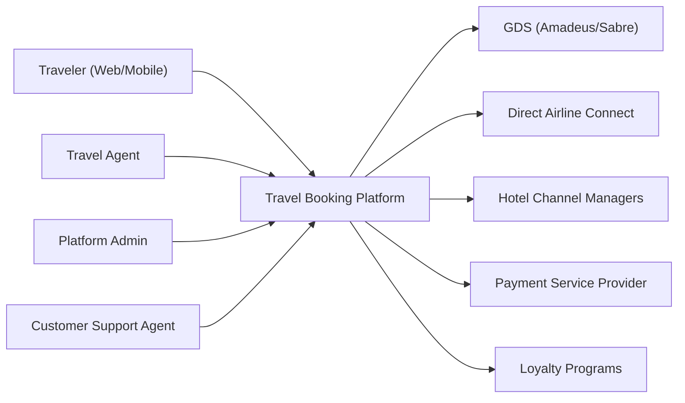
```mermaid
flowchart LR
    Traveler["Traveler (Web/Mobile)"] --> Platform["Travel Booking Platform"]
    Agent["Travel Agent"] --> Platform
    Admin["Platform Admin"] --> Platform
    CSAgent["Customer Support Agent"] --> Platform
    Platform --> GDS["GDS (Amadeus/Sabre)"]
    Platform --> Airlines["Direct Airline Connect"]
    Platform --> Hotels["Hotel Channel Managers"]
    Platform --> PSP["Payment Service Provider"]
    Platform --> Loyalty["Loyalty Programs"]
```

| Actor | Description | Key Workflows |
|-------|-------------|---------------|
| Traveler | End consumer booking flights, hotels, and packages | Search, compare, book, manage itinerary, cancel/modify |
| Travel Agent | B2B user booking on behalf of clients | Multi-PNR management, group bookings, corporate rates |
| Platform Admin | Internal operator managing the platform | Fare rules, supplier contracts, pricing overrides |
| Customer Support Agent | Handles post-booking issues | Re-accommodation, refunds, dispute resolution |
| Revenue Manager | Sets pricing strategy | Fare class allocation, promotional pricing, yield targets |
| Supplier (Airline/Hotel) | Provides inventory and content | Inventory updates, schedule changes, rate updates |

---

## Domain Architecture Map
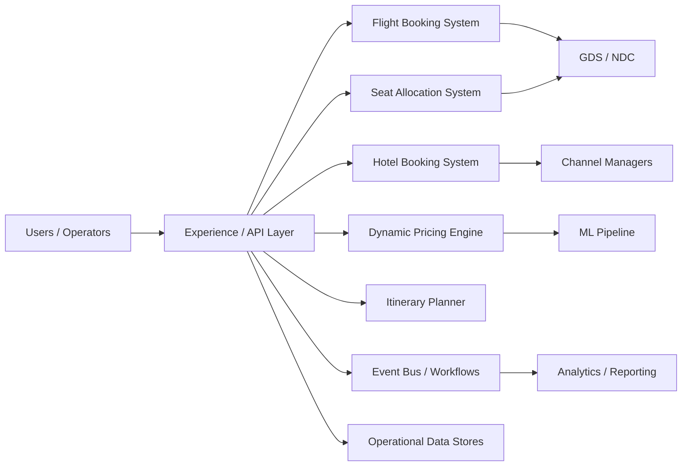
```mermaid
flowchart LR
    User["Users / Operators"] --> Entry["Experience / API Layer"]
    Entry --> flight-booking-sys["Flight Booking System"]
    Entry --> hotel-booking-syst["Hotel Booking System"]
    Entry --> seat-allocation-sy["Seat Allocation System"]
    Entry --> dynamic-pricing["Dynamic Pricing Engine"]
    Entry --> itinerary-planner["Itinerary Planner"]
    Entry --> Events["Event Bus / Workflows"]
    Events --> Analytics["Analytics / Reporting"]
    Entry --> Store["Operational Data Stores"]

    flight-booking-sys --> GDS["GDS / NDC"]
    hotel-booking-syst --> CM["Channel Managers"]
    dynamic-pricing --> ML["ML Pipeline"]
    seat-allocation-sy --> GDS
```

---

## Cross-Cutting Design Themes
- Separate user-facing hot paths from heavy asynchronous work such as analytics, indexing, compliance review, or backfills.
- Be explicit about which parts of the domain need strong correctness and which can tolerate eventual consistency.
- Model operator workflows and reconciliation early; real systems are maintained, not only executed.
- Use events and materialized views deliberately so teams can scale read models without overloading the transactional path.
- GDS integration is the single most expensive and fragile dependency; design caching, fallback, and circuit-breaking around it.
- Travel inventory is perishable; an unsold seat on a departed flight has zero residual value, which fundamentally shapes pricing and overbooking strategies.

---

## 37.1 Booking Platforms
37.1 Booking Platforms collects the boundaries around Flight Booking System, Hotel Booking System, Seat Allocation System and related capabilities in Travel & Booking Systems. Teams usually start with a simpler combined service, then split these systems once data ownership, latency goals, or operator workflows begin to conflict.

### Flight Booking System

#### Overview

Flight Booking System is the domain boundary responsible for orchestrating a multi-step workflow that spans validation, state transitions, external dependencies, and operator visibility. In Travel & Booking Systems, this system usually has to balance direct user experience with downstream effects on adjacent systems in 37.1 Booking Platforms.

The flight booking system integrates with Global Distribution Systems (Amadeus, Sabre, Travelport) and increasingly with direct airline connections via NDC. It manages the complete lifecycle from fare search through PNR creation, ticketing, and post-booking modifications. The system must handle codeshare flights, interline itineraries, and complex fare rules while maintaining sub-second search responses.

#### Real-world examples

- Comparable patterns appear in Booking.com, Expedia, Airbnb.
- Startups often keep Flight Booking System inside a larger service, while large platforms split it out once ownership, scale, or correctness requirements diverge.
- The exact implementation changes between B2C, B2B, and regulated variants, but the architectural boundary stays useful.

#### GDS vs. Direct Connect vs. NDC

| Aspect | GDS (Legacy) | Direct Connect | NDC |
|--------|-------------|----------------|-----|
| Protocol | XML/SOAP (EDIFACT-based) | Proprietary REST/SOAP | JSON/XML REST (IATA standard) |
| Content | Standard fares only | Full airline content including ancillaries | Rich content with merchandising |
| Cost | $2-6 per segment booking fee | Lower per-transaction cost | Lower distribution cost |
| Latency | 2-5 seconds per request | 1-3 seconds | 1-2 seconds |
| Coverage | 500+ airlines | Single airline | Growing airline adoption |
| Ancillaries | Limited (SSR-based) | Full | Full with rich media |
| Booking modifications | Standardized | Airline-specific | Standardized (newer) |
| Use case | Broad coverage OTAs | Airline-heavy OTAs | Next-generation distribution |

**Architecture implication**: Most platforms run a **multi-source aggregator** that queries GDS, direct connect, and NDC in parallel, normalizes results into a common fare model, deduplicates, and presents unified results. The aggregator must handle different response schemas, different booking flows, and different post-booking modification APIs.

#### Meta-search architecture

Meta-search engines (Skyscanner, Google Flights, Kayak) add another layer. They do not hold inventory but redirect users to OTAs or airlines. The architecture involves:
- **Redirect model**: User clicks through to OTA for booking. Revenue is per-click (CPC).
- **Deeplink API**: OTA provides API for meta-search to pass search context, ensuring price consistency at landing.
- **Cache warming**: Meta-search pre-fetches prices from OTAs to show results instantly.
- **Price accuracy**: Stale prices erode trust. OTAs must balance cache freshness against GDS query costs.

#### Requirements and workflows

- Expose APIs or events that let product users, internal operators, and downstream consumers create, update, query, and reconcile flight booking system state.
- Support synchronous user-facing flows for the hot path and asynchronous processing for enrichment, retries, and downstream propagation.
- Preserve a clear state model so support teams and automated workflows can explain why the system is in its current state.
- Provide audit or analytics hooks without coupling reporting latency to the primary user journey.

#### Architecture, data, and APIs

- Model the write path around workflow state, submitted forms, resource locks, side-effect intents, and audit events.
- Keep a normalized source of truth for critical state and publish derived read models or events for consumer services.
- Use caches, projections, or search indexes only for latency-sensitive reads; treat rebuildability as a design requirement.
- Define idempotent write contracts, versioned events, and explicit ownership boundaries so dependent systems can evolve safely.

#### Scaling, reliability, and operations

- Watch for partial success, duplicate submission, timeout ambiguity, and compensation complexity.
- Protect hot partitions with rate limiting, request coalescing, queue buffering, and selective denormalization where appropriate.
- Design operator dashboards, replay tooling, and reconciliation or backfill workflows before incidents force them into existence.
- Track service-level indicators for latency, success, queue lag, freshness, and correctness signals instead of only infrastructure health.

#### Trade-offs and interview notes

- The key interview move is to explain why Flight Booking System deserves its own boundary and what can remain eventual around it.
- Strong answers call out what requires strong correctness versus what can be computed asynchronously.
- Weak answers collapse storage, orchestration, and downstream fan-out into one service without discussing scale or failure modes.

### Hotel Booking System

#### Overview

Hotel Booking System is the domain boundary responsible for orchestrating a multi-step workflow that spans validation, state transitions, external dependencies, and operator visibility. In Travel & Booking Systems, this system usually has to balance direct user experience with downstream effects on adjacent systems in 37.1 Booking Platforms.

The hotel booking system integrates with channel managers, hotel CRS systems, and direct property connections. It manages room inventory across multiple distribution channels, enforces rate parity, handles instant confirmation vs. on-request booking models, and manages complex cancellation policies.

#### OTA vs. Direct Channel Architecture

| Aspect | OTA Distribution | Direct Channel |
|--------|-----------------|----------------|
| Inventory source | Channel manager (SiteMinder, RateGain) | Property PMS directly |
| Rate control | Hotel sets via extranet or channel manager | Hotel controls entirely |
| Commission | 15-25% of booking value | Zero (but marketing cost) |
| Content richness | Standardized photos and descriptions | Full brand experience |
| Loyalty integration | OTA loyalty program | Hotel's own loyalty |
| Cancellation | OTA policy wrapper around hotel policy | Hotel policy directly |
| Rate parity | Contractually required on most OTAs | Can offer best rate guarantee |

**Channel manager integration**: The platform connects to channel managers (SiteMinder, RateGain, D-EDGE) that synchronize availability and rates across all OTAs. When a booking is made on one channel, the channel manager decrements inventory across all channels. This creates a distributed consistency challenge: a room sold on Booking.com must be removed from Expedia within seconds to prevent double-booking.

#### Real-world examples

- Comparable patterns appear in Booking.com, Expedia, Airbnb.
- Startups often keep Hotel Booking System inside a larger service, while large platforms split it out once ownership, scale, or correctness requirements diverge.
- The exact implementation changes between B2C, B2B, and regulated variants, but the architectural boundary stays useful.

#### Requirements and workflows

- Expose APIs or events that let product users, internal operators, and downstream consumers create, update, query, and reconcile hotel booking system state.
- Support synchronous user-facing flows for the hot path and asynchronous processing for enrichment, retries, and downstream propagation.
- Preserve a clear state model so support teams and automated workflows can explain why the system is in its current state.
- Provide audit or analytics hooks without coupling reporting latency to the primary user journey.

#### Architecture, data, and APIs

- Model the write path around workflow state, submitted forms, resource locks, side-effect intents, and audit events.
- Keep a normalized source of truth for critical state and publish derived read models or events for consumer services.
- Use caches, projections, or search indexes only for latency-sensitive reads; treat rebuildability as a design requirement.
- Define idempotent write contracts, versioned events, and explicit ownership boundaries so dependent systems can evolve safely.

#### Scaling, reliability, and operations

- Watch for partial success, duplicate submission, timeout ambiguity, and compensation complexity.
- Protect hot partitions with rate limiting, request coalescing, queue buffering, and selective denormalization where appropriate.
- Design operator dashboards, replay tooling, and reconciliation or backfill workflows before incidents force them into existence.
- Track service-level indicators for latency, success, queue lag, freshness, and correctness signals instead of only infrastructure health.

#### Trade-offs and interview notes

- The key interview move is to explain why Hotel Booking System deserves its own boundary and what can remain eventual around it.
- Strong answers call out what requires strong correctness versus what can be computed asynchronously.
- Weak answers collapse storage, orchestration, and downstream fan-out into one service without discussing scale or failure modes.

### Seat Allocation System

#### System snapshot

Seat Allocation System is a high-signal system inside Travel & Booking Systems. The current repository already carried a deeper dedicated walkthrough for this topic, so that material is merged here and treated as the detailed reference path for this sub-subchapter.


#### Overview
Reservation systems handle scarce, time-bound inventory such as movie seats, train berths, flights, event tickets, or appointment slots. Users search availability, choose a specific inventory unit or class, reserve it briefly, pay, and expect confirmation that the reservation is real. Overselling is one of the most visible failures a digital product can produce.

This chapter is a strong capstone for Part 5 because it combines discovery, payment, strict correctness, and high-demand contention. It teaches when stronger consistency and queueing are worth the complexity, especially during flash-demand events such as concert sales or new route openings.


#### Why This Matters in Real Systems
- It highlights the difference between general commerce inventory and unique or near-unique reserved inventory.
- It forces discussion of contention, locking windows, expirations, and payment coupling.
- It shows why waiting rooms and virtual queues are often product features, not infrastructure accidents.
- It is a frequent interview topic because correctness and scale pressures are both obvious to users.

#### Core Concepts
##### Scarce inventory and hold windows
Reservations often involve a specific seat, slot, or limited class of inventory. Users need a short hold window to complete payment. That hold must expire automatically if payment does not complete. Modeling holds explicitly is essential because it balances fairness, utilization, and oversell prevention.


##### Search versus booking consistency
Availability search can usually be slightly stale, but booking confirmation cannot. Many designs therefore allow eventually consistent search indexes or caches while routing final seat or slot assignment through a stricter reservation service. This pattern resembles browse versus checkout in e-commerce, but with tighter contention.


##### Hot events and queueing
Concert tickets, festival passes, train tatkal releases, and sporting events create demand spikes far above normal levels. Waiting rooms, rate limits, and lottery-like queueing are often necessary to protect the reservation system from impossible burst load and to preserve fairness.


##### Payment coupling and expiration
Reservation and payment must be coordinated carefully. If payment succeeds after a hold expires, the system needs compensation logic. If the hold is too long, inventory utilization drops. If it is too short, genuine users fail more often. This is one of the clearest trade-offs between fairness and throughput.


##### Overbooking and policy
Some reservation systems tolerate controlled overbooking, airlines, while others cannot, movie seats. The product policy changes the architecture. A design should explain whether exact uniqueness is mandatory or whether probabilistic overbooking is part of the business model.

#### Key Terminology
| Term | Definition |
| --- | --- |
| Hold | A temporary reservation that blocks inventory for a short period. |
| Reservation | The durable booking record created after a hold is confirmed. |
| Waiting room | A virtual queue that limits how many users reach the booking path at once. |
| Seat map | A representation of bookable inventory positions for an event or vehicle. |
| Contention | Competing attempts to reserve the same scarce inventory. |
| Expiration | Automatic release of an unpaid or incomplete hold. |
| Overbooking | Selling more than current capacity based on cancellation or no-show assumptions. |
| Availability index | A read-optimized view of which slots or seats appear bookable. |

#### Detailed Explanation
##### Functional requirements
Users search availability, choose an option or seat, hold it briefly, pay, and receive a confirmed reservation. Operators manage inventory releases, cancellations, refunds, and event or route changes. The platform may also support waiting lists, group booking, and promotional access windows.

- Search and browse inventory availability.
- Hold specific units or classes of inventory for a limited time.
- Confirm booking only after successful payment or approved deferred-payment flow.
- Support cancellation, refund, and inventory release workflows.

##### Capacity estimation
Normal booking traffic may be modest, but hot events create extreme write contention. A concert drop can send hundreds of thousands of users toward the same seat map in minutes. The architecture must therefore be designed for burst contention, not just average daily bookings.

- Search and browsing can be heavily cached, especially before the booking window opens.
- Hold and commit operations need tighter concurrency control and lower tolerance for duplication.
- Timer-based expiration and cleanup become important operational workloads during large sales.

##### High-level architecture
A robust design includes availability search, seat or slot inventory service, hold manager, booking orchestrator, payment integration, waiting-room service, notification service, and support timeline. Search is optimized for wide fanout. Reservation is optimized for correctness and controlled throughput.


##### Data model
Inventory units may be explicit seats or abstract capacity buckets. Holds and bookings should be separate entities so expiration is visible. Payment status and refund state must be attached without destroying the historical booking trail.

- Inventory unit: unit_id, event_id or route_id, section or class, status, current_holder, current_booking.
- Hold: hold_id, user_id, units, expiration_time, state, payment_reference.
- Booking: booking_id, user_id, units, price, payment_state, booking_state, created_at.
- Waiting-room ticket: queue_id, user_id, event_scope, admission_time, status.

##### Scaling challenges and failure scenarios
The largest risks are overselling, orphaned holds, payment success after release, and hot-partition collapse during sales. If a hold expires but payment arrives slightly later, the system needs compensation rules. If hot events share partitions with normal traffic, one sale can degrade unrelated bookings. If search is fresher than booking truth, users may repeatedly click unavailable seats and lose trust.

- Use per-event or per-inventory isolation to contain hot-event impact.
- Make hold expiration deterministic and visible to operators.
- Admit users into hot flows gradually through waiting rooms or rate-limited tokens.

##### How this differs from similar systems
Reservations differ from general e-commerce because the inventory is often unique or nearly unique. They differ from payment systems because inventory, not money, is the most contested resource. They differ from ride sharing or delivery because the key decision point is a scarce booking commit rather than ongoing logistics after the initial reservation, although follow-up operational workflows still matter.

#### Diagram / Flow Representation
##### Reservation Flow with Hold Window
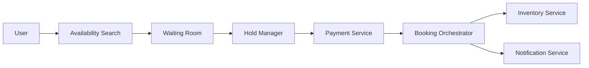
```mermaid
flowchart LR
    User["User"] --> Search["Availability Search"]
    Search --> Queue["Waiting Room"]
    Queue --> Hold["Hold Manager"]
    Hold --> Payment["Payment Service"]
    Payment --> Booking["Booking Orchestrator"]
    Booking --> Inventory["Inventory Service"]
    Booking --> Notify["Notification Service"]
```

##### Hold Expiration and Confirmation
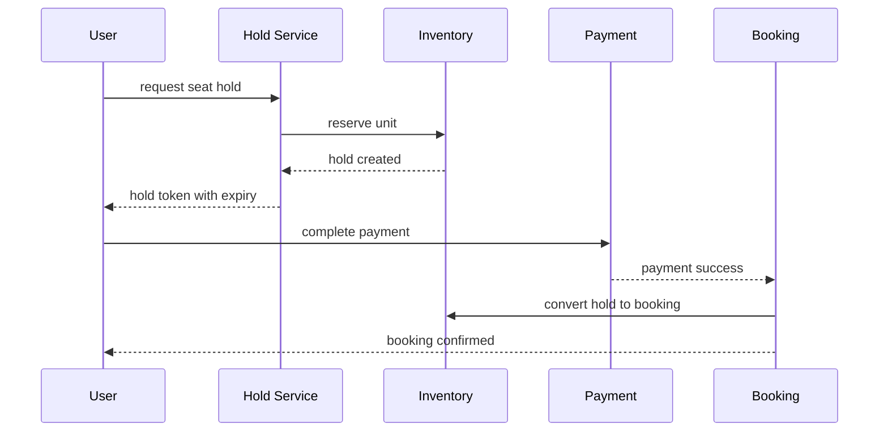
```mermaid
sequenceDiagram
    participant User
    participant Hold as Hold Service
    participant Inventory
    participant Payment
    participant Booking
    User->>Hold: request seat hold
    Hold->>Inventory: reserve unit
    Inventory-->>Hold: hold created
    Hold-->>User: hold token with expiry
    User->>Payment: complete payment
    Payment-->>Booking: payment success
    Booking->>Inventory: convert hold to booking
    Booking-->>User: booking confirmed
```

#### Real-World Examples
- Movie-ticketing products show seat-map selection and short hold windows where overselling is unacceptable.
- Train and airline systems add classes, waitlists, cancellations, and in some cases controlled overbooking policies.
- Large concert or sporting-event ticketing highlights hot-event queueing, anti-bot protection, and fairness constraints.
- Appointment and reservation systems for healthcare or hospitality reuse many of the same ideas, though availability units may be time slots rather than seats.

#### Case Study
##### CASE STUDY: Designing a high-demand event booking system
###### Problem framing
Assume the platform sells movie tickets daily and also handles occasional concert drops that create enormous demand spikes. Users can choose seats where available, receive a short hold window, and must complete payment before confirmation.


###### Functional and non-functional requirements
- Show availability fast but confirm bookings correctly.
- Protect scarce seat inventory from double-selling.
- Expire unpaid holds automatically and fairly.
- Support refunds, rebooking, and support investigation.
- Survive hot-event spikes without collapsing unrelated inventory.

###### Capacity and estimation
A routine movie-booking workload may be easy to handle. The hard case is a hot concert or train release where hundreds of thousands of users compete for a small pool of inventory in a narrow time window. The system therefore needs not just throughput but admission control and contention management.


###### Design evolution
- Start with availability search, seat holds, payment, and booking confirmation.
- Add waiting rooms and bot protection for hot-event windows.
- Introduce waitlists, premium queues, or group booking once basic fairness and correctness are stable.
- Differentiate between exact-seat and capacity-bucket inventory as the platform expands.

###### Scaling challenges and failure handling
- Late payments after hold expiry need deterministic compensation paths.
- Stale availability caches can create poor UX even if booking truth is correct.
- Waiting-room bugs can be as damaging as booking bugs because they shape fairness perception.
- Support teams need detailed hold and booking timelines to resolve disputes quickly.

###### Final architecture
A mature reservation platform uses cached availability search, an isolated hold and booking service with strong concurrency control, queueing for hot events, and clear payment-expiration coordination. This protects correctness while still keeping the overall customer flow understandable and responsive.

#### Architect's Mindset
- Keep search and booking on separate consistency budgets.
- Design the hold lifecycle explicitly, including expiration and compensation.
- Use admission control for hot events rather than pretending all burst load can be absorbed directly.
- Isolate hot inventory scopes so one sale does not degrade the whole platform.
- Make fairness and correctness visible to users and operators alike.

#### Common Mistakes
- Using the same logic for browse availability and final booking confirmation.
- Ignoring hold expiration or payment-after-expiry edge cases.
- Skipping waiting-room or anti-bot strategy for hot inventory releases.
- Assuming all reservation systems can tolerate overbooking.
- Forgetting support and dispute tooling for failed or ambiguous bookings.

#### Interview Angle
- Interviewers expect explicit treatment of contention, locking, expiration, and payment coordination.
- Strong answers separate searchable availability from the final booking commit path.
- Candidates stand out when they mention hot-event admission control and fairness trade-offs.
- Weak answers model reservation as simple inventory decrement without discussing holds or concurrency.

#### Quick Recap
- Reservation systems are about scarce inventory under contention.
- Hold windows and expiration are core product and architecture concepts.
- Search can be eventually consistent, but booking commit needs stronger guarantees.
- Hot events require queueing and fairness controls.
- This chapter caps Part 5 by combining discovery, payments, and strict correctness.

#### Practice Questions
1. Why should search availability and booking confirmation have different consistency expectations?
2. How would you design hold expiration safely?
3. What changes between seat-level inventory and capacity-bucket inventory?
4. How would you handle payment success after the hold expired?
5. Why are waiting rooms often necessary for hot events?
6. How would you prevent overselling without making the system unusably slow?
7. What metrics reveal booking contention problems?
8. How does airline overbooking differ from movie-seat booking?
9. How would you isolate hot events from normal traffic?
10. What support data would you preserve for booking disputes?

#### Further Exploration
- Compare this chapter with e-commerce and payments to see how scarce inventory changes checkout design.
- Study queueing, rate limiting, and anti-bot controls for flash-demand systems.
- Extend the design with waitlists, multi-seat adjacency constraints, or subscription-based pre-access windows.

### Dynamic Pricing Engine

#### Overview

Dynamic Pricing Engine is the domain boundary responsible for evaluating rules and policy-driven calculations consistently across channels and user segments. In Travel & Booking Systems, this system usually has to balance direct user experience with downstream effects on adjacent systems in 37.1 Booking Platforms.

The dynamic pricing engine is one of the most revenue-critical components. In travel, prices are not static; they change based on demand, time to departure, competitor pricing, fare class availability, and dozens of other signals. Airlines pioneered yield management in the 1980s, and the techniques have since spread to hotels, car rentals, and every other perishable inventory business.

#### Yield Management Concepts

| Concept | Description | Example |
|---------|-------------|---------|
| Fare class | Buckets of seats at different price points on the same flight | Y (full economy), B (discount economy), M (deep discount) |
| Booking curve | Historical pattern of how reservations accumulate | 80% of business travelers book within 14 days of departure |
| Load factor | Percentage of seats sold on a flight | Target 85% load factor at departure |
| Spill | Revenue lost when passengers are turned away from a full flight | Oversold economy spills to competitor |
| Spoilage | Revenue lost from empty seats at departure | Empty seats have zero residual value |
| Nesting | Higher fare classes can access inventory allocated to lower classes | Business class passenger can take economy inventory |
| Bid price | Minimum fare the system will accept for a seat at a given time | Bid price rises as departure approaches and load increases |
| EMSR | Expected Marginal Seat Revenue — statistical model for optimal allocation | Allocate seats to fare classes to maximize expected revenue |

#### Real-world examples

- Comparable patterns appear in Booking.com, Expedia, Airbnb.
- Startups often keep Dynamic Pricing Engine inside a larger service, while large platforms split it out once ownership, scale, or correctness requirements diverge.
- The exact implementation changes between B2C, B2B, and regulated variants, but the architectural boundary stays useful.

#### Requirements and workflows

- Expose APIs or events that let product users, internal operators, and downstream consumers create, update, query, and reconcile dynamic pricing engine state.
- Support synchronous user-facing flows for the hot path and asynchronous processing for enrichment, retries, and downstream propagation.
- Preserve a clear state model so support teams and automated workflows can explain why the system is in its current state.
- Provide audit or analytics hooks without coupling reporting latency to the primary user journey.

#### Architecture, data, and APIs

- Model the write path around rule sets, campaign windows, eligibility predicates, score inputs, and decision logs.
- Keep a normalized source of truth for critical state and publish derived read models or events for consumer services.
- Use caches, projections, or search indexes only for latency-sensitive reads; treat rebuildability as a design requirement.
- Define idempotent write contracts, versioned events, and explicit ownership boundaries so dependent systems can evolve safely.

#### Scaling, reliability, and operations

- Watch for incorrect eligibility, rule conflicts, cache staleness, unfair outcomes, and explainability gaps.
- Protect hot partitions with rate limiting, request coalescing, queue buffering, and selective denormalization where appropriate.
- Design operator dashboards, replay tooling, and reconciliation or backfill workflows before incidents force them into existence.
- Track service-level indicators for latency, success, queue lag, freshness, and correctness signals instead of only infrastructure health.

#### Trade-offs and interview notes

- The key interview move is to explain why Dynamic Pricing Engine deserves its own boundary and what can remain eventual around it.
- Strong answers call out what requires strong correctness versus what can be computed asynchronously.
- Weak answers collapse storage, orchestration, and downstream fan-out into one service without discussing scale or failure modes.

### Itinerary Planner

#### Overview

Itinerary Planner is the domain boundary responsible for owning a clear domain boundary with its own state model, APIs, and operational SLOs. In Travel & Booking Systems, this system usually has to balance direct user experience with downstream effects on adjacent systems in 37.1 Booking Platforms.

The itinerary planner assembles multiple bookings (flights, hotels, car rentals, activities) into a unified trip view. It handles cross-modal transport, layover calculations, timezone conversions, real-time disruption propagation, and collaborative trip sharing. It is the primary post-booking touchpoint for travelers.

#### Real-world examples

- Comparable patterns appear in Booking.com, Expedia, Airbnb.
- Startups often keep Itinerary Planner inside a larger service, while large platforms split it out once ownership, scale, or correctness requirements diverge.
- The exact implementation changes between B2C, B2B, and regulated variants, but the architectural boundary stays useful.

#### Requirements and workflows

- Expose APIs or events that let product users, internal operators, and downstream consumers create, update, query, and reconcile itinerary planner state.
- Support synchronous user-facing flows for the hot path and asynchronous processing for enrichment, retries, and downstream propagation.
- Preserve a clear state model so support teams and automated workflows can explain why the system is in its current state.
- Provide audit or analytics hooks without coupling reporting latency to the primary user journey.

#### Architecture, data, and APIs

- Model the write path around normalized transactional state, denormalized read models, events, and audit records.
- Keep a normalized source of truth for critical state and publish derived read models or events for consumer services.
- Use caches, projections, or search indexes only for latency-sensitive reads; treat rebuildability as a design requirement.
- Define idempotent write contracts, versioned events, and explicit ownership boundaries so dependent systems can evolve safely.

#### Scaling, reliability, and operations

- Watch for hotspots, stale projections, ambiguous retries, and under-specified operator workflows.
- Protect hot partitions with rate limiting, request coalescing, queue buffering, and selective denormalization where appropriate.
- Design operator dashboards, replay tooling, and reconciliation or backfill workflows before incidents force them into existence.
- Track service-level indicators for latency, success, queue lag, freshness, and correctness signals instead of only infrastructure health.

#### Trade-offs and interview notes

- The key interview move is to explain why Itinerary Planner deserves its own boundary and what can remain eventual around it.
- Strong answers call out what requires strong correctness versus what can be computed asynchronously.
- Weak answers collapse storage, orchestration, and downstream fan-out into one service without discussing scale or failure modes.

---

## Low-Level Design

### Detailed Component Architecture

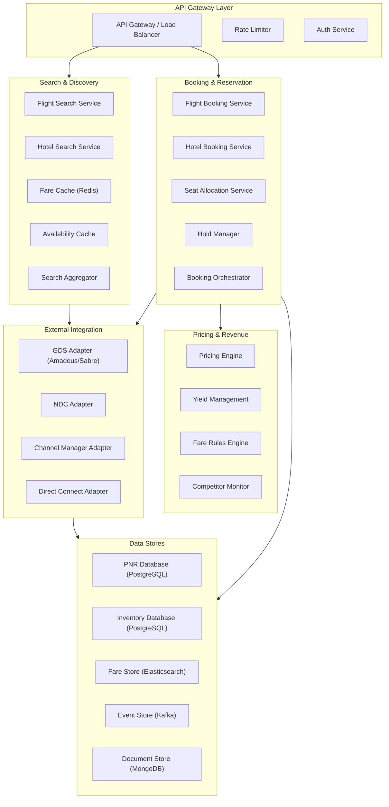
```mermaid
flowchart TB
    subgraph API_Gateway["API Gateway Layer"]
        GW["API Gateway / Load Balancer"]
        RateLimit["Rate Limiter"]
        Auth["Auth Service"]
    end

    subgraph Search_Layer["Search & Discovery"]
        FlightSearch["Flight Search Service"]
        HotelSearch["Hotel Search Service"]
        FareCache["Fare Cache (Redis)"]
        AvailCache["Availability Cache"]
        SearchAgg["Search Aggregator"]
    end

    subgraph Booking_Layer["Booking & Reservation"]
        FlightBook["Flight Booking Service"]
        HotelBook["Hotel Booking Service"]
        SeatAlloc["Seat Allocation Service"]
        HoldMgr["Hold Manager"]
        BookOrch["Booking Orchestrator"]
    end

    subgraph Pricing_Layer["Pricing & Revenue"]
        PricingEng["Pricing Engine"]
        YieldMgmt["Yield Management"]
        FareRules["Fare Rules Engine"]
        CompMonitor["Competitor Monitor"]
    end

    subgraph Integration_Layer["External Integration"]
        GDSAdapter["GDS Adapter (Amadeus/Sabre)"]
        NDCAdapter["NDC Adapter"]
        ChannelMgr["Channel Manager Adapter"]
        DirectConnect["Direct Connect Adapter"]
    end

    subgraph Data_Layer["Data Stores"]
        PNR_DB["PNR Database (PostgreSQL)"]
        Inventory_DB["Inventory Database (PostgreSQL)"]
        FareStore["Fare Store (Elasticsearch)"]
        EventStore["Event Store (Kafka)"]
        DocStore["Document Store (MongoDB)"]
    end

    GW --> Search_Layer
    GW --> Booking_Layer
    Search_Layer --> Integration_Layer
    Booking_Layer --> Integration_Layer
    Booking_Layer --> Pricing_Layer
    Integration_Layer --> Data_Layer
    Booking_Layer --> Data_Layer
```

---

## Functional Requirements

### Flight Booking System — Functional Requirements

| ID | Requirement | Priority | Notes |
|----|------------|----------|-------|
| FB-FR-01 | Search flights by origin, destination, dates, passengers, and cabin class | P0 | Must support one-way, round-trip, and multi-city |
| FB-FR-02 | Display fare options with price breakdown (base fare, taxes, fees) | P0 | Must show fare rules summary |
| FB-FR-03 | Support fare comparison across GDS, NDC, and direct connect sources | P0 | Deduplicate identical flights from different sources |
| FB-FR-04 | Create PNR with passenger details, contact info, and fare selection | P0 | Must generate unique PNR locator |
| FB-FR-05 | Hold booking with ticketing time limit (TTL) | P0 | TTL varies by airline and fare class |
| FB-FR-06 | Issue e-ticket after payment confirmation | P0 | Generate e-ticket number per coupon |
| FB-FR-07 | Support booking modification (date change, name correction) | P1 | Subject to fare rules and change fees |
| FB-FR-08 | Support voluntary and involuntary cancellation with refund calculation | P0 | Involuntary = airline-initiated, no penalty |
| FB-FR-09 | Handle codeshare flights showing both marketing and operating carrier | P1 | Map codeshare to operating flight for seat selection |
| FB-FR-10 | Process schedule changes from airlines and re-accommodate passengers | P0 | Automated re-accommodation for minor changes |
| FB-FR-11 | Support ancillary purchases (extra baggage, meals, priority boarding) | P1 | Via EMD issuance |
| FB-FR-12 | Support multi-passenger bookings with different fare classes | P1 | Split PNR capability |
| FB-FR-13 | Generate booking confirmation with all segments and fare details | P0 | Email and in-app |
| FB-FR-14 | Support interline and connecting flight itineraries | P1 | Minimum connection time validation |
| FB-FR-15 | Integrate with loyalty programs for earning and redemption | P2 | Frequent flyer number in PNR |

### Hotel Booking System — Functional Requirements

| ID | Requirement | Priority | Notes |
|----|------------|----------|-------|
| HB-FR-01 | Search hotels by location, dates, guests, and room type | P0 | Support radius, map, and landmark search |
| HB-FR-02 | Display room options with rates, photos, and amenities | P0 | Must show cancellation policy per rate |
| HB-FR-03 | Show real-time availability synced from channel managers | P0 | Refresh within 60 seconds of channel update |
| HB-FR-04 | Support instant confirmation and on-request booking models | P0 | On-request: hotel confirms within 24 hours |
| HB-FR-05 | Create reservation with guest details and special requests | P0 | Room preferences, early check-in, etc. |
| HB-FR-06 | Enforce rate parity across all distribution channels | P1 | Flag violations for revenue manager review |
| HB-FR-07 | Support modification (date change, room upgrade) | P1 | Subject to availability and rate difference |
| HB-FR-08 | Support cancellation with policy-aware refund calculation | P0 | Free cancellation, partial refund, non-refundable |
| HB-FR-09 | Manage property content (photos, descriptions, amenities, policies) | P1 | Content versioning and multilingual support |
| HB-FR-10 | Support group bookings with block allocation | P2 | Release unsold rooms back to general inventory |
| HB-FR-11 | Track no-shows and apply penalty charges | P1 | Automatic no-show detection after check-in time |
| HB-FR-12 | Support multi-room bookings for families and groups | P1 | Single confirmation for all rooms |

### Seat Allocation System — Functional Requirements

| ID | Requirement | Priority | Notes |
|----|------------|----------|-------|
| SA-FR-01 | Display seat map with real-time availability per flight | P0 | Show seat type (window, aisle, middle) |
| SA-FR-02 | Allow seat selection during booking and post-booking | P0 | Free and paid seat options |
| SA-FR-03 | Support premium seat pricing (extra legroom, exit row) | P1 | Dynamic pricing based on demand |
| SA-FR-04 | Enforce seat assignment rules (exit row age requirement, infant proximity) | P0 | Regulatory compliance |
| SA-FR-05 | Support group seating with adjacency preference | P1 | Best-effort adjacent seat assignment |
| SA-FR-06 | Handle aircraft change with automatic seat re-assignment | P0 | Notify passengers of seat changes |
| SA-FR-07 | Support seat map updates from airline schedule changes | P0 | Real-time sync from GDS/airline |
| SA-FR-08 | Block seats for crew, security, and operational requirements | P0 | Hidden from passenger view |
| SA-FR-09 | Support waitlist for preferred seats | P2 | Auto-assign when seat becomes available |

### Dynamic Pricing Engine — Functional Requirements

| ID | Requirement | Priority | Notes |
|----|------------|----------|-------|
| DP-FR-01 | Calculate fare prices based on fare class availability and booking curve | P0 | Real-time calculation at search time |
| DP-FR-02 | Support multiple fare classes per cabin with different rules | P0 | Nesting and availability controls |
| DP-FR-03 | Apply promotional pricing and campaign discounts | P1 | Time-windowed, segment-specific |
| DP-FR-04 | Monitor competitor pricing and adjust dynamically | P1 | Scraping and API-based competitor data |
| DP-FR-05 | Forecast demand using historical booking curves | P1 | ML models retrained daily |
| DP-FR-06 | Support hotel rate management with BAR, promotional, and package rates | P1 | Rate plans with date-specific overrides |
| DP-FR-07 | Provide pricing audit trail for every fare quote | P0 | Regulatory and dispute resolution |
| DP-FR-08 | Support multi-currency pricing with real-time exchange rates | P0 | Lock exchange rate at booking time |
| DP-FR-09 | Calculate ancillary pricing (seat upgrades, baggage, insurance) | P1 | Bundle pricing for ancillary packages |
| DP-FR-10 | Support fare filing and distribution to GDS | P2 | ATPCO fare filing for airlines |

### Itinerary Planner — Functional Requirements

| ID | Requirement | Priority | Notes |
|----|------------|----------|-------|
| IP-FR-01 | Assemble multi-segment trips from separate bookings | P0 | Flight + hotel + car rental |
| IP-FR-02 | Display unified timeline with all trip components | P0 | Timezone-aware chronological view |
| IP-FR-03 | Support cross-modal transport (flight + train + ferry) | P1 | Integration with rail and ground transport APIs |
| IP-FR-04 | Calculate layover times and flag tight connections | P0 | Minimum connection time by airport |
| IP-FR-05 | Integrate with calendar apps (Google Calendar, Apple Calendar, Outlook) | P1 | ICS export and CalDAV sync |
| IP-FR-06 | Support trip sharing with co-travelers and family | P1 | Read-only and edit access levels |
| IP-FR-07 | Provide offline access to itinerary details | P1 | Download for mobile offline mode |
| IP-FR-08 | Track real-time flight status and push disruption alerts | P0 | Gate changes, delays, cancellations |
| IP-FR-09 | Store travel documents (passport scan, visa, insurance) | P2 | Encrypted document storage |
| IP-FR-10 | Suggest activities and restaurants at destination | P2 | Third-party API integration |
| IP-FR-11 | Generate shareable trip summary with booking references | P1 | PDF export and link sharing |

---

## Non-Functional Requirements

| Category | Requirement | Target | Notes |
|----------|------------|--------|-------|
| **Latency** | Flight search p50 | < 1.5s | Including GDS round-trip |
| **Latency** | Flight search p99 | < 3s | With GDS timeout fallback to cache |
| **Latency** | Hotel search p50 | < 800ms | Mostly from local cache |
| **Latency** | Hotel search p99 | < 2s | Including channel manager queries |
| **Latency** | Seat map load p99 | < 1s | Cached seat maps with real-time delta |
| **Latency** | Pricing calculation p99 | < 200ms | In-memory fare rules evaluation |
| **Latency** | Booking creation p99 | < 5s | Including GDS PNR creation |
| **Latency** | Itinerary load p99 | < 500ms | Denormalized read model |
| **Throughput** | Flight search | 100,000 QPS peak, 20,000 QPS steady | Majority served from cache |
| **Throughput** | Hotel search | 50,000 QPS peak, 10,000 QPS steady | Property availability cache |
| **Throughput** | Booking creation | 5,000 TPS peak, 1,000 TPS steady | Bottlenecked by GDS |
| **Throughput** | Seat operations | 10,000 TPS peak | Mostly reads (seat map display) |
| **Throughput** | Pricing calculations | 200,000 QPS peak | Every search fan-out generates pricing calls |
| **Availability** | Search services | 99.95% (3.5 nines) | Degraded mode with cached results |
| **Availability** | Booking services | 99.9% (3 nines) | GDS dependency limits ceiling |
| **Availability** | Itinerary service | 99.99% (4 nines) | Read-heavy, low write contention |
| **Consistency** | Seat inventory | Strong consistency (linearizable) | Prevent double-booking |
| **Consistency** | Hotel room inventory | Strong consistency per property | Channel manager sync within 60s |
| **Consistency** | Search results | Eventual consistency (< 30s staleness) | Cache TTL-based |
| **Consistency** | Pricing | Eventual consistency (< 5min staleness) | Fare cache refresh cycle |
| **Consistency** | Itinerary | Read-after-write consistency | User sees own changes immediately |
| **Durability** | Booking and PNR data | Zero data loss | Synchronous replication |
| **Durability** | Payment records | Zero data loss | WAL + synchronous replication |
| **Security** | PCI-DSS Level 1 | No card data touches application servers | Tokenized payments |
| **Security** | PII protection | Encryption at rest and in transit | Passport, contact data |
| **Compliance** | GDPR / CCPA | Data residency, right to deletion | Regional data stores |
| **Compliance** | IATA / BSP | Ticketing and settlement compliance | Audit trail for ADMs |
| **Scalability** | Horizontal | All services scale independently | Stateless application tier |

---

## Capacity Estimation

### Traffic Estimates

| Metric | Steady State | Peak (Holiday) | Notes |
|--------|-------------|----------------|-------|
| Daily active users | 5M | 15M | Web + mobile |
| Flight searches per day | 50M | 200M | Average 10 searches per booking |
| Hotel searches per day | 30M | 100M | Average 8 searches per booking |
| Flight search QPS (avg) | 580 | 2,300 | 50M / 86,400s |
| Flight search QPS (peak) | 20,000 | 100,000 | 50x average during peak hours |
| Hotel search QPS (peak) | 10,000 | 50,000 | 25x average during peak hours |
| Flight bookings per day | 200K | 500K | 0.4% search-to-book conversion |
| Hotel bookings per day | 150K | 400K | 0.5% search-to-book conversion |
| Booking TPS (avg) | 4 | 10 | Spread across day |
| Booking TPS (peak) | 1,000 | 5,000 | Concentrated in booking windows |
| Seat selection operations per day | 300K | 800K | 1.5 seat ops per flight booking |
| Itinerary reads per day | 2M | 8M | Travelers checking trip details |
| Schedule change events per day | 50K | 100K | Airline schedule changes |

### Storage Estimates

| Data Type | Size per Record | Record Count | Total Storage | Growth Rate |
|-----------|----------------|--------------|---------------|-------------|
| PNR record | 5 KB avg | 100M active | 500 GB | 200K/day |
| Fare cache entry | 500 bytes | 2B route-date combinations | 1 TB | Refreshed every 15 min |
| Hotel inventory record | 200 bytes | 1M properties x 365 days x 10 room types | 730 GB | Daily refresh |
| Seat map (per flight) | 10 KB | 500K active flights | 5 GB | Refreshed with schedule |
| Itinerary document | 8 KB avg | 50M active | 400 GB | 200K/day |
| Booking event log | 2 KB per event | 500M events/month | 1 TB/month | Append-only |
| Search log | 1 KB per search | 2B searches/month | 2 TB/month | Analytics retention |
| Fare rules database | 2 KB per rule | 50M fare rules | 100 GB | Updated via ATPCO feeds |

### GDS Cost Estimation

| Operation | Cost per Transaction | Daily Volume | Daily Cost |
|-----------|---------------------|-------------|------------|
| GDS search (availability) | $0.03 | 5M (cached 90%) | $150,000 |
| GDS booking (PNR create) | $2.50 | 200K | $500,000 |
| GDS ticketing | $1.50 | 180K | $270,000 |
| GDS PNR modification | $0.50 | 30K | $15,000 |
| NDC search | $0.01 | 2M | $20,000 |
| NDC booking | $0.50 | 50K | $25,000 |

**Key insight**: GDS search costs dominate. Every 10% improvement in cache hit rate saves $15,000/day. This is why fare caching strategy is one of the most cost-sensitive architectural decisions.

### Bandwidth Estimates

| Flow | Payload Size | QPS | Bandwidth |
|------|-------------|-----|-----------|
| Flight search response | 50 KB (compressed) | 100K peak | 5 GB/s peak |
| Hotel search response | 30 KB (compressed) | 50K peak | 1.5 GB/s peak |
| Seat map response | 15 KB | 10K peak | 150 MB/s peak |
| Booking request | 5 KB | 5K peak | 25 MB/s peak |
| GDS XML request | 10 KB | 10K peak | 100 MB/s peak |
| GDS XML response | 30 KB | 10K peak | 300 MB/s peak |

---

## Detailed Data Models

### PNR (Passenger Name Record) Structure

```
Table: pnr
  pnr_id              UUID PRIMARY KEY
  record_locator       VARCHAR(6) UNIQUE NOT NULL     -- e.g., "ABC123"
  gds_locator          VARCHAR(10)                     -- GDS-assigned locator
  gds_source           ENUM('amadeus','sabre','travelport','ndc','direct')
  status               ENUM('confirmed','ticketed','cancelled','suspended','archived')
  booking_source       ENUM('web','mobile','agent','api')
  agency_id            UUID REFERENCES agencies(agency_id)
  created_by           UUID REFERENCES users(user_id)
  contact_email        VARCHAR(255) NOT NULL
  contact_phone        VARCHAR(20)
  total_fare_amount    DECIMAL(12,2)
  total_tax_amount     DECIMAL(12,2)
  currency_code        CHAR(3)                         -- ISO 4217
  ticketing_deadline    TIMESTAMP WITH TIME ZONE
  payment_status       ENUM('pending','authorized','captured','refunded','failed')
  created_at           TIMESTAMP WITH TIME ZONE DEFAULT NOW()
  updated_at           TIMESTAMP WITH TIME ZONE DEFAULT NOW()
  version              INTEGER DEFAULT 1               -- Optimistic locking

Table: pnr_passengers
  passenger_id         UUID PRIMARY KEY
  pnr_id               UUID REFERENCES pnr(pnr_id)
  first_name           VARCHAR(100) NOT NULL
  last_name            VARCHAR(100) NOT NULL
  date_of_birth        DATE
  gender               ENUM('M','F','X')
  passenger_type       ENUM('ADT','CHD','INF','UNN')   -- Adult, Child, Infant, Unaccompanied Minor
  nationality          CHAR(2)                          -- ISO 3166
  passport_number      VARCHAR(20) ENCRYPTED
  passport_expiry      DATE
  frequent_flyer_number VARCHAR(20)
  frequent_flyer_airline CHAR(2)
  meal_preference      VARCHAR(10)                      -- VGML, AVML, etc.
  seat_preference      ENUM('window','aisle','none')
  ssr_codes            JSONB                            -- Special service requests

Table: pnr_segments
  segment_id           UUID PRIMARY KEY
  pnr_id               UUID REFERENCES pnr(pnr_id)
  segment_number       INTEGER NOT NULL
  marketing_carrier    CHAR(2) NOT NULL                 -- e.g., "AA"
  operating_carrier    CHAR(2)                          -- For codeshare flights
  flight_number        VARCHAR(6) NOT NULL
  departure_airport    CHAR(3) NOT NULL                 -- IATA code
  arrival_airport      CHAR(3) NOT NULL
  departure_datetime   TIMESTAMP WITH TIME ZONE NOT NULL
  arrival_datetime     TIMESTAMP WITH TIME ZONE NOT NULL
  cabin_class          ENUM('F','J','W','Y')            -- First, Business, Premium Economy, Economy
  booking_class        CHAR(1) NOT NULL                 -- RBD (Y, B, M, etc.)
  status               ENUM('confirmed','waitlisted','cancelled','flown','no_show')
  fare_basis           VARCHAR(15)                      -- Fare basis code
  ticket_number        VARCHAR(14)                      -- 13-digit e-ticket number
  coupon_number        INTEGER                          -- Coupon within ticket
  baggage_allowance    VARCHAR(10)                      -- "2PC" or "23K"
  equipment_type       VARCHAR(4)                       -- Aircraft type (B738, A320)
  UNIQUE(pnr_id, segment_number)

Table: pnr_fare_details
  fare_id              UUID PRIMARY KEY
  pnr_id               UUID REFERENCES pnr(pnr_id)
  passenger_id         UUID REFERENCES pnr_passengers(passenger_id)
  fare_basis           VARCHAR(15)
  base_fare            DECIMAL(10,2)
  taxes                JSONB                            -- Array of tax components
  total_fare           DECIMAL(10,2)
  currency_code        CHAR(3)
  fare_calculation     TEXT                             -- Linear fare calculation string
  endorsements         TEXT                             -- Fare restrictions
  change_fee           DECIMAL(10,2)
  cancel_fee           DECIMAL(10,2)
  refundable           BOOLEAN DEFAULT FALSE

Table: pnr_remarks
  remark_id            UUID PRIMARY KEY
  pnr_id               UUID REFERENCES pnr(pnr_id)
  remark_type          ENUM('general','confidential','itinerary','invoice','ssr','osi')
  text                 TEXT NOT NULL
  created_by           UUID REFERENCES users(user_id)
  created_at           TIMESTAMP WITH TIME ZONE DEFAULT NOW()

Table: pnr_history
  history_id           UUID PRIMARY KEY
  pnr_id               UUID REFERENCES pnr(pnr_id)
  action               VARCHAR(50) NOT NULL             -- 'created', 'segment_added', 'ticketed', etc.
  old_state            JSONB
  new_state            JSONB
  performed_by         UUID
  performed_at         TIMESTAMP WITH TIME ZONE DEFAULT NOW()
  gds_transaction_id   VARCHAR(50)
```

### Fare Rules Database

```
Table: fare_rules
  fare_rule_id         UUID PRIMARY KEY
  carrier              CHAR(2) NOT NULL
  fare_basis           VARCHAR(15) NOT NULL
  origin               CHAR(3)                          -- Can be zone-based
  destination          CHAR(3)
  effective_date       DATE NOT NULL
  expiration_date      DATE NOT NULL
  currency             CHAR(3)
  base_amount          DECIMAL(10,2)
  rule_categories      JSONB                            -- ATPCO categories 1-50

  -- Category 5: Advance Purchase
  advance_purchase_min_days  INTEGER
  advance_purchase_max_days  INTEGER

  -- Category 6: Minimum Stay
  min_stay_type        ENUM('days','saturday_night','none')
  min_stay_days        INTEGER

  -- Category 7: Maximum Stay
  max_stay_days        INTEGER

  -- Category 10: Combinability
  combinable_carriers  CHAR(2)[]
  combinable_fares     VARCHAR(15)[]

  -- Category 16: Penalties
  change_fee_before_departure    DECIMAL(10,2)
  change_fee_after_departure     DECIMAL(10,2)
  cancel_fee_before_departure    DECIMAL(10,2)
  cancel_fee_after_departure     DECIMAL(10,2)
  no_show_fee                    DECIMAL(10,2)
  refundable                     BOOLEAN DEFAULT FALSE

  -- Category 25: Fare by Rule
  discount_percent     DECIMAL(5,2)
  discount_base_fare   VARCHAR(15)

  -- Blackout dates
  blackout_dates       DATERANGE[]

  -- Day of week applicability
  applicable_days      INTEGER[]                        -- 0=Sun, 6=Sat

  -- Seasonality
  season_type          ENUM('peak','shoulder','off_peak')

  INDEX idx_fare_rules_route ON (carrier, origin, destination, effective_date)
  INDEX idx_fare_rules_basis ON (fare_basis)
```

### Hotel Inventory Model

```
Table: hotel_properties
  property_id          UUID PRIMARY KEY
  property_name        VARCHAR(200) NOT NULL
  chain_code           VARCHAR(10)                      -- Hotel chain identifier
  star_rating          DECIMAL(2,1)
  latitude             DECIMAL(10,7)
  longitude            DECIMAL(10,7)
  address              JSONB                            -- Structured address
  city_code            VARCHAR(10)
  country_code         CHAR(2)
  timezone             VARCHAR(50)                      -- IANA timezone
  check_in_time        TIME
  check_out_time       TIME
  total_rooms          INTEGER
  amenities            TEXT[]                           -- pool, wifi, gym, etc.
  images               JSONB                            -- Array of image URLs with captions
  description          JSONB                            -- Multilingual descriptions
  cancellation_policy  JSONB                            -- Default property policy
  channel_manager_id   VARCHAR(50)                      -- SiteMinder, RateGain ID
  pms_type             VARCHAR(50)                      -- Opera, Protel, etc.
  booking_model        ENUM('instant','on_request','mixed')
  active               BOOLEAN DEFAULT TRUE
  last_content_update  TIMESTAMP WITH TIME ZONE

Table: room_types
  room_type_id         UUID PRIMARY KEY
  property_id          UUID REFERENCES hotel_properties(property_id)
  room_code            VARCHAR(20) NOT NULL
  room_name            VARCHAR(100) NOT NULL
  max_occupancy        INTEGER NOT NULL
  max_adults           INTEGER NOT NULL
  max_children         INTEGER
  bed_type             ENUM('king','queen','double','twin','single','bunk')
  bed_count            INTEGER DEFAULT 1
  room_size_sqm        INTEGER
  view_type            VARCHAR(50)                      -- ocean, garden, city, etc.
  amenities            TEXT[]
  images               JSONB
  UNIQUE(property_id, room_code)

Table: hotel_inventory
  inventory_id         UUID PRIMARY KEY
  property_id          UUID REFERENCES hotel_properties(property_id)
  room_type_id         UUID REFERENCES room_types(room_type_id)
  date                 DATE NOT NULL
  total_rooms          INTEGER NOT NULL
  sold_rooms           INTEGER DEFAULT 0
  held_rooms           INTEGER DEFAULT 0
  blocked_rooms        INTEGER DEFAULT 0                -- Maintenance, groups, etc.
  available_rooms      INTEGER GENERATED ALWAYS AS (total_rooms - sold_rooms - held_rooms - blocked_rooms) STORED
  overbooking_limit    INTEGER DEFAULT 0
  stop_sell            BOOLEAN DEFAULT FALSE
  min_stay             INTEGER DEFAULT 1
  max_stay             INTEGER DEFAULT 30
  close_on_arrival     BOOLEAN DEFAULT FALSE            -- CTA restriction
  close_on_departure   BOOLEAN DEFAULT FALSE            -- CTD restriction
  last_synced          TIMESTAMP WITH TIME ZONE
  UNIQUE(property_id, room_type_id, date)
  INDEX idx_hotel_inventory_avail ON (property_id, date, available_rooms)

Table: hotel_rates
  rate_id              UUID PRIMARY KEY
  property_id          UUID REFERENCES hotel_properties(property_id)
  room_type_id         UUID REFERENCES room_types(room_type_id)
  rate_plan_code       VARCHAR(20) NOT NULL             -- BAR, PROMO, CORP, PKG
  rate_plan_name       VARCHAR(100)
  date                 DATE NOT NULL
  currency_code        CHAR(3)
  sell_rate            DECIMAL(10,2) NOT NULL            -- Price to traveler
  net_rate             DECIMAL(10,2)                     -- Cost to OTA
  commission_percent   DECIMAL(5,2)
  tax_inclusive         BOOLEAN DEFAULT FALSE
  meal_plan            ENUM('RO','BB','HB','FB','AI')   -- Room Only, Bed & Breakfast, etc.
  cancellation_policy_id UUID
  booking_window_start DATE                              -- Earliest booking date
  booking_window_end   DATE                              -- Latest booking date
  UNIQUE(property_id, room_type_id, rate_plan_code, date)
  INDEX idx_hotel_rates_search ON (property_id, date, sell_rate)

Table: hotel_reservations
  reservation_id       UUID PRIMARY KEY
  property_id          UUID REFERENCES hotel_properties(property_id)
  room_type_id         UUID REFERENCES room_types(room_type_id)
  confirmation_number  VARCHAR(20) UNIQUE
  hotel_confirmation   VARCHAR(20)                      -- Hotel's own confirmation
  guest_name           VARCHAR(200) NOT NULL
  guest_email          VARCHAR(255)
  guest_phone          VARCHAR(20)
  check_in_date        DATE NOT NULL
  check_out_date       DATE NOT NULL
  num_rooms            INTEGER DEFAULT 1
  num_adults           INTEGER NOT NULL
  num_children         INTEGER DEFAULT 0
  rate_plan_code       VARCHAR(20)
  total_rate           DECIMAL(10,2)
  currency_code        CHAR(3)
  status               ENUM('confirmed','pending','cancelled','no_show','checked_in','checked_out')
  booking_source       ENUM('web','mobile','agent','channel_manager')
  special_requests     TEXT
  payment_status       ENUM('pending','guaranteed','charged','refunded')
  cancellation_deadline TIMESTAMP WITH TIME ZONE
  created_at           TIMESTAMP WITH TIME ZONE DEFAULT NOW()
  updated_at           TIMESTAMP WITH TIME ZONE DEFAULT NOW()
```

### Seat Map Data Model

```
Table: aircraft_configurations
  config_id            UUID PRIMARY KEY
  airline_code         CHAR(2) NOT NULL
  aircraft_type        VARCHAR(10) NOT NULL             -- B738, A320, B77W
  configuration_code   VARCHAR(20)                      -- Different configs for same aircraft type
  total_rows           INTEGER NOT NULL
  total_columns        INTEGER NOT NULL                 -- Typically 6 (ABC-DEF) or 9 (ABC-DEFG-HJK)
  column_labels        CHAR(1)[] NOT NULL               -- ['A','B','C','D','E','F']
  cabin_layout         JSONB NOT NULL                   -- Row ranges per cabin
  exit_rows            INTEGER[]                        -- Exit row numbers
  overwing_rows        INTEGER[]
  bulkhead_rows        INTEGER[]
  last_updated         TIMESTAMP WITH TIME ZONE

Table: seat_inventory
  seat_id              UUID PRIMARY KEY
  flight_id            UUID NOT NULL                     -- References flight schedule
  config_id            UUID REFERENCES aircraft_configurations(config_id)
  row_number           INTEGER NOT NULL
  column_label         CHAR(1) NOT NULL
  cabin_class          ENUM('F','J','W','Y')
  seat_type            ENUM('window','middle','aisle')
  characteristics      TEXT[]                            -- extra_legroom, bassinet, power_outlet, etc.
  status               ENUM('available','held','assigned','blocked','broken')
  held_by              UUID                              -- User holding the seat
  hold_expires         TIMESTAMP WITH TIME ZONE
  assigned_to          UUID                              -- Passenger assigned
  price_category       ENUM('free','standard','preferred','premium','extra_legroom')
  price_amount         DECIMAL(8,2)
  price_currency       CHAR(3)
  UNIQUE(flight_id, row_number, column_label)
  INDEX idx_seat_flight_status ON (flight_id, status)
  INDEX idx_seat_hold_expires ON (hold_expires) WHERE status = 'held'

Table: seat_assignments
  assignment_id        UUID PRIMARY KEY
  pnr_id               UUID REFERENCES pnr(pnr_id)
  segment_id           UUID REFERENCES pnr_segments(segment_id)
  passenger_id         UUID REFERENCES pnr_passengers(passenger_id)
  seat_id              UUID REFERENCES seat_inventory(seat_id)
  row_number           INTEGER NOT NULL
  column_label         CHAR(1) NOT NULL
  assignment_type      ENUM('selected','auto_assigned','upgrade','re_assigned')
  price_paid           DECIMAL(8,2) DEFAULT 0
  assigned_at          TIMESTAMP WITH TIME ZONE DEFAULT NOW()
  released_at          TIMESTAMP WITH TIME ZONE
  release_reason       VARCHAR(50)                      -- 'aircraft_change', 'voluntary', 'operational'
```

### Itinerary Data Model

```
Table: itineraries
  itinerary_id         UUID PRIMARY KEY
  user_id              UUID REFERENCES users(user_id) NOT NULL
  trip_name            VARCHAR(200)
  start_date           DATE
  end_date             DATE
  destination_cities   VARCHAR(3)[]                     -- IATA city codes
  status               ENUM('planning','booked','in_progress','completed','cancelled')
  sharing_token        VARCHAR(64) UNIQUE               -- For shareable links
  sharing_permission   ENUM('private','view_only','edit')
  offline_snapshot     JSONB                            -- Last cached version for offline
  created_at           TIMESTAMP WITH TIME ZONE DEFAULT NOW()
  updated_at           TIMESTAMP WITH TIME ZONE DEFAULT NOW()

Table: itinerary_items
  item_id              UUID PRIMARY KEY
  itinerary_id         UUID REFERENCES itineraries(itinerary_id)
  item_type            ENUM('flight','hotel','car_rental','train','activity','transfer','note')
  sort_order           INTEGER NOT NULL
  booking_reference    VARCHAR(50)                      -- PNR locator or hotel confirmation
  booking_system_id    UUID                             -- FK to respective booking record
  title                VARCHAR(200) NOT NULL
  start_datetime       TIMESTAMP WITH TIME ZONE
  end_datetime         TIMESTAMP WITH TIME ZONE
  start_location       JSONB                            -- {name, lat, lng, address}
  end_location         JSONB
  timezone             VARCHAR(50)
  status               ENUM('planned','confirmed','cancelled','completed')
  details              JSONB                            -- Type-specific details
  documents            JSONB                            -- Attached document references
  notes                TEXT
  created_at           TIMESTAMP WITH TIME ZONE DEFAULT NOW()

Table: itinerary_collaborators
  collaborator_id      UUID PRIMARY KEY
  itinerary_id         UUID REFERENCES itineraries(itinerary_id)
  user_id              UUID REFERENCES users(user_id)
  permission           ENUM('view','edit','admin')
  invited_at           TIMESTAMP WITH TIME ZONE DEFAULT NOW()
  accepted_at          TIMESTAMP WITH TIME ZONE

Table: travel_documents
  document_id          UUID PRIMARY KEY
  user_id              UUID REFERENCES users(user_id)
  document_type        ENUM('passport','visa','insurance','vaccination','license')
  document_number      VARCHAR(50) ENCRYPTED
  issuing_country      CHAR(2)
  expiry_date          DATE
  file_reference       VARCHAR(200)                     -- Encrypted S3 reference
  created_at           TIMESTAMP WITH TIME ZONE DEFAULT NOW()
```

---

## Detailed API Specifications

### Flight Search API

```
POST /api/v2/flights/search
Content-Type: application/json

Request:
{
  "trip_type": "round_trip",                    // one_way, round_trip, multi_city
  "segments": [
    {
      "origin": "JFK",
      "destination": "LHR",
      "departure_date": "2026-06-15",
      "cabin_class": "economy",                 // economy, premium_economy, business, first
      "flexible_dates": true,                   // +/- 3 days
      "preferred_carriers": ["BA", "AA"],       // Optional
      "max_stops": 1                            // 0 = direct only
    },
    {
      "origin": "LHR",
      "destination": "JFK",
      "departure_date": "2026-06-22"
    }
  ],
  "passengers": {
    "adults": 2,
    "children": 1,
    "infants": 0
  },
  "currency": "USD",
  "sources": ["gds", "ndc", "direct"],          // Which backends to query
  "sort_by": "price",                           // price, duration, departure_time
  "filters": {
    "max_price": 2000,
    "departure_time_range": {"from": "06:00", "to": "22:00"},
    "airlines": ["BA", "AA", "VS"],
    "alliance": "oneworld"
  },
  "page": 1,
  "page_size": 20
}

Response: 200 OK
{
  "search_id": "srch_a1b2c3d4",               // Cache key for this search
  "results_count": 142,
  "results": [
    {
      "offer_id": "off_x1y2z3",                // Unique offer identifier
      "source": "gds_amadeus",
      "itinerary": {
        "outbound": {
          "segments": [
            {
              "marketing_carrier": "AA",
              "operating_carrier": "BA",         // Codeshare
              "flight_number": "AA100",
              "departure": {
                "airport": "JFK",
                "terminal": "8",
                "datetime": "2026-06-15T18:00:00-04:00"
              },
              "arrival": {
                "airport": "LHR",
                "terminal": "5",
                "datetime": "2026-06-16T06:00:00+01:00"
              },
              "duration_minutes": 420,
              "aircraft": "B777-300ER",
              "cabin_class": "economy",
              "booking_class": "M",
              "fare_basis": "MOWUS",
              "baggage": "2PC",
              "meal": true,
              "wifi": true,
              "power": true
            }
          ],
          "total_duration_minutes": 420,
          "stops": 0
        },
        "inbound": { ... }
      },
      "pricing": {
        "currency": "USD",
        "total_per_adult": 845.50,
        "total_per_child": 634.12,
        "grand_total": 2325.12,
        "breakdown": {
          "base_fare_adult": 650.00,
          "base_fare_child": 487.50,
          "taxes_adult": 195.50,
          "taxes_child": 146.62,
          "fees": 0
        },
        "fare_rules_summary": {
          "refundable": false,
          "changeable": true,
          "change_fee": 200.00,
          "advance_purchase_days": 14,
          "min_stay": "saturday_night"
        }
      },
      "seats_remaining": 4,                    // Low inventory warning
      "offer_expiry": "2026-06-14T23:59:59Z"  // Cache validity
    }
  ],
  "filters_available": {
    "airlines": [{"code": "AA", "count": 32}, {"code": "BA", "count": 28}],
    "stops": [{"value": 0, "count": 18}, {"value": 1, "count": 85}],
    "price_range": {"min": 620, "max": 4200}
  },
  "cache_hit": true,                           // Was this served from cache?
  "cache_age_seconds": 45
}
```

### Flight Booking API

```
POST /api/v2/flights/book
Content-Type: application/json
Idempotency-Key: idem_unique_request_id_12345

Request:
{
  "offer_id": "off_x1y2z3",
  "search_id": "srch_a1b2c3d4",
  "passengers": [
    {
      "type": "ADT",
      "first_name": "JOHN",
      "last_name": "DOE",
      "date_of_birth": "1985-03-15",
      "gender": "M",
      "nationality": "US",
      "passport_number": "encrypted_token_abc",
      "passport_expiry": "2030-01-15",
      "frequent_flyer": {
        "airline": "AA",
        "number": "FF12345678"
      },
      "contact": {
        "email": "john@example.com",
        "phone": "+1-555-0100"
      }
    }
  ],
  "payment": {
    "method": "card",
    "token": "tok_psp_encrypted_card"
  },
  "ancillaries": [
    {
      "type": "extra_baggage",
      "segment_index": 0,
      "passenger_index": 0,
      "option_id": "bag_23kg_extra"
    }
  ]
}

Response: 201 Created
{
  "booking_id": "bk_abc123",
  "pnr_locator": "XYZ789",
  "status": "confirmed",
  "ticketing_deadline": "2026-06-14T23:59:00Z",
  "passengers": [...],
  "segments": [...],
  "pricing": {
    "total": 2325.12,
    "currency": "USD",
    "payment_status": "authorized"
  },
  "e_tickets": [
    {
      "ticket_number": "0012345678901",
      "passenger": "DOE/JOHN",
      "coupons": [
        {"segment": "JFK-LHR", "coupon_number": 1, "status": "open"},
        {"segment": "LHR-JFK", "coupon_number": 2, "status": "open"}
      ]
    }
  ],
  "confirmation_email_sent": true
}
```

### Hotel Search API

```
POST /api/v2/hotels/search
Content-Type: application/json

Request:
{
  "location": {
    "type": "city",                             // city, coordinates, landmark, property_id
    "city_code": "LON",
    "coordinates": null
  },
  "check_in": "2026-06-16",
  "check_out": "2026-06-22",
  "rooms": [
    {
      "adults": 2,
      "children": [8],                          // Ages of children
      "child_ages": [8]
    }
  ],
  "currency": "USD",
  "filters": {
    "star_rating_min": 3,
    "price_max": 300,
    "amenities": ["wifi", "pool", "breakfast"],
    "cancellation": "free_cancellation",
    "meal_plan": ["BB", "HB"]
  },
  "sort_by": "price",                           // price, rating, distance, popularity
  "page": 1,
  "page_size": 25
}

Response: 200 OK
{
  "search_id": "hsrch_d4e5f6",
  "results_count": 234,
  "results": [
    {
      "property_id": "prop_lhr_001",
      "name": "Example Hotel London",
      "star_rating": 4.0,
      "user_rating": 8.5,
      "review_count": 2341,
      "location": {
        "address": "123 Example Street, London",
        "latitude": 51.5074,
        "longitude": -0.1278,
        "distance_km": 1.2,
        "neighborhood": "Westminster"
      },
      "images": [
        {"url": "https://cdn.example.com/hotel1_main.jpg", "caption": "Exterior"},
        {"url": "https://cdn.example.com/hotel1_room.jpg", "caption": "Standard Room"}
      ],
      "rooms": [
        {
          "room_type_id": "rt_std_001",
          "room_name": "Standard Double Room",
          "rate_plans": [
            {
              "rate_plan_code": "BAR",
              "rate_plan_name": "Best Available Rate",
              "total_price": 1260.00,
              "nightly_rate": 210.00,
              "currency": "USD",
              "meal_plan": "BB",
              "cancellation": {
                "type": "free",
                "deadline": "2026-06-14T18:00:00+01:00",
                "penalty_after": 210.00
              },
              "payment": "pay_at_property",
              "rooms_remaining": 3
            },
            {
              "rate_plan_code": "NR",
              "rate_plan_name": "Non-Refundable",
              "total_price": 1050.00,
              "nightly_rate": 175.00,
              "cancellation": {
                "type": "non_refundable"
              },
              "payment": "prepay"
            }
          ],
          "bed_type": "queen",
          "max_occupancy": 2,
          "room_size_sqm": 25,
          "amenities": ["wifi", "tv", "minibar", "safe"]
        }
      ],
      "amenities": ["wifi", "pool", "gym", "restaurant", "bar", "parking"],
      "booking_model": "instant"
    }
  ]
}
```

### GDS Integration — Amadeus XML API (Simplified)

```xml
<!-- Amadeus Air_MultiAvailability Request -->
<Air_MultiAvailability>
  <messageActionDetails>
    <functionDetails>
      <actionCode>44</actionCode>
    </functionDetails>
  </messageActionDetails>
  <requestSection>
    <availabilityProductInfo>
      <availabilityDetails>
        <departureDate>150626</departureDate>
      </availabilityDetails>
      <departureLocationInfo>
        <cityAirport>JFK</cityAirport>
      </departureLocationInfo>
      <arrivalLocationInfo>
        <cityAirport>LHR</cityAirport>
      </arrivalLocationInfo>
    </availabilityProductInfo>
    <numberOfSeatsInfo>
      <numberOfPassengers>2</numberOfPassengers>
    </numberOfSeatsInfo>
    <cabinOption>
      <cabinDesignation>
        <cabinClassOfServiceList>Y</cabinClassOfServiceList>
      </cabinDesignation>
    </cabinOption>
  </requestSection>
</Air_MultiAvailability>

<!-- Amadeus PNR_AddMultiElements for Booking -->
<PNR_AddMultiElements>
  <travellerInfo>
    <elementManagementPassenger>
      <reference>
        <qualifier>PR</qualifier>
        <number>1</number>
      </reference>
      <segmentName>NM</segmentName>
    </elementManagementPassenger>
    <passengerData>
      <travellerInformation>
        <traveller>
          <surname>DOE</surname>
          <quantity>1</quantity>
        </traveller>
        <passenger>
          <firstName>JOHN MR</firstName>
          <type>ADT</type>
        </passenger>
      </travellerInformation>
    </passengerData>
  </travellerInfo>
  <originDestinationDetails>
    <itineraryInfo>
      <elementManagementItinerary>
        <segmentName>SS</segmentName>
      </elementManagementItinerary>
      <airAuxItinerary>
        <travelProduct>
          <product>
            <depDate>150626</depDate>
          </product>
          <boardpointDetail>
            <cityCode>JFK</cityCode>
          </boardpointDetail>
          <offpointDetail>
            <cityCode>LHR</cityCode>
          </offpointDetail>
          <company>
            <identification>AA</identification>
          </company>
          <productDetails>
            <identification>100</identification>
            <classOfService>M</classOfService>
          </productDetails>
        </travelProduct>
        <relatedProduct>
          <quantity>2</quantity>
          <status>NN</status>
        </relatedProduct>
      </airAuxItinerary>
    </itineraryInfo>
  </originDestinationDetails>
</PNR_AddMultiElements>
```

### NDC API (JSON — Simplified)

```
POST /ndc/v2/AirShopping
Content-Type: application/json

Request:
{
  "PointOfSale": {
    "Location": {"CountryCode": "US"},
    "RequestTime": "2026-06-14T10:00:00Z"
  },
  "CoreQuery": {
    "OriginDestinations": [
      {
        "Departure": {"AirportCode": "JFK", "Date": "2026-06-15"},
        "Arrival": {"AirportCode": "LHR"}
      }
    ]
  },
  "Travelers": [
    {"AnonymousTraveler": {"PTC": "ADT"}, "Count": 2}
  ],
  "Preference": {
    "CabinPreferences": [{"CabinType": "Economy"}],
    "FarePreferences": [{"Types": ["Published", "Private"]}]
  }
}

Response: 200 OK
{
  "Offers": [
    {
      "OfferID": "NDC_OFF_001",
      "OwnerCode": "BA",
      "TotalPrice": {"Amount": 845.50, "Code": "USD"},
      "OfferItems": [
        {
          "OfferItemID": "OI_001",
          "FlightRefs": ["FL_001"],
          "FareDetail": {
            "FareComponent": {
              "FareBasis": {"FareBasisCode": "YOWGB"},
              "PriceClassRef": "PC_ECONOMY_FLEX"
            }
          },
          "Service": {
            "ServiceID": "SVC_BAG_2PC",
            "Name": "Checked Baggage 2 Pieces"
          }
        }
      ],
      "BaggageAllowance": [...],
      "Commission": {"Amount": 0, "Percentage": 0}
    }
  ],
  "DataLists": {
    "FlightList": [...],
    "PriceClassList": [...]
  }
}
```

---

## Indexing and Partitioning

### Fare Cache Partitioning Strategy

The fare cache is the most performance-critical data structure in the system. It must support lookups by route, date, and passenger count with sub-millisecond latency.

| Partition Strategy | Key Pattern | Shard Count | Rationale |
|-------------------|-------------|-------------|-----------|
| Route-based | `{origin}:{destination}` | 256 | ~50K active route pairs distributed across shards |
| Date-range bucketing | `{route}:{date_bucket}` | 256 x 4 | 4 date buckets: 0-7d, 8-30d, 31-90d, 91-365d |
| Source-separated | `{route}:{source}` | Per source | GDS, NDC, direct cached separately for different TTLs |

**Fare cache key structure**:
```
fare:{origin}:{destination}:{departure_date}:{return_date}:{pax_type}:{cabin}:{source}
Example: fare:JFK:LHR:20260615:20260622:2ADT1CHD:Y:amadeus
```

**TTL strategy by data type**:
| Data | TTL | Rationale |
|------|-----|-----------|
| Flight availability | 90 seconds | Seat counts change frequently |
| Fare prices (economy) | 15 minutes | Prices change less frequently |
| Fare prices (business/first) | 5 minutes | Higher value, more volatile |
| Fare rules | 24 hours | Rules change infrequently |
| Schedule data | 6 hours | Schedule changes are batched |
| Airport/airline reference | 7 days | Mostly static |

### Hotel Inventory Sharding

Hotel inventory is sharded by property_id to ensure all dates for a single property land on the same shard, enabling atomic multi-night availability checks.

```
Shard key: hash(property_id) % num_shards
Shard count: 64 (for 1M properties)
Average properties per shard: ~15,625

Index strategy per shard:
  - PRIMARY: (property_id, room_type_id, date)
  - SEARCH: (city_code, date, available_rooms > 0, sell_rate)
  - AVAILABILITY: (property_id, date) INCLUDE (available_rooms) WHERE stop_sell = FALSE
```

**Hot property isolation**: Top 1% of properties (by booking volume) are placed in a dedicated shard pool to prevent hot-partition effects.

### PNR Database Partitioning

```
Partition strategy: Range partitioning by created_at (monthly)
  - Active PNRs (last 12 months): Hot storage (SSD, high IOPS)
  - Historical PNRs (1-3 years): Warm storage (standard)
  - Archived PNRs (3+ years): Cold storage (S3 with Athena query)

Index strategy:
  - record_locator: Unique B-tree (primary lookup)
  - (contact_email, created_at): For customer lookup
  - (departure_datetime, status): For operational queries
  - (gds_source, gds_locator): For GDS reconciliation
  - (created_at): Range scan for batch processing
```

### Search Index (Elasticsearch)

```
Flight search index:
  - Index per departure month: flights_202606, flights_202607, ...
  - Shards: 5 primary + 1 replica per index
  - Routing: by origin-destination pair
  - Mapping: nested objects for segments, denormalized pricing

Hotel search index:
  - Single index with city_code routing
  - Shards: 20 primary + 1 replica
  - Geo-point field for location-based search
  - Nested objects for room types and rate plans
  - Custom scoring: combines price, rating, commission, and user behavior signals
```

---

## Cache Strategy

### Multi-Layer Cache Architecture

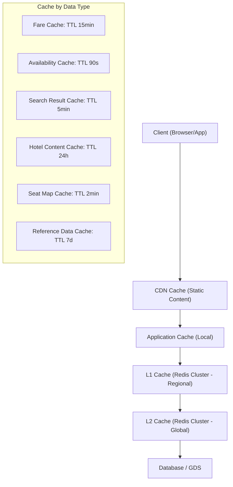
```mermaid
flowchart TB
    Client["Client (Browser/App)"] --> CDN["CDN Cache (Static Content)"]
    CDN --> AppCache["Application Cache (Local)"]
    AppCache --> L1["L1 Cache (Redis Cluster - Regional)"]
    L1 --> L2["L2 Cache (Redis Cluster - Global)"]
    L2 --> DB["Database / GDS"]

    subgraph Cache_Types["Cache by Data Type"]
        FareC["Fare Cache: TTL 15min"]
        AvailC["Availability Cache: TTL 90s"]
        SearchC["Search Result Cache: TTL 5min"]
        HotelC["Hotel Content Cache: TTL 24h"]
        SeatC["Seat Map Cache: TTL 2min"]
        RefC["Reference Data Cache: TTL 7d"]
    end
```

### Fare Cache Design

```
Cache tier: Redis Cluster (dedicated)
Cluster size: 20 nodes, 64 GB RAM each (1.28 TB total)
Eviction: volatile-ttl (only evict keys with TTL set)

Key design:
  fare:search:{search_hash}          -> Full search response (TTL: 5 min)
  fare:route:{O}:{D}:{date}:{cabin}  -> Available fares list (TTL: 15 min)
  fare:offer:{offer_id}              -> Single offer details (TTL: 30 min)
  fare:rules:{fare_basis}            -> Fare rules (TTL: 24 hours)
  fare:tax:{country}:{date}          -> Tax components (TTL: 1 hour)

Cache warming strategy:
  - Top 500 routes pre-cached every 10 minutes via background jobs
  - Search results cached on first request for subsequent users
  - Fare rules bulk-loaded from ATPCO feed daily

Cache invalidation:
  - TTL-based expiry (primary mechanism)
  - Event-driven invalidation for schedule changes
  - Manual purge via operator dashboard for fare filing updates
```

### Availability Cache Design

```
Cache tier: Redis Cluster (shared with fare cache)

Hotel availability:
  Key: havail:{property_id}:{date}:{room_type}
  Value: {available: 3, held: 1, price: 210.00, stop_sell: false}
  TTL: 60 seconds
  Update: Write-through on booking, async refresh from channel manager

Flight availability:
  Key: favail:{carrier}:{flight}:{date}
  Value: {Y: 45, B: 12, M: 0, H: 8, ...}   // Seats per booking class
  TTL: 90 seconds
  Update: Invalidated on booking, refreshed from GDS on next request

Seat map:
  Key: seatmap:{flight_id}
  Value: Compressed seat map JSON with status per seat
  TTL: 120 seconds
  Update: Event-driven on seat hold/release
```

### Search Result Cache

```
Purpose: Avoid redundant GDS queries for identical searches
Key: search:{hash(origin, dest, dates, pax, cabin, filters)}
Value: Serialized search response with offer IDs
TTL: 5 minutes (economy), 3 minutes (business/first)
Hit rate target: 60-70% (top routes), 30-40% (long tail)

Deduplication:
  - Hash normalization: sort filters, normalize airport codes, collapse equivalent dates
  - Partial cache: if user changes sort order, reuse cached offers, re-sort client-side
  - Stale-while-revalidate: serve stale cache while refreshing in background
```

---

## Queue / Stream Design

### Booking Confirmation Pipeline

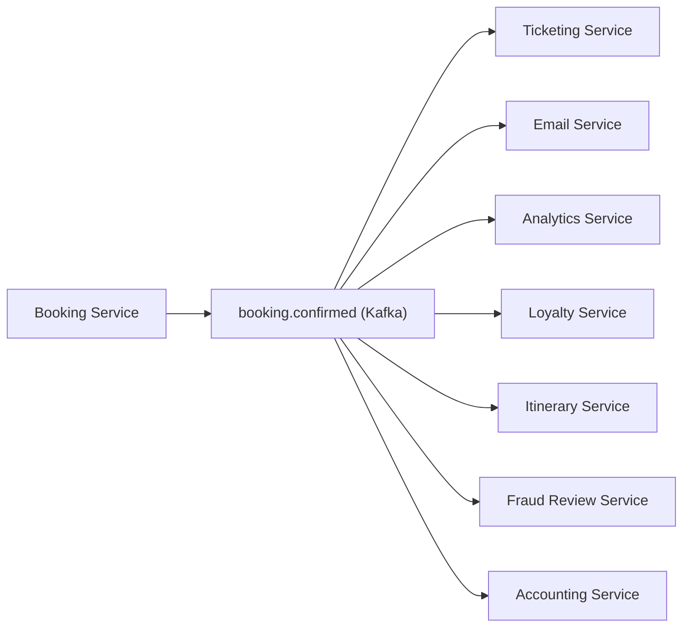
```mermaid
flowchart LR
    BookSvc["Booking Service"] --> BookTopic["booking.confirmed (Kafka)"]
    BookTopic --> TicketSvc["Ticketing Service"]
    BookTopic --> EmailSvc["Email Service"]
    BookTopic --> AnalyticsSvc["Analytics Service"]
    BookTopic --> LoyaltySvc["Loyalty Service"]
    BookTopic --> ItinerarySvc["Itinerary Service"]
    BookTopic --> FraudSvc["Fraud Review Service"]
    BookTopic --> AccountingSvc["Accounting Service"]
```

### Kafka Topic Design

| Topic | Partitions | Retention | Key | Consumers |
|-------|-----------|-----------|-----|-----------|
| `booking.created` | 32 | 7 days | booking_id | Ticketing, Email, Analytics, Fraud |
| `booking.confirmed` | 32 | 30 days | booking_id | Itinerary, Loyalty, Accounting |
| `booking.cancelled` | 16 | 30 days | booking_id | Refund, Itinerary, Analytics |
| `booking.modified` | 16 | 7 days | booking_id | Email, Itinerary, Accounting |
| `schedule.change` | 8 | 7 days | flight_id | Re-accommodation, Email, Itinerary |
| `inventory.updated` | 64 | 3 days | property_id or flight_id | Cache Invalidation, Availability |
| `price.changed` | 32 | 1 day | route_key | Fare Cache, Alert Service |
| `seat.status.changed` | 16 | 3 days | flight_id | Seat Map Cache, Notification |
| `payment.status` | 16 | 30 days | payment_id | Booking Orchestrator, Accounting |
| `gds.response.log` | 8 | 7 days | request_id | GDS Cost Analytics, Debugging |

### Schedule Change Propagation Pipeline

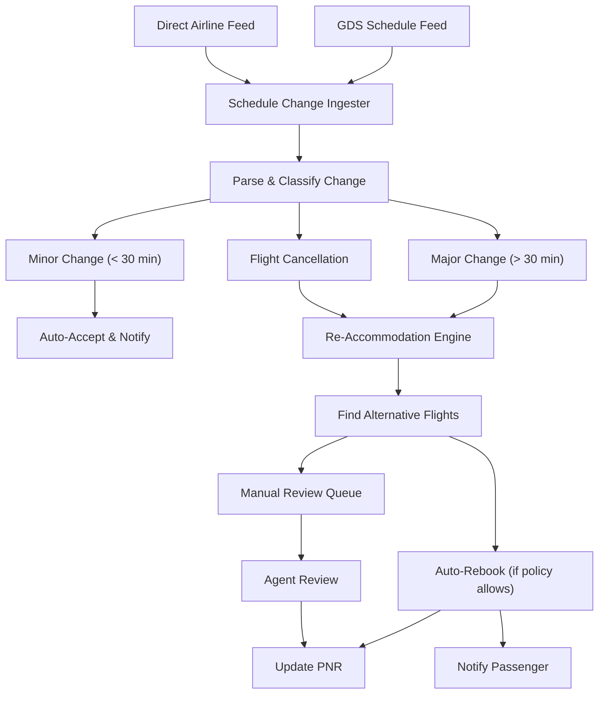
```mermaid
flowchart TB
    GDS["GDS Schedule Feed"] --> Ingest["Schedule Change Ingester"]
    Airline["Direct Airline Feed"] --> Ingest
    Ingest --> Parse["Parse & Classify Change"]
    Parse --> Minor["Minor Change (< 30 min)"]
    Parse --> Major["Major Change (> 30 min)"]
    Parse --> Cancel["Flight Cancellation"]

    Minor --> AutoAccept["Auto-Accept & Notify"]
    Major --> ReAccom["Re-Accommodation Engine"]
    Cancel --> ReAccom

    ReAccom --> FindAlt["Find Alternative Flights"]
    FindAlt --> AutoRebook["Auto-Rebook (if policy allows)"]
    FindAlt --> ManualQueue["Manual Review Queue"]

    AutoRebook --> UpdatePNR["Update PNR"]
    AutoRebook --> NotifyPax["Notify Passenger"]
    ManualQueue --> AgentReview["Agent Review"]
    AgentReview --> UpdatePNR
```

### Dead Letter Queue Strategy

```
DLQ configuration per consumer group:
  - Max retries: 3 (with exponential backoff: 1s, 10s, 60s)
  - DLQ topic: {original_topic}.dlq
  - DLQ retention: 30 days
  - Alert on DLQ depth > 100 messages

DLQ processing:
  - Automated retry scheduler checks DLQ every 5 minutes
  - Messages older than 24 hours escalated to operations dashboard
  - Manual replay tool allows operators to reprocess specific messages
  - Poison message detection: if same message fails 5+ times, quarantine
```

---

## State Machines

### PNR Lifecycle State Machine

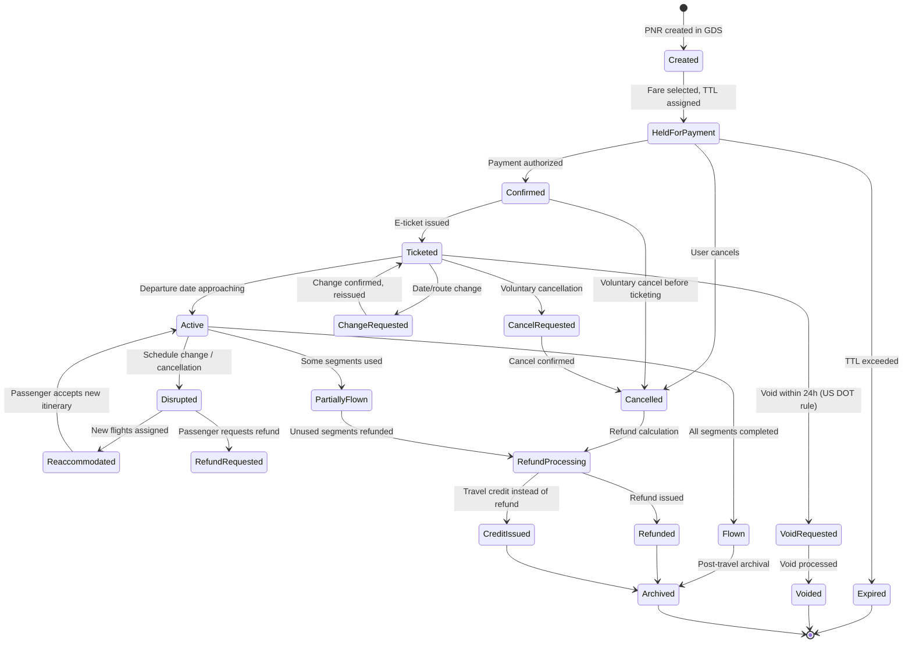
```mermaid
stateDiagram-v2
    [*] --> Created : PNR created in GDS
    Created --> HeldForPayment : Fare selected, TTL assigned
    HeldForPayment --> Confirmed : Payment authorized
    HeldForPayment --> Expired : TTL exceeded
    HeldForPayment --> Cancelled : User cancels
    Confirmed --> Ticketed : E-ticket issued
    Confirmed --> Cancelled : Voluntary cancel before ticketing
    Ticketed --> Active : Departure date approaching
    Active --> Flown : All segments completed
    Active --> PartiallyFlown : Some segments used
    Active --> Disrupted : Schedule change / cancellation
    Disrupted --> Reaccommodated : New flights assigned
    Disrupted --> RefundRequested : Passenger requests refund
    Reaccommodated --> Active : Passenger accepts new itinerary
    Ticketed --> VoidRequested : Void within 24h (US DOT rule)
    VoidRequested --> Voided : Void processed
    Ticketed --> ChangeRequested : Date/route change
    ChangeRequested --> Ticketed : Change confirmed, reissued
    Ticketed --> CancelRequested : Voluntary cancellation
    CancelRequested --> Cancelled : Cancel confirmed
    Cancelled --> RefundProcessing : Refund calculation
    RefundProcessing --> Refunded : Refund issued
    RefundProcessing --> CreditIssued : Travel credit instead of refund
    PartiallyFlown --> RefundProcessing : Unused segments refunded
    Flown --> Archived : Post-travel archival
    Expired --> [*]
    Voided --> [*]
    Refunded --> Archived
    CreditIssued --> Archived
    Archived --> [*]
```

### Hotel Reservation State Machine

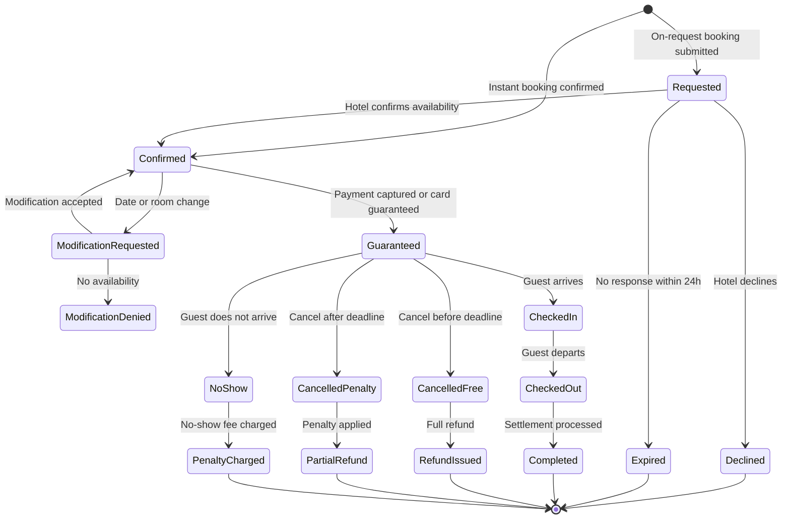
```mermaid
stateDiagram-v2
    [*] --> Requested : On-request booking submitted
    [*] --> Confirmed : Instant booking confirmed
    Requested --> Confirmed : Hotel confirms availability
    Requested --> Declined : Hotel declines
    Requested --> Expired : No response within 24h
    Confirmed --> Guaranteed : Payment captured or card guaranteed
    Confirmed --> ModificationRequested : Date or room change
    ModificationRequested --> Confirmed : Modification accepted
    ModificationRequested --> ModificationDenied : No availability
    Guaranteed --> CheckedIn : Guest arrives
    Guaranteed --> CancelledFree : Cancel before deadline
    Guaranteed --> CancelledPenalty : Cancel after deadline
    Guaranteed --> NoShow : Guest does not arrive
    CheckedIn --> CheckedOut : Guest departs
    CheckedOut --> Completed : Settlement processed
    CancelledFree --> RefundIssued : Full refund
    CancelledPenalty --> PartialRefund : Penalty applied
    NoShow --> PenaltyCharged : No-show fee charged
    Declined --> [*]
    Expired --> [*]
    Completed --> [*]
    RefundIssued --> [*]
    PartialRefund --> [*]
    PenaltyCharged --> [*]
```

### Seat Assignment State Machine

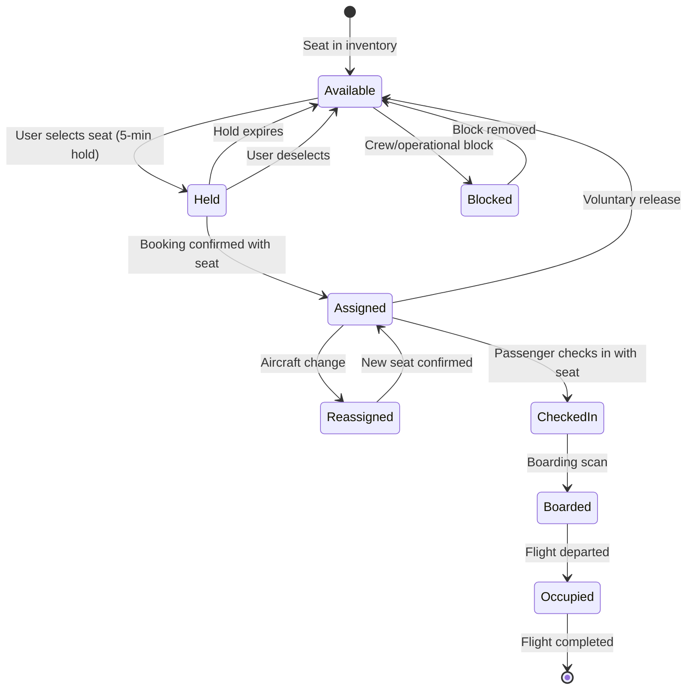
```mermaid
stateDiagram-v2
    [*] --> Available : Seat in inventory
    Available --> Held : User selects seat (5-min hold)
    Held --> Assigned : Booking confirmed with seat
    Held --> Available : Hold expires
    Held --> Available : User deselects
    Assigned --> Available : Voluntary release
    Assigned --> Reassigned : Aircraft change
    Reassigned --> Assigned : New seat confirmed
    Available --> Blocked : Crew/operational block
    Blocked --> Available : Block removed
    Assigned --> CheckedIn : Passenger checks in with seat
    CheckedIn --> Boarded : Boarding scan
    Boarded --> Occupied : Flight departed
    Occupied --> [*] : Flight completed
```

### Fare Class Availability State Machine

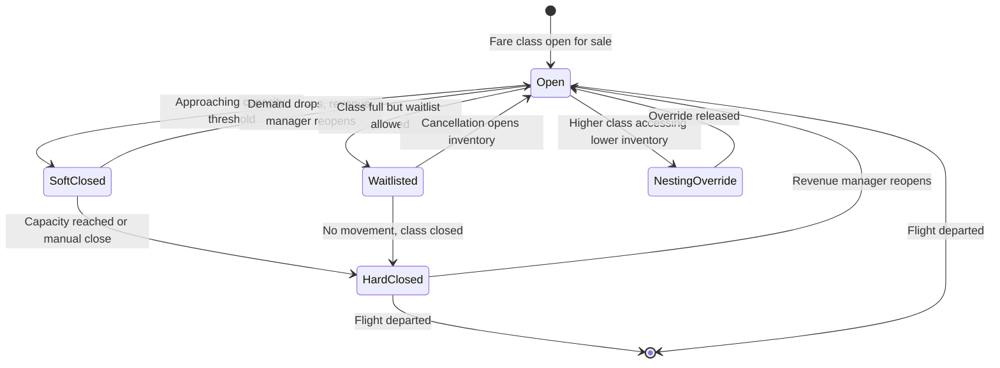
```mermaid
stateDiagram-v2
    [*] --> Open : Fare class open for sale
    Open --> SoftClosed : Approaching capacity threshold
    SoftClosed --> Open : Demand drops, revenue manager reopens
    SoftClosed --> HardClosed : Capacity reached or manual close
    HardClosed --> Open : Revenue manager reopens
    Open --> Waitlisted : Class full but waitlist allowed
    Waitlisted --> Open : Cancellation opens inventory
    Waitlisted --> HardClosed : No movement, class closed
    Open --> NestingOverride : Higher class accessing lower inventory
    NestingOverride --> Open : Override released
    HardClosed --> [*] : Flight departed
    Open --> [*] : Flight departed
```

### Itinerary State Machine

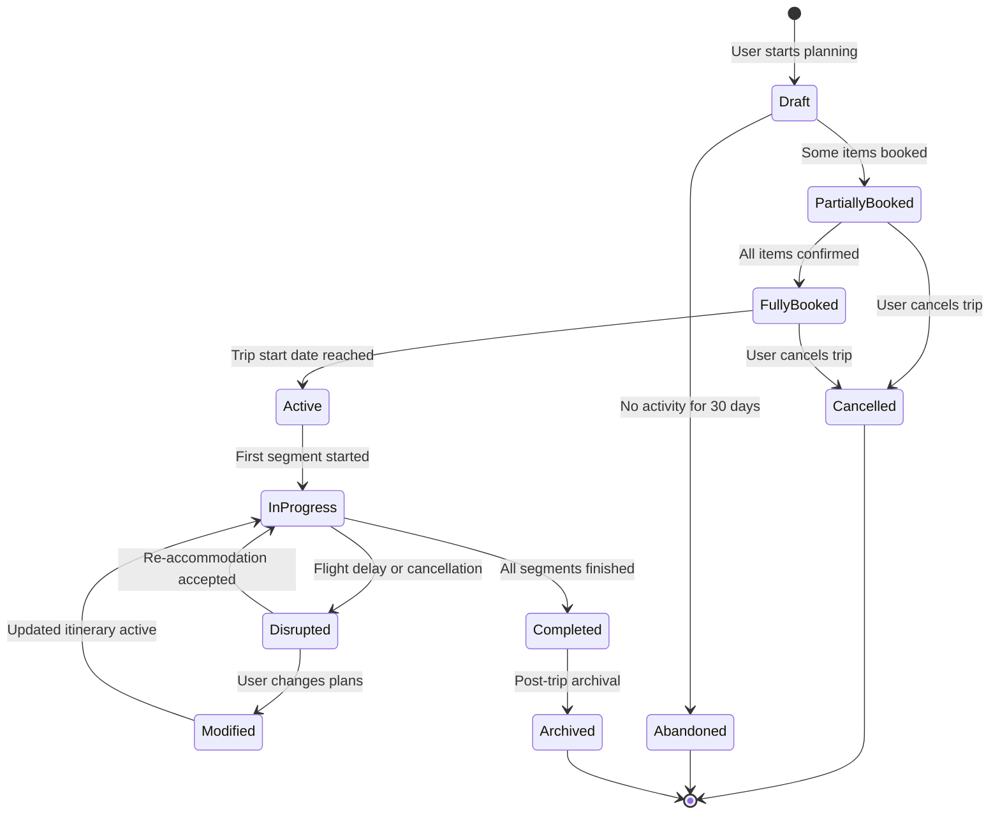
```mermaid
stateDiagram-v2
    [*] --> Draft : User starts planning
    Draft --> PartiallyBooked : Some items booked
    PartiallyBooked --> FullyBooked : All items confirmed
    FullyBooked --> Active : Trip start date reached
    Active --> InProgress : First segment started
    InProgress --> Disrupted : Flight delay or cancellation
    Disrupted --> InProgress : Re-accommodation accepted
    Disrupted --> Modified : User changes plans
    Modified --> InProgress : Updated itinerary active
    InProgress --> Completed : All segments finished
    PartiallyBooked --> Cancelled : User cancels trip
    FullyBooked --> Cancelled : User cancels trip
    Draft --> Abandoned : No activity for 30 days
    Completed --> Archived : Post-trip archival
    Cancelled --> [*]
    Abandoned --> [*]
    Archived --> [*]
```

---

## Sequence Diagrams

### Flight Search-to-Book Flow

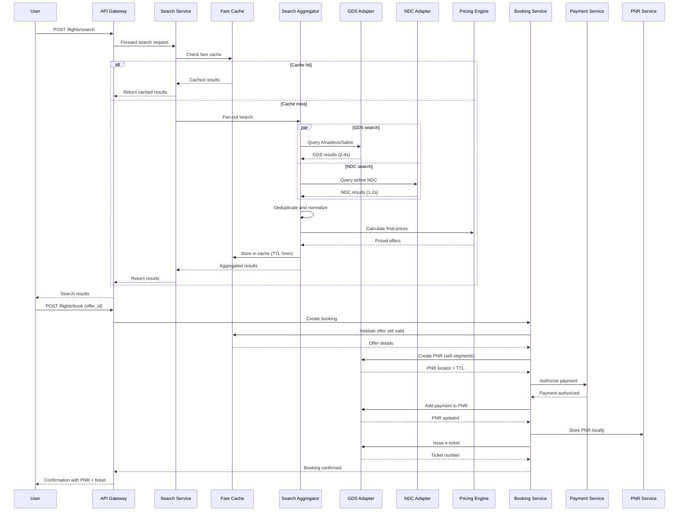
```mermaid
sequenceDiagram
    participant User
    participant API as API Gateway
    participant Search as Search Service
    participant Cache as Fare Cache
    participant Agg as Search Aggregator
    participant GDS as GDS Adapter
    participant NDC as NDC Adapter
    participant Price as Pricing Engine
    participant Book as Booking Service
    participant Pay as Payment Service
    participant PNR as PNR Service

    User->>API: POST /flights/search
    API->>Search: Forward search request
    Search->>Cache: Check fare cache
    alt Cache hit
        Cache-->>Search: Cached results
        Search-->>API: Return cached results
    else Cache miss
        Search->>Agg: Fan-out search
        par GDS search
            Agg->>GDS: Query Amadeus/Sabre
            GDS-->>Agg: GDS results (2-4s)
        and NDC search
            Agg->>NDC: Query airline NDC
            NDC-->>Agg: NDC results (1-2s)
        end
        Agg->>Agg: Deduplicate and normalize
        Agg->>Price: Calculate final prices
        Price-->>Agg: Priced offers
        Agg->>Cache: Store in cache (TTL 5min)
        Agg-->>Search: Aggregated results
        Search-->>API: Return results
    end
    API-->>User: Search results

    User->>API: POST /flights/book (offer_id)
    API->>Book: Create booking
    Book->>Cache: Validate offer still valid
    Cache-->>Book: Offer details
    Book->>GDS: Create PNR (sell segments)
    GDS-->>Book: PNR locator + TTL
    Book->>Pay: Authorize payment
    Pay-->>Book: Payment authorized
    Book->>GDS: Add payment to PNR
    GDS-->>Book: PNR updated
    Book->>PNR: Store PNR locally
    Book->>GDS: Issue e-ticket
    GDS-->>Book: Ticket number
    Book-->>API: Booking confirmed
    API-->>User: Confirmation with PNR + ticket
```

### Hotel Availability Check and Booking

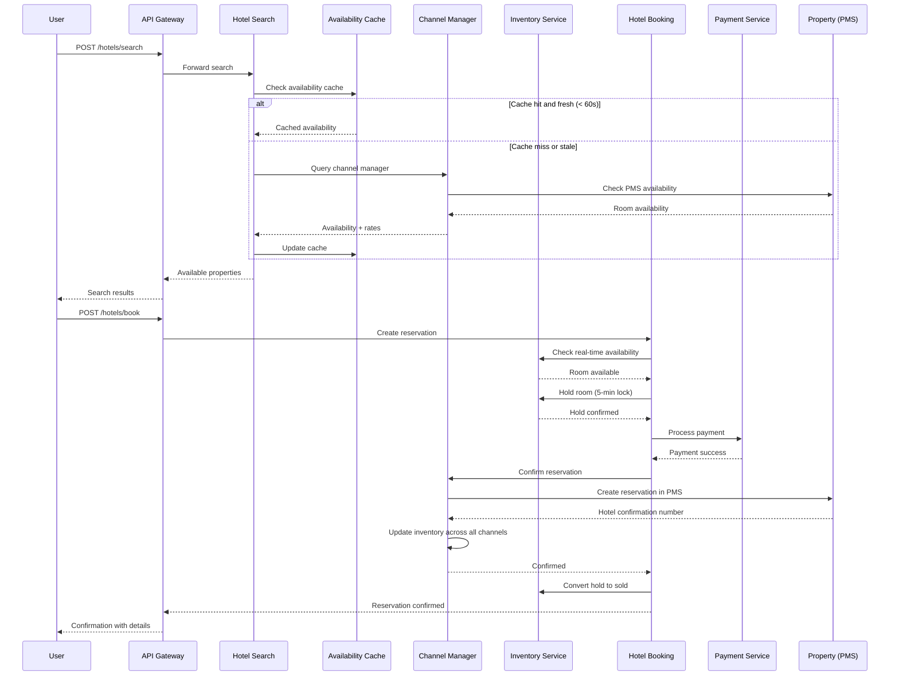
```mermaid
sequenceDiagram
    participant User
    participant API as API Gateway
    participant Search as Hotel Search
    participant Cache as Availability Cache
    participant CM as Channel Manager
    participant Inv as Inventory Service
    participant Book as Hotel Booking
    participant Pay as Payment Service
    participant Prop as Property (PMS)

    User->>API: POST /hotels/search
    API->>Search: Forward search
    Search->>Cache: Check availability cache
    alt Cache hit and fresh (< 60s)
        Cache-->>Search: Cached availability
    else Cache miss or stale
        Search->>CM: Query channel manager
        CM->>Prop: Check PMS availability
        Prop-->>CM: Room availability
        CM-->>Search: Availability + rates
        Search->>Cache: Update cache
    end
    Search-->>API: Available properties
    API-->>User: Search results

    User->>API: POST /hotels/book
    API->>Book: Create reservation
    Book->>Inv: Check real-time availability
    Inv-->>Book: Room available
    Book->>Inv: Hold room (5-min lock)
    Inv-->>Book: Hold confirmed
    Book->>Pay: Process payment
    Pay-->>Book: Payment success
    Book->>CM: Confirm reservation
    CM->>Prop: Create reservation in PMS
    Prop-->>CM: Hotel confirmation number
    CM->>CM: Update inventory across all channels
    CM-->>Book: Confirmed
    Book->>Inv: Convert hold to sold
    Book-->>API: Reservation confirmed
    API-->>User: Confirmation with details
```

### Seat Selection Flow

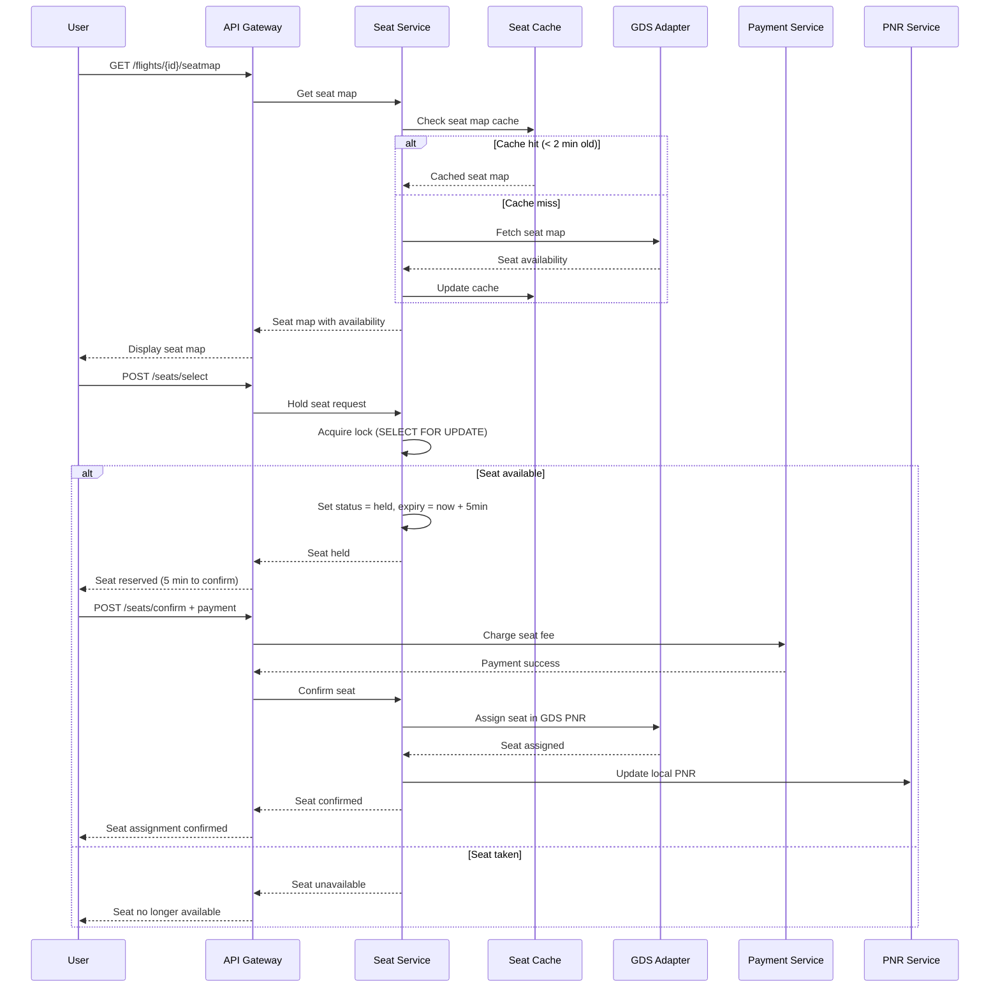
```mermaid
sequenceDiagram
    participant User
    participant API as API Gateway
    participant Seat as Seat Service
    participant Cache as Seat Cache
    participant GDS as GDS Adapter
    participant Pay as Payment Service
    participant PNR as PNR Service

    User->>API: GET /flights/{id}/seatmap
    API->>Seat: Get seat map
    Seat->>Cache: Check seat map cache
    alt Cache hit (< 2 min old)
        Cache-->>Seat: Cached seat map
    else Cache miss
        Seat->>GDS: Fetch seat map
        GDS-->>Seat: Seat availability
        Seat->>Cache: Update cache
    end
    Seat-->>API: Seat map with availability
    API-->>User: Display seat map

    User->>API: POST /seats/select
    API->>Seat: Hold seat request
    Seat->>Seat: Acquire lock (SELECT FOR UPDATE)
    alt Seat available
        Seat->>Seat: Set status = held, expiry = now + 5min
        Seat-->>API: Seat held
        API-->>User: Seat reserved (5 min to confirm)
        User->>API: POST /seats/confirm + payment
        API->>Pay: Charge seat fee
        Pay-->>API: Payment success
        API->>Seat: Confirm seat
        Seat->>GDS: Assign seat in GDS PNR
        GDS-->>Seat: Seat assigned
        Seat->>PNR: Update local PNR
        Seat-->>API: Seat confirmed
        API-->>User: Seat assignment confirmed
    else Seat taken
        Seat-->>API: Seat unavailable
        API-->>User: Seat no longer available
    end
```

### Dynamic Price Calculation Flow

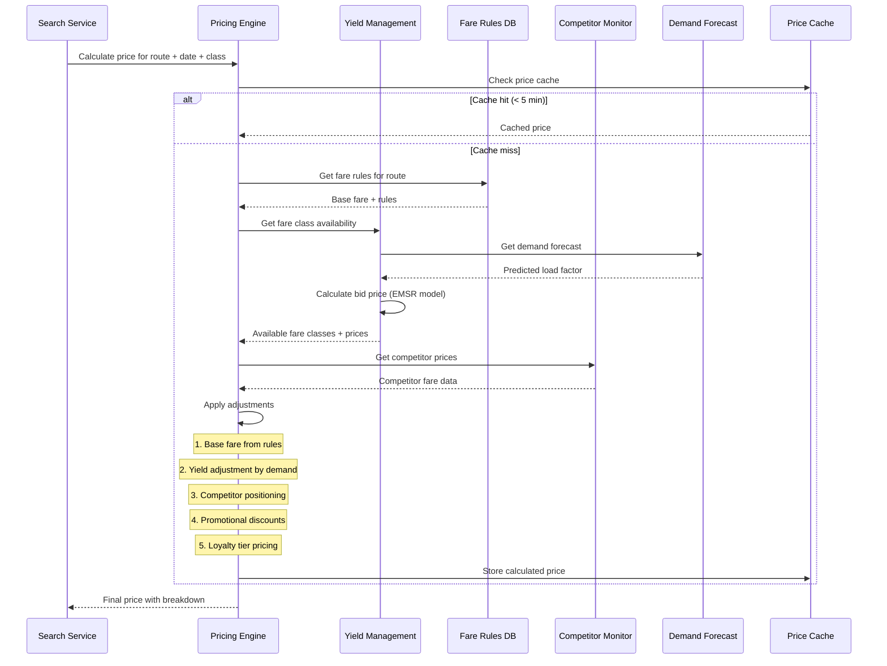
```mermaid
sequenceDiagram
    participant Search as Search Service
    participant Price as Pricing Engine
    participant YM as Yield Management
    participant Rules as Fare Rules DB
    participant Comp as Competitor Monitor
    participant Forecast as Demand Forecast
    participant Cache as Price Cache

    Search->>Price: Calculate price for route + date + class
    Price->>Cache: Check price cache
    alt Cache hit (< 5 min)
        Cache-->>Price: Cached price
    else Cache miss
        Price->>Rules: Get fare rules for route
        Rules-->>Price: Base fare + rules
        Price->>YM: Get fare class availability
        YM->>Forecast: Get demand forecast
        Forecast-->>YM: Predicted load factor
        YM->>YM: Calculate bid price (EMSR model)
        YM-->>Price: Available fare classes + prices
        Price->>Comp: Get competitor prices
        Comp-->>Price: Competitor fare data
        Price->>Price: Apply adjustments
        Note over Price: 1. Base fare from rules
        Note over Price: 2. Yield adjustment by demand
        Note over Price: 3. Competitor positioning
        Note over Price: 4. Promotional discounts
        Note over Price: 5. Loyalty tier pricing
        Price->>Cache: Store calculated price
    end
    Price-->>Search: Final price with breakdown
```

### GDS Integration — PNR Creation Flow

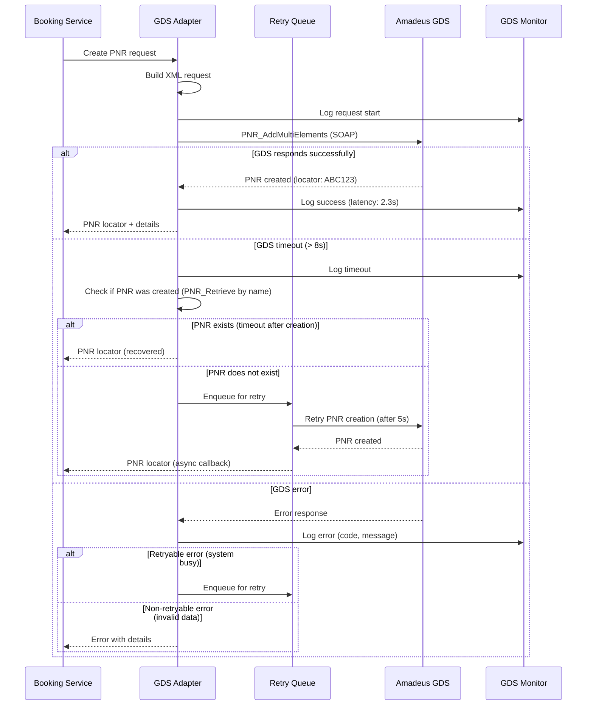
```mermaid
sequenceDiagram
    participant Book as Booking Service
    participant Adapter as GDS Adapter
    participant Queue as Retry Queue
    participant GDS as Amadeus GDS
    participant Monitor as GDS Monitor

    Book->>Adapter: Create PNR request
    Adapter->>Adapter: Build XML request
    Adapter->>Monitor: Log request start
    Adapter->>GDS: PNR_AddMultiElements (SOAP)
    alt GDS responds successfully
        GDS-->>Adapter: PNR created (locator: ABC123)
        Adapter->>Monitor: Log success (latency: 2.3s)
        Adapter-->>Book: PNR locator + details
    else GDS timeout (> 8s)
        Adapter->>Monitor: Log timeout
        Adapter->>Adapter: Check if PNR was created (PNR_Retrieve by name)
        alt PNR exists (timeout after creation)
            Adapter-->>Book: PNR locator (recovered)
        else PNR does not exist
            Adapter->>Queue: Enqueue for retry
            Queue->>GDS: Retry PNR creation (after 5s)
            GDS-->>Queue: PNR created
            Queue-->>Book: PNR locator (async callback)
        end
    else GDS error
        GDS-->>Adapter: Error response
        Adapter->>Monitor: Log error (code, message)
        alt Retryable error (system busy)
            Adapter->>Queue: Enqueue for retry
        else Non-retryable error (invalid data)
            Adapter-->>Book: Error with details
        end
    end
```

---

## Concurrency Control

### Double-Booking Prevention

The core challenge is preventing two users from booking the same seat, the same hotel room on the same night, or the same fare class inventory after it reaches zero.

**Strategy 1: Pessimistic Locking (Seat Allocation)**
```sql
-- Seat selection with row-level lock
BEGIN;
SELECT * FROM seat_inventory
WHERE flight_id = $1 AND row_number = $2 AND column_label = $3
FOR UPDATE NOWAIT;

-- If seat is available, hold it
UPDATE seat_inventory
SET status = 'held',
    held_by = $4,
    hold_expires = NOW() + INTERVAL '5 minutes'
WHERE flight_id = $1 AND row_number = $2 AND column_label = $3
  AND status = 'available';

-- Check rows affected: if 0, seat was taken between SELECT and UPDATE
COMMIT;
```

**Strategy 2: Optimistic Locking with Version (Hotel Inventory)**
```sql
-- Read current inventory with version
SELECT available_rooms, version
FROM hotel_inventory
WHERE property_id = $1 AND room_type_id = $2 AND date = $3;

-- Attempt update only if version matches
UPDATE hotel_inventory
SET sold_rooms = sold_rooms + 1,
    version = version + 1
WHERE property_id = $1 AND room_type_id = $2 AND date = $3
  AND version = $expected_version
  AND available_rooms > 0;

-- If rows affected = 0: either version changed (retry) or no availability
```

**Strategy 3: Atomic Counter with Compare-and-Swap (Fare Class)**
```
-- Redis atomic decrement for fare class inventory
WATCH fare_class:{flight}:{class}
available = GET fare_class:{flight}:{class}
if available > 0:
    MULTI
    DECR fare_class:{flight}:{class}
    EXEC
    -- if EXEC returns nil, someone else modified -> retry
```

### Hold Timeout Enforcement

```
Hold expiration runner (every 30 seconds):
1. Query: SELECT * FROM seat_inventory WHERE status = 'held' AND hold_expires < NOW()
2. For each expired hold:
   a. UPDATE seat_inventory SET status = 'available', held_by = NULL WHERE seat_id = $1 AND status = 'held'
   b. Publish event: seat.hold.expired {seat_id, flight_id, previously_held_by}
   c. If payment was in progress for this hold: trigger compensation check

Hotel hold expiration:
  - Same pattern but on hotel_inventory.held_rooms
  - Decrement held_rooms, no change to sold_rooms
  - Notify user that hold expired

PNR ticketing deadline:
  - GDS enforces TTL natively
  - Platform runs parallel TTL checker to pre-warn users
  - If TTL passes without ticketing: PNR auto-cancels in GDS
  - Platform must sync cancellation status
```

### Group Booking Concurrency

```
Group booking for N seats:
1. Sort seats by (row, column) to prevent deadlock
2. Acquire locks in sorted order
3. Verify all N seats available
4. If any seat unavailable: release all locks, return partial availability
5. If all available: hold all N seats atomically
6. Single payment for group
7. On timeout: release all N seats

Implementation:
  - Use advisory locks in PostgreSQL: pg_advisory_xact_lock(seat_id_hash)
  - Or: batch UPDATE with WHERE seat_id IN (...) AND status = 'available'
  - Check rows_affected == N; if not, rollback entire transaction
```

---

## Idempotency

### Booking Deduplication

```
Idempotency key flow:
1. Client generates unique key: Idempotency-Key header
2. Before processing, check idempotency store:
   GET idempotency:{key}
   - If exists and status = "completed": return stored response
   - If exists and status = "processing": return 409 Conflict (in progress)
   - If not exists: proceed

3. Set idempotency key with TTL:
   SET idempotency:{key} {status: "processing", started_at: now} EX 3600

4. Process booking:
   - Create PNR in GDS
   - Process payment
   - Store booking record

5. On success:
   SET idempotency:{key} {status: "completed", response: {...}} EX 86400

6. On failure:
   SET idempotency:{key} {status: "failed", error: {...}} EX 3600
   (shorter TTL for failures to allow retry)

Table: idempotency_keys
  idempotency_key      VARCHAR(64) PRIMARY KEY
  operation            VARCHAR(50) NOT NULL       -- 'flight_booking', 'hotel_booking', etc.
  status               ENUM('processing','completed','failed')
  request_hash         VARCHAR(64)                -- SHA256 of request body
  response_body        JSONB
  booking_id           UUID                       -- If completed
  created_at           TIMESTAMP WITH TIME ZONE
  expires_at           TIMESTAMP WITH TIME ZONE
```

### Payment Retry Safety

```
Payment idempotency:
1. Generate payment_reference_id before first attempt
2. Pass payment_reference_id to PSP as idempotency key
3. PSP guarantees: same reference = same charge (no double-charge)

GDS operation idempotency:
  - PNR creation: use passenger name + date + route as dedup key
    Before creating PNR: search for existing PNR with same passenger + route
  - Ticketing: e-ticket number is unique; re-ticketing same coupon is idempotent
  - Seat assignment: (flight_id, passenger_id) is a natural dedup key

Retry strategy:
  Attempt 1: immediate
  Attempt 2: after 1 second
  Attempt 3: after 5 seconds
  Attempt 4: after 30 seconds
  After 4 failures: move to manual review queue

  Before each retry: check if previous attempt actually succeeded
  (GDS timeout does not mean failure)
```

---

## Consistency Model

### Consistency Spectrum Across Subsystems

| Data | Consistency Level | Mechanism | Rationale |
|------|------------------|-----------|-----------|
| Seat assignment | Strong (linearizable) | PostgreSQL row lock + SELECT FOR UPDATE | Must prevent double-booking |
| Hotel room inventory per night | Strong per property | Optimistic locking with version counter | Multi-night atomic check |
| Fare class inventory count | Strong per flight | Redis atomic operations | Prevent oversell |
| PNR state | Strong per PNR | Single-writer, versioned updates | State machine integrity |
| Flight search results | Eventual (< 30s stale) | TTL-based cache | Freshness vs. GDS cost |
| Hotel search results | Eventual (< 60s stale) | Channel manager sync + cache | Cross-channel sync delay |
| Pricing display | Eventual (< 5min stale) | Cache with background refresh | Price changes are batched |
| Itinerary read | Read-after-write | Session-sticky reads from primary | User sees own changes |
| Analytics/reporting | Eventual (< 5min lag) | Kafka consumer lag | Non-blocking analytics |
| Loyalty point balance | Eventual (< 30s lag) | Async event from booking | Points appear shortly after booking |

### Handling Stale Search Results at Booking Time

```
Problem: User sees price P1 in search cache but actual price is now P2.

Strategy: "Price check at booking time"
1. User selects offer from cached search results
2. Booking service re-validates with GDS/source:
   - If same price: proceed
   - If price increased < 5%: proceed with new price, show "price updated" notice
   - If price increased 5-20%: show warning, require user re-confirmation
   - If price increased > 20% or fare class closed: fail with "price changed" error
   - If price decreased: apply lower price (delightful UX)

3. If GDS re-validation times out:
   - Fall back to cached price if cache age < 5 minutes
   - Add fare guarantee flag: if actual price is higher, platform absorbs difference up to $50
   - This reduces user friction while limiting financial exposure
```

---

## Distributed Transaction / Saga

### Multi-Segment Flight Booking Saga

For a multi-city itinerary (e.g., JFK-LHR, LHR-CDG, CDG-JFK), all segments must be booked atomically. If any segment fails, previously booked segments must be cancelled.

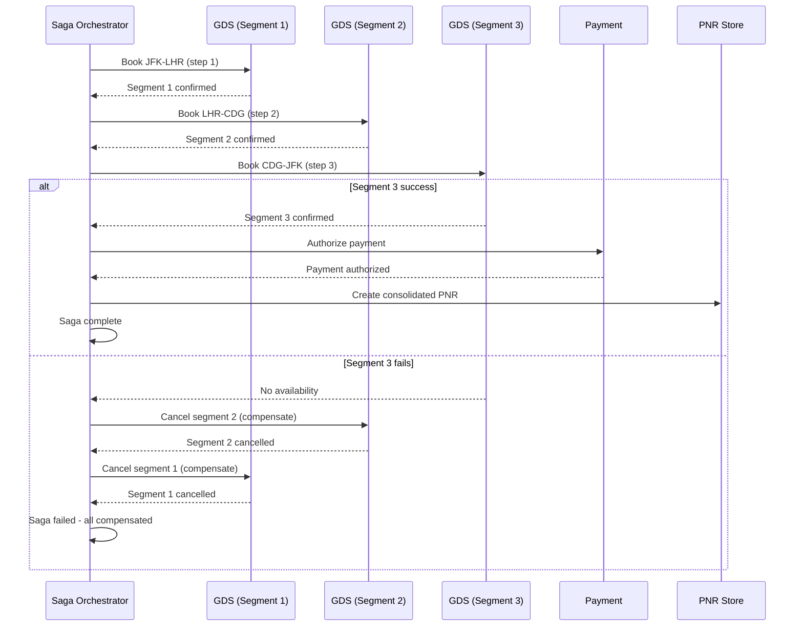
```mermaid
sequenceDiagram
    participant Orch as Saga Orchestrator
    participant GDS1 as GDS (Segment 1)
    participant GDS2 as GDS (Segment 2)
    participant GDS3 as GDS (Segment 3)
    participant Pay as Payment
    participant PNR as PNR Store

    Orch->>GDS1: Book JFK-LHR (step 1)
    GDS1-->>Orch: Segment 1 confirmed
    Orch->>GDS2: Book LHR-CDG (step 2)
    GDS2-->>Orch: Segment 2 confirmed
    Orch->>GDS3: Book CDG-JFK (step 3)
    alt Segment 3 success
        GDS3-->>Orch: Segment 3 confirmed
        Orch->>Pay: Authorize payment
        Pay-->>Orch: Payment authorized
        Orch->>PNR: Create consolidated PNR
        Orch->>Orch: Saga complete
    else Segment 3 fails
        GDS3-->>Orch: No availability
        Orch->>GDS2: Cancel segment 2 (compensate)
        GDS2-->>Orch: Segment 2 cancelled
        Orch->>GDS1: Cancel segment 1 (compensate)
        GDS1-->>Orch: Segment 1 cancelled
        Orch->>Orch: Saga failed - all compensated
    end
```

**Saga state table**:
```
Table: saga_instances
  saga_id              UUID PRIMARY KEY
  saga_type            VARCHAR(50)              -- 'multi_segment_booking', 'hotel_flight_bundle'
  status               ENUM('running','completed','compensating','failed','compensated')
  steps                JSONB                    -- Ordered list of steps with status
  current_step         INTEGER
  booking_context      JSONB                    -- User, passengers, payment info
  created_at           TIMESTAMP WITH TIME ZONE
  updated_at           TIMESTAMP WITH TIME ZONE
  timeout_at           TIMESTAMP WITH TIME ZONE

  -- steps JSON example:
  -- [
  --   {"step": 1, "action": "book_segment", "status": "completed", "result": {"locator": "ABC123"}, "compensate": "cancel_segment"},
  --   {"step": 2, "action": "book_segment", "status": "completed", "result": {"locator": "DEF456"}, "compensate": "cancel_segment"},
  --   {"step": 3, "action": "book_segment", "status": "failed", "error": "NO_AVAIL"},
  --   {"step": 4, "action": "authorize_payment", "status": "skipped"}
  -- ]
```

### Hotel + Flight Bundle Saga

```
Bundle booking saga steps:
1. Hold flight fare (reserve inventory, do not ticket yet)
   Compensate: Release fare hold
2. Hold hotel room (decrement available, set status to held)
   Compensate: Release hotel hold
3. Authorize payment for total bundle price
   Compensate: Void payment authorization
4. Confirm flight booking (create PNR, issue ticket)
   Compensate: Cancel PNR, void ticket
5. Confirm hotel reservation
   Compensate: Cancel hotel reservation

Timeout handling:
  - Each step has independent timeout (flight hold: 15 min, hotel hold: 10 min)
  - Saga orchestrator tracks the minimum remaining hold time
  - If any hold is about to expire, accelerate remaining steps or compensate

Partial failure recovery:
  - If payment succeeds but hotel confirmation fails:
    1. Retry hotel confirmation 3 times
    2. If still failing: hold flight, void payment, alert user
    3. Offer to book flight-only with hotel as separate booking
```

---

## Security Design

### PCI Compliance Architecture

```
Card data flow (PCI-DSS Level 1):
  1. Client collects card details in PCI-compliant iframe (Stripe Elements, Adyen Drop-in)
  2. Card details sent directly to PSP (never touches OTA servers)
  3. PSP returns tokenized reference (tok_abc123)
  4. OTA stores only: token, last 4 digits, card brand, expiry month/year
  5. All subsequent operations use token

Scope reduction:
  - Application servers are OUT of PCI scope (no card data)
  - Only the client-side iframe and PSP connection are IN scope
  - Tokenization reduces compliance burden from SAQ-D to SAQ-A

3D Secure flow:
  1. PSP evaluates risk and determines if 3DS challenge needed
  2. If needed: redirect user to bank's 3DS page
  3. Bank authenticates user
  4. Callback to OTA with authentication result
  5. OTA completes payment with authenticated token
```

### PII Protection

```
Encrypted fields (AES-256-GCM):
  - Passport numbers
  - Date of birth (in some jurisdictions)
  - Credit card tokens (additional layer)
  - Travel document scans

Encryption key management:
  - AWS KMS or HashiCorp Vault for key storage
  - Envelope encryption: data key encrypted by master key
  - Key rotation every 90 days
  - Separate keys per data classification level

Data residency:
  - EU passenger data stored in EU region (GDPR)
  - Indian passenger data stored in India (RBI regulations for payment data)
  - US data: any region acceptable

Right to deletion (GDPR):
  - Soft delete: anonymize PII, retain booking structure for accounting
  - Replace: name -> "DELETED USER", email -> hash, passport -> null
  - Retain: booking amounts, dates, routes (non-PII for regulatory)
  - Timeline: 30 days to complete deletion after verified request
```

### Booking Fraud Detection

```
Fraud signals in travel:
  1. Velocity: Multiple bookings from same device/IP in short period
  2. Geographic mismatch: Booking from Nigeria for US domestic flight with US card
  3. High-value one-way: One-way international business class = higher fraud risk
  4. Departure proximity: Booking for same-day departure (fraud usage before detection)
  5. Name mismatch: Card name does not match passenger name
  6. Device fingerprint: Known fraud device or emulator
  7. Email age: Recently created email address

Risk scoring:
  - Low risk (score 0-30): Auto-approve
  - Medium risk (score 31-70): Additional verification (3DS, manual review)
  - High risk (score 71-100): Block and alert fraud team

Post-booking monitoring:
  - Check-in monitoring: Flag if passenger does not check in (potential card test)
  - Chargeback tracking: Flag cards/devices associated with previous chargebacks
  - Velocity alerts: Same card used across multiple OTAs within hours
```

---

## Observability

### Search Conversion Funnel

```
Funnel stages and metrics:
  1. Search initiated       -> Count, by source (web/mobile/app)
  2. Search results shown   -> Count, avg results, zero-result rate
  3. Offer selected         -> Click-through rate per position
  4. Booking started        -> Start rate, avg time from search
  5. Payment initiated      -> Payment reach rate
  6. Booking confirmed      -> Conversion rate (target: 2-4%)
  7. Ticketed               -> Ticketing success rate (target: 99.5%)

Drop-off alerts:
  - Search-to-results drop > 5%: GDS issue or cache miss spike
  - Results-to-click drop > 20%: Pricing or relevance issue
  - Payment-to-confirm drop > 10%: Payment processing issue
  - Confirm-to-ticket drop > 1%: GDS ticketing issue
```

### Key Metrics Dashboard

| Metric | SLO | Alert Threshold | Dashboard |
|--------|-----|-----------------|-----------|
| Flight search p99 latency | < 3s | > 5s for 5 min | Search Health |
| Hotel search p99 latency | < 2s | > 3s for 5 min | Search Health |
| Booking success rate | > 95% | < 90% for 10 min | Booking Health |
| GDS error rate | < 2% | > 5% for 5 min | GDS Integration |
| GDS average latency | < 3s | > 5s for 5 min | GDS Integration |
| Fare cache hit rate | > 60% | < 40% for 15 min | Cache Health |
| Seat double-booking incidents | 0 | > 0 | Critical Alerts |
| Payment authorization rate | > 92% | < 85% for 10 min | Payment Health |
| Schedule change processing lag | < 30 min | > 2 hours | Operations |
| PNR sync discrepancy | < 0.1% | > 1% | Data Integrity |
| Kafka consumer lag | < 1000 | > 10000 for 10 min | Stream Health |
| Hotel inventory sync freshness | < 60s | > 5 min | Inventory Health |

### Distributed Tracing

```
Trace context propagation:
  - W3C Trace Context headers across all services
  - Trace ID included in GDS requests for end-to-end correlation
  - Custom span attributes:
    - travel.search.source: "gds_amadeus" | "ndc_ba" | "direct"
    - travel.booking.pnr_locator: "ABC123"
    - travel.gds.request_type: "availability" | "booking" | "ticketing"
    - travel.gds.response_time_ms: 2340
    - travel.cache.hit: true | false
    - travel.pricing.fare_class: "M"

Sampling strategy:
  - 100% sampling for bookings (high value)
  - 10% sampling for searches (high volume)
  - 100% sampling for errors
  - 100% sampling for GDS timeouts
```

---

## Reliability and Resilience

### GDS Failover Strategy

```
Multi-GDS failover:
  Primary: Amadeus (70% of searches)
  Secondary: Sabre (20% of searches)
  Tertiary: Travelport (10% of searches)

Failover triggers:
  - Error rate > 5% sustained for 2 minutes
  - Latency p99 > 8 seconds sustained for 3 minutes
  - Connection pool exhaustion
  - GDS maintenance window (pre-scheduled)

Failover behavior:
  1. Circuit breaker opens for failed GDS
  2. Traffic redistributed to healthy GDS providers
  3. Cached results served where available (with staleness indicator)
  4. New bookings routed to healthy GDS only
  5. Existing PNRs on failed GDS: queue modifications until recovery
  6. Alert operations team

Recovery:
  - Half-open circuit: send 5% of traffic to recovering GDS
  - If success rate > 95%: gradually increase to 25%, 50%, 100%
  - Full recovery typically takes 10-15 minutes of observation
```

### Degraded Search Mode

```
When GDS is unavailable:
  Level 1 - Cached results only:
    - Serve results from fare cache (up to 15 min stale)
    - Show "prices as of X minutes ago" disclaimer
    - Allow booking if cache is < 5 min old

  Level 2 - Static schedule only:
    - Show flight schedules without real-time pricing
    - Display "price on request" or last known price
    - Disable direct booking, enable "notify when available"

  Level 3 - Maintenance mode:
    - Show maintenance page for affected routes
    - Redirect to partner OTAs
    - Queue search requests for processing when GDS recovers

Hotel search degraded mode:
  - Channel manager down: serve last cached availability (flag as "subject to availability")
  - Switch to on-request booking model (hotel confirms within 24h)
  - Priority: never show sold-out rooms as available (better to hide than to over-promise)
```

### Retry and Timeout Strategy

| Operation | Timeout | Retries | Backoff | Circuit Breaker |
|-----------|---------|---------|---------|-----------------|
| GDS search | 8s | 1 | N/A (fallback to cache) | 5% error rate for 2min |
| GDS booking | 15s | 2 | 2s, 5s | 10% error rate for 5min |
| GDS ticketing | 30s | 3 | 5s, 15s, 30s | N/A (manual escalation) |
| Payment auth | 10s | 2 | 1s, 3s | 5% error rate for 1min |
| Channel manager | 5s | 2 | 1s, 3s | 10% error rate for 3min |
| Internal service | 3s | 3 | 500ms, 1s, 2s | 5% error rate for 1min |
| Database query | 5s | 1 | N/A | N/A (failover to replica) |
| Cache read | 100ms | 1 | N/A | Skip cache, hit DB |

---

## Multi-Region Architecture

### Regional Deployment

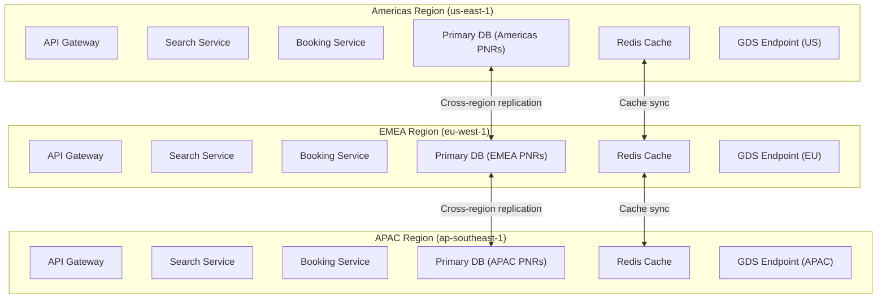
```mermaid
flowchart TB
    subgraph Americas["Americas Region (us-east-1)"]
        US_GW["API Gateway"]
        US_Search["Search Service"]
        US_Book["Booking Service"]
        US_DB["Primary DB (Americas PNRs)"]
        US_Cache["Redis Cache"]
        US_GDS["GDS Endpoint (US)"]
    end

    subgraph EMEA["EMEA Region (eu-west-1)"]
        EU_GW["API Gateway"]
        EU_Search["Search Service"]
        EU_Book["Booking Service"]
        EU_DB["Primary DB (EMEA PNRs)"]
        EU_Cache["Redis Cache"]
        EU_GDS["GDS Endpoint (EU)"]
    end

    subgraph APAC["APAC Region (ap-southeast-1)"]
        AP_GW["API Gateway"]
        AP_Search["Search Service"]
        AP_Book["Booking Service"]
        AP_DB["Primary DB (APAC PNRs)"]
        AP_Cache["Redis Cache"]
        AP_GDS["GDS Endpoint (APAC)"]
    end

    US_DB <-->|Cross-region replication| EU_DB
    EU_DB <-->|Cross-region replication| AP_DB
    US_Cache <-->|Cache sync| EU_Cache
    EU_Cache <-->|Cache sync| AP_Cache
```

### Regional GDS Endpoints

| Region | Primary GDS | GDS Endpoint | Latency to GDS | Notes |
|--------|------------|--------------|-----------------|-------|
| Americas | Amadeus | ama-us.gds.example.com | 50-200ms | US data center |
| EMEA | Amadeus | ama-eu.gds.example.com | 30-150ms | Nice/Madrid data center |
| APAC | Travelport | tvp-ap.gds.example.com | 50-250ms | Singapore data center |

### Currency and Localization

```
Currency handling:
  - Fares stored in carrier's filing currency (usually USD, EUR, or GBP)
  - Displayed in user's preferred currency
  - Exchange rate locked at booking time, not at search time
  - Exchange rate source: ECB daily rates + real-time feed for volatile currencies
  - Markup: 1-2% currency conversion fee (disclosed to user)

Language localization:
  - 25+ languages for search UI
  - Property descriptions from hotel in original language + machine translation
  - Airport and city names localized
  - Fare rules summary localized, but full fare rules in English only
  - Email confirmations in user's language

Timezone handling:
  - All flight times displayed in local airport timezone
  - Hotel check-in/check-out in property timezone
  - Internal storage: UTC with timezone offset
  - Itinerary timeline: mixed timezones with clear labels
  - "Time at destination" vs "time at home" toggle in itinerary view
```

---

## Cost Drivers

### Infrastructure Cost Breakdown

| Component | Monthly Cost | Percentage | Key Driver |
|-----------|-------------|------------|------------|
| GDS transaction fees | $25M | 55% | Search and booking volume |
| Compute (booking, search) | $3M | 7% | Auto-scaling fleet |
| Cache infrastructure (Redis) | $1.5M | 3% | Fare cache cluster size |
| Database (PostgreSQL, Elasticsearch) | $2M | 4% | PNR storage, search index |
| Kafka / event streaming | $500K | 1% | Booking pipeline throughput |
| CDN and bandwidth | $800K | 2% | Search response payload |
| ML infrastructure (pricing) | $1M | 2% | Demand forecasting models |
| Monitoring and observability | $500K | 1% | Datadog, tracing, logging |
| Disaster recovery | $1M | 2% | Multi-region replication |
| Security and compliance | $500K | 1% | PCI audit, WAF, DDoS protection |
| **Total infrastructure** | **~$36M** | **~80%** | |
| Engineering team (50 engineers) | $10M | 20% | Salaries, benefits |
| **Grand total** | **~$46M** | **100%** | |

### GDS Cost Optimization Strategies

| Strategy | Savings | Implementation Effort | Risk |
|----------|---------|----------------------|------|
| Aggressive fare caching | 30-40% search cost reduction | Medium | Stale prices, booking failures |
| NDC migration (direct connect) | 50-70% per-booking savings | High | Limited airline coverage |
| Search request coalescing | 10-15% search cost reduction | Low | Slightly higher latency |
| Look-to-book ratio control | 20-30% search cost reduction | Medium | May reduce conversion |
| Cache warming for top routes | 5-10% search cost reduction | Low | Additional compute cost |
| GDS contract renegotiation | 10-20% overall GDS cost | Low (business) | Relationship risk |

### Last-Minute vs. Advance Booking Cost Patterns

```
Advance booking (30+ days out):
  - Lower fares but higher search-to-book ratio (more comparison shopping)
  - GDS search cost per booking: ~$15 (50 searches per booking)
  - Fare cache effectiveness: high (prices change slowly)

Last-minute booking (0-7 days out):
  - Higher fares but lower search-to-book ratio (urgent, less comparison)
  - GDS search cost per booking: ~$5 (15 searches per booking)
  - Fare cache effectiveness: low (prices change rapidly)
  - Higher fraud risk (shorter time for detection before travel)

Implication: The platform's cost structure shifts based on booking lead time mix.
A promotion driving last-minute bookings is more profitable per booking
but may have higher fraud losses.
```

---

## Deep Platform Comparisons

### Booking.com vs. Expedia vs. Airbnb vs. MakeMyTrip vs. Skyscanner

| Dimension | Booking.com | Expedia | Airbnb | MakeMyTrip | Skyscanner |
|-----------|------------|---------|--------|------------|------------|
| **Primary model** | OTA (hotel-first) | OTA (full-stack) | P2P marketplace | OTA (India-focused) | Meta-search |
| **Revenue model** | Commission (15-25%) | Commission + merchant | Service fee (host + guest) | Commission + markup | CPC (cost-per-click) |
| **Hotel inventory** | 28M+ listings | 3M+ properties | 7M+ listings | 100K+ properties | Aggregated from OTAs |
| **Flight booking** | Via partners + Ryanair direct | Full GDS integration | Not offered | Full GDS + direct | Redirect to OTA/airline |
| **Booking model** | Mostly instant | Instant + packages | Request + instant | Instant | No booking (redirect) |
| **Payment** | Pay at property + prepay | Prepay (merchant model) | Platform-held escrow | Prepay | None (redirect) |
| **Architecture focus** | Real-time availability sync | Package bundling engine | Trust and messaging | Domestic scale + rail | Price accuracy at scale |
| **Tech stack** | Java/Perl, custom infra | Java, AWS | Ruby/Java, AWS | Java, AWS | Python, GCP |
| **Cancellation** | Per-property policy | Per-booking policy | Flexible/moderate/strict tiers | Per-booking | N/A |
| **Loyalty** | Genius program (tiers) | One Key (cross-brand) | None (host relationship) | MMT Luxe, Black | None |
| **Content strategy** | User-generated reviews + photos | Professional + UGC | Host-curated + UGC | Professional + UGC | Aggregated from sources |
| **Mobile strategy** | Mobile-first (70%+ traffic) | App + web balanced | App-centric | App-first (India) | App + web |
| **Key differentiator** | Inventory breadth | Package deals + Vrbo | Unique/local stays | Indian rail + bus | Price comparison |
| **GDS dependency** | Low (hotel-focused) | High (flight core) | None | High (flights + rail) | None (meta-search) |

### Architecture Pattern Differences

**Booking.com** — Availability-first architecture:
- Real-time property availability is the core data product
- Channel manager integration is the most critical pipeline
- Ranking algorithm (machine-learned) determines property ordering
- "Urgency signals" (3 people looking, 1 room left) require real-time counters
- Experiment platform runs thousands of A/B tests simultaneously

**Expedia** — Package bundling engine:
- "Bundle and save" requires cross-product pricing optimization
- Merchant model: Expedia buys inventory at net rate, marks up to sell rate
- Complex tax calculation across jurisdictions for multi-component packages
- Loyalty program spans Expedia, Hotels.com, and Vrbo (unified points)

**Airbnb** — Trust and messaging platform:
- Host-guest messaging is a core workflow, not an add-on
- Identity verification, reviews, and trust scoring are architectural pillars
- Dynamic pricing tool (Smart Pricing) helps hosts optimize rates
- Calendar availability is host-managed (not channel manager)
- Resolution center for disputes is a first-class service

**MakeMyTrip** — Domestic-scale with rail integration:
- IRCTC (Indian Railways) integration is a unique high-volume pipeline
- Bus booking aggregation across 2000+ operators
- UPI and wallet-heavy payment flow (India-specific)
- Multi-language support for 10+ Indian languages
- Offline-to-online booking agent network

**Skyscanner** — Meta-search price engine:
- No inventory holding — all results are redirects
- Price accuracy is the core metric (stale prices destroy trust)
- Redirect Quality Score ranks OTAs by price accuracy and booking experience
- Pre-fetch and cache OTA prices for instant results
- Revenue = CPC from OTAs, so traffic volume and click quality are key

---

## Edge Cases and Failure Scenarios

### Edge Case 1: Schedule Change After Ticketing

```
Scenario: Airline changes departure time by 3 hours after ticket is issued.

Detection:
  - GDS sends Automated Schedule Change (ASC) notification
  - Platform ingests via schedule change consumer
  - Match ASC to existing PNR by flight number + date

Classification:
  - Minor (< 60 min): Auto-accept, notify passenger
  - Moderate (1-3 hours): Notify passenger, offer alternatives
  - Major (> 3 hours or cancellation): Trigger re-accommodation saga

Re-accommodation logic:
  1. Search for alternative flights (same route, +/- 1 day)
  2. If same airline has alternatives: auto-rebook on best match
  3. If no same-airline alternative: offer interline options
  4. If no acceptable alternative: offer full refund
  5. Update PNR, reissue ticket, update itinerary, send notification

Edge case within edge case:
  - Schedule change affects a connection: must re-accommodate both segments
  - Schedule change affects hotel check-in: may need to modify hotel too
  - Multiple schedule changes on same PNR: coalesce before notification
```

### Edge Case 2: Overbooking and Denied Boarding

```
Scenario: Flight is overbooked by 5 passengers. Airline requests volunteers.

OTA responsibility:
  - OTA is not responsible for denied boarding (airline's decision)
  - But OTA must handle passenger complaints and rebooking requests

System behavior:
  1. Airline sends involuntary schedule change or deny boarding notice
  2. Platform detects affected PNRs
  3. For each affected passenger:
     a. If OTA-ticketed: trigger re-accommodation flow
     b. Update booking status to "disrupted"
     c. Send notification with passenger rights (EU261, US DOT rules)
     d. Provide self-service rebooking tool
  4. Track compensation claims

Compensation rules:
  - EU261: 250-600 EUR based on distance and delay
  - US DOT: 200-400% of one-way fare (up to $1,550)
  - OTA may offer goodwill credit regardless of regulatory requirement
```

### Edge Case 3: Currency Fluctuation Between Search and Booking

```
Scenario: User searches in USD, fare is filed in EUR. EUR/USD moves 2% before booking.

Approaches:
  A. Lock rate at search time:
     - Store exchange rate with search result
     - Use locked rate at booking time
     - Risk: platform absorbs currency loss if rate moves adversely
     - Benefit: zero price surprise for user

  B. Real-time rate at booking time:
     - Recalculate USD price at booking time
     - Show "price updated due to currency fluctuation"
     - Risk: user friction, abandoned bookings
     - Benefit: no currency risk for platform

  C. Hybrid (recommended):
     - Lock rate for 30 minutes from search
     - After 30 minutes: recalculate with buffer
     - For < 2% change: absorb (treat as marketing cost)
     - For > 2% change: show new price with explanation

Platform currency exposure management:
  - Hedge major currency pairs (EUR/USD, GBP/USD) via forward contracts
  - Maintain currency reserve fund (0.5% of GMV)
  - Monitor real-time exposure by currency pair
```

### Edge Case 4: GDS Timeout During Booking

```
Scenario: GDS does not respond within 15 seconds during PNR creation.

The dangerous state: PNR might or might not have been created in GDS.

Recovery procedure:
  1. After timeout, do NOT retry immediately
  2. Wait 5 seconds, then attempt PNR retrieval by passenger name + date
  3. If PNR found: adopt it, continue workflow
  4. If PNR not found: safe to retry creation
  5. If retrieval also times out: escalate to manual queue

User experience:
  - Show "Your booking is being processed" message
  - Do not charge payment until PNR confirmed
  - If recovery succeeds within 60s: show confirmation
  - If recovery takes longer: send email when resolved
  - If unrecoverable: refund any hold, apologize, offer discount on retry

Monitoring:
  - Track GDS timeout rate by provider, time of day, and request type
  - Alert if timeout rate exceeds 2% sustained for 5 minutes
  - Track "zombie PNR" rate (PNRs created in GDS but not in platform)
  - Daily reconciliation job detects and resolves zombie PNRs
```

### Edge Case 5: Duplicate Booking (User Clicks "Book" Twice)

```
Scenario: User double-clicks book button. Two requests hit the server.

Prevention layers:
  1. Client-side: Disable button after first click, debounce
  2. API Gateway: Idempotency-Key header deduplication
  3. Booking service: Check for existing booking with same parameters
  4. GDS level: PNR dedup by passenger + route + date

If duplicate PNR created in GDS:
  1. Detect via post-booking reconciliation (runs every 5 min)
  2. Auto-cancel the duplicate (newer PNR)
  3. Void duplicate payment
  4. Notify user about cancellation of duplicate
  5. Log incident for idempotency gap analysis
```

### Edge Case 6: Partial Payment Failure in Bundle

```
Scenario: Flight + hotel bundle. Payment for flight succeeds but hotel payment fails.

Saga compensation:
  1. Detect hotel payment failure
  2. Options:
     a. Retry hotel payment with same card (3 attempts)
     b. If retries fail: void flight payment, cancel flight PNR
     c. Alternatively: offer to book flight only (split the bundle)
  3. Communication: "We had trouble processing your hotel payment..."

Prevention:
  - Single payment authorization for entire bundle
  - Split into component charges only at settlement
  - Use payment pre-authorization for full amount before any booking
```

### Edge Case 7: Seat Map Changes Due to Aircraft Swap

```
Scenario: Airline swaps B777 for A320. Seat assignments become invalid.

Detection:
  - GDS sends equipment change notification
  - Platform detects seat map mismatch

Re-assignment logic:
  1. Load old seat assignments for affected PNRs
  2. Map old seats to new aircraft layout (row/column mapping)
  3. Priority: keep passengers in same relative position
  4. If exact mapping impossible: assign best available equivalent
  5. For premium paid seats: offer equivalent or refund seat fee
  6. Notify all affected passengers

Complexity:
  - Different cabin configurations (3-3-3 to 3-4-3)
  - Exit row seats may move
  - Group bookings may be split
  - Wheelchair-accessible seats may change location
```

### Edge Case 8: Rate Parity Violation Detection

```
Scenario: Hotel offers lower rate on their direct website than on OTA.

Detection:
  - Automated price scraper checks property direct sites daily
  - Partner hotels can report suspected violations
  - Travelers report lower prices (price match requests)

Response:
  1. Flag property for review
  2. If confirmed: send violation notice to property
  3. If repeated: adjust property ranking in search results
  4. Offer price match to affected bookers
  5. In some markets: rate parity clauses are legally restricted (EU)

System design:
  - Price monitoring service runs on separate infrastructure
  - Comparison requires normalizing: currency, taxes, meal plan, cancellation policy
  - Not all price differences are violations (different room types, loyalty rates)
```

### Edge Case 9: Booking During GDS Maintenance Window

```
Scenario: Amadeus schedules 4-hour maintenance window on Saturday night.

Preparation:
  1. Pre-warm fare cache for top 500 routes
  2. Switch search traffic to Sabre/Travelport
  3. Queue new booking requests for Amadeus-only airlines
  4. Show "limited availability" notice for affected airlines

During maintenance:
  - Cached search results served (with staleness warning)
  - New bookings via alternative GDS where possible
  - Bookings queued for Amadeus-only airlines (process after maintenance)
  - Existing PNR modifications queued

Post-maintenance:
  - Drain queued bookings (process in priority order)
  - Reconcile fare cache with fresh GDS data
  - Process any queued modifications
  - Send confirmations for queued bookings
```

### Edge Case 10: Loyalty Program Points Redemption Race Condition

```
Scenario: User has 50,000 points. Two concurrent sessions try to redeem 40,000 each.

Prevention:
  1. Loyalty service uses optimistic locking on points balance
  2. First redemption succeeds (balance: 10,000)
  3. Second redemption fails (insufficient balance)
  4. Second session shows updated balance and recalculates price

Implementation:
  UPDATE loyalty_accounts
  SET points_balance = points_balance - 40000,
      version = version + 1
  WHERE user_id = $1
    AND version = $expected_version
    AND points_balance >= 40000;

  -- rows_affected = 0 means either version mismatch or insufficient balance
```

### Edge Case 11: Time Zone Confusion in Multi-City Itinerary

```
Scenario: JFK (UTC-5) -> LHR (UTC+0) -> TYO (UTC+9). User sees "arrive before departure."

Root cause: Displaying all times in user's home timezone.

Solution:
  - Always display departure/arrival in LOCAL airport timezone
  - Show timezone offset explicitly: "Departs 18:00 EST, Arrives 06:00+1 GMT"
  - Calculate actual travel time in hours (not timestamp subtraction)
  - Itinerary view: show both local time and "time at home" option
  - Flag overnight flights clearly
  - Show date change indicator: "+1 day" badge on overnight segments
```

---

## Architecture Decision Records

### ADR-001: Multi-Source Search Aggregation Over Single GDS

**Status**: Accepted

**Context**: The platform needs to provide comprehensive flight search results. Options are: (A) use a single GDS for all searches, (B) aggregate results from multiple GDS providers and NDC sources in parallel.

**Decision**: Adopt multi-source aggregation with GDS + NDC + direct connect.

**Rationale**:
- Single GDS limits content to what that GDS carries. Airlines increasingly offer differentiated content (ancillaries, branded fares) via NDC.
- Multi-source provides fare comparison and better pricing for travelers.
- Reduces dependency risk if one GDS has an outage.
- NDC fares often have lower distribution costs (no GDS surcharge).

**Consequences**:
- Higher system complexity: must normalize different response formats into a common model.
- Deduplication logic needed when same flight appears from multiple sources.
- Higher total GDS query cost (querying multiple sources per search).
- Need to manage different booking flows per source (GDS vs NDC vs direct).

**Mitigations**:
- Common fare model with source-agnostic booking interface.
- Smart routing: query NDC first for airlines that support it, fall back to GDS.
- Cache aggressively to reduce total query volume.

---

### ADR-002: Eventual Consistency for Search, Strong Consistency for Booking

**Status**: Accepted

**Context**: Flight and hotel availability changes constantly. Search must be fast (< 2s) but booking must never oversell. How do we balance freshness against performance?

**Decision**: Search operates on eventually consistent cached data. Booking re-validates against the source of truth (GDS/channel manager) before confirming.

**Rationale**:
- Querying GDS for every search is prohibitively expensive ($0.03 per query x 100K QPS = $3K/s).
- Fare prices change every 15-30 minutes on average, not every second.
- At booking time, a single re-validation query is acceptable (< 5s).
- Users expect search to be fast; they tolerate a "price check" at booking.

**Consequences**:
- Some users will see fares that are no longer available when they try to book.
- Price changes between search and booking require UX handling.
- Cache TTL tuning is an ongoing operational concern.

**Mitigations**:
- "Price changed" UX flow with clear messaging.
- Fare guarantee policy: absorb small increases (< $50 or < 5%).
- Adaptive TTL: shorter for volatile routes, longer for stable routes.

---

### ADR-003: Saga Pattern Over Distributed Transactions for Multi-Segment Bookings

**Status**: Accepted

**Context**: Booking a multi-city itinerary requires creating multiple PNR segments, potentially across different GDS providers. Traditional two-phase commit is not supported by GDS APIs.

**Decision**: Use the saga pattern with explicit compensation steps for multi-segment and bundle bookings.

**Rationale**:
- GDS APIs are request-response over SOAP/REST. They do not support distributed transactions or two-phase commit.
- Each segment booking is an independent operation that can succeed or fail independently.
- Compensation (cancellation) is well-defined in the travel domain.
- Saga orchestrator provides clear visibility into partial failure states.

**Consequences**:
- Temporary inconsistency: some segments may be booked while others are being processed.
- Compensation failures need manual escalation (e.g., GDS is down during rollback).
- More complex state management than a simple transaction.

**Mitigations**:
- Saga state table with durable step tracking.
- Compensation retry with exponential backoff.
- Manual intervention queue for unresolvable compensation failures.
- Pre-validation step: check all segments have availability before starting saga.

---

### ADR-004: Redis Cluster for Fare Cache Over Application-Level Cache

**Status**: Accepted

**Context**: Fare search results need sub-second cache lookups. Options: (A) in-process application cache (e.g., Caffeine), (B) distributed Redis cluster, (C) Elasticsearch.

**Decision**: Redis Cluster as primary fare cache, with in-process L1 cache for reference data only.

**Rationale**:
- In-process cache cannot be shared across stateless application instances. Cache hit rate would be low at 50+ instances.
- Redis provides sub-millisecond lookups with 1TB+ capacity across cluster.
- TTL support is native, enabling per-key expiration policies.
- Pub/sub enables cache invalidation events across regions.
- Elasticsearch is for search ranking, not key-value lookups.

**Consequences**:
- Network hop adds ~1ms latency compared to in-process cache.
- Redis cluster requires operational investment (monitoring, failover).
- Cache stampede risk when popular keys expire simultaneously.

**Mitigations**:
- L1 in-process cache for truly static data (airport codes, airline names): eliminates network hop for reference data.
- Jittered TTL to prevent cache stampede.
- Stale-while-revalidate pattern for popular routes.

---

### ADR-005: Separate Seat Inventory Database from PNR Database

**Status**: Accepted

**Context**: Seat allocation requires high-throughput concurrent reads and writes with row-level locking. PNR operations are less frequent but more complex. Should they share a database?

**Decision**: Separate PostgreSQL instances for seat inventory and PNR data.

**Rationale**:
- Seat inventory has a very different access pattern: high contention, many short transactions (lock, hold, release).
- PNR operations are longer transactions with complex joins across passengers, segments, fares, and remarks.
- Sharing a database would cause lock contention between seat holds and PNR modifications.
- Separate databases allow independent scaling, tuning, and maintenance windows.

**Consequences**:
- Cross-database consistency requires event-driven synchronization.
- Seat assignment must reference PNR ID but cannot join directly.
- Additional operational overhead for separate database clusters.

**Mitigations**:
- Event-driven sync: seat assignment publishes event, PNR service consumes and updates PNR record.
- Eventual consistency between seat and PNR is acceptable (sub-second lag).
- Unified monitoring dashboard across both databases.

---

### ADR-006: Channel Manager Integration Over Direct PMS Integration for Hotels

**Status**: Accepted

**Context**: Hotel inventory can be sourced by integrating directly with each hotel's PMS (Opera, Protel, Mews) or via channel managers (SiteMinder, RateGain, D-EDGE) that aggregate multiple PMS systems.

**Decision**: Integrate primarily via channel managers, with direct PMS integration only for strategic large chains.

**Rationale**:
- There are 50+ PMS systems in the market. Direct integration with each is prohibitively expensive.
- Channel managers provide a standard API across thousands of properties.
- Channel managers handle the hard problem of cross-OTA inventory synchronization.
- Strategic chains (Marriott, Hilton, IHG) have their own CRS with well-documented APIs; direct integration provides better content and rates.

**Consequences**:
- Additional latency through channel manager intermediary (100-500ms).
- Channel manager outage affects multiple properties simultaneously.
- Less control over inventory freshness compared to direct PMS.
- Commission sharing with channel manager in some models.

**Mitigations**:
- Cache channel manager responses aggressively (60s TTL for availability).
- Multi-channel-manager strategy for redundancy.
- Direct CRS integration for top 20 chains (covers 40% of inventory).
- Fallback to on-request booking if real-time availability unavailable.

---

### ADR-007: NDC Adoption Strategy — Gradual Migration Over Big-Bang

**Status**: Accepted

**Context**: IATA's NDC standard enables direct airline-to-retailer connections, bypassing GDS. NDC offers richer content and lower distribution costs, but airline adoption varies. Strategy options: (A) full NDC migration, (B) GDS-only, (C) gradual dual-stack.

**Decision**: Gradual dual-stack approach. Add NDC for airlines that support it while maintaining GDS as primary. Migrate airline-by-airline based on NDC maturity and cost savings.

**Rationale**:
- Only ~60 airlines have production-ready NDC APIs (as of 2025). GDS covers 500+ airlines.
- NDC APIs vary significantly between airlines (non-standard implementations).
- GDS provides a single integration point for most airlines. Replacing it requires per-airline work.
- Cost savings are real for high-volume airline partnerships (50-70% lower per-booking cost).

**Consequences**:
- Must maintain two parallel booking pipelines (GDS and NDC).
- NDC booking flow differs from GDS (different servicing, exchanges, refunds).
- Post-booking servicing (changes, cancellations) often less mature via NDC.

**Mitigations**:
- Abstraction layer that normalizes GDS and NDC into common internal model.
- NDC adoption scorecard per airline (API maturity, servicing completeness, volume).
- Phased rollout: search-only first, then booking, then full servicing.

---

## Loyalty Program Integration

### Architecture Pattern

```
Integration approach: Event-driven with API fallback

Earn flow:
  1. Booking confirmed event published to booking.confirmed topic
  2. Loyalty consumer receives event
  3. Loyalty consumer calls airline/hotel loyalty API to credit points
  4. If API call fails: queue for retry
  5. Points credited asynchronously (user notified via email)

Redeem flow:
  1. User selects "pay with points" at checkout
  2. Booking service calls loyalty API to check balance
  3. If sufficient: reserve points (with hold)
  4. After booking confirmed: deduct points
  5. If booking fails: release point hold

Cross-program considerations:
  - Different point values across programs (1 point = $0.01 to $0.02)
  - Points + cash combinations require split tender logic
  - Tier status affects pricing (loyalty member rates for hotels)
  - Earn rates differ by booking source (direct vs OTA)
```

---

## Architect's Mindset
- Start by drawing the domain boundaries, then explain which systems deserve isolated ownership first.
- Talk about why a single end-user workflow crosses multiple services and where you would place synchronous versus asynchronous boundaries.
- Include operator tooling, data quality checks, and backfill strategy in the architecture from day one.
- Be honest about evolution: V1 usually combines systems that later become separate once traffic, teams, or compliance demands grow.
- GDS integration is the most expensive and fragile dependency. Every architectural decision should consider its impact on GDS cost and resilience.
- Travel is a perishable inventory business. The architectural implications of "empty seat = zero revenue" pervade pricing, overbooking, and promotion strategies.
- Post-booking operations (schedule changes, re-accommodation, refunds) consume more engineering effort than initial booking. Design for these from the start.

---

## Further Exploration
- Revisit adjacent Part 5 chapters after reading Travel & Booking Systems to compare how similar patterns change across domains.
- Practice redrawing one of these systems for startup scale, then for enterprise or multi-region scale.
- Use the sub-subchapter sections as interview prompts: pick one system, frame the requirements, and sketch the trade-offs from memory.
- Study how GDS systems (Amadeus, Sabre) architecture evolved from mainframe EDIFACT to modern REST APIs.
- Explore how NDC (New Distribution Capability) is reshaping the airline distribution landscape.
- Compare hotel distribution (channel manager model) with flight distribution (GDS model) to understand why they evolved differently.
- Investigate how meta-search engines (Google Flights, Skyscanner) changed OTA economics and architecture.

---

## Interview Preparation Checklist

### System Design Interview — Travel Booking System

When designing a travel booking system in an interview, structure your answer around these milestones:

**Minute 0-5: Requirements and Scope**
- Clarify: flights only, or flights + hotels? B2C or B2B?
- Define actors: traveler, agent, admin, airline/hotel
- State key functional requirements: search, book, modify, cancel
- State non-functional: search < 2s, booking < 5s, no double-booking

**Minute 5-15: High-Level Architecture**
- Draw the search path: API Gateway -> Search Aggregator -> GDS/NDC -> Fare Cache
- Draw the booking path: Booking Service -> GDS -> Payment -> PNR Store
- Explain why search and booking have different consistency models
- Mention the fare cache and why GDS cost drives caching strategy

**Minute 15-25: Deep Dive (pick one area)**
- Option A: Concurrency control for seat allocation (locks, holds, expiration)
- Option B: Multi-segment booking saga with compensation
- Option C: Dynamic pricing engine with fare classes and yield management
- Option D: GDS integration patterns (timeout handling, failover, cost optimization)

**Minute 25-35: Scaling, Reliability, and Edge Cases**
- GDS failover and degraded search mode
- Schedule change propagation pipeline
- Double-booking prevention
- Currency fluctuation handling
- Idempotency for booking deduplication

**Minute 35-40: Wrap-up**
- Cost drivers (GDS fees dominate)
- Monitoring: search conversion funnel, booking success rate
- Evolution path: monolith -> microservices, GDS -> NDC migration

### Common Interview Mistakes

1. **Forgetting GDS costs**: Treating search as "free" when each GDS query costs $0.01-0.10.
2. **No caching strategy**: Not explaining why and how fare results are cached.
3. **Ignoring post-booking**: Schedule changes, cancellations, and refunds are the majority of operational complexity.
4. **Single consistency model**: Not separating search (eventual) from booking (strong).
5. **No hold/expiration model**: Treating booking as a simple database write.
6. **Ignoring timezone complexity**: Multi-city itineraries cross many timezones.
7. **No saga pattern**: Multi-segment bookings need explicit compensation logic.
8. **Overlooking fraud**: Travel fraud has very high average values ($1K-$3K per incident).
9. **No operator tooling**: Not mentioning dashboards, reconciliation, and manual intervention queues.
10. **Treating all inventory the same**: Flight seats, hotel rooms, and ancillaries have fundamentally different booking models.

---

## Practice Questions

### Conceptual Questions
1. Why do travel systems use eventually consistent caches for search but strong consistency for booking?
2. How does the GDS cost model influence caching architecture decisions?
3. What is the difference between a PNR, an e-ticket, and a booking record?
4. Why are sagas preferred over distributed transactions for multi-segment flight bookings?
5. How does NDC change the architecture compared to traditional GDS integration?

### Design Questions
6. Design a fare cache that balances freshness, GDS cost, and search latency.
7. Design a seat allocation system that prevents double-booking under high concurrency.
8. Design a schedule change propagation pipeline that handles minor and major changes differently.
9. Design a hotel+flight bundle booking saga with compensation for partial failures.
10. Design a dynamic pricing engine that considers demand forecast, competitor prices, and fare class availability.

### Scenario Questions
11. A GDS timeout occurs during PNR creation. How do you determine whether the PNR was created?
12. A user books a flight, but the airline changes the schedule by 4 hours the next day. Walk through the re-accommodation flow.
13. Two users select the same premium seat within 100ms of each other. How does the system handle this?
14. Currency exchange rates move 3% between when a user searches and when they click "book." What happens?
15. A hotel reports that a room you confirmed is actually unavailable due to channel manager sync delay. What is the recovery path?

---

## Navigation
- Previous: [Blockchain & Distributed Systems](36-blockchain-distributed-systems.md)
- Next: [Observability](../06-advanced-architecture/38-observability.md)
