# 38. Cross-Cutting Infrastructure Systems

## Part Context
**Part:** Part 5 — Real-World System Design Examples
**Position:** Chapter 38 of 42
**Why this part exists:** This section translates distributed-systems theory into realistic product designs across consumer apps, marketplaces, media, payments, search, notifications, collaboration, infrastructure, and operations-heavy platforms.

---

## Overview

Cross-cutting infrastructure systems are the invisible backbone of every production application. No matter what domain you operate in — e-commerce, fintech, social media, gaming, or healthcare — you need caching, messaging, rate limiting, feature flags, logging, alerting, and configuration management. These systems don't deliver user-facing features directly, but without them, every user-facing feature degrades, breaks, or becomes unobservable.

This chapter performs a deep-dive into **seven infrastructure subsystems** that appear in every domain:

### Domain A — Data Acceleration
1. **Caching System (Redis/Memcached)** — multi-tier caching, eviction policies, cache topologies (aside/through/behind), stampede prevention, hot key mitigation, distributed cache clustering, and data structure selection.

### Domain B — Asynchronous Communication
2. **Message Queue System (Kafka/RabbitMQ)** — pub/sub vs point-to-point, Kafka partitions and consumer groups, exactly-once semantics, schema registry, back-pressure handling, dead letter queues, and stream processing.

### Domain C — Traffic Control
3. **Rate Limiting System** — token bucket, sliding window, distributed rate limiting with Redis, adaptive throttling, multi-layer enforcement, and quota management.

### Domain D — Release Engineering
4. **Feature Flag System** — boolean/multivariate flags, percentage rollouts, targeting rules, kill switches, A/B test integration, flag lifecycle management, and stale flag cleanup.

### Domain E — Observability
5. **Logging & Monitoring System** — structured logging, log aggregation (ELK/Loki), distributed tracing (OpenTelemetry), metrics collection (Prometheus), golden signals, and log sampling.
6. **Alerting System** — SLO-based alerting, escalation policies, on-call rotation, alert deduplication, burn rate alerts, and alert-as-code.

### Domain F — Configuration
7. **Config Management System** — centralized stores (Consul/etcd/ZooKeeper), dynamic hot-reload, config versioning, GitOps, drift detection, and environment management.

Every section is written to be useful for learners building mental models, engineers designing production systems, and candidates preparing for system design interviews.

---

## Why This System Matters in Real Systems

- **Caching** reduces database load by 90%+ and cuts p99 latency from 200ms to 2ms. Without it, most systems would collapse under read traffic.
- **Message queues** decouple services, absorb traffic spikes, and enable event-driven architectures. Kafka processes **trillions of messages per day** at LinkedIn.
- **Rate limiting** prevents abuse, protects backend resources, and ensures fair usage. Stripe rate-limits API calls to prevent cascade failures.
- **Feature flags** enable safe deployments. Netflix deploys hundreds of times per day using feature flags to control rollout.
- **Logging and monitoring** make systems observable. Google's SRE practices are built on the "four golden signals" — latency, traffic, errors, saturation.
- **Alerting** turns observability into action. PagerDuty routes millions of alerts per month across engineering organizations.
- **Config management** enables dynamic tuning without deploys. Uber uses centralized config to control 4,000+ microservices.

---

## Problem Framing

### Business Context

Every engineering team, from a 5-person startup to a 10,000-engineer enterprise, needs these systems. The difference is scale and sophistication:
- **Startup**: Redis for caching, RabbitMQ for queues, environment variables for config, console.log for logging.
- **Growth stage**: Redis Cluster, Kafka, LaunchDarkly, ELK stack, PagerDuty, Consul.
- **Enterprise**: Multi-region Redis with cross-DC replication, Kafka with MirrorMaker 2, custom feature flag platform, Grafana/Loki/Tempo stack, SLO-based alerting, GitOps config.

### Assumptions

- Platform serves **50 million daily active users** across web and mobile.
- **500 microservices** communicating via APIs and events.
- Cache hit ratio target: **95%+** for hot paths.
- Message throughput: **1 million events/second** at peak.
- Rate limiting: **100,000 API calls/second** across all tenants.
- Log volume: **10 TB/day** of structured logs.
- Config changes: **50 per day** across all services.
- Feature flags: **500 active flags** at any time.

### System Boundaries

This chapter covers the infrastructure subsystems themselves. It does not cover:
- Application-specific business logic that uses these systems
- Cloud provider managed services in depth (covered in Chapter 26)
- Security-specific systems like WAF or DDoS protection (covered in Chapter 28)

---

## Functional Requirements

### Caching System

| ID | Requirement | Priority |
|----|------------|----------|
| C-01 | Support GET/SET/DELETE operations with sub-millisecond latency | P0 |
| C-02 | Support TTL-based expiration per key | P0 |
| C-03 | Support multiple eviction policies (LRU, LFU, random, volatile) | P0 |
| C-04 | Support atomic operations (INCR, DECR, SETNX, CAS) | P0 |
| C-05 | Support distributed clustering with automatic sharding | P0 |
| C-06 | Support pub/sub for cache invalidation notifications | P1 |
| C-07 | Support multiple data structures (Strings, Hashes, Lists, Sets, Sorted Sets, Streams) | P0 |
| C-08 | Support pipelining for batch operations | P1 |
| C-09 | Support Lua scripting for complex atomic operations | P1 |
| C-10 | Support probabilistic data structures (HyperLogLog, Bloom filter, Count-Min Sketch) | P2 |
| C-11 | Support key namespacing and tagging for bulk invalidation | P1 |
| C-12 | Support read replicas for read-heavy workloads | P1 |
| C-13 | Support persistence (RDB snapshots, AOF) for durability | P1 |
| C-14 | Support connection pooling and multiplexing | P0 |
| C-15 | Support cache warming/pre-loading from cold start | P1 |

### Message Queue System

| ID | Requirement | Priority |
|----|------------|----------|
| MQ-01 | Support publish/subscribe messaging pattern | P0 |
| MQ-02 | Support point-to-point (work queue) pattern | P0 |
| MQ-03 | Support ordered message delivery within a partition | P0 |
| MQ-04 | Support consumer groups for parallel processing | P0 |
| MQ-05 | Support at-least-once delivery guarantee | P0 |
| MQ-06 | Support exactly-once semantics (idempotent producers + transactional consumers) | P1 |
| MQ-07 | Support message replay from arbitrary offset | P0 |
| MQ-08 | Support dead letter queues for failed messages | P0 |
| MQ-09 | Support schema registry for message format validation | P1 |
| MQ-10 | Support topic compaction for state changelog patterns | P1 |
| MQ-11 | Support configurable retention (time-based, size-based) | P0 |
| MQ-12 | Support back-pressure handling and flow control | P1 |
| MQ-13 | Support message filtering and routing | P1 |
| MQ-14 | Support consumer lag monitoring | P0 |
| MQ-15 | Support cross-cluster replication for multi-region | P1 |

### Rate Limiting System

| ID | Requirement | Priority |
|----|------------|----------|
| RL-01 | Enforce rate limits per API key, user, IP, or endpoint | P0 |
| RL-02 | Support multiple algorithms (token bucket, sliding window, fixed window) | P0 |
| RL-03 | Return standard rate limit headers (X-RateLimit-Limit, Remaining, Reset) | P0 |
| RL-04 | Support distributed rate limiting across multiple nodes | P0 |
| RL-05 | Support burst allowance (temporary over-limit) | P1 |
| RL-06 | Support tiered rate limits (free/basic/premium/enterprise) | P0 |
| RL-07 | Support adaptive rate limiting based on system load | P2 |
| RL-08 | Support bypass tokens for internal services | P1 |
| RL-09 | Support rate limit overrides per client | P1 |
| RL-10 | Support real-time rate limit dashboard | P1 |
| RL-11 | Support webhook/event on limit breach | P2 |
| RL-12 | Support rate limiting at multiple layers (gateway, app, DB) | P1 |

### Feature Flag System

| ID | Requirement | Priority |
|----|------------|----------|
| FF-01 | Support boolean on/off flags | P0 |
| FF-02 | Support multivariate flags (string, number, JSON) | P0 |
| FF-03 | Support percentage-based rollouts | P0 |
| FF-04 | Support user targeting rules (segments, attributes) | P0 |
| FF-05 | Support kill switches (instant global disable) | P0 |
| FF-06 | Support flag dependencies (flag A requires flag B) | P2 |
| FF-07 | Support environment isolation (dev/staging/prod) | P0 |
| FF-08 | Support audit log for all flag changes | P0 |
| FF-09 | Support gradual rollout with automatic rollback on error spike | P1 |
| FF-10 | Support A/B test experiment integration | P1 |
| FF-11 | Support stale flag detection and cleanup | P1 |
| FF-12 | Support flag evaluation without network call (local SDK cache) | P0 |
| FF-13 | Support real-time flag updates via SSE/WebSocket | P1 |
| FF-14 | Support RBAC for flag management | P1 |
| FF-15 | Support scheduled flag activation/deactivation | P2 |

### Logging & Monitoring System

| ID | Requirement | Priority |
|----|------------|----------|
| LM-01 | Ingest structured JSON logs from all services | P0 |
| LM-02 | Support log levels (DEBUG, INFO, WARN, ERROR, FATAL) | P0 |
| LM-03 | Support full-text search across all logs | P0 |
| LM-04 | Support distributed tracing with correlation IDs | P0 |
| LM-05 | Collect metrics (counters, gauges, histograms, summaries) | P0 |
| LM-06 | Support metric aggregation and querying (PromQL) | P0 |
| LM-07 | Support log sampling for high-volume services | P1 |
| LM-08 | Support log retention policies (hot/warm/cold/archive) | P0 |
| LM-09 | Support PII redaction in logs | P0 |
| LM-10 | Support real-time log tailing | P1 |
| LM-11 | Support metric cardinality management | P1 |
| LM-12 | Support trace-to-log and trace-to-metric correlation | P1 |
| LM-13 | Support dashboard creation (Grafana) | P0 |
| LM-14 | Support anomaly detection on metrics | P2 |
| LM-15 | Support log-based alerting | P1 |

### Alerting System

| ID | Requirement | Priority |
|----|------------|----------|
| AL-01 | Route alerts to correct on-call engineer | P0 |
| AL-02 | Support severity levels (P0-Critical, P1-High, P2-Medium, P3-Low) | P0 |
| AL-03 | Support escalation policies (if not acked in N min, escalate) | P0 |
| AL-04 | Support on-call rotation schedules | P0 |
| AL-05 | Deduplicate repeated alerts | P0 |
| AL-06 | Support alert correlation (group related alerts) | P1 |
| AL-07 | Support silence/inhibition rules (maintenance windows) | P0 |
| AL-08 | Support SLO-based alerting (error budget burn rate) | P1 |
| AL-09 | Support multi-window burn rate alerts | P1 |
| AL-10 | Support runbook links in alerts | P1 |
| AL-11 | Support multiple notification channels (Slack, PagerDuty, email, SMS) | P0 |
| AL-12 | Support alert-as-code (version-controlled alert definitions) | P1 |

### Config Management System

| ID | Requirement | Priority |
|----|------------|----------|
| CM-01 | Store key-value configuration with namespacing | P0 |
| CM-02 | Support dynamic hot-reload without service restart | P0 |
| CM-03 | Support config versioning and rollback | P0 |
| CM-04 | Support environment hierarchy (default → env → service → instance) | P0 |
| CM-05 | Support config validation against schema | P1 |
| CM-06 | Support config change audit trail | P0 |
| CM-07 | Support config encryption for sensitive values | P0 |
| CM-08 | Support config change notifications (watch) | P1 |
| CM-09 | Support config drift detection | P2 |
| CM-10 | Support GitOps-driven config deployment | P1 |
| CM-11 | Separate config from secrets (secrets go to Vault) | P0 |
| CM-12 | Support A/B config variants | P2 |

---

## Non-Functional Requirements

| Subsystem | Latency (p99) | Availability | Throughput |
|-----------|--------------|-------------|------------|
| Redis Cache | < 1ms (local), < 5ms (remote) | 99.99% | 500K ops/sec per node |
| Kafka | < 10ms (produce ACK), < 100ms end-to-end | 99.99% | 1M msgs/sec per cluster |
| Rate Limiter | < 2ms per check | 99.99% | 100K checks/sec |
| Feature Flags | < 5ms SDK evaluation (cached), < 50ms API | 99.99% | 50K evaluations/sec per node |
| Log Ingestion | < 5s ingest-to-searchable | 99.9% | 10 TB/day |
| Alerting | < 60s detection-to-notification | 99.99% | 10K alert evaluations/min |
| Config Store | < 10ms read, < 100ms write | 99.999% | 10K reads/sec |

---

## Capacity Estimation

### Caching

```
Active users: 50M DAU, 500K concurrent peak
Cache entries: 500M keys
Average value size: 1 KB
Total cache memory: 500M * 1 KB = 500 GB
With replication (3x): 1.5 TB across cluster
Hit ratio target: 95%
Operations: 500K reads/sec peak, 50K writes/sec
Redis nodes (64 GB each): 500 GB / 64 GB = 8 primary + 8 replica = 16 nodes
```

### Message Queues (Kafka)

```
Events per second: 1M peak
Average message size: 500 bytes
Throughput: 1M * 500 B = 500 MB/sec
Retention: 7 days
Storage: 500 MB/sec * 86400 * 7 = 302 TB
With replication factor 3: 906 TB
Partitions per topic: 64 (for key topics)
Brokers: 30 (12 TB each)
Consumer groups: 200
Consumer lag budget: < 1 minute for critical topics
```

### Rate Limiting

```
API calls: 100K/sec peak
Rate limit checks: 2 checks per call (global + per-user) = 200K/sec
Redis operations: 200K INCR + 200K EXPIRE = 400K/sec
Memory: 10M rate limit counters * 100 bytes = 1 GB
Redis nodes: 2 (primary + replica)
```

### Logging

```
Log events: 5M/sec peak across 500 services
Average log line: 500 bytes
Ingestion rate: 5M * 500 B = 2.5 GB/sec
Daily volume: 2.5 GB/sec * 86400 = 216 TB/day raw
After compression (10:1): 21.6 TB/day stored
Retention: 30 days hot, 90 days warm, 1 year cold
Hot storage: 21.6 * 30 = 648 TB (Elasticsearch/Loki)
Warm storage: 21.6 * 60 = 1.3 PB (S3 + Athena)
Cold storage: 21.6 * 275 = 5.9 PB (S3 Glacier)
```

---

## High-Level Architecture

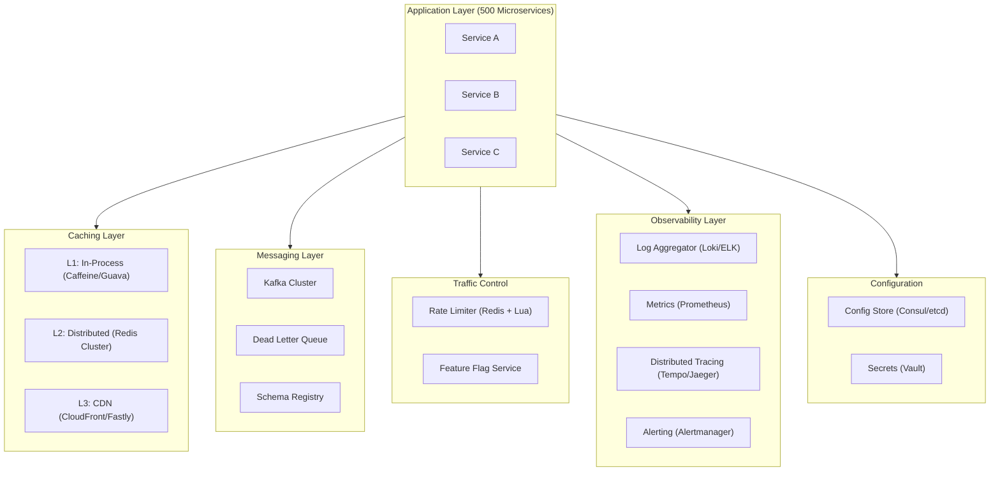
```mermaid
flowchart TB
    subgraph Apps["Application Layer (500 Microservices)"]
        Svc1["Service A"]
        Svc2["Service B"]
        Svc3["Service C"]
    end

    subgraph Caching["Caching Layer"]
        L1["L1: In-Process (Caffeine/Guava)"]
        L2["L2: Distributed (Redis Cluster)"]
        L3["L3: CDN (CloudFront/Fastly)"]
    end

    subgraph Messaging["Messaging Layer"]
        Kafka["Kafka Cluster"]
        DLQ["Dead Letter Queue"]
        SchemaReg["Schema Registry"]
    end

    subgraph TrafficCtrl["Traffic Control"]
        RateLimiter["Rate Limiter (Redis + Lua)"]
        FeatureFlags["Feature Flag Service"]
    end

    subgraph Observability["Observability Layer"]
        Logs["Log Aggregator (Loki/ELK)"]
        Metrics["Metrics (Prometheus)"]
        Traces["Distributed Tracing (Tempo/Jaeger)"]
        Alerts["Alerting (Alertmanager)"]
    end

    subgraph Config["Configuration"]
        ConfigStore["Config Store (Consul/etcd)"]
        Vault["Secrets (Vault)"]
    end

    Apps --> Caching
    Apps --> Messaging
    Apps --> TrafficCtrl
    Apps --> Observability
    Apps --> Config
```

---

## Low-Level Design

### 1. Caching System (Redis / Memcached)

#### Overview

A caching system stores frequently accessed data in fast memory to reduce latency and backend load. At scale, caching is not optional — it is the primary mechanism that makes systems responsive. Redis dominates the distributed caching market due to its rich data structures, Lua scripting, and clustering support.

#### Cache Topologies

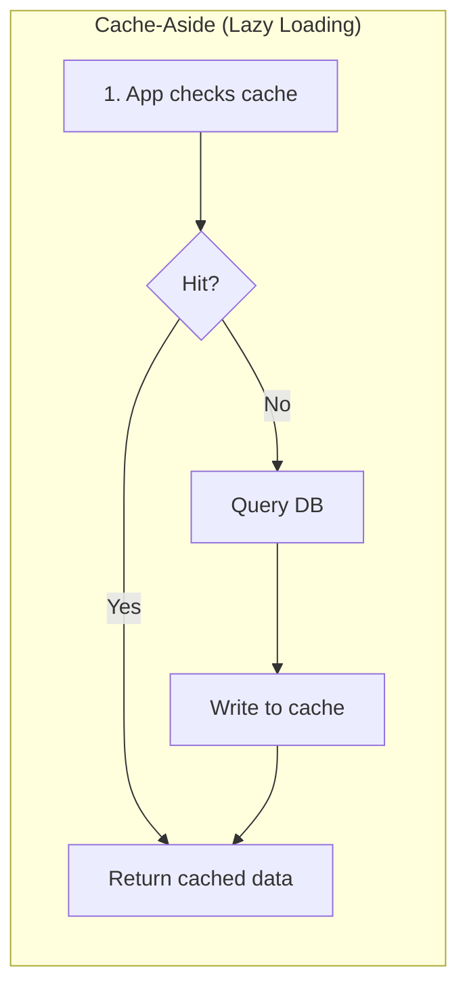
```mermaid
flowchart LR
    subgraph CacheAside["Cache-Aside (Lazy Loading)"]
        CA1["1. App checks cache"] --> CA2{"Hit?"}
        CA2 -->|Yes| CA3["Return cached data"]
        CA2 -->|No| CA4["Query DB"]
        CA4 --> CA5["Write to cache"]
        CA5 --> CA3
    end
```

| Topology | Read Path | Write Path | Consistency | Best For |
|----------|----------|-----------|-------------|----------|
| **Cache-Aside** | App reads cache → miss → DB → write cache | App writes DB → invalidate cache | Eventual (stale reads possible) | General purpose, read-heavy |
| **Read-Through** | Cache reads DB on miss (transparent) | Same as cache-aside | Eventual | Simplifies app code |
| **Write-Through** | Same as cache-aside | App writes cache → cache writes DB | Strong (writes always in cache) | Write-heavy, consistency needed |
| **Write-Behind** | Same as cache-aside | App writes cache → async batch write DB | Eventual (data loss risk) | Write-heavy, latency-sensitive |
| **Write-Around** | Same as cache-aside | App writes DB directly (skip cache) | Eventual | Infrequent read-after-write |

#### Multi-Tier Caching Architecture

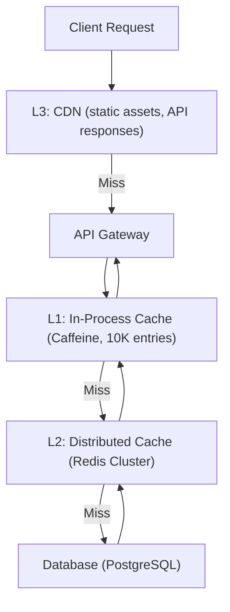
```mermaid
flowchart TD
    Client["Client Request"] --> CDN["L3: CDN (static assets, API responses)"]
    CDN -->|Miss| Gateway["API Gateway"]
    Gateway --> L1["L1: In-Process Cache (Caffeine, 10K entries)"]
    L1 -->|Miss| L2["L2: Distributed Cache (Redis Cluster)"]
    L2 -->|Miss| DB["Database (PostgreSQL)"]
    DB --> L2
    L2 --> L1
    L1 --> Gateway
```

| Tier | Technology | Capacity | Latency | TTL | Use Case |
|------|-----------|----------|---------|-----|----------|
| L1 (In-Process) | Caffeine / Guava | 10K-100K entries | < 100μs | 30-60 sec | Hot keys, session data, config |
| L2 (Distributed) | Redis Cluster | 500 GB+ | < 1ms | 5-60 min | Shared across instances, user profiles |
| L3 (CDN) | CloudFront / Fastly | Unlimited | < 5ms (edge) | 1-24 hours | Static assets, API responses |

#### Eviction Policies

| Policy | Algorithm | When to Use |
|--------|----------|-------------|
| **LRU** | Evict least recently used | General purpose — good default |
| **LFU** | Evict least frequently used | When access frequency matters (hot vs cold) |
| **TTL** | Evict when time-to-live expires | Data with known staleness tolerance |
| **Random** | Evict random key | When all keys equally important |
| **volatile-lru** | LRU among keys with TTL set | Mix of persistent and expiring keys |
| **allkeys-lfu** | LFU across all keys | When some keys are much hotter than others |

#### Cache Stampede Prevention

When a popular cache key expires, hundreds of concurrent requests hit the database simultaneously:

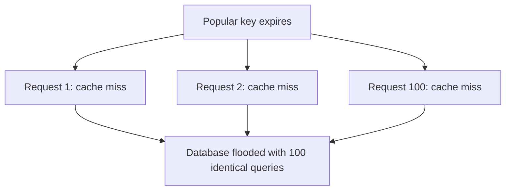
```mermaid
flowchart TD
    Expire["Popular key expires"] --> R1["Request 1: cache miss"]
    Expire --> R2["Request 2: cache miss"]
    Expire --> R3["Request 100: cache miss"]
    R1 --> DB["Database flooded with 100 identical queries"]
    R2 --> DB
    R3 --> DB
```

**Solutions:**

| Strategy | How It Works | Trade-off |
|----------|-------------|-----------|
| **Mutex/Lock** | First requester acquires lock; others wait | Adds lock overhead; risk of deadlock |
| **Probabilistic Early Expiry** | Recompute before TTL expires (beta * Math.random()) | Wastes some compute on early refreshes |
| **Stale-While-Revalidate** | Return stale data immediately; refresh in background | Serves stale data briefly |
| **Request Coalescing** | Deduplicate concurrent requests for same key | Complex implementation |

**Redis mutex implementation (Lua):**
```lua
-- KEYS[1] = cache key, KEYS[2] = lock key
-- ARGV[1] = lock timeout, ARGV[2] = cache TTL
local value = redis.call('GET', KEYS[1])
if value then
    return value  -- cache hit
end
-- Try to acquire lock
local locked = redis.call('SET', KEYS[2], '1', 'NX', 'EX', ARGV[1])
if locked then
    return nil  -- caller should fetch from DB and populate cache
else
    -- Someone else is fetching; wait and retry
    return '__WAIT__'
end
```

#### Hot Key Mitigation

A single key receiving 100K+ reads/sec overwhelms a single Redis node:

| Strategy | How It Works | Complexity |
|----------|-------------|-----------|
| **Local cache (L1)** | Cache hot keys in app memory (Caffeine) | Low |
| **Key replication** | Store key on multiple shards: `user:123:shard1`, `user:123:shard2` | Medium |
| **Read replicas** | Route reads to replicas; primary handles writes | Low |
| **Proxy layer** | mcrouter/twemproxy aggregate reads | Medium |

#### Redis Data Structures — When to Use What

| Structure | Use Case | Example | Complexity |
|-----------|---------|---------|-----------|
| **String** | Simple key-value, counters, caching | Session tokens, page cache | O(1) |
| **Hash** | Object storage (partial read/write) | User profile fields | O(1) per field |
| **List** | Ordered collections, queues | Activity feed, task queue | O(1) push/pop |
| **Set** | Unique collections, membership check | Online users, tags | O(1) add/check |
| **Sorted Set** | Ranked data, leaderboards, rate limiting | Leaderboard, sliding window | O(log N) |
| **Stream** | Event log, message queue | Audit log, event sourcing | O(1) append |
| **HyperLogLog** | Cardinality estimation | Unique visitors count | O(1), 12 KB |
| **Bloom Filter** | Membership test (probabilistic) | "Does this username exist?" | O(k) |

#### Redis vs Memcached vs KeyDB vs DragonflyDB

| Feature | Redis | Memcached | KeyDB | DragonflyDB |
|---------|-------|-----------|-------|-------------|
| Data structures | Rich (15+) | String only | Same as Redis | Same as Redis |
| Persistence | RDB + AOF | None | RDB + AOF | Snapshots |
| Clustering | Redis Cluster | Client-side | Redis-compatible | Built-in |
| Multi-threaded | Single-thread (IO threads in 6.0+) | Multi-threaded | Multi-threaded | Multi-threaded |
| Max throughput | ~300K ops/sec | ~1M ops/sec | ~1M ops/sec | ~4M ops/sec |
| Memory efficiency | Good | Better (no overhead) | Good | Best (shared-nothing) |
| Lua scripting | Yes | No | Yes | Yes |
| Pub/Sub | Yes | No | Yes | Yes |
| Best for | General purpose | Simple caching | Drop-in Redis replacement | High throughput |

---

### 2. Message Queue System (Kafka / RabbitMQ)

#### Overview

Message queues enable asynchronous communication between services. They decouple producers from consumers, absorb traffic spikes, and enable event-driven architectures. Kafka has become the industry standard for high-throughput event streaming, while RabbitMQ excels at traditional task queues.

#### Kafka Architecture

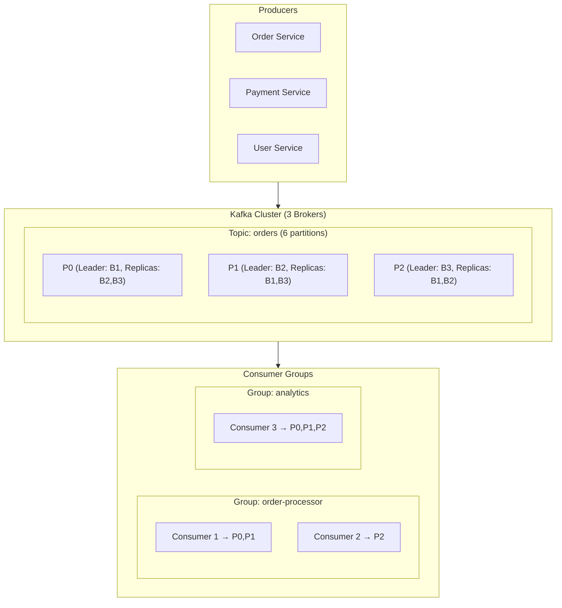
```mermaid
flowchart TD
    subgraph Producers["Producers"]
        P1["Order Service"]
        P2["Payment Service"]
        P3["User Service"]
    end

    subgraph Kafka["Kafka Cluster (3 Brokers)"]
        subgraph Topic1["Topic: orders (6 partitions)"]
            Part0["P0 (Leader: B1, Replicas: B2,B3)"]
            Part1["P1 (Leader: B2, Replicas: B1,B3)"]
            Part2["P2 (Leader: B3, Replicas: B1,B2)"]
        end
    end

    subgraph Consumers["Consumer Groups"]
        subgraph CG1["Group: order-processor"]
            C1["Consumer 1 → P0,P1"]
            C2["Consumer 2 → P2"]
        end
        subgraph CG2["Group: analytics"]
            C3["Consumer 3 → P0,P1,P2"]
        end
    end

    Producers --> Kafka
    Kafka --> Consumers
```

#### Kafka vs RabbitMQ vs Pulsar vs NATS vs SQS

| Feature | Kafka | RabbitMQ | Pulsar | NATS JetStream | SQS |
|---------|-------|----------|--------|---------------|-----|
| **Model** | Log-based streaming | Message broker | Log-based streaming | Log-based streaming | Managed queue |
| **Throughput** | 1M+ msg/sec | 50K msg/sec | 1M+ msg/sec | 500K msg/sec | 3K msg/sec (std) |
| **Ordering** | Per-partition | Per-queue | Per-partition | Per-stream | FIFO mode only |
| **Replay** | Yes (offset-based) | No (ack removes) | Yes (cursor-based) | Yes | No |
| **Delivery** | At-least-once, exactly-once | At-most-once, at-least-once | At-least-once, exactly-once | At-least-once | At-least-once |
| **Storage** | Disk (segments) | Memory + disk | BookKeeper (tiered) | File-based | Managed |
| **Consumer groups** | Yes | Competing consumers | Yes | Yes | No (visibility timeout) |
| **Schema registry** | Confluent Schema Registry | No built-in | Built-in | No | No |
| **Multi-tenancy** | Topic-level | Vhost-level | Native (tenants) | Account-level | Queue-level |
| **Ops complexity** | High | Medium | High | Low | None (managed) |
| **Best for** | Event streaming, logs, CDC | Task queues, RPC | Multi-tenant streaming | Lightweight pub/sub | Simple queues |

#### Kafka Exactly-Once Semantics

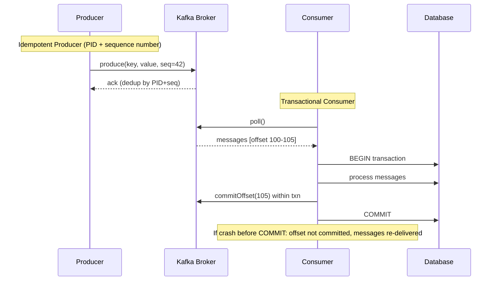
```mermaid
sequenceDiagram
    participant P as Producer
    participant K as Kafka Broker
    participant C as Consumer
    participant DB as Database

    Note over P: Idempotent Producer (PID + sequence number)
    P->>K: produce(key, value, seq=42)
    K-->>P: ack (dedup by PID+seq)

    Note over C: Transactional Consumer
    C->>K: poll()
    K-->>C: messages [offset 100-105]
    C->>DB: BEGIN transaction
    C->>DB: process messages
    C->>K: commitOffset(105) within txn
    C->>DB: COMMIT
    Note over C: If crash before COMMIT: offset not committed, messages re-delivered
```

#### Dead Letter Queue Pattern

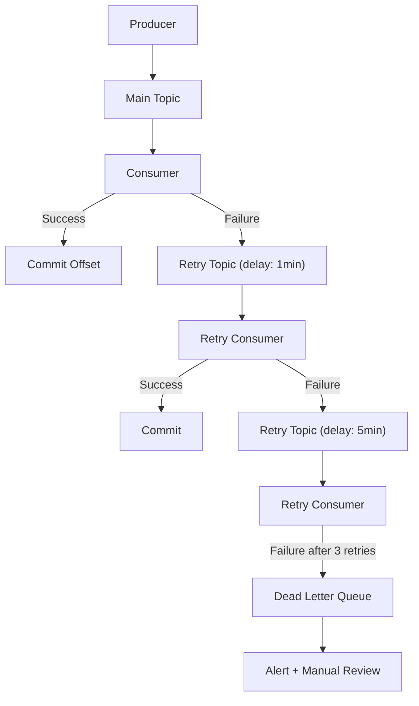
```mermaid
flowchart TD
    Producer["Producer"] --> MainTopic["Main Topic"]
    MainTopic --> Consumer["Consumer"]
    Consumer -->|Success| Commit["Commit Offset"]
    Consumer -->|Failure| Retry1["Retry Topic (delay: 1min)"]
    Retry1 --> Consumer2["Retry Consumer"]
    Consumer2 -->|Success| Commit2["Commit"]
    Consumer2 -->|Failure| Retry2["Retry Topic (delay: 5min)"]
    Retry2 --> Consumer3["Retry Consumer"]
    Consumer3 -->|Failure after 3 retries| DLQ["Dead Letter Queue"]
    DLQ --> Alert["Alert + Manual Review"]
```

#### Kafka Topic Design Patterns

| Pattern | Topic Naming | Use Case |
|---------|-------------|----------|
| **Event sourcing** | `domain.entity.event` (e.g., `order.created`) | Audit trail, replay |
| **CDC** | `db.schema.table` (e.g., `postgres.public.users`) | Database change capture |
| **Command** | `service.command` (e.g., `payment.charge`) | Request-response over Kafka |
| **Retry** | `topic.retry.1`, `topic.retry.2`, `topic.dlq` | Graduated retry |
| **Compacted** | `entity.state` (e.g., `user.profile`) | Latest state per key |

#### Partition Strategy

| Strategy | When to Use | Trade-off |
|----------|------------|-----------|
| **Key-based (hash)** | Ordering per entity (order_id, user_id) | Hot partitions if key skewed |
| **Round-robin** | Maximum parallelism, no ordering needed | No ordering guarantee |
| **Custom partitioner** | Route by geography, priority, or tenant | Complex to maintain |
| **Random with sticky** | Balance across partitions in batches | Slight ordering trade-off |

---

### 3. Rate Limiting System

#### Overview

Rate limiting controls how many requests a client can make in a given time window. It protects backend services from overload, prevents abuse, ensures fair usage across tenants, and is a critical component of API gateways.

#### Algorithm Comparison

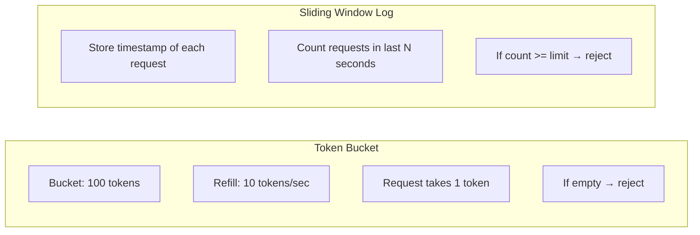
```mermaid
flowchart LR
    subgraph TokenBucket["Token Bucket"]
        TB1["Bucket: 100 tokens"]
        TB2["Refill: 10 tokens/sec"]
        TB3["Request takes 1 token"]
        TB4["If empty → reject"]
    end
    subgraph SlidingWindow["Sliding Window Log"]
        SW1["Store timestamp of each request"]
        SW2["Count requests in last N seconds"]
        SW3["If count >= limit → reject"]
    end
```

| Algorithm | Accuracy | Memory | Burst Handling | Distributed |
|-----------|---------|--------|---------------|------------|
| **Fixed Window** | Low (boundary burst) | O(1) | Allows 2x at boundary | Easy |
| **Sliding Window Log** | Exact | O(N) per user | Smooth | Hard (log size) |
| **Sliding Window Counter** | Approximate | O(1) | Smooth | Easy |
| **Token Bucket** | Exact | O(1) | Allows controlled burst | Medium |
| **Leaky Bucket** | Exact | O(1) | Smooths to fixed rate | Medium |

#### Redis Sliding Window Counter (Lua)

```lua
-- KEYS[1] = rate limit key
-- ARGV[1] = window size in seconds
-- ARGV[2] = max requests per window
-- ARGV[3] = current timestamp

local key = KEYS[1]
local window = tonumber(ARGV[1])
local limit = tonumber(ARGV[2])
local now = tonumber(ARGV[3])

-- Remove expired entries
redis.call('ZREMRANGEBYSCORE', key, 0, now - window)

-- Count current requests
local count = redis.call('ZCARD', key)

if count < limit then
    -- Allow and record
    redis.call('ZADD', key, now, now .. ':' .. math.random())
    redis.call('EXPIRE', key, window)
    return {1, limit - count - 1, now + window}  -- allowed, remaining, reset
else
    return {0, 0, now + window}  -- rejected, 0 remaining, reset
end
```

#### Multi-Layer Rate Limiting

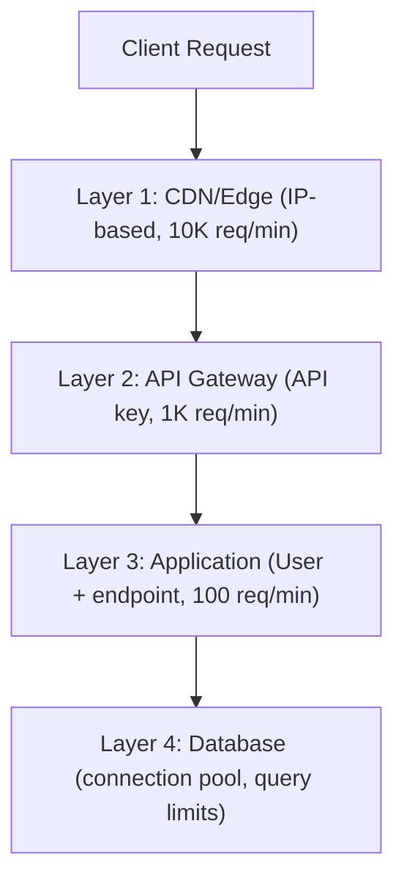
```mermaid
flowchart TD
    Client["Client Request"] --> CDN["Layer 1: CDN/Edge (IP-based, 10K req/min)"]
    CDN --> Gateway["Layer 2: API Gateway (API key, 1K req/min)"]
    Gateway --> App["Layer 3: Application (User + endpoint, 100 req/min)"]
    App --> DB["Layer 4: Database (connection pool, query limits)"]
```

| Layer | Scope | Technology | Purpose |
|-------|-------|-----------|---------|
| CDN/Edge | IP address | Cloudflare, AWS WAF | DDoS, bot protection |
| API Gateway | API key | Kong, Envoy | Tenant-level limits |
| Application | User + endpoint | Redis + Lua | Fine-grained control |
| Database | Connection | PgBouncer | Protect DB from overload |

---

### 4. Feature Flag System

#### Overview

Feature flags decouple deployment from release. Code is deployed but dormant until the flag is enabled. This enables safe continuous deployment, gradual rollouts, A/B testing, and instant kill switches.

#### Flag Evaluation Flow

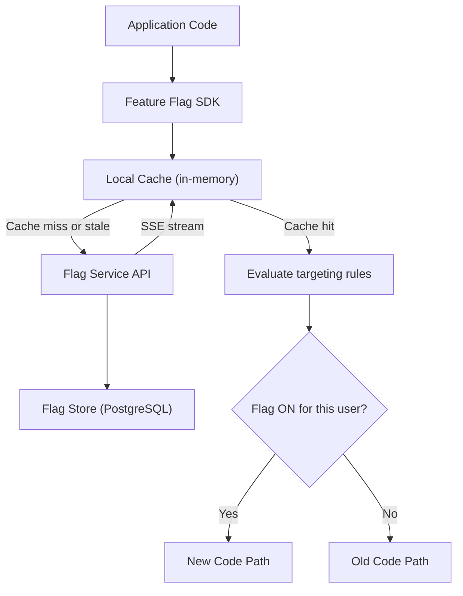
```mermaid
flowchart TD
    Code["Application Code"] --> SDK["Feature Flag SDK"]
    SDK --> LocalCache["Local Cache (in-memory)"]
    LocalCache -->|Cache hit| Evaluate["Evaluate targeting rules"]
    LocalCache -->|Cache miss or stale| FlagService["Flag Service API"]
    FlagService --> DB["Flag Store (PostgreSQL)"]
    FlagService -->|SSE stream| LocalCache
    Evaluate --> Decision{"Flag ON for this user?"}
    Decision -->|Yes| NewCode["New Code Path"]
    Decision -->|No| OldCode["Old Code Path"]
```

#### Flag Types and Rollout Strategies

| Flag Type | Example | Use Case |
|-----------|---------|----------|
| **Boolean** | `enable_new_checkout: true/false` | Simple on/off |
| **Multivariate** | `checkout_button_color: "blue"/"green"/"red"` | A/B/C testing |
| **Percentage** | `new_search: 25%` | Gradual rollout |
| **User segment** | `beta_users: [user_id IN beta_list]` | Beta program |
| **Scheduled** | `holiday_sale: ON from Dec 20 to Dec 26` | Time-based activation |

#### Gradual Rollout Strategy

```
Day 1:  1% (internal employees only)
Day 3:  5% (beta users)
Day 5:  10% (random sample)
Day 7:  25% (if metrics OK)
Day 10: 50% (monitor closely)
Day 14: 100% (full rollout)
Day 21: Remove flag (clean up tech debt)
```

#### LaunchDarkly vs Unleash vs Flagsmith vs Split vs Custom

| Feature | LaunchDarkly | Unleash | Flagsmith | Split | Custom |
|---------|-------------|---------|-----------|-------|--------|
| **Hosting** | SaaS | Self-hosted/SaaS | Self-hosted/SaaS | SaaS | Self-hosted |
| **SDK languages** | 25+ | 15+ | 15+ | 10+ | Custom |
| **Real-time updates** | SSE | Polling/SSE | SSE | SSE | Custom |
| **A/B testing** | Built-in (Experimentation) | No | No | Built-in | Custom |
| **Targeting** | Advanced (segments, rules) | Basic (strategies) | Medium | Advanced | Custom |
| **Audit log** | Yes | Yes | Yes | Yes | Must build |
| **Cost** | $$$$ | Free (OSS) / $$ | $ / Free (OSS) | $$$ | Dev time |
| **Best for** | Enterprise | Budget-conscious | Flexibility | Data-driven teams | Full control |

---

### 5. Logging & Monitoring System

#### Overview

Observability is the ability to understand a system's internal state from its external outputs. The three pillars — logs, metrics, and traces — provide complementary views of system behavior.

#### Three Pillars of Observability

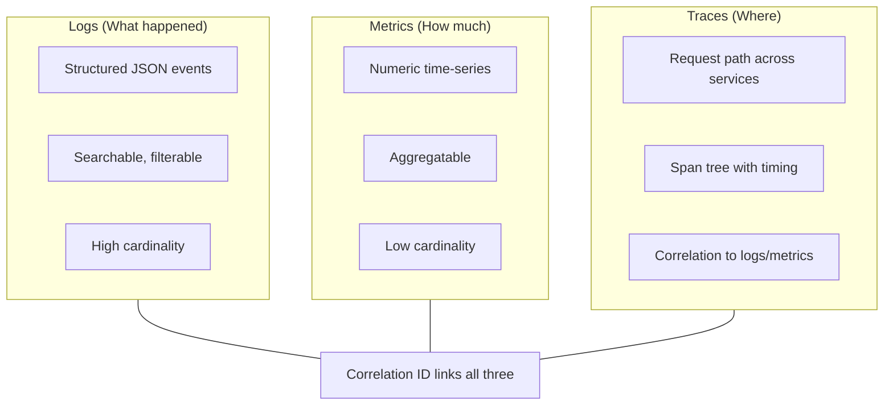
```mermaid
flowchart TD
    subgraph Logs["Logs (What happened)"]
        L1["Structured JSON events"]
        L2["Searchable, filterable"]
        L3["High cardinality"]
    end
    subgraph Metrics["Metrics (How much)"]
        M1["Numeric time-series"]
        M2["Aggregatable"]
        M3["Low cardinality"]
    end
    subgraph Traces["Traces (Where)"]
        T1["Request path across services"]
        T2["Span tree with timing"]
        T3["Correlation to logs/metrics"]
    end

    Logs --- Correlation["Correlation ID links all three"]
    Metrics --- Correlation
    Traces --- Correlation
```

#### Log Aggregation Pipeline

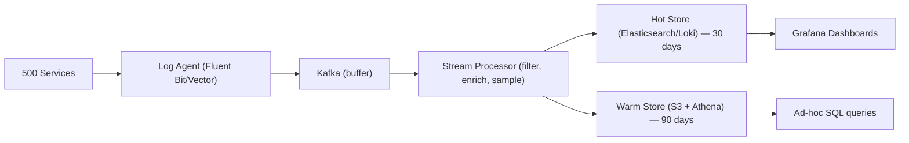
```mermaid
flowchart LR
    Apps["500 Services"] --> Agent["Log Agent (Fluent Bit/Vector)"]
    Agent --> Buffer["Kafka (buffer)"]
    Buffer --> Processor["Stream Processor (filter, enrich, sample)"]
    Processor --> Hot["Hot Store (Elasticsearch/Loki) — 30 days"]
    Processor --> Warm["Warm Store (S3 + Athena) — 90 days"]
    Hot --> Grafana["Grafana Dashboards"]
    Warm --> AdHoc["Ad-hoc SQL queries"]
```

#### Structured Log Format

```json
{
  "timestamp": "2025-03-15T10:23:45.123Z",
  "level": "ERROR",
  "service": "order-service",
  "instance": "order-svc-7b8f9-abc12",
  "trace_id": "4bf92f3577b34da6a3ce929d0e0e4736",
  "span_id": "00f067aa0ba902b7",
  "user_id": "usr_abc123",
  "method": "POST",
  "path": "/api/v1/orders",
  "status_code": 500,
  "duration_ms": 342,
  "error": "inventory_service_timeout",
  "message": "Failed to reserve inventory for order ord_xyz789"
}
```

#### Monitoring Frameworks

| Framework | Focus | Metrics |
|-----------|-------|---------|
| **RED Method** | Request-driven services | Rate, Errors, Duration |
| **USE Method** | Infrastructure resources | Utilization, Saturation, Errors |
| **Golden Signals** | Google SRE | Latency, Traffic, Errors, Saturation |

#### ELK vs Loki vs Datadog vs Splunk

| Feature | ELK Stack | Grafana Loki | Datadog | Splunk |
|---------|-----------|-------------|---------|--------|
| **Architecture** | Full-text indexed | Label-indexed, log chunks | SaaS, indexed | Indexed |
| **Query language** | KQL/Lucene | LogQL | Custom | SPL |
| **Storage cost** | High (full index) | Low (no full index) | $$$/GB | $$$$/GB |
| **Search speed** | Fast (pre-indexed) | Slower (grep-like) | Fast | Fast |
| **Metrics integration** | Separate (Prometheus) | Native (Grafana) | Built-in | Built-in |
| **Traces** | Separate (Jaeger) | Native (Tempo) | Built-in | Separate |
| **Ops complexity** | High (ES cluster mgmt) | Low | None (SaaS) | Medium |
| **Best for** | Large self-hosted | Cost-effective, Grafana users | All-in-one SaaS | Enterprise compliance |

---

### 6. Alerting System

#### Overview

Alerting converts observability data into actionable notifications. Good alerting catches real problems without overwhelming engineers with noise. SLO-based alerting (burn rate) is the modern best practice.

#### Alert Flow

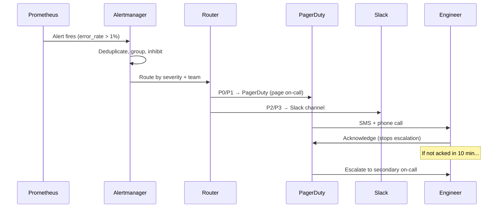
```mermaid
sequenceDiagram
    participant P as Prometheus
    participant AM as Alertmanager
    participant R as Router
    participant PD as PagerDuty
    participant S as Slack
    participant E as Engineer

    P->>AM: Alert fires (error_rate > 1%)
    AM->>AM: Deduplicate, group, inhibit
    AM->>R: Route by severity + team
    R->>PD: P0/P1 → PagerDuty (page on-call)
    R->>S: P2/P3 → Slack channel
    PD->>E: SMS + phone call
    E->>PD: Acknowledge (stops escalation)
    Note over E: If not acked in 10 min...
    PD->>E: Escalate to secondary on-call
```

#### SLO-Based Alerting (Burn Rate)

Traditional threshold alerting (e.g., "alert if error rate > 1%") is noisy. SLO-based alerting asks: "Are we consuming our error budget too fast?"

```
SLO: 99.9% availability = 0.1% error budget per month = 43.2 minutes of downtime

Burn rate = actual_error_rate / allowed_error_rate

If burn rate > 14.4x → consuming 100% of budget in 1 hour → P0 (page immediately)
If burn rate > 6x → consuming 100% in 4 hours → P1 (page within 5 min)
If burn rate > 1x → consuming 100% in 30 days → P2 (Slack, next business day)
```

**Multi-window burn rate alert (Prometheus rule):**
```yaml
groups:
  - name: slo-alerts
    rules:
      - alert: ErrorBudgetBurnHigh
        expr: |
          (
            sum(rate(http_requests_total{status=~"5.."}[1h]))
            / sum(rate(http_requests_total[1h]))
          ) > (14.4 * 0.001)
          AND
          (
            sum(rate(http_requests_total{status=~"5.."}[5m]))
            / sum(rate(http_requests_total[5m]))
          ) > (14.4 * 0.001)
        labels:
          severity: critical
        annotations:
          summary: "High error budget burn rate"
          runbook: "https://wiki.internal/runbooks/high-error-rate"
```

---

### 7. Config Management System

#### Overview

Configuration management enables dynamic tuning of system behavior without code deployments. Centralized config stores (Consul, etcd, ZooKeeper) provide consistent, versioned, and watchable configuration that services can hot-reload.

#### Config Architecture

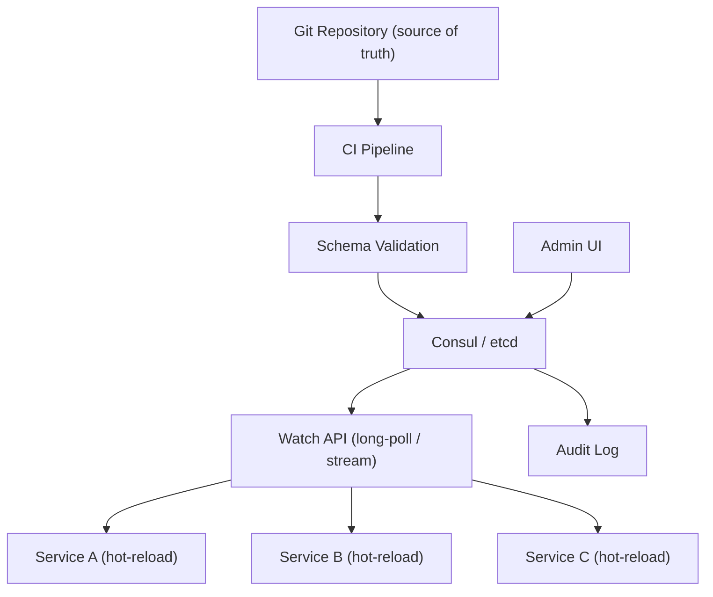
```mermaid
flowchart TD
    GitRepo["Git Repository (source of truth)"] --> CI["CI Pipeline"]
    CI --> Validate["Schema Validation"]
    Validate --> ConfigStore["Consul / etcd"]
    ConfigStore --> Watch["Watch API (long-poll / stream)"]
    Watch --> Svc1["Service A (hot-reload)"]
    Watch --> Svc2["Service B (hot-reload)"]
    Watch --> Svc3["Service C (hot-reload)"]

    Admin["Admin UI"] --> ConfigStore
    ConfigStore --> Audit["Audit Log"]
```

#### Config Hierarchy (Override Chain)

```
Priority (highest to lowest):
1. Instance override    (service-a/instance-3/timeout = 5000)
2. Service override     (service-a/timeout = 3000)
3. Environment default  (production/timeout = 2000)
4. Global default       (default/timeout = 1000)

Resolution: service-a instance-3 in production → timeout = 5000
```

#### Consul vs etcd vs ZooKeeper

| Feature | Consul | etcd | ZooKeeper |
|---------|--------|------|-----------|
| **Consensus** | Raft | Raft | ZAB (Paxos-like) |
| **API** | HTTP + DNS | gRPC + HTTP | Custom protocol |
| **Watch support** | Blocking queries | Watch API (efficient) | Watcher (one-shot, re-register) |
| **Service discovery** | Built-in | External (+ CoreDNS) | Manual |
| **Health checks** | Built-in | External | Session-based |
| **Multi-DC** | Native (WAN gossip) | Single cluster (mirror) | Single cluster |
| **ACL** | Token-based | RBAC | ACL (znode-level) |
| **Max entries** | Millions | ~1M (MVCC overhead) | ~1M (memory-bound) |
| **Best for** | Service mesh + config | Kubernetes, simple KV | Legacy, Kafka/Hadoop |

---

## Detailed Data Models

### Caching Metadata

```sql
CREATE TABLE cache_policies (
    policy_id       UUID PRIMARY KEY DEFAULT gen_random_uuid(),
    cache_name      VARCHAR(100) NOT NULL UNIQUE,
    max_memory_mb   INTEGER NOT NULL DEFAULT 1024,
    eviction_policy VARCHAR(20) NOT NULL DEFAULT 'allkeys-lru'
        CHECK (eviction_policy IN ('noeviction','allkeys-lru','allkeys-lfu','volatile-lru','volatile-lfu','volatile-ttl','volatile-random','allkeys-random')),
    default_ttl_sec INTEGER NOT NULL DEFAULT 3600,
    max_key_size    INTEGER NOT NULL DEFAULT 512,
    max_value_size  INTEGER NOT NULL DEFAULT 1048576,
    enable_stats    BOOLEAN NOT NULL DEFAULT true,
    created_at      TIMESTAMPTZ NOT NULL DEFAULT now(),
    updated_at      TIMESTAMPTZ NOT NULL DEFAULT now()
);

CREATE TABLE cache_invalidation_rules (
    rule_id         UUID PRIMARY KEY DEFAULT gen_random_uuid(),
    cache_name      VARCHAR(100) NOT NULL REFERENCES cache_policies(cache_name),
    pattern         VARCHAR(500) NOT NULL,
    trigger_event   VARCHAR(200) NOT NULL,
    invalidation    VARCHAR(20) NOT NULL DEFAULT 'delete'
        CHECK (invalidation IN ('delete', 'refresh', 'tag_purge')),
    priority        INTEGER NOT NULL DEFAULT 100,
    enabled         BOOLEAN NOT NULL DEFAULT true,
    created_at      TIMESTAMPTZ NOT NULL DEFAULT now()
);
CREATE INDEX idx_cache_inv_event ON cache_invalidation_rules(trigger_event);
```

### Message Queue Schema

```sql
CREATE TABLE kafka_topics (
    topic_id        UUID PRIMARY KEY DEFAULT gen_random_uuid(),
    topic_name      VARCHAR(200) NOT NULL UNIQUE,
    partitions      INTEGER NOT NULL DEFAULT 6,
    replication     INTEGER NOT NULL DEFAULT 3,
    retention_ms    BIGINT NOT NULL DEFAULT 604800000,  -- 7 days
    cleanup_policy  VARCHAR(20) NOT NULL DEFAULT 'delete'
        CHECK (cleanup_policy IN ('delete', 'compact', 'delete,compact')),
    schema_id       INTEGER REFERENCES schema_registry(schema_id),
    owner_team      VARCHAR(100) NOT NULL,
    description     TEXT,
    created_at      TIMESTAMPTZ NOT NULL DEFAULT now()
);

CREATE TABLE dead_letter_entries (
    dlq_id          UUID PRIMARY KEY DEFAULT gen_random_uuid(),
    source_topic    VARCHAR(200) NOT NULL,
    source_partition INTEGER NOT NULL,
    source_offset   BIGINT NOT NULL,
    key             BYTEA,
    value           BYTEA NOT NULL,
    headers         JSONB,
    error_message   TEXT NOT NULL,
    retry_count     INTEGER NOT NULL DEFAULT 0,
    max_retries     INTEGER NOT NULL DEFAULT 3,
    status          VARCHAR(20) NOT NULL DEFAULT 'pending'
        CHECK (status IN ('pending', 'retrying', 'resolved', 'abandoned')),
    created_at      TIMESTAMPTZ NOT NULL DEFAULT now(),
    resolved_at     TIMESTAMPTZ
);
CREATE INDEX idx_dlq_status ON dead_letter_entries(status, created_at);
CREATE INDEX idx_dlq_source ON dead_letter_entries(source_topic, source_partition);
```

### Rate Limit Schema

```sql
CREATE TABLE rate_limit_policies (
    policy_id       UUID PRIMARY KEY DEFAULT gen_random_uuid(),
    name            VARCHAR(100) NOT NULL UNIQUE,
    scope           VARCHAR(20) NOT NULL CHECK (scope IN ('global', 'per_user', 'per_ip', 'per_api_key', 'per_endpoint')),
    algorithm       VARCHAR(30) NOT NULL DEFAULT 'sliding_window'
        CHECK (algorithm IN ('fixed_window', 'sliding_window', 'token_bucket', 'leaky_bucket')),
    limit_count     INTEGER NOT NULL,
    window_seconds  INTEGER NOT NULL,
    burst_allowance INTEGER NOT NULL DEFAULT 0,
    tier            VARCHAR(20) NOT NULL DEFAULT 'standard'
        CHECK (tier IN ('free', 'basic', 'standard', 'premium', 'enterprise', 'internal')),
    enabled         BOOLEAN NOT NULL DEFAULT true,
    created_at      TIMESTAMPTZ NOT NULL DEFAULT now(),
    updated_at      TIMESTAMPTZ NOT NULL DEFAULT now()
);

CREATE TABLE rate_limit_overrides (
    override_id     UUID PRIMARY KEY DEFAULT gen_random_uuid(),
    policy_id       UUID NOT NULL REFERENCES rate_limit_policies(policy_id),
    client_id       VARCHAR(200) NOT NULL,
    custom_limit    INTEGER NOT NULL,
    custom_window   INTEGER,
    reason          TEXT NOT NULL,
    expires_at      TIMESTAMPTZ,
    created_by      VARCHAR(100) NOT NULL,
    created_at      TIMESTAMPTZ NOT NULL DEFAULT now()
);
CREATE INDEX idx_rl_override_client ON rate_limit_overrides(client_id, policy_id);
```

### Feature Flag Schema

```sql
CREATE TABLE feature_flags (
    flag_id         UUID PRIMARY KEY DEFAULT gen_random_uuid(),
    flag_key        VARCHAR(200) NOT NULL UNIQUE,
    flag_type       VARCHAR(20) NOT NULL DEFAULT 'boolean'
        CHECK (flag_type IN ('boolean', 'string', 'number', 'json')),
    description     TEXT,
    default_value   JSONB NOT NULL DEFAULT 'false',
    enabled         BOOLEAN NOT NULL DEFAULT false,
    environment     VARCHAR(20) NOT NULL DEFAULT 'production'
        CHECK (environment IN ('development', 'staging', 'production')),
    owner_team      VARCHAR(100) NOT NULL,
    created_at      TIMESTAMPTZ NOT NULL DEFAULT now(),
    updated_at      TIMESTAMPTZ NOT NULL DEFAULT now(),
    archived_at     TIMESTAMPTZ
);
CREATE INDEX idx_ff_env ON feature_flags(environment, enabled);

CREATE TABLE flag_targeting_rules (
    rule_id         UUID PRIMARY KEY DEFAULT gen_random_uuid(),
    flag_id         UUID NOT NULL REFERENCES feature_flags(flag_id),
    priority        INTEGER NOT NULL DEFAULT 100,
    conditions      JSONB NOT NULL,
    -- e.g., [{"attribute": "country", "operator": "in", "values": ["US","CA"]}]
    serve_value     JSONB NOT NULL,
    percentage      DECIMAL(5,2),  -- null = 100%, 25.00 = 25%
    enabled         BOOLEAN NOT NULL DEFAULT true,
    created_at      TIMESTAMPTZ NOT NULL DEFAULT now()
);
CREATE INDEX idx_ftr_flag ON flag_targeting_rules(flag_id, priority);

CREATE TABLE flag_audit_log (
    audit_id        UUID PRIMARY KEY DEFAULT gen_random_uuid(),
    flag_id         UUID NOT NULL REFERENCES feature_flags(flag_id),
    action          VARCHAR(20) NOT NULL
        CHECK (action IN ('created', 'enabled', 'disabled', 'updated', 'archived', 'rule_added', 'rule_removed')),
    previous_value  JSONB,
    new_value       JSONB,
    changed_by      VARCHAR(100) NOT NULL,
    change_reason   TEXT,
    created_at      TIMESTAMPTZ NOT NULL DEFAULT now()
);
CREATE INDEX idx_ffa_flag ON flag_audit_log(flag_id, created_at DESC);
```

### Alerting Schema

```sql
CREATE TABLE alert_rules (
    rule_id         UUID PRIMARY KEY DEFAULT gen_random_uuid(),
    name            VARCHAR(200) NOT NULL,
    severity        VARCHAR(10) NOT NULL CHECK (severity IN ('critical', 'high', 'medium', 'low')),
    expression      TEXT NOT NULL,  -- PromQL expression
    for_duration    INTERVAL NOT NULL DEFAULT '5 minutes',
    team            VARCHAR(100) NOT NULL,
    runbook_url     TEXT,
    labels          JSONB NOT NULL DEFAULT '{}',
    annotations     JSONB NOT NULL DEFAULT '{}',
    enabled         BOOLEAN NOT NULL DEFAULT true,
    created_at      TIMESTAMPTZ NOT NULL DEFAULT now(),
    updated_at      TIMESTAMPTZ NOT NULL DEFAULT now()
);

CREATE TABLE alert_incidents (
    incident_id     UUID PRIMARY KEY DEFAULT gen_random_uuid(),
    rule_id         UUID NOT NULL REFERENCES alert_rules(rule_id),
    status          VARCHAR(20) NOT NULL DEFAULT 'firing'
        CHECK (status IN ('firing', 'acknowledged', 'resolved', 'silenced')),
    started_at      TIMESTAMPTZ NOT NULL DEFAULT now(),
    acknowledged_at TIMESTAMPTZ,
    acknowledged_by VARCHAR(100),
    resolved_at     TIMESTAMPTZ,
    severity        VARCHAR(10) NOT NULL,
    summary         TEXT NOT NULL,
    details         JSONB,
    escalation_level INTEGER NOT NULL DEFAULT 0
);
CREATE INDEX idx_ai_status ON alert_incidents(status, started_at DESC);

CREATE TABLE on_call_schedules (
    schedule_id     UUID PRIMARY KEY DEFAULT gen_random_uuid(),
    team            VARCHAR(100) NOT NULL,
    rotation_type   VARCHAR(20) NOT NULL CHECK (rotation_type IN ('daily', 'weekly', 'custom')),
    members         JSONB NOT NULL,  -- [{user_id, start, end}]
    escalation_policy JSONB NOT NULL,
    -- [{level: 1, timeout_min: 10, notify: ["primary"]}, {level: 2, timeout_min: 15, notify: ["secondary", "manager"]}]
    timezone        VARCHAR(50) NOT NULL DEFAULT 'UTC',
    created_at      TIMESTAMPTZ NOT NULL DEFAULT now()
);
```

### Config Store Schema

```sql
CREATE TABLE config_entries (
    config_id       UUID PRIMARY KEY DEFAULT gen_random_uuid(),
    namespace       VARCHAR(200) NOT NULL,
    key             VARCHAR(500) NOT NULL,
    value           JSONB NOT NULL,
    value_type      VARCHAR(20) NOT NULL DEFAULT 'string'
        CHECK (value_type IN ('string', 'number', 'boolean', 'json', 'encrypted')),
    version         INTEGER NOT NULL DEFAULT 1,
    environment     VARCHAR(20) NOT NULL DEFAULT 'production',
    description     TEXT,
    schema_def      JSONB,  -- JSON Schema for validation
    encrypted       BOOLEAN NOT NULL DEFAULT false,
    created_at      TIMESTAMPTZ NOT NULL DEFAULT now(),
    updated_at      TIMESTAMPTZ NOT NULL DEFAULT now(),
    UNIQUE(namespace, key, environment)
);
CREATE INDEX idx_config_ns ON config_entries(namespace, environment);

CREATE TABLE config_change_log (
    change_id       UUID PRIMARY KEY DEFAULT gen_random_uuid(),
    config_id       UUID NOT NULL REFERENCES config_entries(config_id),
    old_version     INTEGER NOT NULL,
    new_version     INTEGER NOT NULL,
    old_value       JSONB,
    new_value       JSONB NOT NULL,
    changed_by      VARCHAR(100) NOT NULL,
    change_source   VARCHAR(20) NOT NULL DEFAULT 'api'
        CHECK (change_source IN ('api', 'gitops', 'admin_ui', 'migration')),
    change_reason   TEXT,
    rollback_of     UUID REFERENCES config_change_log(change_id),
    created_at      TIMESTAMPTZ NOT NULL DEFAULT now()
);
CREATE INDEX idx_ccl_config ON config_change_log(config_id, created_at DESC);
```

---

## Detailed API Specifications

### Cache API

```
POST /api/v1/cache/{namespace}/get
Authorization: Bearer {service_token}
Rate Limit: 100,000 req/min

Request:
{
  "keys": ["user:profile:123", "user:profile:456"],
  "options": { "return_ttl": true }
}

Response (200 OK):
{
  "results": {
    "user:profile:123": {
      "value": {"name": "Alice", "email": "alice@example.com"},
      "ttl_remaining": 1800,
      "hit": true
    },
    "user:profile:456": {
      "value": null,
      "hit": false
    }
  },
  "stats": { "hits": 1, "misses": 1, "latency_us": 340 }
}
```

### Kafka Management API

```
POST /api/v1/topics
Authorization: Bearer {admin_token}

Request:
{
  "topic_name": "order-events",
  "partitions": 12,
  "replication_factor": 3,
  "retention_ms": 604800000,
  "cleanup_policy": "delete",
  "schema": {
    "type": "avro",
    "schema_id": 42
  },
  "owner_team": "order-platform"
}

Response (201 Created):
{
  "topic_name": "order-events",
  "partitions": 12,
  "replication_factor": 3,
  "status": "created",
  "schema_id": 42
}
```

### Rate Limit Check API

```
POST /api/v1/ratelimit/check
Authorization: Internal service auth
Latency budget: < 2ms

Request:
{
  "client_id": "api_key_abc123",
  "endpoint": "/api/v1/orders",
  "method": "POST",
  "ip": "203.0.113.42"
}

Response (200 OK — Allowed):
{
  "allowed": true,
  "limit": 1000,
  "remaining": 847,
  "reset_at": "2025-03-15T10:25:00Z",
  "retry_after": null
}

Response (429 Too Many Requests):
{
  "allowed": false,
  "limit": 1000,
  "remaining": 0,
  "reset_at": "2025-03-15T10:25:00Z",
  "retry_after": 42
}
Headers:
  X-RateLimit-Limit: 1000
  X-RateLimit-Remaining: 0
  X-RateLimit-Reset: 1710496500
  Retry-After: 42
```

### Feature Flag Evaluation API

```
POST /api/v1/flags/evaluate
Authorization: SDK key
Rate Limit: 50,000 req/min

Request:
{
  "flag_key": "new_checkout_flow",
  "user": {
    "user_id": "usr_abc123",
    "attributes": {
      "country": "US",
      "plan": "premium",
      "created_at": "2024-01-15"
    }
  }
}

Response (200 OK):
{
  "flag_key": "new_checkout_flow",
  "value": true,
  "variation": "treatment",
  "reason": "targeting_rule_match",
  "rule_id": "rule_789"
}
```

### Alert Rule API

```
POST /api/v1/alerts/rules
Authorization: Bearer {admin_token}

Request:
{
  "name": "High Error Rate - Order Service",
  "severity": "critical",
  "expression": "sum(rate(http_requests_total{service='order-svc',status=~'5..'}[5m])) / sum(rate(http_requests_total{service='order-svc'}[5m])) > 0.01",
  "for_duration": "5m",
  "team": "order-platform",
  "runbook_url": "https://wiki.internal/runbooks/order-5xx",
  "labels": { "component": "order-service" },
  "annotations": {
    "summary": "Order service error rate > 1% for 5 minutes",
    "dashboard": "https://grafana.internal/d/order-svc"
  }
}

Response (201 Created):
{
  "rule_id": "rule_abc123",
  "name": "High Error Rate - Order Service",
  "status": "active"
}
```

### Config API

```
GET /api/v1/config/{namespace}/{key}?environment=production
Authorization: Bearer {service_token}

Response (200 OK):
{
  "namespace": "order-service",
  "key": "timeout_ms",
  "value": 3000,
  "value_type": "number",
  "version": 7,
  "environment": "production",
  "updated_at": "2025-03-14T08:30:00Z"
}

PUT /api/v1/config/{namespace}/{key}
Authorization: Bearer {admin_token}

Request:
{
  "value": 5000,
  "environment": "production",
  "change_reason": "Increase timeout due to upstream latency spike"
}

Response (200 OK):
{
  "namespace": "order-service",
  "key": "timeout_ms",
  "value": 5000,
  "version": 8,
  "previous_version": 7,
  "change_id": "chg_xyz789"
}
```

---

## State Machines

### Feature Flag Lifecycle

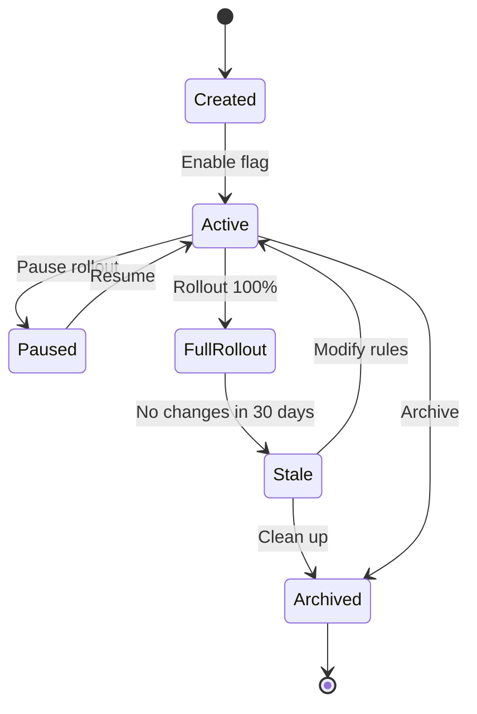
```mermaid
stateDiagram-v2
    [*] --> Created
    Created --> Active: Enable flag
    Active --> Paused: Pause rollout
    Paused --> Active: Resume
    Active --> FullRollout: Rollout 100%
    FullRollout --> Stale: No changes in 30 days
    Stale --> Archived: Clean up
    Stale --> Active: Modify rules
    Active --> Archived: Archive
    Archived --> [*]
```

### Alert Incident Lifecycle

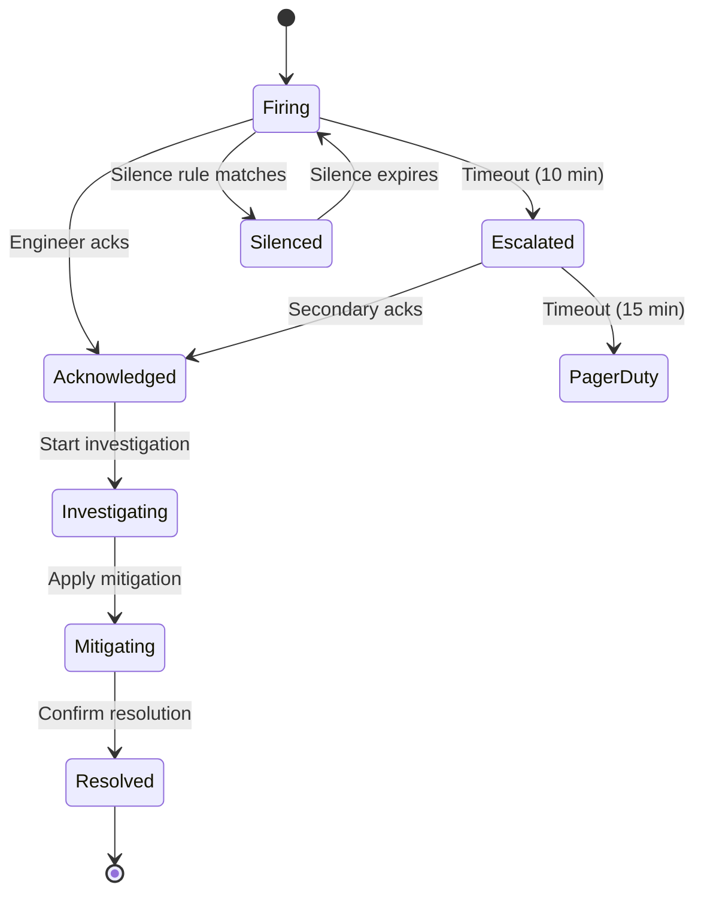
```mermaid
stateDiagram-v2
    [*] --> Firing
    Firing --> Acknowledged: Engineer acks
    Firing --> Escalated: Timeout (10 min)
    Escalated --> Acknowledged: Secondary acks
    Escalated --> PagerDuty: Timeout (15 min)
    Acknowledged --> Investigating: Start investigation
    Investigating --> Mitigating: Apply mitigation
    Mitigating --> Resolved: Confirm resolution
    Resolved --> [*]
    Firing --> Silenced: Silence rule matches
    Silenced --> Firing: Silence expires
```

### Rate Limit State

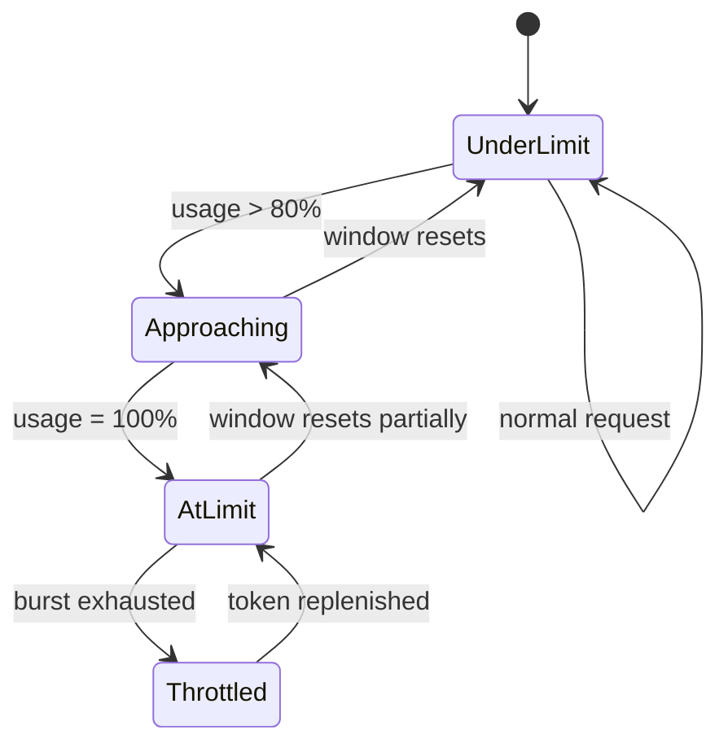
```mermaid
stateDiagram-v2
    [*] --> UnderLimit
    UnderLimit --> Approaching: usage > 80%
    Approaching --> AtLimit: usage = 100%
    AtLimit --> Throttled: burst exhausted
    Throttled --> AtLimit: token replenished
    AtLimit --> Approaching: window resets partially
    Approaching --> UnderLimit: window resets
    UnderLimit --> UnderLimit: normal request
```

### Config Deployment

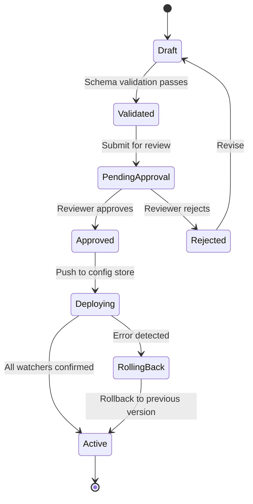
```mermaid
stateDiagram-v2
    [*] --> Draft
    Draft --> Validated: Schema validation passes
    Validated --> PendingApproval: Submit for review
    PendingApproval --> Approved: Reviewer approves
    PendingApproval --> Rejected: Reviewer rejects
    Rejected --> Draft: Revise
    Approved --> Deploying: Push to config store
    Deploying --> Active: All watchers confirmed
    Deploying --> RollingBack: Error detected
    RollingBack --> Active: Rollback to previous version
    Active --> [*]
```

### Message Delivery Lifecycle

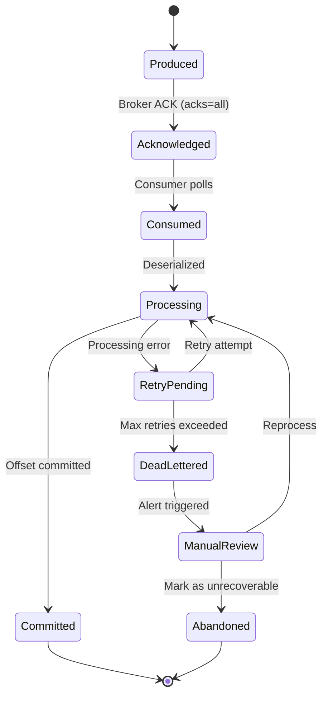
```mermaid
stateDiagram-v2
    [*] --> Produced
    Produced --> Acknowledged: Broker ACK (acks=all)
    Acknowledged --> Consumed: Consumer polls
    Consumed --> Processing: Deserialized
    Processing --> Committed: Offset committed
    Processing --> RetryPending: Processing error
    RetryPending --> Processing: Retry attempt
    RetryPending --> DeadLettered: Max retries exceeded
    DeadLettered --> ManualReview: Alert triggered
    ManualReview --> Processing: Reprocess
    ManualReview --> Abandoned: Mark as unrecoverable
    Committed --> [*]
    Abandoned --> [*]
```

---

## Sequence Diagrams

### Cache Read/Write Path

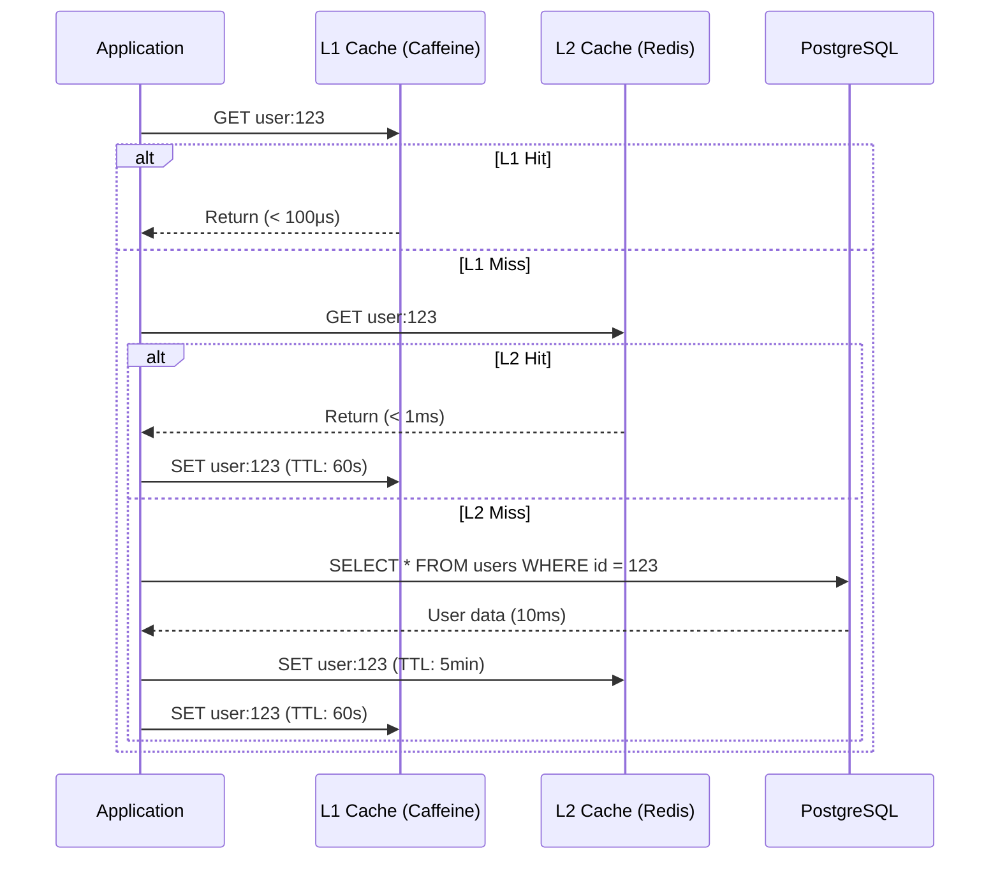
```mermaid
sequenceDiagram
    participant App as Application
    participant L1 as L1 Cache (Caffeine)
    participant L2 as L2 Cache (Redis)
    participant DB as PostgreSQL

    App->>L1: GET user:123
    alt L1 Hit
        L1-->>App: Return (< 100μs)
    else L1 Miss
        App->>L2: GET user:123
        alt L2 Hit
            L2-->>App: Return (< 1ms)
            App->>L1: SET user:123 (TTL: 60s)
        else L2 Miss
            App->>DB: SELECT * FROM users WHERE id = 123
            DB-->>App: User data (10ms)
            App->>L2: SET user:123 (TTL: 5min)
            App->>L1: SET user:123 (TTL: 60s)
        end
    end
```

### Kafka Produce-Consume Flow

```mermaid
sequenceDiagram
    participant P as Producer
    participant SR as Schema Registry
    participant B as Kafka Broker
    participant CG as Consumer Group
    participant C1 as Consumer 1
    participant C2 as Consumer 2

    P->>SR: Validate schema (Avro)
    SR-->>P: Schema ID: 42
    P->>B: Produce(topic=orders, key=order_123, schema_id=42)
    B->>B: Append to partition (by hash(key))
    B-->>P: ACK (offset: 54321)

    CG->>B: Poll (consumer.group=order-processor)
    B-->>C1: Messages from partition 0,1
    B-->>C2: Messages from partition 2,3
    C1->>SR: Deserialize with schema 42
    C1->>C1: Process message
    C1->>B: Commit offset
```

### Rate Limit Check

```mermaid
sequenceDiagram
    participant Client as API Client
    participant GW as API Gateway
    participant RL as Rate Limiter (Redis)
    participant App as Application

    Client->>GW: POST /api/v1/orders
    GW->>RL: Check rate limit (api_key + endpoint)
    RL->>RL: Execute Lua script atomically
    alt Under Limit
        RL-->>GW: Allowed (remaining: 847)
        GW->>App: Forward request
        App-->>GW: 200 OK
        GW-->>Client: 200 OK + X-RateLimit headers
    else Over Limit
        RL-->>GW: Rejected (retry_after: 42s)
        GW-->>Client: 429 Too Many Requests + Retry-After: 42
    end
```

### Feature Flag Evaluation

```mermaid
sequenceDiagram
    participant App as Application
    participant SDK as Flag SDK
    participant Cache as Local Cache
    participant FlagSvc as Flag Service
    participant DB as PostgreSQL

    Note over SDK, Cache: SDK initialized with SSE connection
    FlagSvc-->>Cache: SSE: flag update stream

    App->>SDK: evaluate("new_checkout", user)
    SDK->>Cache: Lookup flag + rules
    Cache-->>SDK: Flag config (cached)
    SDK->>SDK: Evaluate targeting rules
    SDK->>SDK: Check user segment match
    SDK->>SDK: Apply percentage rollout (hash(user_id) % 100)
    SDK-->>App: {value: true, reason: "rule_match"}

    Note over App: Background: flag update received
    FlagSvc->>Cache: SSE: flag "new_checkout" updated
    Cache->>Cache: Refresh local copy
```

### Alert Escalation

```mermaid
sequenceDiagram
    participant Prom as Prometheus
    participant AM as Alertmanager
    participant Slack as Slack
    participant PD as PagerDuty
    participant P1 as Primary On-Call
    participant P2 as Secondary On-Call

    Prom->>AM: Alert: error_rate > 1% for 5min
    AM->>AM: Deduplicate + check inhibitions
    AM->>AM: Route by severity=critical, team=orders
    AM->>Slack: Post alert to #orders-alerts
    AM->>PD: Create incident (P0)
    PD->>P1: SMS + Phone call
    Note over P1: 10 minutes pass, no ACK
    PD->>P2: Escalate: SMS + Phone call
    P2->>PD: Acknowledge
    PD-->>AM: Status: acknowledged
    P2->>P2: Investigate and mitigate
    P2->>PD: Resolve incident
    PD-->>AM: Status: resolved
    AM->>Slack: Alert resolved
```

---

## Concurrency Control

### Redis Atomic Operations

Redis processes commands single-threaded, making individual commands atomic. For multi-step operations, use Lua scripts:

```lua
-- Atomic check-and-set with version (optimistic locking)
-- KEYS[1] = key, ARGV[1] = expected_version, ARGV[2] = new_value, ARGV[3] = new_version
local current = redis.call('HGET', KEYS[1], 'version')
if current == ARGV[1] then
    redis.call('HSET', KEYS[1], 'value', ARGV[2], 'version', ARGV[3])
    return 1  -- success
else
    return 0  -- version conflict
end
```

### Kafka Consumer Group Rebalancing

When consumers join or leave a group, Kafka rebalances partition assignments. During rebalance, processing pauses:

| Strategy | Pause Duration | Data Loss Risk | Complexity |
|----------|---------------|---------------|-----------|
| **Eager** | Full stop during rebalance | None | Low |
| **Cooperative Sticky** | Only affected partitions pause | None | Medium |
| **Static membership** | No rebalance on restart (within timeout) | None | Low |

**Best practice**: Use cooperative sticky assignment + static group membership to minimize rebalance disruption.

### Distributed Rate Limit Consistency

| Approach | Accuracy | Latency | Scalability |
|----------|---------|---------|------------|
| **Per-node counters** | Approximate (can exceed limit by N nodes) | Lowest | Best |
| **Central Redis** | Exact | Medium (network hop) | Limited by Redis |
| **Redis + local cache** | Near-exact (race window) | Low | Good |
| **Gossip sync** | Approximate (convergence delay) | Lowest | Best |

**Recommended**: Redis for exact limits on critical endpoints; per-node counters with periodic sync for high-throughput non-critical endpoints.

---

## Idempotency Strategy

### Kafka Consumer Idempotency

```sql
CREATE TABLE kafka_consumer_offsets (
    consumer_group  VARCHAR(200) NOT NULL,
    topic           VARCHAR(200) NOT NULL,
    partition_id    INTEGER NOT NULL,
    committed_offset BIGINT NOT NULL,
    committed_at    TIMESTAMPTZ NOT NULL DEFAULT now(),
    PRIMARY KEY (consumer_group, topic, partition_id)
);

-- Idempotent processing pattern:
-- 1. Read offset from DB (within same transaction as processing)
-- 2. Skip if message.offset <= committed_offset
-- 3. Process message
-- 4. Update committed_offset
-- 5. COMMIT transaction
```

### Log Deduplication

For high-volume logging, deduplicate identical errors within a window:

```
Dedup key = hash(service + error_class + stack_trace_top_3_frames)
Window = 60 seconds
Action = increment counter, don't create new log entry
```

---

## Consistency Model

| Subsystem | Consistency Level | Rationale |
|-----------|------------------|-----------|
| Cache data | Eventual (bounded staleness via TTL) | Performance > freshness for most reads |
| Kafka message ordering | Strong within partition | Critical for event ordering |
| Kafka cross-partition | No ordering guarantee | Design consumers accordingly |
| Rate limit counters | Strong per-node, eventual cross-node | Over-limit by at most N nodes |
| Feature flag config | Read-after-write via SSE | Flag changes must be visible to operator |
| Feature flag evaluation | Eventual (SDK cache, < 30s lag) | Acceptable for gradual rollouts |
| Config store | Linearizable reads | Config correctness is critical |
| Alert state | Strong (single writer) | Dedup and escalation require accuracy |
| Log ingestion | Eventual (seconds to searchable) | Acceptable for most debugging |

---

## Distributed Transaction / Saga Design

### Config Rollout Saga

```mermaid
stateDiagram-v2
    [*] --> ValidateSchema
    ValidateSchema --> ApplyCanary: Schema valid
    ValidateSchema --> Failed: Schema invalid
    ApplyCanary --> MonitorCanary: Canary instance updated
    MonitorCanary --> RolloutBatch1: Metrics OK after 5min
    MonitorCanary --> RollbackCanary: Metrics degraded
    RolloutBatch1 --> MonitorBatch1: 25% instances updated
    MonitorBatch1 --> RolloutBatch2: Metrics OK after 5min
    MonitorBatch1 --> RollbackAll: Metrics degraded
    RolloutBatch2 --> MonitorBatch2: 50% updated
    MonitorBatch2 --> RolloutFull: Metrics OK
    MonitorBatch2 --> RollbackAll: Metrics degraded
    RolloutFull --> Completed: 100% updated
    RollbackCanary --> Reverted: Previous config restored
    RollbackAll --> Reverted: Previous config restored
    Failed --> [*]
    Completed --> [*]
    Reverted --> [*]
```

### Feature Flag Deployment Saga

| Step | Action | Compensating Action |
|------|--------|-------------------|
| 1 | Validate flag targeting rules | N/A |
| 2 | Update flag in primary DB | Revert DB to previous version |
| 3 | Invalidate SDK caches (SSE push) | Push revert event |
| 4 | Monitor error rates for 5 min | Auto-revert if error spike > 2x |
| 5 | Mark deployment complete | Mark as rolled back |

---

## Security Design

### Redis Security

| Layer | Mechanism | Implementation |
|-------|----------|---------------|
| Network | Private subnet, no public access | VPC + security groups |
| Authentication | Redis AUTH + ACL (6.0+) | Per-service credentials |
| Encryption in transit | TLS 1.3 | stunnel or Redis native TLS |
| Encryption at rest | Disk encryption | EBS encryption |
| Authorization | ACL per user (read/write/admin) | `ACL SETUSER service-a ~user:* +get +set -del` |
| Audit | Slowlog + command logging | Redis MONITOR (briefly) + Slowlog |

### Kafka Security

| Layer | Mechanism |
|-------|----------|
| Authentication | SASL/SCRAM-256 (per-service) |
| Authorization | ACL (topic-level read/write/create) |
| Encryption in transit | TLS between brokers and clients |
| Encryption at rest | Disk encryption |
| Schema enforcement | Schema registry with compatibility checks |

### Log PII Redaction

```json
// Before redaction:
{"message": "Payment failed for user alice@example.com, card 4111-1111-1111-1234"}

// After redaction:
{"message": "Payment failed for user [EMAIL_REDACTED], card [CARD_REDACTED]"}

// Redaction rules:
// - Email: /[a-zA-Z0-9._%+-]+@[a-zA-Z0-9.-]+\.[a-zA-Z]{2,}/ → [EMAIL_REDACTED]
// - Card: /\b\d{4}[-\s]?\d{4}[-\s]?\d{4}[-\s]?\d{4}\b/ → [CARD_REDACTED]
// - SSN: /\b\d{3}[-\s]?\d{2}[-\s]?\d{4}\b/ → [SSN_REDACTED]
// - Phone: /\b\+?\d{1,3}[-\s]?\(?\d{3}\)?[-\s]?\d{3}[-\s]?\d{4}\b/ → [PHONE_REDACTED]
```

---

## Observability Design (Meta-Observability)

### Monitoring the Monitoring

| System | What to Monitor | Alert Threshold |
|--------|----------------|----------------|
| Redis | Memory usage, hit ratio, connected clients | Memory > 80%, hit ratio < 90% |
| Kafka | Consumer lag, under-replicated partitions, disk usage | Lag > 100K, under-replicated > 0, disk > 80% |
| Rate Limiter | Rejection rate, Redis latency | Rejection > 10%, Redis p99 > 5ms |
| Feature Flags | Evaluation errors, SDK connection failures | Errors > 1%, disconnected > 5min |
| Log Pipeline | Ingestion rate, indexing lag, storage growth | Lag > 5min, growth > 110% normal |
| Alerting | Alert delivery latency, unacked alerts | Delivery > 60s, unacked P0 > 10min |
| Config Store | Leader changes, latency spikes | Leader changes > 2/hour, p99 > 50ms |

### Key Dashboards

**Cache Dashboard:**
- Hit ratio (target > 95%)
- Memory utilization per node
- Eviction rate (should be near 0 in steady state)
- Slow commands (> 10ms)
- Connected clients
- Operations per second by command type

**Kafka Dashboard:**
- Messages produced/consumed per topic
- Consumer lag per group (bytes and messages)
- Partition leader distribution (balance)
- Under-replicated partitions (should be 0)
- Broker disk usage and I/O
- Request latency (produce and fetch)

---

## Reliability and Resilience

### Cache Failure Modes

| Failure | Impact | Mitigation |
|---------|--------|-----------|
| Single node crash | Partial cache loss | Redis Cluster auto-failover to replica |
| Full cluster outage | All cache misses → DB overload | Circuit breaker: degrade gracefully, serve stale |
| Network partition | Split-brain risk | Redis Sentinel quorum; min-replicas-to-write |
| Hot key overload | Single node saturated | L1 local cache + key sharding |
| Memory exhaustion | Eviction storm | Monitor memory; scale before 80% |

### Kafka Failure Modes

| Failure | Impact | Mitigation |
|---------|--------|-----------|
| Broker crash | Partitions temporarily unavailable | ISR replicas take over; min.insync.replicas=2 |
| Consumer crash | Partition idle until rebalance | Cooperative sticky rebalance; static membership |
| Disk full | Broker rejects writes | Retention policies; disk usage alerts at 70% |
| Network partition | ISR shrinks; producers may block | acks=all ensures durability; unclean.leader.election=false |
| Consumer lag spiral | Messages expire before processing | Auto-scaling consumers; alerting on lag |

### Config Store HA

| Scenario | Consul | etcd | ZooKeeper |
|----------|--------|------|-----------|
| Leader loss | Raft re-election (< 5s) | Raft re-election (< 5s) | ZAB re-election (< 10s) |
| Node loss | Cluster continues with majority | Cluster continues with majority | Cluster continues with majority |
| Network partition | Read from stale follower (stale OK) | Linearizable reads from leader only | Read from leader |
| Full outage | Services use last-known config | Services use cached config | Services use cached config |

---

## Multi-Region and DR Strategy

### Redis Cross-Region Replication

```mermaid
flowchart LR
    subgraph US["US-East (Primary)"]
        RedisPrimary["Redis Primary Cluster"]
    end
    subgraph EU["EU-West (Replica)"]
        RedisReplica1["Redis Replica Cluster"]
    end
    subgraph APAC["AP-Southeast (Replica)"]
        RedisReplica2["Redis Replica Cluster"]
    end

    RedisPrimary -->|"Async replication"| RedisReplica1
    RedisPrimary -->|"Async replication"| RedisReplica2
```

| Approach | Consistency | Latency | Complexity |
|----------|-----------|---------|-----------|
| **Active-Passive** | Strong (single writer) | High for writes (cross-region) | Low |
| **Active-Active (CRDT)** | Eventual (conflict resolution) | Low (local writes) | High |
| **Region-local** | Independent per region | Lowest | Low (no replication) |

### Kafka MirrorMaker 2

```
US-East cluster ←→ EU-West cluster ←→ AP-Southeast cluster
(Bidirectional replication with topic prefixing)

Topic naming: us-east.order-events, eu-west.order-events
Consumer reads local topic + replicated topics
```

### Global Rate Limiting

| Strategy | Accuracy | Latency |
|----------|---------|---------|
| Per-region limits | Approximate (3x limit globally) | Lowest |
| Central coordinator | Exact | High (cross-region call) |
| Async sync (every 10s) | Near-exact | Low |

**Recommended**: Per-region limits for most APIs; async sync for billing-critical endpoints.

---

## Cost Drivers and Optimization

| Component | Monthly Cost | Optimization |
|-----------|-------------|-------------|
| Redis Cluster (16 nodes, r6g.2xlarge) | $18,000 | Right-size; compress values; shorter TTLs |
| Kafka Cluster (30 brokers, i3.2xlarge) | $45,000 | Tiered storage (S3); reduce replication for non-critical topics |
| Elasticsearch (20 nodes, hot/warm) | $35,000 | Switch to Loki (10x cheaper); aggressive sampling |
| Prometheus + Thanos | $8,000 | Reduce cardinality; downsample older data |
| PagerDuty/OpsGenie | $5,000 | Reduce alert noise (fewer pages) |
| Feature Flag SaaS (LaunchDarkly) | $12,000 | Self-host Unleash ($0 license) |
| Consul Cluster (5 nodes) | $3,000 | Minimal footprint needed |
| **Total** | **~$126,000/mo** | **Target: $80,000/mo with optimizations** |

**Top Optimization Strategies:**

1. **Switch ELK to Loki**: Save 60-70% on log storage costs
2. **Kafka tiered storage**: Move old segments to S3, save 40% on broker storage
3. **Redis value compression**: Compress values > 1KB with LZ4, save 30% memory
4. **Log sampling**: Sample DEBUG/INFO logs at 10%, save 80% on volume
5. **Metric cardinality**: Cap label cardinality at 1000 per metric
6. **Self-host feature flags**: Replace SaaS with Unleash OSS

---

## Deep Platform Comparisons

### How Netflix / Google / Uber / Meta / Stripe Use These Systems

| System | Netflix | Google | Uber | Meta | Stripe |
|--------|---------|--------|------|------|--------|
| **Caching** | EVCache (Memcached-based, multi-region) | Custom (Memcache + Bigtable) | Schemaless cache + Redis | TAO (graph cache), Memcached | Redis Cluster |
| **Messaging** | Kafka (1T+ msgs/day) | Pub/Sub (custom) | Kafka + Cherami (custom) | Custom (Scribe → LogDevice) | Kafka |
| **Rate Limiting** | Zuul (gateway-level) | Global quota system | Custom (per-city limits) | Custom (per-user-per-feature) | Redis + custom |
| **Feature Flags** | Custom (hundreds of flags) | Custom (Experiment framework) | Custom (Flipr) | Gatekeeper | Custom (Scientist) |
| **Logging** | Atlas + Elasticsearch | Dapper + custom | M3 + ELK | Scuba (custom OLAP) | Custom + Datadog |
| **Alerting** | Atlas alerts | Monarch + custom | uMonitor | FBAR (custom) | PagerDuty + custom |
| **Config** | Archaius (dynamic config) | Borg config | Custom (per-service) | Configerator | Custom |

---

## Edge Cases and Failure Scenarios

### 1. Cache Stampede on Flash Sale

**Scenario**: Product page cache expires right when a flash sale starts. 50,000 concurrent users hit the database simultaneously.
**Detection**: Sudden spike in cache miss rate + DB CPU spike.
**Mitigation**: Probabilistic early expiry + request coalescing + stale-while-revalidate.
**Prevention**: Pre-warm cache before sale; use write-through for hot products.

### 2. Kafka Consumer Lag Spiral

**Scenario**: Consumer processing slows due to downstream dependency timeout. Lag grows faster than consumption. Eventually messages expire before being processed.
**Detection**: Consumer lag metric growing linearly. Processing rate < production rate.
**Mitigation**: Scale consumers horizontally. If downstream is the bottleneck, implement back-pressure. Skip non-critical messages.
**Prevention**: Set retention higher than max expected lag. Auto-scale consumers on lag metric.

### 3. Rate Limit Bypass via Distributed IPs

**Scenario**: Attacker uses 10,000 rotating IPs to bypass per-IP rate limits. Each IP stays under the limit, but aggregate traffic is 100x normal.
**Detection**: Aggregate traffic spike without per-IP limit breaches. Behavioral analysis shows bot patterns.
**Mitigation**: Switch to user-level or API-key-level rate limiting. Add behavioral rate limiting (request pattern analysis). Deploy CAPTCHA.
**Prevention**: Always rate limit by authenticated identity, not just IP.

### 4. Stale Feature Flag After SSE Disconnection

**Scenario**: SDK's SSE connection drops silently. Flag changes in the backend don't reach the application. Stale flags serve for hours.
**Detection**: SDK health check shows stale cache age > threshold. Heartbeat timeout on SSE stream.
**Mitigation**: SDK polls as fallback every 30 seconds when SSE is down. Log and alert on staleness.
**Prevention**: SSE keepalive pings every 15 seconds. Auto-reconnect with exponential backoff.

### 5. Log Pipeline Backpressure

**Scenario**: Kafka ingestion can't keep up with log volume (10x spike during incident). Logs buffer in agent memory, agents OOM-kill, logs are lost.
**Detection**: Kafka producer buffer full errors. Agent memory usage spike.
**Mitigation**: Enable disk-based buffering in log agents. Apply aggressive sampling (10x reduction). Drop DEBUG logs entirely during spikes.
**Prevention**: Over-provision Kafka for 10x burst. Implement adaptive sampling that increases automatically under load.

### 6. Alert Storm During Cascading Failure

**Scenario**: Database goes down → 50 services error → 200 alerts fire simultaneously → on-call engineer overwhelmed.
**Detection**: Alert volume > 50 in 1 minute. All alerts share a root cause signal.
**Mitigation**: Alertmanager inhibition rules (DB alert inhibits dependent service alerts). Group related alerts into a single incident.
**Prevention**: Design alert hierarchy: infrastructure alerts suppress application alerts. Use SLO-based alerting (fewer, more meaningful alerts).

### 7. Config Poisoning

**Scenario**: A bad config change (timeout set to 0ms) is pushed to production. All requests fail immediately.
**Detection**: Error rate spikes to 100% within seconds of config push.
**Mitigation**: Canary config rollout (apply to 1 instance first). Automatic rollback if error rate > threshold.
**Prevention**: Schema validation (timeout must be > 0). Require approval for production config changes. Gradual rollout saga.

### 8. Redis Split-Brain

**Scenario**: Network partition causes Redis Sentinel to elect a new master. Old master still accepts writes. Two masters diverge.
**Detection**: Two nodes reporting as master. Sentinel logs show failover disagreement.
**Mitigation**: Configure `min-replicas-to-write=1` so isolated master rejects writes. Sentinel quorum ensures majority agreement.
**Prevention**: Use Redis Cluster (hash slot-based) instead of Sentinel for critical workloads. Test network partition regularly.

### 9. Kafka Partition Leader Election During Deploy

**Scenario**: Broker rolling restart triggers partition leader elections. During election, producers block (acks=all). Latency spikes for all producing services.
**Detection**: Produce latency spike during deploy window. Under-replicated partition count > 0.
**Mitigation**: Use `controlled.shutdown.enable=true`. Graceful leader migration before shutdown.
**Prevention**: Deploy during low-traffic window. Use preferred leader election after restart.

### 10. Hot Key in Cache

**Scenario**: A viral product gets 500K reads/sec on a single Redis key. That shard is overwhelmed while others are idle.
**Detection**: Single-shard CPU at 100%. Latency spike on that shard only.
**Mitigation**: Replicate hot key to multiple shards (`product:123:shard_0`, `product:123:shard_1`). Client picks shard randomly.
**Prevention**: L1 in-process cache for known hot keys. Bloom filter to detect hot keys in real-time.

### 11. Zombie Kafka Consumer

**Scenario**: Consumer process hangs (GC pause, deadlock). Session timeout hasn't expired. Partition assigned but not being processed.
**Detection**: Consumer lag growing for specific partitions. No offset commits from that consumer.
**Mitigation**: Reduce session.timeout.ms (default 45s → 10s). Use heartbeat.interval.ms = 3s.
**Prevention**: Use health checks that verify actual processing (not just heartbeat). Monitor per-consumer-per-partition lag.

### 12. Metric Cardinality Explosion

**Scenario**: Developer adds a label `user_id` to a metric. With 50M users, Prometheus creates 50M time series. Memory explodes, queries timeout.
**Detection**: TSDB head series count spike. Prometheus OOM. Query latency > 30s.
**Mitigation**: Drop high-cardinality labels via relabeling rules. Downsample or aggregate.
**Prevention**: Enforce cardinality limits per metric (< 1000 unique label combinations). Code review for metric additions. Pre-commit hook that checks metric labels.

---

## Architecture Decision Records

### ARD-001: Redis over Memcached for Distributed Caching

| Field | Detail |
|-------|--------|
| **Decision** | Use Redis Cluster as the primary distributed cache |
| **Options** | (A) Memcached, (B) Redis, (C) KeyDB, (D) DragonflyDB |
| **Chosen** | Option B — Redis |
| **Why** | Rich data structures (sorted sets for leaderboards, streams for event sourcing), Lua scripting for atomic operations, built-in pub/sub for cache invalidation, Redis Cluster for auto-sharding |
| **Trade-offs** | Single-threaded (lower raw throughput than Memcached); more memory overhead per key |
| **Risks** | Single-threaded bottleneck for CPU-heavy Lua scripts |
| **Revisit when** | If throughput > 1M ops/sec per node needed → evaluate DragonflyDB |

### ARD-002: Kafka over RabbitMQ for Event Streaming

| Field | Detail |
|-------|--------|
| **Decision** | Use Apache Kafka as the primary message broker |
| **Options** | (A) RabbitMQ, (B) Kafka, (C) Pulsar, (D) NATS, (E) SQS |
| **Chosen** | Option B — Kafka |
| **Why** | Log-based storage enables replay; consumer groups enable parallel processing; 1M+ msgs/sec throughput; rich ecosystem (Connect, Streams, Schema Registry) |
| **Trade-offs** | High operational complexity; requires ZooKeeper/KRaft; consumer rebalancing can be disruptive |
| **Risks** | Operational burden of managing a large Kafka cluster |
| **Revisit when** | If simplicity > throughput → use SQS/SNS for simple queues; keep Kafka for event streaming |

### ARD-003: Grafana Loki over ELK for Log Aggregation

| Field | Detail |
|-------|--------|
| **Decision** | Use Grafana Loki as the primary log aggregation system |
| **Options** | (A) ELK Stack, (B) Grafana Loki, (C) Datadog, (D) Splunk |
| **Chosen** | Option B — Loki |
| **Why** | 10x cheaper than ELK (no full-text indexing of log content); native Grafana integration; label-based querying sufficient for most use cases; simpler operations |
| **Trade-offs** | Slower ad-hoc search (grep-like vs pre-indexed); less suitable for security analytics (SIEM) |
| **Risks** | Complex LogQL queries for ad-hoc investigation |
| **Revisit when** | If security/compliance requires real-time full-text search → add ELK for security logs only |

### ARD-004: Token Bucket for Rate Limiting

| Field | Detail |
|-------|--------|
| **Decision** | Use token bucket algorithm as the default rate limiting strategy |
| **Options** | (A) Fixed window, (B) Sliding window log, (C) Sliding window counter, (D) Token bucket, (E) Leaky bucket |
| **Chosen** | Option D — Token bucket |
| **Why** | Allows controlled bursts (good UX); O(1) memory; simple Redis implementation; widely understood |
| **Trade-offs** | Burst can temporarily exceed sustained rate; slightly more complex than fixed window |
| **Risks** | Burst allowance can be exploited if not bounded |
| **Revisit when** | If strict smooth rate needed → leaky bucket; if memory is critical → fixed window |

### ARD-005: Consul for Config Management

| Field | Detail |
|-------|--------|
| **Decision** | Use Consul for centralized configuration management |
| **Options** | (A) Consul, (B) etcd, (C) ZooKeeper, (D) AWS Parameter Store, (E) Spring Cloud Config |
| **Chosen** | Option A — Consul |
| **Why** | Built-in service discovery + health checks + KV store; multi-datacenter support; HTTP API + DNS interface; blocking queries for efficient watching |
| **Trade-offs** | Another infrastructure component to manage; not as battle-tested as ZooKeeper for large-scale |
| **Risks** | Gossip protocol overhead in very large clusters |
| **Revisit when** | If already on Kubernetes → etcd is built-in; if fully on AWS → Parameter Store is simpler |

### ARD-006: SLO-Based Alerting over Threshold Alerting

| Field | Detail |
|-------|--------|
| **Decision** | Use SLO-based burn rate alerting as the primary alerting strategy |
| **Options** | (A) Static threshold, (B) SLO burn rate, (C) Anomaly detection (ML) |
| **Chosen** | Option B — SLO burn rate |
| **Why** | Fewer, more meaningful alerts; directly tied to business impact (error budget); multi-window approach reduces false positives; aligns with Google SRE best practices |
| **Trade-offs** | Requires SLO definitions upfront; more complex to set up; requires error budget tracking |
| **Risks** | If SLOs are set incorrectly, alerts may be too sensitive or too insensitive |
| **Revisit when** | If alert fatigue persists → add ML-based anomaly detection as supplementary layer |

### ARD-007: Push vs Pull Metrics Collection

| Field | Detail |
|-------|--------|
| **Decision** | Use pull-based metrics collection (Prometheus) as default |
| **Options** | (A) Push (StatsD/Datadog agent), (B) Pull (Prometheus scrape), (C) Hybrid (OTLP push to Prometheus) |
| **Chosen** | Option B — Pull (Prometheus) |
| **Why** | Pull model is simpler to debug (scrape targets visible); no risk of overwhelming metrics backend during spike; Prometheus ecosystem is the richest for Kubernetes |
| **Trade-offs** | Short-lived jobs need Pushgateway; scrape interval limits resolution; service must expose /metrics endpoint |
| **Risks** | Scrape timeout for slow targets; cardinality not controlled at producer side |
| **Revisit when** | If migrating to OTLP standard → consider push via OpenTelemetry Collector |

---

## POCs to Validate First

### POC-1: Redis Hot Key Detection

**Goal**: Detect and mitigate hot keys (> 10K ops/sec on single key) in < 1 second.
**Approach**: Redis `OBJECT FREQ` + client-side HyperLogLog sketch.
**Success criteria**: Hot key detected within 1s; L1 cache activated within 5s.
**Fallback**: Static hot key list from config.

### POC-2: Kafka Exactly-Once End-to-End

**Goal**: Validate exactly-once semantics across produce → consume → DB write.
**Approach**: Idempotent producer + transactional consumer + DB transaction.
**Success criteria**: Zero duplicate processing under broker failure and consumer restart.
**Fallback**: At-least-once with application-level deduplication.

### POC-3: Rate Limiter at 200K Checks/sec

**Goal**: Sustain 200K rate limit checks/sec with < 2ms p99 latency.
**Approach**: Redis Lua script with sliding window counter.
**Success criteria**: p99 < 2ms, zero request drops.
**Fallback**: Per-node in-memory counters with periodic Redis sync.

### POC-4: Feature Flag SDK Cache Freshness

**Goal**: Flag updates propagated to all SDK instances within 5 seconds.
**Approach**: SSE streaming from flag service to SDKs.
**Success criteria**: 95% of instances updated within 5s; 100% within 30s.
**Fallback**: 30-second polling interval.

### POC-5: Log Pipeline Burst Capacity

**Goal**: Handle 10x log volume spike without data loss.
**Approach**: Kafka buffer between agents and Loki. Agent disk-based spillover.
**Success criteria**: Zero log loss during 10x spike sustained for 30 minutes.
**Fallback**: Adaptive sampling drops DEBUG/INFO during burst.

### POC-6: Alert Deduplication Accuracy

**Goal**: Reduce alert volume by 80% during cascading failure without missing distinct incidents.
**Approach**: Alertmanager grouping + inhibition rules + SLO-based alerting.
**Success criteria**: < 10 pages during cascading failure (vs 200+ with threshold alerting).
**Fallback**: Manual runbook for triage during alert storm.

---

## Interview Angle

| Question | Key Points |
|----------|-----------|
| "Design a caching system" | Multi-tier (L1/L2/L3), cache-aside pattern, stampede prevention, consistency model, hot key mitigation |
| "Design a message queue" | Kafka architecture, partitions + consumer groups, exactly-once, ordering guarantees, DLQ |
| "Design a rate limiter" | Token bucket vs sliding window, Redis Lua script, distributed consistency, multi-layer enforcement |
| "Design a feature flag system" | Flag types, targeting rules, SDK architecture, SSE updates, gradual rollout, kill switch |
| "Design a logging system" | Structured logging, aggregation pipeline, ELK vs Loki, sampling, PII redaction, retention tiers |
| "Design an alerting system" | SLO-based burn rate, escalation, deduplication, grouping, inhibition, on-call rotation |
| "How do you handle config changes safely?" | Canary rollout, schema validation, gradual deployment saga, rollback automation |

---

## Evolution Roadmap (V1 → V2 → V3)

```mermaid
flowchart LR
    subgraph V1["V1: Startup"]
        V1A["Redis single instance"]
        V1B["RabbitMQ for tasks"]
        V1C["Env vars for config"]
        V1D["Console.log"]
        V1E["Email alerts"]
        V1F["No feature flags"]
        V1G["No rate limiting"]
    end
    subgraph V2["V2: Growth"]
        V2A["Redis Cluster"]
        V2B["Kafka for events"]
        V2C["Consul for config"]
        V2D["ELK Stack"]
        V2E["PagerDuty + Prometheus"]
        V2F["LaunchDarkly"]
        V2G["Redis rate limiter"]
    end
    subgraph V3["V3: Scale"]
        V3A["Multi-region Redis (CRDT)"]
        V3B["Kafka + MirrorMaker 2"]
        V3C["GitOps config + canary"]
        V3D["Loki + Tempo + Grafana"]
        V3E["SLO-based alerting"]
        V3F["Custom flag platform"]
        V3G["Adaptive rate limiting"]
    end
    V1 -->|"Growing pains"| V2
    V2 -->|"Global scale"| V3
```

---

## Practice Questions

1. **Design a distributed cache that handles 500K reads/sec with < 1ms p99.** Cover multi-tier architecture, eviction, stampede prevention, and hot key mitigation.

2. **Design a message queue system for processing 1M events/sec.** Cover Kafka architecture, partitioning, consumer groups, exactly-once semantics, and DLQ.

3. **Design a rate limiter for a public API with 100K req/sec.** Cover algorithm selection, Redis implementation, distributed consistency, and multi-layer enforcement.

4. **Design a feature flag system supporting gradual rollouts to 50M users.** Cover flag types, targeting rules, SDK architecture, real-time updates, and kill switches.

5. **Design a logging system that ingests 10 TB/day of structured logs.** Cover pipeline architecture, storage tiers, PII redaction, sampling, and cost optimization.

6. **Design an alerting system that reduces alert fatigue by 80%.** Cover SLO-based alerting, burn rate, escalation, grouping, inhibition, and on-call rotation.

7. **Design a config management system for 500 microservices.** Cover centralized store, hot-reload, canary rollout, schema validation, and rollback.

8. **A cache stampede brings down your database during a flash sale. How do you prevent this?** Cover request coalescing, probabilistic early expiry, and stale-while-revalidate.

9. **Kafka consumer lag keeps growing. How do you diagnose and fix it?** Cover monitoring, scaling, back-pressure, and graceful degradation.

10. **An engineer accidentally pushes a bad config to production. How do you prevent and recover?** Cover validation, canary rollout, automatic rollback, and audit trail.

---

## Indexing and Partitioning

### Kafka Partition Strategies

| Data Type | Partition Key | Partitions | Rationale |
|-----------|-------------|-----------|-----------|
| Order events | `order_id` | 64 | Ordering per order; even distribution |
| User events | `user_id` | 32 | Ordering per user; segment-based |
| Log events | Round-robin | 24 | Maximum throughput; no ordering needed |
| Metric events | `metric_name` | 16 | Aggregation per metric |
| Config changes | `namespace` | 6 | Low volume; ordering per service |

### Log Index Design (Elasticsearch)

```json
{
  "settings": {
    "number_of_shards": 12,
    "number_of_replicas": 1,
    "index.lifecycle.name": "logs-hot-warm-cold",
    "index.lifecycle.rollover_alias": "logs-write"
  },
  "mappings": {
    "properties": {
      "timestamp": { "type": "date" },
      "level": { "type": "keyword" },
      "service": { "type": "keyword" },
      "trace_id": { "type": "keyword" },
      "message": { "type": "text", "analyzer": "standard" },
      "user_id": { "type": "keyword" },
      "status_code": { "type": "integer" },
      "duration_ms": { "type": "float" },
      "error_class": { "type": "keyword" }
    }
  }
}
```

**Index lifecycle management (ILM):**

| Phase | Age | Storage | Replicas | Searchable |
|-------|-----|---------|----------|-----------|
| Hot | 0-3 days | SSD (NVMe) | 1 | Full speed |
| Warm | 3-30 days | HDD | 1 | Slower queries OK |
| Cold | 30-90 days | S3 (searchable snapshots) | 0 | On-demand |
| Delete | > 90 days | Removed | - | - |

### Config Key Namespacing

```
Namespace hierarchy:
  global/                          # Shared across all services
    timeout_default_ms = 3000
    retry_max_attempts = 3

  production/                      # Environment-specific
    database_pool_size = 20

  production/order-service/        # Service-specific
    checkout_timeout_ms = 5000
    enable_fraud_check = true

  production/order-service/pod-3/  # Instance-specific (rare)
    debug_mode = true
```

### Redis Key Namespacing

```
Convention: {service}:{entity}:{id}:{field}

Examples:
  user-svc:profile:12345          → User profile hash
  user-svc:session:abc-def-ghi    → Session data
  order-svc:cart:12345            → Shopping cart
  rate-limit:api-key:key_abc:1m   → Rate limit counter
  feature:flag:new_checkout       → Feature flag state
  config:order-svc:timeout_ms     → Cached config value

Tag-based invalidation:
  SADD tag:user:12345 "user-svc:profile:12345" "user-svc:session:abc" "order-svc:cart:12345"

  # Invalidate all keys for user 12345:
  SMEMBERS tag:user:12345 → get all keys → DEL each key → DEL tag:user:12345
```

---

## Queue / Stream Design (Detailed)

### Kafka Topic Taxonomy

```
Domain Events (business facts):
  order.created                    → 64 partitions, 7-day retention
  order.completed                  → 64 partitions, 7-day retention
  payment.charged                  → 32 partitions, 30-day retention
  user.registered                  → 16 partitions, 30-day retention

Commands (requests to act):
  notification.send                → 16 partitions, 3-day retention
  email.dispatch                   → 8 partitions, 3-day retention

CDC Streams (database changes):
  cdc.postgres.users               → 32 partitions, compact retention
  cdc.postgres.orders              → 64 partitions, compact retention

Internal (infrastructure):
  logs.application                 → 24 partitions, 3-day retention
  metrics.custom                   → 12 partitions, 1-day retention
  dlq.order-processor              → 6 partitions, 30-day retention
```

### Consumer Group Design

```mermaid
flowchart TD
    subgraph Topic["Topic: order.created (64 partitions)"]
        P0["P0"] & P1["P1"] & P2["..."] & P63["P63"]
    end

    subgraph CG1["CG: order-fulfillment (critical)"]
        C1A["Consumer 1 → P0-15"]
        C1B["Consumer 2 → P16-31"]
        C1C["Consumer 3 → P32-47"]
        C1D["Consumer 4 → P48-63"]
    end

    subgraph CG2["CG: analytics-pipeline (batch)"]
        C2A["Consumer 1 → P0-63"]
    end

    subgraph CG3["CG: notification-sender"]
        C3A["Consumer 1 → P0-31"]
        C3B["Consumer 2 → P32-63"]
    end

    Topic --> CG1
    Topic --> CG2
    Topic --> CG3
```

### Back-Pressure Handling

```mermaid
flowchart TD
    Producer["Producer (1M msg/sec)"] --> Kafka["Kafka (buffer)"]
    Kafka --> Consumer["Consumer Group"]
    Consumer --> Check{"Processing rate OK?"}
    Check -->|"Yes (lag < 1K)"| Normal["Normal processing"]
    Check -->|"Lag growing (1K-100K)"| Scale["Auto-scale consumers"]
    Check -->|"Lag critical (> 100K)"| Degrade["Graceful degradation"]
    Degrade --> Skip["Skip non-critical messages"]
    Degrade --> Batch["Increase batch size"]
    Degrade --> Alert["Alert on-call"]
```

| Lag Threshold | Action | Recovery |
|--------------|--------|---------|
| < 1,000 | Normal | - |
| 1K - 10K | Warning alert | Monitor |
| 10K - 100K | Auto-scale consumers (2x) | Lag decreases |
| 100K - 1M | Skip non-critical; increase batch size | Manual intervention |
| > 1M | Page on-call; consider message expiry | Emergency scaling |

### Dead Letter Queue Processing

```sql
-- DLQ processing workflow
-- 1. Consumer fails to process message after 3 retries
-- 2. Message sent to DLQ topic with error metadata
-- 3. DLQ dashboard shows pending messages
-- 4. Engineer investigates and fixes root cause
-- 5. Replay messages from DLQ

-- DLQ message envelope:
{
  "original_topic": "order.created",
  "original_partition": 12,
  "original_offset": 54321,
  "original_key": "order_abc123",
  "original_value": {/* original message */},
  "error": {
    "class": "InventoryServiceTimeoutException",
    "message": "Timeout after 3000ms",
    "stack_trace": "...",
    "retry_count": 3,
    "first_failure_at": "2025-03-15T10:00:00Z",
    "last_failure_at": "2025-03-15T10:05:00Z"
  }
}
```

---

## Reliability Deep Dive

### Cache Failover Architecture

```mermaid
flowchart TD
    App["Application"] --> CB["Circuit Breaker"]
    CB -->|Closed| Redis["Redis Cluster"]
    CB -->|Open| Fallback["Fallback: Direct DB + Local Cache"]
    Redis -->|Healthy| Response["Return cached data"]
    Redis -->|Timeout/Error| CB
    CB -->|"Failures > 5 in 10s"| Open["Open circuit (30s)"]
    Open -->|"30s elapsed"| HalfOpen["Half-open: try 1 request"]
    HalfOpen -->|Success| Closed["Close circuit"]
    HalfOpen -->|Failure| Open
```

**Circuit breaker settings per subsystem:**

| Subsystem | Failure Threshold | Reset Timeout | Half-Open Requests |
|-----------|------------------|--------------|-------------------|
| Redis | 5 failures / 10s | 30s | 3 |
| Kafka producer | 3 failures / 5s | 60s | 1 |
| Feature flag API | 2 failures / 5s | 15s (use cached) | 1 |
| Config store | 3 failures / 10s | 30s (use cached) | 1 |
| Alert delivery | 5 failures / 30s | 120s | 2 |

### Graceful Degradation Hierarchy

```mermaid
flowchart TD
    Normal["Normal Operation"] --> Level1["Level 1: Cache degradation"]
    Level1 --> Level2["Level 2: Queue degradation"]
    Level2 --> Level3["Level 3: Feature degradation"]
    Level3 --> Level4["Level 4: Read-only mode"]
    Level4 --> Level5["Level 5: Static fallback"]

    Level1 -.-> L1Action["L1 cache only; skip Redis"]
    Level2 -.-> L2Action["Sync processing; skip Kafka"]
    Level3 -.-> L3Action["Disable non-critical features via flags"]
    Level4 -.-> L4Action["Reject writes; serve cached reads"]
    Level5 -.-> L5Action["Serve static HTML; maintenance page"]
```

### Kafka Durability Settings

| Setting | Value | Purpose |
|---------|-------|---------|
| `acks` | `all` | Wait for all ISR replicas |
| `min.insync.replicas` | `2` | At least 2 replicas must ACK |
| `replication.factor` | `3` | 3 copies of each partition |
| `unclean.leader.election.enable` | `false` | Never elect out-of-sync replica as leader |
| `log.flush.interval.messages` | `10000` | Flush to disk every 10K messages |
| `enable.idempotence` | `true` | Deduplicate producer retries |

---

## Deployment Architecture

### Redis Cluster Deployment

```mermaid
flowchart TD
    subgraph AZ1["Availability Zone 1"]
        RM1["Redis Master 1 (slots 0-5460)"]
        RS2["Redis Slave 2"]
        RS3["Redis Slave 3"]
    end
    subgraph AZ2["Availability Zone 2"]
        RM2["Redis Master 2 (slots 5461-10922)"]
        RS1["Redis Slave 1"]
    end
    subgraph AZ3["Availability Zone 3"]
        RM3["Redis Master 3 (slots 10923-16383)"]
    end

    RM1 -->|Replication| RS1
    RM2 -->|Replication| RS2
    RM3 -->|Replication| RS3
```

### Kafka Cluster Deployment

```mermaid
flowchart TD
    subgraph AZ1["AZ-1"]
        B1["Broker 1"]
        B4["Broker 4"]
        B7["Broker 7"]
    end
    subgraph AZ2["AZ-2"]
        B2["Broker 2"]
        B5["Broker 5"]
        B8["Broker 8"]
    end
    subgraph AZ3["AZ-3"]
        B3["Broker 3"]
        B6["Broker 6"]
        B9["Broker 9"]
    end
    subgraph KRaft["KRaft Controllers"]
        KC1["Controller 1 (AZ-1)"]
        KC2["Controller 2 (AZ-2)"]
        KC3["Controller 3 (AZ-3)"]
    end

    KRaft --> B1 & B2 & B3 & B4 & B5 & B6 & B7 & B8 & B9
```

### Observability Stack Deployment

```mermaid
flowchart LR
    subgraph Collection["Collection Layer"]
        FB["Fluent Bit (DaemonSet)"]
        OtelCol["OTel Collector (DaemonSet)"]
        PromAgent["Prometheus Agent"]
    end
    subgraph Ingestion["Ingestion Layer"]
        Kafka2["Kafka (log buffer)"]
        PromRemote["Prometheus Remote Write"]
    end
    subgraph Storage["Storage Layer"]
        Loki["Grafana Loki"]
        Mimir["Grafana Mimir (metrics)"]
        Tempo["Grafana Tempo (traces)"]
    end
    subgraph Query["Query Layer"]
        Grafana["Grafana Dashboards"]
        AlertMgr["Alertmanager"]
    end

    Collection --> Ingestion
    Ingestion --> Storage
    Storage --> Query
```

---

## Common Mistakes

1. **Treating cache as source of truth** — Cache is ephemeral. It can be wiped at any time. Always design for cache-miss path.

2. **Not handling Kafka consumer rebalancing** — Consumers should use cooperative sticky assignment and static group membership to minimize disruption.

3. **Rate limiting only at the gateway** — Multi-layer rate limiting is essential. Gateway limits protect the platform; application limits protect individual resources.

4. **Never cleaning up feature flags** — Stale flags accumulate as tech debt. Implement mandatory flag review after 30 days. Auto-archive unused flags.

5. **Logging everything at DEBUG level in production** — 90% of log volume is DEBUG/INFO that nobody reads. Use structured sampling. Log at ERROR/WARN for alerting; DEBUG for development only.

6. **Alerting on symptoms instead of SLOs** — "CPU > 80%" is a symptom. "Error budget burn rate > 6x" is actionable. Shift to SLO-based alerting.

7. **Storing secrets in config store** — Config and secrets have different security requirements. Use Vault/AWS Secrets Manager for secrets; Consul/etcd for config.

8. **Single Redis instance for everything** — Separate Redis instances for cache (volatile, evictable) and data (persistent, non-evictable). Different eviction policies needed.

9. **No dead letter queue for Kafka** — Failed messages silently dropped. Always route failed messages to DLQ for investigation and replay.

10. **Config changes without rollback** — Every config change should be reversible. Version all config. Implement automatic rollback on error spike.

11. **Not monitoring the monitoring system** — If Prometheus goes down, you have no visibility. Implement meta-monitoring: Prometheus watching Prometheus.

12. **Kafka partition count too low** — Cannot increase partitions without rebalancing all consumers. Start with more partitions than you think you need (32-64 for key topics).

---

## Startup vs Enterprise Patterns

### Startup Stack (< 50 engineers)

```mermaid
flowchart TD
    App["Monolith / Few Services"] --> RedisOne["Redis (single, 1 instance)"]
    App --> RabbitMQ["RabbitMQ (task queue)"]
    App --> EnvVars["Environment Variables"]
    App --> ConsoleLog["Console.log → CloudWatch"]
    App --> EmailAlert["Email Alerts"]
    App --> IfStatement["if (env.FEATURE_X) {...}"]
```

| Component | Startup Choice | Cost | Ops Effort |
|-----------|---------------|------|-----------|
| Caching | Redis single instance | $50/mo | Minimal |
| Messaging | RabbitMQ or SQS | $100/mo | Low |
| Rate limiting | express-rate-limit (in-process) | $0 | None |
| Feature flags | Environment variables or Unleash OSS | $0 | Low |
| Logging | CloudWatch or console → S3 | $200/mo | Low |
| Alerting | CloudWatch Alarms + Slack webhook | $50/mo | Low |
| Config | .env files + restart | $0 | None |
| **Total** | | **~$400/mo** | |

### Enterprise Stack (500+ engineers)

```mermaid
flowchart TD
    Apps["500 Microservices"] --> RedisCluster["Redis Cluster (16 nodes, multi-AZ)"]
    Apps --> KafkaCluster["Kafka Cluster (30 brokers, multi-AZ)"]
    Apps --> Consul["Consul (5-node Raft)"]
    Apps --> LokiStack["Loki + Tempo + Mimir (Grafana stack)"]
    Apps --> AlertMgr["Alertmanager + PagerDuty"]
    Apps --> FlagPlatform["Custom Feature Flag Platform"]
    Apps --> RateLimitGW["Redis-backed Rate Limiter at API Gateway"]
```

| Component | Enterprise Choice | Cost | Ops Effort |
|-----------|-----------------|------|-----------|
| Caching | Redis Cluster (multi-region CRDT) | $18K/mo | High |
| Messaging | Kafka (30 brokers + Schema Registry) | $45K/mo | High |
| Rate limiting | Custom Redis + Lua at API Gateway | $3K/mo | Medium |
| Feature flags | Custom platform (or LaunchDarkly) | $12K/mo | Medium |
| Logging | Grafana Loki + Tempo + Mimir | $35K/mo | Medium |
| Alerting | Alertmanager + PagerDuty + SLO platform | $13K/mo | Medium |
| Config | Consul cluster + GitOps pipeline | $3K/mo | Medium |
| **Total** | | **~$129K/mo** | |

### Migration Patterns

| From | To | Trigger | Strategy |
|------|----|---------|----------|
| Redis single → Redis Cluster | Traffic exceeds single-node capacity | Add cluster; client library handles routing |
| RabbitMQ → Kafka | Need event replay, CDC, stream processing | Dual-write during migration; migrate consumers topic-by-topic |
| ELK → Loki | Cost of ELK too high | Run in parallel; migrate dashboards gradually |
| Env vars → Consul | Need dynamic config without restarts | Build config SDK; read from Consul with env var fallback |
| Threshold alerts → SLO alerts | Alert fatigue > 50 pages/week | Define SLOs; build error budget dashboard; migrate critical services first |
| LaunchDarkly → Custom | Cost savings at scale | Build SDK-compatible server; migrate flags incrementally |

---

## Technology Deep Dives

### Redis Cluster Internals

**Hash slot assignment:**
```
Total hash slots: 16,384
Key → slot: CRC16(key) % 16384

3-node cluster:
  Node A: slots 0 - 5460
  Node B: slots 5461 - 10922
  Node C: slots 10923 - 16383

Multi-key operations (MGET, pipeline):
  All keys must map to same slot → use hash tags: {user:123}:profile, {user:123}:cart
  CRC16 computed only on content within {}
```

**Failover process:**
```
1. Replica detects master failure (cluster-node-timeout, default 15s)
2. Replica increments currentEpoch
3. Replica sends FAILOVER_AUTH_REQUEST to all masters
4. Majority of masters grant FAILOVER_AUTH_ACK
5. Replica promotes itself; broadcasts new epoch
6. Other nodes update slot assignment
7. Total failover time: 15-30 seconds
```

### Kafka Consumer Group Protocol

```mermaid
sequenceDiagram
    participant C1 as Consumer 1
    participant C2 as Consumer 2
    participant Coord as Group Coordinator (Broker)

    C1->>Coord: JoinGroup(group=order-proc)
    C2->>Coord: JoinGroup(group=order-proc)
    Coord->>Coord: Elect C1 as leader
    Coord-->>C1: JoinGroupResponse (leader, members=[C1,C2])
    Coord-->>C2: JoinGroupResponse (follower)

    Note over C1: Leader runs partition assignment
    C1->>Coord: SyncGroup(assignments: C1→[P0,P1], C2→[P2,P3])
    Coord-->>C1: SyncGroupResponse(C1→[P0,P1])
    Coord-->>C2: SyncGroupResponse(C2→[P2,P3])

    Note over C1,C2: Both start consuming assigned partitions
    loop Heartbeat every 3s
        C1->>Coord: Heartbeat
        C2->>Coord: Heartbeat
    end
```

### Prometheus Scrape and Query Architecture

```mermaid
flowchart TD
    subgraph Targets["Scrape Targets"]
        Svc1["/metrics (order-svc)"]
        Svc2["/metrics (user-svc)"]
        Svc3["/metrics (payment-svc)"]
    end
    subgraph Prom["Prometheus"]
        Scraper["Scraper (pull every 15s)"]
        TSDB["TSDB (local SSD)"]
        RuleEval["Rule Evaluator"]
        AlertGen["Alert Generator"]
    end
    subgraph LongTerm["Long-term Storage"]
        Thanos["Thanos / Mimir (S3-backed)"]
    end

    Targets --> Scraper
    Scraper --> TSDB
    TSDB --> RuleEval
    RuleEval --> AlertGen
    AlertGen --> AM["Alertmanager"]
    TSDB -->|Remote write| Thanos
    Thanos --> Grafana["Grafana (query both)"]
    TSDB --> Grafana
```

**Key Prometheus configuration:**
```yaml
global:
  scrape_interval: 15s
  evaluation_interval: 15s

scrape_configs:
  - job_name: 'kubernetes-pods'
    kubernetes_sd_configs:
      - role: pod
    relabel_configs:
      - source_labels: [__meta_kubernetes_pod_annotation_prometheus_io_scrape]
        action: keep
        regex: true
      - source_labels: [__meta_kubernetes_pod_annotation_prometheus_io_path]
        action: replace
        target_label: __metrics_path__
      # Drop high-cardinality labels
      - action: labeldrop
        regex: (pod_template_hash|controller_revision_hash)

remote_write:
  - url: "http://mimir:9009/api/v1/push"
    queue_config:
      capacity: 10000
      max_shards: 30
```

### OpenTelemetry Integration

```mermaid
flowchart LR
    subgraph App["Application"]
        OtelSDK["OTel SDK"]
        AutoInstr["Auto-instrumentation (HTTP, DB, gRPC)"]
    end
    subgraph Collector["OTel Collector"]
        Receiver["Receivers (OTLP, Prometheus)"]
        Processor["Processors (batch, filter, tail-sample)"]
        Exporter["Exporters"]
    end
    subgraph Backends["Backends"]
        Traces["Tempo (traces)"]
        Metrics["Mimir (metrics)"]
        Logs["Loki (logs)"]
    end

    App --> Collector
    Exporter --> Traces
    Exporter --> Metrics
    Exporter --> Logs
```

**Trace sampling strategies:**

| Strategy | Sample Rate | Use Case |
|----------|-----------|----------|
| Head-based (probability) | 1-10% | High-volume services; simple |
| Tail-based (error/latency) | 100% of errors, 1% of normal | Capture all interesting traces |
| Parent-based | Inherit from upstream | Consistent trace completeness |
| Rate-limited | Max 100 traces/sec | Protect backend from overload |

---

## Operational Runbooks

### Redis Memory Alert Runbook

```
ALERT: Redis memory usage > 80%

1. DIAGNOSE
   - redis-cli INFO memory → check used_memory_human
   - redis-cli INFO keyspace → check total keys per DB
   - redis-cli --bigkeys → find large keys
   - redis-cli DBSIZE → total key count

2. IMMEDIATE ACTIONS
   a. If hot key detected → enable L1 caching for that key
   b. If many expired keys not cleaned → run SCAN-based cleanup
   c. If memory fragmentation > 1.5 → restart (during maintenance)

3. MEDIUM-TERM FIXES
   a. Reduce TTL on less-critical caches
   b. Compress values > 1KB (LZ4)
   c. Switch from String to Hash for objects (memory-efficient)
   d. Add Redis nodes to cluster (rebalance slots)

4. ESCALATION
   - If memory > 90% → page on-call
   - If memory > 95% → eviction storm likely → add capacity immediately
```

### Kafka Consumer Lag Runbook

```
ALERT: Consumer lag > 100,000 messages for group order-processor

1. DIAGNOSE
   - kafka-consumer-groups --describe --group order-processor
   - Check: which partitions have lag? All or specific?
   - Check: is producer rate elevated? (traffic spike)
   - Check: is consumer processing rate degraded? (downstream dependency?)

2. IMMEDIATE ACTIONS
   a. If specific partitions → check for hot partition (skewed key)
   b. If all partitions → check downstream dependency health
   c. If downstream timeout → increase timeout or circuit-break

3. SCALING ACTIONS
   a. Increase consumer instances (up to # of partitions)
   b. Increase consumer batch size (max.poll.records)
   c. If IO-bound → increase consumer threads per instance

4. EMERGENCY ACTIONS
   a. If lag > 1M → consider skipping non-critical messages
   b. If lag > retention → messages will be lost → page P0
   c. Reset offset to latest if data loss acceptable

5. POST-INCIDENT
   - Set up auto-scaling based on lag metric
   - Review partition count (may need more)
   - Review processing efficiency
```

### Feature Flag Incident Runbook

```
ALERT: Feature flag evaluation errors > 1%

1. DIAGNOSE
   - Check flag service health: GET /health
   - Check SDK connection: SSE stream active?
   - Check recent flag changes: audit log

2. IMMEDIATE ACTIONS
   a. If flag service down → SDK uses cached flags (safe)
   b. If specific flag causing errors → disable flag (kill switch)
   c. If SDK disconnected > 5min → restart SDK connection

3. ROLLBACK
   a. Identify last flag change from audit log
   b. Revert flag to previous state
   c. Verify error rate drops

4. POST-INCIDENT
   - Add flag change validation (staging test before production)
   - Review flag targeting rules for logical errors
   - Add automated canary verification for flag changes
```

---

## CI/CD Integration

### Cache Invalidation in CI/CD

```yaml
# deploy.yaml - Post-deployment cache invalidation
steps:
  - name: Deploy service
    run: kubectl rollout restart deployment/order-service

  - name: Invalidate service-specific cache
    run: |
      redis-cli -h redis-cluster --cluster call \
        'EVAL "local keys = redis.call(\"KEYS\", \"order-svc:*\") for _,k in ipairs(keys) do redis.call(\"DEL\", k) end return #keys" 0'

  - name: Warm critical cache entries
    run: |
      curl -X POST http://order-service/internal/cache/warm \
        -d '{"keys": ["popular_products", "category_tree", "shipping_rates"]}'
```

### Feature Flag as CI/CD Gate

```yaml
# Deployment pipeline with feature flag integration
deploy-canary:
  steps:
    - deploy: canary (5% traffic)
    - enable-flag: "new_checkout" at 5% rollout
    - wait: 10 minutes
    - check-metrics:
        error_rate: "< 1%"
        latency_p99: "< 500ms"
    - on-success:
        - enable-flag: "new_checkout" at 25%
        - wait: 30 minutes
        - enable-flag: "new_checkout" at 100%
    - on-failure:
        - disable-flag: "new_checkout"
        - rollback: canary
        - alert: "Canary failed for new_checkout"
```

### Config Change Pipeline

```mermaid
flowchart LR
    PR["Config PR in Git"] --> Review["Peer Review"]
    Review --> Validate["Schema Validation (CI)"]
    Validate --> Staging["Apply to Staging"]
    Staging --> StageTest["Run Integration Tests"]
    StageTest --> Canary["Canary (1 prod instance)"]
    Canary --> Monitor["Monitor 5 min"]
    Monitor -->|OK| Batch1["25% prod instances"]
    Monitor -->|Error| Rollback["Auto-rollback"]
    Batch1 --> Monitor2["Monitor 5 min"]
    Monitor2 -->|OK| Full["100% prod instances"]
    Monitor2 -->|Error| Rollback
```

---

## Performance Benchmarking

### Redis Benchmark Results

```
# redis-benchmark -h localhost -p 6379 -c 100 -n 1000000 -q

SET: 285,714 requests per second, p99 latency < 0.5ms
GET: 312,500 requests per second, p99 latency < 0.4ms
INCR: 303,030 requests per second, p99 latency < 0.4ms
LPUSH: 294,117 requests per second, p99 latency < 0.5ms
ZADD: 270,270 requests per second, p99 latency < 0.6ms
HSET: 263,157 requests per second, p99 latency < 0.6ms

# With Lua script (sliding window rate limit):
Lua EVAL: 125,000 requests per second, p99 latency < 1.2ms

# With TLS enabled:
SET (TLS): 180,000 requests per second, p99 latency < 0.8ms
GET (TLS): 195,000 requests per second, p99 latency < 0.7ms
```

**Key insight:** TLS adds ~35% overhead. For internal traffic in a trusted VPC, consider plaintext. For cross-region or sensitive data, always use TLS.

### Kafka Benchmark Results

```
# Producer benchmark (3 brokers, replication=3, acks=all)

Batch size 16KB, linger 5ms:
  Throughput: 850,000 msg/sec (425 MB/sec)
  Latency: p50=3ms, p99=12ms, p99.9=45ms

Batch size 64KB, linger 20ms:
  Throughput: 1,200,000 msg/sec (600 MB/sec)
  Latency: p50=8ms, p99=25ms, p99.9=80ms

# Consumer benchmark
Single consumer: 500,000 msg/sec
Consumer group (8 consumers, 32 partitions): 2,400,000 msg/sec

# End-to-end latency (produce → consume):
  acks=1: p99=8ms
  acks=all: p99=15ms
  acks=all + transactions: p99=25ms
```

**Tuning parameters impact:**

| Parameter | Default | Tuned | Impact |
|-----------|---------|-------|--------|
| `batch.size` | 16384 | 65536 | +40% throughput, +5ms latency |
| `linger.ms` | 0 | 10 | +30% throughput, +10ms latency |
| `compression.type` | none | lz4 | +20% throughput, -40% network |
| `buffer.memory` | 32MB | 128MB | Handles bursts without blocking |
| `max.in.flight.requests` | 5 | 5 | Keep at 5 for ordering with idempotent producer |

### Rate Limiter Benchmark

```
# Sliding window counter (Redis Lua) benchmark
Single Redis node:
  100K checks/sec: p99 = 0.8ms ✓
  200K checks/sec: p99 = 1.5ms ✓
  300K checks/sec: p99 = 3.2ms ✗ (exceeds 2ms budget)

# Token bucket (in-process + Redis sync):
  500K checks/sec: p99 = 0.1ms (local check)
  Redis sync every 100ms: negligible impact

Recommendation:
  < 200K checks/sec → pure Redis Lua
  > 200K checks/sec → in-process + periodic Redis sync
```

---

## Capacity Planning Calculator

### Cache Sizing Formula

```
Required_Memory = (num_keys * avg_key_size) + (num_keys * avg_value_size) + (num_keys * redis_overhead_per_key)

where:
  redis_overhead_per_key ≈ 80 bytes (for dict entry, redisObject, SDS headers)

Example:
  10M user profiles * (50 bytes key + 500 bytes value + 80 bytes overhead) = 6.3 GB
  With 3x replication: 18.9 GB
  Recommended: 2 nodes × 16 GB (50% headroom for fragmentation + eviction buffer)
```

### Kafka Cluster Sizing Formula

```
Required_Brokers = max(
  (total_throughput_MB_sec * replication_factor) / per_broker_throughput_MB_sec,
  (total_storage_TB * replication_factor) / per_broker_storage_TB,
  3  # minimum for fault tolerance
)

Example:
  Throughput: 500 MB/sec * 3 replicas = 1,500 MB/sec
  Per broker: 100 MB/sec (conservative with mixed workload)
  Brokers by throughput: 15

  Storage: 500 MB/sec * 86,400 sec * 7 days = 302 TB * 3 replicas = 906 TB
  Per broker: 12 TB (i3.4xlarge)
  Brokers by storage: 76

  Required: max(15, 76, 3) = 76 brokers (storage-bound)

  With tiered storage (S3 for > 1 day):
  Hot storage: 500 MB/sec * 86,400 * 1 day * 3 = 129 TB
  Brokers by hot storage: 11
  Required: max(15, 11, 3) = 15 brokers (throughput-bound) ← huge savings!
```

### Log Storage Sizing

```
Daily_Log_Volume = num_services * avg_log_lines_per_sec * avg_line_bytes * 86,400

Example:
  500 services * 100 lines/sec * 500 bytes * 86,400 = 2.16 TB/day (raw)

Storage by tier:
  Hot (Loki, 30 days):  2.16 TB * 30 * 0.1 (compression) = 6.48 TB
  Warm (S3, 60 days):   2.16 TB * 60 * 0.08 (Parquet compression) = 10.37 TB
  Cold (Glacier, 275 days): 2.16 TB * 275 * 0.08 = 47.52 TB

Monthly cost estimate:
  Hot: 6.48 TB * $0.10/GB = $648/mo (Loki on EBS)
  Warm: 10.37 TB * $0.023/GB = $238/mo (S3)
  Cold: 47.52 TB * $0.004/GB = $190/mo (Glacier)
  Total: ~$1,076/mo for logs
```

---

## Anti-Patterns and How to Fix Them

### Anti-Pattern 1: Cache as Database

```
❌ WRONG: Writing to cache first, reading only from cache
   Problem: Cache crash = data loss

✅ RIGHT: Database is source of truth; cache accelerates reads
   Pattern: Write DB → invalidate cache → next read populates cache
```

### Anti-Pattern 2: Kafka as Request-Response

```
❌ WRONG: Service A produces to Kafka, waits for Service B to consume and respond via another topic
   Problem: Adds 50-200ms latency; complex correlation; no timeout handling

✅ RIGHT: Use HTTP/gRPC for request-response; use Kafka for async events
   Exception: Command + Event pattern (fire-and-forget commands are OK)
```

### Anti-Pattern 3: God Topic

```
❌ WRONG: All events in a single "events" topic
   Problem: All consumers process all events; no independent scaling; schema conflicts

✅ RIGHT: One topic per event type: order.created, payment.completed, user.registered
   Exception: Low-volume events can share a topic with routing via message header
```

### Anti-Pattern 4: Feature Flag Permanent Residence

```
❌ WRONG: Feature flags that live forever (500+ flags, nobody knows what they do)
   Problem: Code complexity, evaluation overhead, tech debt

✅ RIGHT: Flag lifecycle: create → rollout → full-on → remove code path → archive flag
   Rule: If flag is 100% ON for 30 days, create ticket to remove it
   Metric: Track "flag age" and alert on flags > 90 days old
```

### Anti-Pattern 5: Alert on Everything

```
❌ WRONG: 500 threshold-based alerts (CPU > 80%, memory > 70%, etc.)
   Problem: 200 alerts per day; on-call ignores them all; real incidents missed

✅ RIGHT: 20 SLO-based burn rate alerts
   Approach: Define 5 SLOs → burn rate alerts with multi-window → < 10 alerts/week
   Noise reduction: 80-90% fewer alerts, 100% of real incidents caught
```

### Anti-Pattern 6: Global Rate Limit for Everything

```
❌ WRONG: Single rate limit (1000 req/min per API key) for all endpoints
   Problem: Read endpoints unnecessarily throttled; write endpoints insufficiently protected

✅ RIGHT: Per-endpoint rate limits with different tiers
   GET /products: 10,000 req/min (reads are cheap)
   POST /orders:  100 req/min (writes are expensive)
   POST /payments: 20 req/min (external dependency, fraud risk)
```

---

## Cross-Subsystem Integration Patterns

### Pattern 1: Cache-Backed Feature Flag Evaluation

```mermaid
flowchart TD
    App["App: evaluate flag"] --> SDK["SDK checks L1 (in-process)"]
    SDK -->|Hit| Result["Return flag value"]
    SDK -->|Miss| Redis["Check Redis (L2)"]
    Redis -->|Hit| UpdateL1["Update L1, return"]
    Redis -->|Miss| FlagDB["Query Flag DB"]
    FlagDB --> UpdateRedis["Cache in Redis (TTL 5min)"]
    UpdateRedis --> UpdateL1_2["Cache in L1 (TTL 30s)"]
    UpdateL1_2 --> Result

    SSE["SSE Stream (flag updates)"] -.->|Invalidate| SDK
    SSE -.->|Invalidate| Redis
```

When a feature flag changes:
1. Flag service broadcasts SSE event
2. SDK invalidates L1 cache immediately
3. Redis cache invalidated via pub/sub
4. Next evaluation hits Flag DB → repopulates cache chain

### Pattern 2: Rate Limiting with Feature Flags

```
# Dynamic rate limits controlled by feature flags
rate_limit_config = feature_flag.evaluate("rate_limit_orders_per_min", user)

if rate_limit_config.variant == "relaxed":
    limit = 200  # A/B test: does higher limit increase conversion?
elif rate_limit_config.variant == "strict":
    limit = 50   # Apply during fraud surge
else:
    limit = 100  # Default

rate_limiter.check(user_id, "POST /orders", limit)
```

### Pattern 3: Kafka-Driven Cache Invalidation

```mermaid
sequenceDiagram
    participant Writer as Write Service
    participant DB as PostgreSQL
    participant CDC as Debezium (CDC)
    participant Kafka as Kafka
    participant Invalidator as Cache Invalidator
    participant Redis as Redis Cache

    Writer->>DB: UPDATE users SET name='Bob' WHERE id=123
    DB->>CDC: WAL change event
    CDC->>Kafka: Topic: cdc.public.users
    Kafka->>Invalidator: Consume change event
    Invalidator->>Redis: DEL user-svc:profile:123
    Note over Invalidator: Next read will cache-miss and repopulate
```

**Advantages over direct invalidation:**
- Write service doesn't need to know about cache
- Multiple caches can subscribe independently
- Replay CDC stream to rebuild cache from scratch
- Works across service boundaries

### Pattern 4: Observability-Driven Alerting Pipeline

```mermaid
flowchart LR
    subgraph Sources["Data Sources"]
        Metrics["Prometheus Metrics"]
        Logs["Loki Logs"]
        Traces["Tempo Traces"]
    end
    subgraph Processing["Alert Processing"]
        PromRules["Prometheus Recording Rules"]
        LogRules["Loki Alert Rules"]
        Correlator["Alert Correlator"]
    end
    subgraph Routing["Alert Routing"]
        AM["Alertmanager"]
        Dedup["Deduplicate"]
        Group["Group"]
        Inhibit["Inhibit"]
        Route["Route by severity + team"]
    end
    subgraph Delivery["Delivery"]
        PD["PagerDuty (P0/P1)"]
        Slack["Slack (P2/P3)"]
        Ticket["Jira (P3 auto-ticket)"]
    end

    Sources --> Processing
    Processing --> Routing
    Routing --> Delivery
```

### Pattern 5: Config-Driven Queue Tuning

```json
// Config store entry: kafka-consumers/order-processor
{
  "max_poll_records": 500,
  "max_poll_interval_ms": 300000,
  "session_timeout_ms": 10000,
  "heartbeat_interval_ms": 3000,
  "auto_offset_reset": "latest",
  "enable_auto_commit": false,
  "concurrency": 4,
  "retry_policy": {
    "max_retries": 3,
    "backoff_ms": [1000, 5000, 30000]
  }
}

// Consumer watches config store; hot-reloads on change
// No restart needed to tune consumer behavior in production
```

### Pattern 6: Logging with Rate Limit Context

```json
// Enriched log entry when rate limit is hit
{
  "timestamp": "2025-03-15T10:23:45.123Z",
  "level": "WARN",
  "service": "api-gateway",
  "event": "rate_limit_exceeded",
  "client_id": "api_key_abc123",
  "endpoint": "POST /api/v1/orders",
  "limit": 100,
  "window": "1m",
  "current_count": 101,
  "client_tier": "standard",
  "client_ip": "203.0.113.42",
  "user_agent": "python-requests/2.28.0",
  "trace_id": "abc123def456",
  "feature_flags": {
    "strict_rate_limit": true,
    "rate_limit_v2_algorithm": "sliding_window"
  },
  "action": "rejected",
  "retry_after_seconds": 42
}

// This log entry:
// 1. Feeds Loki for debugging
// 2. Increments Prometheus counter (rate_limit_rejections_total)
// 3. Links to trace for full request context
// 4. Records which feature flags were active
// 5. Enables fraud analysis (is this client abusive?)
```

---

## Security Hardening Checklist

### Redis Security Hardening

```
1. Network isolation
   ✓ Redis in private subnet (no public IP)
   ✓ Security group: allow only app servers on port 6379
   ✓ Disable MONITOR and DEBUG commands in production
   ✓ Rename dangerous commands: CONFIG, FLUSHALL, FLUSHDB, KEYS

2. Authentication
   ✓ Enable AUTH with strong password (ACL in Redis 6+)
   ✓ Per-service ACL users: each service gets own credentials
   ✓ Rotate passwords quarterly via Vault

3. Encryption
   ✓ TLS 1.3 for client connections
   ✓ TLS for replication between master and replicas
   ✓ EBS encryption at rest

4. Monitoring
   ✓ Alert on AUTH failures (brute force detection)
   ✓ Alert on unexpected CLIENT LIST growth
   ✓ Slowlog monitoring for injection attempts
```

### Kafka Security Hardening

```
1. Authentication
   ✓ SASL/SCRAM-SHA-256 for all clients
   ✓ Per-service credentials (never shared)
   ✓ Certificate-based mTLS for broker-to-broker

2. Authorization
   ✓ ACLs: each service can only produce/consume its own topics
   ✓ Deny CLUSTER operations for non-admin users
   ✓ Audit ACL changes

3. Encryption
   ✓ TLS between clients and brokers
   ✓ TLS between brokers (inter-broker)
   ✓ Disk encryption for data at rest

4. Data governance
   ✓ Schema Registry with compatibility enforcement
   ✓ PII fields marked in schema metadata
   ✓ Topic-level retention limits (GDPR right-to-erasure)
   ✓ Audit log of all produce/consume operations
```

### Feature Flag Security

```
1. Access control
   ✓ RBAC: developers can create/edit flags in staging
   ✓ RBAC: only leads/SREs can modify production flags
   ✓ All flag changes require approval for production

2. Audit trail
   ✓ Every flag change logged with who, what, when, why
   ✓ Immutable audit log (append-only, tamper-proof)

3. SDK security
   ✓ SDK keys are read-only (cannot modify flags)
   ✓ Separate keys for server-side (full data) vs client-side (limited data)
   ✓ Client-side SDK never exposes targeting rules (privacy)

4. Kill switch
   ✓ Emergency flag disable bypasses approval workflow
   ✓ Kill switch triggers require post-incident review
```

### Log Security and Privacy

```
1. PII handling
   ✓ Automatic PII detection and redaction in pipeline
   ✓ Regex patterns for email, phone, SSN, credit card
   ✓ ML-based PII detection for unstructured text
   ✓ Hashed user IDs (searchable but not reversible)

2. Access control
   ✓ RBAC on log indices (team can only see own service logs)
   ✓ PII access requires elevated permissions + justification
   ✓ Log access audit trail

3. Retention compliance
   ✓ Auto-delete logs containing PII after 90 days
   ✓ GDPR right-to-erasure: delete logs mentioning specific user
   ✓ Compliance reporting on log retention adherence
```

---

## Multi-Tenancy Considerations

### Cache Isolation

| Strategy | Isolation | Complexity | Use Case |
|----------|----------|-----------|----------|
| **Key prefix** | Soft (namespace) | Low | SaaS with trusted tenants |
| **Separate Redis DB** | Medium (DB 0-15) | Low | Few tenants, simple isolation |
| **Separate Redis instance** | Strong | High | Compliance, large tenants |
| **Redis Cluster with ACLs** | Strong (per-user) | Medium | Many tenants, fine-grained |

```
# Key prefix approach:
tenant_abc:user:123:profile
tenant_xyz:user:456:profile

# Per-tenant TTL and memory limits via Redis ACL:
ACL SETUSER tenant_abc ~tenant_abc:* +get +set +del +expire
```

### Kafka Multi-Tenancy

| Strategy | Isolation | Overhead | Use Case |
|----------|----------|---------|----------|
| **Topic prefix** | Soft (naming) | Low | Single cluster, many tenants |
| **Separate consumer groups** | Medium | Low | Tenant-specific processing |
| **Quota per client ID** | Medium (bandwidth) | Medium | Fair resource sharing |
| **Separate clusters** | Strong | High | Compliance, large tenants |

```
# Topic naming for multi-tenancy:
tenant-abc.order-events  (32 partitions)
tenant-xyz.order-events  (8 partitions)

# Kafka quotas:
kafka-configs --alter --add-config 'producer_byte_rate=10485760,consumer_byte_rate=20971520' \
  --entity-type clients --entity-name tenant-abc
# tenant-abc: 10 MB/s produce, 20 MB/s consume
```

### Rate Limit Multi-Tenancy

```mermaid
flowchart TD
    Request["API Request"] --> ExtractTenant["Extract tenant from API key"]
    ExtractTenant --> TierLookup["Lookup tenant tier"]
    TierLookup --> Apply{"Apply tier-specific limits"}
    Apply -->|Free| Free["50 req/min, 1K/day"]
    Apply -->|Basic| Basic["500 req/min, 50K/day"]
    Apply -->|Pro| Pro["5K req/min, 500K/day"]
    Apply -->|Enterprise| Enterprise["50K req/min, unlimited/day"]
    Free & Basic & Pro & Enterprise --> Check["Redis rate limit check"]
    Check -->|OK| Allow["200 OK + remaining headers"]
    Check -->|Exceeded| Reject["429 + upgrade CTA"]
```

---

## Disaster Recovery Playbook

### Scenario 1: Complete Redis Cluster Failure

```
Impact: All cached data lost. DB load spikes 10x.
RTO: 15 minutes. RPO: 0 (cache is ephemeral).

Steps:
1. [0 min] Alert fires: Redis cluster unreachable
2. [1 min] Circuit breakers open → apps bypass cache → direct DB
3. [2 min] Verify DB is handling load (connection pool, CPU)
4. [5 min] If DB overloaded → enable read replicas, reduce non-critical traffic
5. [10 min] New Redis cluster provisioned from RDB snapshot
6. [15 min] Cache warming begins → popular keys pre-loaded
7. [30 min] Cache hit ratio returns to 90%+
8. [60 min] Full recovery. Post-incident review.
```

### Scenario 2: Kafka Cluster Partition Loss

```
Impact: Messages on affected partitions unavailable.
RTO: 5 minutes (failover). RPO: 0 (replicated).

Steps:
1. [0 min] Alert: under-replicated partitions detected
2. [1 min] Verify ISR count. If ISR >= min.insync.replicas → no data loss
3. [2 min] If broker down → Kafka auto-elects new leader from ISR
4. [5 min] Producers resume (may see brief latency spike)
5. [10 min] Replace failed broker. Reassign partitions.
6. [30 min] Full ISR restored. All partitions fully replicated.
```

### Scenario 3: Feature Flag Service Outage

```
Impact: No new flag changes propagated. SDKs use stale cached flags.
RTO: 30 minutes. RPO: N/A (SDKs cache last-known-good).

Steps:
1. [0 min] Alert: Flag service health check failing
2. [1 min] Verify SDKs are using cached values (check SDK logs)
3. [5 min] If kill switch needed → direct DB update + Redis pub/sub bypass
4. [15 min] Diagnose and fix flag service
5. [30 min] Flag service restored. SDKs reconnect via SSE.
6. [31 min] Verify all SDKs have fresh flag values.
```

---

## Glossary / Abbreviations

| Term | Definition |
|------|-----------|
| AOF | Append-Only File — Redis persistence mode that logs every write operation |
| BM25 | Best Matching 25 — text relevance scoring algorithm |
| CDC | Change Data Capture — streaming database changes as events |
| CG | Consumer Group — Kafka consumers that share partition assignments |
| CRDT | Conflict-free Replicated Data Type — data structure for eventual consistency |
| DLQ | Dead Letter Queue — destination for messages that fail processing |
| ISR | In-Sync Replicas — Kafka replicas caught up with the leader |
| ILM | Index Lifecycle Management — automatic management of Elasticsearch index tiers |
| KRaft | Kafka Raft — new consensus protocol replacing ZooKeeper |
| LFU | Least Frequently Used — eviction policy favoring frequently accessed items |
| LRU | Least Recently Used — eviction policy favoring recently accessed items |
| OTLP | OpenTelemetry Protocol — standard for exporting telemetry data |
| PromQL | Prometheus Query Language — query language for Prometheus metrics |
| RDB | Redis Database — point-in-time snapshot persistence |
| RED | Rate, Errors, Duration — monitoring method for request-driven services |
| SLI | Service Level Indicator — quantitative measure of a service aspect |
| SLO | Service Level Objective — target value for an SLI |
| SSE | Server-Sent Events — one-way server-to-client streaming over HTTP |
| TSDB | Time-Series Database — database optimized for time-stamped metrics |
| USE | Utilization, Saturation, Errors — monitoring method for resources |

---

## Final Recap

Cross-cutting infrastructure systems are the foundation that makes everything else possible. Caching makes systems fast. Message queues make them resilient. Rate limiting makes them safe. Feature flags make them deployable. Logging and monitoring make them observable. Alerting makes them actionable. Configuration management makes them tunable. Master these seven systems, and you can build anything on top of them.

---

## Navigation

| Previous | Up | Next |
|----------|-----|------|
| [37. Travel & Booking Systems](./37-travel-booking-systems.md) | [Part 5 Overview](../README.md) | [39. Collaboration & Productivity](./39-collaboration-productivity.md) |
