# 39. DeFi Lending Platform

## Part Context
**Part:** Part 5 — Real-World System Design Examples
**Position:** Chapter 39 of 60
**Last reviewed:** March 2026. DeFi protocols evolve rapidly — verify smart contract patterns, token economics, and regulatory status against current sources.

**⚠️ Disclaimer:** This chapter is an *architectural reference for system design education*. It does NOT constitute financial, legal, or security advice. DeFi protocols handle real assets and have resulted in billions of dollars in losses from exploits, bugs, and economic attacks. Any production implementation requires professional security audits, legal review, and independent risk assessment. The designs described are illustrative and should not be deployed without rigorous verification.

---

## Table of Contents

1. [Overview](#overview)
2. [Why This Matters](#why-this-matters)
3. [Problem Framing](#problem-framing)
4. [Assumptions](#assumptions)
5. [Functional Requirements](#functional-requirements)
6. [Non-Functional Requirements](#non-functional-requirements)
7. [Capacity Estimation](#capacity-estimation)
8. [High-Level Architecture](#high-level-architecture)
9. [Low-Level Design](#low-level-design)
   - 9.1 Lending Pool Smart Contracts
   - 9.2 Liquidation Engine
   - 9.3 Oracle System
   - 9.4 Governance & Protocol Upgrades
   - 9.5 Off-Chain Indexing & Frontend
10. [Data Models](#data-models)
11. [API Specifications](#api-specifications)
12. [Indexing and Partitioning](#indexing-and-partitioning)
13. [Cache Strategy](#cache-strategy)
14. [Queue and Stream Design](#queue-and-stream-design)
15. [State Machines](#state-machines)
16. [Sequence Diagrams](#sequence-diagrams)
17. [Concurrency Control](#concurrency-control)
18. [Idempotency](#idempotency)
19. [Consistency Model](#consistency-model)
20. [Distributed Transactions and Sagas](#distributed-transactions-and-sagas)
21. [Security Design](#security-design)
22. [Observability](#observability)
23. [Reliability](#reliability)
24. [Multi-Chain Strategy](#multi-chain-strategy)
25. [Cost Drivers](#cost-drivers)
26. [Platform Comparisons](#platform-comparisons)
27. [Edge Cases](#edge-cases)
28. [Architecture Decision Records](#architecture-decision-records)
29. [Proof of Concepts](#proof-of-concepts)
30. [Interview Angle](#interview-angle)
31. [Evolution Roadmap](#evolution-roadmap)
32. [Practice Questions](#practice-questions)
33. [Glossary](#glossary)

---

## Overview

A DeFi (Decentralized Finance) lending platform enables permissionless borrowing and lending of crypto assets without intermediaries. Users deposit assets into liquidity pools to earn interest, while borrowers take overcollateralized loans from these pools. The protocol autonomously manages interest rates, collateral requirements, and liquidations through smart contracts deployed on blockchain networks.

This chapter designs a production-grade DeFi lending protocol in the style of Aave V3 and Compound V3, covering on-chain smart contracts, off-chain infrastructure, liquidation mechanics, oracle integration, governance, and multi-chain deployment. We address the unique challenges of building financial infrastructure on public blockchains: atomic composability, MEV (Maximal Extractable Value), oracle manipulation, gas optimization, and upgradeability.

### Core Value Proposition

The platform provides three fundamental services:

1. **Lending (Supply):** Users deposit assets into protocol-managed pools, receiving interest-bearing tokens (aTokens) that accrue yield continuously. Deposits are liquid and can be withdrawn at any time, subject to pool utilization.

2. **Borrowing:** Users lock collateral and borrow other assets up to their collateral factor limit. Interest accrues per-block and compounds automatically. Loans have no fixed term and remain open indefinitely as long as the health factor stays above 1.0.

3. **Flash Loans:** Uncollateralized loans that must be borrowed and repaid within a single atomic transaction. These enable arbitrage, collateral swaps, and self-liquidation without upfront capital.

### Key Metrics for a Mature Protocol

| Metric | Typical Range |
|--------|---------------|
| Total Value Locked (TVL) | $5B - $25B |
| Daily Active Users | 10,000 - 50,000 |
| Daily Transaction Volume | $500M - $5B |
| Supported Assets | 50 - 200 |
| Supported Chains | 5 - 15 |
| Annual Revenue (Protocol) | $50M - $200M |
| Liquidations per Day | 100 - 5,000 |
| Flash Loan Volume per Day | $1B - $10B |
| Average Gas Cost per Tx | 150,000 - 500,000 gas |

---

## Why This Matters

### For System Design Interviews

DeFi lending platforms represent one of the most complex distributed systems in production today. They combine:

- **Smart contract design** with immutable state machines
- **Real-time financial computation** with atomic guarantees
- **Oracle networks** for external data feeds
- **MEV and game theory** in adversarial environments
- **Governance systems** for decentralized protocol management
- **Off-chain indexing** for performant user interfaces
- **Multi-chain deployment** for cross-chain liquidity

Understanding this system demonstrates mastery of distributed systems, financial engineering, security, and blockchain architecture.

### For the Industry

DeFi lending is the backbone of decentralized finance. As of 2024, lending protocols collectively manage over $30 billion in TVL and have processed trillions of dollars in cumulative volume. They underpin the broader DeFi ecosystem by providing:

- **Capital efficiency:** Assets earn yield instead of sitting idle
- **Composability:** Other protocols build on top of lending pools
- **Price discovery:** Interest rates reflect real-time supply and demand
- **Financial inclusion:** Permissionless access to credit markets

### Real-World Impact

Protocol failures have catastrophic consequences. The Terra/Luna collapse of May 2022 wiped out $40B. Oracle manipulation attacks have drained hundreds of millions. Understanding the design tradeoffs is not academic; it directly impacts billions of dollars of user funds.

---

## Problem Framing

### The Core Challenge

Design a permissionless lending protocol where:

1. Users can supply any supported asset and earn variable interest
2. Users can borrow assets against their collateral
3. Undercollateralized positions are liquidated automatically
4. Interest rates adjust dynamically based on utilization
5. The system operates trustlessly without central operators
6. All state transitions are atomic and verifiable on-chain
7. The protocol can be upgraded through decentralized governance

### Constraints Unique to DeFi

| Constraint | Description |
|-----------|-------------|
| **Immutability** | Deployed contracts cannot be patched; bugs are permanent unless proxy patterns are used |
| **Gas Costs** | Every computation costs real money; optimization is a first-class concern |
| **Atomicity** | Transactions either fully succeed or fully revert; no partial state changes |
| **Adversarial Environment** | Every user is a potential attacker; the mempool is public |
| **MEV** | Validators and searchers can reorder, insert, or censor transactions |
| **Oracle Dependency** | Price data must come from external sources with inherent latency |
| **Composability** | Other smart contracts can call your protocol in the same transaction |
| **No Secrets** | All contract code and state are publicly readable |
| **Block Time Latency** | State changes take 12+ seconds (Ethereum L1) to finalize |
| **No Cron Jobs** | Smart contracts cannot self-execute; external actors must trigger state changes |

### What We Are NOT Building

- A centralized lending platform (e.g., BlockFi, Celsius)
- A fixed-rate lending protocol (e.g., Notional, Yield)
- An undercollateralized lending protocol (e.g., Maple, TrueFi)
- A cross-chain bridge or interoperability protocol
- A DEX or AMM (though we integrate with them)

---

## Assumptions

### Technical Assumptions

| # | Assumption | Rationale |
|---|-----------|-----------|
| A1 | Primary deployment on Ethereum L1 with L2 expansions | Largest DeFi ecosystem with most liquidity |
| A2 | EVM-compatible chains only | Solidity/Vyper tooling, broad developer adoption |
| A3 | Block time of 12 seconds on L1, 2 seconds on L2s | Ethereum post-merge cadence |
| A4 | Chainlink as primary oracle provider | Industry standard with widest asset coverage |
| A5 | OpenZeppelin for base contract libraries | Battle-tested, audited implementations |
| A6 | The Graph Protocol for off-chain indexing | Decentralized indexing standard |
| A7 | React + ethers.js/viem for frontend | Standard Web3 frontend stack |
| A8 | Upgradeable proxy pattern for contract upgrades | Allows governance-controlled upgrades |
| A9 | Maximum 200 supported assets at launch | Manageable risk parameter set |
| A10 | Flash loan fee of 0.05% (5 bps) | Competitive with Aave V3 |

### Business Assumptions

| # | Assumption | Rationale |
|---|-----------|-----------|
| B1 | Target TVL of $10B within 18 months | Comparable to Aave V3 at maturity |
| B2 | Revenue from interest spread (reserve factor) | Protocol retains 10-20% of interest paid |
| B3 | Governance token for decentralized control | Standard for DeFi protocols |
| B4 | Multi-chain deployment within 6 months | Users demand L2 deployment for lower fees |
| B5 | Institutional-grade security with multiple audits | Required for TVL at scale |

### Risk Assumptions

| # | Assumption | Rationale |
|---|-----------|-----------|
| R1 | Smart contract risk is the primary threat vector | Bugs can drain entire TVL |
| R2 | Oracle manipulation is the second-highest risk | Flash loan attacks via oracle manipulation |
| R3 | Market crashes can create bad debt | Rapid price drops may outpace liquidations |
| R4 | Regulatory risk is increasing but manageable | Permissionless protocol with no KYC |
| R5 | MEV will extract value from liquidations | Searchers compete for liquidation profit |

---

## Functional Requirements

### 5.1 Lending Pool Smart Contracts

| ID | Requirement | Priority | Description |
|----|------------|----------|-------------|
| FR-LP-01 | Supply assets | P0 | Users can deposit supported ERC-20 tokens into lending pools |
| FR-LP-02 | Withdraw assets | P0 | Users can withdraw supplied assets plus accrued interest |
| FR-LP-03 | Receive aTokens | P0 | Suppliers receive interest-bearing aTokens representing their position |
| FR-LP-04 | Borrow assets | P0 | Users can borrow assets against deposited collateral |
| FR-LP-05 | Repay loans | P0 | Borrowers can repay outstanding debt plus accrued interest |
| FR-LP-06 | Variable interest rates | P0 | Interest rates adjust dynamically based on pool utilization |
| FR-LP-07 | Stable interest rates | P1 | Optional fixed-rate borrowing with rebalancing mechanism |
| FR-LP-08 | Flash loans | P0 | Single-transaction uncollateralized loans with fee |
| FR-LP-09 | Collateral toggle | P1 | Users can enable/disable assets as collateral |
| FR-LP-10 | Debt token tracking | P0 | Variable and stable debt represented as non-transferable tokens |
| FR-LP-11 | Interest rate model | P0 | Configurable slope-based interest rate curves per asset |
| FR-LP-12 | Reserve factor | P0 | Protocol retains configurable percentage of interest |
| FR-LP-13 | Supply caps | P1 | Maximum deposit limits per asset to manage risk |
| FR-LP-14 | Borrow caps | P1 | Maximum borrow limits per asset to manage risk |
| FR-LP-15 | Isolation mode | P1 | Newly listed assets can only be used as collateral for specific stablecoins |
| FR-LP-16 | E-Mode (Efficiency Mode) | P1 | Higher LTV for correlated assets (e.g., ETH/stETH) |
| FR-LP-17 | EIP-4626 vault compliance | P2 | Standardized vault interface for composability |

### 5.2 Liquidation Engine

| ID | Requirement | Priority | Description |
|----|------------|----------|-------------|
| FR-LQ-01 | Health factor calculation | P0 | Real-time health factor for every borrowing position |
| FR-LQ-02 | Trigger liquidation | P0 | Any address can liquidate undercollateralized positions |
| FR-LQ-03 | Liquidation bonus | P0 | Liquidators receive discounted collateral as incentive |
| FR-LQ-04 | Partial liquidation | P0 | Liquidate up to 50% of a position to minimize user impact |
| FR-LQ-05 | Close factor | P0 | Configurable maximum liquidation percentage per call |
| FR-LQ-06 | Liquidation threshold | P0 | Per-asset threshold below which liquidation is triggered |
| FR-LQ-07 | Grace period | P2 | Optional delay before liquidation becomes executable |
| FR-LQ-08 | Batch liquidation | P1 | Liquidate multiple positions in a single transaction |
| FR-LQ-09 | Self-liquidation | P1 | Users can liquidate their own positions to avoid penalty |
| FR-LQ-10 | Bad debt socialization | P0 | Protocol absorbs remaining debt when collateral is insufficient |
| FR-LQ-11 | Liquidation fee to protocol | P1 | Protocol retains portion of liquidation bonus |
| FR-LQ-12 | MEV protection | P1 | Mechanisms to reduce MEV extraction from liquidations |
| FR-LQ-13 | Cascading prevention | P0 | Circuit breakers to prevent liquidation cascades |
| FR-LQ-14 | Health factor monitoring | P0 | Off-chain bots continuously monitor all positions |
| FR-LQ-15 | Profit calculation | P0 | Gas-aware profitability calculation before liquidation |

### 5.3 Oracle System

| ID | Requirement | Priority | Description |
|----|------------|----------|-------------|
| FR-OR-01 | Price feed integration | P0 | Chainlink price feeds for all supported assets |
| FR-OR-02 | TWAP fallback | P0 | Time-weighted average price from DEX as backup |
| FR-OR-03 | Staleness check | P0 | Reject prices older than configurable threshold |
| FR-OR-04 | Deviation check | P0 | Reject prices that deviate too far from last known |
| FR-OR-05 | Multiple oracle sources | P0 | Aggregate prices from 2+ independent sources |
| FR-OR-06 | Flash loan attack protection | P0 | TWAP-based prices resistant to single-block manipulation |
| FR-OR-07 | Circuit breaker | P0 | Pause protocol if oracle reports extreme price movement |
| FR-OR-08 | Sequencer uptime check | P1 | Verify L2 sequencer is online before using prices |
| FR-OR-09 | Custom oracle adapters | P1 | Pluggable oracle interface for new price sources |
| FR-OR-10 | Heartbeat monitoring | P0 | Alert when oracle updates are delayed |
| FR-OR-11 | Price caching | P1 | Cache last valid price with timestamp |
| FR-OR-12 | Denominated pricing | P0 | All assets priced in common base (USD or ETH) |
| FR-OR-13 | LP token pricing | P1 | Safe pricing for LP tokens and wrapped assets |
| FR-OR-14 | Governance price override | P2 | Emergency governance ability to set manual price |
| FR-OR-15 | Cross-chain oracle sync | P1 | Consistent pricing across L1 and L2 deployments |

### 5.4 Governance & Protocol Upgrades

| ID | Requirement | Priority | Description |
|----|------------|----------|-------------|
| FR-GV-01 | Proposal creation | P0 | Token holders can submit governance proposals |
| FR-GV-02 | On-chain voting | P0 | Token-weighted voting on proposals |
| FR-GV-03 | Timelock execution | P0 | Approved proposals execute after configurable delay |
| FR-GV-04 | Quorum requirements | P0 | Minimum participation threshold for valid votes |
| FR-GV-05 | Delegation | P0 | Token holders can delegate voting power |
| FR-GV-06 | Proxy upgrades | P0 | Upgrade contract logic via transparent/UUPS proxy |
| FR-GV-07 | Parameter updates | P0 | Change risk parameters (LTV, thresholds, caps) |
| FR-GV-08 | Asset listing | P0 | Add new supported assets with risk parameters |
| FR-GV-09 | Emergency actions | P0 | Guardian role for time-sensitive security actions |
| FR-GV-10 | Multi-sig guardian | P0 | Gnosis Safe multi-sig for emergency pause |
| FR-GV-11 | Proposal threshold | P0 | Minimum token holding to create proposals |
| FR-GV-12 | Vote escrow | P2 | Lock tokens for amplified voting power (veToken) |
| FR-GV-13 | Cross-chain governance | P1 | L1 governance controls L2 deployments |
| FR-GV-14 | Snapshot voting | P1 | Off-chain signaling votes for temperature checks |
| FR-GV-15 | Protocol fee management | P0 | Governance controls reserve factor and fee distribution |

### 5.5 Off-Chain Indexing & Frontend

| ID | Requirement | Priority | Description |
|----|------------|----------|-------------|
| FR-FE-01 | Portfolio dashboard | P0 | Show user positions, health factor, APY |
| FR-FE-02 | Market overview | P0 | Display all markets with rates and utilization |
| FR-FE-03 | Transaction history | P0 | Full history of user interactions with protocol |
| FR-FE-04 | Real-time rate updates | P0 | Live interest rate feeds via WebSocket |
| FR-FE-05 | Wallet connection | P0 | Support MetaMask, WalletConnect, Coinbase Wallet |
| FR-FE-06 | Multi-chain switching | P1 | Seamless switching between supported networks |
| FR-FE-07 | Governance interface | P0 | Create, view, and vote on proposals |
| FR-FE-08 | Event indexing | P0 | Index all contract events for historical queries |
| FR-FE-09 | Subgraph deployment | P0 | The Graph subgraph for decentralized indexing |
| FR-FE-10 | Analytics dashboard | P1 | Protocol-level TVL, revenue, liquidation metrics |
| FR-FE-11 | Risk monitoring | P0 | Display aggregate risk metrics and health distributions |
| FR-FE-12 | Mobile responsive | P1 | Full functionality on mobile browsers |
| FR-FE-13 | ENS/address resolution | P2 | Resolve ENS names for user-friendly display |
| FR-FE-14 | Transaction simulation | P1 | Preview transaction outcomes before signing |
| FR-FE-15 | Notification system | P1 | Email/push alerts for health factor changes |
| FR-FE-16 | API rate limiting | P0 | Protect indexing infrastructure from abuse |

---

## Non-Functional Requirements

| Category | Requirement | Target | Rationale |
|----------|------------|--------|-----------|
| **Finality** | Transaction finality on L1 | 12-15 minutes (64 slots) | Ethereum PoS finality period |
| **Finality** | Transaction finality on L2 | 2-10 minutes (varies) | Optimistic vs ZK rollup finality |
| **Gas Cost** | Supply/Withdraw transaction | < 200,000 gas | Competitive with Aave V3 benchmarks |
| **Gas Cost** | Borrow/Repay transaction | < 300,000 gas | Must include oracle read and health check |
| **Gas Cost** | Liquidation transaction | < 400,000 gas | Must remain profitable for liquidators |
| **Gas Cost** | Flash loan transaction | < 250,000 gas (base) | Excludes callback execution cost |
| **Oracle Latency** | Price update frequency | < 1% deviation or 1 hour | Chainlink heartbeat parameters |
| **Oracle Latency** | TWAP window | 30 minutes minimum | Resistant to multi-block manipulation |
| **Indexing Latency** | Event to frontend display | < 5 seconds | Near real-time user experience |
| **Frontend** | Page load time | < 2 seconds | Standard web performance target |
| **Frontend** | API response time | < 200ms (p95) | Responsive data queries |
| **Availability** | Smart contract uptime | 99.99% (chain dependent) | Contracts are always available if chain is live |
| **Availability** | Frontend/API uptime | 99.9% | Standard SaaS availability |
| **Availability** | Indexer uptime | 99.5% | Eventual consistency acceptable |
| **Security** | Audit coverage | 100% of critical paths | Multiple independent audit firms |
| **Security** | Bug bounty program | Up to $10M payout | Proportional to TVL at risk |
| **Scalability** | Supported assets | 200+ per chain | Risk parameter management at scale |
| **Scalability** | Concurrent users | 50,000+ DAU | Frontend and API infrastructure |
| **Governance** | Proposal-to-execution time | 7-14 days | Sufficient review and voting period |
| **Governance** | Emergency action time | < 6 hours | Multi-sig guardian response time |

---

## Capacity Estimation

### On-Chain Metrics

```
TVL Target: $10,000,000,000 (10B USD)

Assets Supported: 100 assets across 5 chains
  - 20 assets per chain average

Daily Active Borrowers: 15,000
Daily Active Suppliers: 35,000
Total Unique Addresses: 500,000

Daily Transactions:
  - Supply:      8,000 txs/day
  - Withdraw:    5,000 txs/day
  - Borrow:      4,000 txs/day
  - Repay:       3,000 txs/day
  - Liquidation:   500 txs/day
  - Flash Loan:  2,000 txs/day
  - Governance:    100 txs/day
  - Total:      22,600 txs/day (~0.26 TPS)

Peak Load: 3-5x during market volatility
  - Peak TPS: ~1.3 TPS on-chain
  - Peak liquidations: 5,000/day during crashes

Gas Costs (Ethereum L1 at 30 gwei):
  - Supply:      200,000 gas = ~$3.60
  - Borrow:      300,000 gas = ~$5.40
  - Liquidation: 400,000 gas = ~$7.20
  - Flash Loan:  250,000 gas = ~$4.50
  - Daily protocol gas: ~5,000 ETH/year

Gas Costs (Arbitrum L2 at 0.1 gwei):
  - Supply:      200,000 gas = ~$0.01
  - Borrow:      300,000 gas = ~$0.02
  - Liquidation: 400,000 gas = ~$0.02
```

### Off-Chain Metrics

```
Event Indexing:
  - Events per block: 5-20 (protocol events)
  - Blocks per day: 7,200 (L1) + 43,200 (per L2)
  - Events per day: 150,000+ across all chains
  - Historical events: 50M+ (full protocol history)

API Traffic:
  - API requests: 5M/day
  - WebSocket connections: 10,000 concurrent
  - Peak RPS: 500 requests/second

Storage:
  - Indexed data: 500 GB (full history)
  - Growth rate: 2 GB/day
  - PostgreSQL tables: 20+ tables
  - Cache (Redis): 16 GB

Subgraph Queries:
  - Queries/day: 2M
  - Average query time: 50ms
  - Complex queries (position details): 200ms
```

### Interest Rate Computation

```
Interest Accrual:
  - Compound per block (L1): every 12 seconds
  - Compound per block (L2): every 2 seconds
  - Precision: 27 decimal places (RAY math)
  - Index update: per user interaction (lazy evaluation)

Example Interest Calculation:
  Pool: USDC
  Utilization: 80%
  Optimal Utilization: 80%
  Base Rate: 0%
  Slope 1: 4%
  Slope 2: 75%

  Borrow Rate = 0% + (80%/80%) * 4% = 4.0% APY
  Supply Rate = 4.0% * 80% * (1 - 10%) = 2.88% APY
    (where 10% is reserve factor)
```

---

## High-Level Architecture

### System Overview

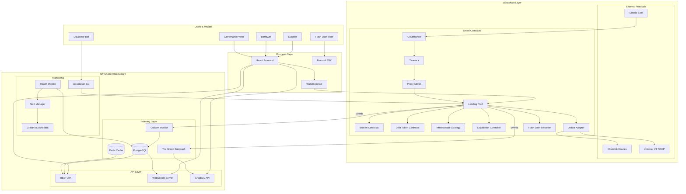
```mermaid
flowchart TB
    subgraph Users["Users & Wallets"]
        S[Supplier]
        B[Borrower]
        L[Liquidator Bot]
        G[Governance Voter]
        FL[Flash Loan User]
    end

    subgraph Frontend["Frontend Layer"]
        UI[React Frontend]
        SDK[Protocol SDK]
        WC[WalletConnect]
    end

    subgraph Blockchain["Blockchain Layer"]
        subgraph Contracts["Smart Contracts"]
            LP[Lending Pool]
            AT[aToken Contracts]
            DT[Debt Token Contracts]
            IR[Interest Rate Strategy]
            LC[Liquidation Controller]
            OA[Oracle Adapter]
            FL_C[Flash Loan Receiver]
            GV[Governance]
            TL[Timelock]
            PX[Proxy Admin]
        end

        subgraph External["External Protocols"]
            CL[Chainlink Oracles]
            UNI[Uniswap V3 TWAP]
            GS[Gnosis Safe]
        end
    end

    subgraph OffChain["Off-Chain Infrastructure"]
        subgraph Indexing["Indexing Layer"]
            TG[The Graph Subgraph]
            CI[Custom Indexer]
            PG[(PostgreSQL)]
            RD[(Redis Cache)]
        end

        subgraph Monitoring["Monitoring"]
            HM[Health Monitor]
            LB[Liquidation Bot]
            AM[Alert Manager]
            GF[Grafana Dashboard]
        end

        subgraph API["API Layer"]
            REST[REST API]
            WS[WebSocket Server]
            GQL[GraphQL API]
        end
    end

    S --> UI
    B --> UI
    G --> UI
    FL --> SDK
    L --> LB

    UI --> WC --> LP
    UI --> REST
    UI --> WS
    UI --> GQL

    LP --> AT
    LP --> DT
    LP --> IR
    LP --> OA
    LP --> LC
    LP --> FL_C

    GV --> TL --> PX --> LP
    GS --> GV

    OA --> CL
    OA --> UNI

    LP -->|Events| TG
    LP -->|Events| CI
    TG --> GQL
    CI --> PG
    PG --> REST
    PG --> WS
    RD --> REST

    HM --> PG
    LB --> LP
    HM --> AM --> GF
```

### Data Flow Overview

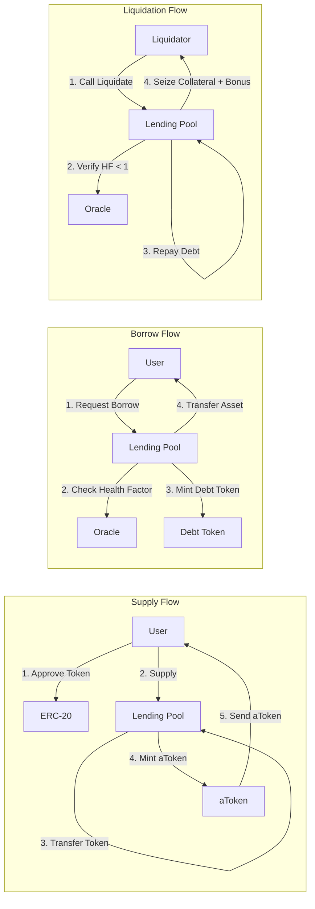
```mermaid
flowchart LR
    subgraph Supply["Supply Flow"]
        U1[User] -->|1. Approve Token| ERC[ERC-20]
        U1 -->|2. Supply| LP1[Lending Pool]
        LP1 -->|3. Transfer Token| LP1
        LP1 -->|4. Mint aToken| AT1[aToken]
        AT1 -->|5. Send aToken| U1
    end

    subgraph Borrow["Borrow Flow"]
        U2[User] -->|1. Request Borrow| LP2[Lending Pool]
        LP2 -->|2. Check Health Factor| ORC[Oracle]
        LP2 -->|3. Mint Debt Token| DT1[Debt Token]
        LP2 -->|4. Transfer Asset| U2
    end

    subgraph Liquidation["Liquidation Flow"]
        LIQ[Liquidator] -->|1. Call Liquidate| LP3[Lending Pool]
        LP3 -->|2. Verify HF < 1| ORC2[Oracle]
        LP3 -->|3. Repay Debt| LP3
        LP3 -->|4. Seize Collateral + Bonus| LIQ
    end
```

---

## Low-Level Design

### 9.1 Lending Pool Smart Contracts

#### 9.1.1 Architecture Overview

The lending pool is the core contract that orchestrates all protocol interactions. It follows a modular design with separate contracts for each concern:

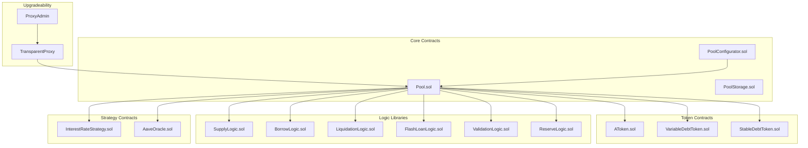
```mermaid
flowchart TB
    subgraph Core["Core Contracts"]
        Pool[Pool.sol]
        PoolConfig[PoolConfigurator.sol]
        PoolStorage[PoolStorage.sol]
    end

    subgraph Tokens["Token Contracts"]
        AToken[AToken.sol]
        VDebt[VariableDebtToken.sol]
        SDebt[StableDebtToken.sol]
    end

    subgraph Logic["Logic Libraries"]
        SL[SupplyLogic.sol]
        BL[BorrowLogic.sol]
        LL[LiquidationLogic.sol]
        FLL[FlashLoanLogic.sol]
        VL[ValidationLogic.sol]
        RL[ReserveLogic.sol]
    end

    subgraph Strategy["Strategy Contracts"]
        IRS[InterestRateStrategy.sol]
        Oracle[AaveOracle.sol]
    end

    subgraph Proxy["Upgradeability"]
        TP[TransparentProxy]
        PA[ProxyAdmin]
    end

    Pool --> SL
    Pool --> BL
    Pool --> LL
    Pool --> FLL
    Pool --> VL
    Pool --> RL

    Pool --> AToken
    Pool --> VDebt
    Pool --> SDebt
    Pool --> IRS
    Pool --> Oracle

    TP --> Pool
    PA --> TP
    PoolConfig --> Pool
```

#### 9.1.2 Interest Rate Model

The interest rate model uses a kinked curve that increases sharply after optimal utilization to incentivize liquidity:

```
Utilization Rate (U) = Total Borrows / Total Liquidity

If U <= Uoptimal:
  Borrow Rate = BaseRate + (U / Uoptimal) * Slope1

If U > Uoptimal:
  Borrow Rate = BaseRate + Slope1 + ((U - Uoptimal) / (1 - Uoptimal)) * Slope2

Supply Rate = Borrow Rate * U * (1 - Reserve Factor)
```

**Solidity Implementation:**

```solidity
// SPDX-License-Identifier: MIT
pragma solidity ^0.8.20;

import {WadRayMath} from './libraries/math/WadRayMath.sol';
import {IInterestRateStrategy} from './interfaces/IInterestRateStrategy.sol';

contract DefaultInterestRateStrategy is IInterestRateStrategy {
    using WadRayMath for uint256;

    uint256 public immutable OPTIMAL_UTILIZATION_RATE;
    uint256 public immutable MAX_EXCESS_UTILIZATION_RATE;
    uint256 public immutable BASE_VARIABLE_BORROW_RATE;
    uint256 public immutable VARIABLE_RATE_SLOPE_1;
    uint256 public immutable VARIABLE_RATE_SLOPE_2;
    uint256 public immutable STABLE_RATE_SLOPE_1;
    uint256 public immutable STABLE_RATE_SLOPE_2;
    uint256 public immutable BASE_STABLE_RATE_OFFSET;

    constructor(
        uint256 optimalUtilization,
        uint256 baseVariableBorrowRate,
        uint256 variableRateSlope1,
        uint256 variableRateSlope2,
        uint256 stableRateSlope1,
        uint256 stableRateSlope2,
        uint256 baseStableRateOffset
    ) {
        OPTIMAL_UTILIZATION_RATE = optimalUtilization;
        MAX_EXCESS_UTILIZATION_RATE = WadRayMath.RAY - optimalUtilization;
        BASE_VARIABLE_BORROW_RATE = baseVariableBorrowRate;
        VARIABLE_RATE_SLOPE_1 = variableRateSlope1;
        VARIABLE_RATE_SLOPE_2 = variableRateSlope2;
        STABLE_RATE_SLOPE_1 = stableRateSlope1;
        STABLE_RATE_SLOPE_2 = stableRateSlope2;
        BASE_STABLE_RATE_OFFSET = baseStableRateOffset;
    }

    function calculateInterestRates(
        uint256 totalStableDebt,
        uint256 totalVariableDebt,
        uint256 averageStableBorrowRate,
        uint256 reserveFactor,
        uint256 availableLiquidity,
        uint256 totalDebt
    ) external view override returns (
        uint256 liquidityRate,
        uint256 stableBorrowRate,
        uint256 variableBorrowRate
    ) {
        uint256 utilizationRate = totalDebt == 0
            ? 0
            : totalDebt.rayDiv(availableLiquidity + totalDebt);

        if (utilizationRate <= OPTIMAL_UTILIZATION_RATE) {
            variableBorrowRate = BASE_VARIABLE_BORROW_RATE +
                utilizationRate.rayMul(VARIABLE_RATE_SLOPE_1).rayDiv(
                    OPTIMAL_UTILIZATION_RATE
                );

            stableBorrowRate = BASE_STABLE_RATE_OFFSET +
                STABLE_RATE_SLOPE_1.rayMul(utilizationRate).rayDiv(
                    OPTIMAL_UTILIZATION_RATE
                );
        } else {
            uint256 excessUtilization = utilizationRate - OPTIMAL_UTILIZATION_RATE;

            variableBorrowRate = BASE_VARIABLE_BORROW_RATE +
                VARIABLE_RATE_SLOPE_1 +
                excessUtilization.rayMul(VARIABLE_RATE_SLOPE_2).rayDiv(
                    MAX_EXCESS_UTILIZATION_RATE
                );

            stableBorrowRate = BASE_STABLE_RATE_OFFSET +
                STABLE_RATE_SLOPE_1 +
                STABLE_RATE_SLOPE_2.rayMul(excessUtilization).rayDiv(
                    MAX_EXCESS_UTILIZATION_RATE
                );
        }

        // Supply rate = weighted average of borrow rates * utilization * (1 - reserveFactor)
        uint256 overallBorrowRate = totalDebt == 0
            ? 0
            : (totalVariableDebt.rayMul(variableBorrowRate) +
               totalStableDebt.rayMul(averageStableBorrowRate)).rayDiv(totalDebt);

        liquidityRate = overallBorrowRate
            .rayMul(utilizationRate)
            .rayMul(WadRayMath.RAY - reserveFactor);
    }
}
```

#### 9.1.3 aToken Design

aTokens are interest-bearing tokens that represent a user's supply position. Their balance increases continuously as interest accrues.

```solidity
// SPDX-License-Identifier: MIT
pragma solidity ^0.8.20;

import {ERC20} from '@openzeppelin/contracts/token/ERC20/ERC20.sol';
import {WadRayMath} from './libraries/math/WadRayMath.sol';
import {IPool} from './interfaces/IPool.sol';

contract AToken is ERC20 {
    using WadRayMath for uint256;

    IPool public immutable POOL;
    address public immutable UNDERLYING_ASSET;

    // Stores scaled balance (actual balance / liquidity index)
    mapping(address => uint256) private _scaledBalances;
    uint256 private _scaledTotalSupply;

    constructor(
        IPool pool,
        address underlyingAsset,
        string memory name,
        string memory symbol
    ) ERC20(name, symbol) {
        POOL = pool;
        UNDERLYING_ASSET = underlyingAsset;
    }

    /// @notice Returns the scaled balance (does not include pending interest)
    function scaledBalanceOf(address user) external view returns (uint256) {
        return _scaledBalances[user];
    }

    /// @notice Returns the actual balance including accrued interest
    function balanceOf(address user) public view override returns (uint256) {
        uint256 scaledBalance = _scaledBalances[user];
        if (scaledBalance == 0) return 0;

        return scaledBalance.rayMul(POOL.getReserveNormalizedIncome(UNDERLYING_ASSET));
    }

    /// @notice Returns total supply including accrued interest
    function totalSupply() public view override returns (uint256) {
        uint256 currentSupply = _scaledTotalSupply;
        if (currentSupply == 0) return 0;

        return currentSupply.rayMul(POOL.getReserveNormalizedIncome(UNDERLYING_ASSET));
    }

    /// @notice Mints aTokens on supply
    function mint(
        address caller,
        address onBehalfOf,
        uint256 amount,
        uint256 index
    ) external onlyPool returns (bool) {
        uint256 scaledAmount = amount.rayDiv(index);
        require(scaledAmount > 0, 'INVALID_MINT_AMOUNT');

        _scaledBalances[onBehalfOf] += scaledAmount;
        _scaledTotalSupply += scaledAmount;

        emit Transfer(address(0), onBehalfOf, amount);
        return _scaledBalances[onBehalfOf] == scaledAmount; // true if first supply
    }

    /// @notice Burns aTokens on withdrawal
    function burn(
        address from,
        address receiverOfUnderlying,
        uint256 amount,
        uint256 index
    ) external onlyPool {
        uint256 scaledAmount = amount.rayDiv(index);
        require(scaledAmount > 0, 'INVALID_BURN_AMOUNT');

        _scaledBalances[from] -= scaledAmount;
        _scaledTotalSupply -= scaledAmount;

        // Transfer underlying asset to user
        IERC20(UNDERLYING_ASSET).safeTransfer(receiverOfUnderlying, amount);

        emit Transfer(from, address(0), amount);
    }

    modifier onlyPool() {
        require(msg.sender == address(POOL), 'CALLER_NOT_POOL');
        _;
    }
}
```

#### 9.1.4 Flash Loan Implementation

Flash loans are the signature innovation of DeFi lending. They allow borrowing any amount without collateral, provided the loan is repaid within the same transaction.

```solidity
// SPDX-License-Identifier: MIT
pragma solidity ^0.8.20;

import {IFlashLoanReceiver} from './interfaces/IFlashLoanReceiver.sol';
import {IERC20} from '@openzeppelin/contracts/token/ERC20/IERC20.sol';

library FlashLoanLogic {
    uint256 public constant FLASH_LOAN_PREMIUM_TOTAL = 5; // 0.05% = 5 bps
    uint256 public constant FLASH_LOAN_PREMIUM_TO_PROTOCOL = 1; // 0.01% to protocol

    struct FlashLoanParams {
        address receiverAddress;
        address[] assets;
        uint256[] amounts;
        uint256[] interestRateModes; // 0 = no debt, 1 = stable, 2 = variable
        address onBehalfOf;
        bytes params;
        uint16 referralCode;
    }

    function executeFlashLoan(
        mapping(address => DataTypes.ReserveData) storage reserves,
        FlashLoanParams calldata flashParams
    ) external {
        uint256 assetsCount = flashParams.assets.length;
        uint256[] memory premiums = new uint256[](assetsCount);

        // Calculate premiums and transfer assets to receiver
        for (uint256 i = 0; i < assetsCount; i++) {
            premiums[i] = (flashParams.amounts[i] * FLASH_LOAN_PREMIUM_TOTAL) / 10000;

            // Transfer borrowed amount to receiver
            IERC20(flashParams.assets[i]).safeTransfer(
                flashParams.receiverAddress,
                flashParams.amounts[i]
            );
        }

        // Execute receiver callback
        require(
            IFlashLoanReceiver(flashParams.receiverAddress).executeOperation(
                flashParams.assets,
                flashParams.amounts,
                premiums,
                msg.sender,
                flashParams.params
            ),
            'FLASH_LOAN_CALLBACK_FAILED'
        );

        // Verify repayment or open debt position
        for (uint256 i = 0; i < assetsCount; i++) {
            if (flashParams.interestRateModes[i] == 0) {
                // No debt mode: full repayment required
                uint256 amountPlusPremium = flashParams.amounts[i] + premiums[i];

                IERC20(flashParams.assets[i]).safeTransferFrom(
                    flashParams.receiverAddress,
                    address(this),
                    amountPlusPremium
                );

                // Distribute premium
                uint256 protocolPremium = (flashParams.amounts[i] *
                    FLASH_LOAN_PREMIUM_TO_PROTOCOL) / 10000;

                _updateReserveWithPremium(
                    reserves[flashParams.assets[i]],
                    premiums[i] - protocolPremium,
                    protocolPremium
                );
            } else {
                // Open debt position with borrowed amount
                _openDebtPosition(
                    reserves[flashParams.assets[i]],
                    flashParams.onBehalfOf,
                    flashParams.amounts[i],
                    flashParams.interestRateModes[i]
                );
            }
        }
    }
}
```

#### 9.1.5 EIP-4626 Vault Compliance

EIP-4626 standardizes tokenized vaults, enabling composability with other protocols:

```solidity
// SPDX-License-Identifier: MIT
pragma solidity ^0.8.20;

import {ERC4626} from '@openzeppelin/contracts/token/ERC20/extensions/ERC4626.sol';
import {IPool} from './interfaces/IPool.sol';

contract ATokenVault is ERC4626 {
    IPool public immutable pool;
    address public immutable aToken;

    constructor(
        IERC20 asset_,
        IPool pool_,
        address aToken_,
        string memory name_,
        string memory symbol_
    ) ERC4626(asset_) ERC20(name_, symbol_) {
        pool = pool_;
        aToken = aToken_;
    }

    function totalAssets() public view override returns (uint256) {
        return IERC20(aToken).balanceOf(address(this));
    }

    function _deposit(
        address caller,
        address receiver,
        uint256 assets,
        uint256 shares
    ) internal override {
        IERC20(asset()).safeTransferFrom(caller, address(this), assets);
        IERC20(asset()).approve(address(pool), assets);
        pool.supply(asset(), assets, address(this), 0);
        _mint(receiver, shares);
    }

    function _withdraw(
        address caller,
        address receiver,
        address owner,
        uint256 assets,
        uint256 shares
    ) internal override {
        if (caller != owner) {
            _spendAllowance(owner, caller, shares);
        }
        _burn(owner, shares);
        pool.withdraw(asset(), assets, receiver);
    }
}
```

#### 9.1.6 Supply and Borrow Caps

```solidity
library ValidationLogic {
    function validateSupply(
        DataTypes.ReserveData storage reserve,
        DataTypes.ReserveConfigurationMap memory config,
        uint256 amount
    ) internal view {
        require(config.getActive(), 'RESERVE_INACTIVE');
        require(!config.getPaused(), 'RESERVE_PAUSED');
        require(!config.getFrozen(), 'RESERVE_FROZEN');

        uint256 supplyCap = config.getSupplyCap();
        if (supplyCap != 0) {
            uint256 currentSupply = IAToken(reserve.aTokenAddress).scaledTotalSupply()
                .rayMul(reserve.liquidityIndex);
            require(
                currentSupply + amount <= supplyCap * (10 ** config.getDecimals()),
                'SUPPLY_CAP_EXCEEDED'
            );
        }
    }

    function validateBorrow(
        DataTypes.ReserveData storage reserve,
        DataTypes.UserConfigurationMap storage userConfig,
        DataTypes.ReserveConfigurationMap memory config,
        address user,
        uint256 amount,
        address oracle
    ) internal view {
        require(config.getActive(), 'RESERVE_INACTIVE');
        require(!config.getPaused(), 'RESERVE_PAUSED');
        require(config.getBorrowingEnabled(), 'BORROWING_NOT_ENABLED');

        uint256 borrowCap = config.getBorrowCap();
        if (borrowCap != 0) {
            uint256 currentDebt = IERC20(reserve.variableDebtTokenAddress)
                .totalSupply() +
                IERC20(reserve.stableDebtTokenAddress).totalSupply();
            require(
                currentDebt + amount <= borrowCap * (10 ** config.getDecimals()),
                'BORROW_CAP_EXCEEDED'
            );
        }

        // Validate health factor after borrow
        (,,,,uint256 healthFactor) = _calculateUserAccountData(
            user, userConfig, oracle
        );
        require(healthFactor >= HEALTH_FACTOR_THRESHOLD, 'HEALTH_FACTOR_TOO_LOW');
    }
}
```

---

### 9.2 Liquidation Engine

#### 9.2.1 Health Factor Calculation

The health factor (HF) determines whether a position is eligible for liquidation:

```
Health Factor = Sum(Collateral_i * Price_i * LiquidationThreshold_i) / TotalDebtInBaseCurrency

If HF < 1.0: Position is liquidatable
```

```solidity
library GenericLogic {
    using WadRayMath for uint256;
    using PercentageMath for uint256;

    struct CalculateUserAccountDataParams {
        address user;
        address oracle;
        uint256 reservesCount;
    }

    function calculateUserAccountData(
        mapping(address => DataTypes.ReserveData) storage reserves,
        mapping(uint256 => address) storage reservesList,
        DataTypes.UserConfigurationMap storage userConfig,
        CalculateUserAccountDataParams memory params
    ) internal view returns (
        uint256 totalCollateralInBaseCurrency,
        uint256 totalDebtInBaseCurrency,
        uint256 availableBorrowsInBaseCurrency,
        uint256 currentLtv,
        uint256 currentLiquidationThreshold,
        uint256 healthFactor
    ) {
        for (uint256 i = 0; i < params.reservesCount; i++) {
            if (!userConfig.isUsingAsReserveOrBorrowing(i)) continue;

            address currentReserveAddress = reservesList[i];
            DataTypes.ReserveData storage currentReserve = reserves[currentReserveAddress];

            uint256 assetPrice = IPriceOracle(params.oracle).getAssetPrice(
                currentReserveAddress
            );
            uint256 decimals = currentReserve.configuration.getDecimals();
            uint256 assetUnit = 10 ** decimals;

            if (userConfig.isUsingAsCollateral(i)) {
                uint256 balance = IAToken(currentReserve.aTokenAddress)
                    .balanceOf(params.user);

                uint256 collateralInBaseCurrency = (balance * assetPrice) / assetUnit;
                totalCollateralInBaseCurrency += collateralInBaseCurrency;

                uint256 ltv = currentReserve.configuration.getLtv();
                uint256 liquidationThreshold = currentReserve
                    .configuration
                    .getLiquidationThreshold();

                currentLtv += collateralInBaseCurrency * ltv;
                currentLiquidationThreshold +=
                    collateralInBaseCurrency * liquidationThreshold;
            }

            if (userConfig.isBorrowing(i)) {
                uint256 variableDebt = IERC20(currentReserve.variableDebtTokenAddress)
                    .balanceOf(params.user);
                uint256 stableDebt = IERC20(currentReserve.stableDebtTokenAddress)
                    .balanceOf(params.user);
                uint256 totalDebt = variableDebt + stableDebt;

                totalDebtInBaseCurrency += (totalDebt * assetPrice) / assetUnit;
            }
        }

        if (totalCollateralInBaseCurrency > 0) {
            currentLtv /= totalCollateralInBaseCurrency;
            currentLiquidationThreshold /= totalCollateralInBaseCurrency;
        }

        availableBorrowsInBaseCurrency = totalCollateralInBaseCurrency
            .percentMul(currentLtv) - totalDebtInBaseCurrency;

        healthFactor = totalDebtInBaseCurrency == 0
            ? type(uint256).max
            : (totalCollateralInBaseCurrency
                .percentMul(currentLiquidationThreshold))
                .wadDiv(totalDebtInBaseCurrency);
    }
}
```

#### 9.2.2 Liquidation Logic

```solidity
library LiquidationLogic {
    using WadRayMath for uint256;
    using PercentageMath for uint256;

    uint256 public constant CLOSE_FACTOR_HF_THRESHOLD = 0.95e18; // 0.95
    uint256 public constant DEFAULT_CLOSE_FACTOR = 5000; // 50%
    uint256 public constant MAX_CLOSE_FACTOR = 10000; // 100% if HF < 0.95

    struct LiquidationCallParams {
        address collateralAsset;
        address debtAsset;
        address user;
        uint256 debtToCover;
        bool receiveAToken;
    }

    function executeLiquidationCall(
        mapping(address => DataTypes.ReserveData) storage reserves,
        mapping(uint256 => address) storage reservesList,
        mapping(address => DataTypes.UserConfigurationMap) storage usersConfig,
        LiquidationCallParams calldata params
    ) external {
        DataTypes.ReserveData storage collateralReserve = reserves[params.collateralAsset];
        DataTypes.ReserveData storage debtReserve = reserves[params.debtAsset];

        // 1. Validate liquidation is possible
        (
            uint256 totalCollateralInBaseCurrency,
            uint256 totalDebtInBaseCurrency,
            ,
            ,
            ,
            uint256 healthFactor
        ) = GenericLogic.calculateUserAccountData(
            reserves,
            reservesList,
            usersConfig[params.user],
            GenericLogic.CalculateUserAccountDataParams({
                user: params.user,
                oracle: address(_oracle),
                reservesCount: _reservesCount
            })
        );

        require(healthFactor < HEALTH_FACTOR_LIQUIDATION_THRESHOLD, 'HF_NOT_BELOW_THRESHOLD');

        // 2. Calculate maximum liquidatable debt
        uint256 closeFactor = healthFactor < CLOSE_FACTOR_HF_THRESHOLD
            ? MAX_CLOSE_FACTOR
            : DEFAULT_CLOSE_FACTOR;

        uint256 userVariableDebt = IERC20(debtReserve.variableDebtTokenAddress)
            .balanceOf(params.user);
        uint256 userStableDebt = IERC20(debtReserve.stableDebtTokenAddress)
            .balanceOf(params.user);
        uint256 userTotalDebt = userVariableDebt + userStableDebt;

        uint256 maxLiquidatableDebt = userTotalDebt.percentMul(closeFactor);
        uint256 actualDebtToLiquidate = params.debtToCover > maxLiquidatableDebt
            ? maxLiquidatableDebt
            : params.debtToCover;

        // 3. Calculate collateral to seize (including liquidation bonus)
        uint256 liquidationBonus = collateralReserve
            .configuration
            .getLiquidationBonus();

        uint256 debtAssetPrice = IPriceOracle(_oracle).getAssetPrice(params.debtAsset);
        uint256 collateralAssetPrice = IPriceOracle(_oracle).getAssetPrice(
            params.collateralAsset
        );

        uint256 collateralToSeize = (actualDebtToLiquidate * debtAssetPrice *
            (10 ** collateralReserve.configuration.getDecimals())) /
            (collateralAssetPrice * (10 ** debtReserve.configuration.getDecimals()));

        collateralToSeize = collateralToSeize.percentMul(liquidationBonus);

        // 4. Check if user has enough collateral
        uint256 userCollateralBalance = IAToken(collateralReserve.aTokenAddress)
            .balanceOf(params.user);

        if (collateralToSeize > userCollateralBalance) {
            collateralToSeize = userCollateralBalance;
            actualDebtToLiquidate = (collateralToSeize * collateralAssetPrice *
                (10 ** debtReserve.configuration.getDecimals())) /
                (debtAssetPrice * (10 ** collateralReserve.configuration.getDecimals()) *
                liquidationBonus / 10000);
        }

        // 5. Execute liquidation
        _burnDebtTokens(debtReserve, params.user, actualDebtToLiquidate);

        if (params.receiveAToken) {
            // Transfer aTokens to liquidator
            IAToken(collateralReserve.aTokenAddress).transferOnLiquidation(
                params.user,
                msg.sender,
                collateralToSeize
            );
        } else {
            // Burn aTokens and send underlying to liquidator
            IAToken(collateralReserve.aTokenAddress).burn(
                params.user,
                msg.sender,
                collateralToSeize,
                collateralReserve.liquidityIndex
            );
        }

        // 6. Transfer debt asset from liquidator to protocol
        IERC20(params.debtAsset).safeTransferFrom(
            msg.sender,
            address(this),
            actualDebtToLiquidate
        );

        emit LiquidationCall(
            params.collateralAsset,
            params.debtAsset,
            params.user,
            actualDebtToLiquidate,
            collateralToSeize,
            msg.sender,
            params.receiveAToken
        );
    }
}
```

#### 9.2.3 MEV-Aware Liquidation Bot

```python
# Off-chain liquidation bot architecture
import asyncio
from web3 import Web3
from eth_abi import encode
from flashbots import Flashbots

class LiquidationBot:
    """
    MEV-aware liquidation bot that monitors positions and submits
    liquidation transactions through Flashbots to avoid frontrunning.
    """

    def __init__(self, config):
        self.w3 = Web3(Web3.HTTPProvider(config.rpc_url))
        self.pool_contract = self.w3.eth.contract(
            address=config.pool_address,
            abi=config.pool_abi
        )
        self.oracle = self.w3.eth.contract(
            address=config.oracle_address,
            abi=config.oracle_abi
        )
        self.flashbots = Flashbots(self.w3, config.flashbots_key)
        self.min_profit_threshold = config.min_profit_eth
        self.gas_price_multiplier = 1.1

    async def monitor_positions(self):
        """
        Continuously monitor all borrowing positions for liquidation opportunities.
        Uses event-driven approach for efficiency.
        """
        # Get all active borrowers from indexed data
        borrowers = await self.get_active_borrowers()

        tasks = []
        for borrower in borrowers:
            tasks.append(self.check_position(borrower))

        results = await asyncio.gather(*tasks)

        liquidatable = [r for r in results if r is not None]
        return sorted(liquidatable, key=lambda x: x['profit'], reverse=True)

    async def check_position(self, borrower_address):
        """Calculate health factor and potential profit for a position."""
        try:
            account_data = self.pool_contract.functions.getUserAccountData(
                borrower_address
            ).call()

            health_factor = account_data[5] / 1e18

            if health_factor >= 1.0:
                return None

            # Calculate liquidation profit
            profit = self.calculate_profit(
                borrower_address,
                account_data
            )

            if profit < self.min_profit_threshold:
                return None

            return {
                'borrower': borrower_address,
                'health_factor': health_factor,
                'profit': profit,
                'collateral_value': account_data[0] / 1e8,
                'debt_value': account_data[1] / 1e8,
            }
        except Exception as e:
            logger.error(f"Error checking {borrower_address}: {e}")
            return None

    def calculate_profit(self, borrower, account_data):
        """
        Calculate expected profit from liquidation, accounting for:
        - Liquidation bonus
        - Gas costs
        - Slippage on collateral sale
        - Flash loan fees (if using flash loan)
        """
        total_debt_base = account_data[1]
        health_factor = account_data[5] / 1e18

        # Determine close factor
        close_factor = 1.0 if health_factor < 0.95 else 0.5

        # Maximum liquidatable debt
        max_debt = total_debt_base * close_factor

        # Liquidation bonus (typically 5-10%)
        liquidation_bonus = 0.05  # Simplified; varies by asset

        # Gross profit = liquidation bonus on seized collateral
        gross_profit = max_debt * liquidation_bonus

        # Estimate gas cost
        gas_estimate = 400_000
        gas_price = self.w3.eth.gas_price
        gas_cost = gas_estimate * gas_price

        # Flash loan fee if needed
        flash_loan_fee = max_debt * 0.0005  # 0.05%

        # DEX swap slippage
        slippage = max_debt * 0.003  # 0.3% estimated

        net_profit = gross_profit - gas_cost - flash_loan_fee - slippage

        return net_profit

    async def execute_liquidation(self, opportunity):
        """
        Execute liquidation via Flashbots to avoid MEV extraction.
        Uses flash loan for capital efficiency.
        """
        # Build flash loan liquidation transaction
        tx = self.build_flash_liquidation_tx(opportunity)

        # Submit through Flashbots
        bundle = [
            {
                'signed_transaction': tx.rawTransaction,
                'can_revert': False,
            }
        ]

        # Target next block
        block_number = self.w3.eth.block_number + 1

        result = self.flashbots.send_bundle(
            bundle,
            target_block_number=block_number,
        )

        return result

    def build_flash_liquidation_tx(self, opportunity):
        """
        Build a transaction that:
        1. Takes flash loan of debt asset
        2. Liquidates the borrower position
        3. Receives collateral + bonus
        4. Swaps collateral to debt asset on DEX
        5. Repays flash loan + fee
        6. Keeps profit
        """
        # Encode flash loan params
        params = encode(
            ['address', 'address', 'address', 'uint256'],
            [
                opportunity['collateral_asset'],
                opportunity['debt_asset'],
                opportunity['borrower'],
                opportunity['debt_to_cover'],
            ]
        )

        tx = self.pool_contract.functions.flashLoan(
            self.flash_receiver_address,
            [opportunity['debt_asset']],
            [opportunity['debt_to_cover']],
            [0],  # no-debt mode
            self.bot_address,
            params,
            0  # referral code
        ).build_transaction({
            'from': self.bot_address,
            'gas': 500_000,
            'maxFeePerGas': self.w3.eth.gas_price * 2,
            'maxPriorityFeePerGas': Web3.to_wei(2, 'gwei'),
            'nonce': self.w3.eth.get_transaction_count(self.bot_address),
        })

        return self.w3.eth.account.sign_transaction(tx, self.private_key)
```

#### 9.2.4 Cascading Liquidation Prevention

```solidity
/// @notice Circuit breaker to prevent cascading liquidations
contract LiquidationCircuitBreaker {
    uint256 public constant MAX_LIQUIDATIONS_PER_BLOCK = 50;
    uint256 public constant COOLDOWN_BLOCKS = 5;
    uint256 public constant MAX_COLLATERAL_LIQUIDATED_PCT = 1000; // 10%

    mapping(uint256 => uint256) public liquidationsPerBlock;
    mapping(address => uint256) public totalCollateralLiquidated;
    mapping(address => uint256) public lastLiquidationBlock;

    function validateLiquidation(
        address collateralAsset,
        uint256 collateralAmount,
        uint256 totalCollateralSupply
    ) external view returns (bool) {
        // Check per-block limit
        if (liquidationsPerBlock[block.number] >= MAX_LIQUIDATIONS_PER_BLOCK) {
            return false;
        }

        // Check cooldown period for asset
        if (block.number - lastLiquidationBlock[collateralAsset] < COOLDOWN_BLOCKS) {
            // Allow if within threshold
            uint256 liquidatedPct = (totalCollateralLiquidated[collateralAsset] *
                10000) / totalCollateralSupply;
            if (liquidatedPct >= MAX_COLLATERAL_LIQUIDATED_PCT) {
                return false;
            }
        }

        return true;
    }
}
```

---

### 9.3 Oracle System

#### 9.3.1 Oracle Architecture

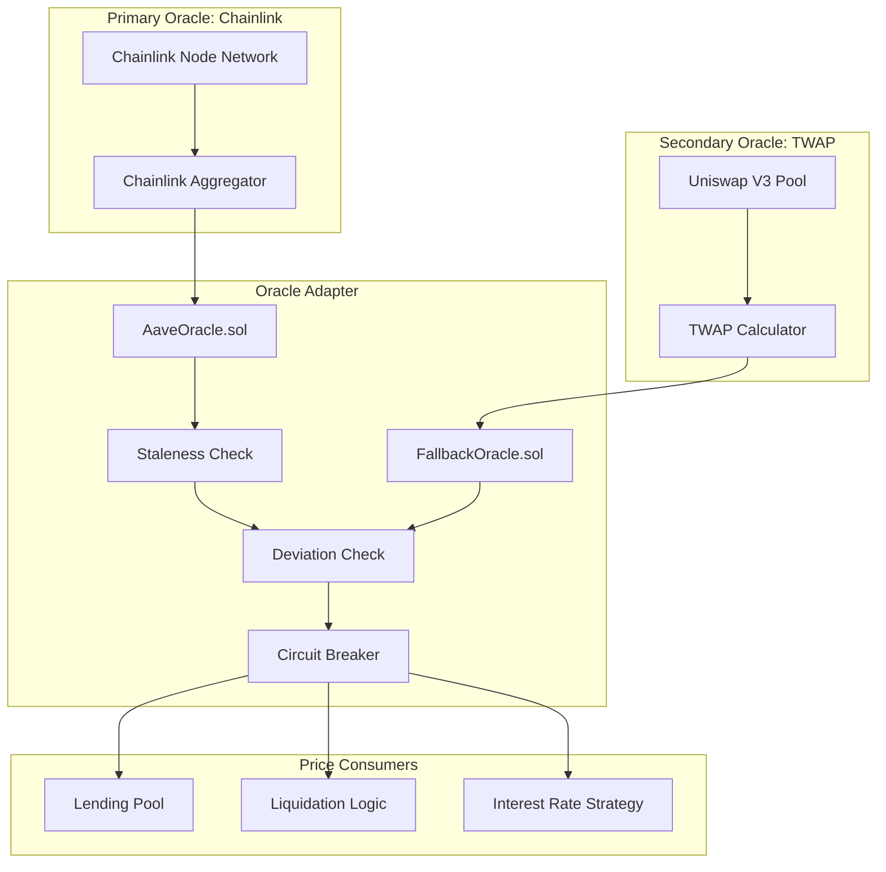
```mermaid
flowchart TB
    subgraph Primary["Primary Oracle: Chainlink"]
        CLA[Chainlink Aggregator]
        CLN[Chainlink Node Network]
        CLN --> CLA
    end

    subgraph Secondary["Secondary Oracle: TWAP"]
        UNI[Uniswap V3 Pool]
        TWAP[TWAP Calculator]
        UNI --> TWAP
    end

    subgraph Adapter["Oracle Adapter"]
        OA[AaveOracle.sol]
        FB[FallbackOracle.sol]
        SC[Staleness Check]
        DC[Deviation Check]
        CB[Circuit Breaker]
    end

    subgraph Consumers["Price Consumers"]
        LP[Lending Pool]
        LQ[Liquidation Logic]
        IR[Interest Rate Strategy]
    end

    CLA --> OA
    TWAP --> FB
    OA --> SC --> DC --> CB
    FB --> DC
    CB --> LP
    CB --> LQ
    CB --> IR
```

#### 9.3.2 Oracle Adapter Implementation

```solidity
// SPDX-License-Identifier: MIT
pragma solidity ^0.8.20;

import {AggregatorV3Interface} from '@chainlink/contracts/src/v0.8/interfaces/AggregatorV3Interface.sol';
import {Ownable} from '@openzeppelin/contracts/access/Ownable.sol';

contract AaveOracle is Ownable {
    /// @notice Primary price sources (Chainlink)
    mapping(address => AggregatorV3Interface) public primarySources;

    /// @notice Fallback price sources (TWAP or secondary Chainlink)
    mapping(address => IFallbackOracle) public fallbackSources;

    /// @notice Maximum staleness for price feeds
    mapping(address => uint256) public maxStaleness;

    /// @notice Maximum deviation between primary and fallback (in bps)
    uint256 public constant MAX_DEVIATION_BPS = 500; // 5%

    /// @notice Base currency unit (USD with 8 decimals)
    uint256 public constant BASE_CURRENCY_UNIT = 1e8;

    /// @notice L2 sequencer uptime feed
    AggregatorV3Interface public immutable sequencerUptimeFeed;

    /// @notice Grace period after sequencer restarts
    uint256 public constant GRACE_PERIOD_TIME = 3600; // 1 hour

    event PriceSourceUpdated(address indexed asset, address indexed source);
    event FallbackActivated(address indexed asset, uint256 primaryPrice, uint256 fallbackPrice);
    event CircuitBreakerTriggered(address indexed asset, uint256 price);

    constructor(
        address[] memory assets,
        address[] memory sources,
        address fallbackOracle,
        address sequencerFeed
    ) {
        for (uint256 i = 0; i < assets.length; i++) {
            primarySources[assets[i]] = AggregatorV3Interface(sources[i]);
            maxStaleness[assets[i]] = 3600; // 1 hour default
        }
        sequencerUptimeFeed = AggregatorV3Interface(sequencerFeed);
    }

    /// @notice Get the price of an asset in the base currency
    function getAssetPrice(address asset) public view returns (uint256) {
        // Check L2 sequencer status (for L2 deployments)
        if (address(sequencerUptimeFeed) != address(0)) {
            _checkSequencerUptime();
        }

        // Try primary source first
        (uint256 primaryPrice, bool primaryValid) = _getPrimaryPrice(asset);

        if (primaryValid) {
            // Cross-check with fallback if available
            if (address(fallbackSources[asset]) != address(0)) {
                uint256 fallbackPrice = fallbackSources[asset].getAssetPrice(asset);
                _validateDeviation(asset, primaryPrice, fallbackPrice);
            }
            return primaryPrice;
        }

        // Fallback to secondary source
        if (address(fallbackSources[asset]) != address(0)) {
            uint256 fallbackPrice = fallbackSources[asset].getAssetPrice(asset);
            require(fallbackPrice > 0, 'FALLBACK_PRICE_ZERO');
            emit FallbackActivated(asset, primaryPrice, fallbackPrice);
            return fallbackPrice;
        }

        revert('NO_VALID_PRICE_SOURCE');
    }

    function _getPrimaryPrice(address asset) internal view returns (
        uint256 price,
        bool valid
    ) {
        AggregatorV3Interface feed = primarySources[asset];
        if (address(feed) == address(0)) return (0, false);

        try feed.latestRoundData() returns (
            uint80 roundId,
            int256 answer,
            uint256 /* startedAt */,
            uint256 updatedAt,
            uint80 /* answeredInRound */
        ) {
            // Staleness check
            if (block.timestamp - updatedAt > maxStaleness[asset]) {
                return (0, false);
            }

            // Sanity check
            if (answer <= 0) return (0, false);

            // Round completeness
            if (roundId == 0) return (0, false);

            return (uint256(answer), true);
        } catch {
            return (0, false);
        }
    }

    function _validateDeviation(
        address asset,
        uint256 primaryPrice,
        uint256 fallbackPrice
    ) internal view {
        if (fallbackPrice == 0) return;

        uint256 deviation;
        if (primaryPrice > fallbackPrice) {
            deviation = ((primaryPrice - fallbackPrice) * 10000) / fallbackPrice;
        } else {
            deviation = ((fallbackPrice - primaryPrice) * 10000) / primaryPrice;
        }

        if (deviation > MAX_DEVIATION_BPS) {
            // Log but do not revert; use primary as canonical
            // In production, this would trigger an alert
        }
    }

    function _checkSequencerUptime() internal view {
        (, int256 answer, uint256 startedAt,,) = sequencerUptimeFeed.latestRoundData();

        // answer == 0: sequencer is up
        // answer == 1: sequencer is down
        bool isSequencerUp = answer == 0;
        require(isSequencerUp, 'SEQUENCER_DOWN');

        // Enforce grace period after restart
        uint256 timeSinceUp = block.timestamp - startedAt;
        require(timeSinceUp > GRACE_PERIOD_TIME, 'GRACE_PERIOD_NOT_OVER');
    }

    /// @notice Get prices for multiple assets in a single call
    function getAssetsPrices(address[] calldata assets) external view returns (
        uint256[] memory prices
    ) {
        prices = new uint256[](assets.length);
        for (uint256 i = 0; i < assets.length; i++) {
            prices[i] = getAssetPrice(assets[i]);
        }
    }
}
```

#### 9.3.3 TWAP Oracle

```solidity
// SPDX-License-Identifier: MIT
pragma solidity ^0.8.20;

import {IUniswapV3Pool} from '@uniswap/v3-core/contracts/interfaces/IUniswapV3Pool.sol';
import {OracleLibrary} from '@uniswap/v3-periphery/contracts/libraries/OracleLibrary.sol';

contract UniswapTWAPOracle {
    /// @notice TWAP observation window (30 minutes)
    uint32 public constant TWAP_PERIOD = 1800;

    /// @notice Minimum liquidity required for pool to be considered valid
    uint128 public constant MIN_LIQUIDITY = 1e18;

    /// @notice Mapping of asset to Uniswap V3 pool
    mapping(address => address) public pools;

    /// @notice Get TWAP price for an asset
    function getAssetPrice(address asset) external view returns (uint256) {
        address pool = pools[asset];
        require(pool != address(0), 'POOL_NOT_SET');

        // Check minimum liquidity
        uint128 liquidity = IUniswapV3Pool(pool).liquidity();
        require(liquidity >= MIN_LIQUIDITY, 'INSUFFICIENT_LIQUIDITY');

        // Get TWAP tick
        (int24 arithmeticMeanTick,) = OracleLibrary.consult(pool, TWAP_PERIOD);

        // Convert tick to price
        uint256 price = OracleLibrary.getQuoteAtTick(
            arithmeticMeanTick,
            uint128(10 ** IERC20Metadata(asset).decimals()),
            asset,
            WETH // or base currency
        );

        return price;
    }
}
```

#### 9.3.4 Oracle Manipulation Protection

Key protection strategies:

1. **TWAP over spot prices**: Using time-weighted average prices from DEXs prevents single-block manipulation
2. **Multi-source aggregation**: Cross-referencing Chainlink and TWAP prices
3. **Deviation thresholds**: Rejecting prices that move more than X% between updates
4. **Staleness checks**: Not using prices older than the heartbeat
5. **Sequencer uptime**: For L2s, ensuring the sequencer is operational
6. **Circuit breakers**: Pausing protocol on extreme price movements

```solidity
contract OracleGuard {
    /// @notice Maximum allowed price change between consecutive readings
    mapping(address => uint256) public maxPriceChangePercentage;

    /// @notice Last recorded price for each asset
    mapping(address => uint256) public lastRecordedPrice;

    /// @notice Timestamp of last price recording
    mapping(address => uint256) public lastPriceTimestamp;

    /// @notice Minimum time between price updates to compute change rate
    uint256 public constant MIN_UPDATE_INTERVAL = 60; // 1 minute

    function validatePriceChange(
        address asset,
        uint256 newPrice
    ) external returns (bool) {
        uint256 lastPrice = lastRecordedPrice[asset];

        if (lastPrice == 0) {
            lastRecordedPrice[asset] = newPrice;
            lastPriceTimestamp[asset] = block.timestamp;
            return true;
        }

        uint256 timeDelta = block.timestamp - lastPriceTimestamp[asset];
        if (timeDelta < MIN_UPDATE_INTERVAL) return true; // Too soon to validate

        uint256 priceChange;
        if (newPrice > lastPrice) {
            priceChange = ((newPrice - lastPrice) * 10000) / lastPrice;
        } else {
            priceChange = ((lastPrice - newPrice) * 10000) / lastPrice;
        }

        uint256 maxChange = maxPriceChangePercentage[asset];
        if (maxChange == 0) maxChange = 2000; // 20% default

        // Scale threshold by time (allow larger changes over longer periods)
        uint256 scaledMaxChange = maxChange * timeDelta / 3600; // per hour
        if (scaledMaxChange > maxChange * 3) {
            scaledMaxChange = maxChange * 3; // Cap at 3x
        }

        if (priceChange > scaledMaxChange) {
            emit PriceAnomalyDetected(asset, lastPrice, newPrice, priceChange);
            return false;
        }

        lastRecordedPrice[asset] = newPrice;
        lastPriceTimestamp[asset] = block.timestamp;
        return true;
    }
}
```

---

### 9.4 Governance & Protocol Upgrades

#### 9.4.1 Governance Architecture

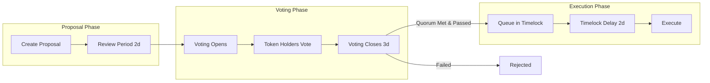
```mermaid
flowchart LR
    subgraph Proposal["Proposal Phase"]
        P1[Create Proposal]
        P2[Review Period 2d]
    end

    subgraph Voting["Voting Phase"]
        V1[Voting Opens]
        V2[Token Holders Vote]
        V3[Voting Closes 3d]
    end

    subgraph Execution["Execution Phase"]
        E1[Queue in Timelock]
        E2[Timelock Delay 2d]
        E3[Execute]
    end

    P1 --> P2 --> V1 --> V2 --> V3
    V3 -->|Quorum Met & Passed| E1
    V3 -->|Failed| F[Rejected]
    E1 --> E2 --> E3
```

#### 9.4.2 Governance Contract

```solidity
// SPDX-License-Identifier: MIT
pragma solidity ^0.8.20;

import {IGovernor} from '@openzeppelin/contracts/governance/IGovernor.sol';

contract LendingGovernor {
    struct Proposal {
        uint256 id;
        address proposer;
        address[] targets;
        uint256[] values;
        bytes[] calldatas;
        string description;
        uint256 startBlock;
        uint256 endBlock;
        uint256 forVotes;
        uint256 againstVotes;
        uint256 abstainVotes;
        bool canceled;
        bool executed;
        mapping(address => Receipt) receipts;
    }

    struct Receipt {
        bool hasVoted;
        uint8 support; // 0=Against, 1=For, 2=Abstain
        uint256 votes;
    }

    enum ProposalState {
        Pending,
        Active,
        Canceled,
        Defeated,
        Succeeded,
        Queued,
        Expired,
        Executed
    }

    /// @notice Token used for voting
    IVotingToken public immutable token;

    /// @notice Timelock controller
    ITimelockController public immutable timelock;

    /// @notice Minimum tokens required to create proposal (1% of supply)
    uint256 public proposalThreshold;

    /// @notice Quorum required for vote to pass (4% of supply)
    uint256 public quorumVotes;

    /// @notice Voting delay after proposal creation (2 days in blocks)
    uint256 public votingDelay = 14400;

    /// @notice Voting period (3 days in blocks)
    uint256 public votingPeriod = 21600;

    /// @notice Timelock delay (2 days)
    uint256 public timelockDelay = 172800;

    mapping(uint256 => Proposal) public proposals;
    uint256 public proposalCount;

    /// @notice Delegation mapping
    mapping(address => address) public delegates;
    mapping(address => uint256) public delegatedVotes;

    function propose(
        address[] memory targets,
        uint256[] memory values,
        bytes[] memory calldatas,
        string memory description
    ) external returns (uint256) {
        require(
            token.getPriorVotes(msg.sender, block.number - 1) >= proposalThreshold,
            'BELOW_PROPOSAL_THRESHOLD'
        );

        uint256 proposalId = hashProposal(targets, values, calldatas, keccak256(bytes(description)));

        Proposal storage proposal = proposals[proposalId];
        require(proposal.id == 0, 'PROPOSAL_EXISTS');

        proposal.id = proposalId;
        proposal.proposer = msg.sender;
        proposal.targets = targets;
        proposal.values = values;
        proposal.calldatas = calldatas;
        proposal.description = description;
        proposal.startBlock = block.number + votingDelay;
        proposal.endBlock = block.number + votingDelay + votingPeriod;

        emit ProposalCreated(
            proposalId,
            msg.sender,
            targets,
            values,
            calldatas,
            description,
            proposal.startBlock,
            proposal.endBlock
        );

        return proposalId;
    }

    function castVote(uint256 proposalId, uint8 support) external {
        Proposal storage proposal = proposals[proposalId];
        require(state(proposalId) == ProposalState.Active, 'VOTING_NOT_ACTIVE');

        Receipt storage receipt = proposal.receipts[msg.sender];
        require(!receipt.hasVoted, 'ALREADY_VOTED');

        uint256 votes = token.getPriorVotes(msg.sender, proposal.startBlock);

        if (support == 0) {
            proposal.againstVotes += votes;
        } else if (support == 1) {
            proposal.forVotes += votes;
        } else if (support == 2) {
            proposal.abstainVotes += votes;
        }

        receipt.hasVoted = true;
        receipt.support = support;
        receipt.votes = votes;

        emit VoteCast(msg.sender, proposalId, support, votes);
    }

    function queue(uint256 proposalId) external {
        require(state(proposalId) == ProposalState.Succeeded, 'NOT_SUCCEEDED');

        Proposal storage proposal = proposals[proposalId];

        uint256 eta = block.timestamp + timelockDelay;

        for (uint256 i = 0; i < proposal.targets.length; i++) {
            timelock.queueTransaction(
                proposal.targets[i],
                proposal.values[i],
                proposal.calldatas[i],
                eta
            );
        }

        emit ProposalQueued(proposalId, eta);
    }

    function execute(uint256 proposalId) external payable {
        require(state(proposalId) == ProposalState.Queued, 'NOT_QUEUED');

        Proposal storage proposal = proposals[proposalId];
        proposal.executed = true;

        for (uint256 i = 0; i < proposal.targets.length; i++) {
            timelock.executeTransaction(
                proposal.targets[i],
                proposal.values[i],
                proposal.calldatas[i]
            );
        }

        emit ProposalExecuted(proposalId);
    }

    function delegate(address delegatee) external {
        address currentDelegate = delegates[msg.sender];
        uint256 balance = token.balanceOf(msg.sender);

        if (currentDelegate != address(0)) {
            delegatedVotes[currentDelegate] -= balance;
        }

        delegates[msg.sender] = delegatee;
        delegatedVotes[delegatee] += balance;

        emit DelegateChanged(msg.sender, currentDelegate, delegatee);
    }
}
```

#### 9.4.3 Proxy Upgrade Pattern (UUPS)

```solidity
// SPDX-License-Identifier: MIT
pragma solidity ^0.8.20;

import {UUPSUpgradeable} from '@openzeppelin/contracts-upgradeable/proxy/utils/UUPSUpgradeable.sol';
import {Initializable} from '@openzeppelin/contracts-upgradeable/proxy/utils/Initializable.sol';

contract LendingPoolV2 is Initializable, UUPSUpgradeable {
    address public governance;

    /// @custom:oz-upgrades-unsafe-allow constructor
    constructor() {
        _disableInitializers();
    }

    function initialize(address _governance) external initializer {
        governance = _governance;
        __UUPSUpgradeable_init();
    }

    /// @notice Only governance can authorize upgrades
    function _authorizeUpgrade(address newImplementation) internal override {
        require(msg.sender == governance, 'ONLY_GOVERNANCE');
        // Additional checks:
        // - newImplementation is a valid contract
        // - upgrade was queued via timelock
    }

    /// @notice Storage gap for future upgrades
    uint256[50] private __gap;
}
```

#### 9.4.4 Emergency Guardian

```solidity
contract EmergencyGuardian {
    address public immutable gnosisSafe;
    address public immutable pool;

    /// @notice Pause the entire protocol
    function pauseProtocol() external onlyGuardian {
        IPool(pool).setEmergencyPause(true);
        emit ProtocolPaused(msg.sender);
    }

    /// @notice Pause a specific reserve
    function pauseReserve(address asset) external onlyGuardian {
        IPoolConfigurator(configurator).setReservePause(asset, true);
        emit ReservePaused(asset, msg.sender);
    }

    /// @notice Freeze a reserve (no new supplies/borrows, existing can repay/withdraw)
    function freezeReserve(address asset) external onlyGuardian {
        IPoolConfigurator(configurator).setReserveFreeze(asset, true);
        emit ReserveFrozen(asset, msg.sender);
    }

    modifier onlyGuardian() {
        require(msg.sender == gnosisSafe, 'NOT_GUARDIAN');
        _;
    }
}
```

---

### 9.5 Off-Chain Indexing & Frontend

#### 9.5.1 The Graph Subgraph Schema

```graphql
# schema.graphql

type Protocol @entity {
  id: ID!
  totalValueLockedUSD: BigDecimal!
  totalBorrowBalanceUSD: BigDecimal!
  totalSupplyBalanceUSD: BigDecimal!
  totalRevenueUSD: BigDecimal!
  cumulativeUniqueUsers: Int!
  markets: [Market!]! @derivedFrom(field: "protocol")
}

type Market @entity {
  id: ID!
  protocol: Protocol!
  asset: Token!
  name: String!
  isActive: Boolean!
  isFrozen: Boolean!
  isPaused: Boolean!

  # Configuration
  ltv: BigDecimal!
  liquidationThreshold: BigDecimal!
  liquidationBonus: BigDecimal!
  reserveFactor: BigDecimal!
  supplyCap: BigInt!
  borrowCap: BigInt!
  isIsolated: Boolean!
  eModeCategory: Int!

  # State
  totalSupplyUSD: BigDecimal!
  totalBorrowUSD: BigDecimal!
  totalReserveUSD: BigDecimal!
  availableLiquidity: BigInt!
  utilizationRate: BigDecimal!

  # Rates
  supplyAPY: BigDecimal!
  variableBorrowAPY: BigDecimal!
  stableBorrowAPY: BigDecimal!

  # Tokens
  aToken: AToken!
  variableDebtToken: DebtToken!
  stableDebtToken: DebtToken!

  # Indexes
  liquidityIndex: BigInt!
  variableBorrowIndex: BigInt!

  # Historical
  dailySnapshots: [MarketDailySnapshot!]! @derivedFrom(field: "market")
  hourlySnapshots: [MarketHourlySnapshot!]! @derivedFrom(field: "market")

  # Events
  supplies: [Supply!]! @derivedFrom(field: "market")
  withdrawals: [Withdrawal!]! @derivedFrom(field: "market")
  borrows: [Borrow!]! @derivedFrom(field: "market")
  repays: [Repay!]! @derivedFrom(field: "market")
  liquidations: [Liquidation!]! @derivedFrom(field: "market")
}

type Account @entity {
  id: ID!
  positions: [Position!]! @derivedFrom(field: "account")
  supplyCount: Int!
  borrowCount: Int!
  liquidationCount: Int!
  healthFactor: BigDecimal!
}

type Position @entity {
  id: ID!
  account: Account!
  market: Market!
  side: PositionSide!
  balance: BigInt!
  balanceUSD: BigDecimal!
  isCollateral: Boolean!
  openedBlockNumber: BigInt!
  openedTimestamp: BigInt!
  closedBlockNumber: BigInt
}

enum PositionSide {
  SUPPLIER
  BORROWER
}

type Supply @entity {
  id: ID!
  hash: String!
  logIndex: Int!
  market: Market!
  account: Account!
  amount: BigInt!
  amountUSD: BigDecimal!
  blockNumber: BigInt!
  timestamp: BigInt!
}

type Withdrawal @entity {
  id: ID!
  hash: String!
  logIndex: Int!
  market: Market!
  account: Account!
  amount: BigInt!
  amountUSD: BigDecimal!
  blockNumber: BigInt!
  timestamp: BigInt!
}

type Borrow @entity {
  id: ID!
  hash: String!
  logIndex: Int!
  market: Market!
  account: Account!
  amount: BigInt!
  amountUSD: BigDecimal!
  interestRateMode: InterestRateMode!
  blockNumber: BigInt!
  timestamp: BigInt!
}

type Repay @entity {
  id: ID!
  hash: String!
  logIndex: Int!
  market: Market!
  account: Account!
  amount: BigInt!
  amountUSD: BigDecimal!
  blockNumber: BigInt!
  timestamp: BigInt!
}

type Liquidation @entity {
  id: ID!
  hash: String!
  logIndex: Int!
  market: Market!
  liquidatee: Account!
  liquidator: Account!
  collateralAsset: Token!
  debtAsset: Token!
  debtRepaid: BigInt!
  debtRepaidUSD: BigDecimal!
  collateralSeized: BigInt!
  collateralSeizedUSD: BigDecimal!
  profitUSD: BigDecimal!
  blockNumber: BigInt!
  timestamp: BigInt!
}

type FlashLoan @entity {
  id: ID!
  hash: String!
  market: Market!
  account: Account!
  amount: BigInt!
  amountUSD: BigDecimal!
  feeAmount: BigInt!
  blockNumber: BigInt!
  timestamp: BigInt!
}

type Token @entity {
  id: ID!
  name: String!
  symbol: String!
  decimals: Int!
  lastPriceUSD: BigDecimal!
}

type AToken @entity {
  id: ID!
  name: String!
  symbol: String!
  market: Market!
}

type DebtToken @entity {
  id: ID!
  name: String!
  symbol: String!
  market: Market!
  isVariable: Boolean!
}

type MarketDailySnapshot @entity {
  id: ID!
  market: Market!
  date: Int!
  totalSupplyUSD: BigDecimal!
  totalBorrowUSD: BigDecimal!
  supplyAPY: BigDecimal!
  variableBorrowAPY: BigDecimal!
  utilizationRate: BigDecimal!
  dailySupplyVolumeUSD: BigDecimal!
  dailyBorrowVolumeUSD: BigDecimal!
  dailyLiquidationVolumeUSD: BigDecimal!
  dailyFlashLoanVolumeUSD: BigDecimal!
  dailyRevenueUSD: BigDecimal!
}

type MarketHourlySnapshot @entity {
  id: ID!
  market: Market!
  hour: Int!
  totalSupplyUSD: BigDecimal!
  totalBorrowUSD: BigDecimal!
  supplyAPY: BigDecimal!
  variableBorrowAPY: BigDecimal!
}

enum InterestRateMode {
  STABLE
  VARIABLE
}

type GovernanceProposal @entity {
  id: ID!
  proposer: Account!
  targets: [String!]!
  description: String!
  forVotes: BigInt!
  againstVotes: BigInt!
  abstainVotes: BigInt!
  state: ProposalState!
  startBlock: BigInt!
  endBlock: BigInt!
  executionTime: BigInt
  createdTimestamp: BigInt!
}

enum ProposalState {
  PENDING
  ACTIVE
  CANCELED
  DEFEATED
  SUCCEEDED
  QUEUED
  EXPIRED
  EXECUTED
}
```

#### 9.5.2 Subgraph Mapping

```typescript
// src/mappings/pool.ts
import { Supply as SupplyEvent } from '../generated/Pool/Pool';
import { Supply, Market, Account, Position } from '../generated/schema';
import { BigDecimal, BigInt } from '@graphprotocol/graph-ts';

export function handleSupply(event: SupplyEvent): void {
  let market = Market.load(event.params.reserve.toHexString());
  if (!market) return;

  let account = getOrCreateAccount(event.params.onBehalfOf.toHexString());
  let supply = new Supply(
    event.transaction.hash.toHexString() + '-' + event.logIndex.toString()
  );

  supply.hash = event.transaction.hash.toHexString();
  supply.logIndex = event.logIndex.toI32();
  supply.market = market.id;
  supply.account = account.id;
  supply.amount = event.params.amount;
  supply.amountUSD = computeUSD(event.params.amount, market);
  supply.blockNumber = event.block.number;
  supply.timestamp = event.block.timestamp;
  supply.save();

  // Update market state
  market.totalSupplyUSD = market.totalSupplyUSD.plus(supply.amountUSD);
  market.availableLiquidity = market.availableLiquidity.plus(event.params.amount);
  updateUtilizationRate(market);
  market.save();

  // Update or create position
  let positionId = account.id + '-' + market.id + '-SUPPLIER';
  let position = Position.load(positionId);
  if (!position) {
    position = new Position(positionId);
    position.account = account.id;
    position.market = market.id;
    position.side = 'SUPPLIER';
    position.balance = BigInt.zero();
    position.isCollateral = true;
    position.openedBlockNumber = event.block.number;
    position.openedTimestamp = event.block.timestamp;
    account.supplyCount += 1;
    account.save();
  }
  position.balance = position.balance.plus(event.params.amount);
  position.balanceUSD = computeUSD(position.balance, market);
  position.save();

  // Update protocol totals
  updateProtocolTotals();

  // Take daily snapshot
  takeMarketDailySnapshot(market, event.block.timestamp);
}

export function handleLiquidationCall(event: LiquidationCallEvent): void {
  let collateralMarket = Market.load(event.params.collateralAsset.toHexString());
  let debtMarket = Market.load(event.params.debtAsset.toHexString());
  if (!collateralMarket || !debtMarket) return;

  let liquidation = new Liquidation(
    event.transaction.hash.toHexString() + '-' + event.logIndex.toString()
  );

  let liquidatee = getOrCreateAccount(event.params.user.toHexString());
  let liquidator = getOrCreateAccount(event.params.liquidator.toHexString());

  liquidation.hash = event.transaction.hash.toHexString();
  liquidation.logIndex = event.logIndex.toI32();
  liquidation.market = debtMarket.id;
  liquidation.liquidatee = liquidatee.id;
  liquidation.liquidator = liquidator.id;
  liquidation.collateralAsset = collateralMarket.asset;
  liquidation.debtAsset = debtMarket.asset;
  liquidation.debtRepaid = event.params.debtToCover;
  liquidation.debtRepaidUSD = computeUSD(event.params.debtToCover, debtMarket);
  liquidation.collateralSeized = event.params.liquidatedCollateralAmount;
  liquidation.collateralSeizedUSD = computeUSD(
    event.params.liquidatedCollateralAmount,
    collateralMarket
  );
  liquidation.profitUSD = liquidation.collateralSeizedUSD.minus(
    liquidation.debtRepaidUSD
  );
  liquidation.blockNumber = event.block.number;
  liquidation.timestamp = event.block.timestamp;
  liquidation.save();

  liquidatee.liquidationCount += 1;
  liquidatee.save();
}
```

#### 9.5.3 React Frontend Architecture

```typescript
// hooks/useProtocol.ts
import { useQuery, useQueryClient } from '@tanstack/react-query';
import { useAccount, usePublicClient, useWalletClient } from 'wagmi';
import { formatUnits, parseUnits } from 'viem';
import { POOL_ABI, POOL_ADDRESS } from '../constants';

interface MarketData {
  asset: string;
  symbol: string;
  totalSupply: bigint;
  totalBorrow: bigint;
  availableLiquidity: bigint;
  supplyAPY: number;
  variableBorrowAPY: number;
  stableBorrowAPY: number;
  utilizationRate: number;
  ltv: number;
  liquidationThreshold: number;
  reserveFactor: number;
  price: bigint;
}

interface UserPosition {
  asset: string;
  supplied: bigint;
  suppliedUSD: number;
  borrowed: bigint;
  borrowedUSD: number;
  isCollateral: boolean;
  healthFactor: number;
}

export function useMarkets() {
  const publicClient = usePublicClient();

  return useQuery({
    queryKey: ['markets'],
    queryFn: async (): Promise<MarketData[]> => {
      const reservesList = await publicClient.readContract({
        address: POOL_ADDRESS,
        abi: POOL_ABI,
        functionName: 'getReservesList',
      });

      const markets = await Promise.all(
        reservesList.map(async (asset: string) => {
          const [reserveData, config] = await Promise.all([
            publicClient.readContract({
              address: POOL_ADDRESS,
              abi: POOL_ABI,
              functionName: 'getReserveData',
              args: [asset],
            }),
            publicClient.readContract({
              address: POOL_ADDRESS,
              abi: POOL_ABI,
              functionName: 'getConfiguration',
              args: [asset],
            }),
          ]);

          return parseMarketData(asset, reserveData, config);
        })
      );

      return markets;
    },
    refetchInterval: 15000, // Refresh every 15 seconds
  });
}

export function useUserPositions() {
  const { address } = useAccount();
  const publicClient = usePublicClient();

  return useQuery({
    queryKey: ['userPositions', address],
    queryFn: async (): Promise<UserPosition[]> => {
      if (!address) return [];

      const accountData = await publicClient.readContract({
        address: POOL_ADDRESS,
        abi: POOL_ABI,
        functionName: 'getUserAccountData',
        args: [address],
      });

      // Parse positions...
      return parseUserPositions(address, accountData);
    },
    enabled: !!address,
    refetchInterval: 12000, // Every block
  });
}

export function useSupply() {
  const { data: walletClient } = useWalletClient();
  const queryClient = useQueryClient();

  return useMutation({
    mutationFn: async ({
      asset,
      amount,
      decimals,
    }: {
      asset: string;
      amount: string;
      decimals: number;
    }) => {
      if (!walletClient) throw new Error('Wallet not connected');

      const parsedAmount = parseUnits(amount, decimals);

      // Step 1: Approve token transfer
      const approvalHash = await walletClient.writeContract({
        address: asset as `0x${string}`,
        abi: ERC20_ABI,
        functionName: 'approve',
        args: [POOL_ADDRESS, parsedAmount],
      });
      await publicClient.waitForTransactionReceipt({ hash: approvalHash });

      // Step 2: Supply to pool
      const supplyHash = await walletClient.writeContract({
        address: POOL_ADDRESS,
        abi: POOL_ABI,
        functionName: 'supply',
        args: [asset, parsedAmount, walletClient.account.address, 0],
      });

      return publicClient.waitForTransactionReceipt({ hash: supplyHash });
    },
    onSuccess: () => {
      queryClient.invalidateQueries({ queryKey: ['markets'] });
      queryClient.invalidateQueries({ queryKey: ['userPositions'] });
    },
  });
}
```

---

## Data Models

### 10.1 Solidity Structs (On-Chain)

```solidity
library DataTypes {
    struct ReserveData {
        // Configuration bitmap
        ReserveConfigurationMap configuration;
        // Liquidity index in RAY (1e27)
        uint128 liquidityIndex;
        // Current supply rate in RAY
        uint128 currentLiquidityRate;
        // Variable borrow index in RAY
        uint128 variableBorrowIndex;
        // Current variable borrow rate in RAY
        uint128 currentVariableBorrowRate;
        // Current stable borrow rate in RAY
        uint128 currentStableBorrowRate;
        // Last update timestamp
        uint40 lastUpdateTimestamp;
        // Reserve ID (unique per reserve)
        uint16 id;
        // aToken address
        address aTokenAddress;
        // Stable debt token address
        address stableDebtTokenAddress;
        // Variable debt token address
        address variableDebtTokenAddress;
        // Interest rate strategy address
        address interestRateStrategyAddress;
        // Accumulated protocol fee
        uint128 accruedToTreasury;
        // Unbacked aTokens minted through bridge
        uint128 unbacked;
        // Outstanding debt from isolation mode
        uint128 isolationModeTotalDebt;
    }

    struct ReserveConfigurationMap {
        // Bit layout:
        // 0-15:   LTV
        // 16-31:  Liquidation threshold
        // 32-47:  Liquidation bonus
        // 48-55:  Decimals
        // 56:     Reserve is active
        // 57:     Reserve is frozen
        // 58:     Borrowing enabled
        // 59:     Stable borrowing enabled
        // 60:     Paused
        // 61:     Borrowable in isolation mode
        // 62-63:  Reserved
        // 64-79:  Reserve factor
        // 80-115: Borrow cap (in whole tokens)
        // 116-151: Supply cap (in whole tokens)
        // 152-167: Liquidation protocol fee
        // 168-175: eMode category
        // 176-211: Unbacked mint cap
        // 212-251: Debt ceiling (in isolation mode)
        uint256 data;
    }

    struct UserConfigurationMap {
        // Bitmap: each reserve uses 2 bits
        // Bit 0: is borrowing
        // Bit 1: is using as collateral
        uint256 data;
    }

    struct EModeCategory {
        uint16 ltv;
        uint16 liquidationThreshold;
        uint16 liquidationBonus;
        address priceSource;
        string label;
    }

    struct ExecuteSupplyParams {
        address asset;
        uint256 amount;
        address onBehalfOf;
        uint16 referralCode;
    }

    struct ExecuteBorrowParams {
        address asset;
        address user;
        address onBehalfOf;
        uint256 amount;
        uint256 interestRateMode;
        uint16 referralCode;
        bool releaseUnderlying;
    }

    struct ExecuteRepayParams {
        address asset;
        uint256 amount;
        uint256 interestRateMode;
        address onBehalfOf;
        bool useATokens;
    }
}
```

### 10.2 PostgreSQL Schema (Off-Chain Indexer)

```sql
-- Core tables for the off-chain indexer

CREATE TABLE markets (
    id                      VARCHAR(42) PRIMARY KEY,  -- asset address
    chain_id                INTEGER NOT NULL,
    symbol                  VARCHAR(20) NOT NULL,
    name                    VARCHAR(100) NOT NULL,
    decimals                SMALLINT NOT NULL,
    a_token_address         VARCHAR(42) NOT NULL,
    variable_debt_address   VARCHAR(42) NOT NULL,
    stable_debt_address     VARCHAR(42) NOT NULL,

    -- Configuration
    ltv                     DECIMAL(5,2) NOT NULL,
    liquidation_threshold   DECIMAL(5,2) NOT NULL,
    liquidation_bonus       DECIMAL(5,2) NOT NULL,
    reserve_factor          DECIMAL(5,2) NOT NULL,
    supply_cap              DECIMAL(38,0),
    borrow_cap              DECIMAL(38,0),
    is_active               BOOLEAN NOT NULL DEFAULT true,
    is_frozen               BOOLEAN NOT NULL DEFAULT false,
    is_paused               BOOLEAN NOT NULL DEFAULT false,
    is_isolated             BOOLEAN NOT NULL DEFAULT false,
    emode_category          SMALLINT DEFAULT 0,

    -- Current State
    total_supply            DECIMAL(38,0) NOT NULL DEFAULT 0,
    total_supply_usd        DECIMAL(20,2) NOT NULL DEFAULT 0,
    total_variable_debt     DECIMAL(38,0) NOT NULL DEFAULT 0,
    total_stable_debt       DECIMAL(38,0) NOT NULL DEFAULT 0,
    total_borrow_usd        DECIMAL(20,2) NOT NULL DEFAULT 0,
    available_liquidity     DECIMAL(38,0) NOT NULL DEFAULT 0,
    utilization_rate        DECIMAL(10,8) NOT NULL DEFAULT 0,

    -- Rates (annualized)
    supply_apy              DECIMAL(10,6) NOT NULL DEFAULT 0,
    variable_borrow_apy     DECIMAL(10,6) NOT NULL DEFAULT 0,
    stable_borrow_apy       DECIMAL(10,6) NOT NULL DEFAULT 0,

    -- Indexes (RAY precision stored as text)
    liquidity_index         VARCHAR(80) NOT NULL DEFAULT '1000000000000000000000000000',
    variable_borrow_index   VARCHAR(80) NOT NULL DEFAULT '1000000000000000000000000000',

    -- Price
    price_usd               DECIMAL(20,8) NOT NULL DEFAULT 0,
    price_eth               DECIMAL(20,18) NOT NULL DEFAULT 0,

    -- Metadata
    last_update_block       BIGINT NOT NULL,
    last_update_timestamp   TIMESTAMP NOT NULL,
    created_at              TIMESTAMP NOT NULL DEFAULT NOW(),
    updated_at              TIMESTAMP NOT NULL DEFAULT NOW()
);

CREATE TABLE accounts (
    address                 VARCHAR(42) PRIMARY KEY,
    chain_id                INTEGER NOT NULL,
    total_collateral_usd    DECIMAL(20,2) NOT NULL DEFAULT 0,
    total_debt_usd          DECIMAL(20,2) NOT NULL DEFAULT 0,
    health_factor           DECIMAL(20,18),
    net_apy                 DECIMAL(10,6) DEFAULT 0,
    supply_count            INTEGER NOT NULL DEFAULT 0,
    borrow_count            INTEGER NOT NULL DEFAULT 0,
    liquidation_count       INTEGER NOT NULL DEFAULT 0,
    first_seen_block        BIGINT NOT NULL,
    first_seen_timestamp    TIMESTAMP NOT NULL,
    last_active_block       BIGINT NOT NULL,
    last_active_timestamp   TIMESTAMP NOT NULL,
    created_at              TIMESTAMP NOT NULL DEFAULT NOW(),
    updated_at              TIMESTAMP NOT NULL DEFAULT NOW()
);

CREATE TABLE positions (
    id                      SERIAL PRIMARY KEY,
    account_address         VARCHAR(42) NOT NULL REFERENCES accounts(address),
    market_id               VARCHAR(42) NOT NULL REFERENCES markets(id),
    chain_id                INTEGER NOT NULL,
    side                    VARCHAR(10) NOT NULL CHECK (side IN ('SUPPLIER', 'BORROWER')),
    balance                 DECIMAL(38,0) NOT NULL DEFAULT 0,
    balance_usd             DECIMAL(20,2) NOT NULL DEFAULT 0,
    is_collateral           BOOLEAN NOT NULL DEFAULT false,
    interest_rate_mode      VARCHAR(10) CHECK (interest_rate_mode IN ('VARIABLE', 'STABLE')),
    opened_block            BIGINT NOT NULL,
    opened_timestamp        TIMESTAMP NOT NULL,
    closed_block            BIGINT,
    closed_timestamp        TIMESTAMP,
    UNIQUE(account_address, market_id, side, interest_rate_mode)
);

CREATE TABLE supply_events (
    id                      SERIAL PRIMARY KEY,
    tx_hash                 VARCHAR(66) NOT NULL,
    log_index               INTEGER NOT NULL,
    chain_id                INTEGER NOT NULL,
    block_number            BIGINT NOT NULL,
    block_timestamp         TIMESTAMP NOT NULL,
    market_id               VARCHAR(42) NOT NULL REFERENCES markets(id),
    account_address         VARCHAR(42) NOT NULL,
    on_behalf_of            VARCHAR(42),
    amount                  DECIMAL(38,0) NOT NULL,
    amount_usd              DECIMAL(20,2) NOT NULL,
    referral_code           INTEGER,
    UNIQUE(tx_hash, log_index, chain_id)
);

CREATE TABLE borrow_events (
    id                      SERIAL PRIMARY KEY,
    tx_hash                 VARCHAR(66) NOT NULL,
    log_index               INTEGER NOT NULL,
    chain_id                INTEGER NOT NULL,
    block_number            BIGINT NOT NULL,
    block_timestamp         TIMESTAMP NOT NULL,
    market_id               VARCHAR(42) NOT NULL REFERENCES markets(id),
    account_address         VARCHAR(42) NOT NULL,
    on_behalf_of            VARCHAR(42),
    amount                  DECIMAL(38,0) NOT NULL,
    amount_usd              DECIMAL(20,2) NOT NULL,
    interest_rate_mode      VARCHAR(10) NOT NULL,
    borrow_rate             VARCHAR(80) NOT NULL,
    UNIQUE(tx_hash, log_index, chain_id)
);

CREATE TABLE liquidation_events (
    id                      SERIAL PRIMARY KEY,
    tx_hash                 VARCHAR(66) NOT NULL,
    log_index               INTEGER NOT NULL,
    chain_id                INTEGER NOT NULL,
    block_number            BIGINT NOT NULL,
    block_timestamp         TIMESTAMP NOT NULL,
    collateral_market_id    VARCHAR(42) NOT NULL,
    debt_market_id          VARCHAR(42) NOT NULL,
    liquidatee_address      VARCHAR(42) NOT NULL,
    liquidator_address      VARCHAR(42) NOT NULL,
    debt_repaid             DECIMAL(38,0) NOT NULL,
    debt_repaid_usd         DECIMAL(20,2) NOT NULL,
    collateral_seized       DECIMAL(38,0) NOT NULL,
    collateral_seized_usd   DECIMAL(20,2) NOT NULL,
    liquidation_profit_usd  DECIMAL(20,2) NOT NULL,
    receive_a_token         BOOLEAN NOT NULL DEFAULT false,
    UNIQUE(tx_hash, log_index, chain_id)
);

CREATE TABLE flash_loan_events (
    id                      SERIAL PRIMARY KEY,
    tx_hash                 VARCHAR(66) NOT NULL,
    log_index               INTEGER NOT NULL,
    chain_id                INTEGER NOT NULL,
    block_number            BIGINT NOT NULL,
    block_timestamp         TIMESTAMP NOT NULL,
    market_id               VARCHAR(42) NOT NULL,
    initiator_address       VARCHAR(42) NOT NULL,
    receiver_address        VARCHAR(42) NOT NULL,
    amount                  DECIMAL(38,0) NOT NULL,
    amount_usd              DECIMAL(20,2) NOT NULL,
    premium                 DECIMAL(38,0) NOT NULL,
    premium_usd             DECIMAL(20,2) NOT NULL,
    interest_rate_mode      SMALLINT NOT NULL DEFAULT 0,
    UNIQUE(tx_hash, log_index, chain_id)
);

CREATE TABLE governance_proposals (
    id                      INTEGER PRIMARY KEY,
    chain_id                INTEGER NOT NULL,
    proposer_address        VARCHAR(42) NOT NULL,
    description             TEXT NOT NULL,
    targets                 TEXT[] NOT NULL,
    calldatas               TEXT[] NOT NULL,
    for_votes               DECIMAL(38,0) NOT NULL DEFAULT 0,
    against_votes           DECIMAL(38,0) NOT NULL DEFAULT 0,
    abstain_votes           DECIMAL(38,0) NOT NULL DEFAULT 0,
    state                   VARCHAR(20) NOT NULL,
    start_block             BIGINT NOT NULL,
    end_block               BIGINT NOT NULL,
    execution_time          TIMESTAMP,
    created_block           BIGINT NOT NULL,
    created_timestamp       TIMESTAMP NOT NULL,
    updated_at              TIMESTAMP NOT NULL DEFAULT NOW()
);

CREATE TABLE market_daily_snapshots (
    id                      SERIAL PRIMARY KEY,
    market_id               VARCHAR(42) NOT NULL REFERENCES markets(id),
    chain_id                INTEGER NOT NULL,
    date                    DATE NOT NULL,
    total_supply_usd        DECIMAL(20,2) NOT NULL,
    total_borrow_usd        DECIMAL(20,2) NOT NULL,
    supply_apy              DECIMAL(10,6) NOT NULL,
    variable_borrow_apy     DECIMAL(10,6) NOT NULL,
    stable_borrow_apy       DECIMAL(10,6) NOT NULL,
    utilization_rate        DECIMAL(10,8) NOT NULL,
    price_usd               DECIMAL(20,8) NOT NULL,
    daily_supply_volume     DECIMAL(20,2) NOT NULL DEFAULT 0,
    daily_withdraw_volume   DECIMAL(20,2) NOT NULL DEFAULT 0,
    daily_borrow_volume     DECIMAL(20,2) NOT NULL DEFAULT 0,
    daily_repay_volume      DECIMAL(20,2) NOT NULL DEFAULT 0,
    daily_liquidation_volume DECIMAL(20,2) NOT NULL DEFAULT 0,
    daily_flash_loan_volume DECIMAL(20,2) NOT NULL DEFAULT 0,
    daily_revenue_usd       DECIMAL(20,2) NOT NULL DEFAULT 0,
    UNIQUE(market_id, chain_id, date)
);

CREATE TABLE protocol_daily_snapshots (
    id                      SERIAL PRIMARY KEY,
    chain_id                INTEGER NOT NULL,
    date                    DATE NOT NULL,
    total_tvl_usd           DECIMAL(20,2) NOT NULL,
    total_borrow_usd        DECIMAL(20,2) NOT NULL,
    total_revenue_usd       DECIMAL(20,2) NOT NULL,
    unique_users            INTEGER NOT NULL DEFAULT 0,
    total_transactions      INTEGER NOT NULL DEFAULT 0,
    total_liquidations      INTEGER NOT NULL DEFAULT 0,
    UNIQUE(chain_id, date)
);

CREATE TABLE oracle_prices (
    id                      SERIAL PRIMARY KEY,
    asset_address           VARCHAR(42) NOT NULL,
    chain_id                INTEGER NOT NULL,
    price_usd               DECIMAL(20,8) NOT NULL,
    source                  VARCHAR(20) NOT NULL,  -- 'chainlink', 'twap', 'manual'
    block_number            BIGINT NOT NULL,
    block_timestamp         TIMESTAMP NOT NULL,
    round_id                BIGINT,
    UNIQUE(asset_address, chain_id, block_number, source)
);

-- Indexes for query performance
CREATE INDEX idx_positions_account ON positions(account_address);
CREATE INDEX idx_positions_market ON positions(market_id);
CREATE INDEX idx_positions_open ON positions(closed_block) WHERE closed_block IS NULL;
CREATE INDEX idx_supply_events_account ON supply_events(account_address);
CREATE INDEX idx_supply_events_block ON supply_events(block_number);
CREATE INDEX idx_supply_events_market_time ON supply_events(market_id, block_timestamp);
CREATE INDEX idx_borrow_events_account ON borrow_events(account_address);
CREATE INDEX idx_borrow_events_block ON borrow_events(block_number);
CREATE INDEX idx_liquidation_events_liquidatee ON liquidation_events(liquidatee_address);
CREATE INDEX idx_liquidation_events_block ON liquidation_events(block_number);
CREATE INDEX idx_liquidation_events_time ON liquidation_events(block_timestamp);
CREATE INDEX idx_flash_loan_events_block ON flash_loan_events(block_number);
CREATE INDEX idx_market_snapshots_date ON market_daily_snapshots(date);
CREATE INDEX idx_oracle_prices_asset_time ON oracle_prices(asset_address, block_timestamp DESC);
CREATE INDEX idx_accounts_health ON accounts(health_factor) WHERE health_factor IS NOT NULL;
CREATE INDEX idx_accounts_debt ON accounts(total_debt_usd DESC) WHERE total_debt_usd > 0;
```

---

## API Specifications

### 11.1 Smart Contract ABI (Key Functions)

```json
[
  {
    "name": "supply",
    "type": "function",
    "stateMutability": "nonpayable",
    "inputs": [
      { "name": "asset", "type": "address" },
      { "name": "amount", "type": "uint256" },
      { "name": "onBehalfOf", "type": "address" },
      { "name": "referralCode", "type": "uint16" }
    ],
    "outputs": []
  },
  {
    "name": "withdraw",
    "type": "function",
    "stateMutability": "nonpayable",
    "inputs": [
      { "name": "asset", "type": "address" },
      { "name": "amount", "type": "uint256" },
      { "name": "to", "type": "address" }
    ],
    "outputs": [
      { "name": "", "type": "uint256" }
    ]
  },
  {
    "name": "borrow",
    "type": "function",
    "stateMutability": "nonpayable",
    "inputs": [
      { "name": "asset", "type": "address" },
      { "name": "amount", "type": "uint256" },
      { "name": "interestRateMode", "type": "uint256" },
      { "name": "referralCode", "type": "uint16" },
      { "name": "onBehalfOf", "type": "address" }
    ],
    "outputs": []
  },
  {
    "name": "repay",
    "type": "function",
    "stateMutability": "nonpayable",
    "inputs": [
      { "name": "asset", "type": "address" },
      { "name": "amount", "type": "uint256" },
      { "name": "interestRateMode", "type": "uint256" },
      { "name": "onBehalfOf", "type": "address" }
    ],
    "outputs": [
      { "name": "", "type": "uint256" }
    ]
  },
  {
    "name": "liquidationCall",
    "type": "function",
    "stateMutability": "nonpayable",
    "inputs": [
      { "name": "collateralAsset", "type": "address" },
      { "name": "debtAsset", "type": "address" },
      { "name": "user", "type": "address" },
      { "name": "debtToCover", "type": "uint256" },
      { "name": "receiveAToken", "type": "bool" }
    ],
    "outputs": []
  },
  {
    "name": "flashLoan",
    "type": "function",
    "stateMutability": "nonpayable",
    "inputs": [
      { "name": "receiverAddress", "type": "address" },
      { "name": "assets", "type": "address[]" },
      { "name": "amounts", "type": "uint256[]" },
      { "name": "interestRateModes", "type": "uint256[]" },
      { "name": "onBehalfOf", "type": "address" },
      { "name": "params", "type": "bytes" },
      { "name": "referralCode", "type": "uint16" }
    ],
    "outputs": []
  },
  {
    "name": "getUserAccountData",
    "type": "function",
    "stateMutability": "view",
    "inputs": [
      { "name": "user", "type": "address" }
    ],
    "outputs": [
      { "name": "totalCollateralBase", "type": "uint256" },
      { "name": "totalDebtBase", "type": "uint256" },
      { "name": "availableBorrowsBase", "type": "uint256" },
      { "name": "currentLiquidationThreshold", "type": "uint256" },
      { "name": "ltv", "type": "uint256" },
      { "name": "healthFactor", "type": "uint256" }
    ]
  },
  {
    "name": "getReserveData",
    "type": "function",
    "stateMutability": "view",
    "inputs": [
      { "name": "asset", "type": "address" }
    ],
    "outputs": [
      {
        "name": "",
        "type": "tuple",
        "components": [
          { "name": "configuration", "type": "uint256" },
          { "name": "liquidityIndex", "type": "uint128" },
          { "name": "currentLiquidityRate", "type": "uint128" },
          { "name": "variableBorrowIndex", "type": "uint128" },
          { "name": "currentVariableBorrowRate", "type": "uint128" },
          { "name": "currentStableBorrowRate", "type": "uint128" },
          { "name": "lastUpdateTimestamp", "type": "uint40" },
          { "name": "id", "type": "uint16" },
          { "name": "aTokenAddress", "type": "address" },
          { "name": "stableDebtTokenAddress", "type": "address" },
          { "name": "variableDebtTokenAddress", "type": "address" },
          { "name": "interestRateStrategyAddress", "type": "address" },
          { "name": "accruedToTreasury", "type": "uint128" },
          { "name": "unbacked", "type": "uint128" },
          { "name": "isolationModeTotalDebt", "type": "uint128" }
        ]
      }
    ]
  }
]
```

### 11.2 REST API

```yaml
openapi: 3.0.3
info:
  title: DeFi Lending Protocol API
  version: 1.0.0

paths:
  /v1/markets:
    get:
      summary: Get all markets
      parameters:
        - name: chain_id
          in: query
          schema:
            type: integer
      responses:
        '200':
          content:
            application/json:
              schema:
                type: object
                properties:
                  markets:
                    type: array
                    items:
                      $ref: '#/components/schemas/Market'

  /v1/markets/{asset}:
    get:
      summary: Get market details
      parameters:
        - name: asset
          in: path
          required: true
          schema:
            type: string
        - name: chain_id
          in: query
          schema:
            type: integer
      responses:
        '200':
          content:
            application/json:
              schema:
                $ref: '#/components/schemas/MarketDetail'

  /v1/markets/{asset}/history:
    get:
      summary: Get market rate history
      parameters:
        - name: asset
          in: path
          required: true
          schema:
            type: string
        - name: period
          in: query
          schema:
            type: string
            enum: [1d, 7d, 30d, 90d, 1y]
        - name: chain_id
          in: query
          schema:
            type: integer
      responses:
        '200':
          content:
            application/json:
              schema:
                type: object
                properties:
                  snapshots:
                    type: array
                    items:
                      $ref: '#/components/schemas/MarketSnapshot'

  /v1/accounts/{address}:
    get:
      summary: Get account positions
      parameters:
        - name: address
          in: path
          required: true
          schema:
            type: string
        - name: chain_id
          in: query
          schema:
            type: integer
      responses:
        '200':
          content:
            application/json:
              schema:
                $ref: '#/components/schemas/AccountDetail'

  /v1/accounts/{address}/transactions:
    get:
      summary: Get account transaction history
      parameters:
        - name: address
          in: path
          required: true
          schema:
            type: string
        - name: type
          in: query
          schema:
            type: string
            enum: [supply, withdraw, borrow, repay, liquidation, flash_loan]
        - name: limit
          in: query
          schema:
            type: integer
            default: 50
        - name: offset
          in: query
          schema:
            type: integer
            default: 0
      responses:
        '200':
          content:
            application/json:
              schema:
                $ref: '#/components/schemas/TransactionList'

  /v1/liquidations:
    get:
      summary: Get recent liquidations
      parameters:
        - name: chain_id
          in: query
          schema:
            type: integer
        - name: limit
          in: query
          schema:
            type: integer
            default: 20
      responses:
        '200':
          content:
            application/json:
              schema:
                type: object
                properties:
                  liquidations:
                    type: array
                    items:
                      $ref: '#/components/schemas/LiquidationEvent'

  /v1/governance/proposals:
    get:
      summary: Get governance proposals
      parameters:
        - name: state
          in: query
          schema:
            type: string
            enum: [pending, active, succeeded, defeated, queued, executed]
      responses:
        '200':
          content:
            application/json:
              schema:
                type: object
                properties:
                  proposals:
                    type: array
                    items:
                      $ref: '#/components/schemas/Proposal'

  /v1/protocol/stats:
    get:
      summary: Get protocol-wide statistics
      responses:
        '200':
          content:
            application/json:
              schema:
                $ref: '#/components/schemas/ProtocolStats'

  /v1/risk/at-risk-accounts:
    get:
      summary: Get accounts with low health factors
      parameters:
        - name: max_health_factor
          in: query
          schema:
            type: number
            default: 1.1
        - name: limit
          in: query
          schema:
            type: integer
            default: 100
      responses:
        '200':
          content:
            application/json:
              schema:
                type: object
                properties:
                  accounts:
                    type: array
                    items:
                      $ref: '#/components/schemas/AtRiskAccount'
```

### 11.3 WebSocket API

```typescript
// WebSocket message types

// Client -> Server
interface SubscribeMessage {
  type: 'subscribe';
  channel: 'markets' | 'account' | 'liquidations' | 'governance';
  params?: {
    chainId?: number;
    address?: string;   // For account channel
    assets?: string[];  // For markets channel
  };
}

interface UnsubscribeMessage {
  type: 'unsubscribe';
  channel: string;
}

// Server -> Client
interface MarketUpdate {
  type: 'market_update';
  data: {
    asset: string;
    chainId: number;
    supplyAPY: number;
    variableBorrowAPY: number;
    stableBorrowAPY: number;
    utilizationRate: number;
    totalSupplyUSD: number;
    totalBorrowUSD: number;
    priceUSD: number;
    timestamp: number;
  };
}

interface AccountUpdate {
  type: 'account_update';
  data: {
    address: string;
    chainId: number;
    totalCollateralUSD: number;
    totalDebtUSD: number;
    healthFactor: number;
    netAPY: number;
    positions: Position[];
    timestamp: number;
  };
}

interface LiquidationAlert {
  type: 'liquidation';
  data: {
    txHash: string;
    chainId: number;
    liquidatee: string;
    liquidator: string;
    collateralAsset: string;
    debtAsset: string;
    debtRepaidUSD: number;
    collateralSeizedUSD: number;
    timestamp: number;
  };
}

interface GovernanceUpdate {
  type: 'governance_update';
  data: {
    proposalId: number;
    state: string;
    forVotes: string;
    againstVotes: string;
    timestamp: number;
  };
}
```

---

## Indexing and Partitioning

### 12.1 On-Chain Storage Layout

Smart contract storage is organized for gas efficiency using packed storage slots:

```
Reserve Configuration (single uint256 bitmap):
  Slot 0: [LTV|LiqThreshold|LiqBonus|Decimals|Flags|ReserveFactor|Caps|EModeCategory|...]

User Configuration (single uint256 bitmap):
  Slot 0: [Reserve0_Borrow|Reserve0_Collateral|Reserve1_Borrow|Reserve1_Collateral|...]
  Supports up to 128 reserves (256 bits / 2 bits per reserve)
```

### 12.2 Off-Chain Database Partitioning

```sql
-- Partition event tables by chain_id and date for query performance

-- Range partition supply_events by month
CREATE TABLE supply_events (
    id              BIGSERIAL,
    tx_hash         VARCHAR(66) NOT NULL,
    log_index       INTEGER NOT NULL,
    chain_id        INTEGER NOT NULL,
    block_number    BIGINT NOT NULL,
    block_timestamp TIMESTAMP NOT NULL,
    market_id       VARCHAR(42) NOT NULL,
    account_address VARCHAR(42) NOT NULL,
    amount          DECIMAL(38,0) NOT NULL,
    amount_usd      DECIMAL(20,2) NOT NULL
) PARTITION BY RANGE (block_timestamp);

-- Create monthly partitions
CREATE TABLE supply_events_2024_01 PARTITION OF supply_events
    FOR VALUES FROM ('2024-01-01') TO ('2024-02-01');
CREATE TABLE supply_events_2024_02 PARTITION OF supply_events
    FOR VALUES FROM ('2024-02-01') TO ('2024-03-01');
-- ... additional months

-- Partition market_daily_snapshots by date for efficient time-series queries
CREATE TABLE market_daily_snapshots (
    id              SERIAL,
    market_id       VARCHAR(42) NOT NULL,
    chain_id        INTEGER NOT NULL,
    date            DATE NOT NULL,
    total_supply_usd DECIMAL(20,2) NOT NULL,
    total_borrow_usd DECIMAL(20,2) NOT NULL,
    supply_apy      DECIMAL(10,6) NOT NULL,
    utilization_rate DECIMAL(10,8) NOT NULL
) PARTITION BY RANGE (date);

-- Partition oracle_prices by asset for fast lookups
CREATE TABLE oracle_prices (
    id              BIGSERIAL,
    asset_address   VARCHAR(42) NOT NULL,
    chain_id        INTEGER NOT NULL,
    price_usd       DECIMAL(20,8) NOT NULL,
    source          VARCHAR(20) NOT NULL,
    block_number    BIGINT NOT NULL,
    block_timestamp TIMESTAMP NOT NULL
) PARTITION BY LIST (chain_id);

CREATE TABLE oracle_prices_eth PARTITION OF oracle_prices FOR VALUES IN (1);
CREATE TABLE oracle_prices_arb PARTITION OF oracle_prices FOR VALUES IN (42161);
CREATE TABLE oracle_prices_opt PARTITION OF oracle_prices FOR VALUES IN (10);
CREATE TABLE oracle_prices_base PARTITION OF oracle_prices FOR VALUES IN (8453);
CREATE TABLE oracle_prices_polygon PARTITION OF oracle_prices FOR VALUES IN (137);

-- Materialized view for protocol-level aggregations
CREATE MATERIALIZED VIEW protocol_summary AS
SELECT
    m.chain_id,
    SUM(m.total_supply_usd) as total_tvl_usd,
    SUM(m.total_borrow_usd) as total_borrow_usd,
    COUNT(DISTINCT p.account_address) FILTER (WHERE p.side = 'SUPPLIER') as unique_suppliers,
    COUNT(DISTINCT p.account_address) FILTER (WHERE p.side = 'BORROWER') as unique_borrowers,
    AVG(m.utilization_rate) as avg_utilization,
    SUM(m.total_supply_usd * m.supply_apy) / NULLIF(SUM(m.total_supply_usd), 0) as weighted_supply_apy
FROM markets m
LEFT JOIN positions p ON m.id = p.market_id AND p.closed_block IS NULL
GROUP BY m.chain_id;

-- Refresh materialized view periodically
-- REFRESH MATERIALIZED VIEW CONCURRENTLY protocol_summary;
```

### 12.3 Index Strategy

```sql
-- Composite indexes for common query patterns

-- "Show me my positions across all markets"
CREATE INDEX idx_positions_account_open
    ON positions(account_address, chain_id)
    WHERE closed_block IS NULL;

-- "Show recent liquidations for a specific asset"
CREATE INDEX idx_liquidations_collateral_time
    ON liquidation_events(collateral_market_id, block_timestamp DESC);

-- "Find accounts at risk (low health factor)"
CREATE INDEX idx_accounts_at_risk
    ON accounts(health_factor ASC, total_debt_usd DESC)
    WHERE health_factor IS NOT NULL AND health_factor < 1.5;

-- "Get market rate history for charting"
CREATE INDEX idx_snapshots_market_date
    ON market_daily_snapshots(market_id, chain_id, date DESC);

-- "Search transactions by block range" (for indexer sync)
CREATE INDEX idx_supply_block_range
    ON supply_events(chain_id, block_number);
CREATE INDEX idx_borrow_block_range
    ON borrow_events(chain_id, block_number);

-- Partial index for active markets only
CREATE INDEX idx_markets_active
    ON markets(chain_id, symbol)
    WHERE is_active = true AND is_paused = false;
```

---

## Cache Strategy

### 13.1 Cache Architecture

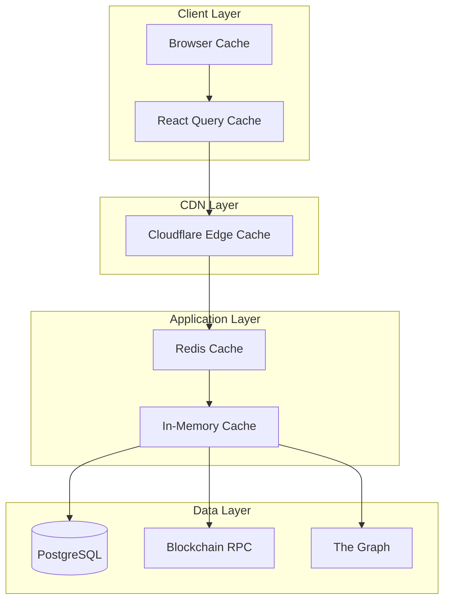
```mermaid
flowchart TB
    subgraph Client["Client Layer"]
        BR[Browser Cache]
        RC[React Query Cache]
    end

    subgraph CDN["CDN Layer"]
        CF[Cloudflare Edge Cache]
    end

    subgraph App["Application Layer"]
        RD[Redis Cache]
        MC[In-Memory Cache]
    end

    subgraph Data["Data Layer"]
        PG[(PostgreSQL)]
        RPC[Blockchain RPC]
        TG[The Graph]
    end

    BR --> RC --> CF --> RD --> MC --> PG
    MC --> RPC
    MC --> TG
```

### 13.2 Cache Policies

| Data Type | Cache Layer | TTL | Invalidation |
|-----------|------------|-----|--------------|
| Market rates | Redis + React Query | 12s (1 block) | On new block event |
| Market list | CDN + Redis | 5 min | On new market listing |
| User positions | React Query | 12s | On user transaction |
| Health factors | Redis | 12s | On block + price update |
| Historical snapshots | CDN | 1 hour | Time-based |
| Oracle prices | Redis | 30s | On price update event |
| Governance proposals | Redis | 60s | On vote/state change |
| Protocol stats | CDN + Redis | 5 min | On protocol event |
| Transaction history | Redis | 60s | On new transaction |
| At-risk accounts | Redis | 12s | On block + price update |

### 13.3 Redis Cache Structure

```
# Market data (refreshed per block)
market:{chainId}:{asset}:rates     -> JSON { supplyAPY, borrowAPY, utilization }
market:{chainId}:{asset}:config    -> JSON { ltv, liqThreshold, ... }
market:{chainId}:list              -> JSON [{ asset, symbol, ... }]

# User data
user:{chainId}:{address}:positions -> JSON [{ asset, supplied, borrowed, ... }]
user:{chainId}:{address}:hf        -> STRING "1.234567"

# Protocol aggregates
protocol:{chainId}:tvl            -> STRING "10000000000"
protocol:{chainId}:stats          -> JSON { tvl, borrows, revenue, ... }

# Oracle prices
oracle:{chainId}:{asset}:price    -> STRING "3456.78"
oracle:{chainId}:{asset}:updated  -> STRING "1708900000"

# At-risk accounts sorted set (score = health factor)
at_risk:{chainId}                  -> ZSET { address: healthFactor }

# Recent liquidations (capped list)
liquidations:{chainId}:recent      -> LIST [JSON, JSON, ...]

# Rate limiting
ratelimit:{ip}:{endpoint}          -> STRING count (with EXPIRE)
```

---

## Queue and Stream Design

### 14.1 Event Processing Pipeline

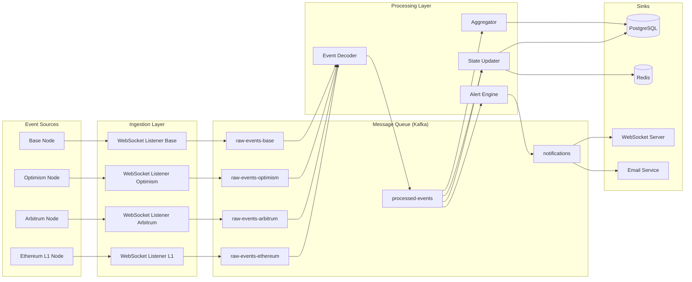
```mermaid
flowchart LR
    subgraph Sources["Event Sources"]
        L1[Ethereum L1 Node]
        L2A[Arbitrum Node]
        L2O[Optimism Node]
        L2B[Base Node]
    end

    subgraph Ingestion["Ingestion Layer"]
        WS1[WebSocket Listener L1]
        WS2[WebSocket Listener Arbitrum]
        WS3[WebSocket Listener Optimism]
        WS4[WebSocket Listener Base]
    end

    subgraph Queue["Message Queue (Kafka)"]
        T1[raw-events-ethereum]
        T2[raw-events-arbitrum]
        T3[raw-events-optimism]
        T4[raw-events-base]
        T5[processed-events]
        T6[notifications]
    end

    subgraph Processing["Processing Layer"]
        D1[Event Decoder]
        D2[State Updater]
        D3[Aggregator]
        D4[Alert Engine]
    end

    subgraph Sinks["Sinks"]
        PG[(PostgreSQL)]
        RD[(Redis)]
        WSS[WebSocket Server]
        EM[Email Service]
    end

    L1 --> WS1 --> T1
    L2A --> WS2 --> T2
    L2O --> WS3 --> T3
    L2B --> WS4 --> T4

    T1 --> D1
    T2 --> D1
    T3 --> D1
    T4 --> D1

    D1 --> T5
    T5 --> D2 --> PG
    T5 --> D2 --> RD
    T5 --> D3 --> PG
    T5 --> D4 --> T6
    T6 --> WSS
    T6 --> EM
```

### 14.2 Kafka Topic Configuration

```yaml
topics:
  raw-events-ethereum:
    partitions: 8
    replication_factor: 3
    retention: 7d
    key: block_number

  raw-events-arbitrum:
    partitions: 16  # Higher throughput on L2
    replication_factor: 3
    retention: 7d
    key: block_number

  processed-events:
    partitions: 16
    replication_factor: 3
    retention: 30d
    key: event_type

  notifications:
    partitions: 4
    replication_factor: 3
    retention: 1d
    key: user_address

  health-factor-updates:
    partitions: 8
    replication_factor: 3
    retention: 1h
    key: account_address

  liquidation-opportunities:
    partitions: 4
    replication_factor: 3
    retention: 1h
    key: account_address
```

### 14.3 Event Processing Workers

```python
# workers/event_processor.py

class EventProcessor:
    """
    Consumes raw blockchain events from Kafka, decodes them,
    updates state in PostgreSQL and Redis, and publishes
    processed events for downstream consumers.
    """

    EVENT_SIGNATURES = {
        'Supply': 'Supply(address,address,address,uint256,uint16)',
        'Withdraw': 'Withdraw(address,address,address,uint256)',
        'Borrow': 'Borrow(address,address,address,uint256,uint256,uint256,uint16)',
        'Repay': 'Repay(address,address,address,uint256,bool)',
        'LiquidationCall': 'LiquidationCall(address,address,address,uint256,uint256,address,bool)',
        'FlashLoan': 'FlashLoan(address,address,address,uint256,uint256,uint256,uint16)',
        'ReserveDataUpdated': 'ReserveDataUpdated(address,uint256,uint256,uint256,uint256,uint256)',
    }

    async def process_block(self, chain_id: int, block_data: dict):
        """Process all protocol events in a block."""
        events = self.decode_events(block_data['logs'])

        async with self.db.transaction() as tx:
            for event in events:
                handler = self.get_handler(event['name'])
                await handler(tx, chain_id, event)

            # Update market states
            await self.update_market_states(tx, chain_id, events)

            # Update affected account health factors
            affected_accounts = self.extract_affected_accounts(events)
            await self.update_health_factors(tx, chain_id, affected_accounts)

        # Publish to Redis for real-time updates
        await self.publish_updates(chain_id, events)

        # Check for liquidation opportunities
        await self.check_liquidation_opportunities(chain_id, affected_accounts)

    async def handle_supply(self, tx, chain_id, event):
        """Process a Supply event."""
        await tx.execute("""
            INSERT INTO supply_events
                (tx_hash, log_index, chain_id, block_number, block_timestamp,
                 market_id, account_address, amount, amount_usd)
            VALUES ($1, $2, $3, $4, $5, $6, $7, $8, $9)
            ON CONFLICT (tx_hash, log_index, chain_id) DO NOTHING
        """, [
            event['tx_hash'], event['log_index'], chain_id,
            event['block_number'], event['block_timestamp'],
            event['args']['reserve'], event['args']['onBehalfOf'],
            event['args']['amount'], self.compute_usd(event)
        ])

        # Update position
        await self.upsert_position(
            tx, chain_id,
            event['args']['onBehalfOf'],
            event['args']['reserve'],
            'SUPPLIER',
            event['args']['amount'],
            event['block_number'],
            event['block_timestamp']
        )
```

---

## State Machines

### 15.1 Loan Lifecycle State Machine

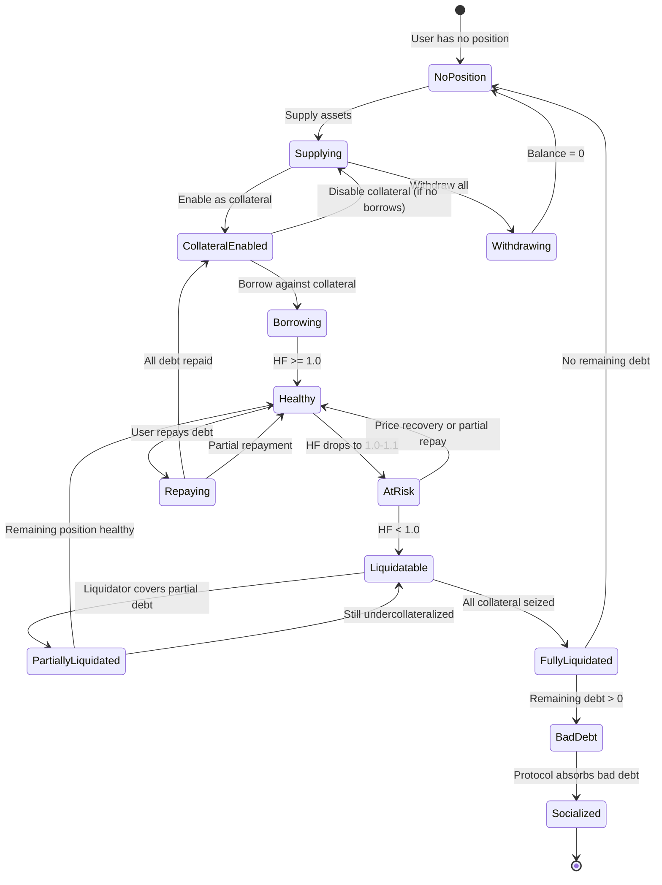
```mermaid
stateDiagram-v2
    [*] --> NoPosition: User has no position

    NoPosition --> Supplying: Supply assets
    Supplying --> CollateralEnabled: Enable as collateral
    Supplying --> Withdrawing: Withdraw all
    Withdrawing --> NoPosition: Balance = 0

    CollateralEnabled --> Borrowing: Borrow against collateral
    CollateralEnabled --> Supplying: Disable collateral (if no borrows)

    Borrowing --> Healthy: HF >= 1.0
    Healthy --> AtRisk: HF drops to 1.0-1.1
    AtRisk --> Healthy: Price recovery or partial repay
    AtRisk --> Liquidatable: HF < 1.0
    Liquidatable --> PartiallyLiquidated: Liquidator covers partial debt
    PartiallyLiquidated --> Healthy: Remaining position healthy
    PartiallyLiquidated --> Liquidatable: Still undercollateralized
    Liquidatable --> FullyLiquidated: All collateral seized
    FullyLiquidated --> BadDebt: Remaining debt > 0

    Healthy --> Repaying: User repays debt
    Repaying --> CollateralEnabled: All debt repaid
    Repaying --> Healthy: Partial repayment

    BadDebt --> Socialized: Protocol absorbs bad debt
    Socialized --> [*]
    FullyLiquidated --> NoPosition: No remaining debt
```

### 15.2 Liquidation State Machine

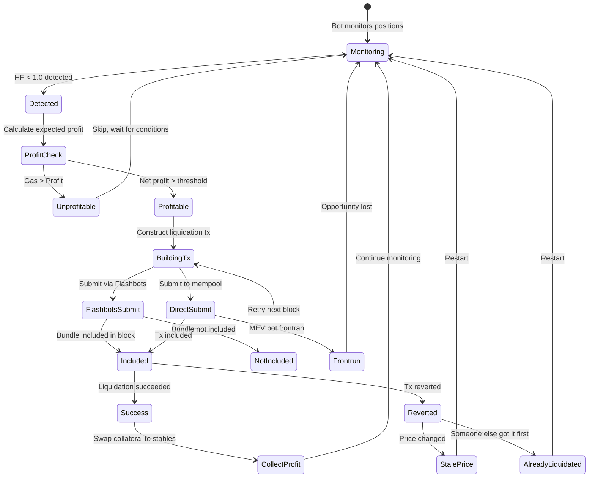
```mermaid
stateDiagram-v2
    [*] --> Monitoring: Bot monitors positions

    Monitoring --> Detected: HF < 1.0 detected
    Detected --> ProfitCheck: Calculate expected profit

    ProfitCheck --> Unprofitable: Gas > Profit
    Unprofitable --> Monitoring: Skip, wait for conditions

    ProfitCheck --> Profitable: Net profit > threshold
    Profitable --> BuildingTx: Construct liquidation tx

    BuildingTx --> FlashbotsSubmit: Submit via Flashbots
    BuildingTx --> DirectSubmit: Submit to mempool

    FlashbotsSubmit --> Included: Bundle included in block
    FlashbotsSubmit --> NotIncluded: Bundle not included
    NotIncluded --> BuildingTx: Retry next block

    DirectSubmit --> Frontrun: MEV bot frontran
    Frontrun --> Monitoring: Opportunity lost

    DirectSubmit --> Included: Tx included
    Included --> Success: Liquidation succeeded
    Included --> Reverted: Tx reverted

    Reverted --> StalePrice: Price changed
    Reverted --> AlreadyLiquidated: Someone else got it first
    StalePrice --> Monitoring: Restart
    AlreadyLiquidated --> Monitoring: Restart

    Success --> CollectProfit: Swap collateral to stables
    CollectProfit --> Monitoring: Continue monitoring
```

### 15.3 Governance Proposal State Machine

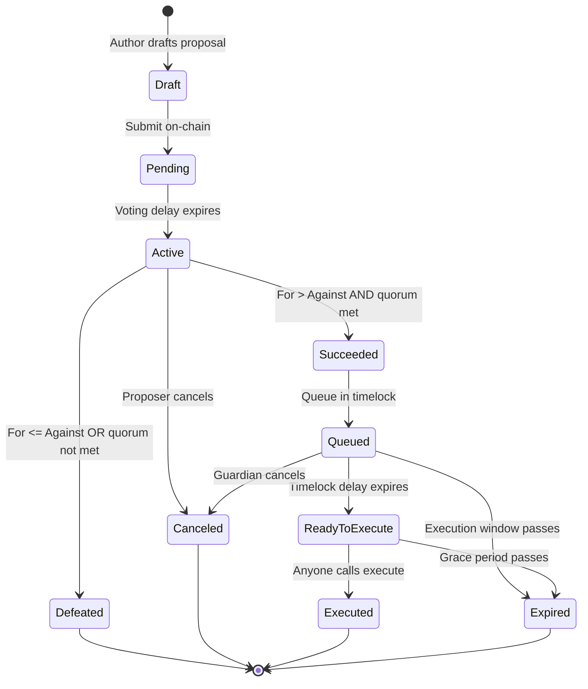
```mermaid
stateDiagram-v2
    [*] --> Draft: Author drafts proposal

    Draft --> Pending: Submit on-chain
    Pending --> Active: Voting delay expires

    Active --> Succeeded: For > Against AND quorum met
    Active --> Defeated: For <= Against OR quorum not met
    Active --> Canceled: Proposer cancels

    Defeated --> [*]
    Canceled --> [*]

    Succeeded --> Queued: Queue in timelock
    Queued --> ReadyToExecute: Timelock delay expires
    Queued --> Expired: Execution window passes
    Queued --> Canceled: Guardian cancels

    ReadyToExecute --> Executed: Anyone calls execute
    ReadyToExecute --> Expired: Grace period passes

    Executed --> [*]
    Expired --> [*]
```

### 15.4 Flash Loan State Machine

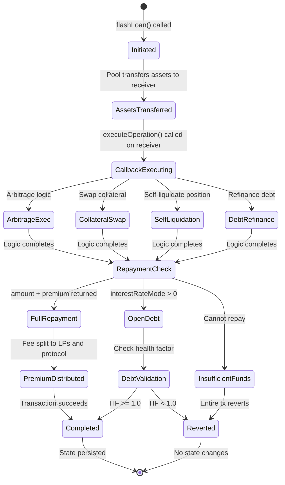
```mermaid
stateDiagram-v2
    [*] --> Initiated: flashLoan() called

    Initiated --> AssetsTransferred: Pool transfers assets to receiver
    AssetsTransferred --> CallbackExecuting: executeOperation() called on receiver

    CallbackExecuting --> ArbitrageExec: Arbitrage logic
    CallbackExecuting --> CollateralSwap: Swap collateral
    CallbackExecuting --> SelfLiquidation: Self-liquidate position
    CallbackExecuting --> DebtRefinance: Refinance debt

    ArbitrageExec --> RepaymentCheck: Logic completes
    CollateralSwap --> RepaymentCheck: Logic completes
    SelfLiquidation --> RepaymentCheck: Logic completes
    DebtRefinance --> RepaymentCheck: Logic completes

    RepaymentCheck --> FullRepayment: amount + premium returned
    RepaymentCheck --> OpenDebt: interestRateMode > 0
    RepaymentCheck --> InsufficientFunds: Cannot repay

    FullRepayment --> PremiumDistributed: Fee split to LPs and protocol
    PremiumDistributed --> Completed: Transaction succeeds

    OpenDebt --> DebtValidation: Check health factor
    DebtValidation --> Completed: HF >= 1.0
    DebtValidation --> Reverted: HF < 1.0

    InsufficientFunds --> Reverted: Entire tx reverts
    Reverted --> [*]: No state changes
    Completed --> [*]: State persisted
```

### 15.5 Oracle Price Update State Machine

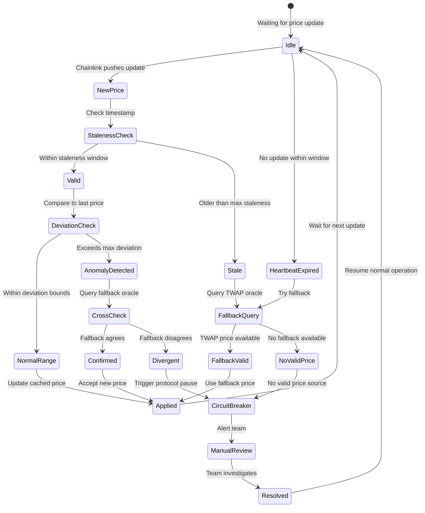
```mermaid
stateDiagram-v2
    [*] --> Idle: Waiting for price update

    Idle --> NewPrice: Chainlink pushes update
    Idle --> HeartbeatExpired: No update within window

    NewPrice --> StalenessCheck: Check timestamp
    StalenessCheck --> Valid: Within staleness window
    StalenessCheck --> Stale: Older than max staleness

    Valid --> DeviationCheck: Compare to last price
    DeviationCheck --> NormalRange: Within deviation bounds
    DeviationCheck --> AnomalyDetected: Exceeds max deviation

    NormalRange --> Applied: Update cached price
    Applied --> Idle: Wait for next update

    AnomalyDetected --> CrossCheck: Query fallback oracle
    CrossCheck --> Confirmed: Fallback agrees
    CrossCheck --> Divergent: Fallback disagrees

    Confirmed --> Applied: Accept new price
    Divergent --> CircuitBreaker: Trigger protocol pause
    CircuitBreaker --> ManualReview: Alert team

    Stale --> FallbackQuery: Query TWAP oracle
    FallbackQuery --> FallbackValid: TWAP price available
    FallbackQuery --> NoValidPrice: No fallback available

    FallbackValid --> Applied: Use fallback price
    NoValidPrice --> CircuitBreaker: No valid price source

    HeartbeatExpired --> FallbackQuery: Try fallback

    ManualReview --> Resolved: Team investigates
    Resolved --> Idle: Resume normal operation
```

---

## Sequence Diagrams

### 16.1 Supply Flow

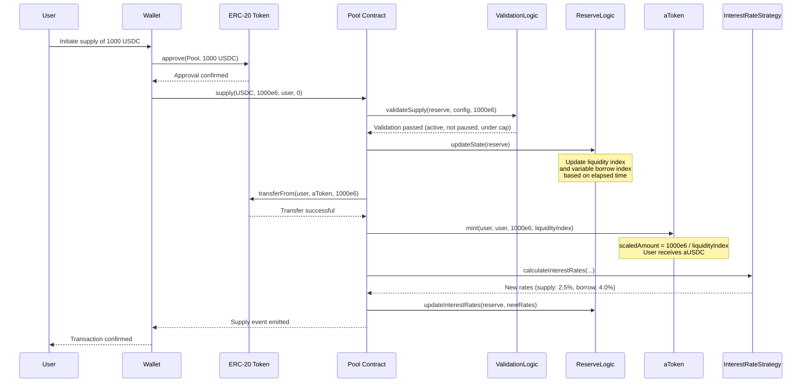
```mermaid
sequenceDiagram
    participant U as User
    participant W as Wallet
    participant T as ERC-20 Token
    participant P as Pool Contract
    participant V as ValidationLogic
    participant R as ReserveLogic
    participant A as aToken
    participant IR as InterestRateStrategy

    U->>W: Initiate supply of 1000 USDC
    W->>T: approve(Pool, 1000 USDC)
    T-->>W: Approval confirmed

    W->>P: supply(USDC, 1000e6, user, 0)
    P->>V: validateSupply(reserve, config, 1000e6)
    V-->>P: Validation passed (active, not paused, under cap)

    P->>R: updateState(reserve)
    Note over R: Update liquidity index<br/>and variable borrow index<br/>based on elapsed time

    P->>T: transferFrom(user, aToken, 1000e6)
    T-->>P: Transfer successful

    P->>A: mint(user, user, 1000e6, liquidityIndex)
    Note over A: scaledAmount = 1000e6 / liquidityIndex<br/>User receives aUSDC

    P->>IR: calculateInterestRates(...)
    IR-->>P: New rates (supply: 2.5%, borrow: 4.0%)

    P->>R: updateInterestRates(reserve, newRates)

    P-->>W: Supply event emitted
    W-->>U: Transaction confirmed
```

### 16.2 Borrow Flow

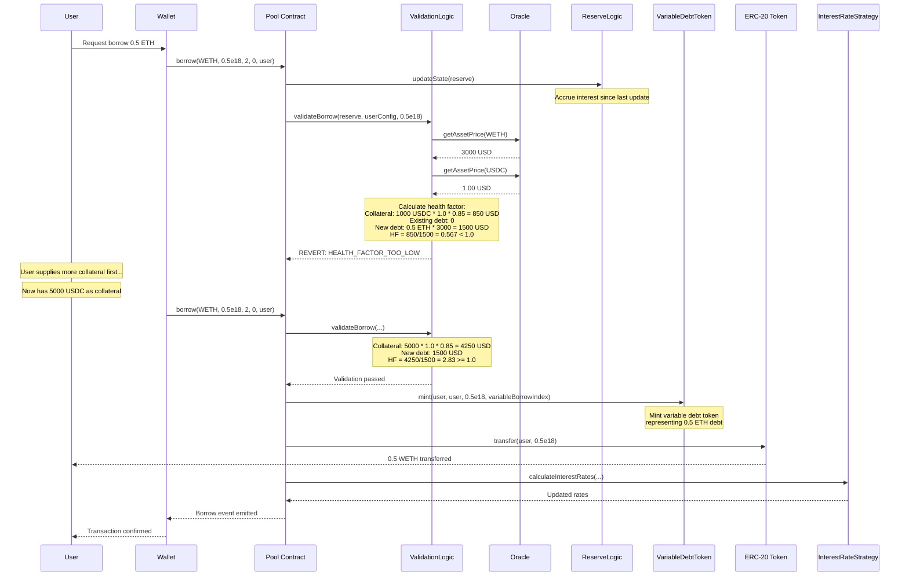
```mermaid
sequenceDiagram
    participant U as User
    participant W as Wallet
    participant P as Pool Contract
    participant V as ValidationLogic
    participant O as Oracle
    participant R as ReserveLogic
    participant DT as VariableDebtToken
    participant T as ERC-20 Token
    participant IR as InterestRateStrategy

    U->>W: Request borrow 0.5 ETH
    W->>P: borrow(WETH, 0.5e18, 2, 0, user)

    P->>R: updateState(reserve)
    Note over R: Accrue interest since last update

    P->>V: validateBorrow(reserve, userConfig, 0.5e18)
    V->>O: getAssetPrice(WETH)
    O-->>V: 3000 USD

    V->>O: getAssetPrice(USDC)
    O-->>V: 1.00 USD

    Note over V: Calculate health factor:<br/>Collateral: 1000 USDC * 1.0 * 0.85 = 850 USD<br/>Existing debt: 0<br/>New debt: 0.5 ETH * 3000 = 1500 USD<br/>HF = 850/1500 = 0.567 < 1.0

    V-->>P: REVERT: HEALTH_FACTOR_TOO_LOW

    Note over U: User supplies more collateral first...
    Note over U: Now has 5000 USDC as collateral

    W->>P: borrow(WETH, 0.5e18, 2, 0, user)
    P->>V: validateBorrow(...)

    Note over V: Collateral: 5000 * 1.0 * 0.85 = 4250 USD<br/>New debt: 1500 USD<br/>HF = 4250/1500 = 2.83 >= 1.0

    V-->>P: Validation passed

    P->>DT: mint(user, user, 0.5e18, variableBorrowIndex)
    Note over DT: Mint variable debt token<br/>representing 0.5 ETH debt

    P->>T: transfer(user, 0.5e18)
    T-->>U: 0.5 WETH transferred

    P->>IR: calculateInterestRates(...)
    IR-->>P: Updated rates

    P-->>W: Borrow event emitted
    W-->>U: Transaction confirmed
```

### 16.3 Liquidation Flow

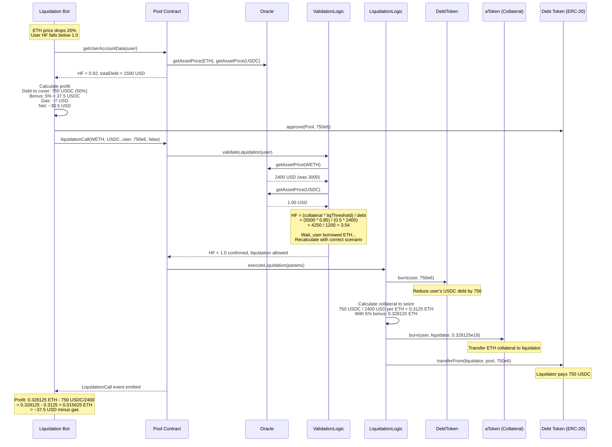
```mermaid
sequenceDiagram
    participant B as Liquidation Bot
    participant P as Pool Contract
    participant O as Oracle
    participant V as ValidationLogic
    participant LL as LiquidationLogic
    participant DT as DebtToken
    participant AT as aToken (Collateral)
    participant T as Debt Token (ERC-20)

    Note over B: ETH price drops 20%<br/>User HF falls below 1.0

    B->>P: getUserAccountData(user)
    P->>O: getAssetPrice(ETH), getAssetPrice(USDC)
    P-->>B: HF = 0.92, totalDebt = 1500 USD

    B->>B: Calculate profit<br/>Debt to cover: 750 USDC (50%)<br/>Bonus: 5% = 37.5 USDC<br/>Gas: ~7 USD<br/>Net: ~30.5 USD

    B->>T: approve(Pool, 750e6)

    B->>P: liquidationCall(WETH, USDC, user, 750e6, false)

    P->>V: validateLiquidation(user)
    V->>O: getAssetPrice(WETH)
    O-->>V: 2400 USD (was 3000)
    V->>O: getAssetPrice(USDC)
    O-->>V: 1.00 USD

    Note over V: HF = (collateral * liqThreshold) / debt<br/>= (5000 * 0.85) / (0.5 * 2400)<br/>= 4250 / 1200 = 3.54<br/><br/>Wait, user borrowed ETH...<br/>Recalculate with correct scenario

    V-->>P: HF < 1.0 confirmed, liquidation allowed

    P->>LL: executeLiquidation(params)

    LL->>DT: burn(user, 750e6)
    Note over DT: Reduce user's USDC debt by 750

    LL->>LL: Calculate collateral to seize<br/>750 USDC / 2400 USD per ETH = 0.3125 ETH<br/>With 5% bonus: 0.328125 ETH

    LL->>AT: burn(user, liquidator, 0.328125e18)
    Note over AT: Transfer ETH collateral to liquidator

    LL->>T: transferFrom(liquidator, pool, 750e6)
    Note over T: Liquidator pays 750 USDC

    P-->>B: LiquidationCall event emitted
    Note over B: Profit: 0.328125 ETH - 750 USDC/2400<br/>= 0.328125 - 0.3125 = 0.015625 ETH<br/>= ~37.5 USD minus gas
```

### 16.4 Governance Proposal Flow

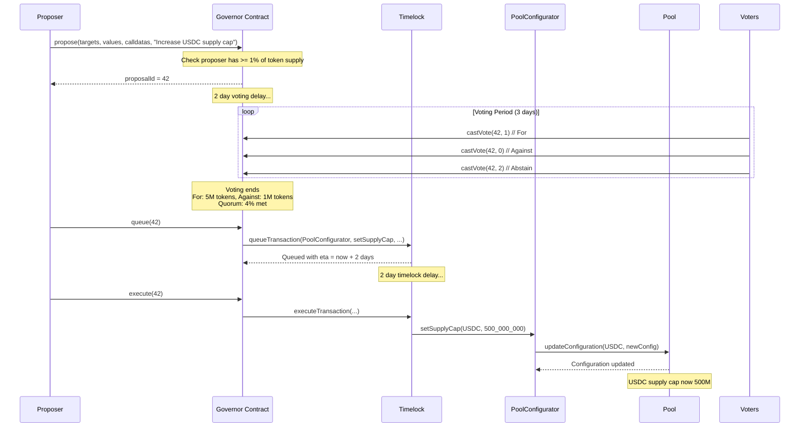
```mermaid
sequenceDiagram
    participant A as Proposer
    participant G as Governor Contract
    participant TL as Timelock
    participant PC as PoolConfigurator
    participant P as Pool

    A->>G: propose(targets, values, calldatas, "Increase USDC supply cap")
    Note over G: Check proposer has >= 1% of token supply
    G-->>A: proposalId = 42

    Note over G: 2 day voting delay...

    loop Voting Period (3 days)
        participant V as Voters
        V->>G: castVote(42, 1)  // For
        V->>G: castVote(42, 0)  // Against
        V->>G: castVote(42, 2)  // Abstain
    end

    Note over G: Voting ends<br/>For: 5M tokens, Against: 1M tokens<br/>Quorum: 4% met

    A->>G: queue(42)
    G->>TL: queueTransaction(PoolConfigurator, setSupplyCap, ...)
    TL-->>G: Queued with eta = now + 2 days

    Note over TL: 2 day timelock delay...

    A->>G: execute(42)
    G->>TL: executeTransaction(...)
    TL->>PC: setSupplyCap(USDC, 500_000_000)
    PC->>P: updateConfiguration(USDC, newConfig)
    P-->>PC: Configuration updated

    Note over P: USDC supply cap now 500M
```

### 16.5 Flash Loan Arbitrage Flow

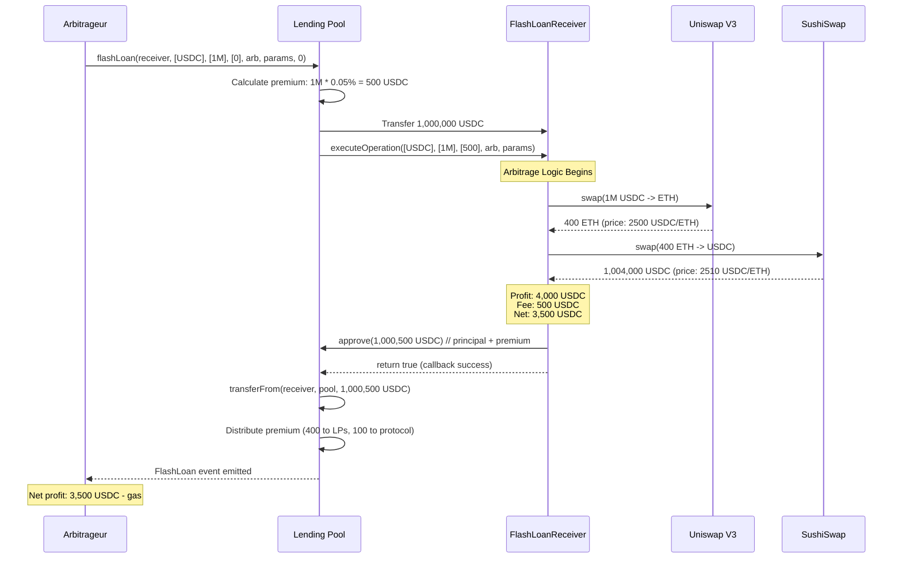
```mermaid
sequenceDiagram
    participant ARB as Arbitrageur
    participant P as Lending Pool
    participant FR as FlashLoanReceiver
    participant DEX1 as Uniswap V3
    participant DEX2 as SushiSwap

    ARB->>P: flashLoan(receiver, [USDC], [1M], [0], arb, params, 0)

    P->>P: Calculate premium: 1M * 0.05% = 500 USDC
    P->>FR: Transfer 1,000,000 USDC

    P->>FR: executeOperation([USDC], [1M], [500], arb, params)

    Note over FR: Arbitrage Logic Begins

    FR->>DEX1: swap(1M USDC -> ETH)
    DEX1-->>FR: 400 ETH (price: 2500 USDC/ETH)

    FR->>DEX2: swap(400 ETH -> USDC)
    DEX2-->>FR: 1,004,000 USDC (price: 2510 USDC/ETH)

    Note over FR: Profit: 4,000 USDC<br/>Fee: 500 USDC<br/>Net: 3,500 USDC

    FR->>P: approve(1,000,500 USDC)  // principal + premium

    FR-->>P: return true (callback success)

    P->>P: transferFrom(receiver, pool, 1,000,500 USDC)
    P->>P: Distribute premium (400 to LPs, 100 to protocol)

    P-->>ARB: FlashLoan event emitted
    Note over ARB: Net profit: 3,500 USDC - gas
```

---

## Concurrency Control

### 17.1 On-Chain Concurrency

Smart contracts on Ethereum execute transactions sequentially within a block. However, concurrency issues still arise from:

**Nonce Management:**
```
Each EOA (Externally Owned Account) has a nonce that increments with each transaction.
Transactions must be submitted with the correct nonce.
For liquidation bots running multiple transactions:
  - Maintain local nonce counter
  - Handle nonce gaps from failed transactions
  - Use nonce manager with mutex
```

**MEV and Transaction Ordering:**

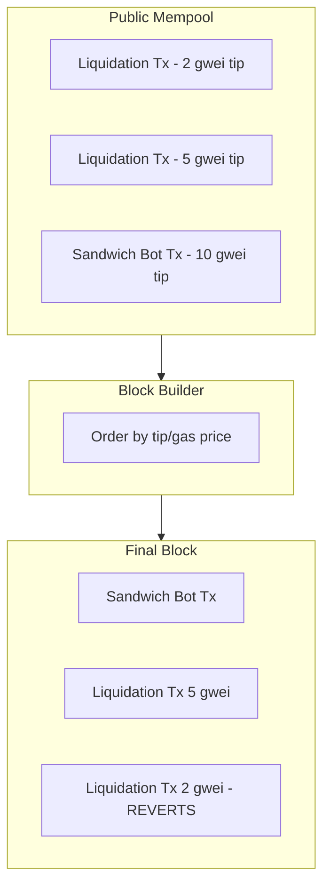
```mermaid
flowchart TB
    subgraph Mempool["Public Mempool"]
        TX1[Liquidation Tx - 2 gwei tip]
        TX2[Liquidation Tx - 5 gwei tip]
        TX3[Sandwich Bot Tx - 10 gwei tip]
    end

    subgraph Builder["Block Builder"]
        ORD[Order by tip/gas price]
    end

    subgraph Block["Final Block"]
        B1[Sandwich Bot Tx]
        B2[Liquidation Tx 5 gwei]
        B3[Liquidation Tx 2 gwei - REVERTS]
    end

    Mempool --> Builder --> Block
```

**Protection Strategies:**

1. **Flashbots/MEV-Share:** Submit transactions directly to block builders, bypassing the public mempool
2. **Commit-Reveal:** Two-phase transactions where the intent is hidden until execution
3. **Batch Auctions:** Aggregate orders and execute at uniform price
4. **Private Mempools:** Use private transaction relays

### 17.2 Atomic Transaction Guarantees

```solidity
/// All state changes within a transaction are atomic
/// If any step fails, the entire transaction reverts

function supply(address asset, uint256 amount, address onBehalfOf) external {
    // Step 1: Validate (reverts if invalid)
    ValidationLogic.validateSupply(reserve, config, amount);

    // Step 2: Update indexes (pure computation, cannot fail)
    ReserveLogic.updateState(reserve);

    // Step 3: Transfer tokens (reverts if insufficient balance/allowance)
    IERC20(asset).safeTransferFrom(msg.sender, aTokenAddress, amount);

    // Step 4: Mint aTokens (internal accounting)
    IAToken(aTokenAddress).mint(msg.sender, onBehalfOf, amount, liquidityIndex);

    // Step 5: Update rates
    _updateInterestRates(reserve, asset, amount, 0);

    // If ANY step above reverts, ALL state changes are rolled back
}
```

### 17.3 Reentrancy Protection

```solidity
/// @notice ReentrancyGuard prevents callbacks from re-entering the protocol
abstract contract ReentrancyGuard {
    uint256 private constant NOT_ENTERED = 1;
    uint256 private constant ENTERED = 2;
    uint256 private _status = NOT_ENTERED;

    modifier nonReentrant() {
        require(_status != ENTERED, 'REENTRANCY');
        _status = ENTERED;
        _;
        _status = NOT_ENTERED;
    }
}

/// Applied to all external-facing pool functions
contract Pool is ReentrancyGuard {
    function supply(...) external nonReentrant { ... }
    function withdraw(...) external nonReentrant { ... }
    function borrow(...) external nonReentrant { ... }
    function repay(...) external nonReentrant { ... }
    function liquidationCall(...) external nonReentrant { ... }
    function flashLoan(...) external nonReentrant { ... }
}
```

### 17.4 Off-Chain Concurrency

```python
# Nonce manager for liquidation bots
class NonceManager:
    def __init__(self, web3, account_address):
        self.web3 = web3
        self.address = account_address
        self.lock = asyncio.Lock()
        self.local_nonce = None

    async def get_nonce(self):
        async with self.lock:
            if self.local_nonce is None:
                self.local_nonce = self.web3.eth.get_transaction_count(
                    self.address, 'pending'
                )
            else:
                self.local_nonce += 1
            return self.local_nonce

    async def reset_nonce(self):
        async with self.lock:
            self.local_nonce = self.web3.eth.get_transaction_count(
                self.address, 'pending'
            )

    async def handle_failed_tx(self, nonce):
        """Send a zero-value self-transfer to fill the nonce gap."""
        async with self.lock:
            tx = {
                'from': self.address,
                'to': self.address,
                'value': 0,
                'nonce': nonce,
                'gas': 21000,
                'maxFeePerGas': self.web3.eth.gas_price,
                'maxPriorityFeePerGas': 0,
            }
            self.web3.eth.send_transaction(tx)
```

---

## Idempotency

### 18.1 On-Chain Idempotency

Smart contract transactions are inherently idempotent at the transaction level (same tx hash cannot execute twice). However, repeated function calls with the same parameters can cause issues:

```solidity
/// Flash loans are naturally idempotent: borrow and repay in same tx
/// But supply/borrow are NOT idempotent: calling supply(100) twice supplies 200

/// For governance: proposals have unique IDs
/// Voting is idempotent: castVote reverts if already voted
function castVote(uint256 proposalId, uint8 support) external {
    Receipt storage receipt = proposal.receipts[msg.sender];
    require(!receipt.hasVoted, 'ALREADY_VOTED');  // Idempotency guard
    receipt.hasVoted = true;
    // ...
}

/// For execution: proposals can only execute once
function execute(uint256 proposalId) external {
    require(state(proposalId) == ProposalState.Queued, 'NOT_QUEUED');
    proposal.executed = true;  // Prevents re-execution
    // ...
}
```

### 18.2 Off-Chain Idempotency

```python
class IdempotentEventProcessor:
    """
    Ensures blockchain events are processed exactly once
    even if the indexer replays blocks.
    """

    async def process_event(self, chain_id, event):
        # Unique key: tx_hash + log_index + chain_id
        event_key = f"{event['tx_hash']}:{event['log_index']}:{chain_id}"

        # Check if already processed
        if await self.redis.exists(f"processed:{event_key}"):
            logger.debug(f"Skipping duplicate event: {event_key}")
            return

        # Process with database upsert (ON CONFLICT DO NOTHING)
        async with self.db.transaction() as tx:
            await self.insert_event(tx, chain_id, event)

        # Mark as processed with TTL (7 days)
        await self.redis.set(
            f"processed:{event_key}",
            "1",
            ex=604800
        )
```

### 18.3 API Idempotency

```typescript
// REST API idempotency for write operations
app.post('/v1/notifications/subscribe', async (req, res) => {
  const idempotencyKey = req.headers['idempotency-key'];

  if (idempotencyKey) {
    const cached = await redis.get(`idempotency:${idempotencyKey}`);
    if (cached) {
      return res.json(JSON.parse(cached));
    }
  }

  const result = await subscribeUser(req.body);

  if (idempotencyKey) {
    await redis.set(
      `idempotency:${idempotencyKey}`,
      JSON.stringify(result),
      'EX',
      86400 // 24 hours
    );
  }

  res.json(result);
});
```

---

## Consistency Model

### 19.1 On-Chain Consistency

The blockchain provides **strong consistency** within a single chain:

- All nodes eventually agree on the same state
- Transactions within a block execute in deterministic order
- State transitions are atomic (all-or-nothing)
- After finality (64 slots on Ethereum), state is irreversible

However, there is a finality delay:

```
Ethereum L1:
  - Confirmation: 1 block (12 seconds)
  - Safe finality: 32 slots (~6.4 minutes)
  - Full finality: 64 slots (~12.8 minutes)

Arbitrum (Optimistic Rollup):
  - L2 confirmation: 1 block (~0.25 seconds)
  - L2 finality: minutes
  - L1 finality: 7 days (challenge period)

zkSync (ZK Rollup):
  - L2 confirmation: seconds
  - Proof submission: ~1 hour
  - L1 finality: ~1 hour + L1 finality
```

### 19.2 Off-Chain Consistency

The off-chain system uses **eventual consistency**:

```
Block produced -> Event emitted -> Indexer processes -> Database updated -> Cache updated -> Frontend displays

Typical latency: 2-10 seconds end-to-end
Maximum lag tolerance: 30 seconds before alerts trigger
```

**Consistency Guarantees:**

| Layer | Model | Guarantee |
|-------|-------|-----------|
| Smart Contracts | Strong (per-chain) | Atomic state transitions |
| The Graph Subgraph | Eventual | ~10-30 second lag |
| Custom Indexer | Eventual | ~2-5 second lag |
| Redis Cache | Eventual | Refreshed per block |
| Frontend (React Query) | Eventual | Stale-while-revalidate |
| Cross-chain | Eventually consistent | Minutes to hours |

### 19.3 Handling Reorgs

```python
class ReorgHandler:
    """
    Handle blockchain reorganizations by detecting and rolling back
    state changes from orphaned blocks.
    """
    CONFIRMATION_BLOCKS = 12  # Wait 12 blocks before considering finalized

    async def detect_reorg(self, chain_id, new_block):
        """Compare new block's parent hash with stored block hash."""
        stored_block = await self.db.get_block(chain_id, new_block['number'] - 1)

        if stored_block and stored_block['hash'] != new_block['parentHash']:
            # Reorg detected
            depth = await self.find_reorg_depth(chain_id, new_block)
            await self.rollback(chain_id, depth)
            return True
        return False

    async def rollback(self, chain_id, to_block):
        """Roll back all state changes after the given block."""
        async with self.db.transaction() as tx:
            # Delete events from orphaned blocks
            await tx.execute("""
                DELETE FROM supply_events
                WHERE chain_id = $1 AND block_number > $2
            """, [chain_id, to_block])

            await tx.execute("""
                DELETE FROM borrow_events
                WHERE chain_id = $1 AND block_number > $2
            """, [chain_id, to_block])

            # ... delete from all event tables

            # Recompute market states from remaining events
            await self.recompute_states(tx, chain_id, to_block)

        # Invalidate caches
        await self.invalidate_caches(chain_id)
```

---

## Distributed Transactions and Sagas

### 20.1 Cross-Chain Asset Bridging

When the protocol operates across multiple chains, cross-chain operations require saga patterns:

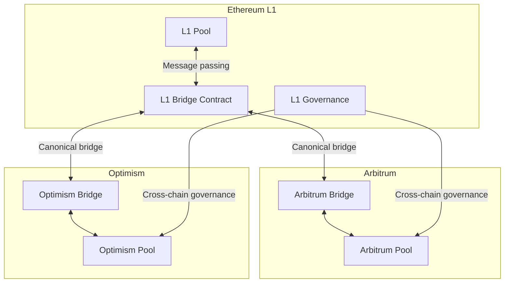
```mermaid
flowchart TB
    subgraph L1["Ethereum L1"]
        L1Pool[L1 Pool]
        L1Bridge[L1 Bridge Contract]
        L1Gov[L1 Governance]
    end

    subgraph L2A["Arbitrum"]
        L2APool[Arbitrum Pool]
        L2ABridge[Arbitrum Bridge]
    end

    subgraph L2B["Optimism"]
        L2BPool[Optimism Pool]
        L2BBridge[Optimism Bridge]
    end

    L1Pool <-->|Message passing| L1Bridge
    L1Bridge <-->|Canonical bridge| L2ABridge
    L1Bridge <-->|Canonical bridge| L2BBridge
    L2ABridge <--> L2APool
    L2BBridge <--> L2BPool

    L1Gov -->|Cross-chain governance| L2APool
    L1Gov -->|Cross-chain governance| L2BPool
```

### 20.2 Cross-Chain Governance Saga

```
Saga: Update risk parameters on L2 via L1 governance

Step 1: Governance proposal passes on L1
  -> Execute transaction on L1 timelock
  Compensating: Cannot undo; proposal was already validated

Step 2: L1 sends message to L2 bridge
  -> Bridge contract queues message
  Compensating: Message can be cancelled within L1 finality window

Step 3: L2 bridge relays message to L2 pool configurator
  -> L2 pool configurator updates parameters
  Compensating: L1 governance can send corrective update

Step 4: L2 indexer picks up parameter change
  -> Update database and cache
  Compensating: Reindex from corrected state

Failure Modes:
  - Bridge congestion: Message delayed hours to days
  - L2 sequencer down: Parameters stale until sequencer resumes
  - Invalid parameters: L2 validation rejects; L1 must re-propose
```

### 20.3 Flash Loan Saga (Single Transaction)

Flash loans are a unique form of distributed transaction that completes entirely within one blockchain transaction:

```
Saga: Flash Loan Arbitrage (all within 1 tx)

Step 1: Borrow 1M USDC from lending pool
Step 2: Swap USDC -> ETH on Uniswap
Step 3: Swap ETH -> USDC on SushiSwap
Step 4: Repay 1M USDC + 500 USDC fee to lending pool

Atomicity: Guaranteed by EVM
  - If step 4 fails (insufficient funds), ALL steps revert
  - No partial state changes ever persist
  - No compensation needed; the EVM handles it
```

### 20.4 Liquidation with Flash Loan Saga

```python
class FlashLiquidationSaga:
    """
    Multi-step saga executed atomically on-chain via flash loan.
    Off-chain orchestration handles retry logic.
    """

    async def execute(self, opportunity):
        """
        On-chain (atomic):
          1. Flash borrow debt asset
          2. Liquidate borrower (repay debt, receive collateral)
          3. Swap collateral to debt asset on DEX
          4. Repay flash loan + fee
          5. Keep profit

        Off-chain (saga with retries):
          1. Detect opportunity
          2. Simulate transaction
          3. Submit via Flashbots
          4. Monitor inclusion
          5. Handle failure (retry next block)
        """

        # Step 1: Simulate
        simulation = await self.simulate_liquidation(opportunity)
        if not simulation.success or simulation.profit < self.min_profit:
            return SagaResult.SKIPPED

        # Step 2: Build and submit
        for attempt in range(3):  # Max 3 block attempts
            tx = self.build_flash_liquidation(opportunity)
            result = await self.submit_via_flashbots(tx)

            if result.included:
                return SagaResult.SUCCESS

            if result.error == 'already_liquidated':
                return SagaResult.PREEMPTED

            # Opportunity might still exist, retry next block
            await asyncio.sleep(12)  # Wait for next block

        return SagaResult.FAILED
```

---

## Security Design

### 21.1 Threat Model

| Threat | Severity | Mitigation |
|--------|----------|------------|
| Reentrancy attack | Critical | ReentrancyGuard on all external functions |
| Oracle manipulation | Critical | TWAP, multi-source, deviation checks |
| Flash loan attack | Critical | TWAP oracles, borrow caps, circuit breakers |
| Integer overflow/underflow | High | Solidity 0.8+ built-in checks |
| Access control bypass | Critical | Role-based access, multi-sig |
| Front-running | High | Flashbots, commit-reveal, MEV protection |
| Governance attack | High | Timelock, quorum, voting delay |
| Price feed failure | High | Fallback oracles, emergency pause |
| Denial of service | Medium | Gas limits, rate limiting |
| Storage collision (proxy) | High | EIP-1967 storage slots |
| Delegate call misuse | Critical | Careful proxy pattern implementation |
| Signature replay | Medium | EIP-712, nonce tracking |
| Sandwich attack | Medium | Slippage protection, private transactions |
| Dust attacks | Low | Minimum amounts, gas optimization |

### 21.2 Security Architecture

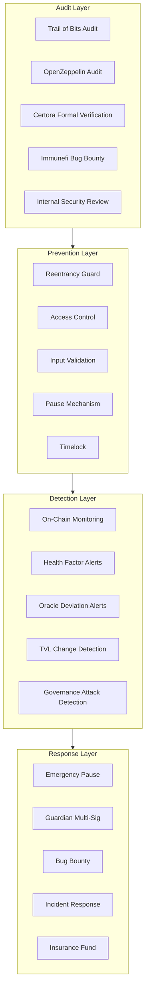
```mermaid
flowchart TB
    subgraph Prevention["Prevention Layer"]
        RE[Reentrancy Guard]
        AC[Access Control]
        VA[Input Validation]
        PS[Pause Mechanism]
        TL[Timelock]
    end

    subgraph Detection["Detection Layer"]
        MN[On-Chain Monitoring]
        HF[Health Factor Alerts]
        OD[Oracle Deviation Alerts]
        TV[TVL Change Detection]
        GA[Governance Attack Detection]
    end

    subgraph Response["Response Layer"]
        EP[Emergency Pause]
        GU[Guardian Multi-Sig]
        BB[Bug Bounty]
        IR2[Incident Response]
        IN[Insurance Fund]
    end

    subgraph Audit["Audit Layer"]
        A1[Trail of Bits Audit]
        A2[OpenZeppelin Audit]
        A3[Certora Formal Verification]
        A4[Immunefi Bug Bounty]
        A5[Internal Security Review]
    end

    Prevention --> Detection --> Response
    Audit --> Prevention
```

### 21.3 Reentrancy Protection Pattern

```solidity
// Checks-Effects-Interactions pattern

function withdraw(address asset, uint256 amount, address to) external nonReentrant {
    // CHECKS: Validate inputs
    require(amount > 0, 'INVALID_AMOUNT');
    DataTypes.ReserveData storage reserve = _reserves[asset];
    require(reserve.aTokenAddress != address(0), 'RESERVE_NOT_EXISTS');

    uint256 userBalance = IAToken(reserve.aTokenAddress).balanceOf(msg.sender);
    uint256 amountToWithdraw = amount == type(uint256).max ? userBalance : amount;
    require(amountToWithdraw <= userBalance, 'INSUFFICIENT_BALANCE');

    // EFFECTS: Update state BEFORE external calls
    ReserveLogic.updateState(reserve);
    IAToken(reserve.aTokenAddress).burn(msg.sender, to, amountToWithdraw, reserve.liquidityIndex);
    _updateInterestRates(reserve, asset, 0, amountToWithdraw);

    // Validate health factor after state update
    if (_usersConfig[msg.sender].isBorrowingAny()) {
        require(
            GenericLogic.calculateHealthFactor(...) >= HEALTH_FACTOR_THRESHOLD,
            'HF_TOO_LOW'
        );
    }

    // INTERACTIONS: External call last
    // aToken.burn already handled the transfer in EFFECTS
    // No external calls after state changes
}
```

### 21.4 Formal Verification

```
// Certora Verification Language (CVL) specification

rule healthFactorPreservedAfterSupply(address user, address asset, uint256 amount) {
    env e;
    require e.msg.sender == user;

    uint256 hfBefore = getHealthFactor(user);
    require hfBefore >= 1e18; // User starts healthy

    supply(e, asset, amount, user, 0);

    uint256 hfAfter = getHealthFactor(user);

    // Supply should never decrease health factor
    assert hfAfter >= hfBefore;
}

rule noUnauthorizedWithdrawal(address user, address attacker) {
    require user != attacker;

    uint256 balBefore = aTokenBalanceOf(user);

    env e;
    require e.msg.sender == attacker;

    withdraw(e, asset, amount, attacker);

    uint256 balAfter = aTokenBalanceOf(user);

    // Attacker cannot reduce user's balance
    assert balAfter >= balBefore;
}

rule liquidationOnlyWhenUndercollateralized(address liquidatee) {
    env e;

    uint256 hf = getHealthFactor(liquidatee);
    require hf >= 1e18; // User is healthy

    // This should always revert
    liquidationCall@withrevert(e, collateral, debt, liquidatee, amount, false);
    assert lastReverted;
}

invariant totalDebtLessThanTotalCollateral()
    getTotalDebtUSD() <= getTotalCollateralUSD() * getAverageLTV() / 10000;
```

### 21.5 Bug Bounty Structure

| Severity | Criteria | Payout |
|----------|---------|--------|
| Critical | Direct theft of user funds, permanent freezing | $1M - $10M |
| High | Temporary freezing of funds, theft of unclaimed yield | $100K - $1M |
| Medium | Griefing (no profit for attacker), oracle issues | $10K - $100K |
| Low | Informational, gas optimization, minor issues | $1K - $10K |

---

## Observability

### 22.1 Monitoring Architecture

```mermaid
flowchart TB
    subgraph OnChain["On-Chain Metrics"]
        TVL[TVL per Asset]
        UR[Utilization Rates]
        HFD[Health Factor Distribution]
        LIQ[Liquidation Volume]
        FL_V[Flash Loan Volume]
        OP[Oracle Prices]
    end

    subgraph Collection["Collection Layer"]
        IDX[Event Indexer]
        RPC_M[RPC Monitor]
        BOT[Bot Metrics]
    end

    subgraph Storage_M["Metric Storage"]
        PROM[Prometheus]
        TSDB[TimescaleDB]
    end

    subgraph Viz["Visualization"]
        GF[Grafana Dashboards]
        DD[Dune Analytics]
        CUST[Custom Analytics]
    end

    subgraph Alerts_S["Alert System"]
        PD[PagerDuty]
        SL[Slack]
        TG_A[Telegram Bot]
    end

    OnChain --> Collection --> Storage_M --> Viz
    Storage_M --> Alerts_S
```

### 22.2 Key Dashboards

**TVL Dashboard:**
- Total TVL across all chains (real-time)
- TVL breakdown by asset
- TVL trend (24h, 7d, 30d)
- Net inflow/outflow

**Risk Dashboard:**
- Health factor distribution histogram
- Accounts at risk (HF < 1.1)
- Largest positions by debt
- Concentration risk (single-asset dominance)
- Bad debt tracker

**Revenue Dashboard:**
- Daily protocol revenue (reserve factor)
- Flash loan fee revenue
- Liquidation protocol fee revenue
- Revenue by chain

**Oracle Dashboard:**
- Last update time per price feed
- Price deviation between sources
- Staleness alerts
- Historical price accuracy

**Liquidation Dashboard:**
- Liquidation volume (24h, 7d)
- Liquidation profitability
- Average liquidation size
- Time-to-liquidation (from HF < 1 to execution)

### 22.3 Alert Rules

```yaml
# Prometheus alerting rules

groups:
  - name: protocol_health
    rules:
      - alert: TVLDrop
        expr: abs(delta(protocol_tvl_usd[1h])) / protocol_tvl_usd > 0.1
        for: 5m
        labels:
          severity: critical
        annotations:
          summary: "TVL changed by >10% in 1 hour"

      - alert: HighUtilization
        expr: market_utilization_rate > 0.95
        for: 15m
        labels:
          severity: warning
        annotations:
          summary: "{{ $labels.asset }} utilization above 95%"

      - alert: OracleStale
        expr: time() - oracle_last_update_timestamp > 3600
        for: 5m
        labels:
          severity: critical
        annotations:
          summary: "Oracle for {{ $labels.asset }} stale for >1 hour"

      - alert: OracleDeviation
        expr: abs(oracle_primary_price - oracle_fallback_price) / oracle_primary_price > 0.05
        for: 1m
        labels:
          severity: critical
        annotations:
          summary: "5%+ deviation between oracle sources for {{ $labels.asset }}"

      - alert: LargePositionAtRisk
        expr: account_health_factor < 1.05 and account_debt_usd > 1000000
        for: 1m
        labels:
          severity: critical
        annotations:
          summary: "Account {{ $labels.address }} has ${{ $value }}M debt with HF < 1.05"

      - alert: IndexerLag
        expr: time() - indexer_last_processed_block_timestamp > 60
        for: 5m
        labels:
          severity: warning
        annotations:
          summary: "Indexer lagging >60 seconds behind chain head"

      - alert: LiquidationBotDown
        expr: liquidation_bot_last_heartbeat_seconds > 120
        for: 2m
        labels:
          severity: critical
        annotations:
          summary: "Liquidation bot not responding"

      - alert: BadDebtAccumulating
        expr: delta(protocol_bad_debt_usd[1h]) > 100000
        for: 5m
        labels:
          severity: critical
        annotations:
          summary: "Bad debt increased by >$100K in 1 hour"

      - alert: GovernanceAttack
        expr: governance_vote_power_change > 0.1
        for: 1m
        labels:
          severity: critical
        annotations:
          summary: "Unusual governance voting power shift detected"
```

---

## Reliability

### 23.1 Oracle Fallback Chain

```
Primary: Chainlink price feed
  |
  |--> Staleness check (< 1 hour)
  |--> Sanity check (price > 0)
  |--> Deviation check (< 5% from TWAP)
  |
  v  [If primary fails]
Secondary: Uniswap V3 TWAP (30 min window)
  |
  |--> Liquidity check (minimum $1M)
  |--> Multi-pool aggregation
  |
  v  [If secondary fails]
Tertiary: Cached last valid price
  |
  |--> Max staleness: 4 hours
  |--> Only for existing positions (no new borrows)
  |
  v  [If all fail]
Emergency: Protocol pause
  |--> Guardian multi-sig pauses affected markets
  |--> Manual price override after investigation
```

### 23.2 Emergency Pause Mechanism

```solidity
contract EmergencyPauseModule {
    // Roles
    address public guardian;        // Multi-sig (fast response)
    address public governance;      // DAO governance (slow, decentralized)

    // Pause levels
    bool public globalPause;
    mapping(address => bool) public assetPause;
    mapping(bytes4 => bool) public functionPause;  // Pause specific functions

    // Auto-pause triggers
    uint256 public maxTVLDropPercent = 2000; // 20%
    uint256 public maxLiquidationVolume = 100_000_000e8; // $100M per day
    uint256 public lastDayLiquidationVolume;
    uint256 public lastVolumeResetTimestamp;

    function checkAutoPause() internal {
        // Auto-pause if liquidation volume too high
        if (block.timestamp - lastVolumeResetTimestamp > 1 days) {
            lastDayLiquidationVolume = 0;
            lastVolumeResetTimestamp = block.timestamp;
        }

        if (lastDayLiquidationVolume > maxLiquidationVolume) {
            globalPause = true;
            emit AutoPauseTriggered('LIQUIDATION_VOLUME_EXCEEDED');
        }
    }

    function unpause() external onlyGovernance {
        globalPause = false;
        emit Unpaused(msg.sender);
    }
}
```

### 23.3 Graceful Degradation

| Failure | Impact | Degradation Strategy |
|---------|--------|---------------------|
| Primary oracle down | Cannot get accurate prices | Fall back to TWAP, then cached price |
| L2 sequencer down | Cannot submit L2 transactions | Grace period on L2; users can exit via L1 bridge |
| Indexer down | Frontend shows stale data | Banner warning; direct RPC fallback for critical data |
| Frontend CDN down | UI unavailable | Users can interact directly via Etherscan or CLI |
| Liquidation bots offline | Positions not liquidated | Other independent bots fill the gap; protocol incentivizes participation |
| The Graph down | Subgraph queries fail | Custom indexer as backup; direct RPC queries |
| Redis cache down | Slower API responses | Bypass cache, query PostgreSQL directly |
| PostgreSQL down | No historical data | Serve from read replica; subgraph as fallback |

---

## Multi-Chain Strategy

### 24.1 Deployment Architecture

```mermaid
flowchart TB
    subgraph L1["Ethereum L1 (Canonical)"]
        L1Pool[Pool + Core Contracts]
        L1Gov[Governance + Timelock]
        L1Bridge[Bridge Contracts]
        L1Oracle[Oracle Hub]
    end

    subgraph Arbitrum["Arbitrum One"]
        ARBPool[Pool + Core Contracts]
        ARBBridge[Bridge Endpoint]
        ARBOracle[Oracle]
        ARBExec[Cross-Chain Executor]
    end

    subgraph Optimism["Optimism"]
        OPPool[Pool + Core Contracts]
        OPBridge[Bridge Endpoint]
        OPOracle[Oracle]
        OPExec[Cross-Chain Executor]
    end

    subgraph Base["Base"]
        BPool[Pool + Core Contracts]
        BBridge[Bridge Endpoint]
        BOracle[Oracle]
        BExec[Cross-Chain Executor]
    end

    L1Gov -->|Governance messages| L1Bridge
    L1Bridge -->|Canonical bridge| ARBBridge --> ARBExec --> ARBPool
    L1Bridge -->|Canonical bridge| OPBridge --> OPExec --> OPPool
    L1Bridge -->|Canonical bridge| BBridge --> BExec --> BPool
```

### 24.2 Chain-Specific Considerations

| Chain | Block Time | Gas Cost | Oracle | Finality |
|-------|-----------|----------|--------|----------|
| Ethereum L1 | 12s | $3-50 | Chainlink (native) | 12.8 min |
| Arbitrum | 0.25s | $0.01-0.10 | Chainlink + Sequencer check | 7 days (challenge) |
| Optimism | 2s | $0.01-0.10 | Chainlink + Sequencer check | 7 days (challenge) |
| Base | 2s | $0.001-0.05 | Chainlink + Sequencer check | 7 days (challenge) |
| Polygon PoS | 2s | $0.001-0.01 | Chainlink | ~2 min |
| zkSync Era | seconds | $0.01-0.05 | Chainlink + API3 | ~1 hour (proof) |

### 24.3 Cross-Chain Risk Isolation

Each chain deployment is independently managed with separate:
- Reserve configurations and risk parameters
- Liquidity pools (not shared across chains)
- Oracle setups (chain-specific feeds)
- Interest rate models (tuned per chain)

Only governance is centralized on L1 and propagated via bridge messages.

---

## Cost Drivers

### 25.1 Gas Optimization Techniques

| Technique | Gas Savings | Implementation |
|-----------|------------|----------------|
| Storage packing | 20-40% | Pack multiple values into single 256-bit slot |
| Bitmap configurations | 50-70% | Single uint256 for all reserve config flags |
| Lazy interest accrual | 30-50% | Only update indexes on user interaction |
| Calldata optimization | 10-20% | Use uint16 for referral codes, tight ABI encoding |
| Library delegation | 5-10% | External library calls vs inline code |
| Short-circuit evaluation | Variable | Return early on common paths |
| Immutable variables | 2,100 gas/read | Use immutable for deploy-time constants |
| Custom errors | 200 gas/revert | Solidity custom errors vs require strings |

### 25.2 Storage Slot Packing

```solidity
// BEFORE: Each variable uses a full 256-bit slot
struct ReserveDataUnpacked {
    uint256 liquidityIndex;      // Slot 0
    uint256 liquidityRate;       // Slot 1
    uint256 borrowIndex;         // Slot 2
    uint256 borrowRate;          // Slot 3
    uint256 stableBorrowRate;    // Slot 4
    uint256 lastUpdateTimestamp;  // Slot 5
    uint256 id;                  // Slot 6
    // 7 storage slots = 7 * 20,000 gas (SSTORE) = 140,000 gas
}

// AFTER: Pack into fewer slots
struct ReserveDataPacked {
    uint128 liquidityIndex;       // Slot 0 (128 bits)
    uint128 liquidityRate;        // Slot 0 (128 bits) -- same slot!
    uint128 borrowIndex;          // Slot 1
    uint128 borrowRate;           // Slot 1
    uint128 stableBorrowRate;     // Slot 2
    uint40 lastUpdateTimestamp;   // Slot 2
    uint16 id;                    // Slot 2
    // 3 storage slots = 3 * 20,000 gas = 60,000 gas
    // Savings: 80,000 gas per full write
}
```

### 25.3 Gas Cost Breakdown

```
Supply Transaction (typical):
  Base tx cost:         21,000 gas
  Function selector:       100 gas
  ERC-20 transferFrom:  ~50,000 gas  (SSTORE for balance updates)
  Update reserve state:  ~30,000 gas  (index, rate calculations)
  Mint aToken:          ~40,000 gas  (scaled balance update)
  Update interest rates: ~20,000 gas  (read + compute)
  Emit events:          ~10,000 gas
  Total:               ~171,100 gas

Liquidation Transaction (typical):
  Base tx cost:         21,000 gas
  Health factor calc:   ~80,000 gas  (multiple oracle reads)
  Debt token burn:      ~30,000 gas
  aToken transfer:      ~40,000 gas
  ERC-20 transfer:      ~50,000 gas
  Interest rate update:  ~40,000 gas  (2 markets)
  Emit events:          ~15,000 gas
  Total:               ~276,000 gas

Flash Loan (base, excluding callback):
  Base tx cost:         21,000 gas
  Premium calculation:   ~5,000 gas
  Transfer to receiver:  ~50,000 gas
  Callback overhead:    ~30,000 gas
  Repayment transfer:   ~50,000 gas
  Premium distribution:  ~20,000 gas
  Total (base):        ~176,000 gas
  Callback (user logic): 100,000 - 1,000,000+ gas additional
```

### 25.4 Annual Cost Model

```
Assumptions:
  - ETH price: $3,000
  - L1 gas price: 30 gwei average
  - L2 gas price: 0.1 gwei average
  - Transaction mix: 70% L2, 30% L1

Annual On-Chain Costs:
  L1 transactions: 22,600 * 0.3 * 365 = 2.5M txs/year
  L1 avg gas: 250,000
  L1 cost: 2.5M * 250,000 * 30 gwei * $3,000/ETH = $56.25M

  L2 transactions: 22,600 * 0.7 * 365 = 5.8M txs/year
  L2 avg gas: 250,000
  L2 cost: 5.8M * 250,000 * 0.1 gwei * $3,000/ETH = $435K

  Total on-chain: ~$57M/year (dominated by L1)

Off-Chain Infrastructure:
  - Indexing nodes (5 chains): $5,000/month
  - PostgreSQL (managed): $3,000/month
  - Redis cluster: $1,500/month
  - API servers: $2,000/month
  - Monitoring: $1,000/month
  - CDN: $500/month
  Total off-chain: ~$156K/year

Developer Costs:
  - Smart contract engineers: 5 * $300K = $1.5M
  - Backend engineers: 3 * $250K = $750K
  - Frontend engineers: 3 * $200K = $600K
  - Security engineers: 2 * $350K = $700K
  - Audits (annual): $2M
  Total people: ~$5.55M/year
```

---

## Platform Comparisons

### 26.1 Aave vs Compound vs MakerDAO vs Morpho vs Spark

| Feature | Aave V3 | Compound V3 (Comet) | MakerDAO | Morpho Blue | Spark |
|---------|---------|---------------------|----------|-------------|-------|
| **Architecture** | Multi-asset pools | Single-asset base model | CDP (vault-based) | Minimal singleton | Fork of Aave V3 |
| **Collateral Model** | Cross-collateral | Single base asset | Per-vault isolation | Per-market isolation | Cross-collateral |
| **Interest Rates** | Variable + Stable | Variable only | Stability fee (governance-set) | Market-determined | Variable + Stable |
| **Liquidation** | Permissionless, any caller | Absorb function | Auction-based (Dutch) | Permissionless | Permissionless |
| **Governance** | Aave DAO + Guardian | Comp DAO | MKR holders | Immutable core, curated vaults | SubDAO of MakerDAO |
| **Oracle** | Chainlink + fallback | Chainlink | Medianizer (custom) | Configurable per market | Chronicle Oracles |
| **Flash Loans** | Native support | Not native | Not native | Not native | Native support |
| **aToken Model** | Rebasing aTokens | Account-based | No supply tokens | Account-based | Rebasing aTokens |
| **Upgradeability** | UUPS proxy | Minimal proxy | Complex proxy | Immutable | UUPS proxy |
| **E-Mode** | Yes (correlated assets) | No | No | Via curated vaults | Yes |
| **Isolation Mode** | Yes | By design (single-base) | Per-vault | Per-market | Yes |
| **Supply Caps** | Yes | Yes | Debt ceiling | No (market-level) | Yes |
| **Multi-Chain** | 8+ chains | 5+ chains | Ethereum only | Ethereum + L2s | Ethereum + Gnosis |
| **TVL (2024)** | ~$12B | ~$3B | ~$8B | ~$2B | ~$4B |
| **Gas Efficiency** | Moderate | High (single-market) | High (per-vault) | Very high (minimal) | Moderate |
| **Risk Management** | Centralized risk team | Gauntlet | Centralized risk | Curator model | SubDAO risk |
| **Innovation** | E-Mode, portals, GHO | Account manager | SubDAOs, endgame | Permissionless markets | sDAI, subDAO |
| **Token** | AAVE | COMP | MKR | MORPHO | SPK |
| **Reserve Factor** | 10-20% | 10-25% | Stability fee | 0% (curator-set) | 10-20% |
| **EIP-4626** | Partial | No | No | Yes | Partial |

### 26.2 Key Design Philosophy Differences

**Aave V3:** Maximally feature-rich with E-Mode, isolation mode, portals for cross-chain liquidity, and GHO stablecoin. Trades simplicity for flexibility.

**Compound V3 (Comet):** Radical simplification to single-base-asset model. Each market (e.g., USDC) has its own contract with multiple collateral types. Higher gas efficiency, simpler security surface.

**MakerDAO:** CDP (Collateralized Debt Position) model. Users mint DAI stablecoin against collateral. Governance-set stability fees rather than market-determined rates. Moving toward SubDAO structure with Spark as lending arm.

**Morpho Blue:** Minimal, immutable lending primitive. No governance, no upgradeability. Curators create risk-managed vaults on top. Maximum simplicity and trustlessness.

**Spark:** Fork of Aave V3 operated as a MakerDAO SubDAO. Integrates MakerDAO's DAI Savings Rate (sDAI) and uses Chronicle oracles. Bridges the gap between Aave's features and MakerDAO's stability.

---

## Edge Cases

### 27.1 Comprehensive Edge Case Catalog

| # | Edge Case | Description | Impact | Mitigation |
|---|-----------|-------------|--------|------------|
| 1 | **Oracle manipulation via flash loan** | Attacker uses flash loan to manipulate DEX spot price, borrows against inflated collateral | Massive bad debt creation | Use TWAP oracles, not spot prices; minimum TWAP window of 30 minutes |
| 2 | **Cascading liquidations** | Large position liquidation crashes asset price, triggering more liquidations | Market spiral, protocol insolvency | Circuit breakers, per-block liquidation limits, dynamic close factors |
| 3 | **Bad debt from rapid crash** | Asset drops >50% in one block, collateral worth less than debt | Unrecoverable debt | Safety module (staking insurance), reserve factor accumulation, protocol treasury |
| 4 | **Stablecoin depeg** | USDC/DAI loses peg, throwing off all USD-denominated calculations | Incorrect health factors, inappropriate liquidations | Specific stablecoin price feeds (not hardcoded to $1), depeg circuit breakers |
| 5 | **Oracle front-running** | Attacker sees oracle update in mempool, borrows before new (lower) price is applied | Profits from information asymmetry | Flashbots for oracle updates, commit-reveal oracle patterns |
| 6 | **Governance attack (51%)** | Attacker acquires majority governance tokens, passes malicious proposal | Drain protocol treasury or modify critical parameters | Timelock delay (2+ days), guardian veto power, snapshot-based voting |
| 7 | **Reentrancy via callback** | Malicious token with transfer hooks re-enters protocol during liquidation | Double-spend, incorrect state | ReentrancyGuard, checks-effects-interactions pattern, whitelist tokens |
| 8 | **Interest rate spiral** | 100% utilization: suppliers cannot withdraw, rate spikes to extreme levels | Frozen liquidity, user panic | Slope2 makes borrowing extremely expensive at high utilization (75%+ APY) |
| 9 | **L2 sequencer downtime** | Arbitrum/Optimism sequencer goes offline for hours | Cannot liquidate positions, oracle prices stale | Sequencer uptime feed check, grace period after restart, L1 exit path |
| 10 | **Dust liquidation griefing** | Attacker creates many tiny positions to grief liquidation bots with unprofitable liquidations | Positions too small to profitably liquidate accumulate bad debt | Minimum borrow amount, batch liquidation support |
| 11 | **Flash loan to avoid liquidation** | User flash loans to repay debt, withdraw collateral, and re-supply in same tx | Circumvents liquidation incentive system | Not inherently bad (self-liquidation is allowed); flash loans charge fee |
| 12 | **Token with fee-on-transfer** | ERC-20 token that takes a fee on every transfer, causing accounting mismatch | Pool receives less than expected, creating deficit | Explicit balance check after transfer; whitelist-only token listing |
| 13 | **Rebasing token supply changes** | Token like stETH changes balances automatically, breaking aToken accounting | Incorrect balance tracking | Use wrapped non-rebasing version (wstETH), not raw rebasing token |
| 14 | **Block timestamp manipulation** | Validators can slightly adjust block timestamps, affecting interest calculations | Minor interest rate manipulation | Use block numbers for critical timing, wide tolerance windows |
| 15 | **Cross-chain bridge failure** | Bridge between L1 and L2 is compromised or delayed | Governance messages delayed, cross-chain operations stuck | Each chain operates independently; bridge failure isolates but doesn't break chains |
| 16 | **Gas price spike during liquidation** | Network congestion makes gas prohibitively expensive | Liquidation bots cannot profitably execute | Liquidation bonus covers expected gas costs; L2 fallback |

---

## Architecture Decision Records

### ADR-001: Upgradeable Proxy Pattern

**Status:** Accepted
**Date:** 2024-01-15

**Context:** Smart contracts are immutable once deployed. Bugs or required upgrades necessitate a migration strategy.

**Decision:** Use UUPS (Universal Upgradeable Proxy Standard, EIP-1822) proxy pattern for all core contracts.

**Rationale:**
- Allows bug fixes and feature additions without migrating all user state
- UUPS is more gas-efficient than Transparent Proxy (upgrade logic in implementation, not proxy)
- Governance-controlled upgrade authorization
- Storage layout must be carefully managed with gaps

**Alternatives Considered:**
- **No proxy (immutable):** Simplest, most trustless, but cannot fix bugs. Chosen by Morpho Blue.
- **Transparent Proxy (EIP-1967):** Higher gas cost due to admin check on every call.
- **Diamond Pattern (EIP-2535):** Too complex for our needs; larger attack surface.
- **Beacon Proxy:** Good for many identical contracts, not our use case.

**Consequences:**
- Must maintain strict storage layout compatibility across upgrades
- Governance has power to change protocol logic (centralization risk)
- Initial deploy cost is higher
- Timelock provides safety window for users to exit before upgrade

---

### ADR-002: Chainlink as Primary Oracle

**Status:** Accepted
**Date:** 2024-01-20

**Context:** Price feeds are critical infrastructure. Oracle failure or manipulation can drain the protocol.

**Decision:** Use Chainlink as the primary oracle with Uniswap V3 TWAP as fallback.

**Rationale:**
- Chainlink is the most battle-tested oracle network in DeFi
- Widest asset coverage (200+ price feeds)
- Multiple independent data sources per feed
- Heartbeat guarantees (update frequency)
- TWAP fallback provides manipulation resistance

**Alternatives Considered:**
- **Uniswap TWAP only:** Susceptible to multi-block manipulation; limited to assets with Uniswap pools.
- **Chronicle (ex-MakerDAO):** Strong but smaller network; MakerDAO-ecosystem focused.
- **Pyth Network:** Fast updates but newer, less battle-tested on EVM.
- **API3:** Self-funded feeds but smaller network.

**Consequences:**
- Dependency on Chainlink's liveness and accuracy
- Must handle Chainlink-specific edge cases (stale data, aggregator migration)
- Cost of TWAP fallback infrastructure
- Need L2 sequencer uptime monitoring for rollup deployments

---

### ADR-003: Interest Rate Model Design

**Status:** Accepted
**Date:** 2024-02-01

**Context:** Interest rates must balance capital efficiency with liquidity risk.

**Decision:** Kinked interest rate curve with configurable base rate, Slope1, Slope2, and optimal utilization.

**Rationale:**
- Slope1 (below optimal): Moderate increase incentivizes borrowing
- Slope2 (above optimal): Sharp increase incentivizes repayment and new supply
- Prevents 100% utilization (frozen withdrawals)
- Each asset can have independently tuned parameters

**Parameters Example (USDC):**
```
Base Rate: 0%
Optimal Utilization: 90%
Slope1: 4% (rate at optimal = 4%)
Slope2: 60% (rate at 100% = 64%)
Reserve Factor: 10%
```

**Alternatives Considered:**
- **Fixed rates:** Simpler but cannot adapt to market conditions.
- **Compound-style jump rate:** Similar concept, less flexible parameterization.
- **Curve-based (polynomial):** Smoother but harder to reason about.

---

### ADR-004: Flash Loan Design

**Status:** Accepted
**Date:** 2024-02-10

**Context:** Flash loans are a key DeFi primitive that provides capital efficiency and enables arbitrage, self-liquidation, and collateral swaps.

**Decision:** Native flash loan support with 0.05% fee (5 basis points), split between LPs and protocol.

**Rationale:**
- Enables capital-efficient liquidations (no upfront capital needed)
- Revenue source for the protocol and liquidity providers
- Competitive fee with Aave V3 (0.05%)
- Flash loans are atomic; no credit risk to the protocol

**Consequences:**
- Flash loans can be used for oracle manipulation (mitigated by TWAP)
- Increases smart contract complexity
- Must ensure flash loan callback cannot re-enter core protocol functions

---

### ADR-005: Governance Token Design

**Status:** Accepted
**Date:** 2024-02-20

**Context:** Protocol parameters need decentralized governance for legitimacy and censorship resistance.

**Decision:** ERC-20 governance token with delegation, on-chain voting, and timelock execution.

**Rationale:**
- Token-weighted voting aligns incentives (token holders bear risk)
- Delegation allows passive holders to participate via representatives
- Timelock provides exit window for dissenting users
- On-chain execution ensures trustless parameter changes

**Consequences:**
- Plutocratic voting (wealth = power)
- Governance overhead (proposal process takes 7+ days)
- Guardian multi-sig needed for time-sensitive emergencies
- Voter apathy risk

---

### ADR-006: Multi-Chain Strategy

**Status:** Accepted
**Date:** 2024-03-01

**Context:** Users demand lower transaction costs. L2 rollups provide 100x cheaper transactions with Ethereum security.

**Decision:** Deploy independent pool instances on each supported L2, with L1 governance controlling all deployments via canonical bridges.

**Rationale:**
- Independent pools per chain: simpler, isolated risk
- L1 governance as canonical source of truth
- Uses chain-native bridges (most secure)
- Each chain can have tailored risk parameters

**Alternatives Considered:**
- **Shared liquidity across chains:** Higher capital efficiency but immense bridge risk and complexity.
- **L1-only:** Limits accessibility due to gas costs.
- **Appchain:** Too much infrastructure overhead.

**Consequences:**
- Liquidity fragmented across chains
- Governance latency for L2 parameter changes (bridge delay)
- Must manage deployments across 5+ chains
- Different oracle configurations per chain

---

### ADR-007: Event Indexing Architecture

**Status:** Accepted
**Date:** 2024-03-15

**Context:** Frontend needs fast, queryable access to protocol state. Direct RPC reads are too slow for complex queries.

**Decision:** Dual indexing strategy: The Graph subgraph for decentralized queries + custom indexer for advanced features.

**Rationale:**
- The Graph provides decentralized, censorship-resistant indexing
- Custom indexer enables advanced analytics, push notifications, risk monitoring
- PostgreSQL enables complex SQL queries not possible with subgraph
- Redis provides sub-millisecond cache for real-time data

**Alternatives Considered:**
- **The Graph only:** Limited query flexibility, no push notifications.
- **Custom indexer only:** Centralized single point of failure.
- **Dune Analytics:** Third-party dependency, not suitable for production frontend.

**Consequences:**
- Must maintain two indexing systems
- Higher infrastructure costs
- Need to handle indexer lag and potential inconsistencies
- Reorg handling required for both systems

---

## Proof of Concepts

### 29.1 POC 1: Minimal Lending Pool

```solidity
// Simplified POC: Single-asset lending pool
// NOT production-ready; for concept validation only

contract MinimalLendingPool {
    IERC20 public immutable asset;
    uint256 public totalSupply;
    uint256 public totalBorrows;
    mapping(address => uint256) public supplied;
    mapping(address => uint256) public borrowed;

    uint256 public constant COLLATERAL_FACTOR = 75; // 75%
    uint256 public constant LIQUIDATION_BONUS = 5; // 5%

    constructor(address _asset) {
        asset = IERC20(_asset);
    }

    function supply(uint256 amount) external {
        asset.transferFrom(msg.sender, address(this), amount);
        supplied[msg.sender] += amount;
        totalSupply += amount;
    }

    function borrow(uint256 amount) external {
        require(
            amount <= (supplied[msg.sender] * COLLATERAL_FACTOR) / 100 - borrowed[msg.sender],
            "Insufficient collateral"
        );
        borrowed[msg.sender] += amount;
        totalBorrows += amount;
        asset.transfer(msg.sender, amount);
    }

    function repay(uint256 amount) external {
        asset.transferFrom(msg.sender, address(this), amount);
        borrowed[msg.sender] -= amount;
        totalBorrows -= amount;
    }

    function liquidate(address user, uint256 amount) external {
        require(
            borrowed[user] > (supplied[user] * COLLATERAL_FACTOR) / 100,
            "Not liquidatable"
        );
        // Simplified: liquidator pays debt, receives collateral + bonus
        asset.transferFrom(msg.sender, address(this), amount);
        borrowed[user] -= amount;
        uint256 collateralSeized = amount + (amount * LIQUIDATION_BONUS) / 100;
        supplied[user] -= collateralSeized;
        asset.transfer(msg.sender, collateralSeized);
    }
}
```

### 29.2 POC 2: Flash Loan Receiver

```solidity
// Example flash loan receiver for arbitrage
contract ArbitrageFlashReceiver is IFlashLoanReceiver {
    IPool public immutable pool;
    ISwapRouter public immutable uniswapRouter;
    ISwapRouter public immutable sushiRouter;

    constructor(address _pool, address _uniswap, address _sushi) {
        pool = IPool(_pool);
        uniswapRouter = ISwapRouter(_uniswap);
        sushiRouter = ISwapRouter(_sushi);
    }

    function executeOperation(
        address[] calldata assets,
        uint256[] calldata amounts,
        uint256[] calldata premiums,
        address initiator,
        bytes calldata params
    ) external override returns (bool) {
        require(msg.sender == address(pool), "Only pool");
        require(initiator == address(this), "Only self-initiated");

        // Decode arbitrage params
        (address tokenB, uint24 fee1, uint24 fee2) = abi.decode(
            params, (address, uint24, uint24)
        );

        // Step 1: Swap on Uniswap (tokenA -> tokenB)
        IERC20(assets[0]).approve(address(uniswapRouter), amounts[0]);
        uint256 tokenBAmount = uniswapRouter.exactInputSingle(
            ISwapRouter.ExactInputSingleParams({
                tokenIn: assets[0],
                tokenOut: tokenB,
                fee: fee1,
                recipient: address(this),
                deadline: block.timestamp,
                amountIn: amounts[0],
                amountOutMinimum: 0,
                sqrtPriceLimitX96: 0
            })
        );

        // Step 2: Swap on SushiSwap (tokenB -> tokenA)
        IERC20(tokenB).approve(address(sushiRouter), tokenBAmount);
        uint256 tokenABack = sushiRouter.exactInputSingle(
            ISwapRouter.ExactInputSingleParams({
                tokenIn: tokenB,
                tokenOut: assets[0],
                fee: fee2,
                recipient: address(this),
                deadline: block.timestamp,
                amountIn: tokenBAmount,
                amountOutMinimum: amounts[0] + premiums[0],
                sqrtPriceLimitX96: 0
            })
        );

        // Step 3: Approve repayment
        uint256 amountOwed = amounts[0] + premiums[0];
        require(tokenABack >= amountOwed, "Unprofitable");
        IERC20(assets[0]).approve(address(pool), amountOwed);

        return true;
    }

    function initiateArbitrage(
        address tokenA,
        uint256 amount,
        address tokenB,
        uint24 fee1,
        uint24 fee2
    ) external {
        address[] memory assets = new address[](1);
        assets[0] = tokenA;
        uint256[] memory amounts = new uint256[](1);
        amounts[0] = amount;
        uint256[] memory modes = new uint256[](1);
        modes[0] = 0; // No debt

        pool.flashLoan(
            address(this),
            assets,
            amounts,
            modes,
            address(this),
            abi.encode(tokenB, fee1, fee2),
            0
        );
    }
}
```

### 29.3 POC 3: Health Factor Monitor

```python
# Minimal health factor monitoring bot
import asyncio
import aiohttp
from web3 import Web3

class HealthFactorMonitor:
    """
    Monitors all borrowing positions and alerts when
    health factors drop below warning thresholds.
    """

    WARNING_THRESHOLD = 1.2   # 20% buffer
    CRITICAL_THRESHOLD = 1.05  # 5% buffer
    LIQUIDATABLE = 1.0

    def __init__(self, rpc_url, pool_address, pool_abi):
        self.w3 = Web3(Web3.HTTPProvider(rpc_url))
        self.pool = self.w3.eth.contract(
            address=pool_address, abi=pool_abi
        )

    async def monitor(self):
        """Main monitoring loop."""
        while True:
            try:
                borrowers = await self.get_active_borrowers()
                alerts = []

                for borrower in borrowers:
                    data = self.pool.functions.getUserAccountData(borrower).call()
                    hf = data[5] / 1e18

                    if hf < self.LIQUIDATABLE:
                        alerts.append(('LIQUIDATABLE', borrower, hf, data[1] / 1e8))
                    elif hf < self.CRITICAL_THRESHOLD:
                        alerts.append(('CRITICAL', borrower, hf, data[1] / 1e8))
                    elif hf < self.WARNING_THRESHOLD:
                        alerts.append(('WARNING', borrower, hf, data[1] / 1e8))

                if alerts:
                    await self.send_alerts(alerts)

                await asyncio.sleep(12)  # Check every block

            except Exception as e:
                print(f"Monitor error: {e}")
                await asyncio.sleep(5)

    async def send_alerts(self, alerts):
        """Send alerts to configured channels."""
        for level, address, hf, debt_usd in alerts:
            message = (
                f"[{level}] Account {address[:10]}... "
                f"HF={hf:.4f} Debt=${debt_usd:,.0f}"
            )
            print(message)
            # Integrate with PagerDuty, Slack, Telegram, etc.
```

---

## Interview Angle

### 30.1 How to Present This Design

When asked about DeFi lending in an interview, structure your response:

**Opening (2 minutes):**
- Define the problem: permissionless lending/borrowing on blockchain
- State key actors: suppliers, borrowers, liquidators, governance
- Mention unique constraints: immutability, gas costs, MEV, oracle dependency

**Core Design (10 minutes):**
1. Start with the lending pool contract architecture
2. Explain interest rate model (kinked curve)
3. Describe the health factor and liquidation mechanism
4. Cover oracle integration and manipulation protection
5. Touch on flash loans as a composability primitive

**Deep Dives (5 minutes each, interviewer-guided):**
- Security: reentrancy, oracle manipulation, formal verification
- MEV: Flashbots, sandwich protection, liquidation competition
- Scalability: multi-chain, gas optimization, L2 deployment
- Governance: decentralized upgrades, timelock, emergency response

### 30.2 Key Tradeoffs to Discuss

| Tradeoff | Option A | Option B |
|----------|----------|----------|
| Upgradeability vs Trust | Proxy upgrades (flexible) | Immutable contracts (trustless) |
| Capital Efficiency vs Safety | Higher LTV (more borrowing) | Lower LTV (more collateral) |
| Decentralization vs Speed | On-chain governance (slow) | Multi-sig (fast) |
| Gas Cost vs Features | Minimal contract (cheap) | Feature-rich (expensive) |
| Oracle Latency vs Manipulation | Spot prices (fast) | TWAP (manipulation-resistant) |
| Cross-chain Liquidity vs Risk | Shared pools (efficient) | Isolated pools (safe) |

### 30.3 Common Interview Questions

1. **"How do you prevent oracle manipulation?"**
   - TWAP instead of spot prices
   - Multi-source aggregation with deviation checks
   - Minimum observation window (30 minutes)
   - Circuit breakers on extreme price movements

2. **"What happens during a flash crash?"**
   - Liquidation bots activate immediately
   - Close factor allows partial liquidation (50%)
   - Circuit breakers limit cascading liquidations
   - Bad debt is socialized via safety module
   - Protocol can be paused by guardian multi-sig

3. **"How do you handle MEV in liquidations?"**
   - Flashbots for private transaction submission
   - Time-priority ordering in some L2s
   - MEV-Share for fair value redistribution
   - Protocol-controlled liquidation bots

4. **"How do you upgrade immutable smart contracts?"**
   - UUPS proxy pattern
   - Governance proposal -> Voting -> Timelock -> Execute
   - Storage layout compatibility between versions
   - Emergency guardian for critical fixes

5. **"How would you add a new asset?"**
   - Governance proposal with risk parameters
   - Risk assessment (volatility, liquidity, smart contract risk)
   - Conservative initial parameters (low LTV, supply cap, isolation mode)
   - Gradual parameter relaxation as asset proves stable

---

## Evolution Roadmap

### Phase 1: Core Protocol (Months 1-6)

- [ ] Core lending pool contracts (supply, borrow, repay, withdraw)
- [ ] Interest rate model (variable rate)
- [ ] Basic liquidation mechanism
- [ ] Chainlink oracle integration
- [ ] aToken implementation
- [ ] Variable debt token
- [ ] Initial 10 asset listings (ETH, WBTC, USDC, USDT, DAI, LINK, UNI, AAVE, WSTETH, RETH)
- [ ] Security audits (2 independent firms)
- [ ] Bug bounty launch
- [ ] Ethereum L1 deployment
- [ ] Basic frontend (React + ethers.js)
- [ ] The Graph subgraph deployment

### Phase 2: Advanced Features (Months 6-12)

- [ ] Stable interest rate mode
- [ ] Flash loan support
- [ ] E-Mode for correlated assets
- [ ] Isolation mode for new assets
- [ ] Supply and borrow caps
- [ ] Governance token launch
- [ ] On-chain governance system
- [ ] Timelock and guardian multi-sig
- [ ] Custom indexer (PostgreSQL + Redis)
- [ ] WebSocket API for real-time updates
- [ ] Risk monitoring dashboard
- [ ] 30 additional asset listings

### Phase 3: Multi-Chain Expansion (Months 12-18)

- [ ] Arbitrum deployment
- [ ] Optimism deployment
- [ ] Base deployment
- [ ] Cross-chain governance via bridges
- [ ] L2 sequencer uptime monitoring
- [ ] Multi-chain frontend
- [ ] Chain-specific risk parameters
- [ ] L2-optimized gas patterns
- [ ] TWAP oracle fallback system

### Phase 4: Protocol Maturation (Months 18-24)

- [ ] EIP-4626 vault compliance
- [ ] Account abstraction support (EIP-4337)
- [ ] Formal verification (Certora)
- [ ] Protocol-native stablecoin (GHO-like)
- [ ] Credit delegation
- [ ] Risk-adjusted reward distribution
- [ ] veToken governance model
- [ ] Advanced analytics dashboard
- [ ] Mobile app
- [ ] SDK for third-party integrations

### Phase 5: Innovation (Months 24+)

- [ ] MEV-aware liquidation module (PBS integration)
- [ ] Fixed-rate lending markets
- [ ] Undercollateralized lending (reputation-based)
- [ ] Real-world asset (RWA) integration
- [ ] Cross-chain liquidity (portal/bridge)
- [ ] AI-driven risk parameter optimization
- [ ] Appchain exploration (dedicated rollup)
- [ ] Privacy-preserving lending (ZK proofs)

---

## Practice Questions

### Fundamentals

1. Explain how interest accrues in a DeFi lending pool without a cron job.
2. Why are aToken balances rebasing, and how does scaled balance work?
3. What is the purpose of the liquidity index and borrow index?
4. How does RAY math (27 decimal precision) prevent rounding errors?
5. What happens when utilization reaches 100%? Can suppliers still withdraw?

### Security

6. Describe three ways an attacker could exploit a lending protocol using flash loans.
7. How does the checks-effects-interactions pattern prevent reentrancy?
8. Why is it dangerous to use spot DEX prices as oracle feeds?
9. Design a circuit breaker system for a lending protocol.
10. How would you detect and respond to a governance attack?

### Scalability

11. Compare gas costs of supply/borrow on L1 vs L2. What optimizations are possible?
12. How would you design a cross-chain lending protocol with shared liquidity?
13. Design an off-chain indexing system that can handle 50M+ historical events.
14. How would you implement EIP-4626 for a lending vault?

### Advanced

15. Explain MEV in the context of liquidations. How does Flashbots help?
16. Design an interest rate model that adapts to market conditions automatically.
17. How would you implement account abstraction (EIP-4337) for a lending protocol?
18. Compare the tradeoffs of upgradeable vs immutable lending protocols.
19. Design a bad debt mitigation system (safety module, insurance fund).
20. How would you implement privacy-preserving lending using ZK proofs?

### System Design

21. Design the full stack for a DeFi lending platform frontend that shows real-time rates.
22. Design a liquidation bot infrastructure that operates across 5 chains.
23. Design a governance system that can control protocol parameters across multiple L2s.
24. How would you test a lending protocol before mainnet deployment? (Fuzz testing, invariant testing, formal verification)
25. Design an alert system that detects protocol health issues within 30 seconds.

---

## Glossary

| Term | Definition |
|------|-----------|
| **aToken** | Interest-bearing token representing a user's supply position. Balance increases as interest accrues. |
| **Account Abstraction (EIP-4337)** | Standard for smart contract wallets that enables gas sponsorship, batched transactions, and social recovery. |
| **APY (Annual Percentage Yield)** | Annualized return rate accounting for compounding. |
| **Bad Debt** | Debt remaining after full liquidation when collateral is insufficient to cover outstanding borrows. |
| **Borrow Cap** | Maximum amount of an asset that can be borrowed from the protocol. |
| **CDP (Collateralized Debt Position)** | Model where users deposit collateral to mint debt (e.g., MakerDAO). |
| **Circuit Breaker** | Mechanism that pauses protocol operations when anomalous conditions are detected. |
| **Close Factor** | Maximum percentage of a borrower's debt that can be liquidated in a single call (typically 50%). |
| **Collateral Factor / LTV** | Maximum percentage of collateral value that can be borrowed against (e.g., 75% LTV means $100 collateral supports $75 in borrows). |
| **Composability** | Ability of smart contracts to interact and build on top of each other within a single transaction. |
| **Debt Token** | Non-transferable token representing a user's borrow position. Variable and stable variants exist. |
| **DeFi** | Decentralized Finance: financial services built on public blockchains without intermediaries. |
| **E-Mode (Efficiency Mode)** | Higher LTV and liquidation threshold for correlated assets (e.g., ETH/stETH pair). |
| **EIP-4626** | Standardized vault interface for tokenized yield-bearing strategies. |
| **EVM** | Ethereum Virtual Machine: the execution environment for smart contracts. |
| **Finality** | Point at which a blockchain transaction is irreversible. |
| **Flash Loan** | Uncollateralized loan that must be repaid within a single atomic transaction. |
| **Flashbots** | Infrastructure for MEV extraction that bypasses the public mempool. |
| **Gas** | Unit of computational work on Ethereum. Users pay gas fees to miners/validators. |
| **Governance Token** | Token that grants voting rights over protocol parameters and upgrades. |
| **Guardian** | Multi-sig address with emergency powers to pause the protocol. |
| **Health Factor (HF)** | Ratio of risk-adjusted collateral to debt. HF < 1 triggers liquidation. |
| **Heartbeat** | Maximum allowed time between oracle price updates. |
| **Immutable** | Cannot be changed after deployment. Smart contracts without proxy are immutable. |
| **Isolation Mode** | Newly listed assets can only be used as collateral for specific debt assets (typically stablecoins). |
| **Liquidation** | Process of repaying an undercollateralized borrower's debt in exchange for their collateral at a discount. |
| **Liquidation Bonus** | Discount that liquidators receive on seized collateral (typically 5-10%). |
| **Liquidation Threshold** | Collateral ratio below which a position becomes eligible for liquidation. |
| **Liquidity Index** | Cumulative interest rate index for suppliers, used to compute actual aToken balances. |
| **MEV (Maximal Extractable Value)** | Value that can be extracted by reordering, inserting, or censoring transactions within a block. |
| **Multi-sig** | Wallet requiring multiple signatures to execute a transaction (e.g., Gnosis Safe). |
| **Oracle** | System that provides external data (e.g., asset prices) to smart contracts. |
| **Overcollateralized** | Lending model where borrowers must deposit more collateral than they borrow. |
| **PBS (Proposer-Builder Separation)** | Ethereum upgrade separating block proposing from block building to mitigate MEV centralization. |
| **Proxy Pattern** | Smart contract design where logic can be upgraded while preserving state and address. |
| **RAY** | 27-decimal precision fixed-point number used for interest rate calculations (1 RAY = 1e27). |
| **Reentrancy** | Attack where a malicious contract calls back into the victim contract during execution. |
| **Reserve Factor** | Percentage of interest payments retained by the protocol as revenue. |
| **Reorg (Reorganization)** | Blockchain event where recent blocks are replaced by a competing chain fork. |
| **Safety Module** | Insurance fund where token holders stake assets that can be slashed to cover bad debt. |
| **Scaled Balance** | User's aToken balance divided by the liquidity index. Used for gas-efficient storage. |
| **Sequencer** | L2 component that orders and batches transactions for submission to L1. |
| **Slope1 / Slope2** | Interest rate curve parameters. Slope1 applies below optimal utilization; Slope2 applies above. |
| **Staleness** | Oracle price data is stale when not updated within the expected heartbeat window. |
| **Supply Cap** | Maximum amount of an asset that can be deposited into the protocol. |
| **The Graph** | Decentralized protocol for indexing and querying blockchain data via subgraphs. |
| **Timelock** | Contract that delays execution of governance proposals (typically 2-7 days). |
| **TVL (Total Value Locked)** | Total value of assets deposited in the protocol. |
| **TWAP (Time-Weighted Average Price)** | Average price computed over a time window, resistant to single-block manipulation. |
| **UUPS (Universal Upgradeable Proxy Standard)** | Proxy pattern where upgrade authorization logic resides in the implementation contract. |
| **Utilization Rate** | Ratio of total borrows to total supply. High utilization means less available liquidity. |
| **veToken** | Vote-escrowed token model where locking tokens for longer periods grants more voting power. |
| **WAD** | 18-decimal precision fixed-point number (1 WAD = 1e18). |
| **Wrapped Token** | Token that wraps another to add functionality (e.g., WETH wraps ETH; wstETH wraps stETH). |

---

## Summary

Designing a DeFi lending platform requires mastery across multiple domains:

1. **Smart Contract Engineering:** Solidity optimization, security patterns, upgradeability, and formal verification to protect billions in user funds.

2. **Financial Engineering:** Interest rate models, health factor calculations, liquidation mechanisms, and risk parameter management that balance capital efficiency with solvency.

3. **Oracle Design:** Multi-source price feeds with manipulation resistance, staleness protection, and graceful degradation that serve as the protocol's source of truth.

4. **Governance Architecture:** Decentralized decision-making with appropriate checks, balances, timelocks, and emergency mechanisms that balance community control with operational efficiency.

5. **Off-Chain Infrastructure:** Event indexing, caching, real-time APIs, and monitoring systems that make the on-chain protocol accessible and observable.

The key insight is that DeFi lending protocols operate in a uniquely adversarial environment where every user is a potential attacker, every transaction is public, and bugs are worth billions. This demands defense-in-depth at every layer: formal verification of core invariants, multi-source oracles with circuit breakers, governance with timelocks and guardians, and comprehensive monitoring with automated response.

The evolution from simple single-asset pools to multi-chain, multi-asset protocols with flash loans, E-Mode, and cross-chain governance represents one of the most complex system design challenges in the blockchain industry.

## DeFi Threat Model

### Attack Surface

| Threat | Vector | Historical Example | Mitigation |
|--------|--------|-------------------|-----------|
| **Reentrancy** | Malicious contract calls back into protocol during state change | The DAO ($60M, 2016) | Checks-effects-interactions; reentrancy guards; formal verification |
| **Oracle manipulation** | Attacker moves spot price on DEX to trigger liquidations | Mango Markets ($114M, 2022) | TWAP oracles; multi-source aggregation; circuit breakers on deviation |
| **Flash loan attack** | Borrow + manipulate + profit in single atomic transaction | bZx, Cream Finance (multiple) | Protocol-level flash loan guards; time-weighted prices; borrowing caps |
| **Governance attack** | Acquire enough tokens to pass malicious proposal | Beanstalk ($182M, 2022) | Timelock on execution (24-72h); guardian veto; quorum requirements |
| **Bridge exploit** | Compromised cross-chain bridge drains locked assets | Wormhole ($320M), Ronin ($625M) | Multi-sig with diverse signers; optimistic verification; limits on bridged value |
| **Economic design flaw** | Incentive misalignment causes bank run or death spiral | UST/LUNA ($40B collapse, 2022) | Conservative collateral ratios; stress testing; circuit breakers |
| **Admin key compromise** | Attacker obtains upgrade key or admin role | Multiple smaller protocols | Multi-sig (4-of-7+); timelock; renounce admin where possible |

### Risk Controls Matrix

| Control | Pre-Deployment | Runtime | Emergency |
|---------|---------------|---------|-----------|
| **Formal verification** | Verify core invariants (total supply, collateral ratio) | N/A | N/A |
| **Security audits** | 2+ independent audits | Annual re-audit after upgrades | Emergency audit after incident |
| **Bug bounty** | Launch before mainnet | Ongoing (Immunefi, $1M+ for critical) | Increase bounty during elevated risk |
| **Timelock** | Set 24-48h on all governance actions | Monitor pending proposals | Guardian can veto during timelock |
| **Circuit breakers** | Define thresholds for auto-pause | Price deviation > 30% → pause market | Manual pause via guardian multi-sig |
| **Rate limits** | Set max borrow/withdraw per block | Monitor utilization spikes | Emergency caps on individual positions |
| **Monitoring** | Deploy alerting before mainnet | 24/7 on-chain event monitoring | Auto-response scripts for critical events |

---

## On-Chain Event Observability

### Monitoring Architecture

```
BLOCKCHAIN (Ethereum / L2)
  → Event logs emitted by smart contracts
    ↓
EVENT INDEXER (The Graph / custom indexer)
  → Parse events: Deposit, Borrow, Repay, Liquidation, OracleUpdate, GovernanceProposal
    ↓
KAFKA / STREAM PROCESSOR
  → Real-time aggregation: TVL, utilization rate, health factors
    ↓
ALERTING + DASHBOARDS
  → Grafana dashboards: protocol TVL, market utilization, oracle freshness
  → PagerDuty alerts: liquidation cascade, oracle deviation, unusual withdrawals
```

### Alert Thresholds

| Signal | Threshold | Severity | Action |
|--------|-----------|----------|--------|
| **Oracle price deviation** (spot vs TWAP) | > 10% in 5 minutes | P0 | Pause affected market; investigate |
| **Oracle staleness** | No update in > 30 minutes | P0 | Fall back to secondary oracle; alert |
| **Market utilization** | > 95% for any asset | P1 | Monitor for bank run; prepare emergency measures |
| **Large withdrawal** (> 5% of TVL) | Single transaction | P1 | Investigate; check for exploit pattern |
| **Liquidation cascade** | > 100 liquidations in 1 block | P1 | Check oracle health; assess systemic risk |
| **Governance proposal** (any) | New proposal submitted | P2 | Review proposal; assess risk; prepare community response |
| **TVL drop** | > 20% in 24 hours | P1 | Assess market conditions vs exploit vs organic withdrawal |

---

## Smart Contract Upgrade Governance

| Pattern | How | Security | Flexibility |
|---------|-----|----------|-------------|
| **Immutable** | No upgrades possible | Highest (no admin risk) | None (bugs are permanent) |
| **Proxy (UUPS/Transparent)** | Logic contract swappable via proxy | Medium (admin key risk) | High (full logic changes) |
| **Proxy + Timelock** | Upgrade queued for 24-72h before execution | Medium-High (public review period) | High |
| **Proxy + Timelock + Guardian** | Timelock + guardian can veto | High (dual approval) | High |
| **Diamond (EIP-2535)** | Modular facets; upgrade individual functions | Medium | Very high (granular) |

### Upgrade Safety Checklist

- [ ] Upgrade proposal includes diff of changed code
- [ ] At least 1 independent audit of upgrade
- [ ] Timelock period allows community review (minimum 24h; 72h for critical changes)
- [ ] Guardian multi-sig can veto during timelock
- [ ] Storage layout verified (no slot collisions between old and new logic)
- [ ] Simulation of upgrade on fork before mainnet execution
- [ ] Monitoring increased during 24h post-upgrade window

---

## Authoritative References

| Resource | Scope |
|----------|-------|
| **NIST IR 8202** | Blockchain Technology Overview |
| **OpenZeppelin Contracts** | Audited, standard smart contract libraries |
| **Trail of Bits — Building Secure Smart Contracts** | Practical security patterns and anti-patterns |
| **Aave V3 Technical Paper** | Production lending protocol architecture |
| **Compound V2 Whitepaper** | Interest rate model and liquidation design |
| **Chainlink CCIP Documentation** | Cross-chain interoperability and oracle patterns |
| **Rekt.news** | Comprehensive database of DeFi exploits and post-mortems |

### Cross-References

| Topic | Chapter |
|-------|---------|
| Blockchain fundamentals and limits | Ch 36: Blockchain & Distributed Systems |
| Financial ledger design | Ch 19: Fintech & Payments |
| Smart contract security checklist | Ch 36 (Operational Risks section) |
| Oracle as external dependency | Ch 12: Fault Tolerance (circuit breakers) |
| Event streaming for monitoring | Ch 8: Message Queues; Ch 16: EDA |
| Governance and access control | Ch A8: Security & Authentication |

---

*End of Chapter 39*
