# 40. NFT Marketplace

## Part Context
**Part:** Part 5 — Real-World System Design Examples
**Position:** Chapter 40 of 47

---

## Table of Contents

1. [Overview](#overview)
2. [Problem Framing](#problem-framing)
3. [Functional Requirements](#functional-requirements)
4. [Non-Functional Requirements](#non-functional-requirements)
5. [Capacity Estimation](#capacity-estimation)
6. [High-Level Design](#high-level-design)
7. [Subsystem 1 — NFT Minting & Smart Contracts](#subsystem-1--nft-minting--smart-contracts)
8. [Subsystem 2 — Marketplace Order Book](#subsystem-2--marketplace-order-book)
9. [Subsystem 3 — Metadata & Media Storage](#subsystem-3--metadata--media-storage)
10. [Subsystem 4 — Blockchain Indexing & Search](#subsystem-4--blockchain-indexing--search)
11. [Subsystem 5 — Fraud Detection & Moderation](#subsystem-5--fraud-detection--moderation)
12. [Data Models](#data-models)
13. [API Design](#api-design)
14. [Indexing Strategy](#indexing-strategy)
15. [Caching Strategy](#caching-strategy)
16. [Queue Architecture](#queue-architecture)
17. [State Machines](#state-machines)
18. [Sequence Diagrams](#sequence-diagrams)
19. [Concurrency Control](#concurrency-control)
20. [Idempotency](#idempotency)
21. [Consistency Model](#consistency-model)
22. [Saga Orchestration](#saga-orchestration)
23. [Security](#security)
24. [Observability](#observability)
25. [Reliability & Fault Tolerance](#reliability--fault-tolerance)
26. [Multi-Chain Support](#multi-chain-support)
27. [Cost Analysis](#cost-analysis)
28. [Platform Comparisons](#platform-comparisons)
29. [Edge Cases](#edge-cases)
30. [Architectural Decision Records](#architectural-decision-records)
31. [Proof of Concepts](#proof-of-concepts)
32. [Advanced Topics](#advanced-topics)
33. [Interview Guide](#interview-guide)
34. [Evolution Roadmap](#evolution-roadmap)
35. [Practice Questions](#practice-questions)
36. [References](#references)

---

## Overview

An NFT Marketplace is a platform enabling users to create (mint), list, buy, sell, and auction non-fungible tokens. Unlike traditional e-commerce, the core transaction layer lives on-chain (Ethereum, Polygon, Solana, etc.), while the marketplace provides discovery, metadata enrichment, order matching, and user experience layers off-chain. The system must bridge Web2 user expectations (instant search, rich media, real-time feeds) with Web3 realities (block confirmation times, gas fees, chain reorganizations, wallet-based authentication).

### Why This System Is Interesting for Design

| Dimension | Challenge |
|-----------|-----------|
| **Hybrid on/off-chain** | Orders are signed off-chain but settled on-chain |
| **Eventual consistency** | Block confirmations take 12+ seconds on Ethereum |
| **Immutable state** | Smart contract bugs cannot be patched easily |
| **MEV exposure** | Front-running and sandwich attacks on high-value trades |
| **Multi-chain** | Each chain has different finality, gas models, token standards |
| **Media diversity** | Images, videos, 3D models, generative art, music |
| **Fraud surface** | Wash trading, stolen art, fake collections, phishing |
| **Financialization** | Lending, fractionalization, derivatives on NFTs |

### Key Players in the Ecosystem

```
Creators ──> Mint NFTs ──> List on Marketplace
Collectors ──> Browse/Search ──> Buy/Bid ──> Own NFTs
Aggregators (Gem/Blur) ──> Sweep across marketplaces
Indexers (Reservoir) ──> Normalize order books
Wallets (MetaMask) ──> Sign transactions
Block Explorers (Etherscan) ──> Verify on-chain state
```

---

## Problem Framing

### Core Problem Statement

Design a scalable NFT marketplace that allows users to mint, list, buy, sell, and auction NFTs across multiple blockchains, while providing real-time discovery, fraud protection, and a seamless user experience that abstracts blockchain complexity.

### Users and Their Needs

| User Type | Primary Needs |
|-----------|---------------|
| **Creator/Artist** | Mint NFTs with low gas, set royalties, manage collections |
| **Collector/Buyer** | Discover NFTs, filter by traits/price, buy instantly or bid |
| **Trader** | Real-time floor prices, bulk operations, portfolio tracking |
| **Aggregator** | Unified order book across marketplaces, sweep functionality |
| **Developer** | APIs for building on top, webhooks for events |

### Constraints Unique to NFT Marketplaces

1. **On-chain finality**: Transactions are not instant; there is a confirmation window
2. **Gas economics**: Users resist high gas fees; lazy minting defers cost to buyer
3. **Wallet authentication**: No username/password; wallet signatures for auth
4. **Royalty enforcement**: On-chain royalties are optional post-Blur era
5. **Chain reorganizations**: A confirmed transaction may be reversed
6. **Smart contract immutability**: Deployed contracts cannot be easily updated
7. **Decentralization expectations**: Users expect censorship resistance

---

## Functional Requirements

### FR-1: NFT Minting & Collection Management
- Users can create collections (ERC-721 or ERC-1155)
- Users can mint NFTs with metadata (name, description, attributes, media)
- Support lazy minting (gasless creation, buyer pays gas on first transfer)
- Royalty configuration per collection (EIP-2981)
- Batch minting for generative collections (10,000+ items)
- Support for on-chain and off-chain metadata

### FR-2: Marketplace Listings & Orders
- Fixed-price listings with expiration
- English auctions (ascending price)
- Dutch auctions (descending price)
- Collection offers (bid on any item in a collection)
- Trait offers (bid on items with specific attributes)
- Bundle listings (multiple NFTs in one sale)
- Private listings (designated buyer only)
- Offer management (create, cancel, counter)

### FR-3: Discovery & Search
- Full-text search across collections and items
- Filter by chain, price range, traits, rarity, status
- Sort by price, recently listed, most favorited, ending soon
- Collection pages with floor price, volume, holder stats
- Activity feed (sales, listings, transfers, mints)
- Trending collections and top traders

### FR-4: User Profiles & Social
- Wallet-based profiles with ENS/Lens integration
- Portfolio view with estimated value
- Favorites/watchlist
- Notifications (outbid, sale, price drop)
- Follow creators and collections

### FR-5: Settlement & Payments
- Native token payments (ETH, MATIC, SOL)
- ERC-20 token payments (WETH, USDC, APE)
- Credit card payments via fiat on-ramp
- Royalty distribution on secondary sales
- Platform fee collection (2.5% typical)
- Gas estimation and optimization

### FR-6: Analytics & Reporting
- Collection analytics (floor, volume, holders)
- Rarity scoring and ranking
- Price history charts
- Whale tracking
- Wash trading detection

---

## Non-Functional Requirements

| Requirement | Target | Rationale |
|-------------|--------|-----------|
| **Latency (search)** | < 200ms p95 | Traders need fast discovery |
| **Latency (listing)** | < 500ms p95 | Off-chain signature is instant |
| **Indexing lag** | < 3 blocks behind chain head | Near real-time state |
| **Availability** | 99.9% uptime | Trading is 24/7 |
| **Throughput** | 10,000 API req/sec | Peak during popular drops |
| **Media serving** | < 100ms p95 globally | Fast image/video loading |
| **Data freshness** | Floor price within 30 seconds | Traders rely on accuracy |
| **Multi-chain** | 5+ chains supported | Ethereum, Polygon, Arbitrum, Optimism, Base |
| **Security** | Zero smart contract exploits | Funds at risk |
| **Compliance** | OFAC screening, DMCA process | Regulatory requirements |

---

## Capacity Estimation

### Assumptions

| Metric | Value |
|--------|-------|
| Total NFT collections indexed | 500,000 |
| Total NFTs indexed | 200,000,000 |
| Daily active users | 500,000 |
| Daily listings created | 1,000,000 |
| Daily sales | 100,000 |
| Daily search queries | 50,000,000 |
| Avg metadata size per NFT | 2 KB |
| Avg media size per NFT | 5 MB |
| Blockchain events per day | 10,000,000 |

### Storage Estimates

| Store | Calculation | Size |
|-------|-------------|------|
| NFT metadata (PostgreSQL) | 200M x 2 KB | 400 GB |
| Order book (PostgreSQL) | 50M active orders x 1 KB | 50 GB |
| Media files (S3/IPFS) | 200M x 5 MB | 1 PB |
| Search index (Elasticsearch) | 200M docs x 3 KB | 600 GB |
| Event history | 10M/day x 365 x 0.5 KB | 1.8 TB/year |
| Redis cache | Hot collections + prices | 100 GB |
| Blockchain raw data | Full nodes | 2 TB per chain |

### Throughput Estimates

| Component | Calculation | QPS |
|-----------|-------------|-----|
| Search API | 50M / 86,400 | ~580 QPS avg, ~5,000 peak |
| Listing API | 1M / 86,400 | ~12 QPS avg, ~500 peak |
| Event ingestion | 10M / 86,400 | ~116 events/sec |
| Media CDN | 10M views / 86,400 | ~116 req/sec avg |
| WebSocket connections | 100K concurrent | 100K connections |

### Bandwidth

| Flow | Calculation | Bandwidth |
|------|-------------|-----------|
| API responses | 5,000 req/s x 5 KB | 25 MB/s |
| Media serving | 116 req/s x 500 KB (thumbnails) | 58 MB/s |
| WebSocket updates | 100K x 100 bytes/sec | 10 MB/s |
| Blockchain node sync | Per chain | 1-10 MB/s |

---

## High-Level Design

### System Architecture Diagram

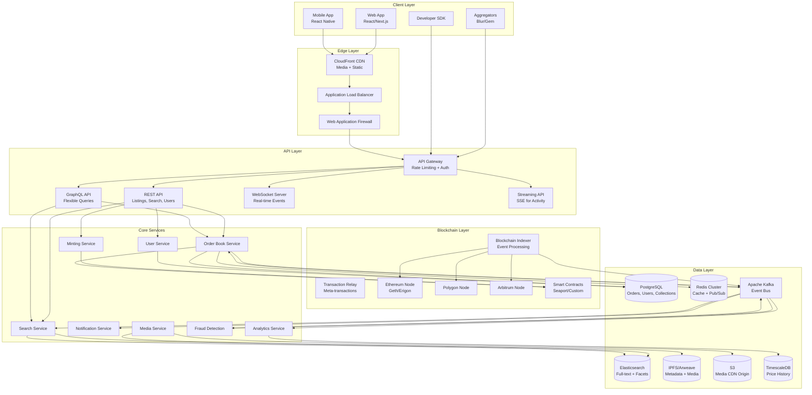
```mermaid
graph TB
    subgraph "Client Layer"
        WEB[Web App<br/>React/Next.js]
        MOB[Mobile App<br/>React Native]
        AGG[Aggregators<br/>Blur/Gem]
        SDK[Developer SDK]
    end

    subgraph "Edge Layer"
        CDN[CloudFront CDN<br/>Media + Static]
        LB[Application Load Balancer]
        WAF[Web Application Firewall]
    end

    subgraph "API Layer"
        GW[API Gateway<br/>Rate Limiting + Auth]
        REST[REST API<br/>Listings, Search, Users]
        GQL[GraphQL API<br/>Flexible Queries]
        WS[WebSocket Server<br/>Real-time Events]
        STREAM[Streaming API<br/>SSE for Activity]
    end

    subgraph "Core Services"
        MINT[Minting Service]
        ORDER[Order Book Service]
        SEARCH[Search Service]
        USER[User Service]
        NOTIF[Notification Service]
        ANALYTICS[Analytics Service]
        FRAUD[Fraud Detection]
        MEDIA[Media Service]
    end

    subgraph "Blockchain Layer"
        IDX[Blockchain Indexer<br/>Event Processing]
        RELAY[Transaction Relay<br/>Meta-transactions]
        NODE_ETH[Ethereum Node<br/>Geth/Erigon]
        NODE_POLY[Polygon Node]
        NODE_ARB[Arbitrum Node]
        SC[Smart Contracts<br/>Seaport/Custom]
    end

    subgraph "Data Layer"
        PG[(PostgreSQL<br/>Orders, Users, Collections)]
        ES[(Elasticsearch<br/>Full-text + Facets)]
        REDIS[(Redis Cluster<br/>Cache + Pub/Sub)]
        IPFS[(IPFS/Arweave<br/>Metadata + Media)]
        S3[(S3<br/>Media CDN Origin)]
        TS[(TimescaleDB<br/>Price History)]
        KAFKA[Apache Kafka<br/>Event Bus]
    end

    WEB --> CDN
    MOB --> CDN
    AGG --> GW
    SDK --> GW
    CDN --> LB
    LB --> WAF
    WAF --> GW

    GW --> REST
    GW --> GQL
    GW --> WS
    GW --> STREAM

    REST --> MINT
    REST --> ORDER
    REST --> SEARCH
    REST --> USER
    GQL --> ORDER
    GQL --> SEARCH

    MINT --> SC
    ORDER --> SC
    ORDER --> KAFKA
    SEARCH --> ES
    MEDIA --> S3
    MEDIA --> IPFS
    FRAUD --> KAFKA

    IDX --> NODE_ETH
    IDX --> NODE_POLY
    IDX --> NODE_ARB
    IDX --> KAFKA

    KAFKA --> ORDER
    KAFKA --> SEARCH
    KAFKA --> ANALYTICS
    KAFKA --> NOTIF
    KAFKA --> FRAUD

    ORDER --> PG
    ORDER --> REDIS
    SEARCH --> ES
    ANALYTICS --> TS
    USER --> PG
```

### Component Responsibilities

| Component | Responsibility |
|-----------|---------------|
| **API Gateway** | Authentication (wallet sig verification), rate limiting, routing |
| **Minting Service** | Collection deployment, NFT creation, lazy minting voucher management |
| **Order Book Service** | Listing CRUD, offer matching, auction management, fee calculation |
| **Search Service** | Elasticsearch queries, faceted search, autocomplete, trending |
| **Blockchain Indexer** | Parse on-chain events, update off-chain state, handle reorgs |
| **Media Service** | Upload, resize, transcode, pin to IPFS, CDN invalidation |
| **Fraud Detection** | Wash trading detection, stolen NFT registry, fake collection flagging |
| **Notification Service** | Email, push, in-app alerts for outbids, sales, price changes |
| **Analytics Service** | Floor price, volume, holder distribution, rarity calculations |
| **Transaction Relay** | Meta-transactions, gas abstraction, bundle submissions |

---

## Subsystem 1 — NFT Minting & Smart Contracts

### ERC-721 vs ERC-1155

| Feature | ERC-721 | ERC-1155 |
|---------|---------|----------|
| Token type | One unique token per ID | Multiple tokens per ID (editions) |
| Gas efficiency | Higher gas per mint | Lower gas via batch operations |
| Use case | 1/1 art, PFPs | Gaming items, music editions |
| Transfer | `transferFrom(from, to, tokenId)` | `safeTransferFrom(from, to, id, amount, data)` |
| Approval | Per-token or operator | Operator only |
| Metadata | `tokenURI(tokenId)` | `uri(id)` |

### Smart Contract Architecture

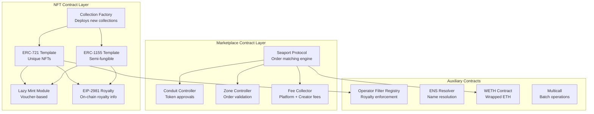
```mermaid
graph TB
    subgraph "NFT Contract Layer"
        FACTORY[Collection Factory<br/>Deploys new collections]
        ERC721[ERC-721 Template<br/>Unique NFTs]
        ERC1155[ERC-1155 Template<br/>Semi-fungible]
        LAZY[Lazy Mint Module<br/>Voucher-based]
        ROYALTY[EIP-2981 Royalty<br/>On-chain royalty info]
    end

    subgraph "Marketplace Contract Layer"
        SEAPORT[Seaport Protocol<br/>Order matching engine]
        CONDUIT[Conduit Controller<br/>Token approvals]
        ZONE[Zone Controller<br/>Order validation]
        FEE[Fee Collector<br/>Platform + Creator fees]
    end

    subgraph "Auxiliary Contracts"
        REGISTRY[Operator Filter Registry<br/>Royalty enforcement]
        RESOLVER[ENS Resolver<br/>Name resolution]
        WETH[WETH Contract<br/>Wrapped ETH]
        MULTI[Multicall<br/>Batch operations]
    end

    FACTORY --> ERC721
    FACTORY --> ERC1155
    ERC721 --> LAZY
    ERC721 --> ROYALTY
    ERC1155 --> LAZY
    ERC1155 --> ROYALTY

    SEAPORT --> CONDUIT
    SEAPORT --> ZONE
    SEAPORT --> FEE

    ERC721 --> REGISTRY
    SEAPORT --> WETH
```

### Lazy Minting Deep Dive

Lazy minting allows creators to list NFTs without paying gas upfront. The NFT is "created" only when someone buys it.

**How It Works:**

1. Creator uploads metadata and signs a minting voucher off-chain
2. Voucher contains: `tokenId`, `tokenURI`, `minPrice`, `royaltyBPS`, `creator`, `signature`
3. Marketplace displays the NFT as if it exists
4. When a buyer purchases, the smart contract:
   a. Verifies the voucher signature
   b. Mints the NFT to the creator
   c. Transfers it to the buyer
   d. Collects payment and distributes royalties

**Solidity Implementation:**

```solidity
// SPDX-License-Identifier: MIT
pragma solidity ^0.8.20;

import "@openzeppelin/contracts/token/ERC721/ERC721.sol";
import "@openzeppelin/contracts/token/ERC721/extensions/ERC721URIStorage.sol";
import "@openzeppelin/contracts/token/common/ERC2981.sol";
import "@openzeppelin/contracts/utils/cryptography/EIP712.sol";
import "@openzeppelin/contracts/utils/cryptography/ECDSA.sol";
import "@openzeppelin/contracts/access/Ownable.sol";

contract LazyMintNFT is ERC721, ERC721URIStorage, ERC2981, EIP712, Ownable {
    using ECDSA for bytes32;

    struct MintVoucher {
        uint256 tokenId;
        string tokenURI;
        uint256 minPrice;
        uint96 royaltyBPS;
        address creator;
        uint256 nonce;
        uint256 expiration;
    }

    bytes32 private constant VOUCHER_TYPEHASH = keccak256(
        "MintVoucher(uint256 tokenId,string tokenURI,uint256 minPrice,"
        "uint96 royaltyBPS,address creator,uint256 nonce,uint256 expiration)"
    );

    mapping(uint256 => bool) private _usedNonces;
    mapping(uint256 => bool) private _mintedTokens;

    uint256 public platformFeeBPS = 250; // 2.5%
    address public feeRecipient;

    event LazyMinted(
        uint256 indexed tokenId,
        address indexed creator,
        address indexed buyer,
        uint256 price
    );

    constructor(
        string memory name,
        string memory symbol,
        address _feeRecipient
    ) ERC721(name, symbol) EIP712(name, "1") Ownable(msg.sender) {
        feeRecipient = _feeRecipient;
    }

    function redeemVoucher(
        MintVoucher calldata voucher,
        bytes calldata signature
    ) external payable {
        require(!_mintedTokens[voucher.tokenId], "Already minted");
        require(!_usedNonces[voucher.nonce], "Nonce used");
        require(block.timestamp <= voucher.expiration, "Voucher expired");
        require(msg.value >= voucher.minPrice, "Insufficient payment");

        // Verify signature
        bytes32 structHash = keccak256(abi.encode(
            VOUCHER_TYPEHASH,
            voucher.tokenId,
            keccak256(bytes(voucher.tokenURI)),
            voucher.minPrice,
            voucher.royaltyBPS,
            voucher.creator,
            voucher.nonce,
            voucher.expiration
        ));

        bytes32 digest = _hashTypedDataV4(structHash);
        address signer = digest.recover(signature);
        require(signer == voucher.creator, "Invalid signature");

        // Mark as used
        _usedNonces[voucher.nonce] = true;
        _mintedTokens[voucher.tokenId] = true;

        // Mint to creator then transfer to buyer
        _safeMint(voucher.creator, voucher.tokenId);
        _setTokenURI(voucher.tokenId, voucher.tokenURI);

        // Set royalty
        _setTokenRoyalty(
            voucher.tokenId,
            voucher.creator,
            voucher.royaltyBPS
        );

        // Transfer to buyer
        _safeTransfer(voucher.creator, msg.sender, voucher.tokenId, "");

        // Distribute payment
        uint256 platformFee = (msg.value * platformFeeBPS) / 10000;
        uint256 creatorPayment = msg.value - platformFee;

        payable(feeRecipient).transfer(platformFee);
        payable(voucher.creator).transfer(creatorPayment);

        emit LazyMinted(
            voucher.tokenId,
            voucher.creator,
            msg.sender,
            msg.value
        );
    }

    // Required overrides
    function tokenURI(uint256 tokenId)
        public view override(ERC721, ERC721URIStorage)
        returns (string memory)
    {
        return super.tokenURI(tokenId);
    }

    function supportsInterface(bytes4 interfaceId)
        public view override(ERC721, ERC721URIStorage, ERC2981)
        returns (bool)
    {
        return super.supportsInterface(interfaceId);
    }
}
```

### Royalties: EIP-2981 and Enforcement Challenges

**EIP-2981 Standard:**

```solidity
interface IERC2981 {
    function royaltyInfo(
        uint256 tokenId,
        uint256 salePrice
    ) external view returns (
        address receiver,
        uint256 royaltyAmount
    );
}
```

**The Royalty Enforcement Problem:**

| Approach | How It Works | Tradeoff |
|----------|-------------|----------|
| **EIP-2981 (voluntary)** | Contract reports royalty info; marketplace chooses to honor it | No enforcement; marketplaces can ignore |
| **Operator Filter Registry** | Blocklist marketplaces that don't pay royalties | Controversial; limits composability |
| **On-chain enforcement** | Transfer function checks royalty payment | Complex; breaks some integrations |
| **0% royalty model** | Blur popularized optional royalties | Creator-unfriendly; race to bottom |
| **Marketplace policy** | Platform enforces via off-chain rules | Centralized; easy to circumvent via direct contract calls |

**Operator Filter Registry Pattern (OpenSea):**

```solidity
abstract contract OperatorFilterer {
    IOperatorFilterRegistry public constant REGISTRY =
        IOperatorFilterRegistry(0x000000000000AAeB6D7670E522A718067333cd4E);

    modifier onlyAllowedOperator(address from) {
        if (from != msg.sender) {
            if (!REGISTRY.isOperatorAllowed(address(this), msg.sender)) {
                revert OperatorNotAllowed(msg.sender);
            }
        }
        _;
    }

    modifier onlyAllowedOperatorApproval(address operator) {
        if (!REGISTRY.isOperatorAllowed(address(this), operator)) {
            revert OperatorNotAllowed(operator);
        }
        _;
    }
}
```

### Batch Minting for Generative Collections

For large generative collections (e.g., 10,000 PFPs), gas-efficient minting is critical:

```solidity
contract EfficientBatchMint is ERC721A {
    // ERC721A by Azuki — optimized for batch minting
    // Single SSTORE for batch instead of per-token

    uint256 public constant MAX_SUPPLY = 10000;
    uint256 public constant MAX_BATCH = 20;
    uint256 public mintPrice = 0.08 ether;

    string private _baseTokenURI;
    bytes32 public merkleRoot; // Allowlist

    enum MintPhase { Closed, Allowlist, Public }
    MintPhase public phase;

    function allowlistMint(
        uint256 quantity,
        bytes32[] calldata proof
    ) external payable {
        require(phase == MintPhase.Allowlist, "Not active");
        require(quantity <= MAX_BATCH, "Too many");
        require(totalSupply() + quantity <= MAX_SUPPLY, "Sold out");
        require(msg.value >= mintPrice * quantity, "Underpaid");

        bytes32 leaf = keccak256(abi.encodePacked(msg.sender));
        require(
            MerkleProof.verify(proof, merkleRoot, leaf),
            "Not on allowlist"
        );

        _mint(msg.sender, quantity);
    }

    function publicMint(uint256 quantity) external payable {
        require(phase == MintPhase.Public, "Not active");
        require(quantity <= MAX_BATCH, "Too many");
        require(totalSupply() + quantity <= MAX_SUPPLY, "Sold out");
        require(msg.value >= mintPrice * quantity, "Underpaid");

        _mint(msg.sender, quantity);
    }
}
```

### Collection Factory Pattern

```solidity
contract CollectionFactory {
    event CollectionCreated(
        address indexed collection,
        address indexed creator,
        string name,
        string symbol,
        CollectionType collectionType
    );

    enum CollectionType { ERC721, ERC721A, ERC1155 }

    mapping(address => address[]) public creatorCollections;

    function createERC721Collection(
        string memory name,
        string memory symbol,
        uint96 royaltyBPS,
        string memory baseURI
    ) external returns (address) {
        MarketplaceERC721 collection = new MarketplaceERC721(
            name,
            symbol,
            msg.sender,
            royaltyBPS,
            baseURI
        );

        creatorCollections[msg.sender].push(address(collection));

        emit CollectionCreated(
            address(collection),
            msg.sender,
            name,
            symbol,
            CollectionType.ERC721
        );

        return address(collection);
    }
}
```

---

## Subsystem 2 — Marketplace Order Book

### Seaport Protocol Internals

Seaport (by OpenSea) is the most widely adopted NFT marketplace protocol. It uses a generalized order format that supports complex trading scenarios.

**Core Concepts:**

| Concept | Description |
|---------|-------------|
| **Order** | A signed intent to trade assets |
| **Offer** | What the offerer is willing to give |
| **Consideration** | What the offerer expects to receive |
| **Fulfiller** | The counterparty who fills the order |
| **Zone** | Optional contract that validates order execution |
| **Conduit** | Pre-approved contract for token transfers |

**Order Structure:**

```solidity
struct OrderComponents {
    address offerer;
    address zone;
    OfferItem[] offer;
    ConsiderationItem[] consideration;
    OrderType orderType;
    uint256 startTime;
    uint256 endTime;
    bytes32 zoneHash;
    uint256 salt;
    bytes32 conduitKey;
    uint256 counter;
}

struct OfferItem {
    ItemType itemType;      // NATIVE, ERC20, ERC721, ERC1155
    address token;
    uint256 identifierOrCriteria;
    uint256 startAmount;
    uint256 endAmount;
}

struct ConsiderationItem {
    ItemType itemType;
    address token;
    uint256 identifierOrCriteria;
    uint256 startAmount;
    uint256 endAmount;
    address payable recipient;
}
```

### Order Book Architecture

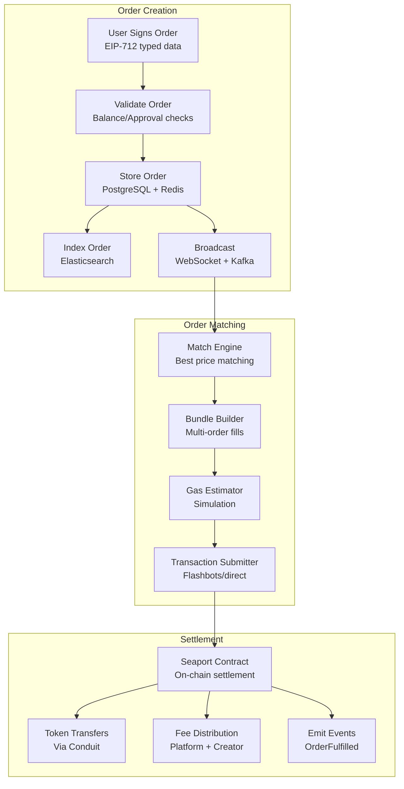
```mermaid
graph TB
    subgraph "Order Creation"
        SIGN[User Signs Order<br/>EIP-712 typed data]
        VALID[Validate Order<br/>Balance/Approval checks]
        STORE[Store Order<br/>PostgreSQL + Redis]
        IDX_ORDER[Index Order<br/>Elasticsearch]
        BROADCAST[Broadcast<br/>WebSocket + Kafka]
    end

    subgraph "Order Matching"
        MATCH[Match Engine<br/>Best price matching]
        BUNDLE[Bundle Builder<br/>Multi-order fills]
        GAS_EST[Gas Estimator<br/>Simulation]
        SUBMIT[Transaction Submitter<br/>Flashbots/direct]
    end

    subgraph "Settlement"
        SEAPORT_C[Seaport Contract<br/>On-chain settlement]
        TRANSFER[Token Transfers<br/>Via Conduit]
        FEE_DIST[Fee Distribution<br/>Platform + Creator]
        EVENT[Emit Events<br/>OrderFulfilled]
    end

    SIGN --> VALID
    VALID --> STORE
    STORE --> IDX_ORDER
    STORE --> BROADCAST

    BROADCAST --> MATCH
    MATCH --> BUNDLE
    BUNDLE --> GAS_EST
    GAS_EST --> SUBMIT

    SUBMIT --> SEAPORT_C
    SEAPORT_C --> TRANSFER
    SEAPORT_C --> FEE_DIST
    SEAPORT_C --> EVENT
```

### Auction Mechanics

**English Auction (Ascending Price):**

| Phase | Description |
|-------|-------------|
| Setup | Seller lists NFT with reserve price and duration |
| Bidding | Bidders place increasing bids; each bid extends auction if near end |
| Settlement | Highest bidder wins; seller can accept or reject if below reserve |
| Transfer | Winner pays; NFT transfers; royalties and fees distributed |

**Dutch Auction (Descending Price):**

| Phase | Description |
|-------|-------------|
| Setup | Seller sets starting price, ending price, and duration |
| Price decay | Price decreases linearly (or exponentially) over time |
| Purchase | First buyer to accept current price wins |
| Settlement | Immediate settlement at accepted price |

**Implementation:**

```solidity
// Dutch auction price calculation
function getCurrentPrice(
    uint256 startPrice,
    uint256 endPrice,
    uint256 startTime,
    uint256 endTime
) public view returns (uint256) {
    if (block.timestamp <= startTime) return startPrice;
    if (block.timestamp >= endTime) return endPrice;

    uint256 elapsed = block.timestamp - startTime;
    uint256 duration = endTime - startTime;
    uint256 priceDiff = startPrice - endPrice;

    return startPrice - (priceDiff * elapsed / duration);
}
```

### Collection & Trait Offers

Collection offers allow bidding on any item in a collection without specifying a token ID:

```
// Seaport criteria-based order
OfferItem {
    itemType: ERC20,
    token: WETH_ADDRESS,
    startAmount: 1 ether,
    endAmount: 1 ether
}

ConsiderationItem {
    itemType: ERC721_WITH_CRITERIA,
    token: BAYC_ADDRESS,
    identifierOrCriteria: merkleRoot, // Root of acceptable token IDs
    startAmount: 1,
    endAmount: 1,
    recipient: bidder
}
```

**Trait Offers:**

Trait offers use a Merkle tree of token IDs matching desired traits:

1. Off-chain: Query all token IDs with trait "Gold Fur"
2. Build Merkle tree of those token IDs
3. Include Merkle root in the order's `identifierOrCriteria`
4. When fulfilling, provide Merkle proof that the specific token ID is in the tree

### Order Priority and Matching Rules

```
Priority Order for Matching:
1. Highest price (for sellers) / Lowest price (for buyers)
2. Earliest creation time (FIFO for same price)
3. Longest expiration (more committed orders)
4. Lower nonce (replay protection ordering)

Matching Algorithm:
- For fixed listings: First valid buyer at listed price
- For auctions: Highest bid at auction end
- For collection offers: Any holder can accept highest offer
- For bundle orders: All items must be available
```

---

## Subsystem 3 — Metadata & Media Storage

### NFT Metadata Standards

**ERC-721 Metadata (OpenSea Standard):**

```json
{
    "name": "Bored Ape #1234",
    "description": "A unique Bored Ape from the BAYC collection",
    "image": "ipfs://QmXxXxXx.../1234.png",
    "animation_url": "ipfs://QmYyYyYy.../1234.mp4",
    "external_url": "https://boredapeyachtclub.com",
    "attributes": [
        {
            "trait_type": "Background",
            "value": "Aquamarine"
        },
        {
            "trait_type": "Fur",
            "value": "Golden Brown"
        },
        {
            "trait_type": "Eyes",
            "value": "Laser Eyes"
        },
        {
            "display_type": "number",
            "trait_type": "Generation",
            "value": 1
        },
        {
            "display_type": "boost_percentage",
            "trait_type": "Power",
            "value": 85
        }
    ]
}
```

### Storage Architecture

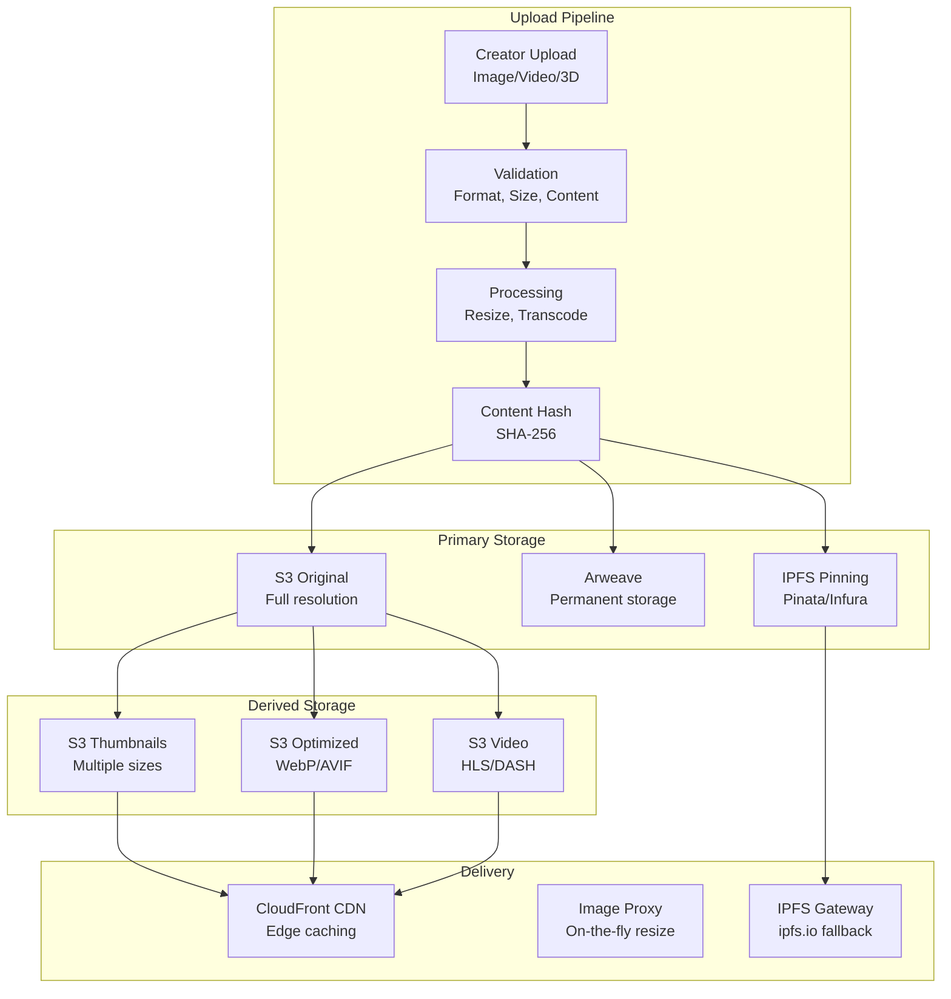
```mermaid
graph TB
    subgraph "Upload Pipeline"
        UP[Creator Upload<br/>Image/Video/3D]
        VAL[Validation<br/>Format, Size, Content]
        PROC[Processing<br/>Resize, Transcode]
        HASH[Content Hash<br/>SHA-256]
    end

    subgraph "Primary Storage"
        IPFS_PIN[IPFS Pinning<br/>Pinata/Infura]
        ARWEAVE[Arweave<br/>Permanent storage]
        S3_ORIG[S3 Original<br/>Full resolution]
    end

    subgraph "Derived Storage"
        S3_THUMB[S3 Thumbnails<br/>Multiple sizes]
        S3_OPT[S3 Optimized<br/>WebP/AVIF]
        S3_VIDEO[S3 Video<br/>HLS/DASH]
    end

    subgraph "Delivery"
        CF[CloudFront CDN<br/>Edge caching]
        IMGPROXY[Image Proxy<br/>On-the-fly resize]
        GATEWAY[IPFS Gateway<br/>ipfs.io fallback]
    end

    UP --> VAL
    VAL --> PROC
    PROC --> HASH

    HASH --> IPFS_PIN
    HASH --> ARWEAVE
    HASH --> S3_ORIG

    S3_ORIG --> S3_THUMB
    S3_ORIG --> S3_OPT
    S3_ORIG --> S3_VIDEO

    S3_THUMB --> CF
    S3_OPT --> CF
    S3_VIDEO --> CF
    IPFS_PIN --> GATEWAY
```

### IPFS vs Arweave vs Centralized Storage

| Feature | IPFS | Arweave | S3/GCS |
|---------|------|---------|--------|
| **Persistence** | Requires pinning; data can disappear | Permanent (200+ year endowment) | Depends on payment |
| **Cost** | ~$0.15/GB/month (Pinata) | ~$5/GB one-time | ~$0.023/GB/month |
| **Addressing** | Content-addressed (CID) | Transaction ID | URL-based |
| **Latency** | Variable (gateway dependent) | Variable | Low (CDN) |
| **Decentralization** | High (P2P network) | High (blockchain) | None (centralized) |
| **Best for** | Standard metadata/media | Permanent archival | Fast delivery |

### Media Processing Pipeline

```
Upload Flow:
1. User uploads file (max 100 MB for images, 500 MB for video)
2. Validate: format (PNG, JPEG, GIF, SVG, MP4, WEBM, GLB), dimensions, no malware
3. Generate content hash (SHA-256)
4. Check for duplicate content (hash lookup)
5. Store original in S3
6. Generate thumbnails:
   - 64x64 (favicon/small grid)
   - 256x256 (collection grid)
   - 512x512 (detail page)
   - 1024x1024 (full view)
7. Convert to WebP/AVIF for modern browsers
8. If video: transcode to HLS (multiple bitrates)
9. If 3D (GLB): generate preview image + optimize mesh
10. Pin to IPFS (async)
11. Optionally upload to Arweave (creator choice)
12. Update metadata with CID/URL
13. Invalidate CDN cache for any updated content
```

### Metadata Refresh and Dynamic NFTs

Dynamic NFTs have metadata that changes based on external conditions:

```
Dynamic NFT Sources:
- On-chain state (game items leveling up)
- Oracle data (weather-based art)
- Time-based (evolving art over seasons)
- Owner interaction (pet NFTs)
- Real-world events (sports outcomes)

Refresh Strategy:
- Periodic crawl: Re-fetch metadata every 24 hours
- On-demand: User triggers refresh via API
- Event-driven: Smart contract emits MetadataUpdate event (EIP-4906)
- Webhook: Creator notifies marketplace of changes
```

**EIP-4906 (Metadata Update Extension):**

```solidity
interface IERC4906 {
    event MetadataUpdate(uint256 _tokenId);
    event BatchMetadataUpdate(uint256 _fromTokenId, uint256 _toTokenId);
}
```

---

## Subsystem 4 — Blockchain Indexing & Search

### Event Indexing Architecture

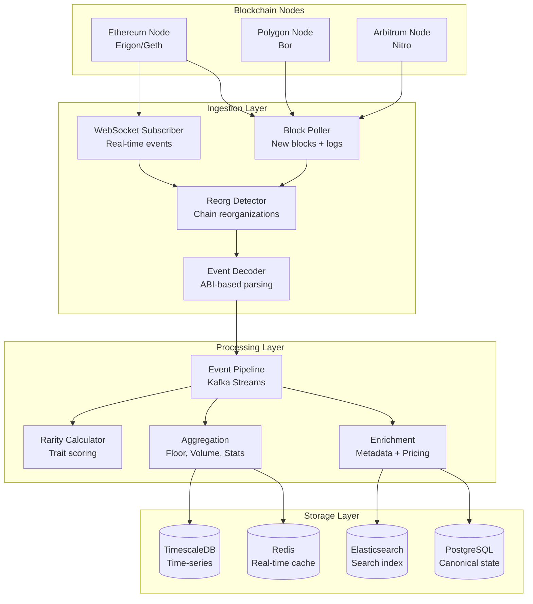
```mermaid
graph TB
    subgraph "Blockchain Nodes"
        ETH_NODE[Ethereum Node<br/>Erigon/Geth]
        POLY_NODE[Polygon Node<br/>Bor]
        ARB_NODE[Arbitrum Node<br/>Nitro]
    end

    subgraph "Ingestion Layer"
        POLLER[Block Poller<br/>New blocks + logs]
        WS_SUB[WebSocket Subscriber<br/>Real-time events]
        REORG[Reorg Detector<br/>Chain reorganizations]
        DECODER[Event Decoder<br/>ABI-based parsing]
    end

    subgraph "Processing Layer"
        PIPELINE[Event Pipeline<br/>Kafka Streams]
        ENRICH[Enrichment<br/>Metadata + Pricing]
        AGGREGATE[Aggregation<br/>Floor, Volume, Stats]
        RARITY[Rarity Calculator<br/>Trait scoring]
    end

    subgraph "Storage Layer"
        PG_IDX[(PostgreSQL<br/>Canonical state)]
        ES_IDX[(Elasticsearch<br/>Search index)]
        REDIS_IDX[(Redis<br/>Real-time cache)]
        TS_IDX[(TimescaleDB<br/>Time-series)]
    end

    ETH_NODE --> POLLER
    ETH_NODE --> WS_SUB
    POLY_NODE --> POLLER
    ARB_NODE --> POLLER

    POLLER --> REORG
    WS_SUB --> REORG
    REORG --> DECODER

    DECODER --> PIPELINE
    PIPELINE --> ENRICH
    PIPELINE --> AGGREGATE
    PIPELINE --> RARITY

    ENRICH --> PG_IDX
    ENRICH --> ES_IDX
    AGGREGATE --> REDIS_IDX
    AGGREGATE --> TS_IDX
```

### Key Events to Index

| Contract | Event | Indexed Data |
|----------|-------|-------------|
| ERC-721 | `Transfer(from, to, tokenId)` | Ownership changes, mints (from=0), burns (to=0) |
| ERC-1155 | `TransferSingle(operator, from, to, id, value)` | Single token transfers |
| ERC-1155 | `TransferBatch(operator, from, to, ids, values)` | Batch transfers |
| Seaport | `OrderFulfilled(orderHash, offerer, zone, recipient, offer, consideration)` | Sales, prices, fees |
| Seaport | `OrderCancelled(orderHash, offerer, zone)` | Cancelled listings |
| ERC-721 | `Approval(owner, approved, tokenId)` | Approval for marketplace |
| ERC-721 | `ApprovalForAll(owner, operator, approved)` | Operator approvals |
| EIP-4906 | `MetadataUpdate(tokenId)` | Metadata refresh triggers |
| WETH | `Deposit(dst, wad)` / `Withdrawal(src, wad)` | WETH wrapping events |

### Handling Chain Reorganizations

```
Reorg Detection Algorithm:
1. For each new block received:
   a. Compare block.parentHash with stored hash of (block.number - 1)
   b. If match: normal processing
   c. If mismatch: REORG detected

2. On reorg detection:
   a. Walk back to find common ancestor block
   b. Mark all events from orphaned blocks as "reverted"
   c. Re-process events from new canonical chain
   d. Update all affected orders, balances, ownership

3. Confirmation depth:
   - Ethereum: Wait 12 blocks (finalized) for high-value operations
   - Polygon: Wait 128 blocks (checkpoint)
   - Optimistic rollups: 7-day challenge period for withdrawals

4. State management:
   - Keep events with confirmation status: pending/confirmed/finalized/reverted
   - Only show "finalized" state in search results
   - Show "pending" with warning badge in UI
```

### Search Architecture

**Elasticsearch Index Mapping:**

```json
{
    "mappings": {
        "properties": {
            "token_id": { "type": "keyword" },
            "contract_address": { "type": "keyword" },
            "chain_id": { "type": "integer" },
            "name": {
                "type": "text",
                "fields": {
                    "keyword": { "type": "keyword" },
                    "autocomplete": {
                        "type": "text",
                        "analyzer": "autocomplete_analyzer"
                    }
                }
            },
            "description": { "type": "text" },
            "collection_name": {
                "type": "text",
                "fields": { "keyword": { "type": "keyword" } }
            },
            "owner": { "type": "keyword" },
            "creator": { "type": "keyword" },
            "attributes": {
                "type": "nested",
                "properties": {
                    "trait_type": { "type": "keyword" },
                    "value": { "type": "keyword" },
                    "display_type": { "type": "keyword" }
                }
            },
            "rarity_score": { "type": "float" },
            "rarity_rank": { "type": "integer" },
            "current_price": { "type": "scaled_float", "scaling_factor": 1e18 },
            "last_sale_price": { "type": "scaled_float", "scaling_factor": 1e18 },
            "floor_price": { "type": "scaled_float", "scaling_factor": 1e18 },
            "listed_at": { "type": "date" },
            "minted_at": { "type": "date" },
            "is_listed": { "type": "boolean" },
            "media_type": { "type": "keyword" },
            "token_standard": { "type": "keyword" },
            "traits_count": { "type": "integer" }
        }
    },
    "settings": {
        "analysis": {
            "analyzer": {
                "autocomplete_analyzer": {
                    "type": "custom",
                    "tokenizer": "autocomplete_tokenizer",
                    "filter": ["lowercase"]
                }
            },
            "tokenizer": {
                "autocomplete_tokenizer": {
                    "type": "edge_ngram",
                    "min_gram": 2,
                    "max_gram": 20,
                    "token_chars": ["letter", "digit"]
                }
            }
        },
        "number_of_shards": 10,
        "number_of_replicas": 2
    }
}
```

### Rarity Scoring

```
Rarity Calculation Methods:

1. Statistical Rarity (simple):
   rarity_score = 1 / (trait_frequency)
   total_rarity = sum of all trait rarities

2. Information Content:
   rarity_score = -log2(trait_frequency)
   Gives more weight to rare traits

3. OpenRarity Standard:
   - Uses information content
   - Handles missing traits
   - Normalizes across collections
   - Accounts for trait count

Algorithm:
For each NFT in collection:
  score = 0
  for each trait_type in collection:
    if NFT has trait_type:
      value = NFT.trait[trait_type]
      frequency = count(value) / total_supply
      score += -log2(frequency)
    else:
      // Missing trait is also a signal
      frequency = count(missing) / total_supply
      score += -log2(frequency)

  NFT.rarity_score = score

Ranking:
Sort all NFTs by rarity_score descending
Assign rank 1 to highest score
```

### Floor Price Calculation

```
Floor Price Algorithm:

Simple Floor:
  floor = MIN(price) WHERE listing.is_active = true

Weighted Floor (handles outliers):
  listings = active listings sorted by price ASC
  // Remove bottom 1% (potential errors)
  // Take average of next 5 lowest
  floor = AVG(listings[1:6])

Trait Floor:
  For each trait_type + value combination:
    trait_floor = MIN(price) WHERE
      listing.is_active = true AND
      NFT.has_trait(trait_type, value)

Real-time updates:
  - New listing below floor → update immediately
  - Sale at floor → recalculate from remaining listings
  - Listing cancelled → recalculate if was floor listing
  - Cache in Redis with 30-second TTL
```

---

## Subsystem 5 — Fraud Detection & Moderation

### Fraud Taxonomy

| Fraud Type | Description | Detection Strategy |
|------------|-------------|-------------------|
| **Wash Trading** | Self-dealing to inflate volume/price | Graph analysis, wallet clustering |
| **Fake Collections** | Copying art and creating lookalike collections | Image similarity, metadata analysis |
| **Stolen NFTs** | Listing NFTs from compromised wallets | Stolen asset registries, velocity checks |
| **Phishing** | Malicious approval/transfer transactions | Transaction simulation, domain blocklist |
| **Bid Manipulation** | Fake high bids to attract sellers | Bid validation, fund verification |
| **Shill Bidding** | Bidding on own items to raise price | Wallet relationship analysis |
| **Rug Pulls** | Abandoning project after mint | Project analysis, social signals |
| **Copyright Infringement** | Using copyrighted art without permission | DMCA process, image fingerprinting |
| **Airdrop Scams** | Sending malicious NFTs that trigger phishing | Contract analysis, blocklisting |

### Wash Trading Detection

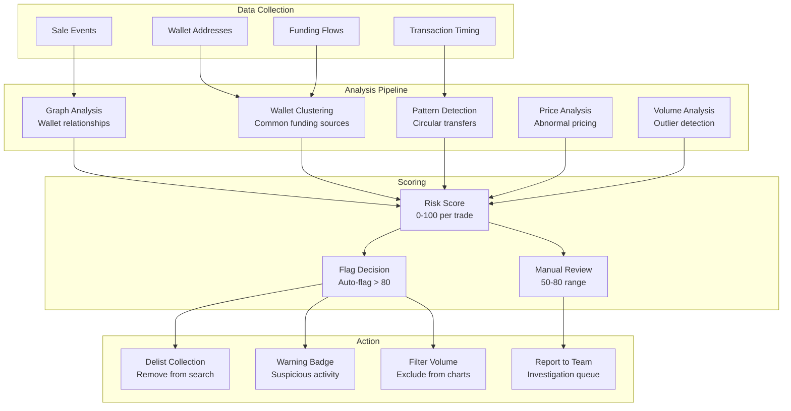
```mermaid
graph TB
    subgraph "Data Collection"
        SALES[Sale Events]
        WALLETS[Wallet Addresses]
        FUNDING[Funding Flows]
        TIMING[Transaction Timing]
    end

    subgraph "Analysis Pipeline"
        GRAPH[Graph Analysis<br/>Wallet relationships]
        CLUSTER[Wallet Clustering<br/>Common funding sources]
        PATTERN[Pattern Detection<br/>Circular transfers]
        PRICE[Price Analysis<br/>Abnormal pricing]
        VOLUME[Volume Analysis<br/>Outlier detection]
    end

    subgraph "Scoring"
        RISK[Risk Score<br/>0-100 per trade]
        FLAG[Flag Decision<br/>Auto-flag > 80]
        REVIEW[Manual Review<br/>50-80 range]
    end

    subgraph "Action"
        DELIST[Delist Collection<br/>Remove from search]
        BADGE[Warning Badge<br/>Suspicious activity]
        FILTER[Filter Volume<br/>Exclude from charts]
        REPORT[Report to Team<br/>Investigation queue]
    end

    SALES --> GRAPH
    WALLETS --> CLUSTER
    FUNDING --> CLUSTER
    TIMING --> PATTERN

    GRAPH --> RISK
    CLUSTER --> RISK
    PATTERN --> RISK
    PRICE --> RISK
    VOLUME --> RISK

    RISK --> FLAG
    RISK --> REVIEW
    FLAG --> DELIST
    FLAG --> BADGE
    FLAG --> FILTER
    REVIEW --> REPORT
```

**Wash Trading Signals:**

```
Signal 1: Circular Transfers
  A → B → C → A with the same token
  Score: +30 if cycle detected within 7 days

Signal 2: Common Funding Source
  Wallets A, B, C all funded from same EOA/exchange deposit
  Score: +25 if shared funding within 30 days of trades

Signal 3: Price Manipulation
  Sale price > 3x floor price with no organic demand
  Score: +20 if price anomaly detected

Signal 4: Timing Patterns
  Multiple trades at regular intervals (bot-like)
  Score: +15 if >5 trades with <60 second intervals

Signal 5: Low Holder Diversity
  Collection has many sales but few unique holders
  Score: +10 if holder_count / sale_count < 0.3

Signal 6: New Wallet Activity
  Wallets < 7 days old engaging in high-value trades
  Score: +15 if wallet age < 7 days and trade > 1 ETH

Composite Score:
  wash_score = weighted_sum(signals)
  if wash_score > 80: auto_flag
  if wash_score > 50: review_queue
  if wash_score > 30: add_warning_badge
```

### Stolen NFT Detection

```
Detection Methods:

1. Stolen Asset Registry Integration:
   - Chainabuse.com reports
   - Community-reported stolen wallets
   - Real-time blocklist updates

2. Velocity-Based Detection:
   - Wallet compromise often leads to rapid listing of all NFTs
   - Alert if wallet lists >20 NFTs within 1 hour (unusual behavior)
   - Cross-reference with approval transactions

3. Phishing Detection:
   - Monitor for setApprovalForAll to known malicious contracts
   - Track mass transfers from single wallet to unknown addresses
   - Check if transfer was preceded by interaction with known phishing site

4. Recovery Process:
   a. Victim reports theft via support + police report
   b. Platform freezes listings from affected wallet
   c. Investigation validates claim (on-chain evidence)
   d. If confirmed: block transfers on platform, notify current holders
   e. Cannot reverse on-chain ownership (platform limitation)
```

### DMCA and Copyright Process

```
DMCA Takedown Process:

1. Copyright holder submits takedown notice:
   - Identification of copyrighted work
   - Identification of infringing NFT/collection
   - Statement of good faith
   - Signature

2. Platform reviews within 48 hours:
   - Verify complainant's identity
   - Compare original vs NFT artwork
   - Check if fair use / transformative

3. If valid:
   - Delist NFT/collection from marketplace
   - Notify creator of takedown
   - Creator can file counter-notice within 14 days

4. Counter-notice:
   - Creator claims non-infringement
   - Platform restores listing after 14 days
   - Unless copyright holder files lawsuit

5. Automated detection:
   - Perceptual hashing of uploaded images
   - Compare against known copyrighted works database
   - Flag for review if similarity > 90%
```

### Content Moderation Pipeline

```
Upload → Content Analysis → Decision → Action

Content Analysis:
1. Image Classification (ML model):
   - NSFW detection (explicit content)
   - Violence detection
   - Hate symbol detection

2. Text Analysis:
   - Name/description profanity filter
   - Hate speech detection
   - Spam/scam keyword detection

3. Copyright Check:
   - Perceptual hash comparison
   - Reverse image search
   - Brand/logo detection

4. Smart Contract Analysis:
   - Known malicious bytecode patterns
   - Honeypot detection (can't sell after buying)
   - Hidden mint functions
   - Excessive fees

Decision Matrix:
| Content Type | Auto Action | Review |
|-------------|-------------|---------|
| NSFW explicit | Block | No |
| Violence | Flag | Yes |
| Copyright match > 95% | Block | Yes |
| Copyright match 80-95% | Flag | Yes |
| Malicious contract | Block | No |
| Spam keywords | Flag | Yes |
```

---

## Data Models

### PostgreSQL Schema

```sql
-- ===========================================
-- CHAIN & NETWORK
-- ===========================================
CREATE TABLE chains (
    chain_id        INTEGER PRIMARY KEY,
    name            VARCHAR(50) NOT NULL,
    rpc_url         TEXT NOT NULL,
    ws_url          TEXT,
    explorer_url    TEXT,
    native_token    VARCHAR(10) NOT NULL,
    block_time_ms   INTEGER NOT NULL,
    finality_blocks INTEGER NOT NULL,
    is_active       BOOLEAN DEFAULT true,
    created_at      TIMESTAMPTZ DEFAULT NOW()
);

-- ===========================================
-- COLLECTIONS
-- ===========================================
CREATE TABLE collections (
    id                  UUID PRIMARY KEY DEFAULT gen_random_uuid(),
    contract_address    VARCHAR(42) NOT NULL,
    chain_id            INTEGER REFERENCES chains(chain_id),
    name                VARCHAR(255) NOT NULL,
    slug                VARCHAR(255) UNIQUE NOT NULL,
    description         TEXT,
    image_url           TEXT,
    banner_url          TEXT,
    external_url        TEXT,
    creator_address     VARCHAR(42) NOT NULL,
    token_standard      VARCHAR(20) NOT NULL CHECK (token_standard IN ('ERC721', 'ERC1155', 'ERC721A')),
    total_supply        INTEGER,
    royalty_bps         INTEGER DEFAULT 0 CHECK (royalty_bps BETWEEN 0 AND 10000),
    royalty_recipient    VARCHAR(42),
    is_verified         BOOLEAN DEFAULT false,
    is_flagged          BOOLEAN DEFAULT false,
    flag_reason         TEXT,
    deploy_tx_hash      VARCHAR(66),
    deployed_at         TIMESTAMPTZ,
    created_at          TIMESTAMPTZ DEFAULT NOW(),
    updated_at          TIMESTAMPTZ DEFAULT NOW(),
    UNIQUE(contract_address, chain_id)
);

CREATE INDEX idx_collections_creator ON collections(creator_address);
CREATE INDEX idx_collections_chain ON collections(chain_id);
CREATE INDEX idx_collections_slug ON collections(slug);
CREATE INDEX idx_collections_verified ON collections(is_verified) WHERE is_verified = true;

-- ===========================================
-- COLLECTION STATS (materialized, updated periodically)
-- ===========================================
CREATE TABLE collection_stats (
    collection_id       UUID PRIMARY KEY REFERENCES collections(id),
    floor_price         NUMERIC(78, 0),  -- wei
    floor_price_token   VARCHAR(42),
    volume_24h          NUMERIC(78, 0),
    volume_7d           NUMERIC(78, 0),
    volume_30d          NUMERIC(78, 0),
    volume_all          NUMERIC(78, 0),
    sales_24h           INTEGER DEFAULT 0,
    sales_7d            INTEGER DEFAULT 0,
    listed_count        INTEGER DEFAULT 0,
    holder_count        INTEGER DEFAULT 0,
    unique_holders_pct  NUMERIC(5, 2),
    avg_price_24h       NUMERIC(78, 0),
    price_change_24h    NUMERIC(10, 4),
    price_change_7d     NUMERIC(10, 4),
    highest_sale        NUMERIC(78, 0),
    updated_at          TIMESTAMPTZ DEFAULT NOW()
);

-- ===========================================
-- TOKENS (NFTs)
-- ===========================================
CREATE TABLE tokens (
    id                  UUID PRIMARY KEY DEFAULT gen_random_uuid(),
    collection_id       UUID REFERENCES collections(id),
    token_id            NUMERIC(78, 0) NOT NULL,
    chain_id            INTEGER REFERENCES chains(chain_id),
    contract_address    VARCHAR(42) NOT NULL,
    owner_address       VARCHAR(42) NOT NULL,
    name                VARCHAR(255),
    description         TEXT,
    image_url           TEXT,
    image_thumbnail_url TEXT,
    animation_url       TEXT,
    metadata_url        TEXT,
    metadata_json       JSONB,
    rarity_score        NUMERIC(20, 10),
    rarity_rank         INTEGER,
    is_flagged          BOOLEAN DEFAULT false,
    is_nsfw             BOOLEAN DEFAULT false,
    is_lazy_minted      BOOLEAN DEFAULT false,
    mint_tx_hash        VARCHAR(66),
    minted_at           TIMESTAMPTZ,
    last_transfer_at    TIMESTAMPTZ,
    created_at          TIMESTAMPTZ DEFAULT NOW(),
    updated_at          TIMESTAMPTZ DEFAULT NOW(),
    UNIQUE(contract_address, token_id, chain_id)
);

CREATE INDEX idx_tokens_collection ON tokens(collection_id);
CREATE INDEX idx_tokens_owner ON tokens(owner_address);
CREATE INDEX idx_tokens_rarity ON tokens(collection_id, rarity_rank);
CREATE INDEX idx_tokens_contract_token ON tokens(contract_address, token_id);

-- ===========================================
-- TOKEN ATTRIBUTES (traits)
-- ===========================================
CREATE TABLE token_attributes (
    id              UUID PRIMARY KEY DEFAULT gen_random_uuid(),
    token_id        UUID REFERENCES tokens(id),
    collection_id   UUID REFERENCES collections(id),
    trait_type      VARCHAR(255) NOT NULL,
    trait_value      VARCHAR(255) NOT NULL,
    display_type    VARCHAR(50),
    frequency       NUMERIC(10, 8),  -- percentage of collection
    created_at      TIMESTAMPTZ DEFAULT NOW()
);

CREATE INDEX idx_attrs_token ON token_attributes(token_id);
CREATE INDEX idx_attrs_collection_trait ON token_attributes(collection_id, trait_type, trait_value);

-- ===========================================
-- ORDERS (Listings, Offers, Bids)
-- ===========================================
CREATE TYPE order_side AS ENUM ('listing', 'offer');
CREATE TYPE order_type AS ENUM ('fixed', 'english_auction', 'dutch_auction', 'collection_offer', 'trait_offer');
CREATE TYPE order_status AS ENUM ('active', 'filled', 'cancelled', 'expired', 'inactive');

CREATE TABLE orders (
    id                  UUID PRIMARY KEY DEFAULT gen_random_uuid(),
    order_hash          VARCHAR(66) UNIQUE NOT NULL,
    chain_id            INTEGER REFERENCES chains(chain_id),
    protocol            VARCHAR(50) NOT NULL DEFAULT 'seaport',
    protocol_version    VARCHAR(10) NOT NULL DEFAULT '1.5',
    side                order_side NOT NULL,
    order_type          order_type NOT NULL,
    status              order_status NOT NULL DEFAULT 'active',
    maker_address       VARCHAR(42) NOT NULL,
    taker_address       VARCHAR(42),  -- null for open orders
    collection_id       UUID REFERENCES collections(id),
    token_id            UUID REFERENCES tokens(id),  -- null for collection offers
    contract_address    VARCHAR(42) NOT NULL,
    token_identifier    NUMERIC(78, 0),  -- null for collection offers
    quantity            INTEGER NOT NULL DEFAULT 1,
    payment_token       VARCHAR(42) NOT NULL,
    price               NUMERIC(78, 0) NOT NULL,  -- in wei
    start_price         NUMERIC(78, 0),  -- for dutch auctions
    end_price           NUMERIC(78, 0),  -- for dutch auctions
    platform_fee_bps    INTEGER DEFAULT 250,
    royalty_fee_bps     INTEGER DEFAULT 0,
    signature           TEXT NOT NULL,
    raw_order           JSONB NOT NULL,
    criteria            JSONB,  -- for collection/trait offers
    zone_address        VARCHAR(42),
    conduit_key         VARCHAR(66),
    salt                NUMERIC(78, 0),
    counter             INTEGER NOT NULL DEFAULT 0,
    nonce               NUMERIC(78, 0),
    start_time          TIMESTAMPTZ NOT NULL,
    end_time            TIMESTAMPTZ NOT NULL,
    filled_at           TIMESTAMPTZ,
    cancelled_at        TIMESTAMPTZ,
    fill_tx_hash        VARCHAR(66),
    cancel_tx_hash      VARCHAR(66),
    source              VARCHAR(100) DEFAULT 'marketplace',
    created_at          TIMESTAMPTZ DEFAULT NOW(),
    updated_at          TIMESTAMPTZ DEFAULT NOW()
);

CREATE INDEX idx_orders_collection_active ON orders(collection_id, status) WHERE status = 'active';
CREATE INDEX idx_orders_token ON orders(token_id, side, status);
CREATE INDEX idx_orders_maker ON orders(maker_address, status);
CREATE INDEX idx_orders_price ON orders(collection_id, price) WHERE status = 'active' AND side = 'listing';
CREATE INDEX idx_orders_expiry ON orders(end_time) WHERE status = 'active';
CREATE INDEX idx_orders_hash ON orders(order_hash);

-- ===========================================
-- AUCTION BIDS
-- ===========================================
CREATE TABLE auction_bids (
    id              UUID PRIMARY KEY DEFAULT gen_random_uuid(),
    order_id        UUID REFERENCES orders(id),
    bidder_address  VARCHAR(42) NOT NULL,
    bid_amount      NUMERIC(78, 0) NOT NULL,
    payment_token   VARCHAR(42) NOT NULL,
    signature       TEXT NOT NULL,
    is_winning      BOOLEAN DEFAULT false,
    created_at      TIMESTAMPTZ DEFAULT NOW()
);

CREATE INDEX idx_bids_order ON auction_bids(order_id, bid_amount DESC);

-- ===========================================
-- EVENTS / ACTIVITY
-- ===========================================
CREATE TYPE event_type AS ENUM (
    'mint', 'transfer', 'sale', 'listing', 'offer',
    'bid', 'cancel_listing', 'cancel_offer',
    'approval', 'metadata_update'
);

CREATE TABLE events (
    id                  UUID PRIMARY KEY DEFAULT gen_random_uuid(),
    event_type          event_type NOT NULL,
    chain_id            INTEGER REFERENCES chains(chain_id),
    collection_id       UUID REFERENCES collections(id),
    token_id            UUID REFERENCES tokens(id),
    contract_address    VARCHAR(42) NOT NULL,
    token_identifier    NUMERIC(78, 0),
    from_address        VARCHAR(42),
    to_address          VARCHAR(42),
    price               NUMERIC(78, 0),
    payment_token       VARCHAR(42),
    quantity            INTEGER DEFAULT 1,
    tx_hash             VARCHAR(66) NOT NULL,
    block_number        BIGINT NOT NULL,
    block_timestamp     TIMESTAMPTZ NOT NULL,
    log_index           INTEGER,
    is_confirmed        BOOLEAN DEFAULT false,
    is_reverted         BOOLEAN DEFAULT false,
    marketplace         VARCHAR(100),
    created_at          TIMESTAMPTZ DEFAULT NOW()
);

CREATE INDEX idx_events_collection ON events(collection_id, event_type, block_timestamp DESC);
CREATE INDEX idx_events_token ON events(token_id, event_type, block_timestamp DESC);
CREATE INDEX idx_events_address ON events(from_address, event_type, block_timestamp DESC);
CREATE INDEX idx_events_block ON events(chain_id, block_number);
CREATE INDEX idx_events_tx ON events(tx_hash);

-- ===========================================
-- USERS / PROFILES
-- ===========================================
CREATE TABLE users (
    id              UUID PRIMARY KEY DEFAULT gen_random_uuid(),
    wallet_address  VARCHAR(42) UNIQUE NOT NULL,
    username        VARCHAR(50) UNIQUE,
    display_name    VARCHAR(100),
    bio             TEXT,
    avatar_url      TEXT,
    banner_url      TEXT,
    ens_name        VARCHAR(255),
    twitter_handle  VARCHAR(50),
    website_url     TEXT,
    is_verified     BOOLEAN DEFAULT false,
    is_banned       BOOLEAN DEFAULT false,
    ban_reason      TEXT,
    nonce           VARCHAR(66) NOT NULL,  -- for wallet auth
    last_login_at   TIMESTAMPTZ,
    created_at      TIMESTAMPTZ DEFAULT NOW(),
    updated_at      TIMESTAMPTZ DEFAULT NOW()
);

CREATE INDEX idx_users_wallet ON users(wallet_address);
CREATE INDEX idx_users_ens ON users(ens_name) WHERE ens_name IS NOT NULL;

-- ===========================================
-- FAVORITES / WATCHLIST
-- ===========================================
CREATE TABLE favorites (
    id              UUID PRIMARY KEY DEFAULT gen_random_uuid(),
    user_id         UUID REFERENCES users(id),
    token_id        UUID REFERENCES tokens(id),
    collection_id   UUID REFERENCES collections(id),
    created_at      TIMESTAMPTZ DEFAULT NOW(),
    UNIQUE(user_id, token_id)
);

-- ===========================================
-- NOTIFICATIONS
-- ===========================================
CREATE TYPE notification_type AS ENUM (
    'outbid', 'sale', 'offer_received', 'offer_accepted',
    'price_drop', 'auction_ending', 'item_sold',
    'transfer_received', 'collection_offer'
);

CREATE TABLE notifications (
    id              UUID PRIMARY KEY DEFAULT gen_random_uuid(),
    user_id         UUID REFERENCES users(id),
    notification_type notification_type NOT NULL,
    title           VARCHAR(255) NOT NULL,
    message         TEXT,
    data            JSONB,
    is_read         BOOLEAN DEFAULT false,
    created_at      TIMESTAMPTZ DEFAULT NOW()
);

CREATE INDEX idx_notifications_user ON notifications(user_id, is_read, created_at DESC);

-- ===========================================
-- LAZY MINT VOUCHERS
-- ===========================================
CREATE TABLE lazy_mint_vouchers (
    id              UUID PRIMARY KEY DEFAULT gen_random_uuid(),
    collection_id   UUID REFERENCES collections(id),
    token_identifier NUMERIC(78, 0) NOT NULL,
    creator_address VARCHAR(42) NOT NULL,
    metadata_url    TEXT NOT NULL,
    min_price       NUMERIC(78, 0) NOT NULL,
    royalty_bps     INTEGER DEFAULT 0,
    signature       TEXT NOT NULL,
    nonce           NUMERIC(78, 0) NOT NULL,
    expiration      TIMESTAMPTZ NOT NULL,
    is_redeemed     BOOLEAN DEFAULT false,
    redeemed_tx_hash VARCHAR(66),
    created_at      TIMESTAMPTZ DEFAULT NOW()
);

-- ===========================================
-- FRAUD / MODERATION
-- ===========================================
CREATE TYPE moderation_status AS ENUM ('pending', 'approved', 'rejected', 'under_review');
CREATE TYPE report_reason AS ENUM (
    'copyright', 'stolen', 'fake_collection', 'spam',
    'nsfw', 'wash_trading', 'phishing', 'other'
);

CREATE TABLE moderation_reports (
    id              UUID PRIMARY KEY DEFAULT gen_random_uuid(),
    reporter_id     UUID REFERENCES users(id),
    collection_id   UUID REFERENCES collections(id),
    token_id        UUID REFERENCES tokens(id),
    reason          report_reason NOT NULL,
    description     TEXT,
    evidence_urls   TEXT[],
    status          moderation_status DEFAULT 'pending',
    reviewer_id     UUID,
    resolution      TEXT,
    created_at      TIMESTAMPTZ DEFAULT NOW(),
    resolved_at     TIMESTAMPTZ
);

CREATE TABLE wash_trading_scores (
    id              UUID PRIMARY KEY DEFAULT gen_random_uuid(),
    collection_id   UUID REFERENCES collections(id),
    event_id        UUID REFERENCES events(id),
    from_address    VARCHAR(42) NOT NULL,
    to_address      VARCHAR(42) NOT NULL,
    score           INTEGER NOT NULL CHECK (score BETWEEN 0 AND 100),
    signals         JSONB NOT NULL,
    is_flagged      BOOLEAN DEFAULT false,
    created_at      TIMESTAMPTZ DEFAULT NOW()
);

-- ===========================================
-- INDEXER STATE
-- ===========================================
CREATE TABLE indexer_state (
    chain_id            INTEGER REFERENCES chains(chain_id),
    last_indexed_block  BIGINT NOT NULL,
    last_finalized_block BIGINT NOT NULL,
    last_indexed_at     TIMESTAMPTZ DEFAULT NOW(),
    is_syncing          BOOLEAN DEFAULT false,
    PRIMARY KEY (chain_id)
);

-- ===========================================
-- PRICE HISTORY (TimescaleDB hypertable)
-- ===========================================
CREATE TABLE price_history (
    time            TIMESTAMPTZ NOT NULL,
    collection_id   UUID NOT NULL,
    chain_id        INTEGER NOT NULL,
    floor_price     NUMERIC(78, 0),
    avg_price       NUMERIC(78, 0),
    volume          NUMERIC(78, 0),
    sales_count     INTEGER,
    listed_count    INTEGER,
    holder_count    INTEGER
);

-- Convert to TimescaleDB hypertable
SELECT create_hypertable('price_history', 'time');
CREATE INDEX idx_price_history_collection ON price_history(collection_id, time DESC);
```

### Solidity Data Structures (On-Chain)

```solidity
// Marketplace Contract — Key Structures

// Order status tracking
mapping(bytes32 => OrderStatus) public orderStatus;

enum OrderStatus {
    OPEN,
    FILLED,
    CANCELLED
}

// Nonce management for order cancellation
mapping(address => uint256) public nonces;

// Conduit approvals
mapping(bytes32 => address) public conduits;

// Zone validation
mapping(address => bool) public approvedZones;

// Fee configuration
struct FeeConfig {
    address recipient;
    uint256 basisPoints;
}

FeeConfig public platformFee;

// Collection royalty override
mapping(address => FeeConfig) public royaltyOverrides;
```

---

## API Design

### REST API Endpoints

```
BASE URL: https://api.marketplace.com/v2

=== Authentication ===
POST   /auth/nonce                    # Get nonce for wallet signature
POST   /auth/verify                   # Verify signature, get JWT
POST   /auth/refresh                  # Refresh JWT token

=== Collections ===
GET    /collections                   # List collections (paginated, filtered)
GET    /collections/:slug             # Get collection details
GET    /collections/:slug/stats       # Get collection stats
GET    /collections/:slug/activity    # Get collection activity feed
GET    /collections/:slug/tokens      # List tokens in collection
GET    /collections/:slug/attributes  # Get trait distribution
GET    /collections/:slug/offers      # Get collection offers
POST   /collections                   # Create new collection
PUT    /collections/:slug             # Update collection metadata

=== Tokens ===
GET    /tokens/:chain/:contract/:tokenId   # Get token details
GET    /tokens/:chain/:contract/:tokenId/offers    # Get offers on token
GET    /tokens/:chain/:contract/:tokenId/history   # Price/transfer history
GET    /tokens/:chain/:contract/:tokenId/similar   # Similar items
POST   /tokens/refresh-metadata            # Trigger metadata refresh

=== Orders ===
GET    /orders                        # Query orders
GET    /orders/:orderHash             # Get order details
POST   /orders                        # Submit new order (listing/offer)
POST   /orders/:orderHash/fulfill     # Build fulfillment transaction
DELETE /orders/:orderHash             # Cancel order (requires signature)
POST   /orders/bulk                   # Submit multiple orders
POST   /orders/validate               # Validate order without submitting

=== Search ===
GET    /search                        # Full-text search
GET    /search/autocomplete           # Autocomplete suggestions
GET    /search/trending               # Trending collections
GET    /search/top-traders            # Top traders leaderboard

=== Users ===
GET    /users/:address                # Get user profile
PUT    /users/:address                # Update profile
GET    /users/:address/tokens         # User's NFT portfolio
GET    /users/:address/activity       # User activity
GET    /users/:address/offers-made    # Offers made by user
GET    /users/:address/offers-received # Offers received
GET    /users/:address/favorites      # User's favorites

=== Minting ===
POST   /mint/lazy                     # Create lazy mint voucher
POST   /mint/deploy-collection        # Deploy new contract
GET    /mint/estimate-gas             # Gas estimation

=== Analytics ===
GET    /analytics/collections/:slug/chart   # Price chart data
GET    /analytics/market-overview           # Market-wide stats
GET    /analytics/whale-tracker             # Large transactions
GET    /analytics/wash-trading/:slug        # Wash trading analysis

=== Notifications ===
GET    /notifications                  # User's notifications
PUT    /notifications/:id/read         # Mark as read
PUT    /notifications/settings         # Notification preferences

=== Reports ===
POST   /reports                        # Submit fraud/copyright report
```

### Smart Contract ABI (Key Functions)

```json
[
    {
        "name": "fulfillBasicOrder",
        "type": "function",
        "inputs": [
            {
                "name": "parameters",
                "type": "tuple",
                "components": [
                    {"name": "considerationToken", "type": "address"},
                    {"name": "considerationIdentifier", "type": "uint256"},
                    {"name": "considerationAmount", "type": "uint256"},
                    {"name": "offerer", "type": "address"},
                    {"name": "zone", "type": "address"},
                    {"name": "offerToken", "type": "address"},
                    {"name": "offerIdentifier", "type": "uint256"},
                    {"name": "offerAmount", "type": "uint256"},
                    {"name": "basicOrderType", "type": "uint8"},
                    {"name": "startTime", "type": "uint256"},
                    {"name": "endTime", "type": "uint256"},
                    {"name": "zoneHash", "type": "bytes32"},
                    {"name": "salt", "type": "uint256"},
                    {"name": "offererConduitKey", "type": "bytes32"},
                    {"name": "fulfillerConduitKey", "type": "bytes32"},
                    {"name": "totalOriginalAdditionalRecipients", "type": "uint256"},
                    {"name": "additionalRecipients", "type": "tuple[]"},
                    {"name": "signature", "type": "bytes"}
                ]
            }
        ],
        "outputs": [{"name": "fulfilled", "type": "bool"}]
    },
    {
        "name": "fulfillOrder",
        "type": "function",
        "inputs": [
            {"name": "order", "type": "tuple"},
            {"name": "fulfillerConduitKey", "type": "bytes32"}
        ],
        "outputs": [{"name": "fulfilled", "type": "bool"}]
    },
    {
        "name": "matchOrders",
        "type": "function",
        "inputs": [
            {"name": "orders", "type": "tuple[]"},
            {"name": "fulfillments", "type": "tuple[]"}
        ],
        "outputs": [{"name": "executions", "type": "tuple[]"}]
    },
    {
        "name": "cancel",
        "type": "function",
        "inputs": [
            {"name": "orders", "type": "tuple[]"}
        ],
        "outputs": [{"name": "cancelled", "type": "bool"}]
    },
    {
        "name": "incrementCounter",
        "type": "function",
        "inputs": [],
        "outputs": [{"name": "newCounter", "type": "uint256"}]
    },
    {
        "name": "getOrderStatus",
        "type": "function",
        "inputs": [{"name": "orderHash", "type": "bytes32"}],
        "outputs": [
            {"name": "isValidated", "type": "bool"},
            {"name": "isCancelled", "type": "bool"},
            {"name": "totalFilled", "type": "uint256"},
            {"name": "totalSize", "type": "uint256"}
        ]
    }
]
```

### WebSocket API

```
WebSocket URL: wss://stream.marketplace.com/v2

=== Subscribe ===
{
    "type": "subscribe",
    "channels": [
        {
            "name": "collection_activity",
            "params": { "slug": "boredapeyachtclub" }
        },
        {
            "name": "token_events",
            "params": {
                "contract": "0xBC4CA0EdA7647A8aB7C2061c2E118A18a936f13D",
                "token_id": "1234"
            }
        },
        {
            "name": "floor_price",
            "params": { "slugs": ["bayc", "cryptopunks", "azuki"] }
        },
        {
            "name": "user_notifications",
            "params": { "address": "0x..." }
        }
    ]
}

=== Event Messages ===
{
    "channel": "collection_activity",
    "event": "sale",
    "data": {
        "collection_slug": "boredapeyachtclub",
        "token_id": "1234",
        "price": "85000000000000000000",
        "payment_token": "ETH",
        "from": "0xABC...",
        "to": "0xDEF...",
        "tx_hash": "0x123...",
        "timestamp": "2026-03-24T10:30:00Z"
    }
}

{
    "channel": "floor_price",
    "event": "update",
    "data": {
        "collection_slug": "boredapeyachtclub",
        "floor_price": "83500000000000000000",
        "change_pct": -1.77,
        "timestamp": "2026-03-24T10:30:05Z"
    }
}
```

### GraphQL Schema (Excerpt)

```graphql
type Query {
    collection(slug: String!): Collection
    token(contract: String!, tokenId: String!, chainId: Int!): Token
    orders(
        collectionSlug: String
        tokenId: String
        side: OrderSide
        status: OrderStatus
        first: Int
        after: String
    ): OrderConnection!
    searchTokens(
        query: String
        filters: TokenFilterInput
        sort: TokenSortInput
        first: Int
        after: String
    ): TokenConnection!
}

type Collection {
    id: ID!
    name: String!
    slug: String!
    contractAddress: String!
    chainId: Int!
    totalSupply: Int
    stats: CollectionStats!
    tokens(first: Int, after: String, filters: TokenFilterInput): TokenConnection!
    attributes: [TraitDistribution!]!
    activity(first: Int, eventTypes: [EventType!]): EventConnection!
    offers: [Order!]!
}

type Token {
    id: ID!
    tokenId: String!
    name: String
    description: String
    imageUrl: String
    animationUrl: String
    owner: User!
    collection: Collection!
    attributes: [TokenAttribute!]!
    rarityScore: Float
    rarityRank: Int
    listings: [Order!]!
    offers: [Order!]!
    priceHistory: [PricePoint!]!
    transferHistory: [Event!]!
}

type Order {
    id: ID!
    orderHash: String!
    side: OrderSide!
    orderType: OrderType!
    status: OrderStatus!
    maker: User!
    price: BigInt!
    paymentToken: Token!
    startTime: DateTime!
    endTime: DateTime!
    createdAt: DateTime!
}

input TokenFilterInput {
    traits: [TraitFilterInput!]
    priceMin: BigInt
    priceMax: BigInt
    paymentToken: String
    isListed: Boolean
    rarityMin: Int
    rarityMax: Int
    chains: [Int!]
}
```

---

## Indexing Strategy

### Database Indexing

```sql
-- High-priority composite indexes for common queries

-- "Show me listed items in a collection sorted by price"
CREATE INDEX idx_orders_collection_price_active
ON orders(collection_id, price ASC)
WHERE status = 'active' AND side = 'listing';

-- "Show me all active offers for a token"
CREATE INDEX idx_orders_token_offers
ON orders(token_id, price DESC)
WHERE status = 'active' AND side = 'offer';

-- "Show me my active listings"
CREATE INDEX idx_orders_maker_listings
ON orders(maker_address, created_at DESC)
WHERE status = 'active' AND side = 'listing';

-- "Show me recent sales in a collection"
CREATE INDEX idx_events_collection_sales
ON events(collection_id, block_timestamp DESC)
WHERE event_type = 'sale';

-- "Show me tokens owned by address"
CREATE INDEX idx_tokens_owner_collection
ON tokens(owner_address, collection_id);

-- "Show me tokens by rarity in a collection"
CREATE INDEX idx_tokens_rarity_listed
ON tokens(collection_id, rarity_rank ASC)
WHERE rarity_rank IS NOT NULL;

-- Partial index for expiring orders (cleanup job)
CREATE INDEX idx_orders_expiring
ON orders(end_time)
WHERE status = 'active' AND end_time < NOW() + INTERVAL '1 hour';

-- BRIN index for time-series events (block number is always increasing)
CREATE INDEX idx_events_block_brin ON events USING BRIN (block_number);
```

### Elasticsearch Indexing Strategy

```
Index Architecture:
- nft_tokens_{chain_id}     # Per-chain token index
- nft_collections            # Global collection index
- nft_events_{chain_id}      # Per-chain event index

Indexing Pipeline:
1. Kafka consumer reads token/event updates
2. Batch documents (100 per batch, 1 second flush)
3. Bulk index to Elasticsearch
4. Refresh interval: 5 seconds (near real-time)

Shard Strategy:
- nft_tokens_1 (Ethereum):  10 shards x 2 replicas (largest)
- nft_tokens_137 (Polygon):  5 shards x 2 replicas
- nft_collections:            3 shards x 2 replicas
- nft_events_*:               Time-based ILM (hot/warm/cold)

Search Optimizations:
- field_data for aggregations on trait_type/trait_value
- doc_values for numeric sorting (price, rarity)
- _source filtering to reduce payload size
- Profile slow queries > 200ms
```

---

## Caching Strategy

### Cache Layers

```
Layer 1: CDN Cache (CloudFront)
├── NFT media (images, videos): 7 days TTL
├── Collection thumbnails: 24 hours TTL
├── Static assets: 30 days TTL
└── API responses (public): 30 seconds TTL

Layer 2: Application Cache (Redis Cluster)
├── Collection floor prices: 30 second TTL
├── Collection stats: 60 second TTL
├── Token ownership: 5 minute TTL (invalidated on transfer)
├── User profiles: 10 minute TTL
├── Order book snapshots: 30 second TTL
├── Search autocomplete: 5 minute TTL
├── Trending collections: 60 second TTL
├── Rate limiting counters: sliding window
└── Session tokens: 24 hour TTL

Layer 3: Local Cache (in-process)
├── Chain configuration: permanent until restart
├── Contract ABIs: permanent until restart
├── Frequently accessed collection metadata: 60 second TTL
└── Hot token metadata: 30 second TTL
```

### Cache Invalidation Strategy

```
Event-Driven Invalidation:
1. Blockchain event ingested (e.g., Transfer)
2. Event published to Kafka
3. Cache invalidation consumer:
   a. Delete token ownership cache
   b. Delete collection stats cache (if floor affected)
   c. Delete user portfolio cache (old and new owner)
   d. Publish WebSocket update

Pattern: Write-Through for Critical Data
- Order creation: write to DB + cache simultaneously
- Floor price: update cache atomically on each listing/sale

Pattern: Cache-Aside for Read-Heavy Data
- Token metadata: check cache → miss → query DB → populate cache
- Collection attributes: check cache → miss → query ES → populate cache

Redis Data Structures:
- Floor prices: SORTED SET (collection_id → floor_price)
- Active listings: SORTED SET per collection (price → order_hash)
- User notifications: LIST (FIFO, capped at 100)
- Rate limits: STRING with INCR + EXPIRE
- Trending: SORTED SET with time-decayed scores
```

---

## Queue Architecture

### Kafka Topic Design

```
Topics:
├── blockchain.events.{chain_id}          # Raw blockchain events
│   ├── Partitions: 20 per chain
│   ├── Key: contract_address
│   └── Retention: 7 days
│
├── orders.created                         # New order submissions
│   ├── Partitions: 10
│   ├── Key: collection_id
│   └── Retention: 3 days
│
├── orders.filled                          # Filled orders (sales)
│   ├── Partitions: 10
│   ├── Key: collection_id
│   └── Retention: 30 days
│
├── orders.cancelled                       # Cancelled orders
│   ├── Partitions: 5
│   ├── Key: order_hash
│   └── Retention: 3 days
│
├── metadata.refresh                       # Metadata refresh requests
│   ├── Partitions: 5
│   ├── Key: contract_address + token_id
│   └── Retention: 1 day
│
├── search.index                           # Search index updates
│   ├── Partitions: 10
│   ├── Key: document_id
│   └── Retention: 1 day
│
├── notifications.send                     # Notification dispatch
│   ├── Partitions: 5
│   ├── Key: user_id
│   └── Retention: 1 day
│
├── analytics.events                       # Analytics pipeline
│   ├── Partitions: 10
│   ├── Key: collection_id
│   └── Retention: 30 days
│
├── fraud.analysis                         # Fraud detection pipeline
│   ├── Partitions: 5
│   ├── Key: tx_hash
│   └── Retention: 7 days
│
└── cache.invalidation                     # Cache invalidation signals
    ├── Partitions: 10
    ├── Key: cache_key_prefix
    └── Retention: 1 hour

Consumer Groups:
- indexer-service          → blockchain.events.*
- order-service            → orders.*
- search-indexer           → search.index
- notification-service     → notifications.send
- analytics-service        → analytics.events
- fraud-service            → fraud.analysis
- cache-invalidator        → cache.invalidation
```

### Dead Letter Queue Strategy

```
DLQ Topics:
- dlq.blockchain.events    # Failed event processing
- dlq.orders               # Failed order processing
- dlq.metadata             # Failed metadata fetches
- dlq.notifications        # Failed notification delivery

Retry Policy:
1st retry: 1 minute delay
2nd retry: 5 minute delay
3rd retry: 30 minute delay
4th retry: 2 hour delay
5th retry: → DLQ (manual investigation)

DLQ Processing:
- Alert on DLQ depth > 100
- Daily review of DLQ items
- Manual replay after fix
- Metrics: DLQ ingestion rate, processing lag
```

---

## State Machines

### Order Lifecycle State Machine

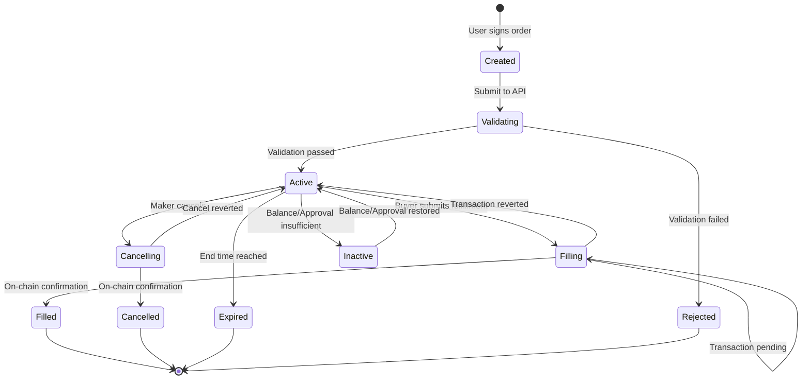
```mermaid
stateDiagram-v2
    [*] --> Created : User signs order
    Created --> Validating : Submit to API
    Validating --> Active : Validation passed
    Validating --> Rejected : Validation failed

    Active --> Filling : Buyer submits fulfillment
    Active --> Cancelling : Maker cancels
    Active --> Expired : End time reached
    Active --> Inactive : Balance/Approval insufficient

    Filling --> Filled : On-chain confirmation
    Filling --> Active : Transaction reverted
    Filling --> Filling : Transaction pending

    Cancelling --> Cancelled : On-chain confirmation
    Cancelling --> Active : Cancel reverted

    Inactive --> Active : Balance/Approval restored

    Filled --> [*]
    Cancelled --> [*]
    Expired --> [*]
    Rejected --> [*]
```

### Auction State Machine

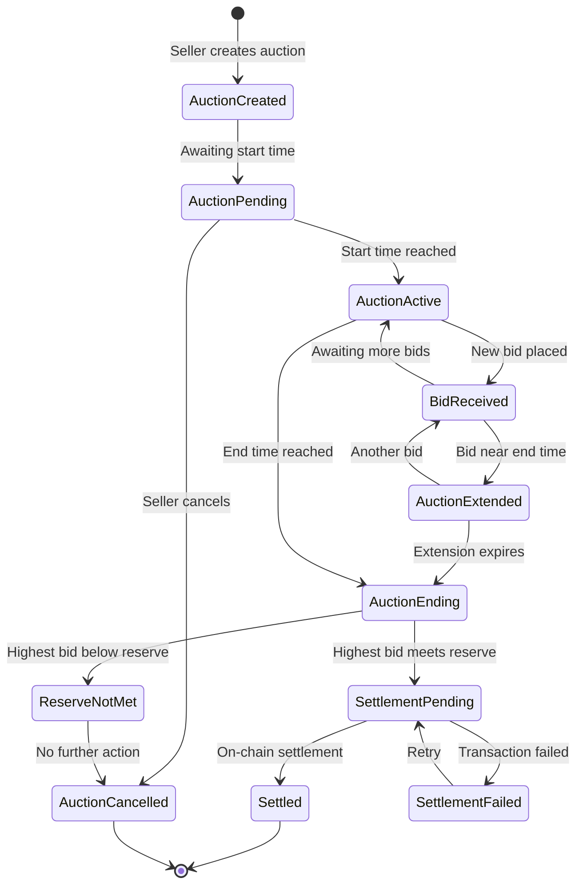
```mermaid
stateDiagram-v2
    [*] --> AuctionCreated : Seller creates auction
    AuctionCreated --> AuctionPending : Awaiting start time

    AuctionPending --> AuctionActive : Start time reached
    AuctionPending --> AuctionCancelled : Seller cancels

    AuctionActive --> BidReceived : New bid placed
    BidReceived --> AuctionActive : Awaiting more bids
    BidReceived --> AuctionExtended : Bid near end time
    AuctionExtended --> BidReceived : Another bid
    AuctionExtended --> AuctionEnding : Extension expires

    AuctionActive --> AuctionEnding : End time reached
    AuctionEnding --> ReserveNotMet : Highest bid below reserve
    AuctionEnding --> SettlementPending : Highest bid meets reserve

    SettlementPending --> Settled : On-chain settlement
    SettlementPending --> SettlementFailed : Transaction failed
    SettlementFailed --> SettlementPending : Retry

    ReserveNotMet --> AuctionCancelled : No further action
    Settled --> [*]
    AuctionCancelled --> [*]
```

### NFT Minting State Machine

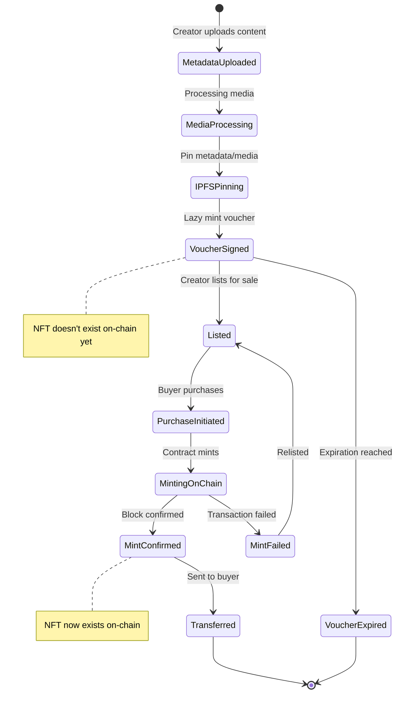
```mermaid
stateDiagram-v2
    [*] --> MetadataUploaded : Creator uploads content
    MetadataUploaded --> MediaProcessing : Processing media
    MediaProcessing --> IPFSPinning : Pin metadata/media
    IPFSPinning --> VoucherSigned : Lazy mint voucher

    VoucherSigned --> Listed : Creator lists for sale
    VoucherSigned --> VoucherExpired : Expiration reached

    Listed --> PurchaseInitiated : Buyer purchases
    PurchaseInitiated --> MintingOnChain : Contract mints
    MintingOnChain --> MintConfirmed : Block confirmed
    MintingOnChain --> MintFailed : Transaction failed
    MintFailed --> Listed : Relisted

    MintConfirmed --> Transferred : Sent to buyer
    Transferred --> [*]
    VoucherExpired --> [*]

    note right of VoucherSigned : NFT doesn't exist on-chain yet
    note right of MintConfirmed : NFT now exists on-chain
```

### Collection Deployment State Machine

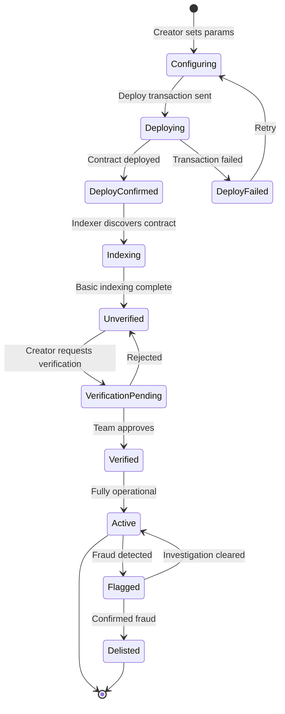
```mermaid
stateDiagram-v2
    [*] --> Configuring : Creator sets params
    Configuring --> Deploying : Deploy transaction sent
    Deploying --> DeployConfirmed : Contract deployed
    Deploying --> DeployFailed : Transaction failed
    DeployFailed --> Configuring : Retry

    DeployConfirmed --> Indexing : Indexer discovers contract
    Indexing --> Unverified : Basic indexing complete
    Unverified --> VerificationPending : Creator requests verification
    VerificationPending --> Verified : Team approves
    VerificationPending --> Unverified : Rejected

    Verified --> Active : Fully operational
    Active --> Flagged : Fraud detected
    Flagged --> Active : Investigation cleared
    Flagged --> Delisted : Confirmed fraud

    Active --> [*]
    Delisted --> [*]
```

### Fraud Investigation State Machine

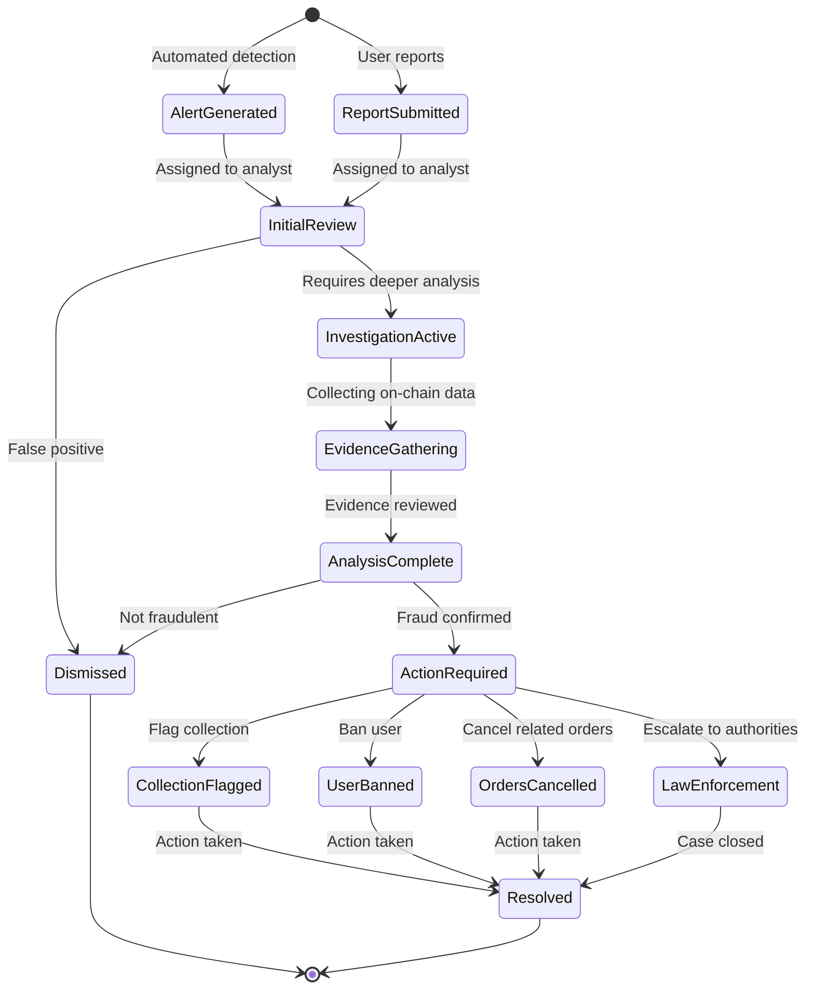
```mermaid
stateDiagram-v2
    [*] --> AlertGenerated : Automated detection
    [*] --> ReportSubmitted : User reports

    AlertGenerated --> InitialReview : Assigned to analyst
    ReportSubmitted --> InitialReview : Assigned to analyst

    InitialReview --> InvestigationActive : Requires deeper analysis
    InitialReview --> Dismissed : False positive

    InvestigationActive --> EvidenceGathering : Collecting on-chain data
    EvidenceGathering --> AnalysisComplete : Evidence reviewed
    AnalysisComplete --> ActionRequired : Fraud confirmed
    AnalysisComplete --> Dismissed : Not fraudulent

    ActionRequired --> CollectionFlagged : Flag collection
    ActionRequired --> UserBanned : Ban user
    ActionRequired --> OrdersCancelled : Cancel related orders
    ActionRequired --> LawEnforcement : Escalate to authorities

    CollectionFlagged --> Resolved : Action taken
    UserBanned --> Resolved : Action taken
    OrdersCancelled --> Resolved : Action taken
    LawEnforcement --> Resolved : Case closed

    Dismissed --> [*]
    Resolved --> [*]
```

---

## Sequence Diagrams

### SD-1: NFT Purchase (Fixed Price Listing)

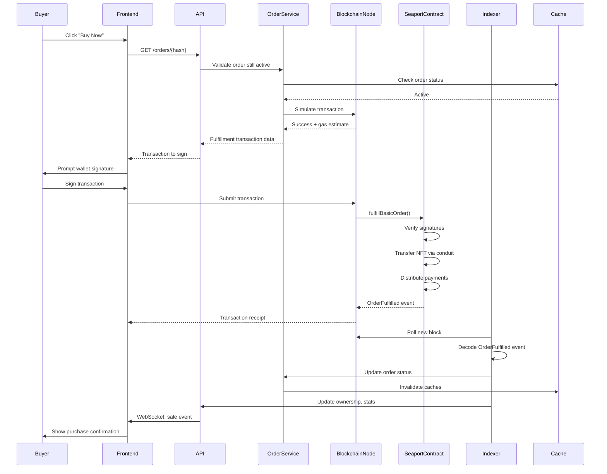
```mermaid
sequenceDiagram
    participant Buyer
    participant Frontend
    participant API
    participant OrderService
    participant BlockchainNode
    participant SeaportContract
    participant Indexer
    participant Cache

    Buyer->>Frontend: Click "Buy Now"
    Frontend->>API: GET /orders/{hash}
    API->>OrderService: Validate order still active
    OrderService->>Cache: Check order status
    Cache-->>OrderService: Active

    OrderService->>BlockchainNode: Simulate transaction
    BlockchainNode-->>OrderService: Success + gas estimate
    OrderService-->>API: Fulfillment transaction data
    API-->>Frontend: Transaction to sign

    Frontend->>Buyer: Prompt wallet signature
    Buyer->>Frontend: Sign transaction
    Frontend->>BlockchainNode: Submit transaction

    BlockchainNode->>SeaportContract: fulfillBasicOrder()
    SeaportContract->>SeaportContract: Verify signatures
    SeaportContract->>SeaportContract: Transfer NFT via conduit
    SeaportContract->>SeaportContract: Distribute payments
    SeaportContract-->>BlockchainNode: OrderFulfilled event

    BlockchainNode-->>Frontend: Transaction receipt

    Indexer->>BlockchainNode: Poll new block
    Indexer->>Indexer: Decode OrderFulfilled event
    Indexer->>OrderService: Update order status
    OrderService->>Cache: Invalidate caches
    Indexer->>API: Update ownership, stats
    API->>Frontend: WebSocket: sale event
    Frontend->>Buyer: Show purchase confirmation
```

### SD-2: Lazy Minting Flow

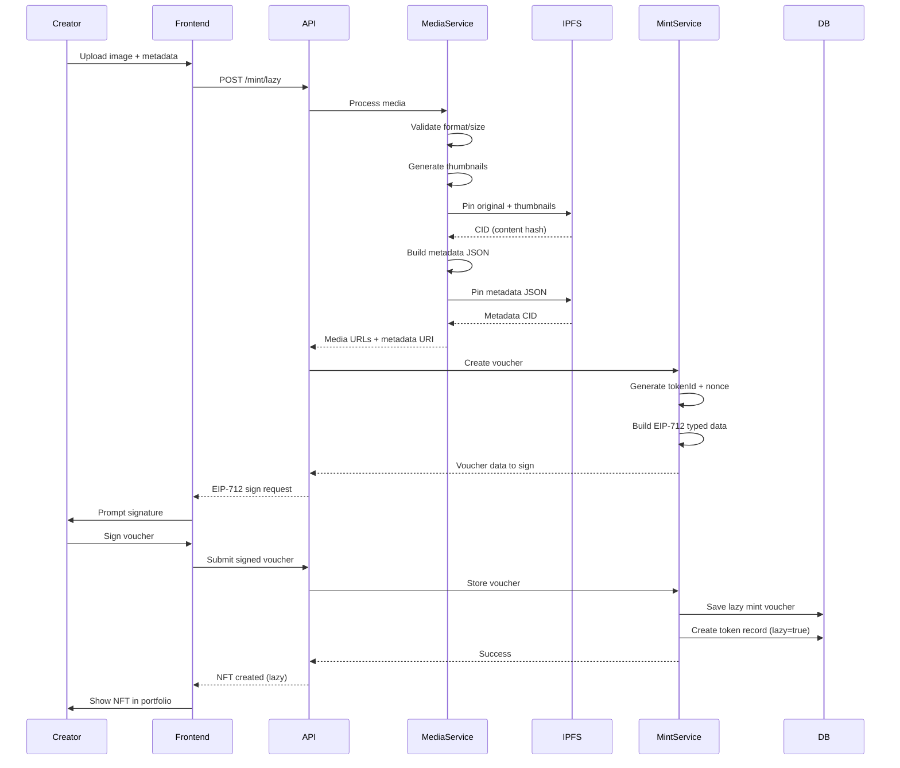
```mermaid
sequenceDiagram
    participant Creator
    participant Frontend
    participant API
    participant MediaService
    participant IPFS
    participant MintService
    participant DB

    Creator->>Frontend: Upload image + metadata
    Frontend->>API: POST /mint/lazy
    API->>MediaService: Process media

    MediaService->>MediaService: Validate format/size
    MediaService->>MediaService: Generate thumbnails
    MediaService->>IPFS: Pin original + thumbnails
    IPFS-->>MediaService: CID (content hash)

    MediaService->>MediaService: Build metadata JSON
    MediaService->>IPFS: Pin metadata JSON
    IPFS-->>MediaService: Metadata CID

    MediaService-->>API: Media URLs + metadata URI

    API->>MintService: Create voucher
    MintService->>MintService: Generate tokenId + nonce
    MintService->>MintService: Build EIP-712 typed data
    MintService-->>API: Voucher data to sign

    API-->>Frontend: EIP-712 sign request
    Frontend->>Creator: Prompt signature
    Creator->>Frontend: Sign voucher
    Frontend->>API: Submit signed voucher

    API->>MintService: Store voucher
    MintService->>DB: Save lazy mint voucher
    MintService->>DB: Create token record (lazy=true)
    MintService-->>API: Success

    API-->>Frontend: NFT created (lazy)
    Frontend->>Creator: Show NFT in portfolio
```

### SD-3: Collection Offer Acceptance

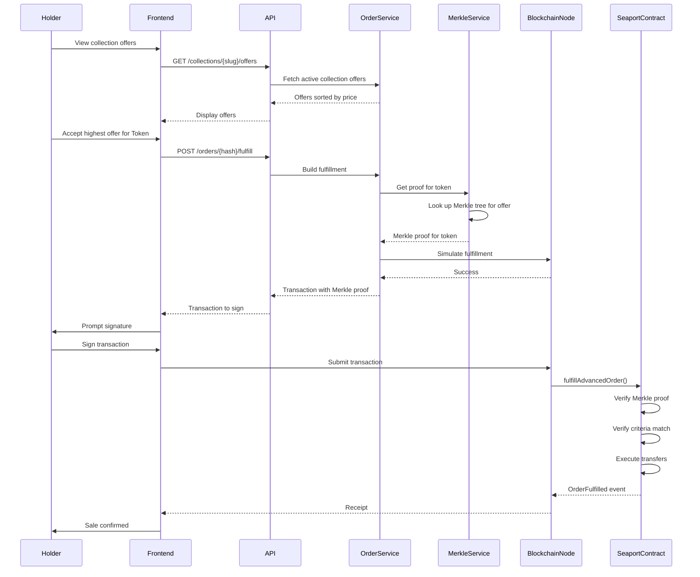
```mermaid
sequenceDiagram
    participant Holder
    participant Frontend
    participant API
    participant OrderService
    participant MerkleService
    participant BlockchainNode
    participant SeaportContract

    Holder->>Frontend: View collection offers
    Frontend->>API: GET /collections/{slug}/offers
    API->>OrderService: Fetch active collection offers
    OrderService-->>API: Offers sorted by price
    API-->>Frontend: Display offers

    Holder->>Frontend: Accept highest offer for Token #1234
    Frontend->>API: POST /orders/{hash}/fulfill
    API->>OrderService: Build fulfillment

    OrderService->>MerkleService: Get proof for token #1234
    MerkleService->>MerkleService: Look up Merkle tree for offer
    MerkleService-->>OrderService: Merkle proof for token #1234

    OrderService->>BlockchainNode: Simulate fulfillment
    BlockchainNode-->>OrderService: Success
    OrderService-->>API: Transaction with Merkle proof

    API-->>Frontend: Transaction to sign
    Frontend->>Holder: Prompt signature
    Holder->>Frontend: Sign transaction
    Frontend->>BlockchainNode: Submit transaction

    BlockchainNode->>SeaportContract: fulfillAdvancedOrder()
    SeaportContract->>SeaportContract: Verify Merkle proof
    SeaportContract->>SeaportContract: Verify criteria match
    SeaportContract->>SeaportContract: Execute transfers
    SeaportContract-->>BlockchainNode: OrderFulfilled event

    BlockchainNode-->>Frontend: Receipt
    Frontend->>Holder: Sale confirmed
```

### SD-4: Blockchain Indexing with Reorg Handling

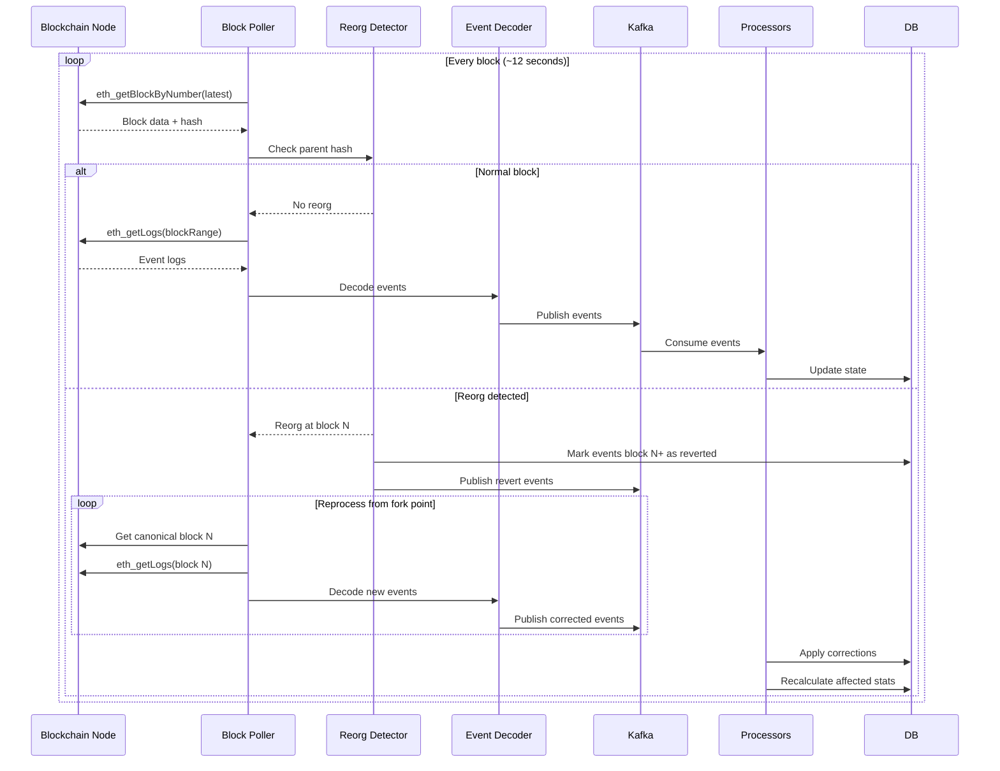
```mermaid
sequenceDiagram
    participant Node as Blockchain Node
    participant Poller as Block Poller
    participant ReorgDetector as Reorg Detector
    participant Decoder as Event Decoder
    participant Kafka
    participant Processors
    participant DB

    loop Every block (~12 seconds)
        Poller->>Node: eth_getBlockByNumber(latest)
        Node-->>Poller: Block data + hash

        Poller->>ReorgDetector: Check parent hash
        alt Normal block
            ReorgDetector-->>Poller: No reorg
            Poller->>Node: eth_getLogs(blockRange)
            Node-->>Poller: Event logs
            Poller->>Decoder: Decode events
            Decoder->>Kafka: Publish events
            Kafka->>Processors: Consume events
            Processors->>DB: Update state
        else Reorg detected
            ReorgDetector-->>Poller: Reorg at block N
            ReorgDetector->>DB: Mark events block N+ as reverted
            ReorgDetector->>Kafka: Publish revert events

            loop Reprocess from fork point
                Poller->>Node: Get canonical block N
                Poller->>Node: eth_getLogs(block N)
                Poller->>Decoder: Decode new events
                Decoder->>Kafka: Publish corrected events
            end

            Processors->>DB: Apply corrections
            Processors->>DB: Recalculate affected stats
        end
    end
```

### SD-5: Fraud Detection Pipeline

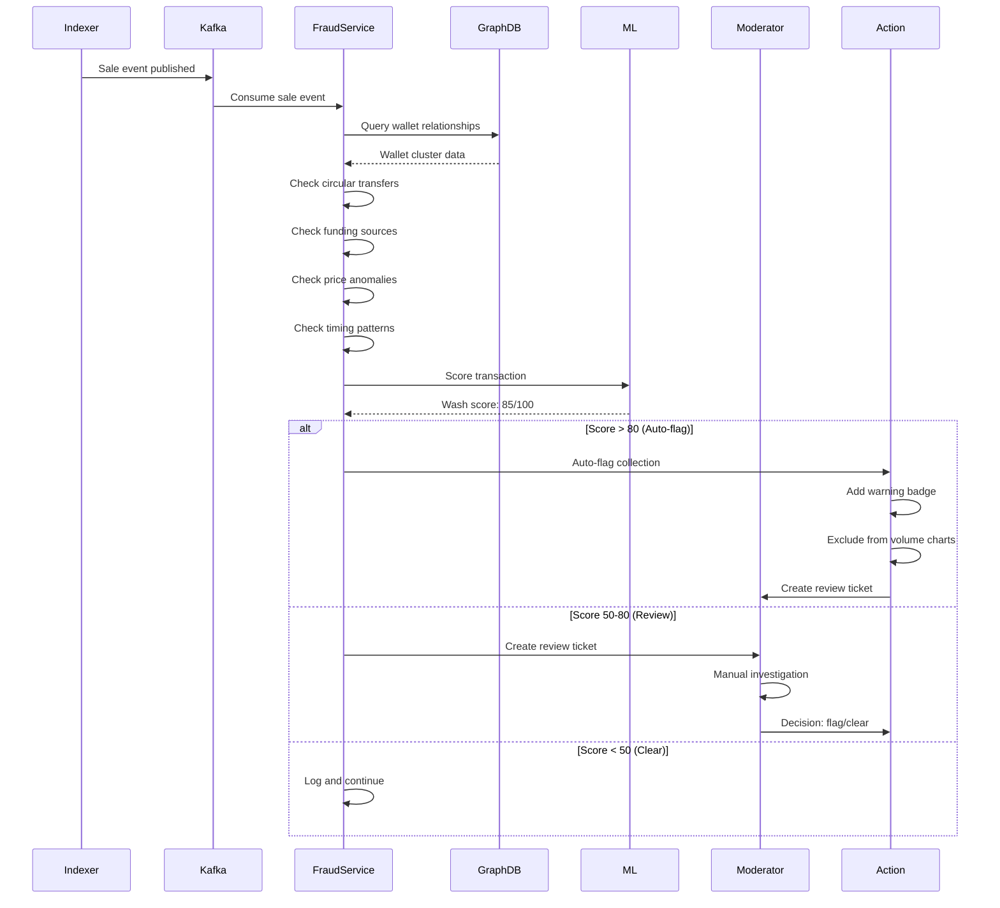
```mermaid
sequenceDiagram
    participant Indexer
    participant Kafka
    participant FraudService
    participant GraphDB
    participant ML
    participant Moderator
    participant Action

    Indexer->>Kafka: Sale event published
    Kafka->>FraudService: Consume sale event

    FraudService->>GraphDB: Query wallet relationships
    GraphDB-->>FraudService: Wallet cluster data

    FraudService->>FraudService: Check circular transfers
    FraudService->>FraudService: Check funding sources
    FraudService->>FraudService: Check price anomalies
    FraudService->>FraudService: Check timing patterns

    FraudService->>ML: Score transaction
    ML-->>FraudService: Wash score: 85/100

    alt Score > 80 (Auto-flag)
        FraudService->>Action: Auto-flag collection
        Action->>Action: Add warning badge
        Action->>Action: Exclude from volume charts
        Action->>Moderator: Create review ticket
    else Score 50-80 (Review)
        FraudService->>Moderator: Create review ticket
        Moderator->>Moderator: Manual investigation
        Moderator->>Action: Decision: flag/clear
    else Score < 50 (Clear)
        FraudService->>FraudService: Log and continue
    end
```

---

## Concurrency Control

### Order Fulfillment Race Conditions

```
Problem: Multiple buyers try to purchase the same listed NFT simultaneously.

Solution 1: On-chain atomicity
- The smart contract ensures only ONE fulfillment succeeds
- Second transaction reverts with "order already filled"
- Off-chain: optimistic UI shows "pending" then updates

Solution 2: Off-chain order locking (optional optimization)
- When buyer initiates purchase, temporarily lock order in Redis
- Lock TTL: 60 seconds (enough for transaction submission)
- If lock held: show "purchase in progress" to other buyers
- If transaction fails: release lock
- This is OPTIONAL — on-chain already handles it

Redis Lock Pattern:
  key: "order_lock:{order_hash}"
  value: "{buyer_address}:{timestamp}"
  TTL: 60 seconds
  Operation: SET NX (set if not exists)
```

### Concurrent Listing Updates

```
Problem: User updates listing price while someone is buying at old price.

Solution: Nonce-based ordering
- Each order has a unique nonce from the maker
- incrementCounter() on-chain invalidates ALL orders with lower counter
- New listing uses new counter value
- Old order automatically becomes unfillable

Off-chain handling:
1. User requests price change
2. API marks old order as "cancelling"
3. User signs new order with current counter
4. New order stored with status "active"
5. Old order transitions to "cancelled" when new counter is detected on-chain
```

### Concurrent Metadata Updates

```
Problem: Multiple indexer instances process metadata for the same token.

Solution: Optimistic locking with version
  UPDATE tokens
  SET metadata_json = $new_metadata,
      updated_at = NOW(),
      version = version + 1
  WHERE id = $token_id
  AND version = $expected_version;

If rows_affected = 0: retry with latest version
```

### Auction Bid Concurrency

```
Problem: Two bids arrive simultaneously for the same auction.

Solution: PostgreSQL advisory lock + serialization
BEGIN;
  -- Acquire advisory lock on auction
  SELECT pg_advisory_xact_lock(hashtext(auction_id::text));

  -- Check current highest bid
  SELECT MAX(bid_amount) as current_high
  FROM auction_bids
  WHERE order_id = $auction_id AND is_winning = true;

  -- Only insert if new bid is higher
  IF $new_bid > current_high THEN
    UPDATE auction_bids SET is_winning = false
    WHERE order_id = $auction_id AND is_winning = true;

    INSERT INTO auction_bids (order_id, bidder_address, bid_amount, is_winning)
    VALUES ($auction_id, $bidder, $new_bid, true);
  END IF;
COMMIT;
```

---

## Idempotency

### Blockchain Event Processing

```
Problem: Indexer processes the same block/event twice (restart, redelivery).

Solution: Event deduplication table
CREATE TABLE processed_events (
    chain_id        INTEGER,
    tx_hash         VARCHAR(66),
    log_index       INTEGER,
    processed_at    TIMESTAMPTZ DEFAULT NOW(),
    PRIMARY KEY (chain_id, tx_hash, log_index)
);

Processing logic:
1. Receive event from Kafka
2. Check: INSERT INTO processed_events ... ON CONFLICT DO NOTHING
3. If insert succeeded (affected rows = 1): process event
4. If conflict (affected rows = 0): skip (already processed)
```

### Order Submission Idempotency

```
Problem: Client retries order submission due to timeout.

Solution: Order hash as natural idempotency key
- Each order has a deterministic hash based on its components
- INSERT INTO orders ... ON CONFLICT (order_hash) DO NOTHING
- Client receives same response whether first or retry attempt

Additional: API idempotency key header
  X-Idempotency-Key: {uuid}
  - Server checks Redis for key
  - If exists: return cached response
  - If not: process request, cache response with 24h TTL
```

### Notification Deduplication

```
Problem: User receives duplicate "outbid" notifications.

Solution: Composite dedup key
  key = hash(user_id + notification_type + token_id + bid_amount)
  Redis SET NX with 1-hour TTL
  If key exists: skip notification
  If key new: send notification
```

---

## Consistency Model

### On-Chain vs Off-Chain Consistency

```
The marketplace operates with EVENTUAL CONSISTENCY between on-chain
state (source of truth) and off-chain database/cache.

Consistency Tiers:

Tier 1: Strong Consistency (on-chain)
- Token ownership: always correct on-chain
- Order fill status: always correct on-chain
- Balance checks: always correct on-chain

Tier 2: Near Real-Time (< 30 seconds lag)
- Floor prices in Redis
- Active listing counts
- Collection volume stats

Tier 3: Eventually Consistent (< 5 minutes lag)
- Search index (Elasticsearch)
- Rarity rankings
- User portfolio views
- Analytics dashboards

Tier 4: Batch Consistent (hourly/daily)
- Wash trading scores
- Holder distribution charts
- Historical volume aggregations

Reconciliation Process:
- Every 5 minutes: compare DB ownership vs on-chain for hot collections
- Every hour: full reconciliation of active orders vs on-chain status
- Every 24 hours: full token ownership audit for top 100 collections
```

### Read-Your-Writes Consistency

```
Problem: User creates listing but doesn't see it immediately.

Solution: Sticky reads after writes
1. After user creates order, API returns order data
2. Frontend adds order to local state immediately (optimistic)
3. Set user session flag: "recent_write_ts = NOW()"
4. For next 30 seconds, read from primary DB (not replica)
5. After 30 seconds, replica has caught up — read from replica

Alternative: Return created resource directly
- POST /orders returns the full order object
- Frontend displays it without needing a follow-up GET
```

---

## Saga Orchestration

### Cross-Chain NFT Bridge Saga

```
When users bridge NFTs between chains (e.g., Ethereum → Polygon):

Step 1: Lock NFT on Source Chain
  → Transaction: transferFrom(user, bridge_contract, tokenId)
  → Compensating: transferFrom(bridge_contract, user, tokenId)

Step 2: Wait for Finality on Source Chain
  → Wait for 12 block confirmations
  → Compensating: unlock on source if message fails

Step 3: Submit Proof to Destination Chain
  → Transaction: bridge.claimNFT(proof, tokenId, metadata)
  → Compensating: burn on destination, unlock on source

Step 4: Update Off-Chain State
  → Update token chain_id, contract_address in DB
  → Update search index
  → Invalidate caches
  → Compensating: revert DB updates

Saga Orchestrator:
- State persisted in PostgreSQL
- Timeout per step: 30 minutes
- Max retries per step: 3
- Alert if saga stuck > 1 hour
```

### Auction Settlement Saga

```
Step 1: Verify Auction Ended
  → Check: block.timestamp > auction.endTime
  → Check: highestBid >= reservePrice

Step 2: Execute On-Chain Settlement
  → Call: seaport.fulfillOrder(auctionOrder, winningBid)
  → Compensating: refund winning bidder

Step 3: Distribute Payments
  → Royalties to creator
  → Platform fee to marketplace
  → Remaining to seller
  → Compensating: reverse all transfers

Step 4: Refund Losing Bidders
  → Release WETH holds for all non-winning bids
  → Compensating: N/A (idempotent)

Step 5: Update Off-Chain State
  → Mark auction as settled
  → Update token ownership
  → Send notifications
  → Compensating: mark as settlement-failed
```

### Collection Mint Saga (Large Drop)

```
For a 10,000 item collection mint:

Step 1: Deploy Contract
  → Deploy collection contract with factory
  → Compensating: N/A (contract deployed is permanent)

Step 2: Upload Media Batch
  → Upload all 10,000 images to IPFS
  → Pin to multiple providers
  → Compensating: unpin from providers

Step 3: Upload Metadata Batch
  → Generate metadata JSONs with IPFS image CIDs
  → Upload to IPFS
  → Compensating: unpin metadata

Step 4: Set Base URI
  → Call contract.setBaseURI(ipfs://metadata_folder/)
  → Compensating: N/A

Step 5: Configure Mint Phases
  → Set allowlist Merkle root
  → Set mint price + max per wallet
  → Open allowlist mint → public mint
  → Compensating: close mint

Step 6: Index Collection
  → Indexer discovers contract events
  → Fetch and store all metadata
  → Calculate rarity scores
  → Compensating: remove from index

Saga timeout: 24 hours (large uploads)
```

---

## Security

### Smart Contract Security

```
Threat Model:
1. Reentrancy attacks on payment distribution
2. Integer overflow in price calculations
3. Signature replay across chains
4. Flash loan attacks on auction pricing
5. Front-running of rare NFT listings
6. Malicious token contracts (honeypots)

Mitigations:
- Use OpenZeppelin libraries (battle-tested)
- Checks-Effects-Interactions pattern
- ReentrancyGuard on all state-changing functions
- Chain ID in EIP-712 domain separator (prevents cross-chain replay)
- Pull-over-push payment pattern
- Formal verification for core marketplace logic
- Multi-sig upgradability (UUPS proxy with timelock)
- Bug bounty program (Immunefi)
- Continuous audit (Trail of Bits, OpenZeppelin)
```

### Wallet Authentication (SIWE)

```
Sign-In With Ethereum (EIP-4361):

1. Client requests nonce: GET /auth/nonce
   Response: { nonce: "abc123", expirationTime: "..." }

2. Client constructs SIWE message:
   "marketplace.com wants you to sign in with your Ethereum account:
    0x1234...5678

    Sign in to NFT Marketplace

    URI: https://marketplace.com
    Version: 1
    Chain ID: 1
    Nonce: abc123
    Issued At: 2026-03-24T10:00:00Z
    Expiration Time: 2026-03-24T10:10:00Z"

3. User signs message with wallet

4. Client sends: POST /auth/verify
   Body: { message: "...", signature: "0x..." }

5. Server verifies:
   a. Recover signer from signature
   b. Check signer matches address in message
   c. Check nonce matches (prevent replay)
   d. Check expiration
   e. Issue JWT with 24h TTL

6. Subsequent requests include: Authorization: Bearer {jwt}
```

### MEV Protection for NFT Trading

```
MEV (Maximal Extractable Value) Risks:
1. Front-running: Bot sees pending "buy" tx, buys first at listed price, resells higher
2. Sandwich: Bot manipulates floor price around a large buy
3. Sniping: Bot outbids at auction last second via private mempool

Protections:
1. Private transaction submission (Flashbots Protect)
   - Submit tx directly to block builder, bypass public mempool
   - No front-running possible

2. Commit-reveal scheme for auctions
   - Phase 1: Submit hash(bid + salt) — nobody sees actual bid
   - Phase 2: Reveal bid + salt — verify against commitment
   - Prevents last-second sniping

3. Anti-snipe extension
   - Any bid in last 5 minutes extends auction by 5 minutes
   - Prevents last-block sniping

4. Private listings
   - Designated buyer only (taker_address set)
   - Cannot be intercepted

5. Off-chain order books with on-chain settlement
   - Orders are not visible in mempool until fulfillment
   - Reduces front-running window
```

### API Security

```
Rate Limiting:
- Anonymous: 20 requests/minute
- Authenticated: 120 requests/minute
- API key (developers): 600 requests/minute
- Burst: 2x sustained for 10 seconds

Input Validation:
- All addresses: checksum validation (EIP-55)
- Token IDs: uint256 range validation
- Prices: positive, within reasonable bounds
- Signatures: length and format validation
- Metadata: sanitize HTML, limit field lengths

CORS Policy:
- Allowed origins: marketplace.com, *.marketplace.com
- Credentials: true (for JWT cookies)
- Methods: GET, POST, PUT, DELETE
- Headers: Authorization, Content-Type, X-Idempotency-Key

Content Security:
- SVG sanitization (prevent XSS via malicious SVGs)
- Media type validation (magic bytes, not just extension)
- Metadata JSON schema validation
- URL allowlisting for external links
```

---

## Observability

### Metrics (Prometheus)

```
Business Metrics:
- nft_sales_total{chain, collection, payment_token}
- nft_volume_eth{chain, collection, period}
- nft_listings_active{chain, collection}
- nft_floor_price{chain, collection}
- nft_unique_traders{period}
- nft_mint_count{chain, collection}

Technical Metrics:
- api_request_duration_seconds{endpoint, method, status}
- api_request_total{endpoint, method, status}
- blockchain_indexer_lag_blocks{chain}
- blockchain_indexer_events_processed_total{chain, event_type}
- blockchain_reorg_detected_total{chain, depth}
- order_validation_duration_seconds{result}
- search_query_duration_seconds{index, query_type}
- cache_hit_ratio{cache_layer, key_prefix}
- kafka_consumer_lag{topic, consumer_group}
- websocket_connections_active
- media_upload_duration_seconds{format, size_bucket}
- ipfs_pin_duration_seconds{provider}
- fraud_score_distribution{bucket}

Infrastructure:
- postgresql_connections_active{database}
- elasticsearch_cluster_health
- redis_memory_used_bytes{instance}
- kafka_broker_messages_in_per_sec
```

### Distributed Tracing

```
Trace Context Flow:

User Request → API Gateway (trace_id created)
  → Order Service (span: validate_order)
    → Redis (span: check_cache)
    → PostgreSQL (span: query_orders)
    → Blockchain Node (span: simulate_tx)
  → Search Service (span: query_es)
    → Elasticsearch (span: search_query)
  → Response

Key Traces:
1. Purchase flow: Frontend → API → Order → Blockchain → Indexer → Cache
2. Search flow: Frontend → API → Search → ES → Response
3. Indexing flow: Node → Poller → Decoder → Kafka → Processors → DB/ES
4. Media flow: Upload → Validate → Process → IPFS → CDN

Sampling:
- 100% for errors
- 100% for slow requests (> 1 second)
- 10% for normal requests
- 1% for health checks
```

### Alerting Rules

```yaml
groups:
  - name: marketplace_alerts
    rules:
      - alert: IndexerLagCritical
        expr: blockchain_indexer_lag_blocks > 50
        for: 5m
        labels:
          severity: critical
        annotations:
          summary: "Blockchain indexer is {{ $value }} blocks behind"

      - alert: HighOrderFailureRate
        expr: rate(order_validation_total{result="failed"}[5m]) / rate(order_validation_total[5m]) > 0.1
        for: 10m
        labels:
          severity: warning
        annotations:
          summary: "Order failure rate above 10%"

      - alert: FloorPriceStale
        expr: time() - nft_floor_price_updated_timestamp > 120
        for: 5m
        labels:
          severity: warning
        annotations:
          summary: "Floor price not updated for > 2 minutes"

      - alert: SmartContractAnomaly
        expr: rate(blockchain_events_total{event_type="unexpected"}[1h]) > 0
        for: 1m
        labels:
          severity: critical
        annotations:
          summary: "Unexpected smart contract events detected"

      - alert: WashTradingSpike
        expr: rate(fraud_flags_total{type="wash_trading"}[1h]) > 50
        for: 30m
        labels:
          severity: warning
        annotations:
          summary: "Wash trading detection spike"

      - alert: SearchLatencyHigh
        expr: histogram_quantile(0.95, search_query_duration_seconds) > 0.5
        for: 10m
        labels:
          severity: warning
        annotations:
          summary: "p95 search latency above 500ms"
```

### Dashboards

```
Dashboard 1: Market Overview
- Total volume (24h, 7d, 30d) by chain
- Active listings count
- Unique traders today
- Top collections by volume
- Floor price trends for top 10 collections

Dashboard 2: Indexer Health
- Blocks behind per chain
- Events processed per minute
- Reorg events detected
- Processing latency histogram
- DLQ depth per topic

Dashboard 3: API Performance
- Request rate by endpoint
- p50/p95/p99 latency
- Error rate by status code
- Cache hit ratio
- WebSocket connection count

Dashboard 4: Fraud & Moderation
- Wash trading flags per day
- Collections flagged vs cleared
- DMCA reports open/resolved
- Fraud score distribution
- Top flagged wallets
```

---

## Reliability & Fault Tolerance

### Blockchain Node Redundancy

```
Strategy: Multi-provider fallback with health checks

Primary: Self-hosted Erigon node
Secondary: Alchemy API
Tertiary: Infura API
Quaternary: QuickNode API

Health Check (every 10 seconds):
1. eth_blockNumber — is node synced?
2. eth_getLogs for known recent block — returning data?
3. Compare block number across providers — consistent?

Failover Logic:
if primary.blockNumber < secondary.blockNumber - 3:
    switch to secondary
    alert: "Primary node behind by N blocks"

if all_providers.blockNumber diverge by > 5:
    alert: "Potential chain issues — manual investigation"
```

### Data Recovery

```
PostgreSQL:
- Streaming replication to 2 standby nodes
- WAL archiving to S3 every minute
- Point-in-time recovery capability
- Daily full backup + continuous WAL

Elasticsearch:
- 2 replicas per shard
- Daily snapshot to S3
- Recovery: restore from snapshot + replay from Kafka

Redis:
- Redis Cluster with 3 masters, 3 replicas
- RDB snapshots every 15 minutes
- AOF for point-in-time recovery
- If total loss: warm cache from DB (degraded but functional)

Kafka:
- Replication factor: 3
- Min in-sync replicas: 2
- Log retention: 7 days (enough to replay on full rebuild)
```

### Graceful Degradation

```
Scenario: Elasticsearch is down
- Search falls back to PostgreSQL full-text search (slower)
- Autocomplete disabled
- Faceted filtering limited to indexed columns
- Alert: search degraded mode

Scenario: Blockchain node is behind
- Show "data may be delayed" banner
- Disable "Buy Now" for unconfirmed state
- Continue serving cached data
- Switch to backup provider

Scenario: IPFS gateway is slow
- Serve media from S3/CDN (always cached)
- Show "IPFS gateway slow" for direct IPFS links
- Media display unaffected for cached content

Scenario: Kafka is down
- Order creation still works (write to DB directly)
- Indexing pauses (will catch up when restored)
- Notifications delayed
- Cache invalidation delayed (stale data possible)
```

### Circuit Breaker Configuration

```
Blockchain RPC calls:
- Threshold: 50% failure rate in 30 seconds
- Open duration: 60 seconds
- Half-open: allow 5 test requests
- Fallback: switch to backup provider

Elasticsearch queries:
- Threshold: 30% failure rate in 60 seconds
- Open duration: 30 seconds
- Fallback: PostgreSQL full-text search

IPFS pinning:
- Threshold: 70% failure rate in 5 minutes
- Open duration: 5 minutes
- Fallback: store in S3, pin later (async retry)

External APIs (ENS, Etherscan):
- Threshold: 50% failure in 60 seconds
- Open duration: 120 seconds
- Fallback: serve without enrichment (no ENS names)
```

---

## Multi-Chain Support

### Chain Abstraction Layer

```
Interface:
  ChainAdapter {
    getBlock(number): Block
    getLogs(filter): Log[]
    getTokenURI(contract, tokenId): string
    getOwner(contract, tokenId): address
    getBalance(address, token): BigInt
    simulateTransaction(tx): SimResult
    submitTransaction(tx): TxHash
    getFinality(): number  // blocks to finality
    getGasPrice(): GasPrice
    getNativeToken(): string
    getBlockTime(): number  // milliseconds
  }

Implementations:
  EthereumAdapter implements ChainAdapter
  PolygonAdapter implements ChainAdapter
  ArbitrumAdapter implements ChainAdapter
  OptimismAdapter implements ChainAdapter
  BaseAdapter implements ChainAdapter
  SolanaAdapter implements ChainAdapter  // different paradigm

Chain Configuration Table:
| Chain | ID | Finality | Block Time | Gas Model | Token Standard |
|-------|----|----------|------------|-----------|----------------|
| Ethereum | 1 | 12 blocks | 12s | EIP-1559 | ERC-721/1155 |
| Polygon | 137 | 128 blocks | 2s | EIP-1559 | ERC-721/1155 |
| Arbitrum | 42161 | 1 block* | ~0.3s | Arbitrum gas | ERC-721/1155 |
| Optimism | 10 | 1 block* | 2s | EIP-1559 | ERC-721/1155 |
| Base | 8453 | 1 block* | 2s | EIP-1559 | ERC-721/1155 |
| Solana | - | 32 slots | 0.4s | Compute units | Metaplex |

* L2 finality depends on L1 settlement (7 days for optimistic, ~15 min for ZK)
```

### Cross-Chain Order Considerations

```
Challenge: User wants to buy an Ethereum NFT but has funds on Polygon.

Approach 1: Bridge and Buy
1. Bridge funds from Polygon to Ethereum
2. Wait for bridge finality
3. Buy NFT on Ethereum
4. Slow (7+ days for optimistic bridge)

Approach 2: Cross-Chain Swap
1. Use cross-chain DEX aggregator (e.g., Socket, LiFi)
2. Atomic swap: Polygon MATIC → Ethereum ETH
3. Buy NFT in same transaction bundle
4. Faster but higher fees

Approach 3: Chain-Agnostic Order Book
1. List NFT with "accepts payment on Polygon"
2. Seller receives payment on Polygon
3. NFT transfers on Ethereum
4. Requires trusted relayer or escrow contract on both chains

Current Industry Standard: Most platforms require same-chain payment.
```

---

## Cost Analysis

### Infrastructure Costs (Monthly)

| Component | Specification | Monthly Cost |
|-----------|---------------|-------------|
| Blockchain nodes (5 chains) | c5.4xlarge x 5, 2TB NVMe | $5,000 |
| PostgreSQL (Aurora) | db.r6g.2xlarge, Multi-AZ | $3,000 |
| Elasticsearch | 3x r6g.2xlarge (data) + 2x c6g.xlarge (master) | $4,500 |
| Redis Cluster | 3x r6g.xlarge | $1,500 |
| Kafka (MSK) | 3x kafka.m5.2xlarge | $2,500 |
| TimescaleDB | r6g.xlarge | $800 |
| Application servers | 10x c6g.xlarge (auto-scaling) | $3,000 |
| S3 media storage | 1 PB | $23,000 |
| CloudFront CDN | 100 TB/month transfer | $8,500 |
| IPFS pinning (Pinata) | 5 TB | $750 |
| Alchemy/Infura (backup) | Growth tier x 5 chains | $2,000 |
| Load balancers | 2x ALB | $500 |
| WAF | Standard rules | $300 |
| Monitoring (Datadog) | 20 hosts + APM | $2,000 |
| **Total** | | **~$57,350** |

### Revenue Model

```
Revenue Streams:
1. Platform fee: 2.5% on each sale (primary revenue)
2. Lazy minting fee: $0 (subsidized to attract creators)
3. Featured listings: $500-$5,000/week
4. API access: Free tier + paid tiers ($99-$999/month)
5. Pro tools subscription: $29/month

Revenue Estimation:
- Daily volume: $10M in sales
- Platform fee: 2.5% = $250K/day = $7.5M/month
- API subscriptions: ~$50K/month
- Featured listings: ~$100K/month
- Total: ~$7.65M/month

Profit margin: ~$7.65M - $57K = ~$7.59M/month (infrastructure is tiny vs revenue)

Note: The real cost is in engineering talent, legal, customer support, and
business development, not infrastructure.
```

---

## Platform Comparisons

### OpenSea vs Blur vs Rarible vs Magic Eden vs Foundation

| Feature | OpenSea | Blur | Rarible | Magic Eden | Foundation |
|---------|---------|------|---------|------------|------------|
| **Primary Chain** | Ethereum, Polygon, + 10 | Ethereum, Blast | Ethereum, Polygon, + 5 | Solana, Ethereum, Bitcoin | Ethereum |
| **Protocol** | Seaport | Blur Pool | Rarible Protocol | Custom | Custom |
| **Platform Fee** | 2.5% | 0% (token incentives) | 1% | 2% | 5% |
| **Royalty Policy** | Optional (min 0.5%) | Optional | Enforced | Optional | Enforced |
| **Lazy Minting** | Yes | No | Yes | Yes | Yes |
| **Auction Types** | English, Dutch | No | English, Dutch | English | Reserve |
| **Collection Offers** | Yes | Yes (core feature) | Yes | Yes | No |
| **Trait Offers** | Yes | Yes (core feature) | Limited | Yes | No |
| **Pro Trading Tools** | Basic | Advanced (charts, portfolio) | Basic | Medium | Minimal |
| **Aggregation** | No (single marketplace) | Yes (aggregates others) | Yes | Yes | No |
| **Token** | No | $BLUR | $RARI | No | No |
| **Target Users** | General | Traders/Flippers | Creators | Solana/Bitcoin community | Artists (1/1s) |
| **API** | REST + GraphQL | REST | REST + GraphQL | REST | REST |
| **Indexer** | Proprietary | Proprietary | Open (Rarible Protocol) | Proprietary | Proprietary |
| **NFT Lending** | No | Yes (Blend) | No | No | No |

### Architectural Differences

```
OpenSea:
- Seaport protocol (open-source, widely adopted)
- Centralized off-chain order book
- Wyvern protocol (legacy, deprecated)
- Strongest brand recognition
- Largest indexed collection count

Blur:
- Blur Pool for instant liquidity
- Aggregator model (cross-marketplace)
- Point system for incentivizing listings/bids
- Blend protocol for NFT lending
- Optimized for speed (instant loading, real-time feeds)
- Professional trading interface

Rarible:
- Rarible Protocol: open indexer + order book
- Multi-chain with consistent UX
- Community governance via RARI token
- Creator-friendly tools
- B2B licensing of protocol

Magic Eden:
- Started Solana-first (Metaplex standard)
- Added Ethereum, Bitcoin (Ordinals)
- Cross-chain NFT experience
- Launchpad for new collections
- Creator studio

Foundation:
- Invite-only/curated approach (historically)
- Focus on 1/1 art and small editions
- Reserve price auctions
- Artist-first design
- Higher fees but perceived quality
```

---

## Edge Cases

### Edge Case 1: Chain Reorganization During Sale

```
Scenario: User buys NFT, transaction is confirmed, but a reorg reverts the block.
Impact: User sees "purchased" but doesn't actually own the NFT.

Handling:
1. Show "pending confirmation" for 12 blocks (Ethereum)
2. If reorg detected: revert off-chain state
3. Notify user: "Transaction was reverted due to chain reorganization"
4. Relist the NFT automatically
5. Log reorg event for analytics
```

### Edge Case 2: Metadata Points to Dead IPFS Link

```
Scenario: NFT metadata URI points to IPFS hash that no one pins anymore.
Impact: "Image not found" on marketplace.

Handling:
1. Marketplace pins all indexed metadata to own IPFS nodes
2. Fallback to cached S3 copy of media
3. Show placeholder image if all sources fail
4. Periodic health check of metadata URIs
5. Alert collection owners of broken metadata
```

### Edge Case 3: Creator Rugpulls by Changing Metadata

```
Scenario: Creator changes baseURI to point to blank images after selling out.
Impact: All NFTs in collection lose their artwork.

Handling:
1. Detect baseURI change event on-chain
2. Compare old vs new metadata
3. If significant degradation: flag collection
4. Preserve old metadata in marketplace cache
5. Show "metadata changed" warning to holders
6. Option: serve cached pre-change metadata
```

### Edge Case 4: Flash Loan Attack on Auction

```
Scenario: Attacker takes flash loan, bids absurdly high on auction,
wins auction in same transaction block, then defaulting.

Handling:
1. Auction bids require WETH deposit (pre-funded, not flash-loaned)
2. Bid validation checks balance at bid time AND fill time
3. Commit-reveal scheme prevents same-block bid+fill
4. Time delay between bid placement and auction end
```

### Edge Case 5: NFT Transferred While Listed

```
Scenario: User lists on marketplace then transfers NFT directly via contract.
Impact: "phantom listing" — appears listed but can't be bought.

Handling:
1. Indexer detects Transfer event
2. Check if token has active listings
3. Mark listings as "inactive" (owner changed)
4. Remove from active listings index
5. Periodic scan: verify all active listings have correct owner
```

### Edge Case 6: Same NFT Listed on Multiple Marketplaces

```
Scenario: User lists NFT on OpenSea AND Blur simultaneously.
Impact: First buyer gets it; second buyer's transaction reverts.

Handling:
1. Aggregator shows listings from all marketplaces
2. When fulfilling, simulate transaction first
3. If simulation fails: "This NFT may have been sold elsewhere"
4. Cross-marketplace order invalidation via indexer
5. Real-time WebSocket updates across marketplace events
```

### Edge Case 7: ERC-1155 Partial Fills

```
Scenario: User lists 100 copies of an ERC-1155 token. Buyer wants 30.
Impact: Partial fill of an order.

Handling:
1. Seaport supports partial fills natively
2. Order tracks: totalFilled / totalSize
3. Remaining quantity stays active
4. Update listing display: "70 remaining"
5. Multiple partial fills until fully filled
```

### Edge Case 8: Gas Spike During Mint

```
Scenario: Popular mint causes gas to spike 10x. Users' transactions stuck.
Impact: Stuck transactions, failed mints, frustrated users.

Handling:
1. Show real-time gas estimate before transaction
2. Suggest gas limit with 20% buffer
3. Speed-up option: replace transaction with higher gas
4. Queue-based minting with gas abstraction
5. Alternative: lazy mint with gasless experience
```

### Edge Case 9: Soulbound Token Listed for Sale

```
Scenario: User tries to list a soulbound (non-transferable) token.
Impact: Transaction would revert on transfer.

Handling:
1. Detect soulbound nature during listing creation
2. Simulate transfer — if reverts, reject listing
3. Flag soulbound tokens in metadata
4. Show "non-transferable" badge
5. Block listing creation for known soulbound contracts
```

### Edge Case 10: Circular Royalty Payments

```
Scenario: Creator sets royalty recipient to a contract that calls back
into the marketplace, creating a reentrancy loop.
Impact: Transaction failure or exploit.

Handling:
1. Seaport uses ReentrancyGuard
2. Royalty payments use pull pattern (claim) not push (send)
3. Gas limit on royalty payment calls
4. Blocklist known malicious royalty recipient contracts
```

### Edge Case 11: Token ID Collision Across Chains

```
Scenario: Same contract address + token ID exists on Ethereum and Polygon.
Impact: Ambiguity in which NFT is being referenced.

Handling:
1. Always include chain_id in all identifiers
2. Composite key: (chain_id, contract_address, token_id)
3. URLs include chain: /ethereum/0xABC.../1234
4. API requires chain_id parameter
5. Different indexing per chain (separate ES indices)
```

### Edge Case 12: Whale Wallet Dumps Collection Floor

```
Scenario: A whale lists 500 NFTs at 50% below floor, crashing the collection.
Impact: Panic selling, massive price drop.

Handling:
1. Detect unusual listing volume (>20 items in 1 hour by single wallet)
2. Show "whale alert" notification to watchers
3. Volume-weighted floor calculation (ignore outliers)
4. Activity feed shows whale movement prominently
5. Do NOT prevent listings (censorship resistance)
6. Provide analytics for informed decisions
```

---

## Architectural Decision Records

### ADR-1: Off-Chain Order Book vs Fully On-Chain

| Aspect | Decision |
|--------|----------|
| **Status** | Accepted |
| **Context** | Should marketplace orders live on-chain or off-chain? |
| **Decision** | Off-chain order book with on-chain settlement (Seaport model) |
| **Rationale** | On-chain order books have prohibitive gas costs for listing, cancellation, and price updates. Off-chain orders are free to create, modify, and cancel. On-chain settlement ensures trustless execution. |
| **Consequences** | + Zero cost for listing/cancelling; + Faster UX; - Centralized order book (single point of failure); - Orders can be censored by marketplace |
| **Alternatives** | Fully on-chain (Zora), hybrid AMM (Sudoswap) |

### ADR-2: Seaport vs Custom Protocol

| Aspect | Decision |
|--------|----------|
| **Status** | Accepted |
| **Context** | Build custom marketplace contract or adopt Seaport? |
| **Decision** | Adopt Seaport with custom Zone contracts for validation |
| **Rationale** | Seaport is battle-tested with $30B+ in volume, audited by multiple firms, widely adopted, and supports all order types we need. Custom zones allow marketplace-specific rules without modifying core protocol. |
| **Consequences** | + Proven security; + Aggregator compatibility; + Community support; - Less control over protocol evolution; - Complexity of Seaport internals |
| **Alternatives** | Custom protocol (more control, higher risk), LooksRare protocol, X2Y2 protocol |

### ADR-3: PostgreSQL + Elasticsearch vs Single Store

| Aspect | Decision |
|--------|----------|
| **Status** | Accepted |
| **Context** | Should we use a single database or separate OLTP and search? |
| **Decision** | PostgreSQL for canonical state + Elasticsearch for search + TimescaleDB for time-series |
| **Rationale** | PostgreSQL excels at ACID transactions and relational queries. Elasticsearch excels at full-text search, faceted filtering, and aggregations. TimescaleDB optimized for time-series price data. Each handles its workload optimally. |
| **Consequences** | + Best performance per workload; + Independent scaling; - Data synchronization complexity; - Eventual consistency between stores |
| **Alternatives** | MongoDB (flexible but weaker consistency), SingleStore (unified but expensive), CockroachDB (distributed SQL) |

### ADR-4: IPFS + CDN Hybrid for Media

| Aspect | Decision |
|--------|----------|
| **Status** | Accepted |
| **Context** | How to store and serve NFT media files? |
| **Decision** | IPFS for content-addressing and decentralization, S3+CloudFront for fast delivery |
| **Rationale** | Users expect fast media loading (<100ms). IPFS gateways are slow and unreliable. S3+CDN provides reliable, fast delivery. IPFS provides content-addressing and meets decentralization expectations. |
| **Consequences** | + Fast media delivery; + Content-addressable; + Fallback options; - Dual storage cost; - Sync complexity |
| **Alternatives** | IPFS-only (slow), S3-only (centralized), Arweave-only (expensive, permanent) |

### ADR-5: Kafka vs RabbitMQ for Event Streaming

| Aspect | Decision |
|--------|----------|
| **Status** | Accepted |
| **Context** | What message broker for blockchain event streaming? |
| **Decision** | Apache Kafka |
| **Rationale** | Blockchain events must be processed in order per contract. Kafka's partitioned log with key-based ordering ensures this. Kafka's replay capability is essential for re-indexing. High throughput handles 10M+ events/day. |
| **Consequences** | + Ordered processing; + Replay capability; + High throughput; - Operational complexity; - Higher resource usage |
| **Alternatives** | RabbitMQ (simpler but no replay), Amazon SQS (managed but no ordering guarantees at scale), Pulsar |

### ADR-6: Lazy Minting as Default

| Aspect | Decision |
|--------|----------|
| **Status** | Accepted |
| **Context** | Should minting require gas upfront from creators? |
| **Decision** | Default to lazy minting; allow eager minting as option |
| **Rationale** | Lazy minting removes the #1 barrier for creators (gas cost). The NFT exists off-chain until purchased, at which point the buyer's gas covers minting. This dramatically increases creator onboarding. |
| **Consequences** | + Zero cost for creators; + Higher creator adoption; - NFT doesn't exist on-chain until first sale; - Slightly higher gas for first buyer; - Voucher management complexity |
| **Alternatives** | Gas subsidies (expensive for platform), L2-only minting (limits to L2 ecosystem) |

### ADR-7: Multi-Chain from Day One vs Gradual

| Aspect | Decision |
|--------|----------|
| **Status** | Accepted |
| **Context** | Support multiple chains at launch or start with Ethereum only? |
| **Decision** | Launch with Ethereum and Polygon, add chains incrementally via chain adapter pattern |
| **Rationale** | Chain abstraction layer allows adding new chains without modifying core services. Starting with 2 chains validates the abstraction. Each new chain requires: node setup, adapter implementation, contract deployment, indexer configuration. |
| **Consequences** | + Validated abstraction early; + Faster time-to-market; - Initial investment in abstraction; - Each chain has unique edge cases |
| **Alternatives** | Ethereum-only (simpler but limited market), all chains at once (too risky) |

---

## Proof of Concepts

### POC-1: Seaport Order Integration

```
Goal: Validate end-to-end order creation, storage, and fulfillment.

Steps:
1. Deploy Seaport to local Hardhat network
2. Implement EIP-712 signing for order creation
3. Store signed order in PostgreSQL
4. Build fulfillment transaction
5. Execute on-chain and verify transfer

Success Criteria:
- Order created and stored in < 500ms
- Fulfillment simulation succeeds
- On-chain settlement transfers NFT and distributes payment
- Event indexer captures OrderFulfilled
- Off-chain state matches on-chain

Timeline: 1 week
Team: 1 smart contract dev + 1 backend dev
```

### POC-2: Real-Time Floor Price Tracking

```
Goal: Validate floor price accuracy within 30 seconds of on-chain change.

Steps:
1. Set up Ethereum node WebSocket subscription
2. Listen for OrderFulfilled and Transfer events
3. Update floor price in Redis on each event
4. Compare with manual calculation every 5 minutes
5. Measure latency from on-chain event to Redis update

Success Criteria:
- Floor price accurate within 30 seconds of listing/sale
- Handles 100+ events/second during popular mint
- Floor calculation handles edge cases (outliers, cancelled orders)
- Redis cache hit rate > 99% for floor price queries

Timeline: 3 days
Team: 1 backend dev
```

### POC-3: Wash Trading Detection

```
Goal: Validate wash trading detection accuracy on historical data.

Steps:
1. Export 6 months of sale events for top 100 collections
2. Build wallet clustering based on funding sources
3. Implement circular transfer detection
4. Implement price anomaly detection
5. Score each transaction
6. Compare against manually labeled dataset (1000 trades)

Success Criteria:
- Precision > 85% (flagged trades are actually wash trades)
- Recall > 70% (catch most wash trades)
- False positive rate < 10%
- Processing latency < 5 seconds per trade

Timeline: 2 weeks
Team: 1 data engineer + 1 ML engineer
```

### POC-4: Multi-Chain Indexer

```
Goal: Validate chain abstraction layer with Ethereum and Polygon.

Steps:
1. Implement ChainAdapter interface for Ethereum and Polygon
2. Deploy identical NFT contract on both chains
3. Mint, transfer, and sell NFTs on both chains
4. Verify indexer captures all events on both chains
5. Search across chains with single query

Success Criteria:
- Same codebase indexes both chains
- Adding a new chain requires only adapter implementation
- Cross-chain search returns results from all chains
- Reorg handling works on both chains (different finality)

Timeline: 1 week
Team: 1 backend dev
```

---

## Advanced Topics

### NFT Financialization

```
1. NFT Lending (Blur's Blend Protocol):
   - Borrower uses NFT as collateral
   - Lender provides ETH loan
   - If borrower defaults: lender gets NFT
   - Perpetual loan model (no fixed term)
   - Refinancing: new lender can offer better rate

2. Fractionalization:
   - Lock NFT in vault contract
   - Issue ERC-20 tokens representing shares
   - Trade fractions on DEXes
   - Buyout mechanism: collect all fractions to unlock NFT
   - Regulatory concerns: may be securities

3. NFT Derivatives:
   - Floor price perpetual futures
   - Options on specific NFTs
   - Collection index tokens
   - Requires reliable oracle for floor prices

4. Rental / Delegation:
   - ERC-4907 rental standard
   - Delegate.cash for non-custodial delegation
   - Gaming items rented to players
   - Revenue sharing from rented NFTs
```

### Soulbound Tokens (SBTs)

```
Definition: Non-transferable tokens bound to a wallet address.

Use Cases:
- Proof of attendance (POAPs, but non-transferable)
- Credentials and certifications
- Reputation scores
- Membership tokens
- Identity verification

ERC-5192: Minimal Soulbound Interface:
interface IERC5192 {
    event Locked(uint256 tokenId);
    event Unlocked(uint256 tokenId);
    function locked(uint256 tokenId) external view returns (bool);
}

Marketplace Implications:
- Cannot be listed for sale
- Cannot be transferred
- Still indexed for portfolio display
- No marketplace fees (no sales)
- Used for gating/verification features
```

### Dynamic NFTs

```
Types of Dynamic NFTs:
1. On-chain dynamic: Metadata generated by smart contract
   - Example: Loot (text generated on-chain)
   - Always current, no refresh needed

2. Oracle-driven: External data feeds update metadata
   - Example: Weather-based art
   - Chainlink oracle provides data
   - Contract updates tokenURI based on oracle

3. Time-based: Metadata changes with time
   - Example: Aging art, seasonal themes
   - tokenURI includes time-based logic

4. Interactive: Owner actions change metadata
   - Example: Virtual pets, upgradeable game items
   - State stored on-chain, metadata reflects state

Marketplace Challenges:
- Metadata may change between listing and purchase
- Rarity scores may shift dynamically
- Historical metadata should be preserved
- Refresh triggers needed for accurate display
```

### MEV in NFT Trading

```
Types of MEV in NFT Markets:

1. Front-running Listings:
   - Bot monitors mempool for underpriced listings
   - Submits buy transaction with higher gas
   - Gets included before intended buyer
   - Mitigation: Flashbots Protect, private mempools

2. Sandwich Attacks:
   - Bot buys before and sells after a large purchase
   - Extracts value from price impact
   - Less common in NFTs (unique items) than DeFi
   - Possible on AMM-based NFT markets (Sudoswap)

3. Mint Sniping:
   - Bot detects mint transaction in mempool
   - Copies mint call with higher gas
   - Gets rare token IDs (if sequential + deterministic)
   - Mitigation: Reveal-after-mint pattern

4. Liquidation Sniping:
   - In NFT lending: bot detects approaching liquidation
   - Snipes liquidation to acquire NFT at discount
   - Mitigation: Dutch auction for liquidations

5. Aggregator MEV:
   - Sweep tools buying multiple NFTs in one tx
   - Can be front-run by bots that buy the cheapest items first
   - Mitigation: private transaction submission
```

### Aggregator Architecture

```
How Aggregators (Blur, Gem/OpenSea) Work:

1. Order Normalization:
   - Fetch orders from multiple marketplaces (Seaport, LooksRare, X2Y2, etc.)
   - Normalize into common format
   - Store in unified order book

2. Best Price Discovery:
   - Compare prices across marketplaces for same NFT
   - Include fees in comparison (some marketplaces have lower fees)
   - Show "best deal" to users

3. Multi-Marketplace Sweep:
   - User selects multiple NFTs from different marketplaces
   - Aggregator builds multi-call transaction
   - Single transaction fills orders across protocols
   - Gas efficient: one approval, one signature

4. Batch Operations:
   - List on multiple marketplaces simultaneously
   - Cancel all listings across marketplaces
   - Accept offers from any marketplace

Technical Architecture:
- Reservoir Protocol: open-source order aggregation
- APIs from each marketplace for order fetching
- Multi-call contract for batch execution
- Gas estimation across all included orders
```

---

## Interview Guide

### How to Present This System

```
Opening (2 minutes):
"I'll design an NFT marketplace similar to OpenSea/Blur. The core challenge
is bridging Web2 user expectations with Web3 blockchain realities. I'll cover
the hybrid on-chain/off-chain architecture, real-time indexing, and fraud
detection."

Requirements Gathering (3 minutes):
- Which chains? (Ethereum + 1 L2 minimum)
- What order types? (Fixed, auction, collection offers)
- Scale? (Millions of NFTs, thousands of daily sales)
- Fraud concerns? (Wash trading, stolen NFTs, copyright)

High-Level Design (5 minutes):
- Draw the HLD diagram (clients → API → services → blockchain + data stores)
- Explain the off-chain order book + on-chain settlement model
- Highlight the blockchain indexer as the bridge

Deep Dive Options (10 minutes):
Pick 2 subsystems based on interviewer interest:
1. Smart contracts + Seaport → if interviewer is blockchain-focused
2. Indexing + search → if interviewer is infrastructure-focused
3. Order book + matching → if interviewer is distributed-systems-focused
4. Fraud detection → if interviewer is ML/data-focused

Tradeoffs Discussion (5 minutes):
- Off-chain vs on-chain order book
- Royalty enforcement vs marketplace competition
- Centralized media serving vs pure IPFS
- Multi-chain complexity vs single-chain simplicity
```

### Common Interview Questions

```
Q: Why not store everything on-chain?
A: Gas costs make on-chain storage prohibitive. A single order creation would
   cost $5-50 in gas. Off-chain storage is free, with on-chain settlement
   only for actual trades.

Q: How do you handle the delay between on-chain events and off-chain display?
A: Blockchain indexer with <3 block lag. Events published via Kafka to all
   services. WebSocket for real-time UI updates. Show "pending confirmation"
   state during the gap.

Q: What if your off-chain database disagrees with on-chain state?
A: On-chain is always the source of truth. Periodic reconciliation jobs
   compare off-chain state with on-chain. Discrepancies trigger re-indexing.
   Critical operations (buy/sell) always simulate on-chain first.

Q: How do you prevent wash trading?
A: Multi-signal analysis: wallet clustering, circular transfer detection,
   price anomalies, timing patterns. ML-based scoring per transaction.
   Auto-flag high scores, manual review for borderline cases.

Q: How does lazy minting work?
A: Creator signs EIP-712 voucher off-chain containing metadata, price,
   royalty info. Marketplace displays it as if minted. On first purchase,
   the smart contract verifies the voucher signature, mints the NFT,
   and transfers it to the buyer in one transaction.

Q: What happens during a chain reorganization?
A: Our indexer detects reorgs by comparing parent hashes. On detection,
   we walk back to the common ancestor, mark orphaned events as reverted,
   re-process the new canonical chain, and update all affected state.
   We show "finalized" state only after sufficient block confirmations.

Q: How would you add support for a new blockchain?
A: Implement the ChainAdapter interface for the new chain (getBlock,
   getLogs, simulate, etc.). Deploy marketplace contracts on the new chain.
   Configure indexer for the chain's specific parameters (block time,
   finality, event formats). Add chain to the UI chain selector.
```

### Red Flags to Avoid

```
1. Ignoring gas costs (proposing fully on-chain solution without acknowledging cost)
2. Not mentioning eventual consistency between on-chain and off-chain
3. Treating blockchain like a regular database
4. Ignoring MEV/front-running concerns
5. Not discussing reorg handling
6. Overlooking wallet-based authentication (no username/password)
7. Not mentioning royalty enforcement challenges
8. Ignoring multi-chain from the architecture level
9. Not discussing fraud/wash trading detection
10. Treating IPFS as reliable fast storage
```

---

## Evolution Roadmap

### Phase 1: MVP (Months 1-3)

```
- Single chain (Ethereum)
- Fixed-price listings only
- Basic search (name, collection)
- Wallet authentication (SIWE)
- IPFS + S3 media storage
- Basic Seaport integration
- Simple fraud flagging
- PostgreSQL + Redis
```

### Phase 2: Core Features (Months 4-6)

```
- Add Polygon support
- English auctions
- Collection offers
- Lazy minting
- Elasticsearch integration
- Rarity scoring
- Activity feed + WebSocket
- Email notifications
- Basic analytics dashboard
```

### Phase 3: Advanced Trading (Months 7-9)

```
- Trait offers
- Dutch auctions
- Bundle listings
- Aggregator integration (Reservoir)
- Pro trading tools (charts, portfolio)
- Wash trading detection
- DMCA process
- API for developers
- Mobile app
```

### Phase 4: Multi-Chain & Finance (Months 10-12)

```
- Add Arbitrum, Optimism, Base
- Cross-chain search
- NFT lending (Blend-style)
- Rarity-based pricing tools
- ML-powered recommendations
- Creator analytics
- API v2 with GraphQL
- Batch operations (sweep, list multiple)
```

### Phase 5: Scale & Innovation (Year 2+)

```
- Solana + Bitcoin Ordinals support
- Dynamic NFT support
- Soulbound token display
- AI-generated art tools
- Social features (comments, follows)
- Governance token
- Decentralized order book (P2P)
- Zero-knowledge proof of ownership
- Account abstraction (ERC-4337)
- Gasless transactions for all operations
```

---

## Practice Questions

### Design Questions

1. **Design the real-time floor price system.** How do you ensure accuracy within 30 seconds while handling thousands of listing and sale events?

2. **Design the lazy minting voucher system.** How do you prevent double-redemption, handle expired vouchers, and ensure atomic mint+transfer?

3. **Design the collection offer system.** How do you efficiently match collection offers with any token in a 10,000-item collection?

4. **Design the wash trading detection pipeline.** What signals would you use? How would you balance precision and recall?

5. **Design the cross-chain NFT search.** How do you handle different token standards, block times, and finality models across chains?

### Scenario Questions

6. A popular 10,000-item collection launches. 50,000 users try to mint simultaneously. How do you handle the traffic spike?

7. IPFS is having a global outage. 30% of NFT images are not loading. What is your mitigation strategy?

8. A whale lists 500 NFTs at 1 wei each (essentially free). How does your system handle this? Should you prevent it?

9. A creator's wallet is compromised. The attacker is listing all their NFTs at floor price. How do you detect and respond?

10. Ethereum gas spikes to 500 gwei during a popular mint. Your indexer starts falling behind. What do you do?

### Technical Deep Dives

11. Explain how Seaport's criteria-based orders work for collection and trait offers. Walk through the Merkle tree proof mechanism.

12. You discover that your Elasticsearch index is 20% larger than expected and queries are slowing down. How would you diagnose and fix this?

13. Your blockchain indexer detected a 5-block deep reorganization on Ethereum. Walk through the exact steps to reconcile your off-chain state.

14. How would you implement a commit-reveal auction scheme to prevent last-second sniping? Discuss the tradeoffs vs. time extension.

15. Design a system that detects when an NFT's metadata has been maliciously changed after purchase (rug-pull detection).

### Estimation Questions

16. Estimate the storage requirements for indexing all NFTs on Ethereum (contracts, tokens, events, metadata, media).

17. Estimate the throughput needed for a marketplace handling $100M daily volume across 5 chains.

18. Estimate the cost of running blockchain full nodes for 5 chains with redundancy.

### Architecture Tradeoff Questions

19. Should the marketplace enforce creator royalties? Discuss the business, technical, and ethical tradeoffs.

20. Should the marketplace run its own blockchain nodes or use third-party providers (Alchemy, Infura)? Consider reliability, cost, and latency.

21. How would you architect the system if you needed to support fully decentralized operation (no central server)?

22. Compare on-chain AMM-based NFT trading (Sudoswap) with off-chain order book trading (Seaport). When would you choose each?

---

## References

### Standards and Protocols

```
ERC-721:  Token standard for non-fungible tokens
ERC-1155: Multi-token standard
ERC-2981: Royalty standard
ERC-4907: Rental standard
ERC-5192: Soulbound token interface
EIP-712:  Typed structured data hashing and signing
EIP-4361: Sign-In with Ethereum (SIWE)
EIP-4906: Metadata update extension
EIP-2098: Compact signature representation
Seaport:  OpenSea marketplace protocol
ERC-4337: Account abstraction
ERC-6551: Token-bound accounts
```

### Key Technologies

```
Blockchain: Ethereum, Polygon, Arbitrum, Optimism, Base, Solana
Smart Contracts: Solidity, Hardhat, Foundry
Node Software: Geth, Erigon, Reth
Indexing: The Graph, Reservoir Protocol
Storage: IPFS (Pinata, Infura), Arweave
Database: PostgreSQL, TimescaleDB
Search: Elasticsearch
Cache: Redis
Queue: Apache Kafka
API: REST, GraphQL, WebSocket
Frontend: React, Next.js, ethers.js/viem, wagmi
CDN: CloudFront, Fastly
Monitoring: Prometheus, Grafana, Datadog
```

### Industry Resources

```
OpenSea Developer Docs: https://docs.opensea.io
Seaport Protocol: https://github.com/ProjectOpenSea/seaport
Reservoir Protocol: https://docs.reservoir.tools
ERC721A (Azuki): https://www.erc721a.org
OpenRarity: https://openrarity.gitbook.io
Blur Protocol: https://docs.blur.foundation
Chainabuse: https://www.chainabuse.com
Flashbots: https://docs.flashbots.net
```

---

**End of Chapter 40: NFT Marketplace**

*Next Chapter: 41 — [Next topic in Part 5]*
*Previous Chapter: 39 — [Previous topic in Part 5]*
