# 41. Cross-Border Payments & Remittance

## Part Context
**Part:** Part 5 — Real-World System Design Examples
**Position:** Chapter 41 of 47

---

## Table of Contents

1. [Overview](#overview)
2. [Problem Framing](#problem-framing)
3. [Functional Requirements](#functional-requirements)
4. [Non-Functional Requirements](#non-functional-requirements)
5. [Capacity Estimation](#capacity-estimation)
6. [High-Level Design](#high-level-design)
7. [Subsystem 1 — Payment Corridor Engine](#subsystem-1--payment-corridor-engine)
8. [Subsystem 2 — Compliance & KYC/AML](#subsystem-2--compliance--kycaml)
9. [Subsystem 3 — Liquidity Management](#subsystem-3--liquidity-management)
10. [Subsystem 4 — Settlement & Reconciliation](#subsystem-4--settlement--reconciliation)
11. [Subsystem 5 — Fiat On/Off Ramp](#subsystem-5--fiat-onoff-ramp)
12. [Low-Level Design](#low-level-design)
13. [Data Models](#data-models)
14. [API Design](#api-design)
15. [Indexing Strategy](#indexing-strategy)
16. [Caching Strategy](#caching-strategy)
17. [Queue Architecture](#queue-architecture)
18. [State Machines](#state-machines)
19. [Sequence Diagrams](#sequence-diagrams)
20. [Concurrency Control](#concurrency-control)
21. [Idempotency](#idempotency)
22. [Consistency Model](#consistency-model)
23. [Saga Orchestration](#saga-orchestration)
24. [Security & PCI Compliance](#security--pci-compliance)
25. [Observability](#observability)
26. [Reliability & Fault Tolerance](#reliability--fault-tolerance)
27. [Multi-Region Deployment](#multi-region-deployment)
28. [Cost Analysis](#cost-analysis)
29. [Platform Comparisons](#platform-comparisons)
30. [SWIFT vs Blockchain](#swift-vs-blockchain)
31. [Correspondent Banking](#correspondent-banking)
32. [FX Risk Management](#fx-risk-management)
33. [Regulatory Landscape](#regulatory-landscape)
34. [Mobile Money — Africa & Asia](#mobile-money--africa--asia)
35. [Stablecoins & CBDC](#stablecoins--cbdc)
36. [ISO 20022](#iso-20022)
37. [Edge Cases](#edge-cases)
38. [Architecture Decision Records](#architecture-decision-records)
39. [Proof of Concepts](#proof-of-concepts)
40. [Interview Strategy](#interview-strategy)
41. [Evolution Roadmap](#evolution-roadmap)
42. [Practice Questions](#practice-questions)

---

## Overview

Cross-border payments represent one of the most complex distributed systems in financial technology. Every year, trillions of dollars flow across international boundaries — remittances from migrant workers, B2B trade payments, e-commerce settlements, and treasury operations. Despite the scale, the infrastructure remains fragmented, slow, expensive, and opaque.

### The Problem at Scale

- **$156 trillion** in annual cross-border payment volume (B2B + consumer)
- **$700 billion** in annual remittance flows to low- and middle-income countries
- Average remittance cost: **6.2%** (target: 3% by SDG 10.c)
- Average settlement time: **2-5 business days** via traditional rails
- **180+ currencies**, each with unique regulatory requirements
- **200+ countries**, each with distinct banking infrastructure

### Why This Is Hard

1. **No single global payment rail** — unlike domestic systems (Fedwire, SEPA), there is no unified international clearing system
2. **Regulatory fragmentation** — every jurisdiction has different KYC/AML requirements, sanctions lists, reporting obligations
3. **FX complexity** — rates change every second, spreads vary by corridor, hedging is essential
4. **Settlement risk** — Herstatt risk (paying in one currency before receiving the other) is ever-present
5. **Correspondent banking decline** — de-risking has reduced correspondent banking relationships by 25% since 2011
6. **Last-mile delivery** — getting money to the recipient (bank, mobile wallet, cash) varies enormously by market

### Key Players

| Category | Examples |
|----------|----------|
| Traditional | SWIFT, Western Union, MoneyGram |
| Fintech | Wise (TransferWise), Remitly, WorldRemit |
| Blockchain | Ripple (XRP), Stellar (XLM), Circle (USDC) |
| Banks | JPMorgan (Onyx), HSBC, Citibank |
| Mobile Money | M-Pesa, bKash, GCash |
| Infrastructure | Visa B2B Connect, Mastercard Cross-Border |

---

## Problem Framing

### Core Question

> Design a cross-border payment and remittance platform that enables users to send money internationally with competitive FX rates, regulatory compliance, fast settlement, and reliable last-mile delivery across diverse payment infrastructures.

### Stakeholders

```
Sender → Platform → Compliance → Liquidity → Settlement → Delivery → Recipient
```

### Key Constraints

1. **Regulatory** — Must hold money transmission licenses in every operating jurisdiction
2. **Financial** — Must pre-fund accounts or secure credit lines in destination currencies
3. **Technical** — Must integrate with dozens of local payment systems (ACH, SEPA, IMPS, RTGS, mobile money)
4. **Temporal** — FX rates are volatile; quoted rates must be honored for a window
5. **Operational** — 24/7 availability despite banking hours varying by timezone

### Design Goals

| Goal | Target |
|------|--------|
| Transfer initiation to delivery | < 1 hour (90th percentile) |
| FX rate competitiveness | Mid-market + < 0.5% spread |
| Compliance screening | < 30 seconds for 95% of transfers |
| System availability | 99.99% |
| Cost per transaction | < $3 for $200 remittance |
| Supported corridors | 50+ countries, 40+ currencies |

---

## Functional Requirements

### FR-1: Payment Initiation
- Users can create a cross-border transfer specifying: amount, source currency, destination currency, recipient details
- System provides a real-time FX quote with guaranteed rate for a configurable window (e.g., 30 minutes)
- Support for both "send exact amount" and "recipient gets exact amount" modes
- Repeat transfer capability with saved recipients

### FR-2: Identity & Compliance
- Tiered KYC based on transfer amount and corridor risk
- Real-time sanctions screening (OFAC, EU, UN, local lists)
- Transaction monitoring with Suspicious Activity Report (SAR) generation
- Travel Rule compliance (originator + beneficiary information in wire transfers)
- PEP (Politically Exposed Persons) screening
- Adverse media screening

### FR-3: Funding
- Multiple funding sources: bank transfer (ACH/SEPA), debit card, credit card, digital wallet
- Pre-authorization and capture flow for card payments
- Direct debit with mandate management
- Funding status tracking with estimated clearing times

### FR-4: FX & Routing
- Real-time FX rate aggregation from multiple liquidity providers
- Best-rate routing across available corridors
- Rate lock with configurable TTL
- Multi-hop routing for exotic currency pairs
- Fallback routing when primary corridor is unavailable

### FR-5: Settlement & Delivery
- Multiple delivery methods: bank deposit, mobile money, cash pickup, digital wallet
- Real-time settlement where available (e.g., UPI in India, Faster Payments in UK)
- Batch settlement for cost optimization
- Delivery confirmation and recipient notification
- Failed delivery retry with alternative delivery methods

### FR-6: Tracking & Communication
- Real-time transfer status tracking
- Push notifications at each stage
- SMS/email notifications for both sender and recipient
- Estimated delivery time
- Transfer receipt and proof of delivery

### FR-7: Multi-Currency Wallet
- Users can hold balances in multiple currencies
- Auto-conversion at favorable rates
- Scheduled conversions
- Balance alerts

---

## Non-Functional Requirements

### NFR-1: Performance

| Metric | Target |
|--------|--------|
| Quote generation latency | < 200ms (p95) |
| Compliance screening | < 2s (p95) |
| Payment initiation to acknowledgment | < 500ms |
| Settlement (same-day corridors) | < 4 hours |
| Settlement (standard corridors) | < 24 hours |
| API response time | < 300ms (p99) |

### NFR-2: Availability & Reliability

| Metric | Target |
|--------|--------|
| System availability | 99.99% (52 min downtime/year) |
| Payment processing uptime | 99.999% |
| RPO (Recovery Point Objective) | 0 (no data loss for financial transactions) |
| RTO (Recovery Time Objective) | < 5 minutes |
| Exactly-once payment guarantee | 100% |

### NFR-3: Scalability

| Metric | Target |
|--------|--------|
| Concurrent transfers | 100K+ |
| Daily transfer volume | 5M+ transactions |
| Peak TPS | 10,000 |
| New corridor onboarding | < 2 weeks |
| New payment partner integration | < 4 weeks |

### NFR-4: Security

| Requirement | Standard |
|-------------|----------|
| Data encryption at rest | AES-256 |
| Data encryption in transit | TLS 1.3 |
| PCI DSS compliance | Level 1 |
| SOC 2 Type II | Annual audit |
| Key management | HSM-backed |
| PII handling | GDPR, CCPA compliant |

### NFR-5: Compliance

| Requirement | Details |
|-------------|---------|
| Sanctions screening | Real-time, < 15 min lag on list updates |
| Transaction monitoring | ML-based, < 1% false positive rate |
| Regulatory reporting | Automated, jurisdiction-specific |
| Audit trail | Immutable, 7-year retention |
| Data residency | Comply with local data localization laws |

---

## Capacity Estimation

### Traffic Model

```
Daily active users:           2,000,000
Transfers per user per month: 2.5
Daily transfers:              ~170,000
Peak hour multiplier:         3x
Peak transfers per hour:      ~21,000
Peak TPS:                     ~6 (consumer) + ~60 (B2B batch) = ~66 TPS

Quote requests per transfer:  3 (users compare before sending)
Daily quote requests:         510,000
Peak quote TPS:               ~200
```

### Storage Model

```
Transfer record:              ~4 KB (with all metadata)
Compliance screening record:  ~2 KB per check
FX rate snapshot:             ~200 bytes per pair
Daily audit log entries:      ~5M records

Daily storage growth:
  - Transfers: 170K * 4 KB = 680 MB
  - Compliance: 170K * 3 checks * 2 KB = 1.02 GB
  - Audit logs: 5M * 500 bytes = 2.5 GB
  - FX history: 40 pairs * 86,400 snapshots * 200 B = 691 MB
  Total daily: ~5 GB
  Annual: ~1.8 TB
  7-year retention: ~12.6 TB
```

### Bandwidth Model

```
Average API payload:          2 KB
Daily API calls:              ~10M (quotes + transfers + status checks)
Daily bandwidth:              ~20 GB
Peak bandwidth:               ~100 Mbps

SWIFT message size:           ~10 KB (MT103/MT202)
Daily SWIFT messages:         ~50K
SWIFT bandwidth:              ~500 MB/day
```

### Compute Model

```
Transfer processing:          ~50ms CPU per transfer
Compliance screening:         ~200ms CPU per check (with ML model)
FX rate calculation:          ~10ms per quote
Reconciliation batch:         ~2 hours for daily batch of 170K transfers

Estimated compute:
  - Transfer service: 8 instances (4 vCPU, 8GB RAM)
  - Compliance service: 16 instances (8 vCPU, 16GB RAM) — CPU-intensive ML
  - FX service: 4 instances (4 vCPU, 8GB RAM)
  - Settlement service: 8 instances (4 vCPU, 8GB RAM)
  - Ramp service: 8 instances (4 vCPU, 8GB RAM)
```

---

## High-Level Design

### System Architecture

```mermaid
graph TB
    subgraph "Client Layer"
        WEB[Web App]
        MOB[Mobile App]
        API_C[API Clients / Partners]
    end

    subgraph "API Gateway & Edge"
        AG[API Gateway<br>Rate Limiting, Auth]
        LB[Load Balancer]
        CDN[CDN / Static Assets]
    end

    subgraph "Core Services"
        TS[Transfer Service]
        QS[Quote Service]
        US[User Service]
        NS[Notification Service]
        WS[Wallet Service]
    end

    subgraph "Subsystem 1: Payment Corridor Engine"
        CE[Corridor Engine]
        FX[FX Rate Aggregator]
        RP[Route Planner]
        NV[Nostro/Vostro Manager]
    end

    subgraph "Subsystem 2: Compliance"
        KYC[KYC Service]
        AML[AML Screening]
        SAN[Sanctions Engine]
        TM[Transaction Monitor]
        TR[Travel Rule Engine]
    end

    subgraph "Subsystem 3: Liquidity"
        LM[Liquidity Manager]
        TRS[Treasury Service]
        HDG[Hedging Engine]
        ODL[On-Demand Liquidity<br>Crypto Bridge]
    end

    subgraph "Subsystem 4: Settlement"
        SE[Settlement Engine]
        RE[Reconciliation Engine]
        SW[SWIFT Gateway]
        BC[Blockchain Settlement]
        EH[Exception Handler]
    end

    subgraph "Subsystem 5: Fiat Ramp"
        FR[Fiat Ramp Router]
        ACH_S[ACH Connector]
        SEPA_S[SEPA Connector]
        IMPS_S[IMPS/UPI Connector]
        MM[Mobile Money Connector]
        CP[Cash Pickup Connector]
    end

    subgraph "Data Layer"
        PG[(PostgreSQL<br>Primary Store)]
        RD[(Redis<br>Cache + Queues)]
        ES[(Elasticsearch<br>Compliance Search)]
        TS_DB[(TimescaleDB<br>FX Rates)]
        S3[(Object Storage<br>Documents)]
    end

    subgraph "Infrastructure"
        KF[Kafka<br>Event Bus]
        VLT[Vault<br>Secrets / HSM]
        PM[Prometheus + Grafana]
        ELK[ELK Stack<br>Logging]
    end

    WEB --> AG
    MOB --> AG
    API_C --> AG
    AG --> LB
    LB --> TS
    LB --> QS
    LB --> US

    TS --> CE
    TS --> KYC
    TS --> LM
    TS --> SE
    TS --> FR

    QS --> FX
    QS --> CE

    CE --> RP
    CE --> NV
    CE --> FX

    KYC --> AML
    KYC --> SAN
    KYC --> TM
    KYC --> TR

    LM --> TRS
    LM --> HDG
    LM --> ODL

    SE --> SW
    SE --> BC
    SE --> RE
    SE --> EH

    FR --> ACH_S
    FR --> SEPA_S
    FR --> IMPS_S
    FR --> MM
    FR --> CP

    TS --> PG
    TS --> RD
    AML --> ES
    FX --> TS_DB
    KYC --> S3

    TS --> KF
    SE --> KF
    KF --> NS
    KF --> TM

    VLT --> TS
    VLT --> SE
```

### Data Flow — End-to-End Transfer

```mermaid
graph LR
    A[Sender Initiates] --> B[Get Quote]
    B --> C[Lock FX Rate]
    C --> D[KYC Check]
    D --> E[Sanctions Screen]
    E --> F[Fund Collection]
    F --> G[Liquidity Check]
    G --> H[Route Selection]
    H --> I[Settlement]
    I --> J[Delivery / Payout]
    J --> K[Confirmation]
    K --> L[Reconciliation]
```

---

## Subsystem 1 — Payment Corridor Engine

### Purpose

The Payment Corridor Engine is the brain of the routing system. It determines how money moves from source to destination country, which FX rate to apply, what spread to charge, and which settlement path to use.

### Corridor Configuration

A "corridor" is a source-destination country/currency pair with associated rules:

```
Corridor: US → India (USD → INR)
  - Funding methods: ACH, Debit Card, Wire
  - Delivery methods: Bank Deposit (IMPS/NEFT), UPI, Cash Pickup
  - FX providers: Reuters, Bloomberg, Wise mid-market
  - Spread: 0.35% (standard), 0.20% (premium tier)
  - Max amount: $25,000 per transfer
  - Speed: Instant (IMPS), 1-2 hours (NEFT), Same-day (cash)
  - Compliance: FEMA regulations, PAN required > INR 50,000
  - Nostro bank: HDFC Bank, Mumbai
```

### FX Rate Engine

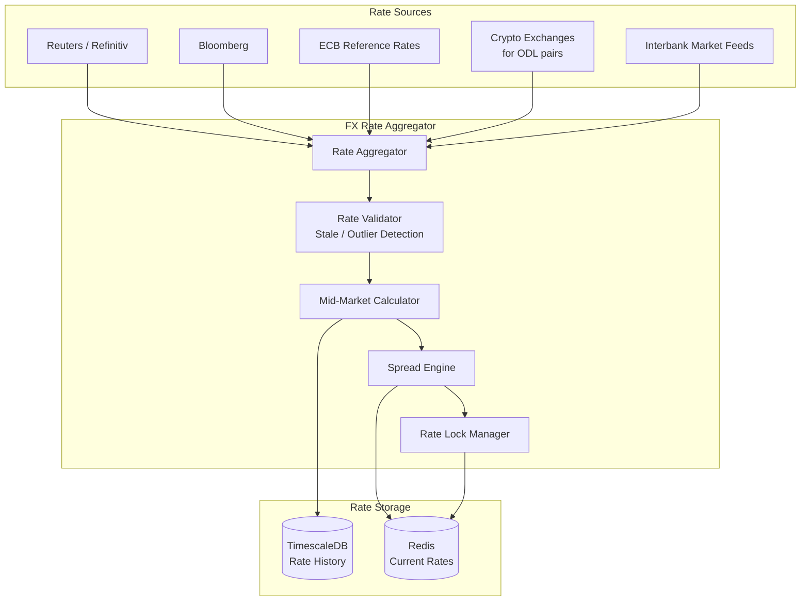

### Rate Aggregation Algorithm

```
1. Collect rates from N providers for currency pair (e.g., USD/INR)
2. Discard stale rates (> 30s old for major pairs, > 5min for exotic)
3. Detect and remove outliers (> 2 standard deviations from median)
4. Calculate weighted mid-market rate:
   mid_rate = Σ(rate_i * weight_i) / Σ(weight_i)
   where weight_i = volume_i * freshness_i * reliability_i
5. Apply corridor-specific spread:
   customer_rate = mid_rate * (1 - spread_pct / 100)
6. Round to appropriate decimal places per currency
```

### Spread Calculation

```
Base spread per corridor:
  - Major pairs (EUR/USD, GBP/USD): 0.15% - 0.30%
  - Popular corridors (USD/INR, USD/PHP): 0.30% - 0.50%
  - Exotic pairs (USD/NGN, USD/BDT): 0.50% - 1.50%
  - Crypto-bridged (via XRP/USDC): 0.10% - 0.25%

Dynamic spread adjustment:
  spread = base_spread
         + volatility_premium(current_vol / avg_vol)
         + liquidity_premium(if thin market)
         + time_premium(if off-hours)
         - volume_discount(user_tier)
         - competition_adjustment(corridor_competition)
```

### Route Planning

The Route Planner determines the optimal path for each transfer:

```
Direct route:   USD → INR (single hop via nostro account in India)
Indirect route: USD → GBP → INR (two hops, may be cheaper for some corridors)
Crypto bridge:  USD → USDC → XRP → INR (on-demand liquidity)
Hybrid route:   USD → SWIFT → EUR → SEPA → local bank
```

### Route Selection Algorithm

```
For each available route R in corridor C:
  cost(R) = fx_spread(R) + settlement_fee(R) + partner_fee(R)
  speed(R) = estimated_settlement_time(R)
  reliability(R) = historical_success_rate(R) * partner_health(R)

  score(R) = w_cost * normalize(cost(R))
           + w_speed * normalize(speed(R))
           + w_reliability * normalize(reliability(R))

Select route with highest score.
If primary route fails, fallback to next-best route.
```

### Nostro/Vostro Account Management

```
Nostro Account: Our account held at a foreign bank
  - US Company's USD account at HDFC India
  - Used for outgoing payments in destination currency

Vostro Account: Foreign entity's account held at our bank
  - Indian partner's INR account at our US bank
  - Used for incoming payments from that corridor

Pre-funding requirements:
  - Each nostro account must maintain minimum balance
  - Balance = avg_daily_volume * buffer_days (typically 2-3 days)
  - Rebalancing triggers when balance < 50% of target
  - Emergency top-up via SWIFT wire when balance < 20% of target
```

### Corridor Engine — Data Model

```sql
-- Corridor configuration
CREATE TABLE payment_corridors (
    corridor_id         UUID PRIMARY KEY DEFAULT gen_random_uuid(),
    source_country      CHAR(2) NOT NULL,          -- ISO 3166-1 alpha-2
    destination_country CHAR(2) NOT NULL,
    source_currency     CHAR(3) NOT NULL,          -- ISO 4217
    destination_currency CHAR(3) NOT NULL,
    status              VARCHAR(20) NOT NULL DEFAULT 'active',
    min_amount          DECIMAL(18,2) NOT NULL,
    max_amount          DECIMAL(18,2) NOT NULL,
    base_spread_bps     INTEGER NOT NULL,           -- basis points
    funding_methods     JSONB NOT NULL,             -- ["ACH", "DEBIT_CARD"]
    delivery_methods    JSONB NOT NULL,             -- ["BANK_DEPOSIT", "MOBILE_MONEY"]
    compliance_rules    JSONB,
    operating_hours     JSONB,                      -- timezone-aware schedule
    created_at          TIMESTAMPTZ NOT NULL DEFAULT NOW(),
    updated_at          TIMESTAMPTZ NOT NULL DEFAULT NOW(),
    UNIQUE(source_country, destination_country, source_currency, destination_currency)
);

-- FX rate snapshots
CREATE TABLE fx_rates (
    rate_id             BIGSERIAL PRIMARY KEY,
    currency_pair       VARCHAR(7) NOT NULL,        -- e.g., "USD/INR"
    mid_rate            DECIMAL(18,8) NOT NULL,
    bid_rate            DECIMAL(18,8),
    ask_rate            DECIMAL(18,8),
    source              VARCHAR(50) NOT NULL,
    captured_at         TIMESTAMPTZ NOT NULL DEFAULT NOW()
);

-- Create hypertable for TimescaleDB
SELECT create_hypertable('fx_rates', 'captured_at');

-- Rate locks for pending transfers
CREATE TABLE rate_locks (
    lock_id             UUID PRIMARY KEY DEFAULT gen_random_uuid(),
    transfer_id         UUID NOT NULL,
    currency_pair       VARCHAR(7) NOT NULL,
    locked_rate         DECIMAL(18,8) NOT NULL,
    spread_bps          INTEGER NOT NULL,
    customer_rate       DECIMAL(18,8) NOT NULL,
    locked_at           TIMESTAMPTZ NOT NULL DEFAULT NOW(),
    expires_at          TIMESTAMPTZ NOT NULL,
    status              VARCHAR(20) NOT NULL DEFAULT 'active',
    CONSTRAINT fk_transfer FOREIGN KEY (transfer_id) REFERENCES transfers(transfer_id)
);

-- Nostro/Vostro accounts
CREATE TABLE nostro_accounts (
    account_id          UUID PRIMARY KEY DEFAULT gen_random_uuid(),
    bank_name           VARCHAR(200) NOT NULL,
    bank_swift_code     VARCHAR(11) NOT NULL,
    account_number      VARCHAR(50) NOT NULL,
    currency            CHAR(3) NOT NULL,
    country             CHAR(2) NOT NULL,
    current_balance     DECIMAL(18,2) NOT NULL DEFAULT 0,
    target_balance      DECIMAL(18,2) NOT NULL,
    min_balance         DECIMAL(18,2) NOT NULL,
    last_reconciled_at  TIMESTAMPTZ,
    status              VARCHAR(20) NOT NULL DEFAULT 'active',
    created_at          TIMESTAMPTZ NOT NULL DEFAULT NOW()
);

-- Route configurations
CREATE TABLE payment_routes (
    route_id            UUID PRIMARY KEY DEFAULT gen_random_uuid(),
    corridor_id         UUID NOT NULL REFERENCES payment_corridors(corridor_id),
    route_name          VARCHAR(200) NOT NULL,
    route_type          VARCHAR(30) NOT NULL,        -- DIRECT, INDIRECT, CRYPTO_BRIDGE
    hops                JSONB NOT NULL,               -- ordered list of intermediaries
    estimated_time_mins INTEGER NOT NULL,
    fee_structure       JSONB NOT NULL,
    nostro_account_id   UUID REFERENCES nostro_accounts(account_id),
    priority            INTEGER NOT NULL DEFAULT 1,
    reliability_score   DECIMAL(5,4) NOT NULL DEFAULT 0.9500,
    status              VARCHAR(20) NOT NULL DEFAULT 'active',
    created_at          TIMESTAMPTZ NOT NULL DEFAULT NOW()
);

CREATE INDEX idx_corridors_countries ON payment_corridors(source_country, destination_country);
CREATE INDEX idx_fx_rates_pair_time ON fx_rates(currency_pair, captured_at DESC);
CREATE INDEX idx_rate_locks_transfer ON rate_locks(transfer_id);
CREATE INDEX idx_rate_locks_expiry ON rate_locks(expires_at) WHERE status = 'active';
CREATE INDEX idx_nostro_currency ON nostro_accounts(currency, country);
CREATE INDEX idx_routes_corridor ON payment_routes(corridor_id, priority);
```

---

## Subsystem 2 — Compliance & KYC/AML

### Purpose

The Compliance subsystem ensures every transfer meets regulatory requirements across all jurisdictions involved. This includes identity verification, sanctions screening, transaction monitoring, and regulatory reporting.

### Compliance Architecture

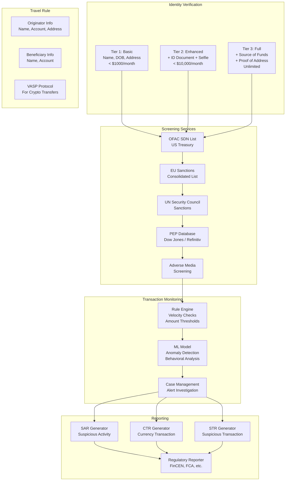

### KYC Tiers

```
Tier 1 — Basic (Low Risk):
  Required: Full name, date of birth, email, phone
  Verification: Database checks (credit bureau, voter roll)
  Limits: $1,000/month, $300/transfer
  Corridors: Domestic + major international

Tier 2 — Enhanced (Medium Risk):
  Required: Government ID (passport/DL), selfie (liveness check)
  Verification: Document OCR + face match + database checks
  Limits: $10,000/month, $5,000/transfer
  Corridors: All standard corridors

Tier 3 — Full (High Value):
  Required: Source of funds documentation, proof of address, employer info
  Verification: Manual review + automated checks
  Limits: $100,000/month (or custom)
  Corridors: All corridors including high-risk
```

### Sanctions Screening Pipeline

```
Input: transfer (sender name, recipient name, countries, purpose)

Step 1: Name Normalization
  - Transliteration (Arabic/Chinese/Cyrillic → Latin)
  - Remove titles, suffixes
  - Handle common name variants

Step 2: Fuzzy Matching against lists
  - OFAC SDN + Non-SDN (13,000+ entries)
  - EU Consolidated List (8,000+ entries)
  - UN Consolidated List (700+ entries)
  - Local lists (DFAT, SECO, MAS, etc.)

  Algorithms:
    - Jaro-Winkler similarity (threshold: 0.85)
    - Soundex/Metaphone for phonetic matching
    - Token-based matching for name order variations
    - Exact match on identifiers (passport, DOB)

Step 3: Scoring
  - match_score = max(jaro_winkler, phonetic, token_based)
  - If match_score >= 0.95 → AUTO_BLOCK (true positive)
  - If 0.85 <= match_score < 0.95 → MANUAL_REVIEW
  - If match_score < 0.85 → PASS

Step 4: Country Risk
  - Check sender/recipient country against sanctioned countries
  - Iran, North Korea, Syria, Cuba → AUTO_BLOCK
  - High-risk (FATF grey list) → Enhanced due diligence
```

### Transaction Monitoring Rules

```
Rule 1: Velocity Check
  IF count(transfers for user in 24h) > 5
  AND total_amount > $3,000
  THEN FLAG for review

Rule 2: Structuring Detection
  IF count(transfers for user in 7 days) > 3
  AND each transfer < $3,000
  AND total > $10,000
  THEN FLAG as potential structuring (smurfing)

Rule 3: Unusual Corridor
  IF user has no history in corridor
  AND transfer_amount > 5 * avg_transfer_amount
  THEN FLAG for review

Rule 4: Round-Trip Detection
  IF user sends to recipient R
  AND R sends back to user (or associate) within 30 days
  THEN FLAG as potential money laundering

Rule 5: High-Risk Corridor Threshold
  IF corridor_risk = HIGH
  AND transfer_amount > corridor_specific_threshold
  THEN FLAG for enhanced review

Rule 6: PEP Transfer
  IF sender OR recipient is_pep = TRUE
  THEN FLAG for senior management review
```

### ML-Based Anomaly Detection

```
Features:
  - Transfer amount (normalized by corridor)
  - Time of day (local timezone)
  - Frequency (transfers per week, month)
  - Recipient diversity (unique recipients in 90 days)
  - Corridor risk score
  - User account age
  - KYC tier
  - Funding method
  - Device fingerprint consistency
  - IP geolocation vs registered country

Model: Isolation Forest + LSTM for sequential behavior
Training: Supervised (labeled SAR data) + unsupervised (anomaly detection)
Threshold: Alert if anomaly_score > 0.7 (tuned for < 1% FPR)
Retraining: Weekly with new labeled data
```

### Compliance Data Model

```sql
-- KYC records
CREATE TABLE kyc_records (
    kyc_id              UUID PRIMARY KEY DEFAULT gen_random_uuid(),
    user_id             UUID NOT NULL REFERENCES users(user_id),
    tier                INTEGER NOT NULL,           -- 1, 2, 3
    status              VARCHAR(20) NOT NULL,       -- PENDING, VERIFIED, REJECTED, EXPIRED
    verification_method VARCHAR(50) NOT NULL,
    document_type       VARCHAR(50),                -- PASSPORT, DRIVERS_LICENSE, etc.
    document_country    CHAR(2),
    document_number_hash VARCHAR(64),               -- SHA-256 of document number
    face_match_score    DECIMAL(5,4),
    liveness_score      DECIMAL(5,4),
    verification_provider VARCHAR(50),              -- Jumio, Onfido, etc.
    verified_at         TIMESTAMPTZ,
    expires_at          TIMESTAMPTZ,
    rejection_reason    TEXT,
    metadata            JSONB,
    created_at          TIMESTAMPTZ NOT NULL DEFAULT NOW()
);

-- Sanctions screening results
CREATE TABLE sanctions_screenings (
    screening_id        UUID PRIMARY KEY DEFAULT gen_random_uuid(),
    transfer_id         UUID REFERENCES transfers(transfer_id),
    user_id             UUID REFERENCES users(user_id),
    screening_type      VARCHAR(30) NOT NULL,       -- TRANSFER, ONBOARDING, PERIODIC
    screened_name       VARCHAR(500) NOT NULL,
    matched_list        VARCHAR(50),                -- OFAC, EU, UN, LOCAL
    matched_entry       VARCHAR(500),
    match_score         DECIMAL(5,4),
    match_type          VARCHAR(30),                -- EXACT, FUZZY, PHONETIC
    result              VARCHAR(20) NOT NULL,       -- PASS, REVIEW, BLOCK
    reviewed_by         UUID,
    review_notes        TEXT,
    screening_data      JSONB,
    created_at          TIMESTAMPTZ NOT NULL DEFAULT NOW(),
    reviewed_at         TIMESTAMPTZ
);

-- Suspicious Activity Reports
CREATE TABLE suspicious_activity_reports (
    sar_id              UUID PRIMARY KEY DEFAULT gen_random_uuid(),
    user_id             UUID NOT NULL REFERENCES users(user_id),
    transfer_ids        UUID[] NOT NULL,
    alert_type          VARCHAR(50) NOT NULL,
    alert_source        VARCHAR(30) NOT NULL,       -- RULE, ML, MANUAL
    risk_score          DECIMAL(5,4),
    description         TEXT NOT NULL,
    investigation_notes TEXT,
    status              VARCHAR(20) NOT NULL,       -- OPEN, INVESTIGATING, FILED, CLOSED
    assigned_to         UUID,
    filed_with          VARCHAR(50),                -- FinCEN, FCA, etc.
    filing_reference    VARCHAR(100),
    created_at          TIMESTAMPTZ NOT NULL DEFAULT NOW(),
    filed_at            TIMESTAMPTZ,
    closed_at           TIMESTAMPTZ
);

-- Transaction monitoring alerts
CREATE TABLE tm_alerts (
    alert_id            UUID PRIMARY KEY DEFAULT gen_random_uuid(),
    user_id             UUID NOT NULL REFERENCES users(user_id),
    transfer_id         UUID REFERENCES transfers(transfer_id),
    rule_id             VARCHAR(50) NOT NULL,
    alert_type          VARCHAR(50) NOT NULL,
    severity            VARCHAR(10) NOT NULL,       -- LOW, MEDIUM, HIGH, CRITICAL
    details             JSONB NOT NULL,
    status              VARCHAR(20) NOT NULL DEFAULT 'open',
    assigned_to         UUID,
    resolution          VARCHAR(30),                -- FALSE_POSITIVE, ESCALATED, SAR_FILED
    created_at          TIMESTAMPTZ NOT NULL DEFAULT NOW(),
    resolved_at         TIMESTAMPTZ
);

CREATE INDEX idx_kyc_user ON kyc_records(user_id, tier);
CREATE INDEX idx_sanctions_transfer ON sanctions_screenings(transfer_id);
CREATE INDEX idx_sanctions_result ON sanctions_screenings(result, created_at);
CREATE INDEX idx_sar_status ON suspicious_activity_reports(status, created_at);
CREATE INDEX idx_alerts_status ON tm_alerts(status, severity, created_at);
CREATE INDEX idx_alerts_user ON tm_alerts(user_id, created_at);
```

---

## Subsystem 3 — Liquidity Management

### Purpose

Liquidity Management ensures sufficient funds are available in destination currencies to fulfill payouts. This is the financial backbone of cross-border payments — without adequate liquidity, transfers cannot be completed.

### Liquidity Architecture

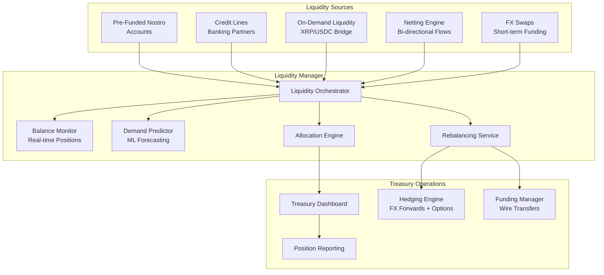

### Pre-Funding Strategy

```
For each corridor (e.g., USD → INR):

1. Calculate target balance:
   target = avg_daily_payout_volume * buffer_days

   Example:
     avg_daily_payouts = $2,000,000 (INR equivalent)
     buffer_days = 3
     target = $6,000,000

2. Set thresholds:
   high_water = target * 1.5 = $9,000,000
   low_water = target * 0.5 = $3,000,000
   critical = target * 0.2 = $1,200,000

3. Rebalancing triggers:
   IF balance < low_water → Initiate standard rebalance (T+1)
   IF balance < critical → Initiate emergency rebalance (same-day wire)
   IF balance > high_water → Sweep excess to treasury

4. Seasonal adjustment:
   - Eid, Diwali, Christmas → 2x multiplier
   - Month-end → 1.3x multiplier
   - Public holidays → pre-fund extra day
```

### On-Demand Liquidity (ODL) via Crypto

```
Traditional flow:
  USD (sender) → Pre-funded INR nostro → INR (recipient)
  Problem: Capital locked in nostro accounts worldwide

ODL flow:
  USD (sender) → Buy XRP/USDC → Transfer → Sell XRP/USDC → INR (recipient)
  Advantage: No pre-funding needed, instant settlement

ODL implementation:
  1. Sender funds transfer in USD
  2. Platform buys XRP on US exchange (Bitstamp, Kraken)
  3. XRP transferred to Indian exchange (CoinDCX, WazirX)
  4. XRP sold for INR on Indian exchange
  5. INR paid out to recipient via IMPS/NEFT

  Total time: 3-5 seconds for crypto leg, then local payout time
  Cost: Exchange spread (~0.1%) + network fee (~$0.01)
  Risk: FX slippage during execution (mitigated by atomic swaps)
```

### Netting Engine

```
Bi-directional corridor netting reduces liquidity needs:

Example: USD ↔ GBP corridor
  - Day's USD → GBP transfers: $5,000,000
  - Day's GBP → USD transfers: $4,200,000
  - Net position: $800,000 USD → GBP

  Without netting: Need $5M in GBP nostro + $4.2M in USD nostro
  With netting: Only need $800K in GBP nostro

Netting schedule:
  - Intra-day netting: Every 4 hours for major corridors
  - End-of-day netting: Daily for all corridors
  - Multi-lateral netting: Weekly across all corridors (CLS-style)
```

### Hedging Strategy

```
FX Exposure management:

1. Natural Hedge:
   - Match inflows and outflows in same currency
   - Netting reduces gross exposure

2. Forward Contracts:
   - Lock in FX rate for expected volumes
   - Rolling 30/60/90-day forwards
   - Cover 60-80% of expected volume

3. Options:
   - Buy put options for downside protection
   - Use for volatile/exotic currencies
   - Cost: 0.5-2% premium

4. Dynamic Hedging:
   hedge_ratio = min(1.0, exposure / threshold)

   IF exposure < $100K → No hedge (accept risk)
   IF $100K <= exposure < $1M → 50% forward hedge
   IF exposure >= $1M → 80% forward + 20% options
```

### Liquidity Data Model

```sql
-- Real-time balance positions
CREATE TABLE liquidity_positions (
    position_id         UUID PRIMARY KEY DEFAULT gen_random_uuid(),
    account_id          UUID NOT NULL REFERENCES nostro_accounts(account_id),
    currency            CHAR(3) NOT NULL,
    available_balance   DECIMAL(18,2) NOT NULL,
    pending_inflows     DECIMAL(18,2) NOT NULL DEFAULT 0,
    pending_outflows    DECIMAL(18,2) NOT NULL DEFAULT 0,
    projected_balance   DECIMAL(18,2) GENERATED ALWAYS AS
                        (available_balance + pending_inflows - pending_outflows) STORED,
    target_balance      DECIMAL(18,2) NOT NULL,
    low_water_mark      DECIMAL(18,2) NOT NULL,
    high_water_mark     DECIMAL(18,2) NOT NULL,
    last_updated        TIMESTAMPTZ NOT NULL DEFAULT NOW()
);

-- Rebalancing transactions
CREATE TABLE rebalance_transactions (
    rebalance_id        UUID PRIMARY KEY DEFAULT gen_random_uuid(),
    source_account_id   UUID NOT NULL REFERENCES nostro_accounts(account_id),
    target_account_id   UUID NOT NULL REFERENCES nostro_accounts(account_id),
    amount              DECIMAL(18,2) NOT NULL,
    currency            CHAR(3) NOT NULL,
    trigger_type        VARCHAR(30) NOT NULL,    -- LOW_WATER, CRITICAL, SEASONAL, MANUAL
    method              VARCHAR(30) NOT NULL,    -- WIRE, SWIFT, ODL, INTERNAL
    fx_rate             DECIMAL(18,8),
    status              VARCHAR(20) NOT NULL DEFAULT 'pending',
    initiated_at        TIMESTAMPTZ NOT NULL DEFAULT NOW(),
    completed_at        TIMESTAMPTZ,
    reference           VARCHAR(100)
);

-- Hedging positions
CREATE TABLE hedge_positions (
    hedge_id            UUID PRIMARY KEY DEFAULT gen_random_uuid(),
    currency_pair       VARCHAR(7) NOT NULL,
    hedge_type          VARCHAR(20) NOT NULL,     -- FORWARD, OPTION, SWAP
    notional_amount     DECIMAL(18,2) NOT NULL,
    strike_rate         DECIMAL(18,8),
    premium             DECIMAL(18,2),
    counterparty        VARCHAR(200) NOT NULL,
    trade_date          DATE NOT NULL,
    value_date          DATE NOT NULL,
    maturity_date       DATE NOT NULL,
    status              VARCHAR(20) NOT NULL DEFAULT 'active',
    pnl                 DECIMAL(18,2),
    created_at          TIMESTAMPTZ NOT NULL DEFAULT NOW()
);

-- Demand forecasts
CREATE TABLE liquidity_forecasts (
    forecast_id         UUID PRIMARY KEY DEFAULT gen_random_uuid(),
    corridor_id         UUID NOT NULL REFERENCES payment_corridors(corridor_id),
    forecast_date       DATE NOT NULL,
    predicted_volume    DECIMAL(18,2) NOT NULL,
    confidence_lower    DECIMAL(18,2) NOT NULL,
    confidence_upper    DECIMAL(18,2) NOT NULL,
    model_version       VARCHAR(50) NOT NULL,
    actual_volume       DECIMAL(18,2),             -- filled after the fact
    created_at          TIMESTAMPTZ NOT NULL DEFAULT NOW(),
    UNIQUE(corridor_id, forecast_date, model_version)
);

CREATE INDEX idx_positions_account ON liquidity_positions(account_id);
CREATE INDEX idx_positions_currency ON liquidity_positions(currency);
CREATE INDEX idx_rebalance_status ON rebalance_transactions(status, initiated_at);
CREATE INDEX idx_hedge_maturity ON hedge_positions(maturity_date) WHERE status = 'active';
CREATE INDEX idx_forecast_corridor ON liquidity_forecasts(corridor_id, forecast_date);
```

---

## Subsystem 4 — Settlement & Reconciliation

### Purpose

Settlement is the actual movement of money between financial institutions. Reconciliation ensures that every debit has a corresponding credit and identifies discrepancies.

### Settlement Methods

| Method | Speed | Cost | Use Case |
|--------|-------|------|----------|
| SWIFT MT103 | 1-5 days | $25-50 | Large value, traditional |
| SWIFT gpi | Same day | $15-30 | Tracked, faster SWIFT |
| SEPA Instant | < 10 sec | EUR 0.20 | Eurozone |
| Faster Payments | < 2 hours | Free | UK domestic |
| IMPS/UPI | Instant | INR 5-15 | India |
| ACH / Direct Credit | 1-3 days | $0.25-1 | US, batch |
| RTGS | Same day | $25+ | High value, time-critical |
| Blockchain | 3-60 sec | $0.01-5 | Crypto-bridged corridors |
| Mobile Money | Instant | 1-2% | Africa, SE Asia |

### Settlement Engine Architecture

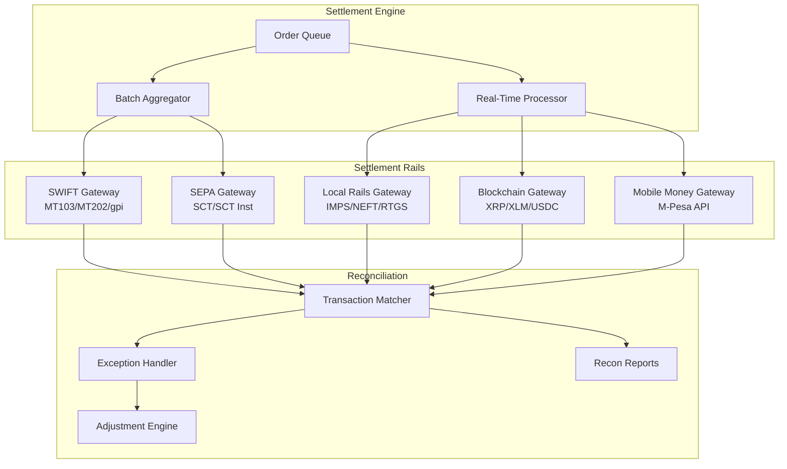

### SWIFT Message Flow

```
Outgoing MT103 (Customer Transfer):

  Field 20:  Transaction Reference
  Field 23B: Bank Operation Code (CRED)
  Field 32A: Value Date / Currency / Amount
  Field 33B: Currency / Instructed Amount
  Field 50K: Ordering Customer (Name + Address)
  Field 52A: Ordering Institution (SWIFT BIC)
  Field 53A: Sender's Correspondent
  Field 56A: Intermediary Institution
  Field 57A: Account With Institution
  Field 59:  Beneficiary Customer (Name + Account)
  Field 70:  Remittance Information
  Field 71A: Details of Charges (SHA/BEN/OUR)
  Field 72:  Sender to Receiver Information

MT202 (Bank Transfer):
  Used for the cover payment between correspondent banks
  Sent in parallel with MT103

SWIFT gpi (Global Payments Innovation):
  - Adds UETR (Unique End-to-End Transaction Reference)
  - gpi Tracker provides real-time status updates
  - SLA: Same-day settlement for 90%+ of payments
```

### Blockchain Settlement Flow

```
1. Initiation:
   Platform creates settlement instruction
   Amount: $10,000 equivalent
   Route: USD → XRP → PHP

2. Source Exchange (US):
   - Platform sends USD to exchange via wire/ACH
   - Exchange credits USD balance
   - Market order: Buy 15,384 XRP at $0.65

3. Cross-Border Transfer:
   - XRP sent from US exchange wallet to PH exchange wallet
   - XRP Ledger consensus: ~4 seconds
   - Transaction fee: 0.00001 XRP (~$0.000007)

4. Destination Exchange (PH):
   - PH exchange receives XRP
   - Market order: Sell 15,384 XRP for PHP
   - PHP credited to platform's peso balance

5. Local Payout:
   - Platform initiates InstaPay/PESONet transfer
   - PHP arrives in recipient's bank account

Total settlement time: < 5 minutes
Total cost: ~0.1-0.3% (exchange spreads)
```

### Reconciliation Process

```
Three-Way Reconciliation:

1. Internal Records ↔ Bank Statements
   - Match transfers against bank statement entries
   - Identify unmatched items (missing credits/debits)
   - Key: amount, date, reference number

2. Internal Records ↔ Partner Confirmations
   - Match outgoing instructions with partner acknowledgments
   - Verify delivery confirmations
   - Key: transfer_id, partner_reference

3. Bank Statements ↔ Partner Confirmations
   - Cross-check for discrepancies
   - Identify fee deductions, FX differences

Matching Algorithm:
  For each internal record R:
    candidates = bank_entries WHERE
      ABS(R.amount - entry.amount) < tolerance AND
      ABS(R.date - entry.date) <= 2 days AND
      (R.reference = entry.reference OR
       fuzzy_match(R.description, entry.description) > 0.8)

    IF len(candidates) == 1 → AUTO_MATCH
    IF len(candidates) > 1 → MANUAL_REVIEW (ambiguous)
    IF len(candidates) == 0 → EXCEPTION (unmatched)

Daily reconciliation targets:
  - Auto-match rate: > 95%
  - Exception resolution: < 48 hours
  - Break tolerance: < 0.01% of daily volume
```

### Settlement Data Model

```sql
-- Settlement instructions
CREATE TABLE settlement_instructions (
    instruction_id      UUID PRIMARY KEY DEFAULT gen_random_uuid(),
    transfer_id         UUID NOT NULL REFERENCES transfers(transfer_id),
    settlement_method   VARCHAR(30) NOT NULL,
    settlement_rail     VARCHAR(30) NOT NULL,
    source_account_id   UUID REFERENCES nostro_accounts(account_id),
    destination_account VARCHAR(100) NOT NULL,
    destination_bank    VARCHAR(200),
    destination_swift   VARCHAR(11),
    amount              DECIMAL(18,2) NOT NULL,
    currency            CHAR(3) NOT NULL,
    value_date          DATE NOT NULL,
    priority            VARCHAR(10) NOT NULL DEFAULT 'NORMAL',
    batch_id            UUID,
    swift_uetr          UUID,
    blockchain_tx_hash  VARCHAR(128),
    status              VARCHAR(20) NOT NULL DEFAULT 'pending',
    attempts            INTEGER NOT NULL DEFAULT 0,
    last_error          TEXT,
    created_at          TIMESTAMPTZ NOT NULL DEFAULT NOW(),
    sent_at             TIMESTAMPTZ,
    confirmed_at        TIMESTAMPTZ,
    settled_at          TIMESTAMPTZ
);

-- Settlement batches
CREATE TABLE settlement_batches (
    batch_id            UUID PRIMARY KEY DEFAULT gen_random_uuid(),
    settlement_rail     VARCHAR(30) NOT NULL,
    destination_bank    VARCHAR(200) NOT NULL,
    currency            CHAR(3) NOT NULL,
    instruction_count   INTEGER NOT NULL,
    total_amount        DECIMAL(18,2) NOT NULL,
    status              VARCHAR(20) NOT NULL DEFAULT 'pending',
    submitted_at        TIMESTAMPTZ,
    acknowledged_at     TIMESTAMPTZ,
    settled_at          TIMESTAMPTZ,
    created_at          TIMESTAMPTZ NOT NULL DEFAULT NOW()
);

-- Reconciliation records
CREATE TABLE reconciliation_records (
    recon_id            UUID PRIMARY KEY DEFAULT gen_random_uuid(),
    recon_date          DATE NOT NULL,
    account_id          UUID NOT NULL REFERENCES nostro_accounts(account_id),
    internal_record_id  UUID,
    bank_statement_id   VARCHAR(100),
    partner_reference   VARCHAR(100),
    internal_amount     DECIMAL(18,2),
    bank_amount         DECIMAL(18,2),
    partner_amount      DECIMAL(18,2),
    currency            CHAR(3) NOT NULL,
    match_status        VARCHAR(20) NOT NULL,    -- MATCHED, PARTIAL, UNMATCHED, EXCEPTION
    match_method        VARCHAR(20),             -- AUTO, MANUAL
    discrepancy_amount  DECIMAL(18,2),
    discrepancy_reason  VARCHAR(100),
    resolved_by         UUID,
    resolution_notes    TEXT,
    created_at          TIMESTAMPTZ NOT NULL DEFAULT NOW(),
    resolved_at         TIMESTAMPTZ
);

-- Exception queue
CREATE TABLE settlement_exceptions (
    exception_id        UUID PRIMARY KEY DEFAULT gen_random_uuid(),
    instruction_id      UUID REFERENCES settlement_instructions(instruction_id),
    exception_type      VARCHAR(50) NOT NULL,
    severity            VARCHAR(10) NOT NULL,
    description         TEXT NOT NULL,
    raw_response        JSONB,
    assigned_to         UUID,
    status              VARCHAR(20) NOT NULL DEFAULT 'open',
    resolution_action   VARCHAR(50),
    created_at          TIMESTAMPTZ NOT NULL DEFAULT NOW(),
    resolved_at         TIMESTAMPTZ
);

CREATE INDEX idx_settlement_transfer ON settlement_instructions(transfer_id);
CREATE INDEX idx_settlement_status ON settlement_instructions(status, value_date);
CREATE INDEX idx_settlement_batch ON settlement_instructions(batch_id);
CREATE INDEX idx_settlement_uetr ON settlement_instructions(swift_uetr);
CREATE INDEX idx_recon_date ON reconciliation_records(recon_date, account_id);
CREATE INDEX idx_recon_status ON reconciliation_records(match_status) WHERE match_status != 'MATCHED';
CREATE INDEX idx_exceptions_status ON settlement_exceptions(status, severity);
```

---

## Subsystem 5 — Fiat On/Off Ramp

### Purpose

The Fiat Ramp subsystem handles the "first mile" (collecting money from sender) and "last mile" (delivering money to recipient) across diverse payment infrastructures worldwide.

### Ramp Architecture

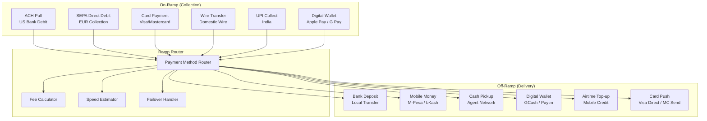

### Payment Method Matrix

| Country | On-Ramp Methods | Off-Ramp Methods | Instant? |
|---------|----------------|------------------|----------|
| US | ACH, Wire, Card, Apple Pay | ACH Push, Zelle | ACH: No, Zelle: Yes |
| UK | Faster Payments, Card | Faster Payments | Yes |
| EU | SEPA, SEPA Instant, Card | SEPA, SEPA Instant | SEPA Inst: Yes |
| India | UPI, NEFT, IMPS, Card | IMPS, UPI, NEFT | IMPS/UPI: Yes |
| Philippines | Card, GCash, Bank | InstaPay, GCash, Cash | InstaPay: Yes |
| Kenya | M-Pesa, Card, Bank | M-Pesa, Bank, Cash | M-Pesa: Yes |
| Nigeria | Card, Bank | Bank, Mobile Money | Bank: Same day |
| Bangladesh | Card, bKash | bKash, Bank | bKash: Yes |
| Mexico | SPEI, Card | SPEI, Cash (OXXO) | SPEI: Yes |
| Brazil | PIX, Card, TED | PIX, Bank | PIX: Yes |

### ACH Integration (US)

```
ACH Pull (Collection):
  1. Customer authorizes bank debit (Plaid link or manual entry)
  2. Create ACH debit file (NACHA format)
  3. Submit to ODFI (Originating Depository Financial Institution)
  4. ACH operator (FedACH / EPN) processes
  5. RDFI (Receiving DFI) debits customer account
  6. Settlement: T+1 (same-day ACH available for < $1M)

  Risk: Returns (R01-insufficient funds, R02-closed account, R10-unauthorized)
  Mitigation: Plaid balance check, velocity limits, return rate monitoring

ACH Push (Delivery):
  1. Create ACH credit file
  2. Submit to ODFI
  3. RDFI credits recipient account
  4. Settlement: T+1 or same-day

NACHA File Format:
  File Header (1 record)
  Batch Header (per originator)
  Entry Detail Records (per transaction)
    - Transaction Code (22=checking credit, 27=checking debit)
    - RDFI Routing Number
    - Account Number
    - Amount (in cents)
    - Individual Name
    - Trace Number
  Batch Control
  File Control
```

### SEPA Integration (Europe)

```
SEPA Credit Transfer (SCT):
  - Coverage: 36 countries, EUR only
  - Settlement: T+1 business day
  - Max amount: No limit
  - Cost: < EUR 0.20 per transaction

SEPA Instant Credit Transfer (SCT Inst):
  - Settlement: < 10 seconds, 24/7/365
  - Max amount: EUR 100,000 (increasing)
  - Cost: EUR 0.20 - 0.50
  - Availability: ~60% of SEPA banks (growing)

SEPA Direct Debit (SDD):
  - Customer signs mandate
  - Platform submits collection
  - Settlement: D+2 (core) or D+1 (B2B)
  - Returns: Up to 8 weeks (unauthorized)
  - Returns: Up to 13 months (no mandate)

Message format: ISO 20022 XML (pain.001, pain.002, pain.008)
```

### IMPS/UPI Integration (India)

```
IMPS (Immediate Payment Service):
  - Real-time, 24/7
  - Max: INR 5,00,000 (~$6,000)
  - Cost: INR 5-15
  - Requires: Account number + IFSC code

UPI (Unified Payments Interface):
  - Real-time, 24/7
  - Max: INR 1,00,000 per transaction
  - Cost: Near zero
  - Requires: UPI ID (VPA) or QR code

Integration via:
  - Direct NPCI membership (complex, high volume)
  - Banking partner API (HDFC, ICICI, SBI)
  - Aggregator (Razorpay, Cashfree, PayU)

Webhook flow:
  1. Platform initiates IMPS/UPI transfer via partner API
  2. Partner submits to NPCI
  3. NPCI routes to beneficiary bank
  4. Beneficiary bank credits account
  5. Confirmation callback to platform
  6. Platform updates transfer status
```

### Mobile Money Integration (M-Pesa)

```
M-Pesa (Kenya, Tanzania, etc.):
  - 50M+ active users in Kenya alone
  - Real-time transfers
  - Max: KES 300,000 (~$2,300) per transaction

Integration options:
  1. Safaricom Daraja API (direct)
  2. Aggregator (Flutterwave, Africa's Talking)

B2C Payment flow:
  POST /mpesa/b2c/v1/paymentrequest
  {
    "InitiatorName": "PlatformAdmin",
    "SecurityCredential": "encrypted_credential",
    "CommandID": "BusinessPayment",
    "Amount": 5000,
    "PartyA": "600XXX",        // Business short code
    "PartyB": "2547XXXXXXXX",  // Recipient phone number
    "Remarks": "Remittance",
    "QueueTimeOutURL": "https://api.platform.com/mpesa/timeout",
    "ResultURL": "https://api.platform.com/mpesa/result"
  }

  Response: Asynchronous — result delivered to ResultURL
  Success rate: ~95% (phone must be on, sufficient float at agent)
```

### Fiat Ramp Data Model

```sql
-- Payment methods (on-ramp)
CREATE TABLE funding_sources (
    source_id           UUID PRIMARY KEY DEFAULT gen_random_uuid(),
    user_id             UUID NOT NULL REFERENCES users(user_id),
    method_type         VARCHAR(30) NOT NULL,
    provider            VARCHAR(50) NOT NULL,
    -- Bank account details (encrypted)
    bank_name           VARCHAR(200),
    account_last_four   VARCHAR(4),
    routing_number_hash VARCHAR(64),
    iban_hash           VARCHAR(64),
    -- Card details (tokenized)
    card_token          VARCHAR(200),
    card_last_four      VARCHAR(4),
    card_brand          VARCHAR(20),
    card_expiry         VARCHAR(7),
    -- Mobile money
    mobile_number_hash  VARCHAR(64),
    mobile_provider     VARCHAR(50),
    -- Status
    status              VARCHAR(20) NOT NULL DEFAULT 'active',
    verified_at         TIMESTAMPTZ,
    plaid_access_token  VARCHAR(200),          -- encrypted
    created_at          TIMESTAMPTZ NOT NULL DEFAULT NOW()
);

-- Delivery methods (off-ramp)
CREATE TABLE delivery_methods (
    method_id           UUID PRIMARY KEY DEFAULT gen_random_uuid(),
    user_id             UUID NOT NULL REFERENCES users(user_id),
    recipient_id        UUID NOT NULL REFERENCES recipients(recipient_id),
    method_type         VARCHAR(30) NOT NULL,    -- BANK, MOBILE_MONEY, CASH, WALLET
    country             CHAR(2) NOT NULL,
    currency            CHAR(3) NOT NULL,
    -- Bank details
    bank_name           VARCHAR(200),
    bank_code           VARCHAR(20),
    branch_code         VARCHAR(20),
    account_number_enc  BYTEA,
    swift_code          VARCHAR(11),
    iban_enc            BYTEA,
    -- Mobile money
    mobile_number_enc   BYTEA,
    mobile_provider     VARCHAR(50),
    -- Cash pickup
    pickup_network      VARCHAR(50),
    pickup_location_id  VARCHAR(100),
    -- Status
    status              VARCHAR(20) NOT NULL DEFAULT 'active',
    verified_at         TIMESTAMPTZ,
    created_at          TIMESTAMPTZ NOT NULL DEFAULT NOW()
);

-- Funding transactions (on-ramp)
CREATE TABLE funding_transactions (
    funding_id          UUID PRIMARY KEY DEFAULT gen_random_uuid(),
    transfer_id         UUID NOT NULL REFERENCES transfers(transfer_id),
    source_id           UUID NOT NULL REFERENCES funding_sources(source_id),
    amount              DECIMAL(18,2) NOT NULL,
    currency            CHAR(3) NOT NULL,
    method              VARCHAR(30) NOT NULL,
    provider_reference  VARCHAR(200),
    status              VARCHAR(20) NOT NULL DEFAULT 'pending',
    -- ACH-specific
    ach_trace_number    VARCHAR(30),
    ach_return_code     VARCHAR(10),
    -- Card-specific
    card_auth_code      VARCHAR(20),
    card_avs_result     VARCHAR(5),
    card_cvv_result     VARCHAR(5),
    -- Timing
    initiated_at        TIMESTAMPTZ NOT NULL DEFAULT NOW(),
    cleared_at          TIMESTAMPTZ,
    failed_at           TIMESTAMPTZ,
    failure_reason      TEXT
);

-- Payout transactions (off-ramp)
CREATE TABLE payout_transactions (
    payout_id           UUID PRIMARY KEY DEFAULT gen_random_uuid(),
    transfer_id         UUID NOT NULL REFERENCES transfers(transfer_id),
    method_id           UUID NOT NULL REFERENCES delivery_methods(method_id),
    amount              DECIMAL(18,2) NOT NULL,
    currency            CHAR(3) NOT NULL,
    method              VARCHAR(30) NOT NULL,
    partner             VARCHAR(50) NOT NULL,
    partner_reference   VARCHAR(200),
    status              VARCHAR(20) NOT NULL DEFAULT 'pending',
    attempts            INTEGER NOT NULL DEFAULT 0,
    last_error          TEXT,
    initiated_at        TIMESTAMPTZ NOT NULL DEFAULT NOW(),
    confirmed_at        TIMESTAMPTZ,
    failed_at           TIMESTAMPTZ,
    failure_reason      TEXT
);

-- Recipients
CREATE TABLE recipients (
    recipient_id        UUID PRIMARY KEY DEFAULT gen_random_uuid(),
    user_id             UUID NOT NULL REFERENCES users(user_id),
    first_name          VARCHAR(100) NOT NULL,
    last_name           VARCHAR(100) NOT NULL,
    country             CHAR(2) NOT NULL,
    relationship        VARCHAR(50),
    nickname            VARCHAR(100),
    created_at          TIMESTAMPTZ NOT NULL DEFAULT NOW()
);

CREATE INDEX idx_funding_sources_user ON funding_sources(user_id, status);
CREATE INDEX idx_delivery_methods_user ON delivery_methods(user_id, recipient_id);
CREATE INDEX idx_funding_tx_transfer ON funding_transactions(transfer_id);
CREATE INDEX idx_funding_tx_status ON funding_transactions(status, initiated_at);
CREATE INDEX idx_payout_tx_transfer ON payout_transactions(transfer_id);
CREATE INDEX idx_payout_tx_status ON payout_transactions(status, initiated_at);
CREATE INDEX idx_recipients_user ON recipients(user_id);
```

---

## Low-Level Design

### Core Transfer Entity

```sql
CREATE TABLE transfers (
    transfer_id         UUID PRIMARY KEY DEFAULT gen_random_uuid(),
    idempotency_key     VARCHAR(100) NOT NULL UNIQUE,
    user_id             UUID NOT NULL REFERENCES users(user_id),
    recipient_id        UUID NOT NULL REFERENCES recipients(recipient_id),

    -- Amounts
    source_amount       DECIMAL(18,2) NOT NULL,
    source_currency     CHAR(3) NOT NULL,
    destination_amount  DECIMAL(18,2) NOT NULL,
    destination_currency CHAR(3) NOT NULL,
    fx_rate             DECIMAL(18,8) NOT NULL,
    rate_lock_id        UUID REFERENCES rate_locks(lock_id),

    -- Fees
    platform_fee        DECIMAL(18,2) NOT NULL DEFAULT 0,
    partner_fee         DECIMAL(18,2) NOT NULL DEFAULT 0,
    total_fee           DECIMAL(18,2) NOT NULL DEFAULT 0,

    -- Routing
    corridor_id         UUID NOT NULL REFERENCES payment_corridors(corridor_id),
    route_id            UUID REFERENCES payment_routes(route_id),
    funding_method      VARCHAR(30) NOT NULL,
    delivery_method     VARCHAR(30) NOT NULL,

    -- Status
    status              VARCHAR(30) NOT NULL DEFAULT 'created',
    sub_status          VARCHAR(50),

    -- Compliance
    compliance_status   VARCHAR(20) NOT NULL DEFAULT 'pending',
    risk_score          DECIMAL(5,4),

    -- Timestamps
    created_at          TIMESTAMPTZ NOT NULL DEFAULT NOW(),
    funded_at           TIMESTAMPTZ,
    compliance_cleared_at TIMESTAMPTZ,
    settlement_initiated_at TIMESTAMPTZ,
    delivered_at        TIMESTAMPTZ,
    completed_at        TIMESTAMPTZ,
    cancelled_at        TIMESTAMPTZ,
    failed_at           TIMESTAMPTZ,

    -- References
    partner_reference   VARCHAR(200),
    swift_uetr          UUID,
    blockchain_tx_hash  VARCHAR(128),

    -- Metadata
    purpose             VARCHAR(100),
    reference_message   VARCHAR(500),
    metadata            JSONB,

    -- Version for optimistic locking
    version             INTEGER NOT NULL DEFAULT 1
);

CREATE INDEX idx_transfers_user ON transfers(user_id, created_at DESC);
CREATE INDEX idx_transfers_status ON transfers(status, created_at);
CREATE INDEX idx_transfers_idempotency ON transfers(idempotency_key);
CREATE INDEX idx_transfers_corridor ON transfers(corridor_id, created_at DESC);
CREATE INDEX idx_transfers_compliance ON transfers(compliance_status) WHERE compliance_status != 'cleared';
```

### Users Table

```sql
CREATE TABLE users (
    user_id             UUID PRIMARY KEY DEFAULT gen_random_uuid(),
    email               VARCHAR(255) NOT NULL UNIQUE,
    phone_number        VARCHAR(20),
    phone_verified      BOOLEAN NOT NULL DEFAULT FALSE,
    first_name          VARCHAR(100) NOT NULL,
    last_name           VARCHAR(100) NOT NULL,
    date_of_birth       DATE,
    country             CHAR(2) NOT NULL,
    nationality         CHAR(2),
    address             JSONB,
    kyc_tier            INTEGER NOT NULL DEFAULT 0,
    kyc_status          VARCHAR(20) NOT NULL DEFAULT 'unverified',
    risk_level          VARCHAR(10) NOT NULL DEFAULT 'standard',
    is_pep              BOOLEAN NOT NULL DEFAULT FALSE,
    monthly_transfer_limit DECIMAL(18,2),
    monthly_transferred DECIMAL(18,2) NOT NULL DEFAULT 0,
    status              VARCHAR(20) NOT NULL DEFAULT 'active',
    created_at          TIMESTAMPTZ NOT NULL DEFAULT NOW(),
    updated_at          TIMESTAMPTZ NOT NULL DEFAULT NOW()
);

CREATE INDEX idx_users_email ON users(email);
CREATE INDEX idx_users_kyc ON users(kyc_status, kyc_tier);
CREATE INDEX idx_users_country ON users(country);
```

### Transfer Event Sourcing

```sql
-- Every state change is recorded as an immutable event
CREATE TABLE transfer_events (
    event_id            UUID PRIMARY KEY DEFAULT gen_random_uuid(),
    transfer_id         UUID NOT NULL REFERENCES transfers(transfer_id),
    event_type          VARCHAR(50) NOT NULL,
    previous_status     VARCHAR(30),
    new_status          VARCHAR(30),
    actor               VARCHAR(50) NOT NULL,        -- system, user, compliance_officer, etc.
    details             JSONB,
    created_at          TIMESTAMPTZ NOT NULL DEFAULT NOW()
);

CREATE INDEX idx_events_transfer ON transfer_events(transfer_id, created_at);
CREATE INDEX idx_events_type ON transfer_events(event_type, created_at);
```

### Audit Trail

```sql
CREATE TABLE audit_log (
    audit_id            BIGSERIAL PRIMARY KEY,
    entity_type         VARCHAR(50) NOT NULL,
    entity_id           UUID NOT NULL,
    action              VARCHAR(50) NOT NULL,
    actor_type          VARCHAR(20) NOT NULL,        -- USER, SYSTEM, ADMIN
    actor_id            UUID,
    ip_address          INET,
    user_agent          TEXT,
    old_values          JSONB,
    new_values          JSONB,
    created_at          TIMESTAMPTZ NOT NULL DEFAULT NOW()
);

-- Partition by month for performance
CREATE INDEX idx_audit_entity ON audit_log(entity_type, entity_id, created_at DESC);
CREATE INDEX idx_audit_actor ON audit_log(actor_id, created_at DESC);
```

---

## Data Models

All data models have been presented inline with their respective subsystems above. Here is the complete entity relationship summary:

```
users (1) ──── (N) transfers
users (1) ──── (N) recipients
users (1) ──── (N) funding_sources
users (1) ──── (N) kyc_records

recipients (1) ──── (N) delivery_methods
recipients (1) ──── (N) transfers

transfers (1) ──── (1) rate_locks
transfers (1) ──── (N) funding_transactions
transfers (1) ──── (N) payout_transactions
transfers (1) ──── (N) settlement_instructions
transfers (1) ──── (N) sanctions_screenings
transfers (1) ──── (N) transfer_events
transfers (N) ──── (1) payment_corridors
transfers (N) ──── (1) payment_routes

payment_corridors (1) ──── (N) payment_routes
payment_routes (N) ──── (1) nostro_accounts
nostro_accounts (1) ──── (N) liquidity_positions
nostro_accounts (1) ──── (N) reconciliation_records

settlement_instructions (N) ──── (1) settlement_batches
settlement_instructions (1) ──── (N) settlement_exceptions
```

---

## API Design

### REST API — Transfer Lifecycle

#### Create Quote

```
POST /api/v1/quotes
Authorization: Bearer {token}
Idempotency-Key: {uuid}
Content-Type: application/json

Request:
{
  "source_currency": "USD",
  "destination_currency": "INR",
  "source_amount": 500.00,
  // OR: "destination_amount": 41500.00,
  "delivery_method": "BANK_DEPOSIT",
  "destination_country": "IN"
}

Response: 200 OK
{
  "quote_id": "q_abc123",
  "source_amount": 500.00,
  "source_currency": "USD",
  "destination_amount": 41425.00,
  "destination_currency": "INR",
  "fx_rate": 83.15,
  "mid_market_rate": 83.30,
  "spread_pct": 0.18,
  "fee": 1.50,
  "total_cost": 501.50,
  "delivery_estimate": "within 1 hour",
  "rate_expires_at": "2026-03-24T14:30:00Z",
  "rate_guaranteed": true,
  "available_funding_methods": [
    {"method": "ACH", "fee": 0, "speed": "1-3 days"},
    {"method": "DEBIT_CARD", "fee": 1.50, "speed": "instant"},
    {"method": "WIRE", "fee": 5.00, "speed": "same day"}
  ]
}
```

#### Create Transfer

```
POST /api/v1/transfers
Authorization: Bearer {token}
Idempotency-Key: {uuid}
Content-Type: application/json

Request:
{
  "quote_id": "q_abc123",
  "recipient_id": "rec_xyz789",
  "funding_source_id": "fs_def456",
  "delivery_method_id": "dm_ghi012",
  "purpose": "family_support",
  "reference_message": "Monthly allowance"
}

Response: 201 Created
{
  "transfer_id": "txn_mno345",
  "status": "created",
  "source_amount": 500.00,
  "source_currency": "USD",
  "destination_amount": 41425.00,
  "destination_currency": "INR",
  "fx_rate": 83.15,
  "fee": 1.50,
  "total_debit": 501.50,
  "estimated_delivery": "2026-03-24T15:00:00Z",
  "tracking_url": "https://platform.com/track/txn_mno345",
  "created_at": "2026-03-24T13:00:00Z"
}
```

#### Get Transfer Status

```
GET /api/v1/transfers/{transfer_id}
Authorization: Bearer {token}

Response: 200 OK
{
  "transfer_id": "txn_mno345",
  "status": "delivered",
  "sub_status": "credited_to_account",
  "timeline": [
    {"status": "created", "at": "2026-03-24T13:00:00Z"},
    {"status": "funding_initiated", "at": "2026-03-24T13:00:05Z"},
    {"status": "funded", "at": "2026-03-24T13:00:10Z"},
    {"status": "compliance_cleared", "at": "2026-03-24T13:00:15Z"},
    {"status": "settlement_initiated", "at": "2026-03-24T13:00:20Z"},
    {"status": "delivered", "at": "2026-03-24T13:45:00Z"}
  ],
  "source_amount": 500.00,
  "source_currency": "USD",
  "destination_amount": 41425.00,
  "destination_currency": "INR",
  "recipient": {
    "name": "Priya K.",
    "delivery_method": "BANK_DEPOSIT",
    "bank_name": "HDFC Bank"
  },
  "delivery_confirmation": {
    "partner_reference": "IMPS20260324HDFC12345",
    "confirmed_at": "2026-03-24T13:45:00Z"
  }
}
```

#### List Transfers

```
GET /api/v1/transfers?status=completed&limit=20&offset=0
Authorization: Bearer {token}

Response: 200 OK
{
  "transfers": [...],
  "pagination": {
    "total": 47,
    "limit": 20,
    "offset": 0,
    "has_more": true
  }
}
```

#### Cancel Transfer

```
POST /api/v1/transfers/{transfer_id}/cancel
Authorization: Bearer {token}

Request:
{
  "reason": "recipient_details_incorrect"
}

Response: 200 OK
{
  "transfer_id": "txn_mno345",
  "status": "cancelled",
  "refund_amount": 501.50,
  "refund_currency": "USD",
  "refund_method": "original_funding_source",
  "refund_estimated_at": "2026-03-25T13:00:00Z"
}
```

### REST API — Recipients

```
POST /api/v1/recipients
GET /api/v1/recipients
GET /api/v1/recipients/{recipient_id}
PUT /api/v1/recipients/{recipient_id}
DELETE /api/v1/recipients/{recipient_id}

POST /api/v1/recipients/{recipient_id}/delivery-methods
GET /api/v1/recipients/{recipient_id}/delivery-methods
```

### REST API — Corridors & Rates

```
GET /api/v1/corridors?source_country=US&destination_country=IN

GET /api/v1/rates/USD/INR
Response:
{
  "pair": "USD/INR",
  "mid_rate": 83.30,
  "customer_rate": 83.15,
  "spread_pct": 0.18,
  "updated_at": "2026-03-24T13:00:00Z"
}

GET /api/v1/rates/USD/INR/history?period=30d&interval=1h
```

### SWIFT Message Examples

#### MT103 — Single Customer Credit Transfer

```
{1:F01WISEUSXXAXXX0000000000}
{2:I103HABORXXXXXN}
{3:{108:TRANSFER-REF-001}}
{4:
:20:TXN-MNO345
:23B:CRED
:32A:260324USD500,00
:33B:INR41425,00
:50K:/1234567890
JOHN DOE
123 MAIN STREET
NEW YORK NY 10001
:52A:WISEUSXX
:57A:HABORXXX
:59:/9876543210
PRIYA KUMAR
456 MG ROAD
MUMBAI 400001
:70:FAMILY SUPPORT - MONTHLY
:71A:SHA
:72:/INS/WISEUSXX
-}
```

#### pacs.008 — ISO 20022 Customer Credit Transfer

```xml
<FIToFICstmrCdtTrf>
  <GrpHdr>
    <MsgId>MSG-2026032400001</MsgId>
    <CreDtTm>2026-03-24T13:00:00Z</CreDtTm>
    <NbOfTxs>1</NbOfTxs>
    <SttlmInf>
      <SttlmMtd>INDA</SttlmMtd>
    </SttlmInf>
  </GrpHdr>
  <CdtTrfTxInf>
    <PmtId>
      <InstrId>INSTR-001</InstrId>
      <EndToEndId>E2E-TXN-MNO345</EndToEndId>
      <UETR>eb6305c9-1f7a-4219-8b3e-1f8ab3c4d5e6</UETR>
    </PmtId>
    <IntrBkSttlmAmt Ccy="USD">500.00</IntrBkSttlmAmt>
    <InstdAmt Ccy="INR">41425.00</InstdAmt>
    <XchgRate>82.85</XchgRate>
    <ChrgBr>SHAR</ChrgBr>
    <Dbtr>
      <Nm>John Doe</Nm>
      <PstlAdr>
        <StrtNm>123 Main Street</StrtNm>
        <TwnNm>New York</TwnNm>
        <Ctry>US</Ctry>
      </PstlAdr>
    </Dbtr>
    <DbtrAgt>
      <FinInstnId>
        <BICFI>WISEUSXX</BICFI>
      </FinInstnId>
    </DbtrAgt>
    <CdtrAgt>
      <FinInstnId>
        <BICFI>HABORXXX</BICFI>
      </FinInstnId>
    </CdtrAgt>
    <Cdtr>
      <Nm>Priya Kumar</Nm>
    </Cdtr>
    <CdtrAcct>
      <Id>
        <Othr>
          <Id>9876543210</Id>
        </Othr>
      </Id>
    </CdtrAcct>
    <Purp>
      <Cd>FAMI</Cd>
    </Purp>
    <RmtInf>
      <Ustrd>Monthly family support</Ustrd>
    </RmtInf>
  </CdtTrfTxInf>
</FIToFICstmrCdtTrf>
```

### Webhook API (Partner Callbacks)

```
POST /webhooks/settlement/{partner_id}
X-Signature: {HMAC-SHA256}
Content-Type: application/json

{
  "event_type": "payout.completed",
  "partner_reference": "IMPS20260324HDFC12345",
  "our_reference": "txn_mno345",
  "amount": 41425.00,
  "currency": "INR",
  "status": "SUCCESS",
  "completed_at": "2026-03-24T13:45:00Z",
  "details": {
    "beneficiary_name": "PRIYA KUMAR",
    "account_last_four": "3210",
    "bank_name": "HDFC BANK"
  }
}
```

---

## Indexing Strategy

### Primary Indexes

```sql
-- Transfer lookups (most common query patterns)
CREATE INDEX idx_transfers_user_status ON transfers(user_id, status, created_at DESC);
CREATE INDEX idx_transfers_status_created ON transfers(status, created_at);
CREATE INDEX idx_transfers_corridor_date ON transfers(corridor_id, created_at DESC);

-- Compliance screening (time-sensitive queries)
CREATE INDEX idx_sanctions_pending ON sanctions_screenings(result, created_at)
    WHERE result = 'REVIEW';

-- Rate lock expiry (background job)
CREATE INDEX idx_rate_locks_active_expiry ON rate_locks(expires_at)
    WHERE status = 'active';

-- Settlement pending (operational priority)
CREATE INDEX idx_settlement_pending ON settlement_instructions(status, priority, value_date)
    WHERE status IN ('pending', 'submitted');

-- Reconciliation unmatched (ops dashboard)
CREATE INDEX idx_recon_unmatched ON reconciliation_records(recon_date, match_status)
    WHERE match_status IN ('UNMATCHED', 'EXCEPTION');
```

### Composite Indexes for Reporting

```sql
-- Daily volume by corridor
CREATE INDEX idx_transfers_corridor_volume ON transfers(corridor_id, status, created_at)
    INCLUDE (source_amount, destination_amount);

-- User monthly aggregation
CREATE INDEX idx_transfers_user_monthly ON transfers(user_id, created_at)
    INCLUDE (source_amount, source_currency);

-- Compliance officer workqueue
CREATE INDEX idx_alerts_workqueue ON tm_alerts(status, severity DESC, created_at)
    WHERE status = 'open';
```

### Elasticsearch Indexes

```json
{
  "sanctions_index": {
    "mappings": {
      "properties": {
        "full_name": { "type": "text", "analyzer": "name_analyzer" },
        "aliases": { "type": "text", "analyzer": "name_analyzer" },
        "date_of_birth": { "type": "date" },
        "nationality": { "type": "keyword" },
        "passport_numbers": { "type": "keyword" },
        "list_source": { "type": "keyword" },
        "program": { "type": "keyword" },
        "entry_id": { "type": "keyword" },
        "last_updated": { "type": "date" }
      }
    },
    "settings": {
      "analysis": {
        "analyzer": {
          "name_analyzer": {
            "type": "custom",
            "tokenizer": "standard",
            "filter": ["lowercase", "asciifolding", "phonetic", "synonym_names"]
          }
        },
        "filter": {
          "phonetic": {
            "type": "phonetic",
            "encoder": "double_metaphone"
          }
        }
      }
    }
  }
}
```

### TimescaleDB for FX Rates

```sql
-- Continuous aggregate for rate history
CREATE MATERIALIZED VIEW fx_rates_hourly
WITH (timescaledb.continuous) AS
SELECT
    time_bucket('1 hour', captured_at) AS bucket,
    currency_pair,
    FIRST(mid_rate, captured_at) AS open_rate,
    MAX(mid_rate) AS high_rate,
    MIN(mid_rate) AS low_rate,
    LAST(mid_rate, captured_at) AS close_rate,
    AVG(mid_rate) AS avg_rate,
    COUNT(*) AS tick_count
FROM fx_rates
GROUP BY bucket, currency_pair;

-- Retention policy: keep raw ticks for 90 days, hourly forever
SELECT add_retention_policy('fx_rates', INTERVAL '90 days');
```

---

## Caching Strategy

### Cache Layers

```
Layer 1: CDN (CloudFront / Fastly)
  - Static assets, corridor information pages
  - TTL: 1 hour
  - Cache-Control: public, max-age=3600

Layer 2: API Gateway Cache
  - Rate quotes (short TTL)
  - Corridor configurations
  - TTL: 30 seconds for rates, 5 minutes for corridors

Layer 3: Redis Application Cache
  - Current FX rates: TTL 10 seconds
  - User session data: TTL 30 minutes
  - Corridor configs: TTL 5 minutes
  - Sanctions list checksums: TTL 1 minute
  - Rate locks: TTL = lock duration (30 min)

Layer 4: Local Process Cache
  - Currency/country metadata: TTL 1 hour
  - Feature flags: TTL 30 seconds
  - Static lookup tables: TTL 24 hours
```

### Redis Cache Design

```
# Current FX rates
SET fx:USD/INR:mid "83.30" EX 10
SET fx:USD/INR:customer "83.15" EX 10
SET fx:USD/INR:updated "2026-03-24T13:00:00Z" EX 10

# Rate lock (transfer-specific)
HSET ratelock:{lock_id} rate "83.15" pair "USD/INR" expires "2026-03-24T14:30:00Z"
EXPIRE ratelock:{lock_id} 1800

# User transfer limits (sliding window)
ZADD user_transfers:{user_id} {timestamp} {transfer_id}
ZRANGEBYSCORE user_transfers:{user_id} {now-30days} {now}
EXPIRE user_transfers:{user_id} 2592000

# Corridor availability (circuit breaker state)
SET corridor:US_IN:status "OPEN" EX 60
SET corridor:US_NG:status "DEGRADED" EX 60

# Nostro balance cache
HSET nostro:{account_id} balance "5234567.89" updated "2026-03-24T13:00:00Z"
EXPIRE nostro:{account_id} 30

# Idempotency keys (prevent duplicate transfers)
SET idempotency:{key} {transfer_id} EX 86400

# Sanctions list version
SET sanctions:ofac:version "2026-03-24-v1" EX 60
SET sanctions:eu:version "2026-03-24-v1" EX 60
```

### Cache Invalidation

```
Strategy: Write-through for financial data, TTL-based for reference data

Financial data (balances, positions):
  1. Update database
  2. Update Redis cache
  3. Publish invalidation event to Kafka
  4. Other instances consume and update local cache

FX rates:
  - Push-based: Rate feed publishes to Redis pub/sub
  - All instances subscribe and update local cache
  - Stale rate detection: If rate age > 30s, fetch fresh from source

Corridor configs:
  - Admin updates config in database
  - Publishes config_changed event
  - All instances invalidate and re-fetch
```

---

## Queue Architecture

### Kafka Topics

```
# Transfer lifecycle events
transfer.created          - New transfer initiated
transfer.funded           - Funding confirmed
transfer.compliance.check - Compliance check requested
transfer.compliance.result - Compliance check completed
transfer.settlement.request - Settlement requested
transfer.settlement.status - Settlement status update
transfer.delivered        - Delivery confirmed
transfer.failed           - Transfer failed
transfer.cancelled        - Transfer cancelled

# Compliance events
compliance.screening.request  - Sanctions screening request
compliance.screening.result   - Screening result
compliance.alert.created      - New monitoring alert
compliance.sar.filed          - SAR filed

# FX events
fx.rate.update            - New rate published
fx.rate.lock.created      - Rate locked for transfer
fx.rate.lock.expired      - Rate lock expired

# Settlement events
settlement.batch.created  - New settlement batch
settlement.batch.submitted - Batch submitted to rail
settlement.instruction.status - Individual instruction update
settlement.exception.created - Settlement exception

# Liquidity events
liquidity.position.update  - Balance change
liquidity.rebalance.trigger - Rebalance needed
liquidity.rebalance.complete - Rebalance done

# Notification events
notification.push          - Push notification
notification.sms           - SMS notification
notification.email         - Email notification

# Audit
audit.event               - All auditable events
```

### Topic Configuration

```
# High-throughput, order matters per transfer
transfer.*:
  partitions: 32
  replication-factor: 3
  key: transfer_id (ensures ordering per transfer)
  retention: 30 days
  min.insync.replicas: 2

# Compliance — must not lose events
compliance.*:
  partitions: 16
  replication-factor: 3
  key: screening_id or alert_id
  retention: 7 years (regulatory requirement)
  min.insync.replicas: 2

# FX rates — high frequency, loss acceptable
fx.rate.update:
  partitions: 8
  replication-factor: 2
  key: currency_pair
  retention: 7 days
  cleanup.policy: compact

# Audit — append-only, never delete
audit.event:
  partitions: 16
  replication-factor: 3
  retention: -1 (infinite)
  min.insync.replicas: 2
```

### Consumer Groups

```
# Transfer orchestrator — processes transfer lifecycle
transfer-orchestrator:
  topics: [transfer.*, compliance.screening.result, settlement.instruction.status]
  instances: 8
  processing: exactly-once (idempotent consumer + transactional producer)

# Compliance engine — sanctions screening
compliance-screener:
  topics: [compliance.screening.request]
  instances: 16
  processing: at-least-once with idempotency check

# Settlement engine — processes settlement instructions
settlement-processor:
  topics: [transfer.compliance.check (after clear), settlement.*]
  instances: 8
  processing: exactly-once

# Notification service — sends alerts
notification-sender:
  topics: [notification.*]
  instances: 4
  processing: at-least-once (duplicate SMS is acceptable)

# Analytics / Data warehouse
analytics-consumer:
  topics: [transfer.*, fx.*, liquidity.*]
  instances: 4
  processing: at-least-once, sink to data warehouse
```

### Dead Letter Queues

```
For each consumer group:
  DLQ topic: {topic}.dlq
  Retry policy:
    attempt 1: immediate retry
    attempt 2: retry after 1 minute
    attempt 3: retry after 5 minutes
    attempt 4: retry after 30 minutes
    attempt 5: move to DLQ, alert ops team

  DLQ monitoring:
    - Alert if DLQ depth > 0 for financial topics
    - Alert if DLQ depth > 100 for non-financial topics
    - Daily review of all DLQ messages
```

---

## State Machines

### Transfer State Machine

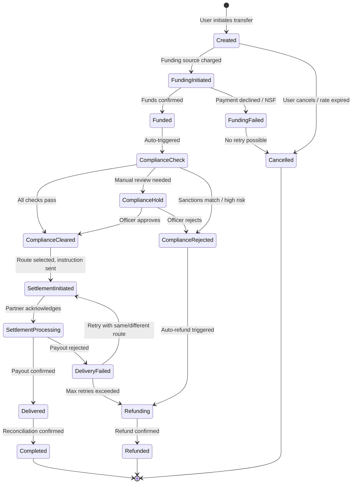

### Compliance Screening State Machine

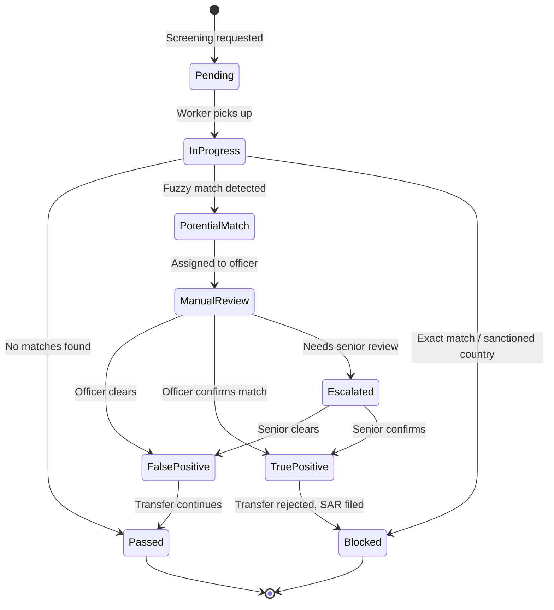

### Settlement Instruction State Machine

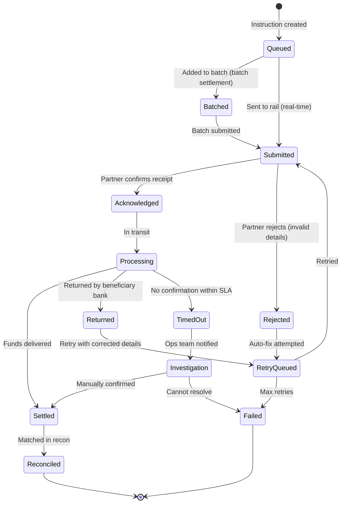

### Funding State Machine

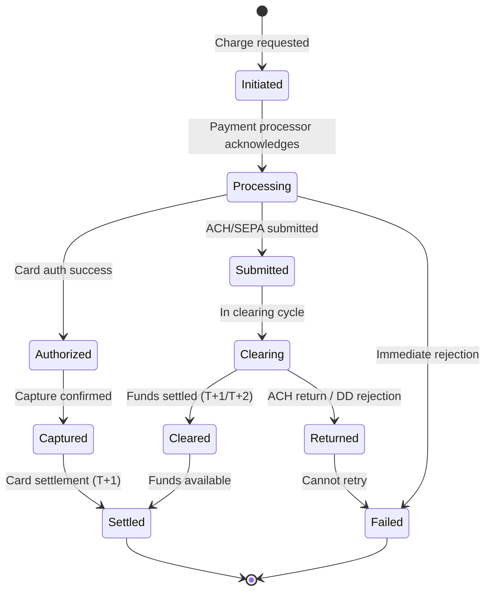

### Nostro Rebalancing State Machine

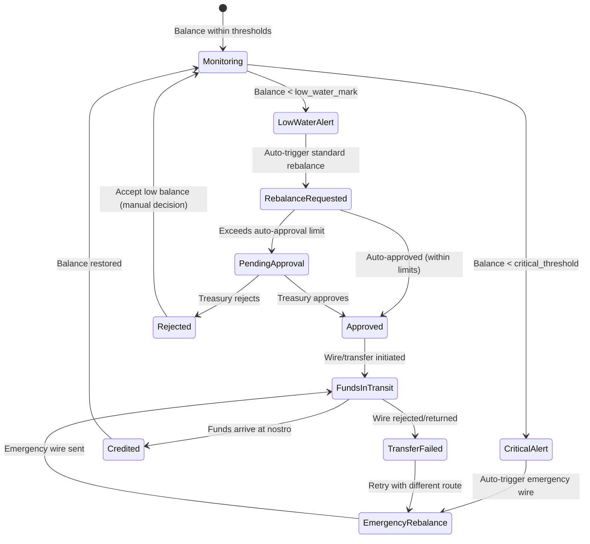

---

## Sequence Diagrams

### End-to-End Transfer Flow

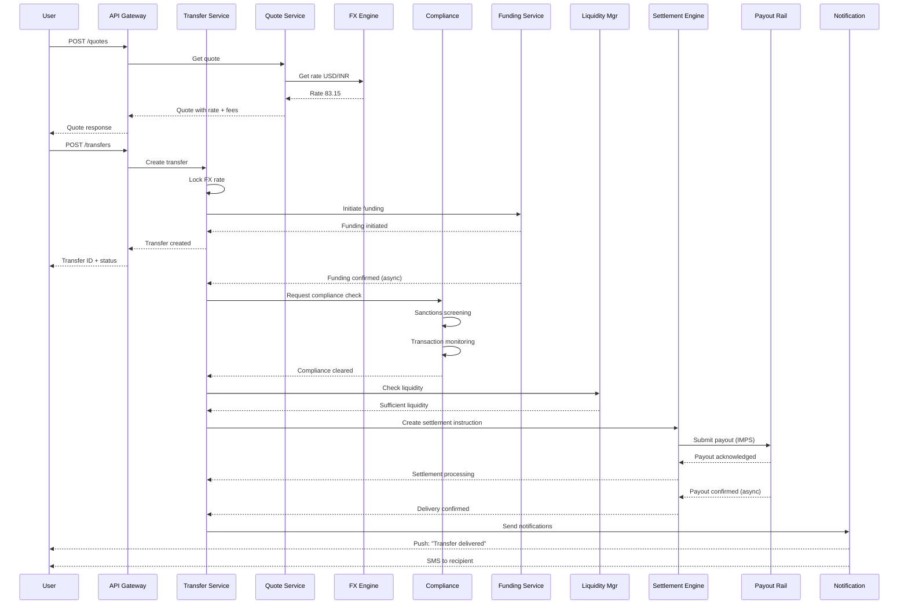

### Sanctions Screening Flow

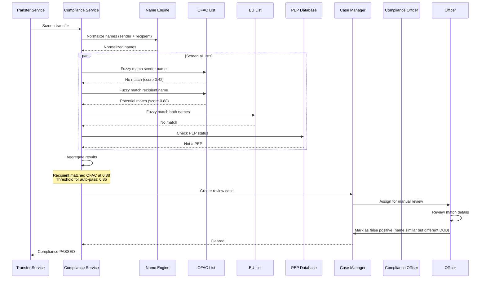

### FX Rate Lock Flow

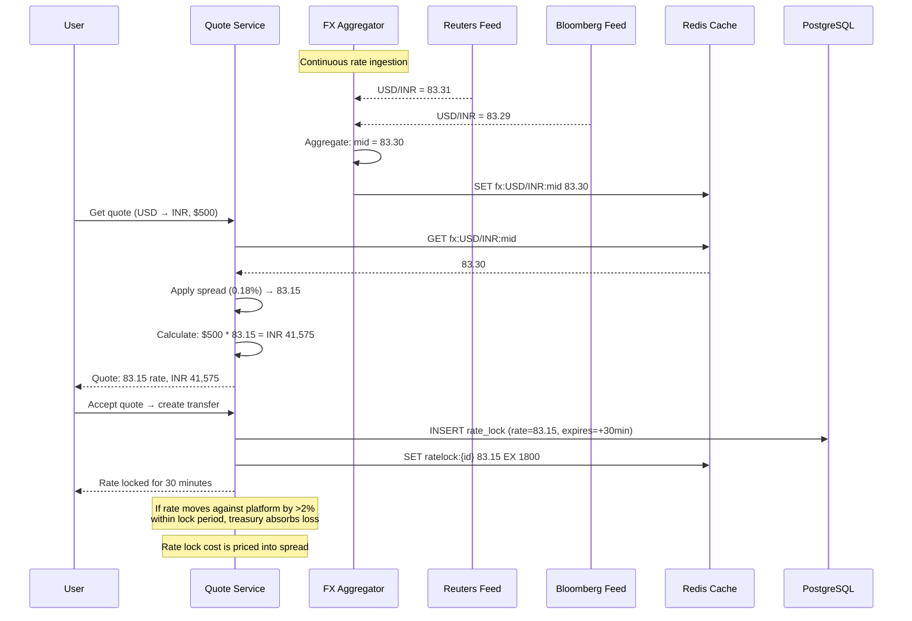

### Liquidity Rebalancing Flow

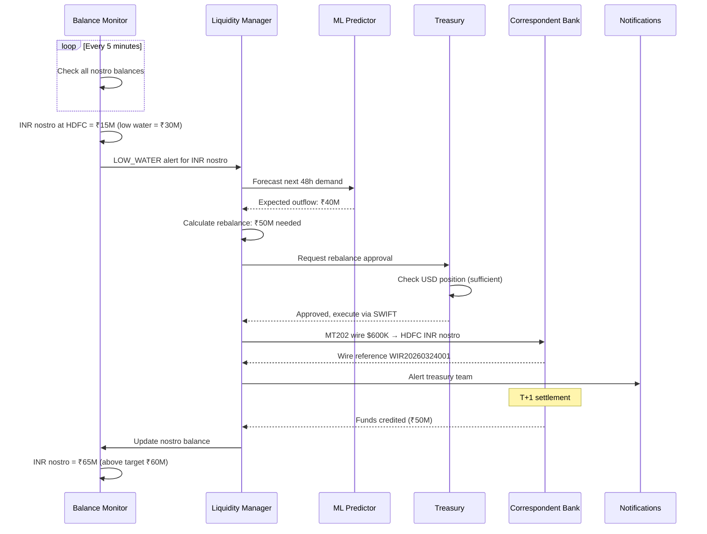

### Reconciliation Flow

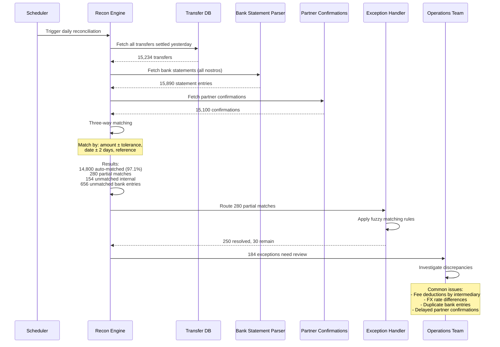

---

## Concurrency Control

### Optimistic Locking for Transfers

```sql
-- Update transfer status with optimistic lock
UPDATE transfers
SET status = 'funded',
    funded_at = NOW(),
    version = version + 1
WHERE transfer_id = $1
  AND status = 'funding_initiated'
  AND version = $2;

-- If rows_affected = 0, another process already updated this transfer
-- Retry with fresh read, or reject if state transition is invalid
```

### Balance Updates with Advisory Locks

```sql
-- Use PostgreSQL advisory locks for nostro balance updates
-- This prevents double-spending from concurrent settlements

BEGIN;

-- Acquire advisory lock on the nostro account
SELECT pg_advisory_xact_lock(hashtext('nostro_' || $1::text));

-- Check balance
SELECT available_balance FROM liquidity_positions
WHERE account_id = $1
FOR UPDATE;

-- If sufficient, deduct
UPDATE liquidity_positions
SET available_balance = available_balance - $2,
    pending_outflows = pending_outflows + $2,
    last_updated = NOW()
WHERE account_id = $1
  AND available_balance >= $2;

COMMIT;
```

### Rate Lock Concurrency

```
Problem: Two transfers try to lock the same rate simultaneously
Solution: Redis atomic operations

MULTI
  SET ratelock:{lock_id} {rate_data} NX EX 1800
  DECR rate_exposure:{pair} {amount}
EXEC

If NX fails → lock already exists (duplicate request)
If exposure goes negative → insufficient hedging capacity, reject
```

### Settlement Batch Concurrency

```
Problem: Multiple workers adding instructions to same batch
Solution: Redis atomic list operations + batch seal

RPUSH batch:{batch_id}:instructions {instruction_json}
INCR batch:{batch_id}:count
INCRBY batch:{batch_id}:total {amount}

-- Seal batch when count reaches threshold or time limit
-- Use Redis WATCH/MULTI for atomic seal
WATCH batch:{batch_id}:sealed
if not sealed:
  MULTI
    SET batch:{batch_id}:sealed 1
  EXEC
  // Process batch
```

---

## Idempotency

### Transfer Idempotency

```
Every transfer creation requires an Idempotency-Key header.

Flow:
1. Client sends POST /transfers with Idempotency-Key: {uuid}
2. Server checks Redis: GET idempotency:{key}
   a. If exists → return cached response (200, not 201)
   b. If not exists → proceed with creation

3. On successful creation:
   SET idempotency:{key} {response_json} EX 86400

4. On failure:
   Do not cache → client can retry with same key

Implementation:
  - Key = SHA-256(user_id + idempotency_key)
  - TTL = 24 hours
  - Stored in Redis + PostgreSQL (belt and suspenders)
```

### Settlement Idempotency

```
Each settlement instruction has a unique instruction_id.

Before submitting to payment rail:
1. Check: Has this instruction_id been submitted before?
   SELECT status FROM settlement_instructions WHERE instruction_id = $1

2. If status = 'submitted' or later → Do not resubmit
3. If status = 'pending' → Submit and update atomically:
   UPDATE settlement_instructions
   SET status = 'submitted', sent_at = NOW()
   WHERE instruction_id = $1 AND status = 'pending';

Partner-side idempotency:
  - SWIFT: UETR (Unique End-to-End Transaction Reference) prevents duplicates
  - ACH: Trace number is unique per file
  - IMPS: Platform reference number checked by NPCI
  - M-Pesa: ConversationID prevents duplicate payouts
```

### Webhook Idempotency

```
Partners may send duplicate webhooks (network retries).

Processing:
1. Extract partner_reference from webhook
2. Check: SELECT 1 FROM processed_webhooks WHERE reference = $1
3. If exists → Return 200 OK (acknowledge but don't process)
4. If not exists →
   BEGIN;
   INSERT INTO processed_webhooks (reference, received_at, payload_hash)
   VALUES ($1, NOW(), $2);
   -- Process webhook
   COMMIT;

Cleanup: Delete processed_webhooks older than 7 days
```

---

## Consistency Model

### Consistency Requirements by Component

| Component | Consistency | Rationale |
|-----------|------------|-----------|
| Transfer state | Strong | Financial correctness — cannot lose money |
| Balance/Positions | Strong | Must not overdraw nostro accounts |
| FX rates | Eventual (10s lag OK) | Rates change every second anyway |
| Compliance screening | Strong | Regulatory requirement |
| Audit log | Append-only, strong | Legal/regulatory requirement |
| Notifications | Eventual | Duplicate SMS is acceptable |
| Analytics | Eventual (minutes OK) | Non-critical, batch processing |

### Achieving Strong Consistency for Financial Operations

```
Pattern: Database transaction + Event outbox

1. All state changes happen in a single database transaction:
   BEGIN;
   UPDATE transfers SET status = 'funded' WHERE ...;
   INSERT INTO transfer_events (...) VALUES (...);
   INSERT INTO outbox_events (...) VALUES (...);
   COMMIT;

2. Outbox poller reads new events and publishes to Kafka:
   SELECT * FROM outbox_events WHERE published = FALSE ORDER BY id LIMIT 100;
   -- Publish to Kafka
   -- Mark as published

3. This guarantees:
   - State change and event are atomic
   - Event is published at least once
   - Consumers handle duplicates via idempotency
```

### Cross-Service Consistency

```
Transfer creation involves multiple services:
  1. Transfer Service (create record)
  2. Funding Service (charge user)
  3. Compliance Service (screen)
  4. Settlement Service (payout)

Each service owns its own database.
Cross-service consistency via Saga pattern (see next section).
```

---

## Saga Orchestration

### Transfer Saga

```
Orchestrator: Transfer Service

Step 1: Create Transfer Record
  Action: INSERT into transfers table
  Compensation: DELETE transfer record

Step 2: Lock FX Rate
  Action: Create rate lock in FX service
  Compensation: Release rate lock

Step 3: Initiate Funding
  Action: Charge funding source (ACH debit / card charge)
  Compensation: Reverse charge / void authorization

Step 4: Compliance Screening
  Action: Run KYC/AML/sanctions checks
  Compensation: N/A (screening is idempotent, no side effects to reverse)

Step 5: Reserve Liquidity
  Action: Reserve funds in destination nostro account
  Compensation: Release liquidity reservation

Step 6: Submit Settlement
  Action: Send settlement instruction to payment rail
  Compensation: Request cancellation (if possible) or initiate return

Step 7: Confirm Delivery
  Action: Receive payout confirmation
  Compensation: N/A (already delivered — must handle as exception)
```

### Saga Failure Scenarios

```
Scenario A: Funding fails (Step 3)
  → Compensate Step 2 (release rate lock)
  → Compensate Step 1 (mark transfer as cancelled)
  → Notify user: "Payment failed, please try again"

Scenario B: Compliance rejected (Step 4)
  → Compensate Step 3 (refund funding)
  → Compensate Step 2 (release rate lock)
  → Update Step 1 (mark transfer as compliance_rejected)
  → Notify user: "Transfer could not be processed"

Scenario C: Insufficient liquidity (Step 5)
  → Do NOT compensate Step 3 (keep funds — will retry)
  → Queue for retry when liquidity is available
  → If not available within 4 hours → compensate Steps 3, 2, 1
  → Notify user: "Transfer delayed, will retry"

Scenario D: Settlement fails (Step 6)
  → Retry with alternative route (up to 3 attempts)
  → If all routes fail → compensate Steps 5, 3, 2
  → Update Step 1 (mark as failed)
  → Refund user

Scenario E: Delivery confirmed but amount wrong (Step 7)
  → Cannot reverse — handle as exception
  → Create adjustment entry
  → Treasury team reconciles manually
```

### Saga Implementation

```
// Saga orchestrator pseudocode
class TransferSaga:
  def execute(transfer):
    saga_log = []

    try:
      // Step 1
      create_transfer(transfer)
      saga_log.append(("create_transfer", transfer.id))

      // Step 2
      lock = lock_fx_rate(transfer)
      saga_log.append(("lock_rate", lock.id))

      // Step 3
      funding = initiate_funding(transfer)
      saga_log.append(("funding", funding.id))
      await funding.confirmed()

      // Step 4
      screening = run_compliance(transfer)
      saga_log.append(("compliance", screening.id))
      if screening.result == "REJECTED":
        raise ComplianceRejectedException()
      if screening.result == "HOLD":
        await manual_review(screening)

      // Step 5
      reservation = reserve_liquidity(transfer)
      saga_log.append(("liquidity", reservation.id))

      // Step 6
      settlement = submit_settlement(transfer)
      saga_log.append(("settlement", settlement.id))

      // Step 7
      await delivery_confirmation(settlement)
      complete_transfer(transfer)

    except Exception as e:
      compensate(saga_log, e)

  def compensate(saga_log, error):
    for step, id in reversed(saga_log):
      try:
        compensation_map[step](id)
      except:
        // Log compensation failure — needs manual intervention
        alert_ops_team(step, id, error)
```

---

## Security & PCI Compliance

### Data Classification

```
Level 1 — Restricted (PCI DSS scope):
  - Card numbers (must be tokenized)
  - Card CVV (never stored)
  - Bank account numbers (encrypted at rest)
  - Routing numbers (encrypted at rest)

Level 2 — Confidential:
  - PII (name, DOB, address, SSN)
  - KYC documents (ID scans, selfies)
  - Transaction details
  - Sanctions screening results
  - SAR details

Level 3 — Internal:
  - FX rates
  - Corridor configurations
  - System logs (scrubbed of PII)

Level 4 — Public:
  - Published exchange rates
  - Supported countries/corridors
  - Fee schedules
```

### Encryption Architecture

```
At Rest:
  - Database: AES-256-GCM with envelope encryption
  - Application-level encryption for bank account numbers, IBAN
  - Column-level encryption for PII fields
  - KYC documents: Encrypted in S3 with customer-managed keys

In Transit:
  - TLS 1.3 for all API communications
  - mTLS for inter-service communication
  - SWIFT: SWIFTNet with PKI
  - Partner APIs: TLS 1.2+ minimum

Key Management:
  - HSM-backed key storage (AWS CloudHSM / Azure Dedicated HSM)
  - Key rotation: Every 90 days for data encryption keys
  - Master key: Annual rotation with HSM ceremony
  - Vault (HashiCorp) for application secret management
```

### PCI DSS Requirements

```
Requirement 1: Firewall configuration
  - Cardholder data environment (CDE) in isolated VPC
  - Strict security group rules
  - No direct internet access to CDE

Requirement 3: Protect stored cardholder data
  - Card numbers tokenized via payment processor (Stripe/Adyen)
  - Tokens stored, not PANs
  - CVV never stored

Requirement 4: Encrypt transmission
  - TLS 1.3 for all cardholder data transmission
  - Certificate pinning for mobile apps

Requirement 6: Secure systems
  - Quarterly vulnerability scans
  - Annual penetration testing
  - Secure SDLC with code review

Requirement 8: Access control
  - MFA for all admin access
  - Role-based access control
  - Privileged access management

Requirement 10: Logging and monitoring
  - All access to cardholder data logged
  - Centralized log management
  - Real-time alerting on suspicious access

Requirement 11: Regular testing
  - Quarterly ASV scans
  - Annual PCI audit (QSA)
  - Internal vulnerability assessments
```

### API Security

```
Authentication:
  - OAuth 2.0 + JWT tokens
  - Refresh token rotation
  - Device binding for mobile
  - Step-up authentication for high-value transfers

Authorization:
  - RBAC (Role-Based Access Control)
  - Attribute-based policies for compliance officers
  - API key + secret for partner integrations

Rate Limiting:
  - 100 requests/minute for authenticated users
  - 10 quote requests/minute per IP (unauthenticated)
  - 5 transfer creation/minute per user
  - Sliding window algorithm in Redis

Input Validation:
  - Schema validation on all inputs
  - IBAN/account number checksum validation
  - Amount range validation per corridor
  - Currency code validation (ISO 4217)
  - Country code validation (ISO 3166)

Fraud Prevention:
  - Device fingerprinting
  - IP geolocation vs user country
  - Velocity checks at API layer
  - CAPTCHA for suspicious sessions
```

---

## Observability

### Metrics (Prometheus)

```
# Business metrics
transfer_created_total{corridor, funding_method, delivery_method}
transfer_completed_total{corridor}
transfer_failed_total{corridor, failure_reason}
transfer_amount_usd{corridor, percentile}
transfer_duration_seconds{corridor, stage}

# FX metrics
fx_rate_spread_bps{pair}
fx_rate_age_seconds{pair, provider}
fx_rate_lock_utilization_ratio
fx_pnl_daily_usd{pair}

# Compliance metrics
compliance_screening_duration_seconds{check_type}
compliance_pass_rate{corridor}
compliance_false_positive_rate{rule_id}
compliance_alerts_open{severity}

# Settlement metrics
settlement_success_rate{rail, partner}
settlement_duration_seconds{rail}
settlement_retry_count{rail}
reconciliation_match_rate
reconciliation_exceptions_open

# Liquidity metrics
nostro_balance_usd{account, currency}
nostro_utilization_ratio{account}
rebalance_frequency{corridor}
hedging_coverage_ratio{pair}

# Infrastructure metrics
api_request_duration_seconds{endpoint, method, status}
api_error_rate{endpoint}
kafka_consumer_lag{topic, group}
database_connection_pool_utilization
redis_memory_usage_bytes
```

### Dashboards

```
Dashboard 1: Executive Overview
  - Daily/weekly/monthly transfer volume and value
  - Revenue (fees + FX spread income)
  - Success rate by corridor
  - Average transfer time by corridor

Dashboard 2: Operations
  - Real-time transfer pipeline (by status)
  - Settlement queue depth
  - Reconciliation exceptions
  - Nostro balances vs targets

Dashboard 3: Compliance
  - Screening volumes and durations
  - Alert queue depth by severity
  - SAR filing status
  - False positive rates by rule

Dashboard 4: Infrastructure
  - Service health and latency
  - Kafka consumer lag
  - Database performance
  - Error rates by service
```

### Alerting Rules

```yaml
# Critical alerts (PagerDuty)
- alert: TransferProcessingStalled
  expr: rate(transfer_completed_total[5m]) == 0 AND rate(transfer_created_total[5m]) > 0
  for: 10m
  severity: critical

- alert: NostroBalanceCritical
  expr: nostro_balance_usd < nostro_critical_threshold
  for: 5m
  severity: critical

- alert: ComplianceScreeningDown
  expr: rate(compliance_screening_duration_seconds_count[5m]) == 0
  for: 5m
  severity: critical

- alert: SettlementRailDown
  expr: settlement_success_rate{rail="IMPS"} < 0.5
  for: 15m
  severity: critical

# Warning alerts (Slack)
- alert: HighFXSpread
  expr: fx_rate_spread_bps > 100
  for: 30m
  severity: warning

- alert: ReconExceptionsHigh
  expr: reconciliation_exceptions_open > 100
  for: 1h
  severity: warning

- alert: KafkaConsumerLagHigh
  expr: kafka_consumer_lag > 10000
  for: 15m
  severity: warning
```

### Distributed Tracing

```
Every transfer gets a trace ID that follows it across all services:

trace_id: "abc-123"
spans:
  - api_gateway (10ms)
  - transfer_service.create (50ms)
    - quote_service.lock_rate (20ms)
      - redis.set_lock (2ms)
    - funding_service.initiate (100ms)
      - stripe.charge (80ms)
  - compliance_service.screen (500ms)
    - sanctions_engine.ofac (200ms)
    - sanctions_engine.eu (180ms)
    - transaction_monitor.evaluate (100ms)
  - settlement_engine.submit (200ms)
    - partner_api.payout (150ms)
  - notification_service.send (30ms)
    - sms_provider.send (20ms)

Tool: Jaeger or Datadog APM
Sampling: 100% for transfers, 10% for quotes/reads
Retention: 7 days full trace, 90 days aggregated
```

---

## Reliability & Fault Tolerance

### Circuit Breakers

```
Each external dependency has a circuit breaker:

Partner API circuit breaker:
  - Closed → Open: 5 failures in 60 seconds
  - Open duration: 30 seconds
  - Half-open: Allow 1 request to test
  - Reset: 2 consecutive successes

FX rate provider circuit breaker:
  - Closed → Open: 3 failures in 30 seconds
  - Fallback: Use last known rate (if < 60s old)
  - If all providers down: Pause new quotes

SWIFT gateway circuit breaker:
  - Closed → Open: 3 timeouts (> 30s) in 5 minutes
  - Fallback: Queue for retry, use alternative rail if available
```

### Retry Policies

```
Funding (card charge):
  - Max retries: 0 (do not retry card charges — user must re-initiate)

Funding (ACH):
  - Max retries: 1 (retry once on network timeout only)

Compliance screening:
  - Max retries: 3 with exponential backoff (1s, 5s, 30s)
  - Critical: Must not skip screening

Settlement instruction:
  - Max retries: 3 with backoff
  - After 3 failures: Try alternative route
  - After all routes fail: Hold for manual intervention

Partner webhook delivery:
  - Not applicable (we receive webhooks, don't send them for settlement)

Our webhook delivery (to API partners):
  - Max retries: 5 with exponential backoff (1m, 5m, 30m, 2h, 12h)
  - After all retries: Mark as failed, partner must poll
```

### Failure Modes and Mitigations

```
Failure: Database primary goes down
  Mitigation: Automatic failover to read replica (< 30s)
  Impact: Brief write unavailability, reads unaffected
  Recovery: Promote replica, rebuild standby

Failure: Kafka broker goes down
  Mitigation: Replication factor 3, min.insync.replicas 2
  Impact: None if 1 broker down; degraded if 2 down
  Recovery: Replace broker, replication catches up

Failure: Redis cache goes down
  Mitigation: Redis Sentinel for automatic failover
  Impact: Temporary latency increase (cache miss → DB query)
  Recovery: Sentinel promotes replica

Failure: Partner payout API down
  Mitigation: Circuit breaker + queue for retry
  Impact: Payout delayed, user notified
  Recovery: Process queued payouts when partner recovers

Failure: SWIFT network maintenance
  Mitigation: Queue SWIFT messages, process after maintenance window
  Impact: SWIFT-only settlements delayed
  Recovery: Drain queue after maintenance

Failure: FX rate feeds all stale
  Mitigation: Pause new quotes, honor existing rate locks
  Impact: No new transfers until rates resume
  Recovery: Automatic once any rate feed resumes
```

### Data Durability

```
PostgreSQL:
  - Synchronous replication to standby
  - WAL archiving to S3 every 1 minute
  - Point-in-time recovery capability
  - Daily full backups, retained 30 days
  - Cross-region backup replication

Kafka:
  - Replication factor: 3
  - min.insync.replicas: 2
  - Unclean leader election: disabled
  - Log retention: 30 days (financial topics: 7 years)

S3 (KYC documents):
  - 11 nines durability
  - Cross-region replication
  - Versioning enabled
  - Lifecycle policies for archival
```

---

## Multi-Region Deployment

### Architecture

```
Region 1: US-East (Primary for Americas)
  - Full stack deployment
  - Primary database for US customer data
  - SWIFT gateway connection
  - ACH/wire connectivity
  - Data residency: US customer PII stays in US

Region 2: EU-West (Primary for Europe)
  - Full stack deployment
  - Primary database for EU customer data (GDPR)
  - SEPA connectivity
  - Data residency: EU customer PII stays in EU

Region 3: Asia-Pacific (Primary for Asia)
  - Full stack deployment
  - Primary database for APAC customer data
  - IMPS/UPI/RTGS connectivity
  - Mobile money connectivity (SEA)

Cross-Region:
  - Global load balancer routes by customer geography
  - FX rates replicated globally (< 1s lag)
  - Corridor configs replicated globally
  - Sanctions lists replicated globally
  - Customer data does NOT replicate across regions (data residency)
  - Settlement instructions route to region with partner connectivity
```

### Data Residency Compliance

```
GDPR (EU):
  - EU customer data stored only in EU-West region
  - Transfers involving EU customers processed in EU-West
  - Right to erasure: PII deleted, financial records retained (anonymized)
  - Data Processing Agreements with all sub-processors

India (RBI data localization):
  - Payment data for Indian transactions stored in India
  - Mirror copy in India for all transaction data

Russia (Federal Law 242-FZ):
  - Russian customer data stored in Russia (if operating there)

Data flow for cross-region transfers:
  US customer → India recipient:
    - Customer PII stays in US-East
    - Transfer metadata (anonymized) shared with Asia-Pacific
    - Settlement instruction sent to Asia-Pacific for IMPS payout
    - Recipient details (Indian PII) stored in Asia-Pacific
```

### Failover Strategy

```
Active-Active (within region):
  - Multiple AZs
  - Database: Multi-AZ with synchronous replication
  - Services: Auto-scaling groups across AZs
  - Load balancer health checks every 10s

Cross-Region Failover:
  - Active-passive for customer-facing services
  - If US-East fails:
    - DNS failover to US-West (standby)
    - Database: Promote async replica in US-West
    - RPO: < 1 minute (async replication lag)
    - RTO: < 5 minutes (automated failover)
  - Settlement connectivity may be degraded in DR region
  - Manual intervention for partner re-routing
```

---

## Cost Analysis

### Per-Transfer Cost Breakdown

```
For a $500 USD → INR transfer:

Platform costs:
  FX spread income:    $500 * 0.18% = $0.90 (revenue)
  Platform fee:        $1.50 (revenue)
  Total revenue:       $2.40

Variable costs:
  Funding (ACH pull):  $0.25
  Payout (IMPS):       $0.10
  Compliance screening: $0.05 (amortized SaaS cost)
  FX hedging:          $0.15 (forward premium)
  Infrastructure:      $0.03 (compute, storage, bandwidth)
  SWIFT/messaging:     $0.00 (not used for this corridor)
  Total variable:      $0.58

Contribution margin:   $2.40 - $0.58 = $1.82 (75.8%)

Fixed costs (amortized per transfer):
  Licenses & compliance: $0.50
  Personnel:             $0.30
  Office & operations:   $0.10
  Technology overhead:   $0.15
  Total fixed:          $1.05

Net margin per transfer: $0.77 (32.1%)
```

### Infrastructure Cost (Monthly)

```
Compute (AWS):
  Transfer service:     8 * c6g.xlarge   = $800
  Compliance service:   16 * c6g.2xlarge = $3,200
  FX service:           4 * c6g.xlarge   = $400
  Settlement service:   8 * c6g.xlarge   = $800
  Other services:       12 * c6g.large   = $600
  Total compute:        ~$5,800

Database:
  PostgreSQL (RDS Multi-AZ):
    Primary: db.r6g.2xlarge = $1,500
    Read replicas (2):       = $2,000
  Redis (ElastiCache):
    3-node cluster:          = $900
  Elasticsearch:
    3-node cluster:          = $1,200
  TimescaleDB:
    db.r6g.xlarge:           = $700
  Total database:            ~$6,300

Messaging:
  Kafka (MSK):
    6-broker cluster:        = $2,400
  Total messaging:           ~$2,400

Storage:
  S3 (KYC documents):       = $200
  EBS volumes:               = $500
  Total storage:             ~$700

Networking:
  Load balancers:            = $300
  NAT gateways:              = $400
  Data transfer:             = $500
  Total networking:          ~$1,200

Security:
  CloudHSM:                  = $1,500
  WAF:                       = $200
  Secrets Manager:           = $100
  Total security:            ~$1,800

Monitoring:
  Datadog/Prometheus:        = $1,500
  Log storage (ELK):         = $800
  Total monitoring:          ~$2,300

Total monthly infra:         ~$20,500
Per-transfer (170K/day):     ~$0.004

Third-party SaaS:
  Sanctions lists (Dow Jones):  = $5,000/month
  ID verification (Onfido):     = $3,000/month
  Rate feeds (Reuters):         = $8,000/month
  Total SaaS:                   ~$16,000/month
```

---

## Platform Comparisons

### Wise vs Ripple vs Stellar vs Western Union vs Remitly

| Feature | Wise | Ripple (RippleNet) | Stellar | Western Union | Remitly |
|---------|------|-------------------|---------|---------------|---------|
| **Model** | Multi-currency accounts + P2P | Blockchain for bank settlement | Open network for payments | Agent network + digital | Digital-first remittance |
| **Speed** | Minutes to hours | 3-5 seconds (XRP) | 3-5 seconds (XLM) | Minutes (digital) to hours (cash) | Minutes to days |
| **Cost** | Mid-market + small fee | ~0.1% + tiny XRP fee | Near zero network fee | 5-10% total cost | Competitive, varies |
| **FX Approach** | Mid-market rate, transparent | ODL via XRP for liquidity | Anchors convert fiat ↔ XLM | Proprietary rates, opaque | Competitive rates |
| **Corridors** | 80+ countries | 55+ countries (ODL in ~20) | Growing, focus on developing | 200+ countries | 170+ countries |
| **Settlement** | Local rails (ACH/SEPA/IMPS) | XRP Ledger + local payout | Stellar network + anchors | Internal network + agents | Partner banks + mobile money |
| **Pre-funding** | Yes (large nostro network) | Reduced via ODL | Reduced via XLM bridge | Yes (massive agent float) | Yes (partner pre-funding) |
| **Regulation** | Licensed globally (MTL, EMI) | FinCEN MSB, varies by market | Foundation, anchors licensed | Licensed globally | Licensed in operating markets |
| **Target User** | Expats, freelancers, SMBs | Banks, payment providers | Developers, NGOs, fintechs | Migrant workers (cash-heavy) | Immigrants sending home |
| **Tech Stack** | Microservices, own rails | XRP Ledger (consensus) | Stellar Core (SCP) | Legacy + modernizing | Modern, mobile-first |
| **Unique Edge** | Transparent pricing | Crypto liquidity bridge | Open-source, low cost | Massive physical network | Mobile money expertise |

### Architecture Comparison

```
Wise Architecture:
  - Multi-currency wallet as core primitive
  - Matching engine: Pairs senders/receivers in same currency
  - Local bank accounts in 10+ countries
  - When possible: No actual cross-border movement (internal match)
  - When needed: Swift/local rails for actual movement
  - Key insight: If someone sends USD→GBP and another sends GBP→USD,
    Wise can settle both locally without crossing borders

Ripple Architecture:
  - XRP Ledger: Decentralized consensus (not mining)
  - RippleNet: Network of financial institutions
  - On-Demand Liquidity (ODL): XRP as bridge currency
  - Pathfinding: XRP Ledger finds cheapest path between currencies
  - Key insight: Crypto eliminates pre-funding requirement

Stellar Architecture:
  - Stellar Consensus Protocol (SCP): Federated Byzantine Agreement
  - Anchors: Licensed entities that bridge fiat ↔ XLM
  - DEX: Built-in decentralized exchange on Stellar network
  - Path payment: Atomic multi-hop currency conversion
  - Key insight: Open network anyone can build on

Western Union Architecture:
  - Agent network: 500,000+ locations worldwide
  - MTCN: Money Transfer Control Number for tracking
  - Hub and spoke: Central processing + local agents
  - Cash-heavy: Optimized for unbanked populations
  - Key insight: Physical last-mile in developing countries
```

---

## SWIFT vs Blockchain

### Comparison Matrix

| Dimension | SWIFT (Traditional) | Blockchain (Ripple/Stellar) |
|-----------|--------------------|-----------------------------|
| **Speed** | 1-5 days (standard), same-day (gpi) | 3-60 seconds |
| **Cost** | $25-50 per message + correspondent fees | < $1 total |
| **Transparency** | Opaque (fees deducted en route) | Full visibility |
| **Availability** | Business hours dependent | 24/7/365 |
| **Pre-funding** | Required (nostro/vostro) | Not required (ODL) |
| **Intermediaries** | 1-4 correspondent banks | 0-1 (direct on-chain) |
| **Message Format** | MT (legacy) → MX (ISO 20022) | Native digital format |
| **Finality** | Provisional until settlement | Settlement = finality |
| **Network** | 11,000+ member institutions | Growing (hundreds) |
| **Regulation** | Well-established framework | Evolving regulatory landscape |
| **Scalability** | Limited by batch processing | Limited by chain throughput |
| **Privacy** | Messages between parties only | Public ledger (privacy concerns) |

### When to Use Which

```
Use SWIFT when:
  - Large value transfers ($100K+)
  - Correspondent banking relationships exist
  - Regulatory requirement for traditional rails
  - Counterparty only supports SWIFT
  - Complex structured payments (trade finance)

Use Blockchain when:
  - Speed is critical (< 1 hour delivery)
  - Cost sensitivity (small value remittances)
  - Corridor lacks correspondent banking
  - 24/7 availability needed
  - Pre-funding capital is scarce
  - Transparency is important to users

Hybrid approach (emerging best practice):
  - Use SWIFT gpi for high-value B2B
  - Use blockchain (ODL) for retail remittances
  - Use local rails (SEPA/IMPS) where available
  - Route dynamically based on cost/speed/availability
```

---

## Correspondent Banking

### How Correspondent Banking Works

```
Example: US bank sending $10,000 to a bank in Kenya

If direct relationship exists:
  US Bank → Kenya Bank (direct SWIFT MT103)
  Simple, fast, but direct relationships are rare

Typical flow (no direct relationship):
  US Bank
    → US Correspondent (e.g., Citibank)
      → Intermediary (e.g., Standard Chartered, London)
        → Kenya Correspondent (e.g., KCB Bank)
          → Beneficiary Bank (e.g., Equity Bank)
            → Recipient

Each hop:
  - Deducts fees ($10-25 per intermediary)
  - Takes time (hours to days per hop)
  - Adds counterparty risk
  - May apply additional compliance checks

Total cost: Original $10,000 → Recipient receives ~$9,925
Total time: 2-5 business days
```

### De-Risking Problem

```
Since 2011, 25% of correspondent banking relationships have been terminated.

Reasons:
  - Cost of compliance (AML/KYC for correspondents)
  - Low profitability on small transaction volumes
  - Regulatory risk (fines for sanctions violations)
  - Concentration risk

Impact:
  - Developing countries lose access to global banking
  - Remaining correspondents charge higher fees
  - Some corridors become unserviceable
  - Money flows through fewer, more concentrated channels

How fintechs fill the gap:
  - Direct integrations with local payment systems
  - Crypto bridges bypass correspondent banking entirely
  - Mobile money networks provide alternative last-mile
  - Regional payment systems (PAPSS in Africa) reduce dependency
```

---

## FX Risk Management

### Types of FX Risk

```
1. Transaction Risk:
   - Rate changes between quote and settlement
   - Mitigated by: Rate locks, fast settlement, hedging

2. Translation Risk:
   - Value of nostro balances changes with FX rates
   - Mitigated by: Minimize idle balances, hedge positions

3. Economic Risk:
   - Long-term competitiveness affected by currency trends
   - Mitigated by: Dynamic pricing, corridor diversification

4. Herstatt Risk (Settlement Risk):
   - Paying source currency before receiving destination currency
   - Named after Bankhaus Herstatt collapse (1974)
   - Mitigated by: PvP (Payment vs Payment) settlement, CLS Bank
```

### FX Risk Quantification

```
Value at Risk (VaR) calculation:

For USD/INR nostro position of $5,000,000:
  Daily volatility (historical): 0.5%
  99% confidence VaR (1 day) = $5M * 0.5% * 2.33 = $58,250

  Interpretation: 99% chance that daily loss will not exceed $58,250

Portfolio VaR (across all nostros):
  Must account for correlations between currency pairs
  Use variance-covariance method or Monte Carlo simulation
  Diversification benefit reduces total VaR
```

---

## Regulatory Landscape

### Key Regulations by Jurisdiction

```
United States:
  - Bank Secrecy Act (BSA) / FinCEN regulations
  - Money transmission licenses (state-by-state, 49 states + DC)
  - OFAC sanctions compliance
  - Dodd-Frank (if bank charter)
  - CTR reporting ($10,000+ cash transactions)
  - SAR reporting (suspicious activity)

European Union:
  - Payment Services Directive (PSD2)
  - Anti-Money Laundering Directives (AMLD 5/6)
  - Electronic Money Institution (EMI) license
  - GDPR for data protection
  - EU Funds Transfer Regulation (Travel Rule)
  - MiCA (Markets in Crypto-Assets) for crypto

United Kingdom:
  - FCA authorization (Payment Institution or EMI)
  - Money Laundering Regulations (MLRs)
  - Payment Services Regulations
  - Senior Managers & Certification Regime (SM&CR)

India:
  - RBI authorization for cross-border payments
  - FEMA (Foreign Exchange Management Act)
  - AD Category II license for money transfer
  - PAN requirement for transactions > INR 50,000
  - Purpose code requirement for all outward remittances
  - LRS (Liberalised Remittance Scheme) limit: $250,000/year

Singapore:
  - MAS Payment Services Act
  - Major Payment Institution (MPI) license
  - AML/CFT requirements

Nigeria:
  - CBN (Central Bank of Nigeria) regulations
  - International Money Transfer Operator (IMTO) license
  - BVN (Bank Verification Number) requirement

Kenya:
  - CBK (Central Bank of Kenya) regulations
  - National Payment System Act
  - M-Pesa specific regulations
```

### Compliance Cost Structure

```
License acquisition:
  - US state MTLs: $50K - $500K per state (+ surety bonds)
  - EU EMI license: EUR 100K - 500K
  - FCA authorization: GBP 50K - 200K

Ongoing compliance:
  - Compliance team: 15-30% of headcount
  - Sanctions screening SaaS: $50K - $200K/year
  - Transaction monitoring: $100K - $500K/year
  - External audits: $100K - $300K/year
  - Regulatory reporting: $50K - $150K/year
  - Legal counsel: $200K - $500K/year
```

---

## Mobile Money — Africa & Asia

### M-Pesa (East Africa)

```
Market context:
  - Kenya: 33M+ active users (80% of adult population)
  - Tanzania: 15M+ active users
  - Other markets: DRC, Egypt, Ghana, Mozambique, etc.

Why M-Pesa matters for remittances:
  - Most Kenyans don't have bank accounts but have M-Pesa
  - Instant delivery (< 30 seconds)
  - Agent cash-out network (200,000+ agents in Kenya)
  - Integration via Safaricom Daraja API

Technical integration:
  - B2C API for disbursements
  - Callback-based (async) — must handle timeouts
  - Rate limits: 600 TPS
  - Max per transaction: KES 150,000
  - Daily limit per recipient: KES 300,000

Challenges:
  - Float management at agent level
  - Network reliability (USSD-based for feature phones)
  - Reconciliation delays (settlements T+1)
  - Regulatory changes (CBK directives)
```

### bKash (Bangladesh)

```
Market context:
  - 65M+ registered accounts
  - $12B+ monthly transaction volume
  - Primary channel for remittances from Middle East/SE Asia

Integration:
  - Merchant API for disbursements
  - Real-time crediting to bKash wallet
  - Recipient can cash out at 300K+ agents

Bangladesh remittance corridor:
  - $22B annual inward remittances
  - Major sources: Saudi Arabia, UAE, US, UK, Malaysia
  - bKash + Nagad handle significant portion of digital inflows
```

### GCash (Philippines)

```
Market context:
  - 80M+ registered users
  - Philippines: #4 global remittance recipient ($37B/year)
  - GCash is primary digital wallet

Integration:
  - GCash for Business API
  - Real-time credit to GCash wallet
  - Bank transfer out option for recipients
  - Cash out at 7-Eleven, SM stores, etc.
```

### Key Patterns for Mobile Money Integration

```
1. Async by default:
   - Most mobile money APIs are callback-based
   - Design for eventual confirmation, not synchronous
   - Implement timeout handling (re-query after 5 minutes)

2. Float management:
   - Pre-fund mobile money wallet/account
   - Monitor float levels continuously
   - Auto-top-up when float drops below threshold

3. Reconciliation challenges:
   - Mobile money statements may lag 24-48 hours
   - Transaction IDs may differ between request and callback
   - Partial matches common (amounts may include fees)

4. Reliability:
   - Mobile money platforms have 95-99% uptime (not 99.99%)
   - Build retry logic and alternative delivery methods
   - Cash pickup as fallback when mobile money is down

5. Regulatory:
   - KYC tiers vary by mobile money provider and country
   - Transaction limits are provider-specific
   - Reporting requirements differ from banking
```

---

## Stablecoins & CBDC

### Stablecoins in Cross-Border Payments

```
USDC (Circle):
  - Fully backed by USD reserves
  - Available on Ethereum, Solana, Stellar, etc.
  - Cross-Chain Transfer Protocol (CCTP) for bridging
  - Use case: USD-denominated cross-border settlement
  - Settlement: Minutes (Ethereum) to seconds (Solana)
  - Cost: Gas fees (variable on Ethereum, < $0.01 on Solana)

USDT (Tether):
  - Largest stablecoin by market cap
  - Available on most chains
  - Widely used in Asia/Africa for remittances
  - Regulatory concerns (reserve transparency)

Regional stablecoins:
  - XSGD (Singapore Dollar stablecoin)
  - BRZ (Brazilian Real stablecoin)
  - EURS (Euro stablecoin)

Stablecoin corridor flow:
  1. Sender deposits USD → Platform mints/buys USDC
  2. USDC transferred on-chain to destination partner
  3. Partner sells USDC → Local currency
  4. Local currency paid to recipient

Advantages:
  - No pre-funding needed (instant liquidity via DEX)
  - 24/7 settlement
  - Programmable (smart contract escrow, conditions)
  - Transparent (on-chain audit trail)

Challenges:
  - Regulatory uncertainty in many jurisdictions
  - On/off-ramp costs (converting fiat ↔ stablecoin)
  - Smart contract risk
  - Liquidity depth varies by pair
```

### Central Bank Digital Currencies (CBDC)

```
mBridge (Multi-CBDC Platform):
  - Participants: China, UAE, Thailand, Hong Kong, Saudi Arabia
  - Direct CBDC-to-CBDC cross-border settlement
  - Eliminates correspondent banking for participating countries
  - Pilot transactions completed in 2024

Project Dunbar:
  - Participants: Australia, Malaysia, Singapore, South Africa
  - Multi-CBDC platform for international settlements
  - Uses shared ledger for atomic PvP settlement

Impact on cross-border payments:
  1. Faster settlement (seconds, not days)
  2. Lower cost (no intermediaries)
  3. Central bank risk (vs commercial bank risk)
  4. Programmable money (conditional payments)
  5. Potentially reduced need for stablecoins

Challenges:
  - Interoperability between different CBDC platforms
  - Privacy concerns (central bank visibility into all transactions)
  - Geopolitical implications (alternative to USD-based system)
  - Technical standardization needed

Timeline:
  - 2026-2028: Major CBDC pilots for cross-border
  - 2028-2030: Production deployments in select corridors
  - 2030+: Potential mainstream adoption
```

---

## ISO 20022

### What Is ISO 20022

```
ISO 20022 is the global standard for financial messaging.
It replaces legacy SWIFT MT messages with rich XML/JSON-based formats.

Key benefits for cross-border payments:
  1. Richer data: Structured fields for all participant details
  2. End-to-end tracking: UETR and LEI identifiers
  3. Compliance: Travel Rule information natively supported
  4. Interoperability: Same format across SWIFT, SEPA, local systems
  5. Analytics: Structured data enables automation and AI

Migration timeline:
  - SWIFT MT → MX coexistence: 2023-2025
  - SWIFT full MX migration: November 2025
  - Most RTGS systems: Already migrated or in progress
  - SEPA: Already ISO 20022 native (pain.001, pacs.008)

Key message types:
  pain.001: Customer Credit Transfer Initiation
  pain.002: Customer Payment Status Report
  pacs.008: FI to FI Customer Credit Transfer
  pacs.009: FI to FI Financial Institution Credit Transfer
  camt.053: Bank to Customer Statement
  camt.054: Bank to Customer Debit/Credit Notification
```

### Impact on Platform Design

```
1. Data model must accommodate richer fields:
   - Structured addresses (not free-text)
   - Legal Entity Identifier (LEI)
   - Purpose codes (ISO 20022 purpose code list)
   - Structured remittance information

2. Message transformation:
   - Internal format → ISO 20022 XML for SWIFT/SEPA
   - ISO 20022 → Internal format for incoming messages
   - XSLT or custom mappers for transformation

3. Compliance benefits:
   - Travel Rule information in structured fields
   - Automated screening on structured data (higher accuracy)
   - Regulatory reporting simplified

4. Partner integration:
   - Partners migrating at different speeds
   - Must support both MT and MX during transition
   - Translation service between formats
```

---

## Edge Cases

### Edge Case 1: Rate Lock Expiry During Compliance Hold

```
Scenario: User's transfer is held for manual compliance review.
The FX rate lock expires (30 min) before review is complete.

Handling:
  1. When compliance clears, check rate lock status
  2. If expired:
     a. Get new rate
     b. If new rate is within 1% of locked rate → proceed with new rate
     c. If new rate differs > 1% → notify user, ask to re-confirm
     d. If user doesn't re-confirm within 24h → auto-cancel and refund
  3. Log rate change for audit trail
```

### Edge Case 2: Recipient Bank Account Closed

```
Scenario: Payout fails because recipient's bank account has been closed.

Handling:
  1. Receive rejection from payout rail (reason: account closed)
  2. Notify sender: "Delivery failed — recipient account may be closed"
  3. Offer options:
     a. Send to different account (sender provides new details)
     b. Switch to mobile money or cash pickup
     c. Cancel and refund
  4. Hold funds for 7 days awaiting sender action
  5. If no action → auto-refund to sender
```

### Edge Case 3: Duplicate SWIFT Messages

```
Scenario: Network issue causes SWIFT MT103 to be sent twice.

Handling:
  1. SWIFT UETR prevents processing duplicate at beneficiary bank
  2. Our system: Track UETR in settlement_instructions table
  3. If callback received for already-settled instruction → ignore
  4. If balance deducted twice → reconciliation catches it within 24h
  5. Initiate MT192 (Request for Cancellation) for duplicate
```

### Edge Case 4: Sanctioned Entity Added Mid-Transfer

```
Scenario: Transfer is in settlement when OFAC adds recipient to SDN list.

Handling:
  1. Sanctions list update triggers re-screening of all in-progress transfers
  2. If match found on transfer in settlement:
     a. Attempt to halt/recall settlement (if possible)
     b. If already delivered → file SAR, report to OFAC
     c. Freeze sender's account pending investigation
  3. Compliance officer reviews within 24 hours
  4. OFAC reporting within required timeframe
```

### Edge Case 5: Currency Demonetization

```
Scenario: India demonetizes certain currency notes (as in 2016).

Handling:
  1. Monitor regulatory announcements for operating countries
  2. If demonetization announced:
     a. Suspend affected corridor immediately
     b. Queue pending transfers
     c. Notify affected users
     d. Resume with new rules when regulatory clarity emerges
  3. For already-settled transfers → no action needed (electronic)
  4. For cash pickup transfers → may need to cancel and re-route
```

### Edge Case 6: Mobile Money Network Outage

```
Scenario: M-Pesa is down for maintenance in Kenya.

Handling:
  1. Circuit breaker detects consecutive failures
  2. Halt new M-Pesa payouts
  3. For in-progress transfers:
     a. Queue for retry (check every 15 minutes)
     b. After 2 hours: Notify sender of delay
     c. After 6 hours: Offer alternative (bank deposit, cash pickup)
  4. Monitor Safaricom status page + partner notifications
  5. When service resumes: Drain queue gradually (avoid flood)
```

### Edge Case 7: FX Rate Flash Crash

```
Scenario: GBP/USD drops 5% in 30 seconds (flash crash).

Handling:
  1. Rate validator detects abnormal movement (> 3 std dev in 1 minute)
  2. Pause rate updates for affected pair
  3. Use last known stable rate for 5 minutes
  4. Alert treasury team
  5. If rates stabilize → resume normal operation
  6. If rates remain at new level → accept new rate
  7. Honor existing rate locks (platform absorbs the loss)
  8. Log all actions for audit trail
```

### Edge Case 8: Partial Settlement

```
Scenario: Intermediary bank deducts fees from transfer amount.
Customer sent $500 but recipient receives only $485.

Handling:
  1. Reconciliation detects amount mismatch
  2. If charge type was "OUR" (sender pays all fees):
     a. Platform absorbs the gap
     b. Credit recipient the shortfall via separate payment
     c. Renegotiate with intermediary (or choose different route)
  3. If charge type was "SHA" (shared):
     a. Deducted fees are expected
     b. Verify deduction is within expected range
     c. If excessive → raise with correspondent bank
```

### Edge Case 9: Timezone-Related Double Processing

```
Scenario: Batch settlement file sent at 23:59 UTC but processed
at 00:01 UTC — could be counted in either day's batch.

Handling:
  1. All timestamps in UTC internally
  2. Batch cutoff times explicitly defined per rail
  3. Each instruction has a value_date (not processing date)
  4. Deduplication by instruction_id across batches
  5. Reconciliation uses value_date for matching
```

### Edge Case 10: Sender Death / Incapacitation

```
Scenario: Sender passes away after initiating but before delivery.

Handling:
  1. If transfer is in progress → complete delivery (irrevocable)
  2. If transfer is pending / not yet funded → suspend
  3. Legal team handles estate claims
  4. Document retention: All records kept for estate proceedings
  5. Account frozen upon notification of death
  6. Remaining balance: Released to estate per legal process
```

### Edge Case 11: Crypto Bridge Liquidity Dried Up

```
Scenario: ODL route via XRP has insufficient liquidity on destination exchange.

Handling:
  1. Pre-trade liquidity check: Query order book depth before committing
  2. If insufficient for full amount → split into smaller tranches
  3. If still insufficient → fallback to traditional settlement route
  4. If traditional route also unavailable → queue and notify user
  5. Monitor exchange liquidity levels and disable ODL when thin
```

### Edge Case 12: Conflicting Regulatory Requirements

```
Scenario: EU requires data deletion (GDPR right to erasure) but
US requires 5-year transaction record retention (BSA).

Handling:
  1. Legal analysis: Transaction records are exempt from GDPR erasure
     (legal obligation to retain)
  2. PII can be pseudonymized after minimum retention period
  3. Implementation:
     a. Retain transaction records (amount, date, type) for 7 years
     b. Pseudonymize PII fields after data minimization period
     c. Delete non-essential PII upon valid erasure request
     d. Maintain audit trail of erasure requests
  4. Communicate to user: Which data is retained and why
```

### Edge Case 13: Sanctions Evasion via Name Variation

```
Scenario: Sanctioned individual uses transliterated name variation
to bypass screening (e.g., "Mohammed" vs "Muhammad" vs "Mohamed").

Handling:
  1. Phonetic matching algorithms (Soundex, Metaphone)
  2. Arabic/Cyrillic transliteration normalization
  3. Common name variant database
  4. Combination matching (first+last, last+first)
  5. Secondary identifiers (DOB, nationality, passport)
  6. ML model trained on known evasion patterns
  7. Regular tuning: Review false negatives from SAR data
```

---

## Architecture Decision Records

### ADR-1: Event Sourcing for Transfer Lifecycle

```
Title: Use event sourcing for transfer state management
Status: Accepted
Date: 2026-01-15

Context:
  Transfers go through many states with complex transitions.
  We need a complete audit trail for regulatory compliance.
  Debugging production issues requires understanding state history.

Decision:
  Implement event sourcing for transfer lifecycle.
  Every state change is recorded as an immutable event.
  Current state is derived from event history.
  Materialized views provide query performance.

Consequences:
  + Complete audit trail (regulatory requirement)
  + Easy debugging (replay events to understand state)
  + Enables event-driven architecture
  - Increased storage (all events retained)
  - Complexity in projections and materialized views
  - Eventually consistent read models
```

### ADR-2: PostgreSQL Over NoSQL for Primary Store

```
Title: Use PostgreSQL as primary data store
Status: Accepted
Date: 2026-01-20

Context:
  Financial data requires ACID transactions.
  Complex queries needed for reconciliation and reporting.
  Regulatory audits require SQL-queryable data.

Decision:
  PostgreSQL as primary store for all transactional data.
  TimescaleDB extension for time-series FX data.
  Elasticsearch for sanctions screening (text search).
  Redis for caching and real-time counters.

Consequences:
  + Strong consistency for financial operations
  + Rich query capabilities for compliance and ops
  + Proven reliability for financial workloads
  - Horizontal scaling requires sharding strategy
  - May need read replicas for query load
```

### ADR-3: Kafka for Event Bus Over RabbitMQ

```
Title: Use Apache Kafka as the event bus
Status: Accepted
Date: 2026-01-25

Context:
  Need durable, ordered event streaming.
  Multiple consumers per event (transfer updates → compliance, settlement, notification).
  Regulatory requirement: 7-year event retention for financial topics.

Decision:
  Apache Kafka for all inter-service events.
  Topic-per-event-type with partition key = entity_id.

Consequences:
  + Durable, replayable event log
  + Multiple consumer groups per topic
  + High throughput for rate/settlement events
  + Long retention for compliance
  - Operational complexity (ZooKeeper/KRaft management)
  - Higher resource footprint than RabbitMQ
```

### ADR-4: Hybrid Settlement (SWIFT + Blockchain + Local Rails)

```
Title: Support multiple settlement rails with dynamic routing
Status: Accepted
Date: 2026-02-01

Context:
  No single settlement rail covers all corridors.
  Different rails optimize for different tradeoffs (cost vs speed).
  Rail availability varies by time of day and country.

Decision:
  Implement a settlement router that dynamically selects
  the optimal rail based on corridor, amount, speed, and cost.
  Support SWIFT, blockchain (XRP/XLM), and local rails.

Consequences:
  + Best price/speed for each transfer
  + Resilience (fallback across rails)
  + Future-proof (add new rails without core changes)
  - Integration complexity (different APIs, protocols, formats)
  - Multiple reconciliation streams
  - Regulatory approval needed per rail per jurisdiction
```

### ADR-5: Saga Pattern Over Distributed Transactions

```
Title: Use Saga pattern for cross-service transactions
Status: Accepted
Date: 2026-02-05

Context:
  Transfer processing spans 5+ services.
  Two-phase commit is impractical across microservices.
  Need compensating transactions for failure scenarios.

Decision:
  Orchestrated saga pattern for transfer lifecycle.
  Transfer Service acts as saga orchestrator.
  Each step has a defined compensation action.

Consequences:
  + Services remain loosely coupled
  + Each service manages its own transactions
  + Clear compensation logic for failures
  - Complexity in orchestrator logic
  - Eventual consistency between services
  - Compensation may not be possible for all steps (e.g., after delivery)
```

### ADR-6: Rate Lock with Platform Risk Absorption

```
Title: Platform absorbs FX risk during rate lock period
Status: Accepted
Date: 2026-02-10

Context:
  Users need guaranteed rates for a reasonable period.
  FX rates can move significantly in 30 minutes.
  Hedging every individual rate lock is not cost-effective.

Decision:
  Lock rates for 30 minutes with platform absorbing risk.
  Aggregate exposure hedged at portfolio level.
  Spread includes risk premium for rate lock.

Consequences:
  + Better user experience (guaranteed rate)
  + Portfolio-level hedging is more efficient
  + Risk premium in spread covers average losses
  - Extreme events (flash crashes) can cause significant losses
  - Requires sophisticated treasury risk management
  - Need exposure monitoring and circuit breakers
```

### ADR-7: Multi-Region with Data Residency

```
Title: Deploy multi-region with strict data residency
Status: Accepted
Date: 2026-02-15

Context:
  GDPR requires EU data to stay in EU.
  RBI requires Indian payment data in India.
  Users expect low latency from their region.

Decision:
  Three primary regions (US, EU, APAC).
  Customer PII stays in customer's region.
  Transfer metadata (anonymized) shared for settlement routing.
  Each region has full service stack.

Consequences:
  + Regulatory compliance for data residency
  + Low latency for users
  + Regional fault isolation
  - Operational complexity (3x infrastructure)
  - Cross-region transfer routing is complex
  - Reconciliation across regions
  - Higher infrastructure cost
```

---

## Proof of Concepts

### POC-1: On-Demand Liquidity via Stablecoins

```
Objective: Validate USDC-based settlement for USD → PHP corridor

Setup:
  1. Circle account with USDC minting/burning capability
  2. Solana wallet for platform
  3. Philippine exchange partner (Coins.ph)
  4. Test with $1,000 transfers

Metrics to measure:
  - End-to-end settlement time
  - Total cost (minting fee + gas + exchange spread + off-ramp)
  - Reliability (success rate over 100 transfers)
  - Slippage (executed rate vs quoted rate)

Success criteria:
  - Settlement in < 5 minutes
  - Total cost < 0.5%
  - Success rate > 98%
  - Slippage < 0.1%

Duration: 4 weeks
Resources: 2 engineers + 1 treasury analyst
```

### POC-2: ML-Based Transaction Monitoring

```
Objective: Reduce false positive rate in AML screening from 5% to < 1%

Setup:
  1. Historical transaction data (12 months, anonymized)
  2. Labeled dataset (SARs filed, false positives, true positives)
  3. Feature engineering pipeline
  4. Model candidates: Isolation Forest, XGBoost, LSTM

Metrics to measure:
  - False positive rate (FPR) at various thresholds
  - True positive rate (sensitivity for actual SARs)
  - Alert volume reduction
  - Compliance officer time saved

Success criteria:
  - FPR < 1% while maintaining TPR > 95%
  - Alert volume reduced by 60%+
  - Model explainability sufficient for regulatory review

Duration: 8 weeks
Resources: 2 ML engineers + 1 compliance analyst
```

### POC-3: SEPA Instant Coverage Analysis

```
Objective: Measure actual SEPA Instant availability and speed

Setup:
  1. Partner bank with SEPA Instant capability
  2. Test beneficiary accounts at 50 different European banks
  3. Automated test transfers (EUR 1) every hour for 30 days

Metrics to measure:
  - Acceptance rate by beneficiary bank
  - Actual settlement time (submission to confirmation)
  - Rejection reasons
  - Weekend/holiday behavior

Success criteria:
  - > 70% of European bank accounts reachable via SEPA Instant
  - Median settlement time < 5 seconds
  - Clear mapping of which banks support/don't support

Duration: 6 weeks
Resources: 1 engineer + 1 operations analyst
```

### POC-4: Blockchain Reconciliation Automation

```
Objective: Auto-reconcile blockchain-settled transfers using on-chain data

Setup:
  1. XRP Ledger node for reading transaction history
  2. Internal settlement records
  3. Matching engine prototype

Metrics:
  - Auto-match rate (blockchain tx → internal record)
  - Match accuracy
  - Time to reconcile (vs manual process)

Success criteria:
  - 99%+ auto-match rate
  - Zero false matches
  - Reconciliation time < 1 minute (vs hours manually)

Duration: 3 weeks
Resources: 1 blockchain engineer + 1 reconciliation specialist
```

---

## Interview Strategy

### How to Approach This Problem in 45 Minutes

```
Minutes 0-5: Clarify Requirements
  - "Is this B2C (consumer remittance) or B2B or both?"
  - "How many corridors do we need to support initially?"
  - "What's the target transfer speed — instant or T+1?"
  - "Do we need to support cash pickup or just bank deposits?"
  - "Is regulatory compliance in scope for this discussion?"

Minutes 5-15: High-Level Design
  - Draw the end-to-end flow: Sender → Platform → Recipient
  - Identify the 5 subsystems (or your own decomposition)
  - Sketch the main services and data stores
  - Show the event-driven architecture

Minutes 15-30: Deep Dive (Choose 1-2 Subsystems)
  - If interviewer cares about distributed systems:
    → Focus on Settlement + Reconciliation
    → Discuss saga pattern, idempotency, exactly-once delivery

  - If interviewer cares about data:
    → Focus on FX Engine + Rate Locking
    → Discuss time-series data, caching, consistency

  - If interviewer cares about compliance:
    → Focus on KYC/AML + Sanctions Screening
    → Discuss fuzzy matching, ML monitoring, regulatory reporting

  - If interviewer cares about scale:
    → Focus on Corridor Engine + Liquidity
    → Discuss routing algorithms, pre-funding, netting

Minutes 30-40: Non-Functional Requirements
  - Consistency model (strong for financial, eventual for notifications)
  - Fault tolerance (circuit breakers, retries, DLQ)
  - Security (PCI, encryption, HSM)
  - Multi-region (data residency, failover)

Minutes 40-45: Edge Cases & Tradeoffs
  - Discuss 2-3 interesting edge cases
  - Acknowledge tradeoffs you've made
  - Mention future evolution (blockchain, CBDC)
```

### Key Talking Points

```
1. "The fundamental challenge is that there's no global payment rail..."
   → Explains why we need corridor engine + multi-rail settlement

2. "Liquidity is the real constraint, not technology..."
   → Shows business understanding, leads to pre-funding vs ODL discussion

3. "We need exactly-once semantics for financial transactions..."
   → Opens door for idempotency, saga pattern, reconciliation

4. "Compliance is not a feature — it's a core architectural concern..."
   → Shows maturity, leads to screening pipeline discussion

5. "The last mile varies enormously by market..."
   → Demonstrates awareness of mobile money, cash, diverse infrastructure
```

### Common Interviewer Follow-ups

```
Q: "How do you handle the case where money is debited but payout fails?"
A: Saga compensation — reverse funding, or queue for retry with alternative route.
   Rate lock may need re-assessment. Clear user communication throughout.

Q: "How do you ensure you don't send money twice?"
A: Idempotency keys at every layer. SWIFT UETR for bank-to-bank.
   Unique constraint on settlement_instruction per transfer.
   Reconciliation as safety net.

Q: "What happens during a database failover?"
A: Synchronous replication to standby. Automatic failover via orchestrator.
   In-flight transactions may need to be retried (idempotency handles this).
   RPO = 0 for financial data.

Q: "How do you scale this to handle 10x traffic?"
A: Horizontal scaling of stateless services. Database read replicas for queries.
   Kafka partitioning for parallel processing. Sharding by corridor if needed.
   Caching aggressively for read-heavy patterns (quotes, rates).
```

---

## Evolution Roadmap

### Phase 1: Foundation (Months 1-6)

```
- Core transfer service with 5 corridors (US→IN, US→PH, US→MX, US→NG, US→UK)
- Basic KYC (Tier 1 + Tier 2)
- OFAC + EU sanctions screening
- Bank deposit only (no mobile money/cash)
- SWIFT + ACH/SEPA settlement
- Manual reconciliation with tooling support
- Single region deployment (US)
```

### Phase 2: Scale (Months 7-12)

```
- 20+ corridors
- Mobile money integration (M-Pesa, bKash, GCash)
- Cash pickup via partner network
- Real-time local rails (IMPS, Faster Payments, SEPA Instant)
- ML-based transaction monitoring
- Automated reconciliation (95%+ auto-match)
- Multi-region (US + EU)
- Multi-currency wallet
```

### Phase 3: Innovation (Months 13-18)

```
- On-demand liquidity via stablecoins (USDC)
- XRP-based settlement for select corridors
- ISO 20022 native messaging
- Advanced hedging (options, forwards)
- Partner API platform (white-label)
- B2B payments
- Scheduled/recurring transfers
- Three-region deployment (US + EU + APAC)
```

### Phase 4: Next Generation (Months 19-24+)

```
- CBDC integration (pilot corridors)
- Multi-CBDC bridge participation
- AI-powered compliance (reducing manual review to < 1%)
- Dynamic pricing (ML-optimized spreads)
- Real-time treasury management
- Embedded finance APIs (enable partners to offer remittance)
- DeFi integration for exotic corridor liquidity
- Carbon-neutral operations tracking
```

---

## Practice Questions

### Fundamentals

1. **Design a cross-border payment system that settles within 1 hour for the US-India corridor.** Focus on the end-to-end flow from sender's bank account to recipient's bank account.

2. **How would you design the FX rate engine?** Consider rate aggregation from multiple sources, spread calculation, rate locking, and handling volatile markets.

3. **Design a sanctions screening system** that processes 200K transfers/day with < 2 second latency and < 1% false positive rate.

4. **How would you handle liquidity management** across 50 nostro accounts in 30 currencies? Consider forecasting, rebalancing, and emergency funding.

5. **Design the reconciliation engine** that matches 170K daily transfers across internal records, bank statements, and partner confirmations.

### Deep Dives

6. **You have a transfer stuck in "settlement_initiated" for 6 hours.** Walk through your investigation process and resolution options.

7. **A compliance officer discovers that 50 transfers were processed** to an entity that was added to the OFAC SDN list 2 hours ago. What do you do?

8. **Design the data model** for a system that must comply with both GDPR (right to erasure) and BSA (5-year retention).

9. **How would you implement the saga pattern** for transfer processing? What happens when compensation fails?

10. **Your M-Pesa integration is seeing 30% failure rates** in Kenya. How do you diagnose and resolve this?

### Scale & Reliability

11. **How would you scale the system from 170K transfers/day to 5M transfers/day?** What are the bottlenecks?

12. **Design the multi-region architecture** that satisfies data residency requirements while minimizing latency for cross-region transfers.

13. **The primary PostgreSQL database has a 5-second replication lag** to the read replica. What queries are affected? How do you mitigate?

14. **Design a chaos engineering experiment** for the cross-border payment system. What would you test first?

### Business & Strategy

15. **Compare the cost structure** of traditional correspondent banking vs blockchain-based settlement vs local rail integration. When would you use each?

16. **How would you prioritize building corridors?** What data would you use to decide between US→Nigeria vs US→Brazil?

17. **A competitor just launched instant transfers** for your top corridor at 50% lower fees. How do you respond architecturally?

18. **Explain the role of stablecoins and CBDCs** in the future of cross-border payments. How should the platform architecture prepare?

### Scenario-Based

19. **During a deployment, a bug causes 100 transfers to be settled with the wrong FX rate** (customer received more than expected). How do you handle this?

20. **Your banking partner in Nigeria suddenly terminates their relationship** with 30 days notice. You have 50,000 pending transfers. What's your plan?

21. **A flash crash in GBP/USD drops the rate 8% in 60 seconds.** You have 500 locked rates in GBP. What happens?

22. **India's RBI announces a new regulation** requiring all cross-border payment data to be stored exclusively in India within 90 days. How do you comply?

23. **Design an A/B testing framework** for payment routes. How do you measure whether a new route (e.g., blockchain) is better than the existing SWIFT route?

24. **A government regulator requests all transaction data** for a specific user over the past 3 years for an investigation. How is this handled technically and operationally?

25. **Your system processes a transfer from a PEP (politically exposed person)** to a sanctioned country. The transfer passes automated screening due to a name spelling variation. An auditor discovers this 6 months later. Walk through the post-mortem.

---

## Summary

Cross-border payments is one of the most demanding system design domains, combining financial engineering, distributed systems, regulatory compliance, and global infrastructure. The key architectural insights are:

1. **No single rail** — Design for multi-rail routing with dynamic selection based on cost, speed, and availability.

2. **Compliance is structural** — It is not an afterthought or a filter layer. It is woven into every stage of the transfer lifecycle.

3. **Liquidity is the constraint** — Technology can be scaled; capital cannot be easily. Pre-funding, netting, and ODL are the financial levers.

4. **Exactly-once matters** — Financial systems demand idempotency, saga patterns, and reconciliation as a safety net.

5. **The last mile defines the product** — Users care about delivery speed and reliability. Mobile money in Africa, UPI in India, and SEPA Instant in Europe are table stakes.

6. **Blockchain is complementary, not replacement** — Crypto bridges solve liquidity and speed for specific corridors. Traditional rails remain essential for the majority of volume.

7. **Regulation drives architecture** — Data residency, sanctions compliance, and reporting requirements shape the system more than any performance requirement.

The platform that wins in cross-border payments combines operational excellence (reliability, speed, cost) with regulatory sophistication (compliance, reporting, licensing) and financial innovation (ODL, stablecoins, dynamic routing). The system design must accommodate all three simultaneously.

---

*Chapter 41 of 47 — Part 5: Real-World System Design Examples*
