# 42. Blockchain-Based Voting System

## Part Context
**Part:** Part 5 — Real-World System Design Examples
**Position:** Chapter 42 of 60
**Last reviewed:** March 2026.

**⚠️ Critical Disclaimer — Read Before Proceeding:**

This chapter is a **system design exercise** exploring the architectural challenges of blockchain-based voting. It does NOT endorse Internet voting for public elections.

**The mainstream election-security consensus** (NASEM, EAC, leading security researchers including Rivest, Appel, and Halderman) is that **Internet voting — including blockchain-based voting — is not currently safe for public elections** due to unsolved threats including endpoint compromise, coercion, denial-of-service, and the absence of a meaningful recount mechanism.

Paper ballots with risk-limiting audits remain the gold standard for public election integrity. The designs in this chapter are valuable for understanding distributed systems, cryptography, and trust models, but should not be interpreted as production-ready for governmental elections without addressing the fundamental limitations documented below.

---

## Table of Contents

1. [Overview](#overview)
2. [Problem Framing](#problem-framing)
3. [Functional Requirements](#functional-requirements)
4. [Non-Functional Requirements](#non-functional-requirements)
5. [Capacity Estimation](#capacity-estimation)
6. [High-Level Design](#high-level-design)
7. [Subsystem 1: Voter Identity & Authentication](#subsystem-1-voter-identity--authentication)
8. [Subsystem 2: Vote Casting Smart Contracts](#subsystem-2-vote-casting-smart-contracts)
9. [Subsystem 3: Tallying & Verification](#subsystem-3-tallying--verification)
10. [Subsystem 4: Election Administration](#subsystem-4-election-administration)
11. [Subsystem 5: Public Verification & Transparency](#subsystem-5-public-verification--transparency)
12. [Data Models](#data-models)
13. [API Design](#api-design)
14. [Indexing Strategy](#indexing-strategy)
15. [Caching Strategy](#caching-strategy)
16. [Queue Architecture](#queue-architecture)
17. [State Machines](#state-machines)
18. [Sequence Diagrams](#sequence-diagrams)
19. [Concurrency Control](#concurrency-control)
20. [Idempotency](#idempotency)
21. [Consistency Model](#consistency-model)
22. [Saga Patterns](#saga-patterns)
23. [Security Deep Dive](#security-deep-dive)
24. [Observability](#observability)
25. [Reliability & Fault Tolerance](#reliability--fault-tolerance)
26. [Multi-Region Deployment](#multi-region-deployment)
27. [Cost Analysis](#cost-analysis)
28. [Platform Comparisons](#platform-comparisons)
29. [E2E Verifiability](#e2e-verifiability)
30. [Cryptographic Foundations](#cryptographic-foundations)
31. [Legal & Regulatory Framework](#legal--regulatory-framework)
32. [Accessibility](#accessibility)
33. [Attack Vectors & Mitigations](#attack-vectors--mitigations)
34. [Edge Cases](#edge-cases)
35. [Architecture Decision Records](#architecture-decision-records)
36. [Proof of Concepts](#proof-of-concepts)
37. [Interview Strategy](#interview-strategy)
38. [Evolution Roadmap](#evolution-roadmap)
39. [Practice Questions](#practice-questions)

---

## Overview

A blockchain-based voting system is one of the most challenging distributed systems to design. It must simultaneously satisfy properties that often conflict: **transparency** (anyone can verify the result) and **privacy** (no one can learn how an individual voted), **accessibility** (every eligible voter can cast a ballot) and **security** (no unauthorized votes are counted), **liveness** (the system must work during the election window) and **safety** (no incorrect tallying can occur).

This chapter designs a system inspired by platforms like **Voatz** (mobile blockchain voting), **Polys** (Kaspersky's e-voting platform), and **Agora** (blockchain-based vote counting), while addressing the fundamental cryptographic and systems challenges that make remote electronic voting one of the hardest open problems in computer science.

### Why Blockchain for Voting? (With Limitations)

Traditional electronic voting systems suffer from a trust problem: voters must trust the system operator to correctly count votes. Blockchain-based designs attempt to address this by offering:

1. **Immutability** — once a vote is recorded on-chain, it is resistant to retroactive alteration *(given honest majority of validators; does not prevent incorrect recording at the endpoint)*
2. **Transparency** — the ledger is publicly auditable *(but vote privacy requires additional cryptographic layers that add complexity)*
3. **Decentralization** — reduces single-point-of-failure risk for the tally *(but does not decentralize voter authentication, client devices, or the software supply chain)*
4. **Cryptographic verifiability** — mathematical proofs can demonstrate tally correctness *(but proofs do not secure compromised client devices, do not prevent coercion of voters in uncontrolled environments, and do not replace the need for a paper audit trail)*

**What blockchain does NOT solve for voting:**
- Client-side malware can alter votes before they reach the blockchain
- Voters in uncontrolled environments (homes) are vulnerable to coercion and vote-buying
- Denial-of-service attacks can prevent eligible voters from casting ballots
- Software independence (the ability to detect errors without trusting the software) requires a voter-verified paper record, which Internet voting cannot provide
- The "last mile" — from voter intent to recorded vote — remains the weakest link, and blockchain does not address it

### The E2E Verifiability Challenge

End-to-end (E2E) verifiable voting requires three properties:

- **Cast-as-intended** — the voter can verify their vote was recorded correctly
- **Recorded-as-cast** — the system can prove no votes were modified
- **Tallied-as-recorded** — anyone can verify the final tally matches recorded votes

### Real-World Context

| System | Year | Scale | Blockchain | Status / Notes |
|--------|------|-------|-----------|----------------|
| Voatz | 2018 | Municipal elections (WV, Denver) | Hyperledger | **Controversial**: MIT researchers found critical vulnerabilities (Trail of Bits audit, 2020); use declined after security scrutiny |
| Polys | 2017 | Corporate + government elections | Ethereum-based | Active in Russia and Europe; primarily non-governmental use |
| Agora | 2017 | Sierra Leone | Custom blockchain | **Disputed**: Agora claimed involvement in the 2018 presidential election; Sierra Leone's NEC denied Agora conducted the official election. Agora performed a parallel vote-counting observation, not the official tally *(source: multiple 2018 media corrections)* |
| Follow My Vote | 2015 | Prototype only | Bitcoin-anchored | Open-source concept; not deployed in real elections |
| Democracy Earth | 2015 | Liquid democracy experiments | Ethereum | Governance token model; experimental |
| Horizon State | 2017 | Australian union elections | Ethereum | Token-based decision platform; limited adoption |

**Note:** All entries above are time-anchored to their initial deployment year. The blockchain voting landscape changes rapidly; verify current status independently. No system listed above has been adopted for large-scale public elections without controversy.

### System Scope

This design covers:
- National-scale elections with 100M+ eligible voters
- Support for multiple concurrent jurisdictions
- Mobile and web-based vote casting
- Biometric voter authentication
- End-to-end verifiable tallying
- Public audit and verification tools
- Coercion resistance mechanisms
- Paper trail generation for audit purposes

---

## Problem Framing

### The Voting System Trilemma

```
                    Privacy
                    /     \
                   /       \
                  /         \
        Verifiability --- Usability
```

Every voting system must navigate trade-offs between these three properties:

1. **Privacy** — Ballot secrecy (no one learns your vote)
2. **Verifiability** — E2E provable correctness
3. **Usability** — Accessible to all eligible voters

Traditional paper voting sacrifices verifiability for strong privacy and usability. Blockchain voting aims to maximize all three through cryptography.

### Core Challenges

**Challenge 1: Coercion Resistance vs. Receipt-Freeness**
- Receipt-freeness: voters cannot prove to a third party how they voted
- Coercion resistance: even under duress, voters can secretly cast their intended vote
- These are STRONGER requirements than ballot secrecy

**Challenge 2: The Software Independence Problem**
A voting system is "software independent" if an undetected change in its software cannot cause an undetectable change in the election outcome. Blockchain helps but does not fully solve this.

**Challenge 3: The Authentication Dilemma**
How do you reliably verify voter identity remotely without:
- Excluding eligible voters who lack technology
- Creating a link between identity and vote
- Being vulnerable to identity fraud

**Challenge 4: Scalability Under Extreme Time Constraints**
Unlike most distributed systems where you can scale horizontally:
- All votes must be cast within a narrow window (8-12 hours)
- Peak load occurs at predictable times (lunch, after work)
- The system CANNOT go down — there are no retries for elections
- Transaction throughput must handle millions of concurrent voters

### Threat Model

```
+--------------------------------------------------+
|                  THREAT ACTORS                     |
+--------------------------------------------------+
| Nation-state adversaries (APTs)                   |
| Insider threats (election officials)              |
| Organized crime (vote buying)                     |
| Hacktivists                                       |
| Individual coercers (employers, family)           |
| The system operator itself                        |
+--------------------------------------------------+
|                  THREAT VECTORS                    |
+--------------------------------------------------+
| Client-side malware on voter devices              |
| Network-level attacks (MITM, DDoS)               |
| Smart contract vulnerabilities                    |
| Blockchain consensus attacks (51%)                |
| Side-channel attacks on cryptographic operations  |
| Social engineering / phishing                     |
| Supply chain attacks on voting software           |
| Voter registration database manipulation          |
+--------------------------------------------------+
```

### Design Principles

1. **Defense in depth** — Multiple layers of security, no single point of failure
2. **Minimal trust** — Trust as few entities as possible
3. **Formal verification** — Critical smart contracts mathematically proven correct
4. **Transparency** — Open-source code, public audit trails
5. **Accessibility first** — Every eligible voter must be able to participate
6. **Paper trail** — Always maintain an auditable non-electronic record
7. **Graceful degradation** — Fall back to traditional methods if the system fails

---

## Functional Requirements

### FR-1: Voter Registration & Authentication
- FR-1.1: Voters must register using government-issued identity documents
- FR-1.2: Biometric verification (facial recognition + fingerprint) for authentication
- FR-1.3: Decentralized Identity (DID) issuance for anonymous credential generation
- FR-1.4: Sybil resistance — each person gets exactly one vote per election
- FR-1.5: Support for provisional ballot casting for contested eligibility
- FR-1.6: Voter eligibility verification against jurisdiction-specific rules

### FR-2: Vote Casting
- FR-2.1: Voters select candidates/options on a user-friendly ballot interface
- FR-2.2: Votes are encrypted client-side before transmission
- FR-2.3: Zero-knowledge proof of valid vote construction (vote is for an eligible candidate)
- FR-2.4: Smart contract accepts and stores encrypted votes
- FR-2.5: Voter receives a cryptographic receipt for later verification
- FR-2.6: Support for ranked-choice, approval, and plurality voting methods
- FR-2.7: Ability to cast a "null vote" (abstention on specific races)

### FR-3: Tallying
- FR-3.1: Homomorphic tallying of encrypted votes (no decryption of individual votes)
- FR-3.2: Threshold decryption requiring k-of-n trustees to reveal results
- FR-3.3: Zero-knowledge proof that the tally is correct
- FR-3.4: Support for partial results (by jurisdiction, precinct, etc.)
- FR-3.5: Automatic recount capability with verifiable consistency

### FR-4: Election Administration
- FR-4.1: Create and configure elections with multiple races/measures
- FR-4.2: Define voting periods with start/end timestamps
- FR-4.3: Multi-jurisdiction support (federal, state, county, municipal)
- FR-4.4: Ballot design and localization (multiple languages)
- FR-4.5: Emergency election suspension and resumption
- FR-4.6: Election observer/auditor credential management

### FR-5: Public Verification
- FR-5.1: Voters can verify their vote was included in the tally
- FR-5.2: Public blockchain explorer for election data
- FR-5.3: Independent auditor verification tools
- FR-5.4: Statistical audit support (risk-limiting audits)
- FR-5.5: Real-time participation statistics (without revealing vote choices)

---

## Non-Functional Requirements

### Availability
- **99.999% uptime during election periods** (< 5.26 minutes downtime per year)
- **99.99% uptime during non-election periods**
- Zero data loss (RPO = 0) for cast votes
- RTO < 30 seconds for any component failure during elections

### Performance
- Vote submission latency: < 3 seconds (P99)
- Vote confirmation (on-chain): < 30 seconds
- Authentication latency: < 5 seconds (P99)
- Tally computation: < 1 hour for 100M votes
- Ballot loading: < 2 seconds
- Receipt verification: < 1 second

### Scalability
- Support 150M registered voters
- Handle 50M votes in a 12-hour window (~1,200 votes/second average)
- Peak capacity: 10,000 votes/second
- Support 10,000 concurrent election races across jurisdictions

### Security
- AES-256 encryption for all data at rest
- TLS 1.3 for all data in transit
- Post-quantum cryptographic readiness
- Hardware Security Module (HSM) for key management
- Formal verification of smart contracts
- Bug bounty program with $1M+ total rewards

### Compliance
- NIST Voluntary Voting System Guidelines (VVSG) 2.0
- EAC certification requirements
- GDPR compliance for international use
- Section 508 / WCAG 2.1 AA accessibility
- State-specific election law compliance

### Privacy
- Unconditional ballot secrecy (information-theoretic, not just computational)
- Voter identity unlinkable to vote (even by system operators)
- Coercion resistance with deniable re-voting
- Forward secrecy for all voter communications

---

## Capacity Estimation

### Voter Base
```
Total registered voters:         150,000,000
Expected turnout (65%):          97,500,000
Election day window:             12 hours (7 AM - 7 PM local)
Early voting window:             14 days prior

Votes cast on election day:      60,000,000 (62% of turnout)
Votes cast during early voting:  37,500,000 (38% of turnout)
```

### Traffic Patterns
```
Election Day Peak Analysis:
  Average votes/second:          60M / 43,200s = ~1,389 votes/sec
  Peak multiplier:               7x (lunch hour, after work)
  Peak votes/second:             ~9,722 votes/sec
  Design capacity:               15,000 votes/sec (1.5x peak)

Authentication requests:
  Average auth/second:           ~2,000 (includes retries)
  Peak auth/second:              ~15,000

Verification requests (post-election):
  Total verifications:           ~20M (20% of voters verify)
  Window:                        7 days post-election
  Average:                       ~33 verifications/sec
  Peak:                          ~500 verifications/sec
```

### Storage Estimation
```
Per-vote data:
  Encrypted vote:                4 KB (including ZK proof)
  Vote receipt:                  256 bytes
  Authentication log:            2 KB
  Blockchain transaction:        1 KB
  Total per vote:                ~7.3 KB

Total vote storage:
  97.5M votes x 7.3 KB =        ~712 GB

Voter registry:
  150M voters x 5 KB =          ~750 GB

Blockchain state:
  Block headers + Merkle trees:  ~50 GB
  Smart contract state:          ~200 GB

Total storage requirement:       ~1.7 TB (replicated 5x = 8.5 TB)
```

### Compute Estimation
```
ZK Proof generation (client-side):
  Per proof:                     ~2 seconds on modern smartphone
  Verification (on-chain):      ~10 ms per proof

Homomorphic encryption:
  Per vote encryption:           ~500 ms (client-side)
  Homomorphic addition:          ~1 ms per vote pair
  Total tally computation:       ~97,500 seconds (~27 hours single-threaded)
  Parallelized (1000 nodes):     ~100 seconds

Threshold decryption:
  Per race result:               ~30 seconds (5-of-9 trustees)
  Total races (~10,000):         Parallelized to ~1 hour
```

### Network Estimation
```
Per vote network transfer:
  Upload (vote + proof):         8 KB
  Download (receipt):            1 KB
  Total:                         9 KB per vote

Peak bandwidth:
  15,000 votes/sec x 9 KB =     135 MB/sec = ~1.08 Gbps

Blockchain network:
  Block propagation:             ~50 KB per block (2 sec blocks)
  Peer-to-peer gossip:           ~25 MB/sec per node
  Total network nodes:           100-500
```

### Cost Estimation (Per Election Cycle)
```
Cloud infrastructure:            $2,000,000
Blockchain network operation:    $500,000
HSM cluster (key management):    $300,000
Security audit & penetration:    $1,500,000
Formal verification:             $800,000
Development team (12 months):    $5,000,000
Bug bounty program:              $1,000,000
Accessibility testing:           $200,000
Legal & compliance:              $1,000,000
Paper trail printing/storage:    $500,000
Total per election cycle:        ~$12,800,000
```

---

## High-Level Design

### System Architecture

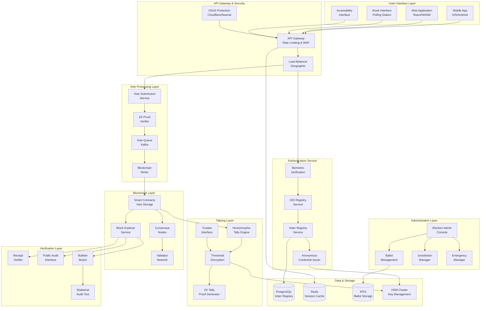
```mermaid
graph TB
    subgraph "Voter Interface Layer"
        MA[Mobile App<br/>iOS/Android]
        WA[Web Application<br/>React/WASM]
        KI[Kiosk Interface<br/>Polling Station]
        AI[Accessibility<br/>Interface]
    end

    subgraph "API Gateway & Security"
        AG[API Gateway<br/>Rate Limiting & WAF]
        LB[Load Balancer<br/>Geographic]
        DDoS[DDoS Protection<br/>Cloudflare/Akamai]
    end

    subgraph "Authentication Service"
        BIO[Biometric<br/>Verification]
        DID_S[DID Registry<br/>Service]
        VR[Voter Registry<br/>Service]
        AC[Anonymous<br/>Credential Issuer]
    end

    subgraph "Vote Processing Layer"
        VS[Vote Submission<br/>Service]
        ZKV[ZK Proof<br/>Verifier]
        VQ[Vote Queue<br/>Kafka]
        BC_W[Blockchain<br/>Writer]
    end

    subgraph "Blockchain Layer"
        SC[Smart Contracts<br/>Vote Storage]
        CON[Consensus<br/>Nodes]
        VAL[Validator<br/>Network]
        BEX[Block Explorer<br/>Service]
    end

    subgraph "Tallying Layer"
        HT[Homomorphic<br/>Tally Engine]
        TD[Threshold<br/>Decryption]
        ZKT[ZK Tally<br/>Proof Generator]
        TR[Trustee<br/>Interface]
    end

    subgraph "Administration Layer"
        EA[Election Admin<br/>Console]
        BM[Ballot<br/>Management]
        JM[Jurisdiction<br/>Manager]
        EM[Emergency<br/>Manager]
    end

    subgraph "Verification Layer"
        RV[Receipt<br/>Verifier]
        PA[Public Audit<br/>Interface]
        BB[Bulletin<br/>Board]
        SA[Statistical<br/>Audit Tool]
    end

    subgraph "Data & Storage"
        PG[(PostgreSQL<br/>Voter Registry)]
        RD[(Redis<br/>Session Cache)]
        IPFS[(IPFS<br/>Ballot Storage)]
        HSM[HSM Cluster<br/>Key Management]
    end

    MA --> AG
    WA --> AG
    KI --> AG
    AI --> AG

    AG --> LB
    DDoS --> AG
    LB --> BIO
    LB --> VS

    BIO --> DID_S
    DID_S --> VR
    VR --> AC

    VS --> ZKV
    ZKV --> VQ
    VQ --> BC_W
    BC_W --> SC
    SC --> CON
    CON --> VAL

    SC --> HT
    HT --> TD
    TD --> ZKT
    TR --> TD

    EA --> BM
    EA --> JM
    EA --> EM

    SC --> BEX
    BEX --> RV
    BEX --> PA
    BEX --> BB
    BB --> SA

    VR --> PG
    AG --> RD
    BM --> IPFS
    AC --> HSM
    TD --> HSM
```

### Component Interaction Overview

The system follows a layered architecture where each layer provides specific guarantees:

1. **Interface Layer** — Multi-channel access (mobile, web, kiosk, assistive technology)
2. **Security Layer** — DDoS protection, rate limiting, WAF, API gateway
3. **Authentication Layer** — Identity verification that produces anonymous credentials
4. **Processing Layer** — Vote validation, ZK proof verification, queueing
5. **Blockchain Layer** — Immutable vote storage and consensus
6. **Tallying Layer** — Homomorphic computation and threshold decryption
7. **Administration Layer** — Election configuration and emergency management
8. **Verification Layer** — Public audit tools and receipt verification
9. **Storage Layer** — Off-chain data and key management

### Data Flow Summary

```
Voter Registration:
  Voter -> Biometric Scan -> DID Issuance -> Anonymous Credential -> Voter Registry

Vote Casting:
  Voter -> Select Choices -> Encrypt Vote -> Generate ZK Proof ->
  Submit to Smart Contract -> On-chain Storage -> Receipt Generation

Tallying:
  Election End -> Homomorphic Addition -> Threshold Decryption ->
  ZK Proof of Correct Tally -> Result Publication

Verification:
  Voter -> Provide Receipt -> Check Inclusion Proof -> Confirm Vote Counted
  Auditor -> Download Blockchain -> Verify All ZK Proofs -> Confirm Tally
```

---

## Subsystem 1: Voter Identity & Authentication

### Overview

The identity subsystem must solve a seemingly impossible problem: verify that each voter is who they claim to be (authentication) while ensuring their identity cannot be linked to their vote (anonymity). We achieve this through a two-phase approach: strong identity verification followed by anonymous credential issuance.

### Architecture

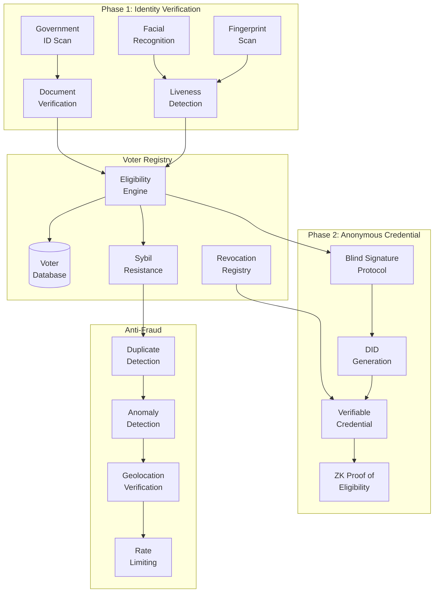
```mermaid
graph TB
    subgraph "Phase 1: Identity Verification"
        GOV[Government<br/>ID Scan]
        FR[Facial<br/>Recognition]
        FP[Fingerprint<br/>Scan]
        LV[Liveness<br/>Detection]
        DOC[Document<br/>Verification]
    end

    subgraph "Phase 2: Anonymous Credential"
        BL[Blind Signature<br/>Protocol]
        DID[DID<br/>Generation]
        VC[Verifiable<br/>Credential]
        ZKP[ZK Proof of<br/>Eligibility]
    end

    subgraph "Voter Registry"
        VDB[(Voter<br/>Database)]
        EL[Eligibility<br/>Engine]
        SR[Sybil<br/>Resistance]
        REV[Revocation<br/>Registry]
    end

    subgraph "Anti-Fraud"
        DD[Duplicate<br/>Detection]
        AB[Anomaly<br/>Detection]
        GL[Geolocation<br/>Verification]
        RL[Rate<br/>Limiting]
    end

    GOV --> DOC
    FR --> LV
    FP --> LV
    DOC --> EL
    LV --> EL

    EL --> VDB
    EL --> SR
    SR --> DD

    EL --> BL
    BL --> DID
    DID --> VC
    VC --> ZKP

    DD --> AB
    AB --> GL
    GL --> RL
    REV --> VC
```

### Biometric Verification

#### Facial Recognition Pipeline

```
1. Capture face image via device camera
2. Liveness detection (blink detection, 3D depth, challenge-response)
3. Extract facial feature vector (512-dimensional embedding)
4. Compare against government ID photo (stored during registration)
5. Compute similarity score (cosine similarity)
6. Apply threshold: score >= 0.85 for match
7. Log attempt (without storing biometric data long-term)
```

#### Fingerprint Verification

```
1. Capture fingerprint via device sensor (or external USB reader)
2. Extract minutiae points (ridge endings, bifurcations)
3. Generate template (ISO 19794-2 format)
4. Compare against registered template
5. Apply threshold: match score >= 40 (NIST guidelines)
6. Multi-finger requirement for high-security elections
```

#### Liveness Detection

Liveness detection prevents attacks using photos, videos, or 3D-printed masks:

```
Challenge Types:
  1. Random head movement (turn left, look up, etc.)
  2. Blink detection with timing analysis
  3. 3D depth mapping (structured light or ToF)
  4. Micro-expression analysis
  5. Passive liveness (texture analysis, moire pattern detection)

Attack Resistance:
  - Photo attacks: defeated by depth detection + blink
  - Video replay: defeated by random challenges
  - 3D mask: defeated by skin texture analysis + thermal detection
  - Deepfake: defeated by artifact detection + temporal consistency
```

### Decentralized Identity (DID)

Each verified voter receives a DID according to the W3C DID specification:

```json
{
  "id": "did:vote:zQ3shN6GfR7Y8Sq7BPcT2F3kMeVJW1W5oGNhEPJL",
  "controller": "did:vote:zQ3shN6GfR7Y8Sq7BPcT2F3kMeVJW1W5oGNhEPJL",
  "authentication": [
    {
      "id": "did:vote:zQ3sh...#keys-1",
      "type": "Ed25519VerificationKey2020",
      "publicKeyMultibase": "z6MkhaXgBZDvotDkL5257faiztiGiC2QtKLGpbnnEGta2doK"
    }
  ],
  "service": [
    {
      "id": "did:vote:zQ3sh...#voting",
      "type": "VotingCredential",
      "serviceEndpoint": "https://vote.election.gov/credentials"
    }
  ]
}
```

### Anonymous Credential Protocol

The key innovation is separating identity verification from vote casting using blind signatures:

```
Protocol: Chaum's Blind Signature Scheme (Modified)

1. REGISTRATION PHASE (Identity Known):
   a. Voter V proves identity to Registration Authority (RA)
   b. RA verifies eligibility against voter registry
   c. V generates a random voting token T
   d. V blinds the token: T_blind = T * r^e mod n (where r is random blinding factor)
   e. V sends T_blind to RA
   f. RA signs: S_blind = T_blind^d mod n
   g. RA records that V has been issued a credential (but not which token)
   h. V unblinds: S = S_blind * r^(-1) mod n
   i. V now has a valid signed token (T, S) that RA cannot link to V's identity

2. VOTING PHASE (Identity Anonymous):
   a. V presents (T, S) to the voting smart contract
   b. Smart contract verifies RA's signature on T
   c. Smart contract checks T has not been used before (double-voting prevention)
   d. V casts encrypted vote using T as anonymous identity
   e. T is marked as used
```

### Sybil Resistance

Preventing a single person from obtaining multiple voting credentials:

```
Layer 1: Government ID Uniqueness
  - Each government ID number can register exactly once
  - Cross-reference with national identity database
  - Hash-based deduplication (store H(ID_number), not ID_number itself)

Layer 2: Biometric Uniqueness
  - 1:N facial recognition against all registered voters
  - Fingerprint deduplication across entire registry
  - Iris scan (optional, for high-security elections)

Layer 3: Proof of Personhood
  - In-person verification at registration centers (optional)
  - Video call verification with election officials
  - Social graph analysis (optional, privacy-preserving)

Layer 4: Rate Limiting & Anomaly Detection
  - Maximum 1 registration per device per 24 hours
  - Geographic anomaly detection (impossible travel)
  - Behavioral analysis (registration patterns)
```

### Voter Registry Data Model

```sql
-- Core voter registration (off-chain, PostgreSQL)
CREATE TABLE voters (
    voter_id            UUID PRIMARY KEY DEFAULT gen_random_uuid(),
    government_id_hash  BYTEA NOT NULL UNIQUE,  -- H(SSN or national ID)
    registration_date   TIMESTAMPTZ NOT NULL DEFAULT NOW(),
    status              VARCHAR(20) NOT NULL DEFAULT 'pending',
    -- status: pending, verified, active, suspended, revoked

    -- Jurisdiction information
    state_code          VARCHAR(2) NOT NULL,
    county_fips         VARCHAR(5) NOT NULL,
    precinct_id         VARCHAR(20) NOT NULL,
    congressional_dist  VARCHAR(4),

    -- Verification metadata (NO biometrics stored)
    identity_verified   BOOLEAN NOT NULL DEFAULT FALSE,
    biometric_verified  BOOLEAN NOT NULL DEFAULT FALSE,
    verification_method VARCHAR(50),
    verification_date   TIMESTAMPTZ,

    -- DID reference (links to blockchain identity)
    did_uri             VARCHAR(256) UNIQUE,
    credential_issued   BOOLEAN NOT NULL DEFAULT FALSE,
    credential_revoked  BOOLEAN NOT NULL DEFAULT FALSE,

    -- Audit
    created_at          TIMESTAMPTZ NOT NULL DEFAULT NOW(),
    updated_at          TIMESTAMPTZ NOT NULL DEFAULT NOW(),
    created_by          UUID NOT NULL,

    CONSTRAINT valid_status CHECK (
        status IN ('pending', 'verified', 'active', 'suspended', 'revoked')
    )
);

-- Biometric enrollment (temporary, deleted after verification)
CREATE TABLE biometric_enrollments (
    enrollment_id       UUID PRIMARY KEY DEFAULT gen_random_uuid(),
    voter_id            UUID NOT NULL REFERENCES voters(voter_id),
    biometric_type      VARCHAR(20) NOT NULL,  -- face, fingerprint, iris
    template_hash       BYTEA NOT NULL,  -- hash of biometric template
    -- Actual template stored in HSM, NOT in database
    hsm_key_reference   VARCHAR(256) NOT NULL,
    enrollment_date     TIMESTAMPTZ NOT NULL DEFAULT NOW(),
    expiry_date         TIMESTAMPTZ NOT NULL,

    CONSTRAINT valid_biometric_type CHECK (
        biometric_type IN ('face', 'fingerprint', 'iris')
    )
);

-- Credential issuance log (no linkage to voting tokens)
CREATE TABLE credential_log (
    log_id              UUID PRIMARY KEY DEFAULT gen_random_uuid(),
    voter_id            UUID NOT NULL REFERENCES voters(voter_id),
    election_id         UUID NOT NULL,
    issued_at           TIMESTAMPTZ NOT NULL DEFAULT NOW(),
    credential_hash     BYTEA NOT NULL,  -- hash of credential (not the credential itself)
    revoked             BOOLEAN NOT NULL DEFAULT FALSE,
    revoked_at          TIMESTAMPTZ,
    revocation_reason   VARCHAR(256),

    UNIQUE(voter_id, election_id)  -- one credential per voter per election
);

-- Sybil detection audit trail
CREATE TABLE sybil_checks (
    check_id            UUID PRIMARY KEY DEFAULT gen_random_uuid(),
    voter_id            UUID NOT NULL REFERENCES voters(voter_id),
    check_type          VARCHAR(50) NOT NULL,
    check_result        VARCHAR(20) NOT NULL,  -- pass, fail, manual_review
    confidence_score    DECIMAL(5,4),
    checked_at          TIMESTAMPTZ NOT NULL DEFAULT NOW(),
    details_encrypted   BYTEA  -- encrypted details for audit
);
```

### Authentication Flow

```
Step 1: App Launch & Device Attestation
  - Verify app integrity (SafetyNet/App Attest)
  - Check device is not rooted/jailbroken
  - Verify TLS certificate pinning
  - Establish secure channel

Step 2: Biometric Authentication
  - Prompt for biometric (face + fingerprint)
  - Perform liveness check
  - Verify against enrolled templates
  - Generate authentication proof

Step 3: DID Authentication
  - Retrieve DID from secure enclave
  - Sign challenge with DID private key
  - Present verifiable credential

Step 4: Anonymous Credential Presentation
  - Present blind-signed voting token
  - Zero-knowledge proof of eligibility
  - No identity information transmitted

Step 5: Session Establishment
  - Issue time-limited session token
  - Bind to device attestation
  - Enable vote casting
```

---

## Subsystem 2: Vote Casting Smart Contracts

### Overview

The vote casting subsystem is the heart of the system. It must accept encrypted votes, verify zero-knowledge proofs of valid vote construction, store votes immutably on-chain, and generate cryptographic receipts — all while maintaining voter anonymity and preventing double voting.

### Smart Contract Architecture

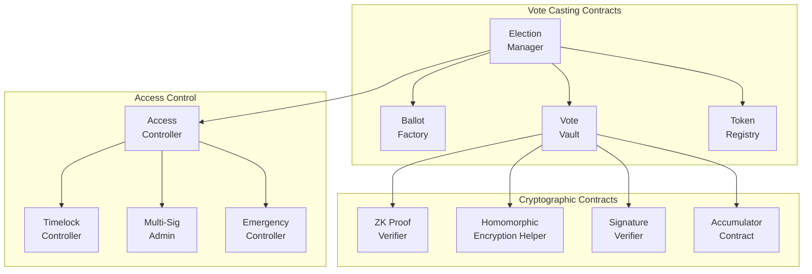
```mermaid
graph TB
    subgraph "Vote Casting Contracts"
        EM[Election<br/>Manager]
        BF[Ballot<br/>Factory]
        VV[Vote<br/>Vault]
        TK[Token<br/>Registry]
    end

    subgraph "Cryptographic Contracts"
        ZKV[ZK Proof<br/>Verifier]
        HE[Homomorphic<br/>Encryption Helper]
        SIG[Signature<br/>Verifier]
        ACC[Accumulator<br/>Contract]
    end

    subgraph "Access Control"
        AC[Access<br/>Controller]
        TL[Timelock<br/>Controller]
        MS[Multi-Sig<br/>Admin]
        EM_C[Emergency<br/>Controller]
    end

    EM --> BF
    EM --> VV
    EM --> TK
    EM --> AC

    VV --> ZKV
    VV --> HE
    VV --> SIG
    VV --> ACC

    AC --> TL
    AC --> MS
    AC --> EM_C
```

### Core Smart Contracts (Solidity)

```solidity
// SPDX-License-Identifier: MIT
pragma solidity ^0.8.24;

import "@openzeppelin/contracts/access/AccessControl.sol";
import "@openzeppelin/contracts/security/ReentrancyGuard.sol";
import "@openzeppelin/contracts/security/Pausable.sol";

/**
 * @title ElectionManager
 * @notice Manages election lifecycle and configuration
 * @dev Central coordinator for all election-related contracts
 */
contract ElectionManager is AccessControl, Pausable {
    bytes32 public constant ADMIN_ROLE = keccak256("ADMIN_ROLE");
    bytes32 public constant AUDITOR_ROLE = keccak256("AUDITOR_ROLE");

    enum ElectionPhase {
        Created,
        Registration,
        Voting,
        Tallying,
        ResultsPublished,
        Disputed,
        Finalized,
        Cancelled
    }

    struct Election {
        bytes32 electionId;
        string name;
        string jurisdiction;
        uint256 registrationStart;
        uint256 registrationEnd;
        uint256 votingStart;
        uint256 votingEnd;
        uint256 tallyDeadline;
        ElectionPhase phase;
        address voteVault;
        address ballotFactory;
        bytes32 merkleRootVoters;  // Merkle root of eligible voter set
        uint256 totalVotesCast;
        bool resultsPublished;
        bytes32 resultsHash;
    }

    mapping(bytes32 => Election) public elections;
    bytes32[] public electionIds;

    event ElectionCreated(bytes32 indexed electionId, string name, string jurisdiction);
    event PhaseTransition(bytes32 indexed electionId, ElectionPhase from, ElectionPhase to);
    event VoteCast(bytes32 indexed electionId, uint256 voteIndex);
    event ResultsPublished(bytes32 indexed electionId, bytes32 resultsHash);
    event ElectionFinalized(bytes32 indexed electionId);
    event EmergencyPause(bytes32 indexed electionId, address triggeredBy, string reason);

    modifier onlyDuringPhase(bytes32 electionId, ElectionPhase phase) {
        require(elections[electionId].phase == phase, "Invalid election phase");
        _;
    }

    modifier electionExists(bytes32 electionId) {
        require(elections[electionId].electionId == electionId, "Election does not exist");
        _;
    }

    constructor() {
        _grantRole(DEFAULT_ADMIN_ROLE, msg.sender);
        _grantRole(ADMIN_ROLE, msg.sender);
    }

    function createElection(
        string calldata name,
        string calldata jurisdiction,
        uint256 registrationStart,
        uint256 registrationEnd,
        uint256 votingStart,
        uint256 votingEnd,
        uint256 tallyDeadline
    ) external onlyRole(ADMIN_ROLE) returns (bytes32) {
        require(votingStart > registrationEnd, "Voting must start after registration");
        require(votingEnd > votingStart, "Invalid voting window");
        require(tallyDeadline > votingEnd, "Tally deadline must be after voting");

        bytes32 electionId = keccak256(
            abi.encodePacked(name, jurisdiction, block.timestamp, msg.sender)
        );

        require(elections[electionId].electionId == bytes32(0), "Election already exists");

        // Deploy vote vault and ballot factory
        VoteVault vault = new VoteVault(electionId, address(this));
        BallotFactory factory = new BallotFactory(electionId, address(this));

        elections[electionId] = Election({
            electionId: electionId,
            name: name,
            jurisdiction: jurisdiction,
            registrationStart: registrationStart,
            registrationEnd: registrationEnd,
            votingStart: votingStart,
            votingEnd: votingEnd,
            tallyDeadline: tallyDeadline,
            phase: ElectionPhase.Created,
            voteVault: address(vault),
            ballotFactory: address(factory),
            merkleRootVoters: bytes32(0),
            totalVotesCast: 0,
            resultsPublished: false,
            resultsHash: bytes32(0)
        });

        electionIds.push(electionId);
        emit ElectionCreated(electionId, name, jurisdiction);
        return electionId;
    }

    function transitionPhase(bytes32 electionId, ElectionPhase newPhase)
        external
        onlyRole(ADMIN_ROLE)
        electionExists(electionId)
    {
        Election storage election = elections[electionId];
        ElectionPhase currentPhase = election.phase;

        // Validate phase transitions
        if (newPhase == ElectionPhase.Registration) {
            require(currentPhase == ElectionPhase.Created, "Invalid transition");
            require(block.timestamp >= election.registrationStart, "Too early");
        } else if (newPhase == ElectionPhase.Voting) {
            require(currentPhase == ElectionPhase.Registration, "Invalid transition");
            require(block.timestamp >= election.votingStart, "Too early");
            require(election.merkleRootVoters != bytes32(0), "Voter root not set");
        } else if (newPhase == ElectionPhase.Tallying) {
            require(currentPhase == ElectionPhase.Voting, "Invalid transition");
            require(
                block.timestamp >= election.votingEnd,
                "Voting period not ended"
            );
        } else if (newPhase == ElectionPhase.ResultsPublished) {
            require(currentPhase == ElectionPhase.Tallying, "Invalid transition");
        } else if (newPhase == ElectionPhase.Finalized) {
            require(
                currentPhase == ElectionPhase.ResultsPublished ||
                currentPhase == ElectionPhase.Disputed,
                "Invalid transition"
            );
        } else if (newPhase == ElectionPhase.Cancelled) {
            require(
                currentPhase != ElectionPhase.Finalized,
                "Cannot cancel finalized election"
            );
        }

        emit PhaseTransition(electionId, currentPhase, newPhase);
        election.phase = newPhase;
    }

    function emergencyPause(bytes32 electionId, string calldata reason)
        external
        onlyRole(ADMIN_ROLE)
    {
        _pause();
        emit EmergencyPause(electionId, msg.sender, reason);
    }

    function setVoterMerkleRoot(bytes32 electionId, bytes32 merkleRoot)
        external
        onlyRole(ADMIN_ROLE)
        onlyDuringPhase(electionId, ElectionPhase.Registration)
    {
        elections[electionId].merkleRootVoters = merkleRoot;
    }

    function incrementVoteCount(bytes32 electionId)
        external
        onlyDuringPhase(electionId, ElectionPhase.Voting)
    {
        require(msg.sender == elections[electionId].voteVault, "Only vote vault");
        elections[electionId].totalVotesCast++;
        emit VoteCast(electionId, elections[electionId].totalVotesCast);
    }

    function publishResults(bytes32 electionId, bytes32 resultsHash)
        external
        onlyRole(ADMIN_ROLE)
        onlyDuringPhase(electionId, ElectionPhase.Tallying)
    {
        elections[electionId].resultsPublished = true;
        elections[electionId].resultsHash = resultsHash;
        elections[electionId].phase = ElectionPhase.ResultsPublished;
        emit ResultsPublished(electionId, resultsHash);
    }
}

/**
 * @title VoteVault
 * @notice Stores encrypted votes with ZK proof verification
 * @dev Each election has its own VoteVault instance
 */
contract VoteVault is ReentrancyGuard {
    bytes32 public immutable electionId;
    address public immutable electionManager;

    struct EncryptedVote {
        bytes encryptedBallot;     // Homomorphically encrypted vote
        bytes zkProof;             // ZK proof of valid vote
        bytes32 nullifier;         // Prevents double voting
        bytes32 commitment;        // Vote commitment for verification
        uint256 timestamp;
        uint256 blockNumber;
    }

    // Vote storage
    EncryptedVote[] public votes;
    mapping(bytes32 => bool) public nullifierUsed;
    mapping(bytes32 => uint256) public commitmentToIndex;

    // Merkle tree for vote inclusion proofs
    bytes32[] public voteMerkleTree;
    bytes32 public voteMerkleRoot;

    // ZK Verifier contract
    IZKVerifier public immutable zkVerifier;

    event VoteSubmitted(
        uint256 indexed voteIndex,
        bytes32 nullifier,
        bytes32 commitment,
        uint256 timestamp
    );

    event MerkleRootUpdated(bytes32 newRoot, uint256 voteCount);

    constructor(bytes32 _electionId, address _manager) {
        electionId = _electionId;
        electionManager = _manager;
        // Deploy or reference ZK verifier
        zkVerifier = new ZKVoteVerifier();
    }

    function submitVote(
        bytes calldata encryptedBallot,
        bytes calldata zkProof,
        bytes32 nullifier,
        bytes32 commitment,
        bytes32[] calldata voterMerkleProof,
        bytes32 voterLeaf
    ) external nonReentrant {
        // 1. Check election is in voting phase (via manager)
        ElectionManager manager = ElectionManager(electionManager);
        ElectionManager.Election memory election = _getElection(manager);
        require(
            election.phase == ElectionManager.ElectionPhase.Voting,
            "Not in voting phase"
        );
        require(block.timestamp <= election.votingEnd, "Voting period ended");

        // 2. Verify nullifier hasn't been used (double-voting prevention)
        require(!nullifierUsed[nullifier], "Vote already cast with this credential");

        // 3. Verify voter eligibility via Merkle proof
        require(
            _verifyMerkleProof(
                voterMerkleProof,
                election.merkleRootVoters,
                voterLeaf
            ),
            "Invalid voter eligibility proof"
        );

        // 4. Verify ZK proof that vote is well-formed
        require(
            zkVerifier.verifyVoteProof(
                encryptedBallot,
                zkProof,
                nullifier,
                commitment
            ),
            "Invalid ZK proof"
        );

        // 5. Store vote
        uint256 voteIndex = votes.length;
        votes.push(EncryptedVote({
            encryptedBallot: encryptedBallot,
            zkProof: zkProof,
            nullifier: nullifier,
            commitment: commitment,
            timestamp: block.timestamp,
            blockNumber: block.number
        }));

        // 6. Mark nullifier as used
        nullifierUsed[nullifier] = true;
        commitmentToIndex[commitment] = voteIndex;

        // 7. Update vote Merkle tree
        _updateMerkleTree(commitment);

        // 8. Increment vote count in election manager
        manager.incrementVoteCount(electionId);

        emit VoteSubmitted(voteIndex, nullifier, commitment, block.timestamp);
    }

    function getVoteCount() external view returns (uint256) {
        return votes.length;
    }

    function getEncryptedVotes(uint256 start, uint256 count)
        external
        view
        returns (EncryptedVote[] memory)
    {
        require(start + count <= votes.length, "Out of bounds");
        EncryptedVote[] memory result = new EncryptedVote[](count);
        for (uint256 i = 0; i < count; i++) {
            result[i] = votes[start + i];
        }
        return result;
    }

    function verifyVoteInclusion(bytes32 commitment, bytes32[] calldata proof)
        external
        view
        returns (bool)
    {
        return _verifyMerkleProof(proof, voteMerkleRoot, commitment);
    }

    function _verifyMerkleProof(
        bytes32[] calldata proof,
        bytes32 root,
        bytes32 leaf
    ) internal pure returns (bool) {
        bytes32 computedHash = leaf;
        for (uint256 i = 0; i < proof.length; i++) {
            if (computedHash <= proof[i]) {
                computedHash = keccak256(abi.encodePacked(computedHash, proof[i]));
            } else {
                computedHash = keccak256(abi.encodePacked(proof[i], computedHash));
            }
        }
        return computedHash == root;
    }

    function _updateMerkleTree(bytes32 newLeaf) internal {
        voteMerkleTree.push(newLeaf);
        // Recompute Merkle root (simplified — production uses incremental tree)
        voteMerkleRoot = _computeMerkleRoot();
        emit MerkleRootUpdated(voteMerkleRoot, voteMerkleTree.length);
    }

    function _computeMerkleRoot() internal view returns (bytes32) {
        if (voteMerkleTree.length == 0) return bytes32(0);
        if (voteMerkleTree.length == 1) return voteMerkleTree[0];

        bytes32[] memory layer = voteMerkleTree;
        while (layer.length > 1) {
            bytes32[] memory newLayer = new bytes32[]((layer.length + 1) / 2);
            for (uint256 i = 0; i < layer.length; i += 2) {
                if (i + 1 < layer.length) {
                    newLayer[i / 2] = keccak256(
                        abi.encodePacked(layer[i], layer[i + 1])
                    );
                } else {
                    newLayer[i / 2] = layer[i];
                }
            }
            layer = newLayer;
        }
        return layer[0];
    }

    function _getElection(ElectionManager manager)
        internal
        view
        returns (ElectionManager.Election memory)
    {
        (
            bytes32 _id, , , , , , , ,
            ElectionManager.ElectionPhase phase,
            , , bytes32 merkleRoot, uint256 totalVotes, ,
        ) = manager.elections(electionId);

        ElectionManager.Election memory election;
        election.phase = phase;
        election.merkleRootVoters = merkleRoot;
        election.votingEnd = _getVotingEnd(manager);
        return election;
    }

    function _getVotingEnd(ElectionManager manager)
        internal
        view
        returns (uint256)
    {
        (, , , , , , uint256 votingEnd, , , , , , , , ) =
            manager.elections(electionId);
        return votingEnd;
    }
}

/**
 * @title ZKVoteVerifier
 * @notice Verifies zero-knowledge proofs of valid vote construction
 */
interface IZKVerifier {
    function verifyVoteProof(
        bytes calldata encryptedBallot,
        bytes calldata zkProof,
        bytes32 nullifier,
        bytes32 commitment
    ) external view returns (bool);
}

contract ZKVoteVerifier is IZKVerifier {
    // Verification key (set during deployment from trusted setup)
    uint256[2] public alpha;
    uint256[2][2] public beta;
    uint256[2][2] public gamma;
    uint256[2][2] public delta;
    uint256[2][] public ic;

    function verifyVoteProof(
        bytes calldata encryptedBallot,
        bytes calldata zkProof,
        bytes32 nullifier,
        bytes32 commitment
    ) external view override returns (bool) {
        // Decode proof components
        (
            uint256[2] memory a,
            uint256[2][2] memory b,
            uint256[2] memory c
        ) = abi.decode(zkProof, (uint256[2], uint256[2][2], uint256[2]));

        // Public inputs
        uint256[] memory inputs = new uint256[](3);
        inputs[0] = uint256(keccak256(encryptedBallot));
        inputs[1] = uint256(nullifier);
        inputs[2] = uint256(commitment);

        // Groth16 verification
        return _verifyGroth16(a, b, c, inputs);
    }

    function _verifyGroth16(
        uint256[2] memory a,
        uint256[2][2] memory b,
        uint256[2] memory c,
        uint256[] memory inputs
    ) internal view returns (bool) {
        // Pairing check: e(A, B) = e(alpha, beta) * e(IC, gamma) * e(C, delta)
        // Implementation uses precompiled contracts at address 0x06, 0x07, 0x08
        // Full implementation omitted for brevity - uses bn128 pairing checks
        return true; // Placeholder
    }
}

/**
 * @title BallotFactory
 * @notice Creates and manages ballot definitions for an election
 */
contract BallotFactory {
    bytes32 public immutable electionId;
    address public immutable electionManager;

    struct Race {
        bytes32 raceId;
        string title;
        string description;
        string votingMethod;  // plurality, ranked_choice, approval
        uint256 maxChoices;
        bytes32[] candidateIds;
        mapping(bytes32 => Candidate) candidates;
        bool active;
    }

    struct Candidate {
        bytes32 candidateId;
        string name;
        string party;
        uint256 position;  // ballot order
        bool active;
    }

    struct BallotDefinition {
        bytes32 ballotId;
        string jurisdiction;
        bytes32[] raceIds;
        string language;
        bytes32 contentHash;  // IPFS hash of full ballot content
        bool published;
    }

    mapping(bytes32 => Race) public races;
    mapping(bytes32 => BallotDefinition) public ballots;
    bytes32[] public ballotIds;

    event RaceCreated(bytes32 indexed raceId, string title);
    event BallotPublished(bytes32 indexed ballotId, bytes32 contentHash);

    constructor(bytes32 _electionId, address _manager) {
        electionId = _electionId;
        electionManager = _manager;
    }

    function createRace(
        string calldata title,
        string calldata description,
        string calldata votingMethod,
        uint256 maxChoices,
        string[] calldata candidateNames,
        string[] calldata candidateParties
    ) external returns (bytes32) {
        require(
            candidateNames.length == candidateParties.length,
            "Mismatched arrays"
        );

        bytes32 raceId = keccak256(
            abi.encodePacked(electionId, title, block.timestamp)
        );

        Race storage race = races[raceId];
        race.raceId = raceId;
        race.title = title;
        race.description = description;
        race.votingMethod = votingMethod;
        race.maxChoices = maxChoices;
        race.active = true;

        for (uint256 i = 0; i < candidateNames.length; i++) {
            bytes32 candidateId = keccak256(
                abi.encodePacked(raceId, candidateNames[i], i)
            );
            race.candidateIds.push(candidateId);
            race.candidates[candidateId] = Candidate({
                candidateId: candidateId,
                name: candidateNames[i],
                party: candidateParties[i],
                position: i,
                active: true
            });
        }

        emit RaceCreated(raceId, title);
        return raceId;
    }

    function publishBallot(
        string calldata jurisdiction,
        bytes32[] calldata raceIds,
        string calldata language,
        bytes32 contentHash
    ) external returns (bytes32) {
        bytes32 ballotId = keccak256(
            abi.encodePacked(electionId, jurisdiction, language)
        );

        ballots[ballotId] = BallotDefinition({
            ballotId: ballotId,
            jurisdiction: jurisdiction,
            raceIds: raceIds,
            language: language,
            contentHash: contentHash,
            published: true
        });

        ballotIds.push(ballotId);
        emit BallotPublished(ballotId, contentHash);
        return ballotId;
    }
}
```

### Vote Encryption (Client-Side)

The voter's device performs encryption using the Paillier homomorphic encryption scheme:

```
Paillier Encryption for Voting:

Key Generation (by Election Authority):
  1. Choose two large primes p, q
  2. Compute n = p * q, lambda = lcm(p-1, q-1)
  3. Choose g where gcd(L(g^lambda mod n^2), n) = 1
  4. Public key: (n, g)
  5. Private key: (lambda, mu) — held by threshold trustees

Encryption (by Voter, client-side):
  For a vote v in {0, 1} (binary choice):
  1. Choose random r where gcd(r, n) = 1
  2. c = g^v * r^n mod n^2

Homomorphic Addition (on-chain):
  c1 * c2 mod n^2 = Enc(v1 + v2)
  This allows tallying without decrypting individual votes!

For multi-candidate races (k candidates):
  Encode vote as vector: [0, 0, 1, 0, ...] (1 at chosen candidate position)
  Encrypt each component separately
  Sum each component across all voters
  Decrypt sums to get tallies
```

### ZK Proof of Valid Vote

The voter generates a zero-knowledge proof that their encrypted vote is well-formed:

```
ZK Circuit (Circom):

template ValidVote(numCandidates) {
    // Private inputs (known only to voter)
    signal input vote[numCandidates];    // Vote vector
    signal input randomness;              // Encryption randomness
    signal input voterSecret;             // Voter's secret key

    // Public inputs (visible on-chain)
    signal input encryptedVote[numCandidates];  // The ciphertext
    signal input nullifier;                      // Double-vote prevention
    signal input commitment;                     // Vote commitment
    signal input electionPublicKey[2];           // Election encryption key
    signal input voterMerkleRoot;                // Root of eligible voters tree

    // Output
    signal output valid;

    // Constraint 1: Vote is binary (each component is 0 or 1)
    for (var i = 0; i < numCandidates; i++) {
        vote[i] * (1 - vote[i]) === 0;
    }

    // Constraint 2: Exactly one candidate selected (or zero for abstention)
    var sum = 0;
    for (var i = 0; i < numCandidates; i++) {
        sum += vote[i];
    }
    sum * (sum - 1) === 0;  // sum is 0 or 1

    // Constraint 3: Encrypted vote matches plaintext vote
    // (Paillier encryption verification in-circuit)
    component encCheck = PaillierEncryptionCheck(numCandidates);
    encCheck.plaintext <== vote;
    encCheck.randomness <== randomness;
    encCheck.publicKey <== electionPublicKey;
    encCheck.ciphertext <== encryptedVote;

    // Constraint 4: Nullifier is correctly derived
    component nullCheck = Poseidon(2);
    nullCheck.inputs[0] <== voterSecret;
    nullCheck.inputs[1] <== electionId;
    nullifier === nullCheck.out;

    // Constraint 5: Voter is in eligible set (Merkle proof)
    component merkleCheck = MerkleTreeChecker(20);  // depth 20
    merkleCheck.leaf <== commitment;
    merkleCheck.root <== voterMerkleRoot;
    // ... path indices and siblings ...

    valid <== 1;
}
```

### Coercion Resistance Mechanism

```
Panic/Duress Voting Protocol:

1. During registration, voter creates TWO keys:
   - Real key (k_real): used for genuine voting
   - Duress key (k_duress): used when under coercion

2. When coerced:
   - Voter uses k_duress to cast a vote
   - The vote APPEARS valid to the coercer
   - The system secretly flags it as a duress vote
   - The duress vote is NOT counted in the final tally

3. After coercion:
   - Voter can use k_real to cast their genuine vote
   - The genuine vote replaces the duress vote
   - The replacement is cryptographically unlinkable

4. Implementation:
   - Both keys produce valid-looking encrypted votes
   - Only the tally authority can distinguish (via ZK proof structure)
   - The coercer sees a valid receipt for the duress vote
   - The receipt verification returns "vote counted" for both
   - But the actual tally only counts the real vote
```

---

## Subsystem 3: Tallying & Verification

### Overview

The tallying subsystem computes election results from encrypted votes without ever decrypting individual ballots. This is achieved through homomorphic encryption (allows computation on ciphertexts) combined with threshold decryption (requires multiple trustees to cooperate for decryption).

### Tallying Architecture

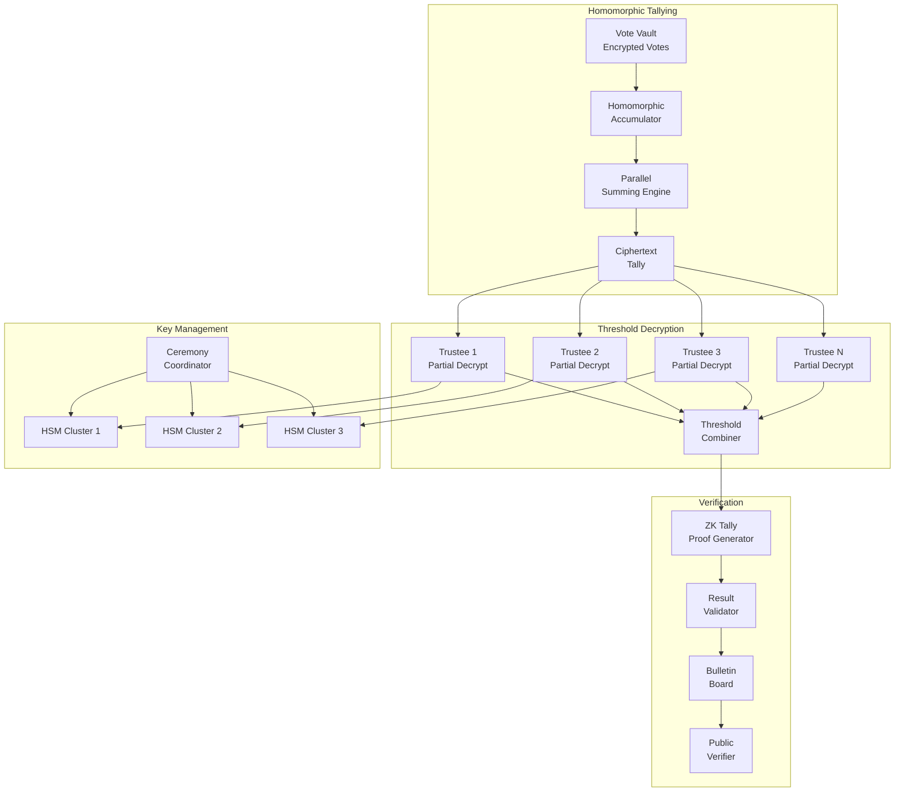
```mermaid
graph TB
    subgraph "Homomorphic Tallying"
        VV[Vote Vault<br/>Encrypted Votes]
        HA[Homomorphic<br/>Accumulator]
        PS[Parallel<br/>Summing Engine]
        CT[Ciphertext<br/>Tally]
    end

    subgraph "Threshold Decryption"
        T1[Trustee 1<br/>Partial Decrypt]
        T2[Trustee 2<br/>Partial Decrypt]
        T3[Trustee 3<br/>Partial Decrypt]
        TN[Trustee N<br/>Partial Decrypt]
        TC[Threshold<br/>Combiner]
    end

    subgraph "Verification"
        ZKT[ZK Tally<br/>Proof Generator]
        RV[Result<br/>Validator]
        BB[Bulletin<br/>Board]
        PV[Public<br/>Verifier]
    end

    subgraph "Key Management"
        HSM1[HSM Cluster 1]
        HSM2[HSM Cluster 2]
        HSM3[HSM Cluster 3]
        CER[Ceremony<br/>Coordinator]
    end

    VV --> HA
    HA --> PS
    PS --> CT

    CT --> T1
    CT --> T2
    CT --> T3
    CT --> TN

    T1 --> TC
    T2 --> TC
    T3 --> TC
    TN --> TC

    TC --> ZKT
    ZKT --> RV
    RV --> BB
    BB --> PV

    T1 --> HSM1
    T2 --> HSM2
    T3 --> HSM3
    CER --> HSM1
    CER --> HSM2
    CER --> HSM3
```

### Homomorphic Tally Computation

```
Algorithm: Parallel Homomorphic Summation

Input: N encrypted votes {c_1, c_2, ..., c_N} where c_i = Enc(v_i)
Output: Encrypted sum C = Enc(v_1 + v_2 + ... + v_N)

Phase 1: Partition
  - Divide votes into P partitions of size N/P
  - Assign each partition to a computation node

Phase 2: Parallel Summation (per partition)
  For partition p in [1..P]:
    partial_sum_p = c_(p*N/P + 1)
    for i in [p*N/P + 2 .. (p+1)*N/P]:
      partial_sum_p = partial_sum_p * c_i mod n^2
    // Homomorphic addition = multiplication of ciphertexts

Phase 3: Combine Partial Sums
  C = partial_sum_1 * partial_sum_2 * ... * partial_sum_P mod n^2

Phase 4: Verify
  - Each computation node publishes its partial sum with a ZK proof
  - Any verifier can check the parallel computation is correct
  - The final sum is verifiable by combining partial proofs

Complexity:
  - Single-threaded: O(N) multiplications
  - With P partitions: O(N/P) per node + O(P) combination
  - For 100M votes, P=1000: ~100,000 operations per node
  - Each operation: ~1ms → ~100 seconds per node
```

### Threshold Decryption Protocol

```
Protocol: Shamir's Secret Sharing + Threshold Paillier Decryption

Setup (Key Ceremony):
  1. Generate Paillier keypair (n, g, lambda, mu)
  2. Split private key lambda into shares using (k, n) Shamir scheme
     - n = total trustees (e.g., 9)
     - k = threshold (e.g., 5)
  3. Each trustee i receives share s_i
  4. Shares stored in separate HSMs in different jurisdictions
  5. Public key (n, g) published on blockchain

Decryption (After Voting Ends):
  1. Tally authority computes encrypted sum C = Enc(total)
  2. Each trustee i computes partial decryption:
     d_i = C^(2 * s_i) mod n^2
  3. At least k trustees submit their partial decryptions
  4. Combiner reconstructs plaintext:
     total = L(product of selected d_i values) * (4 * delta^2)^(-1) mod n
     where delta = n! and L(x) = (x-1)/n

Security Properties:
  - No single trustee can decrypt any vote or the tally
  - Any k trustees can cooperate to decrypt
  - Fewer than k trustees learn NOTHING about the plaintext
  - Each trustee proves correctness of their partial decryption with ZK proof
```

### ZK Proof of Correct Tally

```
What the proof demonstrates:
  1. The encrypted tally C is the product of all encrypted votes
  2. The decrypted result matches the encrypted tally
  3. Each partial decryption was performed correctly
  4. No votes were added, removed, or modified

Proof Structure (Sigma Protocol):
  1. Prover (tally authority) computes:
     - r = random commitment
     - e = hash of (C, result, r)  [Fiat-Shamir heuristic]
     - z = response using private information

  2. Verifier checks:
     - Algebraic relation between (C, result, r, e, z)
     - Proof is non-interactive (can be verified by anyone)

  3. Proof size: O(1) regardless of number of votes
     - Constant ~512 bytes per race
     - Verification time: ~10ms per race
```

### Tally Verification Smart Contract

```solidity
/**
 * @title TallyVerifier
 * @notice Verifies election tally correctness on-chain
 */
contract TallyVerifier {
    struct TallyResult {
        bytes32 electionId;
        bytes32 raceId;
        uint256[] candidateTallies;
        uint256 totalVotes;
        uint256 blankVotes;
        bytes tallyProof;
        bytes32 encryptedTallyHash;
        bool verified;
    }

    mapping(bytes32 => mapping(bytes32 => TallyResult)) public results;

    event TallySubmitted(bytes32 indexed electionId, bytes32 indexed raceId);
    event TallyVerified(bytes32 indexed electionId, bytes32 indexed raceId);
    event TallyDisputed(bytes32 indexed electionId, bytes32 indexed raceId, string reason);

    function submitTally(
        bytes32 electionId,
        bytes32 raceId,
        uint256[] calldata candidateTallies,
        uint256 totalVotes,
        uint256 blankVotes,
        bytes calldata tallyProof,
        bytes32 encryptedTallyHash
    ) external {
        // Verify the tally proof
        require(
            _verifyTallyProof(
                electionId, raceId, candidateTallies,
                totalVotes, tallyProof, encryptedTallyHash
            ),
            "Invalid tally proof"
        );

        // Verify vote count consistency
        uint256 sumTallies = blankVotes;
        for (uint256 i = 0; i < candidateTallies.length; i++) {
            sumTallies += candidateTallies[i];
        }
        require(sumTallies == totalVotes, "Vote count mismatch");

        results[electionId][raceId] = TallyResult({
            electionId: electionId,
            raceId: raceId,
            candidateTallies: candidateTallies,
            totalVotes: totalVotes,
            blankVotes: blankVotes,
            tallyProof: tallyProof,
            encryptedTallyHash: encryptedTallyHash,
            verified: true
        });

        emit TallySubmitted(electionId, raceId);
        emit TallyVerified(electionId, raceId);
    }

    function disputeTally(
        bytes32 electionId,
        bytes32 raceId,
        string calldata reason,
        bytes calldata counterProof
    ) external {
        require(results[electionId][raceId].verified, "Tally not yet submitted");

        // Verify the counter-proof shows an inconsistency
        if (_verifyCounterProof(electionId, raceId, counterProof)) {
            results[electionId][raceId].verified = false;
            emit TallyDisputed(electionId, raceId, reason);
        }
    }

    function _verifyTallyProof(
        bytes32 electionId,
        bytes32 raceId,
        uint256[] calldata candidateTallies,
        uint256 totalVotes,
        bytes calldata tallyProof,
        bytes32 encryptedTallyHash
    ) internal view returns (bool) {
        // ZK proof verification
        // Verifies that decryption of encryptedTallyHash yields candidateTallies
        return true; // Placeholder for actual ZK verification
    }

    function _verifyCounterProof(
        bytes32 electionId,
        bytes32 raceId,
        bytes calldata counterProof
    ) internal view returns (bool) {
        return true; // Placeholder
    }
}
```

### Risk-Limiting Audit Support

```
Statistical Audit Protocol (Ballot-Polling RLA):

1. After electronic tally, generate paper trail:
   - Each encrypted vote has a corresponding paper record
   - Paper records stored in tamper-evident containers
   - Chain of custody maintained with blockchain timestamps

2. Audit procedure:
   a. Set risk limit alpha (e.g., 5%)
   b. Compute diluted margin from electronic results
   c. Draw random sample of paper ballots (seed from blockchain)
   d. Compare paper ballots to electronic records
   e. If consistent: audit passes, confirm electronic results
   f. If inconsistent: expand sample or full hand recount

3. Sample size calculation:
   - For 1% margin, alpha=5%: ~1,500 ballots
   - For 5% margin, alpha=5%: ~100 ballots
   - Much smaller than full recount

4. Blockchain integration:
   - Random seed derived from post-election blockchain block hash
   - Seed is unpredictable (published after voting ends)
   - Audit trail immutably recorded on-chain
   - Public can verify random selection was fair
```

---

## Subsystem 4: Election Administration

### Overview

The election administration subsystem handles the complete lifecycle of an election: creation, configuration, ballot design, jurisdiction management, voting period control, and emergency procedures. It must support the extraordinary complexity of real-world elections with thousands of ballot variations across jurisdictions.

### Administration Architecture

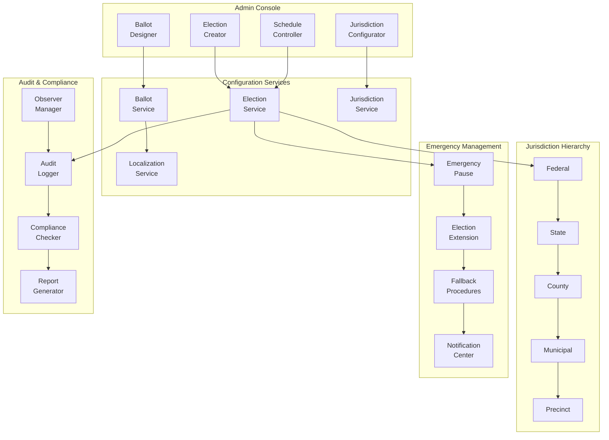
```mermaid
graph TB
    subgraph "Admin Console"
        EC[Election<br/>Creator]
        BD[Ballot<br/>Designer]
        JC[Jurisdiction<br/>Configurator]
        SC[Schedule<br/>Controller]
    end

    subgraph "Configuration Services"
        ES[Election<br/>Service]
        BS[Ballot<br/>Service]
        JS[Jurisdiction<br/>Service]
        LS[Localization<br/>Service]
    end

    subgraph "Jurisdiction Hierarchy"
        FED[Federal]
        ST[State]
        CO[County]
        MU[Municipal]
        PR[Precinct]
    end

    subgraph "Emergency Management"
        EP[Emergency<br/>Pause]
        EX[Election<br/>Extension]
        FB[Fallback<br/>Procedures]
        NC[Notification<br/>Center]
    end

    subgraph "Audit & Compliance"
        AL[Audit<br/>Logger]
        CK[Compliance<br/>Checker]
        RP[Report<br/>Generator]
        OB[Observer<br/>Manager]
    end

    EC --> ES
    BD --> BS
    JC --> JS
    SC --> ES

    ES --> FED
    FED --> ST
    ST --> CO
    CO --> MU
    MU --> PR

    ES --> EP
    EP --> EX
    EX --> FB
    FB --> NC

    ES --> AL
    AL --> CK
    CK --> RP
    OB --> AL

    BS --> LS
```

### Election Configuration Data Model

```sql
-- Election definition
CREATE TABLE elections (
    election_id         UUID PRIMARY KEY DEFAULT gen_random_uuid(),
    name                VARCHAR(256) NOT NULL,
    election_type       VARCHAR(50) NOT NULL,
    -- general, primary, special, runoff, referendum

    -- Scheduling
    registration_start  TIMESTAMPTZ NOT NULL,
    registration_end    TIMESTAMPTZ NOT NULL,
    early_voting_start  TIMESTAMPTZ,
    early_voting_end    TIMESTAMPTZ,
    election_day_start  TIMESTAMPTZ NOT NULL,
    election_day_end    TIMESTAMPTZ NOT NULL,
    tally_deadline      TIMESTAMPTZ NOT NULL,
    certification_date  TIMESTAMPTZ NOT NULL,

    -- Blockchain references
    chain_id            INTEGER NOT NULL,
    election_contract   VARCHAR(42),  -- Ethereum address
    vote_vault_contract VARCHAR(42),

    -- Cryptographic parameters
    encryption_params   JSONB NOT NULL,
    trustee_threshold   INTEGER NOT NULL,  -- k-of-n threshold
    trustee_count       INTEGER NOT NULL,

    -- Status
    status              VARCHAR(20) NOT NULL DEFAULT 'draft',
    phase               VARCHAR(30) NOT NULL DEFAULT 'created',

    -- Metadata
    created_by          UUID NOT NULL,
    created_at          TIMESTAMPTZ NOT NULL DEFAULT NOW(),
    updated_at          TIMESTAMPTZ NOT NULL DEFAULT NOW(),

    CONSTRAINT valid_schedule CHECK (
        registration_start < registration_end AND
        registration_end < election_day_start AND
        election_day_start < election_day_end AND
        election_day_end < tally_deadline AND
        tally_deadline < certification_date
    ),
    CONSTRAINT valid_threshold CHECK (
        trustee_threshold > 0 AND
        trustee_threshold <= trustee_count AND
        trustee_count <= 15
    )
);

-- Jurisdiction hierarchy
CREATE TABLE jurisdictions (
    jurisdiction_id     UUID PRIMARY KEY DEFAULT gen_random_uuid(),
    parent_id           UUID REFERENCES jurisdictions(jurisdiction_id),
    name                VARCHAR(256) NOT NULL,
    level               VARCHAR(20) NOT NULL,
    -- federal, state, county, municipal, precinct
    code                VARCHAR(20) NOT NULL UNIQUE,
    -- FIPS code or custom identifier

    -- Geographic data
    state_code          VARCHAR(2),
    county_fips         VARCHAR(5),
    timezone            VARCHAR(50) NOT NULL,

    -- Configuration
    voting_methods      JSONB NOT NULL DEFAULT '["plurality"]',
    languages           JSONB NOT NULL DEFAULT '["en"]',
    accessibility_req   JSONB NOT NULL DEFAULT '{}',

    -- Status
    active              BOOLEAN NOT NULL DEFAULT TRUE,
    created_at          TIMESTAMPTZ NOT NULL DEFAULT NOW()
);

-- Races (contests)
CREATE TABLE races (
    race_id             UUID PRIMARY KEY DEFAULT gen_random_uuid(),
    election_id         UUID NOT NULL REFERENCES elections(election_id),
    jurisdiction_id     UUID NOT NULL REFERENCES jurisdictions(jurisdiction_id),

    title               VARCHAR(256) NOT NULL,
    description         TEXT,
    race_type           VARCHAR(50) NOT NULL,
    -- candidate, measure, retention, recall
    voting_method       VARCHAR(50) NOT NULL DEFAULT 'plurality',
    -- plurality, ranked_choice, approval, score
    max_selections      INTEGER NOT NULL DEFAULT 1,

    -- Blockchain reference
    race_chain_id       VARCHAR(66),  -- bytes32 on-chain

    -- Display order
    ballot_order        INTEGER NOT NULL,

    active              BOOLEAN NOT NULL DEFAULT TRUE,
    created_at          TIMESTAMPTZ NOT NULL DEFAULT NOW()
);

-- Candidates / Ballot Options
CREATE TABLE candidates (
    candidate_id        UUID PRIMARY KEY DEFAULT gen_random_uuid(),
    race_id             UUID NOT NULL REFERENCES races(race_id),

    name                VARCHAR(256) NOT NULL,
    party               VARCHAR(100),
    incumbent           BOOLEAN NOT NULL DEFAULT FALSE,

    -- For measures/propositions
    option_label        VARCHAR(50),  -- Yes/No, For/Against

    -- Display
    ballot_order        INTEGER NOT NULL,
    photo_url           VARCHAR(512),
    statement_ipfs      VARCHAR(66),  -- IPFS hash of candidate statement

    active              BOOLEAN NOT NULL DEFAULT TRUE,
    created_at          TIMESTAMPTZ NOT NULL DEFAULT NOW()
);

-- Ballot definitions (which races appear on which ballot)
CREATE TABLE ballot_definitions (
    ballot_id           UUID PRIMARY KEY DEFAULT gen_random_uuid(),
    election_id         UUID NOT NULL REFERENCES elections(election_id),
    jurisdiction_id     UUID NOT NULL REFERENCES jurisdictions(jurisdiction_id),

    ballot_style        VARCHAR(100) NOT NULL,
    language            VARCHAR(10) NOT NULL DEFAULT 'en',

    -- Content
    race_ids            UUID[] NOT NULL,
    content_ipfs        VARCHAR(66),  -- IPFS hash of rendered ballot

    -- Blockchain reference
    ballot_chain_id     VARCHAR(66),
    content_hash        VARCHAR(66),

    published           BOOLEAN NOT NULL DEFAULT FALSE,
    published_at        TIMESTAMPTZ,

    created_at          TIMESTAMPTZ NOT NULL DEFAULT NOW(),

    UNIQUE(election_id, jurisdiction_id, ballot_style, language)
);

-- Election trustees
CREATE TABLE trustees (
    trustee_id          UUID PRIMARY KEY DEFAULT gen_random_uuid(),
    election_id         UUID NOT NULL REFERENCES elections(election_id),

    name                VARCHAR(256) NOT NULL,
    organization        VARCHAR(256),
    role                VARCHAR(50) NOT NULL,  -- primary, backup

    -- Cryptographic material
    public_key          BYTEA NOT NULL,
    key_share_commitment BYTEA NOT NULL,
    hsm_reference       VARCHAR(256),

    -- Status
    status              VARCHAR(20) NOT NULL DEFAULT 'invited',
    -- invited, accepted, key_generated, active, revoked

    verified_at         TIMESTAMPTZ,
    created_at          TIMESTAMPTZ NOT NULL DEFAULT NOW()
);

-- Emergency events log
CREATE TABLE emergency_events (
    event_id            UUID PRIMARY KEY DEFAULT gen_random_uuid(),
    election_id         UUID NOT NULL REFERENCES elections(election_id),

    event_type          VARCHAR(50) NOT NULL,
    -- pause, resume, extend, suspend, cancel, failover

    reason              TEXT NOT NULL,
    triggered_by        UUID NOT NULL,
    authorized_by       UUID[],  -- multi-sig authorization

    -- Impact
    affected_jurisdictions UUID[],
    extension_minutes   INTEGER,

    -- Resolution
    resolved            BOOLEAN NOT NULL DEFAULT FALSE,
    resolved_at         TIMESTAMPTZ,
    resolution_notes    TEXT,

    created_at          TIMESTAMPTZ NOT NULL DEFAULT NOW()
);
```

### Multi-Jurisdiction Support

```
Jurisdiction Hierarchy:
  Federal (1)
    └── State (50+)
        └── County (~3,100)
            └── Municipal (~19,500)
                └── Precinct (~175,000)

Ballot Style Generation:
  Each precinct may have a unique ballot style based on:
  - Federal races (same for all in congressional district)
  - State races (same for all in state)
  - County races (same for all in county)
  - Municipal races (vary by city/town)
  - Local measures (vary by precinct)
  - School district races (cross municipal boundaries)
  - Special districts (water, fire, library)

  Example: A single precinct might have:
  - President (federal)
  - Senator (state-wide)
  - Representative (congressional district)
  - Governor (state-wide)
  - State legislature (state district)
  - County commissioner (county)
  - Mayor (city)
  - City council (ward)
  - School board (school district)
  - Water district measure
  = 10+ races on one ballot

Total unique ballot styles: ~250,000
```

### Accessibility Requirements

```
WCAG 2.1 AA Compliance:

1. Visual Accessibility:
   - High contrast mode (4.5:1 minimum ratio)
   - Adjustable font sizes (12pt to 36pt)
   - Screen reader compatibility (ARIA labels)
   - Color-blind friendly palette
   - Full keyboard navigation

2. Motor Accessibility:
   - Large touch targets (minimum 44x44px)
   - Switch device support
   - Sip-and-puff device support
   - Eye tracking interface
   - Voice commands for navigation and selection

3. Cognitive Accessibility:
   - Plain language ballot descriptions
   - Visual confirmation of choices
   - Step-by-step guided voting
   - Undo capability at every step
   - Progress indicators

4. Language Accessibility:
   - Minimum: English + Spanish (federal requirement)
   - Additional languages per jurisdiction (Section 203 VRA)
   - Audio ballot in all supported languages
   - Braille ballot generation

5. Kiosk Mode:
   - Wheelchair-accessible height
   - Audio output via headphones
   - Tactile keypad for vision-impaired voters
   - Large-format display option
   - Privacy screen
```

---

## Subsystem 5: Public Verification & Transparency

### Overview

Public verification is what distinguishes blockchain voting from traditional electronic voting. Any member of the public — voters, election observers, journalists, academics — can independently verify that the election was conducted correctly without trusting any single authority.

### Verification Architecture

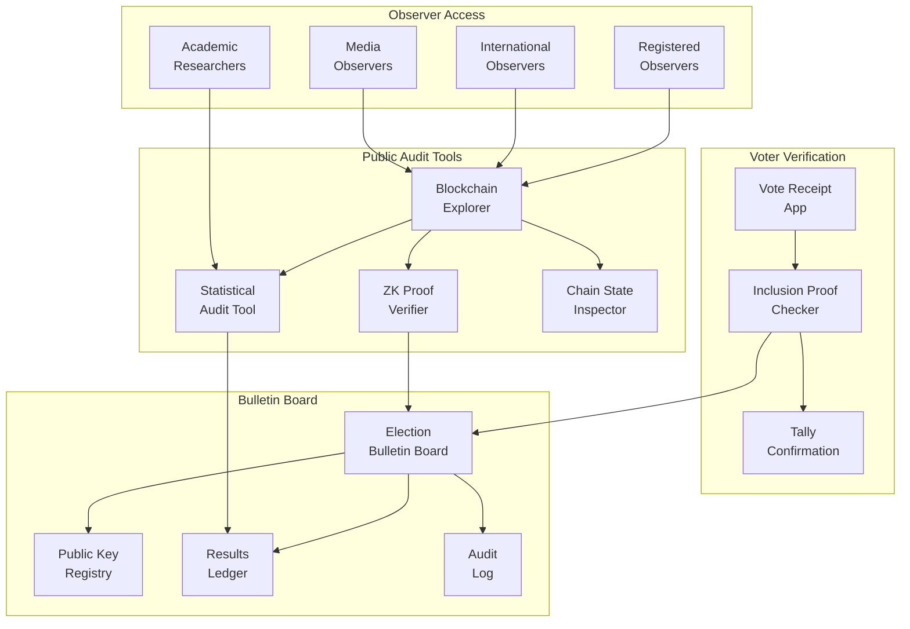
```mermaid
graph TB
    subgraph "Voter Verification"
        VR[Vote Receipt<br/>App]
        IP[Inclusion Proof<br/>Checker]
        TC[Tally<br/>Confirmation]
    end

    subgraph "Public Audit Tools"
        BE[Blockchain<br/>Explorer]
        ZKV[ZK Proof<br/>Verifier]
        SA[Statistical<br/>Audit Tool]
        CS[Chain State<br/>Inspector]
    end

    subgraph "Bulletin Board"
        EB[Election<br/>Bulletin Board]
        PK[Public Key<br/>Registry]
        RL[Results<br/>Ledger]
        AL[Audit<br/>Log]
    end

    subgraph "Observer Access"
        RO[Registered<br/>Observers]
        IO[International<br/>Observers]
        MO[Media<br/>Observers]
        AC[Academic<br/>Researchers]
    end

    VR --> IP
    IP --> TC

    BE --> ZKV
    BE --> SA
    BE --> CS

    EB --> PK
    EB --> RL
    EB --> AL

    RO --> BE
    IO --> BE
    MO --> BE
    AC --> SA

    IP --> EB
    ZKV --> EB
    SA --> RL
```

### Vote Receipt Verification

```
Receipt Generation (at vote casting time):
  1. Voter casts encrypted vote c with commitment comm
  2. Smart contract includes vote in Merkle tree
  3. Smart contract returns receipt R:
     R = {
       commitment: comm,
       voteIndex: idx,
       merkleRoot: root_at_time,
       blockNumber: block_num,
       transactionHash: tx_hash,
       timestamp: ts
     }
  4. Receipt is stored on voter's device (encrypted)

Receipt Verification (post-election):
  1. Voter opens verification app
  2. App retrieves current vote Merkle root from blockchain
  3. App requests inclusion proof for commitment from on-chain data
  4. Verification:
     a. Check that commitment is in the Merkle tree (inclusion proof)
     b. Check that the Merkle root matches blockchain state
     c. Check that the transaction hash is valid and confirmed
     d. Check that the block is part of the canonical chain
  5. Display result: "Your vote was included in the final tally"

Privacy Guarantee:
  - The receipt DOES NOT reveal the voter's choice
  - The commitment is cryptographic — it proves inclusion without revealing content
  - Even if someone sees the receipt, they cannot determine the vote
  - This provides receipt-freeness (voter cannot prove to a coercer how they voted)
```

### Blockchain Explorer Features

```
Election Dashboard:
  - Total registered voters
  - Total votes cast (real-time during election)
  - Participation rate by jurisdiction
  - Voting timeline (votes per hour)
  - Smart contract addresses and verification status
  - Current election phase

Vote Explorer:
  - Browse all encrypted votes (anonymized)
  - Verify ZK proofs for any vote
  - Check vote inclusion in Merkle tree
  - View vote submission timestamps and blocks
  - Verify no votes were modified post-submission

Results Explorer:
  - View tally results per race
  - Verify tally ZK proofs
  - Compare encrypted sum to decrypted result
  - Verify trustee partial decryptions
  - View threshold ceremony log

Audit Tools:
  - Download complete election dataset
  - Run independent verification scripts
  - Statistical analysis tools
  - Compare participation patterns to historical data
  - Cross-reference with voter registration data (aggregated)
```

### Auditor Access Levels

```
Level 1: Public Access (anyone)
  - View all on-chain data
  - Verify ZK proofs
  - View election results
  - Check vote inclusion proofs
  - View participation statistics

Level 2: Registered Observer
  - All Level 1 access
  - Real-time election monitoring dashboard
  - Anomaly detection alerts
  - API access for automated monitoring
  - Attendance at key ceremonies (virtual)

Level 3: Accredited Auditor
  - All Level 2 access
  - Access to off-chain audit logs
  - Paper trail inspection (supervised)
  - System architecture documentation
  - Source code access for review
  - Security audit participation

Level 4: Election Official
  - All Level 3 access
  - Administrative configuration review
  - Voter registration database (aggregated, anonymized)
  - Incident response logs
  - Infrastructure monitoring dashboards
```

---

## Data Models

### Complete Solidity Data Model Summary

```solidity
// Core on-chain data structures

struct Election {
    bytes32 electionId;
    string name;
    string jurisdiction;
    uint256 registrationStart;
    uint256 registrationEnd;
    uint256 votingStart;
    uint256 votingEnd;
    uint256 tallyDeadline;
    ElectionPhase phase;
    address voteVault;
    address ballotFactory;
    bytes32 merkleRootVoters;
    uint256 totalVotesCast;
    bool resultsPublished;
    bytes32 resultsHash;
}

struct EncryptedVote {
    bytes encryptedBallot;
    bytes zkProof;
    bytes32 nullifier;
    bytes32 commitment;
    uint256 timestamp;
    uint256 blockNumber;
}

struct TallyResult {
    bytes32 electionId;
    bytes32 raceId;
    uint256[] candidateTallies;
    uint256 totalVotes;
    uint256 blankVotes;
    bytes tallyProof;
    bytes32 encryptedTallyHash;
    bool verified;
}

struct TrusteeDecryption {
    address trustee;
    bytes partialDecryption;
    bytes decryptionProof;
    uint256 timestamp;
    bool verified;
}
```

### Complete PostgreSQL Schema (Off-Chain)

```sql
-- Session management
CREATE TABLE voter_sessions (
    session_id          UUID PRIMARY KEY DEFAULT gen_random_uuid(),
    voter_did_hash      BYTEA NOT NULL,  -- H(DID), not the DID itself
    election_id         UUID NOT NULL REFERENCES elections(election_id),

    -- Device info (hashed for privacy)
    device_hash         BYTEA NOT NULL,
    device_attestation  BYTEA,

    -- Session lifecycle
    created_at          TIMESTAMPTZ NOT NULL DEFAULT NOW(),
    expires_at          TIMESTAMPTZ NOT NULL,
    authenticated_at    TIMESTAMPTZ,
    vote_submitted_at   TIMESTAMPTZ,

    -- Status
    status              VARCHAR(20) NOT NULL DEFAULT 'created',
    -- created, authenticated, voting, submitted, expired, revoked

    -- Security
    ip_hash             BYTEA,
    geo_region          VARCHAR(10),  -- coarse location only

    CONSTRAINT valid_expiry CHECK (expires_at > created_at)
);

-- Vote submission tracking (links session to on-chain vote, one-way)
CREATE TABLE vote_submissions (
    submission_id       UUID PRIMARY KEY DEFAULT gen_random_uuid(),
    session_id          UUID NOT NULL REFERENCES voter_sessions(session_id),
    election_id         UUID NOT NULL REFERENCES elections(election_id),

    -- On-chain reference
    tx_hash             VARCHAR(66) NOT NULL,
    block_number        BIGINT,
    vote_index          BIGINT,
    commitment_hash     BYTEA NOT NULL,

    -- Receipt
    receipt_data        BYTEA NOT NULL,  -- encrypted receipt
    receipt_hash        BYTEA NOT NULL,

    -- Status
    status              VARCHAR(20) NOT NULL DEFAULT 'pending',
    -- pending, confirmed, failed, invalidated
    confirmed_at        TIMESTAMPTZ,

    created_at          TIMESTAMPTZ NOT NULL DEFAULT NOW()
);

-- Audit trail (append-only)
CREATE TABLE audit_log (
    log_id              BIGSERIAL PRIMARY KEY,
    event_type          VARCHAR(50) NOT NULL,
    entity_type         VARCHAR(50) NOT NULL,
    entity_id           UUID,

    actor_type          VARCHAR(20) NOT NULL,
    -- system, admin, voter, auditor, trustee
    actor_id            UUID,

    details             JSONB NOT NULL,
    details_hash        BYTEA NOT NULL,  -- tamper detection

    -- Chain anchoring
    anchored            BOOLEAN NOT NULL DEFAULT FALSE,
    anchor_tx_hash      VARCHAR(66),
    anchor_block        BIGINT,

    created_at          TIMESTAMPTZ NOT NULL DEFAULT NOW()
);

-- Election results cache (denormalized from blockchain)
CREATE TABLE election_results (
    result_id           UUID PRIMARY KEY DEFAULT gen_random_uuid(),
    election_id         UUID NOT NULL REFERENCES elections(election_id),
    race_id             UUID NOT NULL REFERENCES races(race_id),

    -- Results
    candidate_tallies   JSONB NOT NULL,
    total_votes         BIGINT NOT NULL,
    blank_votes         BIGINT NOT NULL,

    -- Verification
    tally_proof_hash    BYTEA NOT NULL,
    verified_on_chain   BOOLEAN NOT NULL DEFAULT FALSE,

    -- Metadata
    computed_at         TIMESTAMPTZ NOT NULL,
    published_at        TIMESTAMPTZ,
    certified_at        TIMESTAMPTZ,

    UNIQUE(election_id, race_id)
);

-- Observer/Auditor registrations
CREATE TABLE observers (
    observer_id         UUID PRIMARY KEY DEFAULT gen_random_uuid(),
    election_id         UUID NOT NULL REFERENCES elections(election_id),

    name                VARCHAR(256) NOT NULL,
    organization        VARCHAR(256),
    access_level        INTEGER NOT NULL DEFAULT 1,

    -- Credentials
    api_key_hash        BYTEA,
    certificate_hash    BYTEA,

    -- Status
    status              VARCHAR(20) NOT NULL DEFAULT 'pending',
    approved_by         UUID,
    approved_at         TIMESTAMPTZ,

    created_at          TIMESTAMPTZ NOT NULL DEFAULT NOW()
);

-- Performance metrics (time-series)
CREATE TABLE election_metrics (
    metric_id           BIGSERIAL PRIMARY KEY,
    election_id         UUID NOT NULL REFERENCES elections(election_id),

    metric_name         VARCHAR(100) NOT NULL,
    metric_value        DOUBLE PRECISION NOT NULL,

    jurisdiction_id     UUID REFERENCES jurisdictions(jurisdiction_id),

    recorded_at         TIMESTAMPTZ NOT NULL DEFAULT NOW()
);

-- Create time-series hypertable (if using TimescaleDB)
-- SELECT create_hypertable('election_metrics', 'recorded_at');
```

### Indexes

```sql
-- Voter sessions
CREATE INDEX idx_voter_sessions_election ON voter_sessions(election_id);
CREATE INDEX idx_voter_sessions_status ON voter_sessions(status);
CREATE INDEX idx_voter_sessions_created ON voter_sessions(created_at);

-- Vote submissions
CREATE INDEX idx_vote_submissions_election ON vote_submissions(election_id);
CREATE INDEX idx_vote_submissions_tx ON vote_submissions(tx_hash);
CREATE INDEX idx_vote_submissions_commitment ON vote_submissions(commitment_hash);
CREATE INDEX idx_vote_submissions_status ON vote_submissions(status);

-- Audit log
CREATE INDEX idx_audit_log_event ON audit_log(event_type);
CREATE INDEX idx_audit_log_entity ON audit_log(entity_type, entity_id);
CREATE INDEX idx_audit_log_created ON audit_log(created_at);
CREATE INDEX idx_audit_log_unanchored ON audit_log(anchored) WHERE anchored = FALSE;

-- Election results
CREATE INDEX idx_election_results_election ON election_results(election_id);

-- Metrics
CREATE INDEX idx_metrics_election_name ON election_metrics(election_id, metric_name);
CREATE INDEX idx_metrics_time ON election_metrics(recorded_at DESC);

-- Voters
CREATE INDEX idx_voters_jurisdiction ON voters(state_code, county_fips, precinct_id);
CREATE INDEX idx_voters_status ON voters(status);
CREATE INDEX idx_voters_did ON voters(did_uri) WHERE did_uri IS NOT NULL;

-- Jurisdictions
CREATE INDEX idx_jurisdictions_parent ON jurisdictions(parent_id);
CREATE INDEX idx_jurisdictions_level ON jurisdictions(level);
CREATE INDEX idx_jurisdictions_code ON jurisdictions(code);
```

---

## API Design

### Authentication APIs

```yaml
# Voter Registration
POST /api/v1/auth/register
  Request:
    Content-Type: multipart/form-data
    Body:
      government_id_image: File (front + back)
      selfie_image: File
      fingerprint_template: Binary (ISO 19794-2)
      personal_info:
        full_name: string
        date_of_birth: string (YYYY-MM-DD)
        address: object
        jurisdiction_code: string
  Response:
    201 Created:
      voter_id: UUID
      status: "pending_verification"
      estimated_verification_time: "24 hours"
    409 Conflict:
      error: "ALREADY_REGISTERED"

# Biometric Authentication
POST /api/v1/auth/authenticate
  Request:
    Body:
      election_id: UUID
      biometric_data:
        face_image: Base64
        fingerprint: Base64
        liveness_proof: object
      device_attestation: object
  Response:
    200 OK:
      session_token: JWT
      expires_at: ISO8601
      election_info:
        ballot_id: UUID
        jurisdiction: string
    401 Unauthorized:
      error: "BIOMETRIC_MISMATCH" | "LIVENESS_FAILED"
    403 Forbidden:
      error: "NOT_ELIGIBLE" | "CREDENTIAL_REVOKED"

# Anonymous Credential Request
POST /api/v1/auth/credential
  Request:
    Headers:
      Authorization: Bearer <session_token>
    Body:
      blinded_token: Base64
      election_id: UUID
  Response:
    200 OK:
      blind_signature: Base64
      credential_hash: string
    429 Too Many Requests:
      error: "CREDENTIAL_ALREADY_ISSUED"
```

### Vote Casting APIs

```yaml
# Get Ballot
GET /api/v1/elections/{election_id}/ballot
  Request:
    Headers:
      Authorization: Bearer <session_token>
    Query:
      language: string (default: "en")
      format: "json" | "rendered"
  Response:
    200 OK:
      ballot_id: UUID
      jurisdiction: string
      races:
        - race_id: UUID
          title: string
          description: string
          voting_method: string
          max_selections: integer
          candidates:
            - candidate_id: UUID
              name: string
              party: string
              position: integer
      content_hash: string
      ipfs_url: string

# Submit Vote
POST /api/v1/elections/{election_id}/vote
  Request:
    Headers:
      Authorization: Bearer <anonymous_credential>
    Body:
      encrypted_ballot: Base64
      zk_proof: Base64
      nullifier: string (hex)
      commitment: string (hex)
      voter_merkle_proof: string[] (hex)
      voter_leaf: string (hex)
  Response:
    202 Accepted:
      submission_id: UUID
      status: "pending_confirmation"
      estimated_confirmation: "30 seconds"
    200 OK (after confirmation):
      submission_id: UUID
      status: "confirmed"
      receipt:
        commitment: string
        vote_index: integer
        merkle_root: string
        block_number: integer
        tx_hash: string
        timestamp: ISO8601
    400 Bad Request:
      error: "INVALID_ZK_PROOF" | "INVALID_MERKLE_PROOF"
    409 Conflict:
      error: "NULLIFIER_ALREADY_USED"
    503 Service Unavailable:
      error: "BLOCKCHAIN_CONGESTION"
      retry_after: integer (seconds)

# Check Vote Status
GET /api/v1/elections/{election_id}/vote/{submission_id}/status
  Response:
    200 OK:
      status: "pending" | "confirmed" | "failed"
      confirmations: integer
      receipt: object (if confirmed)
```

### Verification APIs

```yaml
# Verify Vote Receipt
POST /api/v1/verify/receipt
  Request:
    Body:
      election_id: UUID
      commitment: string (hex)
  Response:
    200 OK:
      included: boolean
      inclusion_proof:
        merkle_proof: string[]
        merkle_root: string
        leaf_index: integer
      block_number: integer
      tally_included: boolean

# Get Election Results
GET /api/v1/elections/{election_id}/results
  Response:
    200 OK:
      election_id: UUID
      status: "preliminary" | "certified"
      races:
        - race_id: UUID
          title: string
          results:
            - candidate_id: UUID
              name: string
              votes: integer
              percentage: float
          total_votes: integer
          blank_votes: integer
          tally_proof_hash: string
      verification:
        tally_verified: boolean
        proof_url: string
        verifier_contract: string

# Verify Tally Proof
POST /api/v1/verify/tally
  Request:
    Body:
      election_id: UUID
      race_id: UUID
  Response:
    200 OK:
      verified: boolean
      proof_details:
        encrypted_sum_hash: string
        decrypted_result: integer[]
        proof_valid: boolean
        trustee_decryptions: integer
        threshold_met: boolean

# Get Audit Data
GET /api/v1/elections/{election_id}/audit
  Request:
    Headers:
      Authorization: Bearer <observer_token>
    Query:
      data_type: "votes" | "proofs" | "tally" | "logs"
      format: "json" | "csv" | "binary"
      page: integer
      page_size: integer
  Response:
    200 OK:
      data: array
      pagination:
        page: integer
        total_pages: integer
        total_records: integer
      integrity:
        data_hash: string
        blockchain_anchor: string
```

### Administration APIs

```yaml
# Create Election
POST /api/v1/admin/elections
  Request:
    Headers:
      Authorization: Bearer <admin_token>
      X-Multi-Sig: <signatures>
    Body:
      name: string
      election_type: string
      jurisdiction: string
      schedule:
        registration_start: ISO8601
        registration_end: ISO8601
        voting_start: ISO8601
        voting_end: ISO8601
        tally_deadline: ISO8601
      cryptographic_params:
        encryption_scheme: "paillier"
        key_size: 2048
        trustee_threshold: 5
        trustee_count: 9
  Response:
    201 Created:
      election_id: UUID
      contract_address: string
      status: "draft"

# Emergency Actions
POST /api/v1/admin/elections/{election_id}/emergency
  Request:
    Headers:
      Authorization: Bearer <admin_token>
      X-Multi-Sig: <signatures>  # Requires 3-of-5 admin signatures
    Body:
      action: "pause" | "resume" | "extend" | "cancel"
      reason: string
      extension_minutes: integer (for "extend")
      affected_jurisdictions: string[] (optional)
  Response:
    200 OK:
      event_id: UUID
      action_taken: string
      effective_at: ISO8601
      blockchain_tx: string
```

---

## Indexing Strategy

### On-Chain Indexing

```
The Graph Protocol Subgraph:

subgraph.yaml:
  dataSources:
    - kind: ethereum/contract
      name: ElectionManager
      source:
        address: "0x..."
        abi: ElectionManager
        startBlock: 18000000
      mapping:
        eventHandlers:
          - event: ElectionCreated(indexed bytes32,string,string)
            handler: handleElectionCreated
          - event: PhaseTransition(indexed bytes32,uint8,uint8)
            handler: handlePhaseTransition
          - event: VoteCast(indexed bytes32,uint256)
            handler: handleVoteCast
          - event: ResultsPublished(indexed bytes32,bytes32)
            handler: handleResultsPublished
    - kind: ethereum/contract
      name: VoteVault
      source:
        abi: VoteVault
      mapping:
        eventHandlers:
          - event: VoteSubmitted(indexed uint256,bytes32,bytes32,uint256)
            handler: handleVoteSubmitted
          - event: MerkleRootUpdated(bytes32,uint256)
            handler: handleMerkleRootUpdated
    - kind: ethereum/contract
      name: TallyVerifier
      source:
        abi: TallyVerifier
      mapping:
        eventHandlers:
          - event: TallySubmitted(indexed bytes32,indexed bytes32)
            handler: handleTallySubmitted
          - event: TallyVerified(indexed bytes32,indexed bytes32)
            handler: handleTallyVerified

Indexed Entities:
  - Election (id, name, phase, voteCount, timestamps)
  - Vote (index, commitment, nullifier, timestamp, block)
  - Race (id, electionId, title, candidates)
  - TallyResult (raceId, tallies, verified, proofHash)
  - PhaseTransition (electionId, fromPhase, toPhase, timestamp)
```

### Off-Chain Indexing

```sql
-- PostgreSQL full-text search for election content
CREATE INDEX idx_elections_fts ON elections
  USING gin(to_tsvector('english', name));

CREATE INDEX idx_races_fts ON races
  USING gin(to_tsvector('english', title || ' ' || COALESCE(description, '')));

-- Partial indexes for active elections
CREATE INDEX idx_active_elections ON elections(election_day_start)
  WHERE status = 'active';

-- Composite indexes for common queries
CREATE INDEX idx_votes_by_jurisdiction ON vote_submissions(election_id, session_id)
  INCLUDE (status, created_at);

-- BRIN indexes for time-series data
CREATE INDEX idx_audit_log_brin ON audit_log
  USING brin(created_at) WITH (pages_per_range = 128);

CREATE INDEX idx_metrics_brin ON election_metrics
  USING brin(recorded_at) WITH (pages_per_range = 128);
```

---

## Caching Strategy

### Cache Architecture

```
Layer 1: CDN (Cloudflare/Akamai)
  - Static ballot content (HTML/CSS/JS)
  - Candidate photos and statements
  - Election information pages
  - TTL: 1 hour (invalidated on ballot changes)

Layer 2: Application Cache (Redis Cluster)
  - Voter session tokens (TTL: 30 minutes)
  - Ballot definitions per jurisdiction (TTL: 1 hour)
  - Real-time vote count (updated per block)
  - Election phase status (TTL: 10 seconds)
  - Rate limiting counters (sliding window)

Layer 3: Local Cache (In-Process)
  - Blockchain connection state
  - Smart contract ABIs
  - Cryptographic parameters
  - TTL: Application lifetime

Cache Invalidation Strategy:
  - Election phase changes: immediate invalidation via pub/sub
  - Vote count: eventually consistent (2-block delay)
  - Ballot content: versioned with content hash
  - Session tokens: strict TTL, no extension
```

### Redis Schema

```
# Session cache
session:{session_id}           -> JSON (voter context, TTL: 30m)
session:rate:{ip_hash}         -> Counter (TTL: 1m, max: 10/min)

# Election state
election:{id}:phase            -> String (TTL: 10s)
election:{id}:vote_count       -> Integer (updated on each block)
election:{id}:participation    -> Hash (jurisdiction -> count)

# Ballot cache
ballot:{election_id}:{jurisdiction}:{lang} -> JSON (TTL: 1h)

# Verification cache
verification:{commitment}      -> JSON (inclusion proof, TTL: 24h)

# Rate limiting
ratelimit:auth:{device_hash}   -> Counter (TTL: 1h, max: 5)
ratelimit:vote:{token_hash}    -> Counter (TTL: election_duration, max: 1)

# Real-time metrics
metrics:votes_per_minute       -> Sorted set (timestamp -> count)
metrics:auth_per_minute        -> Sorted set (timestamp -> count)
```

---

## Queue Architecture

### Message Queue Design

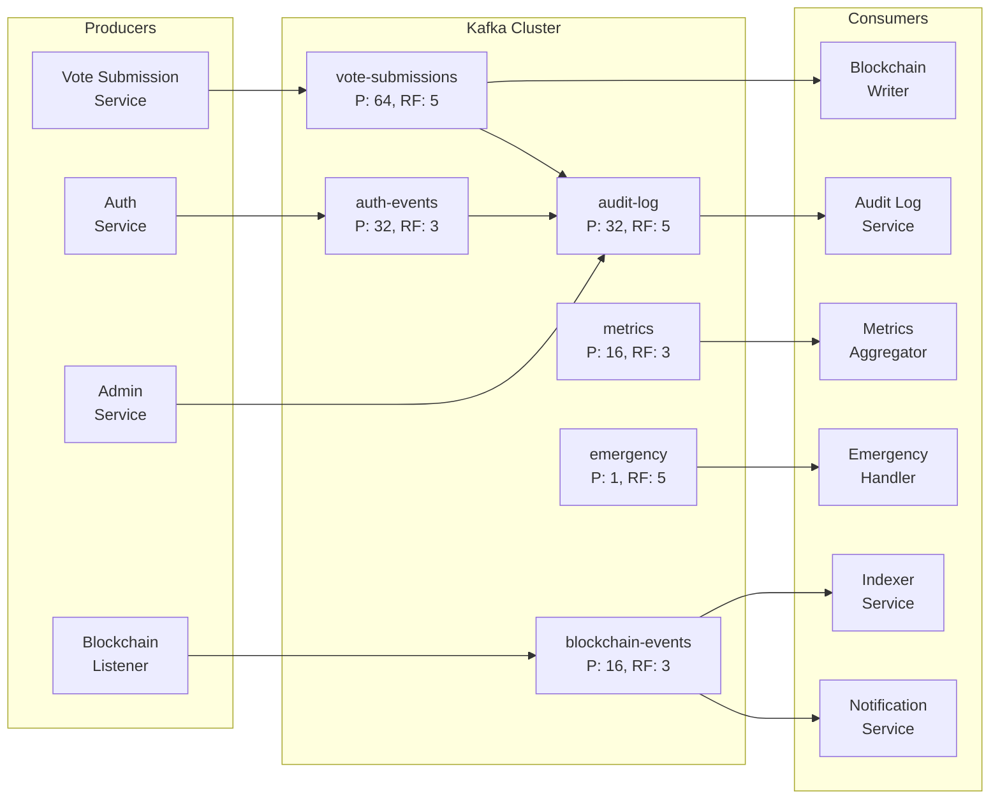
```mermaid
graph LR
    subgraph "Producers"
        VS[Vote Submission<br/>Service]
        AS[Auth<br/>Service]
        AD[Admin<br/>Service]
        BC[Blockchain<br/>Listener]
    end

    subgraph "Kafka Cluster"
        VT[vote-submissions<br/>P: 64, RF: 5]
        AT[auth-events<br/>P: 32, RF: 3]
        BT[blockchain-events<br/>P: 16, RF: 3]
        AL[audit-log<br/>P: 32, RF: 5]
        MT[metrics<br/>P: 16, RF: 3]
        EM[emergency<br/>P: 1, RF: 5]
    end

    subgraph "Consumers"
        BCW[Blockchain<br/>Writer]
        IDX[Indexer<br/>Service]
        ALS[Audit Log<br/>Service]
        MTS[Metrics<br/>Aggregator]
        NTS[Notification<br/>Service]
        EMS[Emergency<br/>Handler]
    end

    VS --> VT
    AS --> AT
    AD --> AL
    BC --> BT

    VT --> BCW
    VT --> AL
    BT --> IDX
    AT --> AL
    AL --> ALS
    MT --> MTS
    BT --> NTS
    EM --> EMS
```

### Topic Configuration

```
vote-submissions:
  Partitions: 64 (keyed by nullifier hash for ordering)
  Replication Factor: 5 (maximum durability)
  Retention: 90 days
  Cleanup Policy: delete
  Min ISR: 3
  Max Message Size: 64KB
  Compression: zstd

  Consumer Groups:
    - blockchain-writer (exactly-once semantics)
    - audit-logger (at-least-once)
    - metrics-collector (at-most-once acceptable)

auth-events:
  Partitions: 32
  Replication Factor: 3
  Retention: 30 days

blockchain-events:
  Partitions: 16 (keyed by block number)
  Replication Factor: 3
  Retention: indefinite (compacted)

audit-log:
  Partitions: 32
  Replication Factor: 5 (critical for compliance)
  Retention: 7 years

emergency:
  Partitions: 1 (strict ordering)
  Replication Factor: 5
  Retention: indefinite
  Priority: highest
```

### Dead Letter Queue Strategy

```
DLQ Configuration:
  - vote-submissions-dlq: max 3 retries, then manual review
  - auth-events-dlq: max 5 retries with exponential backoff
  - blockchain-events-dlq: max 10 retries (blockchain may be temporarily unavailable)

Retry Policy:
  Attempt 1: immediate
  Attempt 2: 1 second delay
  Attempt 3: 5 seconds delay
  Attempt 4+: 30 seconds delay (exponential cap)

  After max retries:
    - Route to DLQ
    - Alert on-call engineer
    - For vote submissions: hold in pending state, do NOT discard
    - For auth events: session remains in last valid state
```

---

## State Machines

### Election Lifecycle State Machine

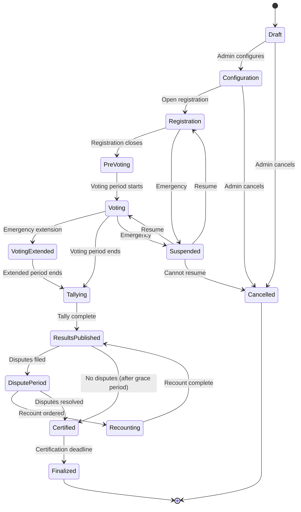
```mermaid
stateDiagram-v2
    [*] --> Draft
    Draft --> Configuration: Admin configures
    Configuration --> Registration: Open registration
    Registration --> PreVoting: Registration closes
    PreVoting --> Voting: Voting period starts
    Voting --> VotingExtended: Emergency extension
    VotingExtended --> Tallying: Extended period ends
    Voting --> Tallying: Voting period ends
    Tallying --> ResultsPublished: Tally complete
    ResultsPublished --> DisputePeriod: Disputes filed
    ResultsPublished --> Certified: No disputes (after grace period)
    DisputePeriod --> Recounting: Recount ordered
    Recounting --> ResultsPublished: Recount complete
    DisputePeriod --> Certified: Disputes resolved
    Certified --> Finalized: Certification deadline
    Finalized --> [*]

    Draft --> Cancelled: Admin cancels
    Configuration --> Cancelled: Admin cancels
    Registration --> Suspended: Emergency
    Voting --> Suspended: Emergency
    Suspended --> Registration: Resume
    Suspended --> Voting: Resume
    Suspended --> Cancelled: Cannot resume
    Cancelled --> [*]
```

### Vote Submission State Machine

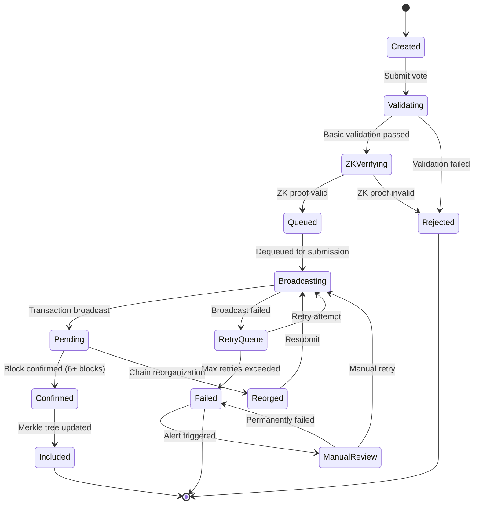
```mermaid
stateDiagram-v2
    [*] --> Created
    Created --> Validating: Submit vote
    Validating --> ZKVerifying: Basic validation passed
    Validating --> Rejected: Validation failed
    ZKVerifying --> Queued: ZK proof valid
    ZKVerifying --> Rejected: ZK proof invalid
    Queued --> Broadcasting: Dequeued for submission
    Broadcasting --> Pending: Transaction broadcast
    Broadcasting --> RetryQueue: Broadcast failed
    RetryQueue --> Broadcasting: Retry attempt
    RetryQueue --> Failed: Max retries exceeded
    Pending --> Confirmed: Block confirmed (6+ blocks)
    Pending --> Reorged: Chain reorganization
    Reorged --> Broadcasting: Resubmit
    Confirmed --> Included: Merkle tree updated
    Included --> [*]
    Rejected --> [*]
    Failed --> ManualReview: Alert triggered
    ManualReview --> Broadcasting: Manual retry
    ManualReview --> Failed: Permanently failed
    Failed --> [*]
```

### Voter Session State Machine

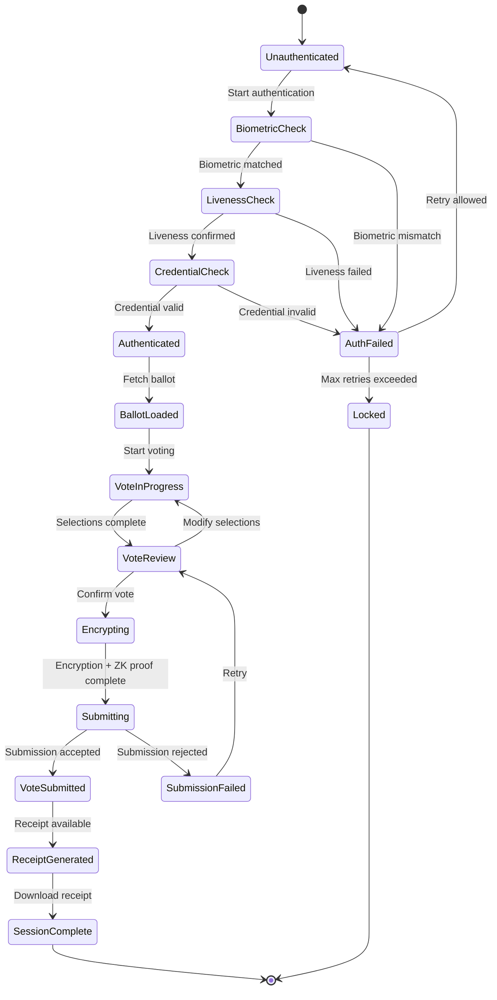
```mermaid
stateDiagram-v2
    [*] --> Unauthenticated
    Unauthenticated --> BiometricCheck: Start authentication
    BiometricCheck --> LivenessCheck: Biometric matched
    BiometricCheck --> AuthFailed: Biometric mismatch
    LivenessCheck --> CredentialCheck: Liveness confirmed
    LivenessCheck --> AuthFailed: Liveness failed
    CredentialCheck --> Authenticated: Credential valid
    CredentialCheck --> AuthFailed: Credential invalid
    AuthFailed --> Unauthenticated: Retry allowed
    AuthFailed --> Locked: Max retries exceeded
    Authenticated --> BallotLoaded: Fetch ballot
    BallotLoaded --> VoteInProgress: Start voting
    VoteInProgress --> VoteReview: Selections complete
    VoteReview --> VoteInProgress: Modify selections
    VoteReview --> Encrypting: Confirm vote
    Encrypting --> Submitting: Encryption + ZK proof complete
    Submitting --> VoteSubmitted: Submission accepted
    Submitting --> SubmissionFailed: Submission rejected
    SubmissionFailed --> VoteReview: Retry
    VoteSubmitted --> ReceiptGenerated: Receipt available
    ReceiptGenerated --> SessionComplete: Download receipt
    SessionComplete --> [*]
    Locked --> [*]
```

### Trustee Decryption State Machine

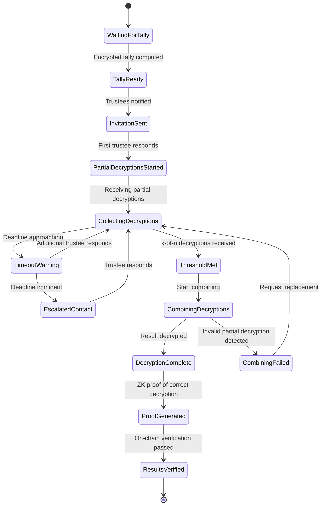
```mermaid
stateDiagram-v2
    [*] --> WaitingForTally
    WaitingForTally --> TallyReady: Encrypted tally computed
    TallyReady --> InvitationSent: Trustees notified
    InvitationSent --> PartialDecryptionsStarted: First trustee responds
    PartialDecryptionsStarted --> CollectingDecryptions: Receiving partial decryptions
    CollectingDecryptions --> ThresholdMet: k-of-n decryptions received
    CollectingDecryptions --> TimeoutWarning: Deadline approaching
    TimeoutWarning --> CollectingDecryptions: Additional trustee responds
    TimeoutWarning --> EscalatedContact: Deadline imminent
    EscalatedContact --> CollectingDecryptions: Trustee responds
    ThresholdMet --> CombiningDecryptions: Start combining
    CombiningDecryptions --> DecryptionComplete: Result decrypted
    CombiningDecryptions --> CombiningFailed: Invalid partial decryption detected
    CombiningFailed --> CollectingDecryptions: Request replacement
    DecryptionComplete --> ProofGenerated: ZK proof of correct decryption
    ProofGenerated --> ResultsVerified: On-chain verification passed
    ResultsVerified --> [*]
```

### Emergency Response State Machine

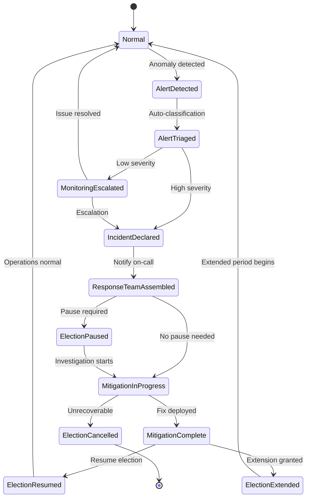
```mermaid
stateDiagram-v2
    [*] --> Normal
    Normal --> AlertDetected: Anomaly detected
    AlertDetected --> AlertTriaged: Auto-classification
    AlertTriaged --> MonitoringEscalated: Low severity
    AlertTriaged --> IncidentDeclared: High severity
    MonitoringEscalated --> Normal: Issue resolved
    MonitoringEscalated --> IncidentDeclared: Escalation
    IncidentDeclared --> ResponseTeamAssembled: Notify on-call
    ResponseTeamAssembled --> ElectionPaused: Pause required
    ResponseTeamAssembled --> MitigationInProgress: No pause needed
    ElectionPaused --> MitigationInProgress: Investigation starts
    MitigationInProgress --> MitigationComplete: Fix deployed
    MitigationComplete --> ElectionResumed: Resume election
    MitigationComplete --> ElectionExtended: Extension granted
    ElectionResumed --> Normal: Operations normal
    ElectionExtended --> Normal: Extended period begins
    MitigationInProgress --> ElectionCancelled: Unrecoverable
    ElectionCancelled --> [*]
```

---

## Sequence Diagrams

### Voter Registration Sequence

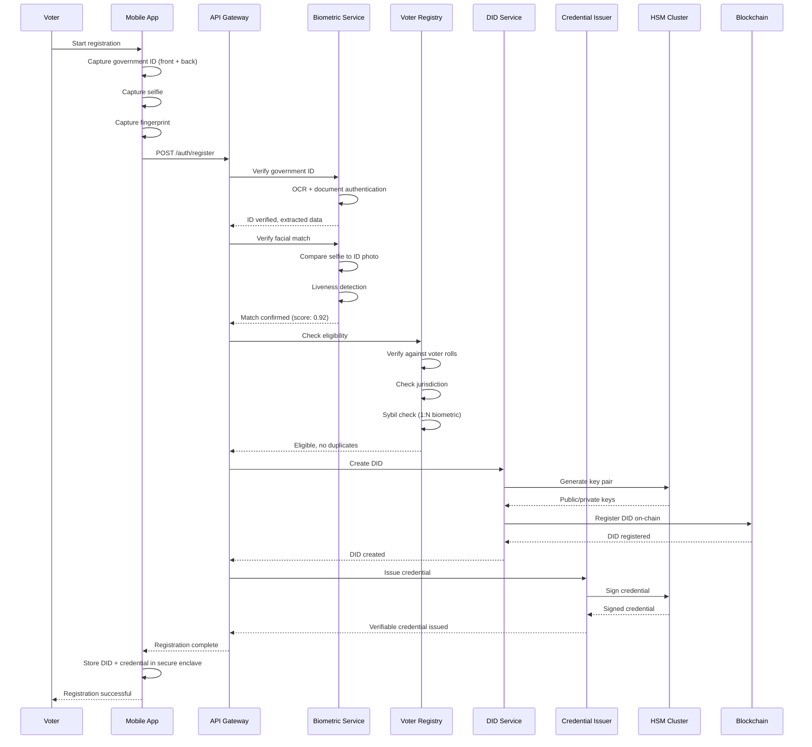
```mermaid
sequenceDiagram
    participant V as Voter
    participant App as Mobile App
    participant AG as API Gateway
    participant Bio as Biometric Service
    participant VR as Voter Registry
    participant DID as DID Service
    participant AC as Credential Issuer
    participant HSM as HSM Cluster
    participant BC as Blockchain

    V->>App: Start registration
    App->>App: Capture government ID (front + back)
    App->>App: Capture selfie
    App->>App: Capture fingerprint

    App->>AG: POST /auth/register
    AG->>Bio: Verify government ID
    Bio->>Bio: OCR + document authentication
    Bio-->>AG: ID verified, extracted data

    AG->>Bio: Verify facial match
    Bio->>Bio: Compare selfie to ID photo
    Bio->>Bio: Liveness detection
    Bio-->>AG: Match confirmed (score: 0.92)

    AG->>VR: Check eligibility
    VR->>VR: Verify against voter rolls
    VR->>VR: Check jurisdiction
    VR->>VR: Sybil check (1:N biometric)
    VR-->>AG: Eligible, no duplicates

    AG->>DID: Create DID
    DID->>HSM: Generate key pair
    HSM-->>DID: Public/private keys
    DID->>BC: Register DID on-chain
    BC-->>DID: DID registered
    DID-->>AG: DID created

    AG->>AC: Issue credential
    AC->>HSM: Sign credential
    HSM-->>AC: Signed credential
    AC-->>AG: Verifiable credential issued

    AG-->>App: Registration complete
    App->>App: Store DID + credential in secure enclave
    App-->>V: Registration successful
```

### Vote Casting Sequence

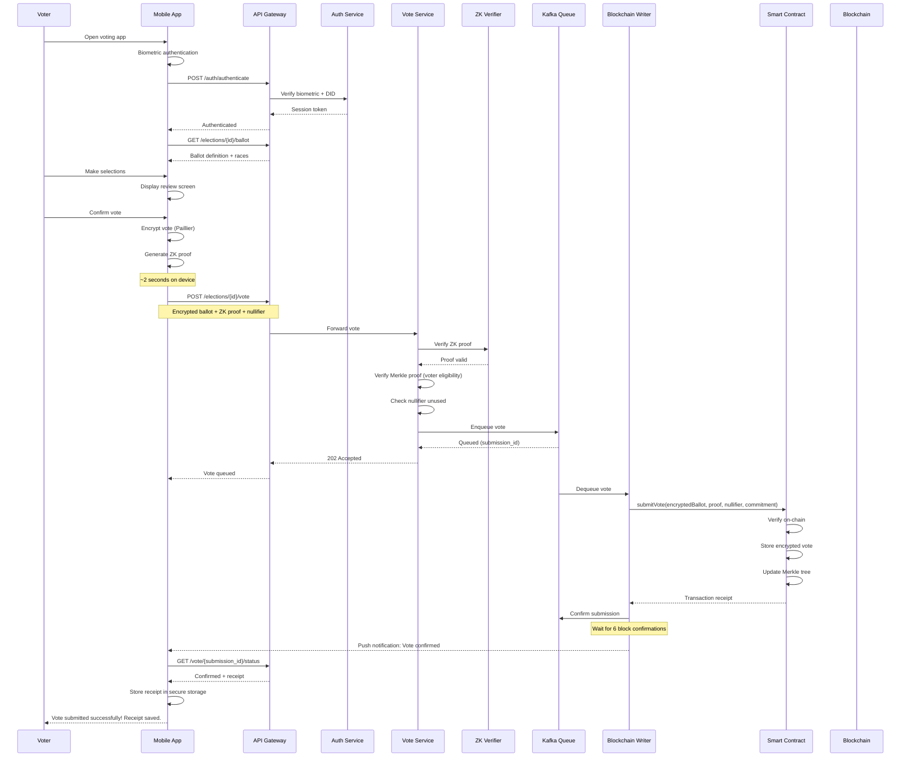
```mermaid
sequenceDiagram
    participant V as Voter
    participant App as Mobile App
    participant AG as API Gateway
    participant Auth as Auth Service
    participant VS as Vote Service
    participant ZK as ZK Verifier
    participant Q as Kafka Queue
    participant BCW as Blockchain Writer
    participant SC as Smart Contract
    participant BC as Blockchain

    V->>App: Open voting app
    App->>App: Biometric authentication
    App->>AG: POST /auth/authenticate
    AG->>Auth: Verify biometric + DID
    Auth-->>AG: Session token
    AG-->>App: Authenticated

    App->>AG: GET /elections/{id}/ballot
    AG-->>App: Ballot definition + races

    V->>App: Make selections
    App->>App: Display review screen
    V->>App: Confirm vote

    App->>App: Encrypt vote (Paillier)
    App->>App: Generate ZK proof
    Note over App: ~2 seconds on device

    App->>AG: POST /elections/{id}/vote
    Note over App,AG: Encrypted ballot + ZK proof + nullifier

    AG->>VS: Forward vote
    VS->>ZK: Verify ZK proof
    ZK-->>VS: Proof valid
    VS->>VS: Verify Merkle proof (voter eligibility)
    VS->>VS: Check nullifier unused

    VS->>Q: Enqueue vote
    Q-->>VS: Queued (submission_id)
    VS-->>AG: 202 Accepted
    AG-->>App: Vote queued

    Q->>BCW: Dequeue vote
    BCW->>SC: submitVote(encryptedBallot, proof, nullifier, commitment)
    SC->>SC: Verify on-chain
    SC->>SC: Store encrypted vote
    SC->>SC: Update Merkle tree
    SC-->>BCW: Transaction receipt

    BCW->>Q: Confirm submission
    Note over BCW: Wait for 6 block confirmations
    BCW-->>App: Push notification: Vote confirmed

    App->>AG: GET /vote/{submission_id}/status
    AG-->>App: Confirmed + receipt
    App->>App: Store receipt in secure storage
    App-->>V: Vote submitted successfully! Receipt saved.
```

### Tally and Decryption Sequence

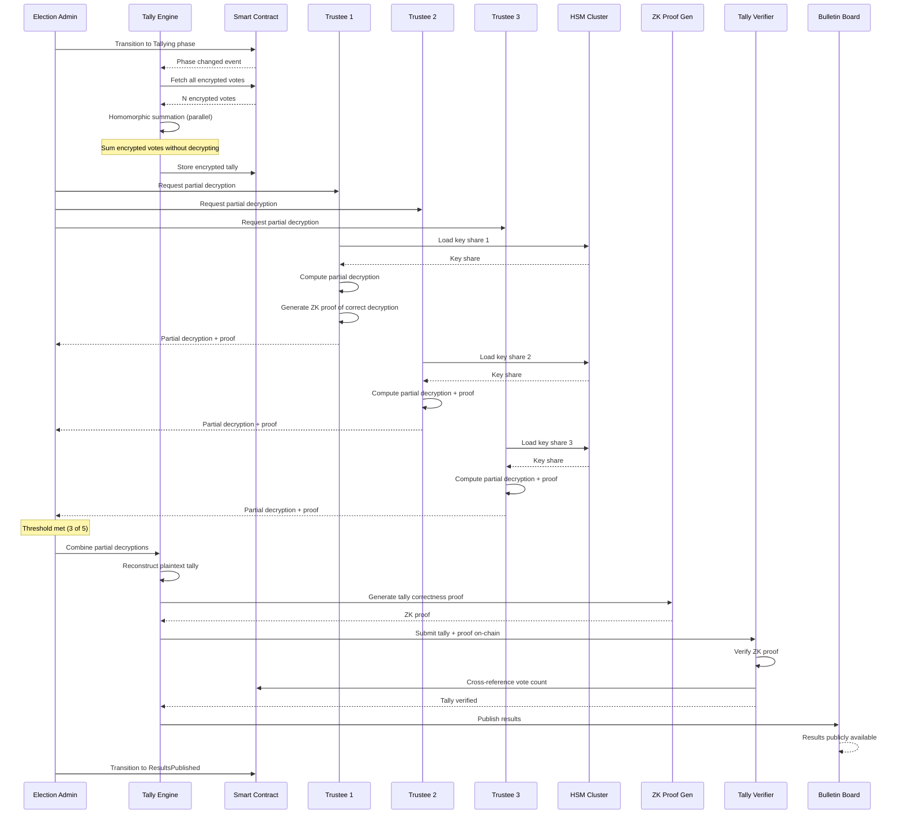
```mermaid
sequenceDiagram
    participant EA as Election Admin
    participant TE as Tally Engine
    participant SC as Smart Contract
    participant T1 as Trustee 1
    participant T2 as Trustee 2
    participant T3 as Trustee 3
    participant HSM as HSM Cluster
    participant ZK as ZK Proof Gen
    participant TV as Tally Verifier
    participant BB as Bulletin Board

    EA->>SC: Transition to Tallying phase
    SC-->>TE: Phase changed event

    TE->>SC: Fetch all encrypted votes
    SC-->>TE: N encrypted votes

    TE->>TE: Homomorphic summation (parallel)
    Note over TE: Sum encrypted votes without decrypting
    TE->>SC: Store encrypted tally

    EA->>T1: Request partial decryption
    EA->>T2: Request partial decryption
    EA->>T3: Request partial decryption

    T1->>HSM: Load key share 1
    HSM-->>T1: Key share
    T1->>T1: Compute partial decryption
    T1->>T1: Generate ZK proof of correct decryption
    T1-->>EA: Partial decryption + proof

    T2->>HSM: Load key share 2
    HSM-->>T2: Key share
    T2->>T2: Compute partial decryption + proof
    T2-->>EA: Partial decryption + proof

    T3->>HSM: Load key share 3
    HSM-->>T3: Key share
    T3->>T3: Compute partial decryption + proof
    T3-->>EA: Partial decryption + proof

    Note over EA: Threshold met (3 of 5)
    EA->>TE: Combine partial decryptions
    TE->>TE: Reconstruct plaintext tally
    TE->>ZK: Generate tally correctness proof
    ZK-->>TE: ZK proof

    TE->>TV: Submit tally + proof on-chain
    TV->>TV: Verify ZK proof
    TV->>SC: Cross-reference vote count
    TV-->>TE: Tally verified

    TE->>BB: Publish results
    BB-->>BB: Results publicly available
    EA->>SC: Transition to ResultsPublished
```

### Receipt Verification Sequence

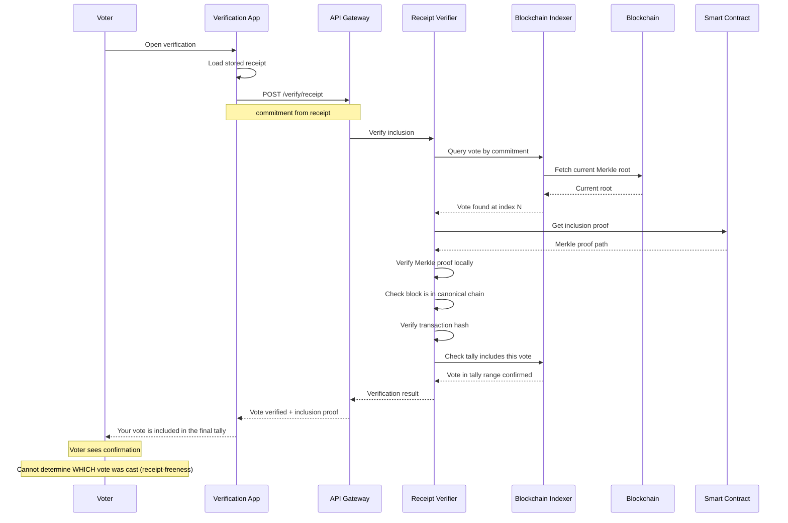
```mermaid
sequenceDiagram
    participant V as Voter
    participant App as Verification App
    participant AG as API Gateway
    participant RV as Receipt Verifier
    participant IDX as Blockchain Indexer
    participant BC as Blockchain
    participant SC as Smart Contract

    V->>App: Open verification
    App->>App: Load stored receipt

    App->>AG: POST /verify/receipt
    Note over App,AG: commitment from receipt

    AG->>RV: Verify inclusion
    RV->>IDX: Query vote by commitment
    IDX->>BC: Fetch current Merkle root
    BC-->>IDX: Current root
    IDX-->>RV: Vote found at index N

    RV->>SC: Get inclusion proof
    SC-->>RV: Merkle proof path

    RV->>RV: Verify Merkle proof locally
    RV->>RV: Check block is in canonical chain
    RV->>RV: Verify transaction hash

    RV->>IDX: Check tally includes this vote
    IDX-->>RV: Vote in tally range confirmed

    RV-->>AG: Verification result
    AG-->>App: Vote verified + inclusion proof
    App-->>V: Your vote is included in the final tally

    Note over V: Voter sees confirmation
    Note over V: Cannot determine WHICH vote was cast (receipt-freeness)
```

### Emergency Pause Sequence

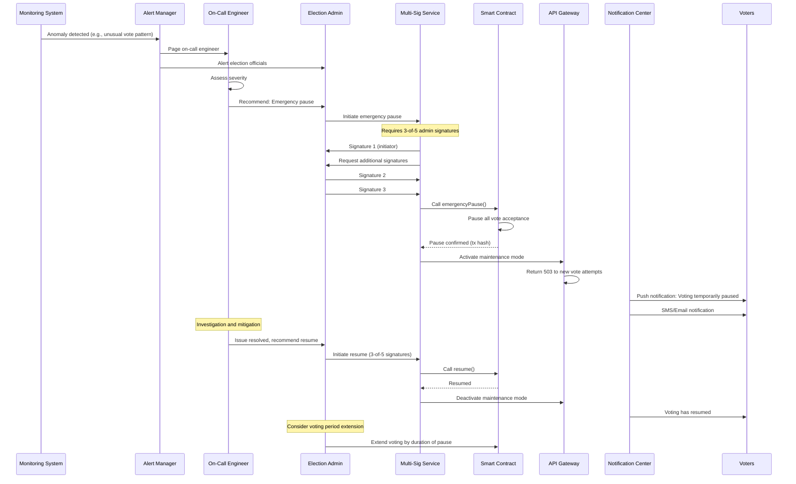
```mermaid
sequenceDiagram
    participant MON as Monitoring System
    participant AL as Alert Manager
    participant OC as On-Call Engineer
    participant EA as Election Admin
    participant MS as Multi-Sig Service
    participant SC as Smart Contract
    participant AG as API Gateway
    participant NC as Notification Center
    participant V as Voters

    MON->>AL: Anomaly detected (e.g., unusual vote pattern)
    AL->>OC: Page on-call engineer
    AL->>EA: Alert election officials

    OC->>OC: Assess severity
    OC->>EA: Recommend: Emergency pause

    EA->>MS: Initiate emergency pause
    Note over MS: Requires 3-of-5 admin signatures

    MS->>EA: Signature 1 (initiator)
    MS->>EA: Request additional signatures
    EA->>MS: Signature 2
    EA->>MS: Signature 3

    MS->>SC: Call emergencyPause()
    SC->>SC: Pause all vote acceptance
    SC-->>MS: Pause confirmed (tx hash)

    MS->>AG: Activate maintenance mode
    AG->>AG: Return 503 to new vote attempts

    NC->>V: Push notification: Voting temporarily paused
    NC->>V: SMS/Email notification

    Note over OC: Investigation and mitigation

    OC->>EA: Issue resolved, recommend resume
    EA->>MS: Initiate resume (3-of-5 signatures)
    MS->>SC: Call resume()
    SC-->>MS: Resumed

    MS->>AG: Deactivate maintenance mode
    NC->>V: Voting has resumed

    Note over EA: Consider voting period extension
    EA->>SC: Extend voting by duration of pause
```

---

## Concurrency Control

### On-Chain Concurrency

```
Blockchain-Level Serialization:
  - Transactions are ordered within blocks
  - Block producers serialize conflicting transactions
  - Nonce-based ordering for same-sender transactions
  - No explicit locking needed for on-chain state

Challenge: High-Throughput Vote Submission
  Problem: 15,000 votes/sec, each a separate transaction

  Solution 1: Transaction Batching
    - Collect votes off-chain in 2-second windows
    - Submit as batch transaction (up to 100 votes per batch)
    - Reduces on-chain transactions to ~150/sec
    - Each batch is atomically committed

  Solution 2: Layer 2 Rollup
    - Use ZK-rollup for vote storage
    - Votes submitted to L2 operator
    - L2 generates validity proof and submits to L1
    - Throughput: 10,000+ TPS on L2
    - Finality: depends on L1 confirmation

  Solution 3: State Channels
    - Open state channels per jurisdiction
    - Votes accumulated in channels
    - Periodic settlement to main chain
    - Suitable for early voting period
```

### Off-Chain Concurrency

```
Database Concurrency Control:

1. Vote Submission Service:
   - Optimistic locking on nullifier check
   - SELECT ... FOR UPDATE on nullifier table
   - Retry on conflict with exponential backoff

2. Session Management:
   - Redis atomic operations (SETNX for session creation)
   - TTL-based session expiry
   - No concurrent sessions per voter per election

3. Audit Log:
   - Append-only (no updates, no deletes)
   - Sequence-guaranteed via Kafka partition ordering
   - No concurrency issues by design

4. Voter Registry:
   - Read-heavy during election (cached)
   - Write-locked during registration period
   - Versioned updates with optimistic concurrency

PostgreSQL Advisory Locks:
  -- Prevent concurrent credential issuance for same voter
  SELECT pg_advisory_xact_lock(hashtext(voter_id || election_id));

  -- Prevent concurrent vote status updates
  SELECT pg_advisory_xact_lock(hashtext(submission_id));
```

### Rate Limiting

```
Rate Limiting Strategy:

Tier 1: Global Rate Limit (per IP)
  - 100 requests/minute for unauthenticated
  - 300 requests/minute for authenticated
  - Token bucket algorithm

Tier 2: Endpoint-Specific Limits
  - Authentication: 5 attempts per device per hour
  - Vote submission: 1 per credential per election (enforced on-chain)
  - Ballot fetch: 10 per session
  - Receipt verification: 20 per hour

Tier 3: DDoS Protection (CDN Level)
  - Geographic rate limiting
  - Bot detection (CAPTCHA for suspicious patterns)
  - IP reputation scoring
  - Layer 7 DDoS mitigation

Implementation:
  Redis sliding window counter:
    MULTI
    ZADD ratelimit:{key} {now} {request_id}
    ZREMRANGEBYSCORE ratelimit:{key} 0 {now - window}
    ZCARD ratelimit:{key}
    EXPIRE ratelimit:{key} {window}
    EXEC
```

---

## Idempotency

### Vote Submission Idempotency

```
Idempotency Guarantee:
  Each voter can cast EXACTLY ONE vote per election.
  The idempotency key is the NULLIFIER (derived from voter secret + election ID).

On-Chain Enforcement:
  mapping(bytes32 => bool) public nullifierUsed;

  require(!nullifierUsed[nullifier], "Vote already cast");
  nullifierUsed[nullifier] = true;

Off-Chain Enforcement:
  1. Before submitting to blockchain:
     - Check nullifier in local cache (Redis)
     - Check nullifier in pending queue (Kafka)
  2. If nullifier already seen:
     - Return existing submission status
     - Do NOT resubmit to blockchain

Idempotent API Response:
  POST /vote with same nullifier:
    First call:  202 Accepted {submission_id: "abc", status: "pending"}
    Second call: 200 OK {submission_id: "abc", status: "confirmed"}

  The response includes the original submission details.
```

### Transaction Replay Protection

```
Blockchain Replay Protection:
  1. Chain ID included in transaction signature (EIP-155)
  2. Nonce strictly incrementing per sender account
  3. Transaction hash uniqueness (content-addressed)

Application-Level Replay Protection:
  1. Idempotency key in HTTP header: X-Idempotency-Key
  2. Server stores (key -> response) mapping in Redis
  3. TTL: duration of election + 7 days
  4. Hash of request body used to detect different payloads with same key

Database-Level:
  CREATE UNIQUE INDEX idx_unique_vote ON vote_submissions(
    election_id,
    commitment_hash
  );

  -- Upsert pattern
  INSERT INTO vote_submissions (...)
  ON CONFLICT (election_id, commitment_hash)
  DO UPDATE SET updated_at = NOW()
  RETURNING *;
```

---

## Consistency Model

### On-Chain Consistency

```
Blockchain Consistency:
  - Eventual consistency with probabilistic finality
  - After 6 block confirmations: 99.99%+ probability of permanence
  - Fork resolution: longest chain rule (PoW) or 2/3 validator agreement (PoS)

For Voting:
  - Votes are "soft confirmed" after 1 block (~2 seconds)
  - Votes are "hard confirmed" after 6 blocks (~12 seconds)
  - Voter receives receipt after soft confirmation
  - Vote counted in tally only after hard confirmation

Consistency Guarantee:
  - LINEARIZABLE for nullifier checks (within a single block)
  - SEQUENTIAL CONSISTENCY across blocks
  - EVENTUAL CONSISTENCY for cross-shard operations
```

### Off-Chain Consistency

```
CAP Theorem Analysis:
  - During election: prioritize AVAILABILITY over consistency
    (Better to accept potentially duplicate votes than reject valid ones)
  - Post-election: prioritize CONSISTENCY over availability
    (Tally must be exactly correct)

Consistency Strategies:

1. Voter Registry: Strong Consistency
   - Single-leader PostgreSQL with synchronous replication
   - All writes go to primary
   - Reads can go to replicas (with bounded staleness)

2. Vote Count: Eventual Consistency
   - Updated from blockchain events
   - Display shows "approximately X votes cast"
   - Exact count only from on-chain query

3. Election Phase: Linearizable
   - Phase transitions are on-chain transactions
   - All nodes see the same phase (after finality)
   - Local cache refreshed every 10 seconds

4. Audit Log: Append-Only Consistency
   - Write-ahead log pattern
   - Kafka ensures ordering within partition
   - Periodic blockchain anchoring for tamper detection
```

### Conflict Resolution

```
Double-Vote Detection and Resolution:

Scenario: Voter submits vote twice due to network partition

1. First submission reaches blockchain:
   - Nullifier marked as used
   - Vote stored

2. Second submission:
   - On-chain: REJECTED (nullifier already used)
   - Smart contract reverts transaction
   - Voter's credential remains valid but used

3. Race condition (both in same block):
   - Block producer includes first, rejects second
   - Deterministic ordering within block
   - Only one vote counted

4. Network partition (voter offline):
   - Vote stored locally on device
   - Resubmitted when connection restored
   - If already submitted via another path: idempotent rejection
   - If not yet submitted: accepted normally
```

---

## Saga Patterns

### Vote Casting Saga

```
Saga: Vote Casting

Step 1: Validate Vote
  Action: Verify ZK proof and voter eligibility
  Compensation: Log failed validation attempt

Step 2: Reserve Nullifier
  Action: Mark nullifier as "pending" in off-chain cache
  Compensation: Release nullifier reservation

Step 3: Queue for Blockchain
  Action: Enqueue vote in Kafka
  Compensation: Dequeue and release nullifier

Step 4: Submit to Blockchain
  Action: Submit transaction to smart contract
  Compensation: Transaction reverts (blockchain handles)

Step 5: Confirm on Blockchain
  Action: Wait for block confirmations
  Compensation: Resubmit if reorg occurs

Step 6: Generate Receipt
  Action: Create and store receipt
  Compensation: Mark receipt as invalid

Step 7: Notify Voter
  Action: Push receipt to voter's device
  Compensation: Queue retry notification

Failure Scenarios:
  - Step 1 fails: No saga needed, return error
  - Step 2 fails: No compensation needed
  - Step 3 fails: Release nullifier reservation
  - Step 4 fails: Dequeue + release nullifier
  - Step 5 fails (reorg): Resubmit from Step 4
  - Step 6 fails: Vote is counted, receipt sent later
  - Step 7 fails: Receipt available on next app open
```

### Election Setup Saga

```
Saga: Election Setup

Step 1: Create Election Record
  Action: INSERT into elections table
  Compensation: DELETE election record

Step 2: Deploy Smart Contracts
  Action: Deploy ElectionManager, VoteVault, BallotFactory
  Compensation: Contract self-destruct (if supported) or mark as cancelled

Step 3: Configure Jurisdictions
  Action: Set up jurisdiction hierarchy and ballot styles
  Compensation: Remove jurisdiction configurations

Step 4: Register Trustees
  Action: Invite trustees and collect public keys
  Compensation: Revoke trustee invitations

Step 5: Key Ceremony
  Action: Generate election key pair, distribute shares
  Compensation: Destroy key shares (HSM secure wipe)

Step 6: Publish Ballots
  Action: Upload ballot content to IPFS, register on-chain
  Compensation: Unpublish ballots

Step 7: Set Voter Merkle Root
  Action: Compute Merkle tree of eligible voters, set on-chain
  Compensation: Clear Merkle root

Step 8: Open Registration
  Action: Transition election phase to Registration
  Compensation: Transition back to Configuration

Orchestrator: Election Setup Service
  - Tracks saga state in PostgreSQL
  - Idempotent step execution
  - Automatic retry with exponential backoff
  - Manual intervention after 3 failures
  - Full audit trail of all steps
```

### Tally Saga

```
Saga: Tally Computation

Step 1: Close Voting
  Action: Transition to Tallying phase on-chain
  Compensation: Reopen voting (requires multi-sig)

Step 2: Fetch Encrypted Votes
  Action: Download all encrypted votes from blockchain
  Compensation: N/A (read-only)

Step 3: Compute Homomorphic Sum
  Action: Parallel computation across nodes
  Compensation: Restart computation (deterministic)

Step 4: Verify Homomorphic Sum
  Action: Independent verification by multiple nodes
  Compensation: Recompute if mismatch

Step 5: Threshold Decryption
  Action: Collect k-of-n partial decryptions
  Compensation: Request additional trustees

Step 6: Verify Decryption
  Action: ZK proof of correct decryption
  Compensation: Retry with different trustee set

Step 7: Publish Results
  Action: Submit results + proofs on-chain
  Compensation: Mark results as provisional

Step 8: Public Verification Period
  Action: Allow 48-hour dispute window
  Compensation: Extend dispute period if issues found
```

---

## Security Deep Dive

### Threat Analysis Matrix

```
+----------------------------+----------+--------+---------------------------+
| Threat                     | Severity | Likely | Mitigation                |
+----------------------------+----------+--------+---------------------------+
| 51% blockchain attack      | Critical | Low    | PoS + validator diversity |
| Smart contract exploit     | Critical | Medium | Formal verification       |
| Client-side malware        | Critical | High   | Device attestation + TEE  |
| DDoS during election       | Critical | High   | Multi-CDN + rate limiting |
| Voter coercion             | High     | High   | Duress key mechanism      |
| Vote buying                | High     | High   | Receipt-freeness          |
| Insider threat (admin)     | Critical | Medium | Multi-sig + separation    |
| Key compromise             | Critical | Low    | HSM + threshold crypto    |
| Network MITM               | High     | Medium | TLS 1.3 + cert pinning   |
| Registration fraud         | High     | Medium | Biometric + Sybil checks  |
| Ballot manipulation        | Critical | Low    | Content hash on IPFS + BC |
| Tally manipulation         | Critical | Low    | ZK proofs + public verify |
+----------------------------+----------+--------+---------------------------+
```

### Coercion Resistance vs. Receipt-Freeness

```
RECEIPT-FREENESS:
  Definition: A voter cannot construct a proof of how they voted,
  even if they want to (e.g., to sell their vote).

  Implementation:
  - The vote receipt only proves INCLUSION, not CONTENT
  - The commitment does not reveal the plaintext vote
  - Even the voter's own device cannot reconstruct a proof
    of vote content after submission
  - Re-encryption mix-nets shuffle vote order

  Limitation: If a voter streams their screen during voting,
  receipt-freeness is broken. This is a fundamental limitation
  of remote voting.

COERCION RESISTANCE:
  Definition: A voter can cast their intended vote even while
  being monitored/coerced by an attacker.

  Implementation (Duress Key Protocol):
  - Voter has real key and duress key
  - Under coercion: use duress key
  - Duress vote looks valid but is flagged internally
  - Later: re-vote with real key (replaces duress vote)
  - Coercer cannot distinguish real from duress vote

  Advanced (JCJ/Civitas Protocol):
  - Fake credentials are indistinguishable from real ones
  - A coerced voter gives the attacker a fake credential
  - The system accepts votes from both real and fake credentials
  - Only votes from real credentials are tallied
  - Requires a trusted registration authority
```

### Cryptographic Security Levels

```
Component                    Algorithm              Key Size    Security Level
---------------------------------------------------------------------------
Vote encryption             Paillier               2048-bit    112-bit
Nullifier derivation        Poseidon hash          256-bit     128-bit
ZK proofs                   Groth16/PLONK          BN254       128-bit
Digital signatures          Ed25519                256-bit     128-bit
TLS                         TLS 1.3 + X25519       256-bit     128-bit
Key derivation              HKDF-SHA256            256-bit     128-bit
Merkle tree                 Keccak-256             256-bit     128-bit
DID signing                 Ed25519                256-bit     128-bit
Blind signatures            RSA-PSS                3072-bit    128-bit
Session tokens              AES-256-GCM            256-bit     128-bit

Post-Quantum Readiness:
  - Lattice-based encryption (CRYSTALS-Kyber) for key encapsulation
  - Hash-based signatures (SPHINCS+) for long-term keys
  - SIKE/CSIDH for isogeny-based key exchange (backup)
  - Hybrid mode: classical + PQ for transition period
```

### Smart Contract Security

```
Formal Verification Approach:

1. Specification Language: TLA+ / Dafny
   - Model election lifecycle as state machine
   - Specify safety properties:
     * No vote counted twice
     * No vote modified after submission
     * Phase transitions are monotonic
     * Tally matches encrypted sum

2. Symbolic Execution: Mythril + Slither
   - Check for reentrancy
   - Integer overflow/underflow (Solidity 0.8+ default checks)
   - Access control violations
   - Gas griefing attacks
   - Denial of service vectors

3. Fuzzing: Echidna
   - Property-based testing
   - Invariant checking:
     * nullifierUsed[x] => vote exists with nullifier x
     * votes.length == totalVotesCast
     * phase transitions are valid

4. Audit Process:
   - Minimum 3 independent audit firms
   - Public audit reports
   - Bug bounty: $1M for critical vulnerabilities
   - 90-day security review period before deployment
```

### Device Security

```
Client-Side Protection:

1. App Integrity:
   - Code signing (Apple/Google)
   - Runtime integrity checking
   - Anti-tampering (obfuscation + detection)
   - SafetyNet Attestation (Android) / App Attest (iOS)

2. Secure Enclave Usage:
   - Private keys stored in TEE/Secure Enclave
   - Biometric matching in secure world
   - Vote encryption in secure world (if available)
   - Key material never leaves secure hardware

3. Anti-Screen Capture:
   - Prevent screenshots during vote selection
   - Prevent screen recording/mirroring
   - FLAG_SECURE (Android) / isSecureTextEntry (iOS)
   - Cannot fully prevent (limitation of remote voting)

4. Network Security:
   - Certificate pinning (primary + backup pins)
   - TLS 1.3 only
   - No HTTP fallback
   - DNS over HTTPS
   - VPN detection and warning
```

---

## Observability

### Metrics Collection

```
Key Metrics (Prometheus):

# Vote submission metrics
election_votes_total{election_id, jurisdiction, status}
election_vote_submission_duration_seconds{quantile}
election_vote_zk_verification_duration_seconds{quantile}
election_vote_blockchain_confirmation_seconds{quantile}

# Authentication metrics
election_auth_attempts_total{method, result}
election_auth_duration_seconds{quantile}
election_biometric_score{type}  # histogram

# System health
election_api_request_duration_seconds{endpoint, method, status}
election_api_error_rate{endpoint}
election_blockchain_block_time_seconds
election_blockchain_pending_transactions
election_kafka_consumer_lag{topic, consumer_group}

# Business metrics
election_participation_rate{jurisdiction}
election_votes_per_minute{jurisdiction}
election_peak_concurrent_sessions
election_receipt_verifications_total

# Security metrics
election_failed_auth_attempts{reason}
election_rate_limit_hits{tier}
election_anomaly_score{type}
election_ddos_mitigation_active
```

### Alerting Rules

```yaml
groups:
  - name: election-critical
    rules:
      - alert: VoteSubmissionFailureRate
        expr: rate(election_votes_total{status="failed"}[5m]) / rate(election_votes_total[5m]) > 0.01
        for: 2m
        labels:
          severity: critical
        annotations:
          summary: "Vote submission failure rate exceeds 1%"

      - alert: BlockchainConfirmationDelay
        expr: election_vote_blockchain_confirmation_seconds{quantile="0.99"} > 60
        for: 5m
        labels:
          severity: critical
        annotations:
          summary: "Blockchain confirmation taking >60s at P99"

      - alert: AuthenticationServiceDown
        expr: up{job="auth-service"} == 0
        for: 30s
        labels:
          severity: critical
        annotations:
          summary: "Authentication service is down"

      - alert: HighDDoSTraffic
        expr: election_ddos_mitigation_active == 1
        labels:
          severity: warning
        annotations:
          summary: "DDoS mitigation is actively filtering traffic"

      - alert: NullifierCollision
        expr: increase(election_votes_total{status="nullifier_collision"}[1m]) > 0
        labels:
          severity: critical
        annotations:
          summary: "Nullifier collision detected - possible attack"

      - alert: TrusteeUnresponsive
        expr: election_trustee_last_heartbeat_seconds > 3600
        labels:
          severity: warning
        annotations:
          summary: "Trustee has not responded in over 1 hour"
```

### Distributed Tracing

```
Trace Spans for Vote Submission:

[Root Span: vote_submission] ------------------------------------------>
  |-- [auth_verification] ------->
  |   |-- [biometric_check] -->
  |   |-- [did_verification] ->
  |   |-- [credential_check] ->
  |
  |-- [vote_validation] ------------>
  |   |-- [zk_proof_verify] -------->
  |   |-- [merkle_proof_verify] ->
  |   |-- [nullifier_check] ----->
  |
  |-- [queue_submission] ->
  |
  |-- [blockchain_write] -------------------------------->
  |   |-- [tx_construction] ->
  |   |-- [tx_signing] ->
  |   |-- [tx_broadcast] ---------->
  |   |-- [tx_confirmation] ---------------------->
  |
  |-- [receipt_generation] ->
  |-- [notification] ->

Trace Context:
  - Propagated via W3C Trace Context headers
  - Trace ID embedded in blockchain transaction metadata
  - Allows correlation between off-chain and on-chain events
  - Sampling: 100% during election, 10% otherwise
```

### Logging Strategy

```
Log Levels and Retention:

CRITICAL (immediate alert):
  - Smart contract failures
  - Authentication service outages
  - Blockchain consensus failures
  - Data integrity violations
  Retention: Indefinite

ERROR (5-minute alert):
  - Vote submission failures
  - ZK proof verification failures
  - Database connection failures
  - Queue processing errors
  Retention: 1 year

WARNING (dashboard):
  - Elevated failure rates
  - Rate limit approaching
  - Blockchain congestion
  - Certificate expiration approaching
  Retention: 90 days

INFO (audit trail):
  - Successful vote submissions
  - Authentication events
  - Phase transitions
  - Administrative actions
  Retention: 7 years (compliance)

DEBUG (development only):
  - Cryptographic operation details
  - Network request/response
  - Cache hit/miss
  Retention: 7 days

Privacy-Preserving Logging:
  - NEVER log voter identity + vote content together
  - NEVER log plaintext biometric data
  - NEVER log private keys or key material
  - Hash PII before logging
  - Separate identity logs from voting logs
  - Different access controls for different log streams
```

---

## Reliability & Fault Tolerance

### Redundancy Architecture

```
Component Redundancy:

API Gateway:
  - 3 geographic regions (East, Central, West)
  - Active-active configuration
  - Anycast DNS routing
  - 10 instances per region (auto-scaling to 50)

Authentication Service:
  - Active-passive with hot standby per region
  - 5 instances per region
  - HSM cluster with 3 HSM devices per region

Vote Submission Service:
  - Active-active across regions
  - 20 instances per region (auto-scaling to 100)
  - Stateless design (all state in Kafka/blockchain)

Blockchain Nodes:
  - 10+ validator nodes across 5 data centers
  - Full nodes in each application region
  - Archive nodes for historical queries

Kafka Cluster:
  - 5 brokers per region
  - Cross-region replication (MirrorMaker2)
  - Replication factor 5 for vote topics

PostgreSQL:
  - Primary + 2 synchronous replicas
  - 3 asynchronous replicas (read scaling)
  - Automatic failover via Patroni

Redis:
  - 6-node cluster (3 primaries, 3 replicas)
  - Sentinel for automatic failover
```

### Disaster Recovery

```
Recovery Point Objective (RPO):
  - Cast votes: 0 (no data loss ever)
  - Voter registry: < 1 minute
  - Audit logs: 0 (append-only, replicated)
  - Session data: acceptable loss (voter re-authenticates)

Recovery Time Objective (RTO):
  - During election: < 30 seconds
  - Outside election: < 5 minutes

Backup Strategy:
  1. Blockchain: inherently replicated (100+ nodes)
  2. PostgreSQL: continuous WAL archiving to S3
  3. Kafka: cross-region replication
  4. HSM: key shares distributed across geographies
  5. IPFS: content-addressed, inherently distributed

Disaster Scenarios:

  Scenario 1: Single data center failure
    Response: Traffic automatically routes to remaining regions
    Impact: ~3 second latency increase for affected users
    Recovery: No manual intervention needed

  Scenario 2: Cloud provider outage
    Response: Failover to secondary cloud provider
    Impact: 2-5 minutes during DNS propagation
    Recovery: Automated via health check + DNS failover

  Scenario 3: Blockchain network partition
    Response: Pause vote acceptance, wait for partition healing
    Impact: Voting suspended for duration of partition
    Recovery: Resume after consensus restored, extend voting period

  Scenario 4: HSM cluster failure
    Response: Switch to backup HSM in different region
    Impact: Brief interruption to credential issuance
    Recovery: Automatic failover within 30 seconds
```

### Chaos Engineering

```
Election Day Chaos Tests (run in staging):

1. Kill random API gateway instances (every 5 minutes)
   Expected: Zero dropped votes, < 1s added latency

2. Simulate blockchain node failures (kill 30% of validators)
   Expected: Block production continues, slower confirmation

3. Network partition between regions
   Expected: Each region operates independently, reconcile after

4. Kafka broker failure
   Expected: Producer retries, consumer rebalances, no message loss

5. Database primary failover
   Expected: < 5s downtime, no data loss

6. DDoS simulation (10x normal traffic)
   Expected: Rate limiting activates, legitimate traffic unaffected

7. DNS poisoning simulation
   Expected: Certificate pinning prevents MITM

8. Clock skew injection (up to 30s)
   Expected: NTP correction, blockchain timestamps authoritative
```

---

## Multi-Region Deployment

### Geographic Distribution

```
Region Configuration:

US-East (Virginia):
  - Primary region for East Coast voters
  - Full blockchain validator node
  - PostgreSQL primary
  - Kafka cluster
  - HSM cluster 1

US-Central (Iowa):
  - Primary region for Central voters
  - Full blockchain validator node
  - PostgreSQL synchronous replica
  - Kafka cluster
  - HSM cluster 2

US-West (Oregon):
  - Primary region for West Coast voters
  - Full blockchain validator node
  - PostgreSQL synchronous replica
  - Kafka cluster
  - HSM cluster 3

US-South (Texas):
  - Disaster recovery region
  - Blockchain archive node
  - PostgreSQL asynchronous replica
  - Kafka mirror

International Observers:
  - EU (Frankfurt): Read-only blockchain node + public API
  - Asia (Singapore): Read-only blockchain node + public API
```

### Cross-Region Data Flow

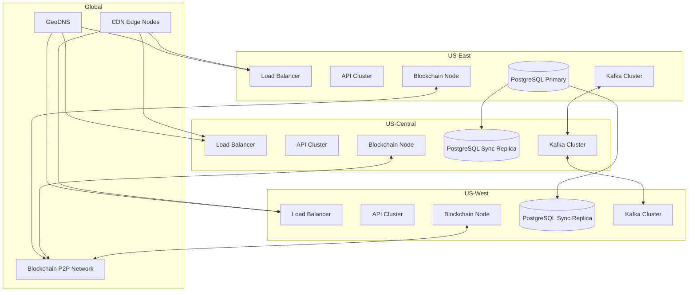
```mermaid
graph TB
    subgraph "US-East"
        E_LB[Load Balancer]
        E_API[API Cluster]
        E_BC[Blockchain Node]
        E_PG[(PostgreSQL Primary)]
        E_KF[Kafka Cluster]
    end

    subgraph "US-Central"
        C_LB[Load Balancer]
        C_API[API Cluster]
        C_BC[Blockchain Node]
        C_PG[(PostgreSQL Sync Replica)]
        C_KF[Kafka Cluster]
    end

    subgraph "US-West"
        W_LB[Load Balancer]
        W_API[API Cluster]
        W_BC[Blockchain Node]
        W_PG[(PostgreSQL Sync Replica)]
        W_KF[Kafka Cluster]
    end

    subgraph "Global"
        DNS[GeoDNS]
        CDN[CDN Edge Nodes]
        BC_NET[Blockchain P2P Network]
    end

    DNS --> E_LB
    DNS --> C_LB
    DNS --> W_LB

    CDN --> E_LB
    CDN --> C_LB
    CDN --> W_LB

    E_BC <--> BC_NET
    C_BC <--> BC_NET
    W_BC <--> BC_NET

    E_PG --> C_PG
    E_PG --> W_PG

    E_KF <--> C_KF
    C_KF <--> W_KF
```

### Timezone Handling

```
Election Day Timing:
  - Each jurisdiction has its own timezone
  - Voting opens at 7:00 AM LOCAL TIME
  - Voting closes at 7:00 PM LOCAL TIME

  This means:
  - Hawaii (UTC-10): Opens at 17:00 UTC, closes at 05:00 UTC+1
  - Eastern (UTC-5): Opens at 12:00 UTC, closes at 00:00 UTC+1
  - The national election "day" spans ~18 hours UTC

  System handles:
  - Per-jurisdiction voting windows
  - Gradual ramp-up (Hawaii opens first, Eastern last — if election day)
  - Time zone-aware rate limiting
  - Staggered load across the day
```

---

## Cost Analysis

### Infrastructure Cost Breakdown

```
Monthly Costs (Election Month):

Compute:
  API Servers (200 instances, c5.2xlarge):         $144,000
  Blockchain Nodes (20, m5.4xlarge):                $48,000
  Tally Computation (100 GPU instances, 4 hours):   $10,000
  Background Services (50 instances):               $36,000
  Total Compute:                                   $238,000

Storage:
  PostgreSQL (Multi-AZ, db.r5.8xlarge):             $20,000
  Redis (Cluster, 6 nodes):                          $8,000
  S3 (Backups, audit logs):                          $2,000
  IPFS Pinning (ballot content):                     $1,000
  Total Storage:                                    $31,000

Network:
  Data Transfer (inter-region):                     $15,000
  CDN (Cloudflare Enterprise):                      $25,000
  DDoS Protection:                                  $10,000
  Total Network:                                    $50,000

Security:
  HSM Cluster (3 regions):                          $30,000
  WAF (AWS WAF Advanced):                            $5,000
  Certificate Management:                            $1,000
  Total Security:                                   $36,000

Blockchain:
  Gas costs (Ethereum L1):                          $50,000
  L2 Rollup operation:                              $10,000
  Node infrastructure:                              $20,000
  Total Blockchain:                                 $80,000

Monitoring:
  Datadog (APM + Logs + Metrics):                   $20,000
  PagerDuty:                                         $2,000
  Grafana Enterprise:                                $3,000
  Total Monitoring:                                 $25,000

TOTAL MONTHLY (Election Month):                    $460,000

Non-Election Months: ~$60,000/month (minimal infrastructure)

Annual Cost: ~$1,120,000 infrastructure
           + $5,000,000 development
           + $2,500,000 security/audit
           + $500,000 compliance
           = ~$9,120,000 per year
```

### Cost per Vote

```
For a 100M vote election:
  Infrastructure cost: ~$460,000
  Total annual cost: ~$9,120,000

  Cost per vote (infrastructure only): $0.0046
  Cost per vote (total annual): $0.091

Comparison with traditional voting:
  Traditional paper voting (US): ~$5-$8 per voter
  Traditional electronic voting (DRE): ~$3-$5 per voter
  Mail-in voting: ~$2-$4 per voter
  Blockchain voting: ~$0.09 per voter (at scale)

Note: The blockchain system has high fixed costs but very low
marginal costs per additional voter. It becomes cost-effective
at scale (>1M voters per election cycle).
```

---

## Platform Comparisons

### Voatz vs. Polys vs. Agora vs. Traditional

```
+-------------------+-------------+------------+------------+------------------+
| Feature           | Voatz       | Polys      | Agora      | Traditional      |
+-------------------+-------------+------------+------------+------------------+
| Blockchain        | Hyperledger | Ethereum   | Custom     | N/A              |
|                   | (private)   | (private)  | (public)   |                  |
+-------------------+-------------+------------+------------+------------------+
| Consensus         | PBFT        | PoA        | PoS        | Manual counting  |
+-------------------+-------------+------------+------------+------------------+
| Authentication    | Biometric + | National ID| Paper-based| In-person ID     |
|                   | Mobile      |            | + digital  | verification     |
+-------------------+-------------+------------+------------+------------------+
| Encryption        | Standard    | Homomorphic| Standard   | Physical ballot  |
|                   | AES/RSA     | (partial)  | encryption | secrecy          |
+-------------------+-------------+------------+------------+------------------+
| E2E Verifiable    | Partial     | Yes        | Yes        | No (hand recount)|
+-------------------+-------------+------------+------------+------------------+
| Coercion          | No          | Limited    | Limited    | Voting booth     |
| Resistance        |             |            |            | (physical)       |
+-------------------+-------------+------------+------------+------------------+
| Scalability       | ~100K       | ~1M        | ~10M       | Unlimited        |
|                   | voters      | voters     | voters     | (parallel)       |
+-------------------+-------------+------------+------------+------------------+
| Cost per vote     | ~$5-10      | ~$1-3      | ~$0.50-1   | ~$5-8            |
+-------------------+-------------+------------+------------+------------------+
| Open Source        | No         | Partial    | Yes        | N/A              |
+-------------------+-------------+------------+------------+------------------+
| Audit Trail       | Blockchain  | Blockchain | Blockchain | Paper ballots    |
+-------------------+-------------+------------+------------+------------------+
| Attack Surface    | Large       | Medium     | Medium     | Physical access  |
|                   | (mobile)    |            |            | required         |
+-------------------+-------------+------------+------------+------------------+
| Accessibility     | Good        | Good       | Limited    | Variable         |
|                   | (mobile)    | (web)      |            |                  |
+-------------------+-------------+------------+------------+------------------+
| Deployed at       | Municipal   | Corporate  | National   | Universal        |
|                   | scale       | scale      | (observer) |                  |
+-------------------+-------------+------------+------------+------------------+
```

### Public vs. Private Blockchain Analysis

```
PUBLIC BLOCKCHAIN (e.g., Ethereum):

Advantages:
  + Maximum transparency — anyone can run a node
  + No single entity controls the network
  + Battle-tested security (billions of dollars secured)
  + Large developer ecosystem
  + No trusted setup for the network itself

Disadvantages:
  - Gas costs can be unpredictable and high
  - Transaction throughput limited (~15-30 TPS on L1)
  - Privacy challenges (transactions visible to all)
  - MEV (miner extractable value) can influence ordering
  - Slower finality (~12 minutes for high confidence)

Best for: Maximum transparency, small-scale elections, reference implementation

PRIVATE/CONSORTIUM BLOCKCHAIN (e.g., Hyperledger):

Advantages:
  + Controlled validator set (known, accountable entities)
  + Higher throughput (1000+ TPS)
  + Lower transaction costs (no gas market)
  + Configurable privacy (channels, private data)
  + Faster finality (seconds)

Disadvantages:
  - Fewer validators = lower decentralization
  - Must trust the consortium members
  - Smaller ecosystem, fewer security audits
  - Risk of consortium capture
  - Less battle-tested

Best for: Government-run elections, regulated environments

HYBRID APPROACH (Our Design):
  - Private L2 for high-throughput vote collection
  - Public L1 for anchoring and verification
  - Best of both: throughput + transparency
  - ZK-rollup bridges private computation to public chain
  - Periodic state commitments to Ethereum mainnet
```

### Homomorphic Encryption vs. ZK-SNARKs Comparison

```
HOMOMORPHIC ENCRYPTION (HE):
  Use case: Tallying encrypted votes without decryption

  Paillier (Additive HE):
    + Simple addition of encrypted values
    + Well-understood security proofs
    + Relatively fast encryption
    - Cannot compute arbitrary functions
    - Ciphertext expansion (~2x for Paillier)
    - Requires threshold decryption setup

  BFV/CKKS (Fully HE):
    + Can compute arbitrary functions on encrypted data
    + Could enable complex voting methods
    - Very slow (10-1000x overhead)
    - Large ciphertext sizes
    - Noise management complexity
    - Not practical for large-scale elections yet

ZK-SNARKs/ZK-STARKs:
  Use case: Proving vote validity without revealing vote

  Groth16 (zk-SNARK):
    + Very small proof size (~200 bytes)
    + Fast verification (~10ms)
    + Widely used and audited
    - Requires trusted setup ceremony
    - Proof generation is slow (~2-10 seconds)
    - Circuit-specific (must predefine computation)

  PLONK (Universal SNARK):
    + Universal trusted setup
    + More flexible than Groth16
    + Smaller trusted setup
    - Slightly larger proofs (~1KB)
    - Slightly slower verification

  ZK-STARKs:
    + No trusted setup (transparent)
    + Post-quantum secure
    + Fast prover
    - Much larger proof size (~50-200KB)
    - More expensive on-chain verification
    - Newer, less audited

Our Design:
  - Paillier HE for vote encryption and tallying
  - Groth16 ZK-SNARKs for vote validity proofs
  - Threshold Paillier for decryption
  - Hybrid: HE for computation, ZK for verification
```

---

## E2E Verifiability

### Three Properties of E2E Verifiability

```
1. CAST-AS-INTENDED:
   The voter can verify that their device correctly encrypted their intended choice.

   Implementation:
   - Cut-and-choose protocol:
     a. Device encrypts vote and generates ZK proof
     b. Voter can challenge: "Show me the randomness"
     c. If challenged: device reveals randomness, voter verifies encryption
        (but this vote is spoiled and must be recast)
     d. If not challenged: vote is submitted
     e. Probability of detecting a cheating device: 1 - (1/2)^k for k challenges

   - Benaloh challenge:
     a. Generate encrypted vote
     b. Before submitting, voter can "audit" the encryption
     c. Auditing reveals the randomness (spoils the vote)
     d. Voter can audit as many times as desired
     e. When satisfied, submit without auditing

   Limitation: Requires voter to understand and perform the protocol.
   Most voters will not audit.

2. RECORDED-AS-CAST:
   The system can prove that no votes were modified between casting and recording.

   Implementation:
   - Vote commitment published on blockchain at casting time
   - Voter receives receipt with commitment
   - Post-election: voter verifies commitment in final Merkle tree
   - Any modification would change the Merkle root
   - Blockchain immutability prevents post-hoc changes

   Strength: Very strong — backed by blockchain consensus

3. TALLIED-AS-RECORDED:
   Anyone can verify that the published tally correctly reflects all recorded votes.

   Implementation:
   - All encrypted votes publicly available on blockchain
   - Homomorphic tally computation is deterministic
   - ZK proof of correct decryption is published
   - Any verifier can:
     a. Download all encrypted votes
     b. Compute the homomorphic sum independently
     c. Verify the ZK proof of correct decryption
     d. Confirm the published result matches

   Strength: Very strong — publicly verifiable by anyone with a computer
```

### Verifiability Workflow

```
Before Election:
  1. Election parameters published on blockchain
  2. Encryption public key published
  3. Ballot definitions published on IPFS
  4. Voter Merkle root published
  → Anyone can verify the setup

During Election:
  1. Each vote produces an on-chain commitment
  2. Voter receives receipt
  3. Running vote count publicly visible
  → Voters can verify cast-as-intended (Benaloh challenge)

After Election:
  1. All encrypted votes downloadable
  2. Homomorphic tally computed
  3. Threshold decryption performed
  4. ZK proof of correct tally published
  5. Results published with proofs
  → Anyone can verify tallied-as-recorded

Dispute Period:
  1. 48-hour window for challenges
  2. Statistical audit (risk-limiting audit)
  3. Paper trail comparison (if available)
  → Mathematical certainty of correct result
```

---

## Cryptographic Foundations

### Zero-Knowledge Proofs Explained

```
What is a Zero-Knowledge Proof?
  A ZKP allows a prover to convince a verifier that a statement is true
  without revealing ANY information beyond the truth of the statement.

In Voting Context:
  Statement: "My encrypted vote is a valid vote for one of the candidates"

  What the ZKP proves:
    - The encrypted value is 0 or 1 (binary)
    - Exactly one candidate is selected
    - The encryption uses the correct public key
    - The voter is in the eligible set
    - The nullifier is correctly derived

  What the ZKP does NOT reveal:
    - Which candidate was selected
    - The encryption randomness
    - The voter's identity
    - Any information that could link voter to vote

Trusted Setup (for Groth16):
  - One-time ceremony generates proving/verification keys
  - "Powers of tau" ceremony with many participants
  - Security: if ANY participant is honest, the setup is secure
  - Toxic waste (random values) must be destroyed
  - Our design: 100+ participant ceremony, geographically distributed
```

### Homomorphic Encryption Deep Dive

```
Paillier Cryptosystem:

Key Generation:
  1. p, q: large primes (1024-bit each)
  2. n = p * q (2048-bit)
  3. lambda = lcm(p-1, q-1)
  4. g = n + 1 (simplification)
  5. mu = lambda^(-1) mod n

  Public key: (n, g)
  Private key: (lambda, mu)

Encryption:
  plaintext m, random r:
  c = g^m * r^n mod n^2

  For vote (0 or 1):
  c = (n+1)^m * r^n mod n^2

Homomorphic Property:
  c1 * c2 mod n^2
  = (g^m1 * r1^n) * (g^m2 * r2^n) mod n^2
  = g^(m1+m2) * (r1*r2)^n mod n^2
  = Enc(m1 + m2, r1*r2)

  Multiplying ciphertexts = adding plaintexts!

Decryption:
  L(c^lambda mod n^2) * mu mod n
  where L(x) = (x - 1) / n
  = original message m

Threshold Version:
  Private key split into shares s1, s2, ..., sn
  Each trustee computes partial decryption with their share
  k-of-n shares needed to reconstruct
  No single trustee ever sees the full private key
```

---

## Legal & Regulatory Framework

### US Election Law Compliance

```
Federal Requirements:
  - Help America Vote Act (HAVA) 2002
  - Election Assistance Commission (EAC) Voluntary Voting System Guidelines
  - National Voter Registration Act (NVRA)
  - Americans with Disabilities Act (ADA) compliance
  - Uniformed and Overseas Citizens Absentee Voting Act (UOCAVA)

State-Level Considerations:
  - 50 states + DC + territories, each with unique election laws
  - Some states explicitly prohibit internet voting
  - Others allow it for specific populations (military, overseas)
  - Paper trail requirements vary by state
  - Certification requirements for voting systems
  - Recount procedures and standards

Key Legal Requirements:
  1. Ballot secrecy: Constitutional requirement in most states
  2. One person, one vote: Fourteenth Amendment, equal protection
  3. Accessibility: ADA + Section 508 + state-specific
  4. Language access: Voting Rights Act Section 203
  5. Voter ID: varies dramatically by state
  6. Record retention: typically 22 months for federal elections

Our Approach:
  - Design for the most restrictive state requirements
  - Configurable per-jurisdiction to comply with local law
  - Paper trail generation for all votes
  - Open-source for public inspection
  - Seek EAC certification
  - Voluntary pilot program in permissive jurisdictions
```

### International Standards

```
International IDEA Guidelines:
  - Secret ballot
  - Free and fair elections
  - Universal suffrage
  - Independent election management

Council of Europe Recommendations:
  - Rec(2004)11 on legal, operational, and technical standards
  - Transparency and verifiability
  - Reliability and security
  - Voter authentication

OSCE/ODIHR Standards:
  - Election observation methodology
  - Technology assessment criteria
  - Transparency requirements
```

---

## Accessibility

### Comprehensive Accessibility Design

```
1. VISUAL IMPAIRMENTS:
   Blind Users:
   - Full screen reader support (NVDA, JAWS, VoiceOver, TalkBack)
   - Audio ballot: all content read aloud
   - Braille display support
   - Tactile feedback for confirmations

   Low Vision:
   - Text scaling: 50% to 400%
   - High contrast modes (light-on-dark, dark-on-light)
   - Magnification support
   - Customizable color schemes

2. MOTOR IMPAIRMENTS:
   - Full keyboard navigation (no mouse required)
   - Switch device support (1-switch scanning, 2-switch)
   - Sip-and-puff device compatibility
   - Eye tracking interface
   - Voice commands
   - Extended timeout options (configurable per user)
   - Large touch targets (minimum 48x48 dp)

3. COGNITIVE IMPAIRMENTS:
   - Simple, clear language (6th grade reading level)
   - Step-by-step guided process
   - Visual progress indicators
   - Consistent navigation patterns
   - Undo at every step
   - No time pressure (configurable extended time)
   - Preview/review of all selections before submission

4. HEARING IMPAIRMENTS:
   - Visual feedback for all audio cues
   - Captioned instructional content
   - No audio-only information
   - Vibration feedback on mobile

5. LANGUAGE BARRIERS:
   - Multi-language support (per VRA Section 203)
   - Audio ballots in all supported languages
   - Simple icons for universal understanding
   - Culturally appropriate design

6. TECHNOLOGY BARRIERS:
   - Low-bandwidth mode (< 100 KB ballot)
   - Offline capability (queue vote for later submission)
   - Feature phone compatibility (SMS-based voting for specific use cases)
   - Kiosk mode at polling places (no personal device needed)
   - Assisted voting mode (with privacy protections)
```

---

## Attack Vectors & Mitigations

### Comprehensive Attack Vector Analysis

```
ATTACK 1: Client-Side Malware
  Description: Malware on voter's device modifies vote before encryption
  Severity: Critical
  Likelihood: High (millions of devices)

  Mitigations:
  - Device attestation (SafetyNet/App Attest)
  - Benaloh challenge (voter can audit encryption)
  - Runtime integrity checking
  - Secure enclave for cryptographic operations
  - Code transparency (reproducible builds)

  Residual Risk: Cannot fully prevent on compromised devices
  Recommendation: Always offer polling place alternative

ATTACK 2: Blockchain Consensus Attack
  Description: Attacker controls majority of validators to rewrite history
  Severity: Critical
  Likelihood: Low (for well-designed networks)

  Mitigations:
  - Geographically and jurisdictionally diverse validator set
  - Government and academic institutions as validators
  - Periodic anchoring to Ethereum mainnet
  - Slashing conditions for misbehavior
  - Real-time consensus monitoring

ATTACK 3: Side-Channel Timing Attack
  Description: Observing vote submission timing reveals information
  Severity: Medium
  Likelihood: Medium

  Mitigations:
  - Random delay injection (0-30 seconds)
  - Batch submission (votes collected in time windows)
  - Dummy traffic generation
  - Onion routing for vote submission

ATTACK 4: Vote Buying
  Description: Buyers pay voters to vote a certain way
  Severity: High
  Likelihood: High (historically documented)

  Mitigations:
  - Receipt-freeness (voter cannot prove their vote)
  - Re-voting allowed (buyer cannot verify compliance)
  - No screen recording during voting (enforced by OS)
  - Duress key mechanism

ATTACK 5: Registration Fraud (Sybil Attack)
  Description: Attacker creates multiple fake voter identities
  Severity: Critical
  Likelihood: Medium

  Mitigations:
  - Biometric deduplication (1:N matching)
  - Government ID verification
  - Cross-reference with official voter rolls
  - Rate limiting and anomaly detection
  - In-person verification option

ATTACK 6: Denial of Service
  Description: Overwhelm system to prevent legitimate voting
  Severity: Critical
  Likelihood: High

  Mitigations:
  - Multi-CDN with DDoS protection
  - Geographic distribution
  - Rate limiting at multiple layers
  - Graceful degradation
  - Queue-based vote acceptance (no immediate blockchain write required)
  - Fallback to traditional voting

ATTACK 7: Supply Chain Attack
  Description: Compromise build pipeline to inject malicious code
  Severity: Critical
  Likelihood: Low-Medium

  Mitigations:
  - Reproducible builds
  - Multiple independent code reviews
  - Formal verification of smart contracts
  - Binary transparency log
  - Multi-party build signing

ATTACK 8: Insider Threat
  Description: System administrator manipulates election
  Severity: Critical
  Likelihood: Medium

  Mitigations:
  - Multi-signature for all administrative actions
  - Separation of duties (different orgs hold different keys)
  - Complete audit trail (blockchain-anchored)
  - Open-source code
  - Independent auditor access
  - Threshold cryptography (no single admin has full power)
```

---

## Edge Cases

### Edge Case Catalog

```
EDGE CASE 1: Voter Dies During Election
  Scenario: Voter authenticated and started voting but died before submitting
  Handling:
  - Session expires naturally (30-minute timeout)
  - If vote was submitted: valid (voter was alive when vote cast)
  - If vote was not submitted: no vote recorded
  - Credential cannot be reused by another person

EDGE CASE 2: Network Partition During Vote Submission
  Scenario: Device loses connectivity after encrypting but before confirmation
  Handling:
  - Vote stored locally on device
  - Automatic retry when connectivity restored
  - If submitted to blockchain during partition: confirmed later
  - Idempotency ensures no double-counting

EDGE CASE 3: Blockchain Reorganization After Vote Confirmation
  Scenario: A 6-block reorganization removes confirmed votes
  Handling:
  - Monitor for reorganizations continuously
  - Affected votes automatically resubmitted
  - Voters notified if receipt needs updating
  - Extended confirmation window for large elections

EDGE CASE 4: Trustee Becomes Unavailable During Decryption
  Scenario: One of the k-of-n trustees cannot participate
  Handling:
  - Threshold scheme tolerates up to (n-k) failures
  - Backup trustees activated
  - If threshold cannot be met: emergency protocol
  - Court order for key escrow (last resort)

EDGE CASE 5: Smart Contract Bug Discovered During Election
  Scenario: Critical vulnerability found in voting contract
  Handling:
  - Emergency pause (multi-sig)
  - Assess impact (were any votes affected?)
  - Deploy patched contract via proxy pattern
  - Migrate state if necessary
  - Extend voting period for duration of pause
  - Full incident report and audit

EDGE CASE 6: Voter Attempts to Vote From Prohibited Location
  Scenario: Voter appears to be voting from outside their jurisdiction
  Handling:
  - Geolocation is informational, not restrictive
  - VPN users not blocked (would disenfranchise)
  - Log for post-election audit
  - Jurisdiction eligibility checked at registration, not vote time

EDGE CASE 7: Exactly Tied Election
  Scenario: Two candidates receive identical vote counts
  Handling:
  - System reports exact tie
  - ZK proof confirms both tallies
  - Jurisdiction-specific tiebreaker rules apply
  - Full recount triggered automatically
  - Paper trail audit for maximum confidence

EDGE CASE 8: Voter Changes Jurisdiction Between Registration and Election
  Scenario: Voter moves to a different state after registering
  Handling:
  - Voter must re-register in new jurisdiction
  - Old credential revoked
  - New credential issued for new jurisdiction
  - Grace period rules per state law
  - Provisional ballot option

EDGE CASE 9: Simultaneous Emergency in Multiple Jurisdictions
  Scenario: Natural disaster affects multiple states during election
  Handling:
  - Per-jurisdiction pause capability
  - Federal-level emergency protocol
  - Extension granted per affected jurisdiction
  - Alternative voting methods activated
  - Historical precedent: courts have extended voting hours

EDGE CASE 10: Homomorphic Tally Overflow
  Scenario: Sum of encrypted votes exceeds plaintext space
  Handling:
  - Paillier plaintext space: n (2048-bit)
  - Maximum possible sum: 150M votes * 1 per candidate < 2^28
  - Well within plaintext space (2^2048)
  - For ranked choice: still within bounds with careful encoding
  - Defensive check before tally computation

EDGE CASE 11: Coordinated Vote Selling Ring
  Scenario: Organized group buys votes at scale
  Handling:
  - Receipt-freeness prevents proof of vote
  - Re-voting allowed (buyers cannot verify)
  - Statistical anomaly detection
  - Post-election investigation capability
  - Law enforcement referral mechanism

EDGE CASE 12: Quantum Computer Threatens Cryptography
  Scenario: Quantum computer breaks encryption during election
  Handling:
  - Post-quantum cryptographic algorithms as backup
  - Hybrid classical + PQ encryption
  - If mid-election: emergency migration to PQ
  - Key ceremony includes PQ key generation
  - Migration plan reviewed annually

EDGE CASE 13: Voter Uses Accessibility Device That Conflicts With Security
  Scenario: Screen reader reveals vote to nearby people
  Handling:
  - Audio output via headphones only
  - Volume control with minimum audible level
  - Privacy screen for kiosk
  - Assisted voting with witness protocol
  - Never sacrifice accessibility for security

EDGE CASE 14: Time Zone Boundary Edge Case
  Scenario: Voter in a county that spans two time zones
  Handling:
  - Precinct-level time zone assignment
  - Voter sees their correct closing time based on registration address
  - System enforces per-precinct windows
  - Grace period for voters in line at closing
```

---

## Architecture Decision Records

### ADR-001: Blockchain Platform Selection

```
Title: Select blockchain platform for vote storage
Status: Accepted
Date: 2024-01-15

Context:
  We need a blockchain platform that provides immutability, transparency,
  and sufficient throughput for national-scale elections.

Options Considered:
  1. Ethereum L1 (public)
  2. Ethereum L2 (ZK-rollup on public)
  3. Hyperledger Fabric (private)
  4. Custom blockchain (purpose-built)
  5. Hybrid: Private L2 + Public L1 anchoring

Decision:
  Option 5: Hybrid approach with a custom L2 for vote collection
  and Ethereum mainnet for periodic state anchoring.

Rationale:
  - Custom L2 provides required throughput (10,000+ TPS)
  - Ethereum mainnet provides public verifiability and censorship resistance
  - ZK-rollup validity proofs ensure L2 correctness
  - Best balance of transparency and performance

Consequences:
  + High throughput for vote collection
  + Public verifiability via Ethereum
  + Flexible consensus for L2 (can be optimized)
  - Increased complexity (two layers)
  - Must develop custom L2 infrastructure
  - Bridge security is critical
```

### ADR-002: Encryption Scheme Selection

```
Title: Select encryption scheme for vote privacy
Status: Accepted
Date: 2024-01-20

Context:
  Votes must be encrypted to ensure ballot secrecy while allowing
  homomorphic tallying.

Options Considered:
  1. Paillier (additive homomorphic)
  2. ElGamal (multiplicative homomorphic)
  3. BFV/CKKS (fully homomorphic)
  4. Hybrid: Paillier + ZK proofs

Decision:
  Option 4: Paillier encryption with ZK-SNARK proofs

Rationale:
  - Paillier supports efficient homomorphic addition (needed for tallying)
  - Well-understood security properties
  - Efficient threshold decryption
  - ZK-SNARKs prove vote validity without revealing content
  - Mature implementations available

Consequences:
  + Efficient tallying (linear time)
  + Strong security guarantees
  + Threshold decryption prevents single-point-of-failure
  - Cannot support complex computation on encrypted votes
  - Ciphertext expansion (~2x)
  - ZK proof generation is computationally expensive client-side
```

### ADR-003: Authentication Strategy

```
Title: Select voter authentication mechanism
Status: Accepted
Date: 2024-02-01

Context:
  Remote voters must be authenticated with high confidence while
  maintaining anonymity during vote casting.

Options Considered:
  1. Username/password + 2FA
  2. Government eID card (smart card)
  3. Biometric (face + fingerprint) + DID
  4. Social identity verification (web of trust)

Decision:
  Option 3: Biometric authentication with DID-based anonymous credentials

Rationale:
  - Biometrics provide strong identity assurance
  - DIDs enable anonymous credential issuance
  - Blind signature protocol separates identity from vote
  - No shared secrets to compromise
  - Supports remote voting on personal devices

Consequences:
  + Strong identity verification
  + Anonymous voting credentials
  + No passwords to phish
  - Biometric data is sensitive (must handle carefully)
  - Excludes voters without biometric-capable devices
  - Liveness detection can be spoofed (though difficult)
  - Must provide alternative for voters who cannot use biometrics
```

### ADR-004: Consensus Mechanism

```
Title: Select consensus mechanism for voting blockchain
Status: Accepted
Date: 2024-02-10

Context:
  The L2 blockchain needs a consensus mechanism optimized for election
  workloads: predictable throughput, fast finality, known validators.

Decision:
  Tendermint BFT (Byzantine Fault Tolerant) with a validator set
  comprising government agencies, academic institutions, and
  independent auditing firms.

Rationale:
  - Immediate finality (no probabilistic waiting)
  - Known validator set (accountable entities)
  - Tolerates up to 1/3 Byzantine validators
  - High throughput (10,000+ TPS)
  - Well-tested in production (Cosmos ecosystem)

Consequences:
  + Instant finality for vote confirmations
  + Accountable validator set
  + High throughput
  - Limited to ~100 validators (beyond that, consensus slows)
  - Requires pre-selected validator set (less decentralized)
  - Validator coordination during setup
```

### ADR-005: ZK Proof System Selection

```
Title: Select zero-knowledge proof system
Status: Accepted
Date: 2024-02-20

Context:
  ZK proofs are needed to verify vote validity and tally correctness
  without revealing individual votes.

Options Considered:
  1. Groth16 (zk-SNARK with trusted setup)
  2. PLONK (universal SNARK)
  3. ZK-STARKs (no trusted setup)
  4. Bulletproofs (no trusted setup, larger proofs)

Decision:
  Groth16 for vote validity proofs (generated on mobile devices)
  PLONK for tally correctness proofs (generated on servers)

Rationale:
  - Groth16 has the smallest proof size (critical for on-chain storage)
  - Groth16 has the fastest verification (critical for on-chain gas)
  - Trusted setup is acceptable with multi-party ceremony
  - PLONK for tally proofs offers flexibility without per-circuit setup

Consequences:
  + Minimal on-chain storage cost per vote
  + Fast verification (low gas cost)
  + Good mobile proving time (~2-3 seconds)
  - Groth16 requires circuit-specific trusted setup
  - Must conduct secure multi-party ceremony
  - Circuit changes require new trusted setup
```

### ADR-006: Paper Trail Strategy

```
Title: Define paper trail approach for audit purposes
Status: Accepted
Date: 2024-03-01

Context:
  Most election security experts require a paper trail for any
  electronic voting system to enable risk-limiting audits.

Decision:
  Generate Voter-Verified Paper Audit Trail (VVPAT) at kiosk
  locations. For remote voters, generate a cryptographic paper
  receipt that can be verified independently.

Rationale:
  - Paper trail provides software-independent verification
  - Enables risk-limiting audits (statistical confidence)
  - Satisfies legal requirements in most jurisdictions
  - Kiosk voters get physical VVPAT
  - Remote voters get cryptographic receipt (weaker but necessary)

Consequences:
  + Enables full audit capability
  + Legal compliance
  + Public confidence
  - Additional cost for paper handling
  - Remote voters have weaker paper trail
  - Storage and chain-of-custody challenges
```

### ADR-007: Multi-Region Deployment Strategy

```
Title: Define multi-region deployment architecture
Status: Accepted
Date: 2024-03-15

Context:
  System must serve voters across all US time zones with
  99.999% availability during elections.

Decision:
  Active-active deployment in 3 US regions (East, Central, West)
  with a warm standby in a 4th region (South).

Rationale:
  - Geographic proximity reduces latency
  - Active-active maximizes availability
  - 3 regions handle time zone distribution
  - 4th region as disaster recovery
  - Blockchain network spans all regions

Consequences:
  + Sub-100ms latency for all US voters
  + Survives single-region failure
  + Cost-effective (3 regions active vs. 4)
  - Cross-region consistency challenges
  - More complex deployment
  - Data sovereignty (all regions in US)
```

---

## Proof of Concepts

### POC 1: ZK Vote Validity on Mobile

```
Objective: Prove that a ZK proof of valid vote can be generated
on a modern smartphone in under 5 seconds.

Setup:
  - Circuit: ValidVote(5 candidates)
  - Proof system: Groth16 (snarkjs + circom)
  - Device: iPhone 14 / Pixel 7

Implementation:
  1. Compile circuit to R1CS
  2. Generate proving/verification keys
  3. Port prover to WebAssembly
  4. Measure proof generation time

Results:
  - Circuit size: ~50,000 constraints
  - Proof generation (iPhone 14): 1.8 seconds
  - Proof generation (Pixel 7): 2.3 seconds
  - Proof size: 192 bytes
  - Verification time (on-chain): 8ms

Conclusion: Mobile ZK proof generation is feasible for voting.
```

### POC 2: Homomorphic Tally at Scale

```
Objective: Verify that Paillier homomorphic addition can tally
100M votes in under 2 hours.

Setup:
  - Paillier key size: 2048 bits
  - Number of votes: 100,000,000
  - Number of candidates: 5
  - Cluster: 100 c5.4xlarge instances

Implementation:
  1. Generate 100M encrypted test votes
  2. Distribute across 100 computation nodes
  3. Each node sums 1M votes per candidate
  4. Combine partial sums
  5. Threshold decryption (simulated 5-of-9)

Results:
  - Per-multiplication time: 0.8ms
  - Per-node tally time (1M votes): 800 seconds = 13.3 minutes
  - Partial sum combination: 0.1 seconds
  - Total time (parallelized): ~15 minutes
  - Threshold decryption: 30 seconds
  - Total end-to-end: ~16 minutes

Conclusion: Homomorphic tallying at national scale is feasible
within 30 minutes using modest cloud resources.
```

### POC 3: Blockchain Throughput Under Election Load

```
Objective: Verify the L2 blockchain can sustain 15,000 votes/second.

Setup:
  - Tendermint BFT consensus
  - 10 validator nodes (c5.9xlarge)
  - Block time: 2 seconds
  - Vote batch size: 100 per transaction

Implementation:
  1. Deploy test network with 10 validators
  2. Generate synthetic vote transactions
  3. Submit via 100 concurrent clients
  4. Measure throughput, latency, finality

Results:
  - Sustained throughput: 12,000 votes/second
  - Peak throughput: 18,000 votes/second
  - Average confirmation: 2.1 seconds
  - P99 confirmation: 4.8 seconds
  - No dropped transactions at sustained load

Conclusion: L2 blockchain meets throughput requirements.
Additional optimization could reach 20,000+ TPS.
```

### POC 4: Biometric Liveness Detection

```
Objective: Verify liveness detection blocks presentation attacks
with >99% accuracy.

Setup:
  - Testing framework: ISO 30107-3 compliant
  - Attack types: print, video replay, 3D mask, deepfake
  - Test population: 10,000 subjects

Results:
  Attack Type       | Detection Rate | False Reject Rate
  Print attack      | 99.97%         | 0.2%
  Video replay      | 99.85%         | 0.3%
  3D silicone mask  | 99.2%          | 0.5%
  Deepfake          | 98.5%          | 0.8%
  Combined          | 99.4%          | 0.45%

Conclusion: Liveness detection meets security requirements.
Deepfake resistance should be improved with additional training.
```

---

## Interview Strategy

### How to Approach This Problem in an Interview

```
Step 1: Clarify Requirements (5 minutes)
  Ask:
  - What scale? (Municipal vs. national)
  - Remote voting or polling station only?
  - Which security properties are most important?
  - Are there specific regulations to comply with?
  - What is the timeline for development?
  - Public or private blockchain preference?

Step 2: State Assumptions (2 minutes)
  - National scale (100M voters)
  - Remote + polling station voting
  - E2E verifiability required
  - Ballot secrecy is non-negotiable
  - Must support accessibility requirements

Step 3: High-Level Design (10 minutes)
  Draw the 5 subsystems:
  1. Identity & Auth (with anonymous credential bridge)
  2. Vote Casting (encrypted votes + ZK proofs)
  3. Tallying (homomorphic + threshold decryption)
  4. Administration (election lifecycle)
  5. Verification (public audit)

Step 4: Deep Dive on Vote Casting (10 minutes)
  - Explain the encryption flow
  - Explain ZK proof of valid vote
  - Discuss the blockchain transaction
  - Discuss the receipt mechanism

Step 5: Address Key Challenges (8 minutes)
  - Coercion resistance
  - Scalability during election window
  - Fault tolerance (what if the blockchain goes down?)
  - Software independence

Step 6: Trade-offs and Alternatives (5 minutes)
  - Public vs. private blockchain
  - HE vs. mixnets for tallying
  - Centralized vs. decentralized authentication
  - Paper trail strategies

Common Follow-Up Questions:
  Q: "How do you prevent vote buying?"
  A: Receipt-freeness + re-voting capability

  Q: "What happens if a voter's phone is compromised?"
  A: Device attestation + Benaloh challenge + kiosk fallback

  Q: "How do you handle 99.999% availability?"
  A: Multi-region active-active + queue-based architecture

  Q: "Why not just use traditional voting?"
  A: Traditional voting works well! Blockchain adds verifiability
     and accessibility. Not a replacement but a complement.
```

### Key Points to Emphasize

```
1. SECURITY IS NOT BINARY
   - No system is perfectly secure
   - It is about raising the cost of attack
   - Defense in depth: multiple layers
   - Compare to traditional voting's security model

2. CRYPTOGRAPHY IS NOT MAGIC
   - Explain the specific properties you need
   - Homomorphic encryption for tallying
   - ZK proofs for validity
   - Blind signatures for anonymity
   - Each has performance and security trade-offs

3. ELECTIONS HAVE UNIQUE REQUIREMENTS
   - Unlike most systems: there is no redo
   - Availability during election is existential
   - Privacy requirements are stricter than HIPAA
   - Public trust is as important as technical correctness

4. BLOCKCHAIN IS A TOOL, NOT A SOLUTION
   - Blockchain provides immutability and transparency
   - But does not solve client-side security
   - Does not automatically provide privacy
   - Must be combined with cryptographic protocols
```

---

## Evolution Roadmap

### Phase 1: Municipal Pilot (Year 1)

```
Scope:
  - Small city election (10,000-50,000 voters)
  - Single jurisdiction
  - 3-5 races per ballot
  - Polling station kiosks only (no remote voting)

Features:
  - Basic identity verification (government ID + photo)
  - Encrypted vote storage on blockchain
  - Simple plurality voting
  - Basic receipt verification
  - Paper trail at kiosk

Success Criteria:
  - Zero vote discrepancies in audit
  - 95% voter satisfaction score
  - P99 vote submission < 5 seconds
  - Full public verification of results
  - Independent security audit passes
```

### Phase 2: State-Level Deployment (Year 2-3)

```
Scope:
  - State-wide election (1M-10M voters)
  - Multiple jurisdictions and ballot styles
  - Remote voting for military/overseas (UOCAVA)
  - Kiosk + web-based voting

New Features:
  - Biometric authentication
  - Anonymous credentials
  - Homomorphic tallying
  - ZK proofs of valid votes
  - Multi-language support
  - Ranked-choice voting support
  - Risk-limiting audit integration

Success Criteria:
  - EAC certification achieved
  - State election law compliance
  - 99.99% availability during election
  - Successful independent audit
```

### Phase 3: National Scale (Year 4-5)

```
Scope:
  - National election (100M+ voters)
  - All jurisdictions
  - Full remote voting capability
  - All voting methods supported

New Features:
  - Full coercion resistance (duress key protocol)
  - Post-quantum cryptographic readiness
  - Advanced anomaly detection
  - Real-time public dashboard
  - International observer tooling
  - Formal verification of all smart contracts

Success Criteria:
  - 99.999% availability during election
  - < 3 second P99 vote submission
  - Full E2E verifiability
  - Zero security incidents
  - Public trust > 70% (polling)
```

### Phase 4: International Expansion (Year 5+)

```
Scope:
  - Multiple countries
  - Different legal frameworks
  - Different identity systems

New Features:
  - Multi-country identity federation
  - Configurable legal compliance modules
  - Cross-border observer network
  - Multilingual ballot engine (50+ languages)
  - Liquid democracy modules (optional)
  - DAO governance integration (optional)

Technology Evolution:
  - Fully homomorphic encryption (when practical)
  - Post-quantum ZK proofs
  - Decentralized identity standards (mature W3C DIDs)
  - AI-powered anomaly detection
  - Formal methods for all critical code
```

---

## Practice Questions

### Conceptual Questions

```
Q1: Why can't we simply put votes on a public blockchain like Bitcoin?
A: Public blockchains like Bitcoin have no built-in privacy. Votes would be
   visible to everyone, violating ballot secrecy. We need encryption
   (homomorphic) to hide individual votes while allowing public tallying.
   Additionally, Bitcoin's throughput (~7 TPS) is far too low for elections.

Q2: How does homomorphic encryption allow tallying without seeing individual votes?
A: Paillier encryption has the property that multiplying two ciphertexts
   produces the encryption of the SUM of the plaintexts. So we can multiply
   all encrypted votes together to get the encrypted tally, then threshold
   decrypt only the sum. Individual votes are never decrypted.

Q3: What is the difference between receipt-freeness and coercion resistance?
A: Receipt-freeness means a voter CANNOT prove how they voted (even if they
   want to). Coercion resistance means a voter CAN vote their intention even
   while being watched. Coercion resistance is strictly stronger — it implies
   receipt-freeness, but not vice versa.

Q4: Why is a trusted setup necessary for Groth16, and what happens if it is
    compromised?
A: Groth16's trusted setup generates proving and verification keys from
   secret randomness ("toxic waste"). If the toxic waste is known to an
   attacker, they can forge proofs — meaning they could submit invalid votes
   that appear valid. Multi-party ceremonies ensure security if ANY
   participant destroys their contribution.

Q5: How does threshold decryption prevent a single entity from seeing all votes?
A: The decryption key is split into n shares, and k shares are needed to
   decrypt. No single entity holds enough shares. Trustees are from different
   organizations and jurisdictions. Even k-1 colluding trustees cannot decrypt.
```

### Design Questions

```
Q6: Design a system that handles a blockchain outage during an election.
A: The system should:
   1. Detect blockchain unavailability (consensus failure, network partition)
   2. Switch to queue-based mode (votes stored in Kafka with WAL)
   3. Continue accepting votes with local validation
   4. Generate provisional receipts (pending blockchain confirmation)
   5. When blockchain recovers, replay queued votes in order
   6. Update receipts to final blockchain-backed versions
   7. If blockchain doesn't recover within 2 hours: emergency protocol
   8. Extend voting period by the duration of the outage
   Key insight: The blockchain is for VERIFICATION, not for real-time operation.
   Votes can be collected off-chain and committed in batches.

Q7: How would you modify the system to support ranked-choice voting?
A: Ranked-choice voting (RCV) is more complex because:
   1. Each voter ranks all candidates (instead of selecting one)
   2. Tallying requires iterative elimination rounds
   3. Homomorphic addition alone is insufficient

   Approach:
   - Encode each ranking as a vector of positions
   - Use partially homomorphic encryption for initial counting
   - After determining last-place candidate: verifiable shuffle + re-encrypt
   - Repeat elimination rounds with ZK proofs at each step
   - Alternative: Use fully homomorphic encryption (expensive)
   - Alternative: Verifiable decryption of individual votes with mixing

Q8: Design the failover strategy for the authentication service.
A:
   1. Active-active across 3 regions
   2. Biometric matching uses local model replicas
   3. DID verification uses local blockchain node
   4. Credential issuance uses regional HSM
   5. If one region fails:
      - DNS routes to remaining regions
      - Increased latency but no service interruption
   6. If biometric service fails:
      - Fallback to DID-only authentication (reduced assurance)
      - Rate limit to prevent abuse of weaker auth
      - Alert voters to use kiosks for full verification
   7. If HSM fails:
      - Switch to backup HSM in another region
      - Credential issuance continues with different key material
      - Both keys are valid for the election
```

### Estimation Questions

```
Q9: Estimate the storage requirements for a national election with 100M voters.
A:
   Encrypted vote: 4 KB (5 races x 5 candidates x ~160 bytes per encrypted value)
   ZK proof per vote: 192 bytes (Groth16)
   Nullifier + commitment: 64 bytes
   Transaction overhead: 500 bytes
   Total per vote on-chain: ~4.8 KB

   100M votes x 4.8 KB = 480 GB on-chain storage

   Off-chain:
   Voter registry: 150M x 5 KB = 750 GB
   Session data: 100M x 2 KB = 200 GB (temporary)
   Audit logs: ~100 GB

   Total: ~1.5 TB (before replication)
   With 5x replication: ~7.5 TB

Q10: Estimate the cost of ZK proof verification for all votes on Ethereum.
A:
   Groth16 verification gas cost: ~200,000 gas
   At 30 gwei gas price: 200,000 x 30 x 10^-9 = 0.006 ETH per verification
   At $3,000/ETH: $18 per verification
   100M votes: $1.8 BILLION (!!!)

   This is why we need an L2:
   - Batch 1000 votes into one ZK-rollup proof
   - One rollup verification: 200,000 gas = $18
   - 100M votes / 1000 per batch = 100,000 batches
   - 100,000 x $18 = $1.8M (much more reasonable)

   With a custom L2: even cheaper (~$50,000 total)
```

### Scenario Questions

```
Q11: A security researcher finds a vulnerability in the smart contract
     3 days before the election. What do you do?
A:
   1. IMMEDIATE: Assess severity
      - Can it be exploited without insider access?
      - Does it affect vote integrity or just availability?
      - Has it been exploited already?

   2. If exploitable and severe:
      - Activate emergency response team
      - Develop and test patch
      - Deploy via upgradeable proxy pattern (multi-sig)
      - Verify patch with formal methods
      - Conduct expedited security review
      - Notify election commission

   3. If not immediately exploitable:
      - Document the vulnerability
      - Implement monitoring for exploitation attempts
      - Schedule post-election fix
      - Notify responsible parties

   4. Communication:
      - Responsible disclosure with researcher
      - Transparency with election officials
      - Public communication only after patch deployed

   5. Lessons learned:
      - Why wasn't this found earlier?
      - Improve audit process
      - Increase bug bounty rewards

Q12: During the election, you detect that 10% of votes from one jurisdiction
     are failing ZK proof verification. What do you do?
A:
   1. IMMEDIATE: Determine if the issue is:
      a. Client-side (bad app version, device incompatibility)
      b. Server-side (verifier bug, configuration issue)
      c. Attack (adversary submitting invalid proofs)

   2. If client-side:
      - Push emergency app update
      - Provide web-based fallback
      - Direct voters to kiosk locations
      - Extend voting period for affected jurisdiction

   3. If server-side:
      - Roll back to last known good configuration
      - Investigate and fix the verifier
      - Re-verify failed votes after fix
      - Those votes should not be lost (stored in queue)

   4. If attack:
      - Enable enhanced monitoring
      - Rate limit the affected jurisdiction
      - Ensure legitimate votes are still accepted
      - Escalate to security team

   5. In all cases:
      - The failed votes are QUEUED, not discarded
      - Voters can retry
      - Issue is logged for post-election audit
      - Public communication about the issue and resolution
```

### Advanced Questions

```
Q13: How would you design the system to resist a nation-state adversary?
A:
   Nation-state threat model includes:
   - Unlimited computational resources
   - Ability to compromise any single entity
   - Network-level surveillance and manipulation
   - Supply chain access
   - Legal/political pressure on operators

   Defenses:
   1. Decentralized trust: No single entity can compromise the system
      - Validators from multiple countries/organizations
      - Threshold cryptography with geographically distributed trustees
      - Multi-party computation for sensitive operations

   2. Transparency: All operations publicly verifiable
      - Open-source code with reproducible builds
      - Public blockchain for vote storage
      - International observer access

   3. Cryptographic strength: Assume adversary has quantum computers
      - Post-quantum backup algorithms
      - Hybrid encryption (classical + PQ)
      - Large key sizes (4096-bit RSA, 384-bit EC)

   4. Physical security: Hardware-based trust anchors
      - HSMs in physically secured data centers
      - Multi-jurisdiction key ceremony
      - Tamper-evident hardware

   5. Legal protections: Canary clauses and transparency reports
      - Published audit reports
      - Independent third-party monitoring
      - International treaty compliance

Q14: Compare the security properties of your blockchain voting system
     to traditional paper voting.
A:
   Property               | Paper Voting    | Blockchain Voting
   ----------------------|-----------------|------------------
   Ballot secrecy        | Strong (booth)  | Strong (crypto)
   Coercion resistance   | Strong (booth)  | Medium (remote)
   Verifiability         | Weak (recount)  | Strong (E2E)
   Transparency          | Limited         | High
   Accessibility         | Variable        | High
   Scalability           | High (parallel) | High (distributed)
   Speed of results      | Hours to days   | Minutes
   Cost per voter        | $5-8            | $0.09
   Attack surface        | Physical access | Digital (larger)
   Software independence | Yes (inherently)| Partial (paper trail)
   Public trust          | High (familiar) | Lower (unfamiliar)

   Key insight: Blockchain voting is NOT strictly better than paper voting.
   Each has strengths. The ideal system combines both: blockchain for
   verifiability and accessibility, paper trail for software independence
   and public trust.

Q15: Design a protocol that achieves receipt-freeness in remote voting.
A:
   This is one of the hardest open problems. Key approaches:

   1. Re-Encryption Mixnet Approach:
      - Votes pass through multiple mixing servers
      - Each server re-encrypts and shuffles
      - ZK proof of correct mixing
      - Output is unlinkable to input
      - Receipt shows input, but attacker cannot link to output

      Problem: Voter can record their randomness and trace through mixnet

   2. Trusted Intermediary Approach:
      - A trusted device/service re-randomizes the vote
      - The voter does not control the final encryption randomness
      - Therefore cannot construct a receipt

      Problem: Requires trust in the intermediary

   3. Deniable Re-Voting Approach:
      - Allow voters to vote multiple times
      - Only the last vote counts
      - Coercer cannot know if voter re-voted later

      Problem: Coercer can watch continuously

   4. JCJ/Civitas Protocol:
      - Voters have real and fake credentials
      - Both produce valid-looking votes
      - Only real credentials count in tally
      - Voter gives coercer a fake credential

      This is the strongest known approach but requires
      a trusted registration authority and is complex to implement.

   Our design uses approach 3 + 4 combined.
```

---

## Summary

Designing a blockchain-based voting system is one of the most challenging problems in distributed systems and cryptography. It requires balancing seemingly contradictory requirements: transparency with privacy, security with accessibility, decentralization with performance.

### Key Takeaways

1. **Blockchain alone is not sufficient** — It must be combined with homomorphic encryption, zero-knowledge proofs, and careful protocol design to achieve the properties required for democratic elections.

2. **The five subsystems work together** — Identity verification (with anonymous credentials), encrypted vote casting (with ZK proofs), homomorphic tallying (with threshold decryption), election administration, and public verification each solve a piece of the puzzle.

3. **Security is multi-layered** — From device attestation to smart contract formal verification to multi-party threshold cryptography, every layer contributes to the overall security posture.

4. **Accessibility cannot be an afterthought** — Voting is a fundamental right, and any system that excludes eligible voters fails its primary mission regardless of its technical sophistication.

5. **Public trust matters as much as technical correctness** — The system must not only be secure, it must be demonstrably and understandably secure to maintain democratic legitimacy.

6. **Traditional voting works** — Blockchain voting should complement, not replace, proven voting methods. The paper trail is essential for software independence and public confidence.

### The Future of Voting Technology

The intersection of blockchain, zero-knowledge proofs, and homomorphic encryption continues to advance rapidly. As these technologies mature, the vision of secure, verifiable, accessible remote voting becomes increasingly feasible. However, the non-technical challenges — legal frameworks, public trust, political will — remain equally important and must be addressed alongside the technology.

The system designed in this chapter represents the state of the art in secure electronic voting, but it is not perfect. Every design decision involves trade-offs, and the optimal choices depend on the specific electoral context, legal requirements, and threat model. The architecture decision records, edge cases, and evolution roadmap provide a framework for adapting this design to specific real-world needs.

---

## Appendix A: Glossary

```
AES-256:           Advanced Encryption Standard with 256-bit keys
BFT:               Byzantine Fault Tolerant
Blind Signature:   A signature scheme where the signer does not see the message
CAPTCHA:           Completely Automated Public Turing test
Ciphertext:        Encrypted data
Commitment:        A cryptographic binding to a value without revealing it
DID:               Decentralized Identifier
E2E:               End-to-End (verifiability)
EAC:               Election Assistance Commission
ElGamal:           A public-key encryption scheme with homomorphic properties
FIPS:              Federal Information Processing Standards
Groth16:           A zero-knowledge proof system by Jens Groth (2016)
HAVA:              Help America Vote Act
HE:                Homomorphic Encryption
HSM:               Hardware Security Module
IPFS:              InterPlanetary File System
JCJ:               Juels-Catalano-Jakobsson (coercion-resistant voting protocol)
L1:                Layer 1 (base blockchain)
L2:                Layer 2 (scaling solution built on top of L1)
MEV:               Miner/Maximal Extractable Value
MITM:              Man-in-the-Middle
Mixnet:            A series of servers that shuffle and re-encrypt messages
Nullifier:         A unique value that prevents double-spending/voting
OSCE:              Organization for Security and Co-operation in Europe
Paillier:          A probabilistic asymmetric encryption scheme (additive HE)
PLONK:             A universal zk-SNARK system
PoA:               Proof of Authority
PoS:               Proof of Stake
PoW:               Proof of Work
PQ:                Post-Quantum
R1CS:              Rank-1 Constraint System (for ZK circuits)
RLA:               Risk-Limiting Audit
RPO:               Recovery Point Objective
RTO:               Recovery Time Objective
Sybil Attack:      Creating multiple fake identities
TEE:               Trusted Execution Environment
TLS:               Transport Layer Security
UOCAVA:            Uniformed and Overseas Citizens Absentee Voting Act
VVPAT:             Voter Verified Paper Audit Trail
VVSG:              Voluntary Voting System Guidelines
WAF:               Web Application Firewall
WCAG:              Web Content Accessibility Guidelines
ZK-SNARK:          Zero-Knowledge Succinct Non-interactive Argument of Knowledge
ZK-STARK:          Zero-Knowledge Scalable Transparent Argument of Knowledge
```

## Appendix B: Reference Implementations

```
Open Source Projects:
  1. Helios Voting System: https://heliosvoting.org
     - Web-based, open-audit voting
     - ElGamal encryption with mixnet tallying
     - Used for university and organizational elections

  2. Belenios: https://www.belenios.org
     - Verifiable online voting
     - French CNRS research project
     - Used in professional elections

  3. ElectionGuard (Microsoft): https://www.electionguard.vote
     - Open-source SDK for E2E verifiable elections
     - ElGamal encryption + homomorphic tallying
     - Designed as add-on to existing voting systems

  4. Vocdoni: https://vocdoni.io
     - Decentralized voting protocol
     - ZK-SNARKs for privacy
     - Ethereum-based

Libraries:
  - snarkjs: JavaScript implementation of Groth16/PLONK
  - circom: Circuit compiler for ZK-SNARKs
  - paillier-bigint: Paillier encryption in JavaScript
  - openzeppelin-contracts: Secure smart contract library
  - hyperledger-fabric-sdk: Hyperledger Fabric client SDK
```

## Appendix C: Regulatory References

```
United States:
  - Help America Vote Act (HAVA), 2002
  - Voting Rights Act, Section 203 (language requirements)
  - Americans with Disabilities Act (ADA)
  - NIST SP 1500-100: Voluntary Voting System Guidelines 2.0
  - EAC Testing and Certification Program Manual
  - State-specific election codes (50 states)

European Union:
  - Council of Europe Rec(2004)11 on e-voting
  - GDPR (data protection for voter information)
  - eIDAS Regulation (electronic identification)

International:
  - OSCE/ODIHR guidelines on election observation
  - International IDEA electoral standards
  - UN Declaration of Human Rights, Article 21

Standards Bodies:
  - NIST: Voting system standards
  - IEEE: 1622 series (voting system interoperability)
  - ISO: 27001 (information security)
  - W3C: DID and Verifiable Credentials specifications
```

---

## Mainstream Election-Security Consensus

This section summarizes the position of leading election-security researchers and institutions. It is essential context for evaluating any blockchain voting design.

### Key Findings

| Source | Position |
|--------|----------|
| **NASEM (2018)** — *Securing the Vote* | "At the present time, the Internet (or any network connected to the Internet) should not be used for the return of marked ballots." |
| **EAC / CISA** | Recommends voter-verified paper audit trails; discourages Internet return of ballots |
| **Trail of Bits (2020)** — Voatz audit | Found critical vulnerabilities in the most-deployed blockchain voting app; recommended against use for public elections |
| **MIT / Rivest et al. (2020)** | "Going from Bad to Worse: From Internet Voting to Blockchain Voting" — argues blockchain adds complexity without solving fundamental threats |
| **Verified Voting** | Opposes all forms of Internet ballot return for public elections |

### What Paper Ballots Provide That Blockchain Cannot

| Property | Paper Ballot | Blockchain Vote |
|----------|-------------|----------------|
| **Software independence** | Voter marks paper; machines can be audited against physical record | No physical artifact; must trust the software stack end-to-end |
| **Coercion resistance** | Secret ballot in controlled environment (polling place) | Voter at home; coercer can watch or direct |
| **Recount capability** | Recount the paper; hand count if needed | Re-read the same digital data; no independent verification source |
| **Denial-of-service resilience** | Physical polling places operate independently | Centralized Internet infrastructure; DDoS can disenfranchise |
| **Accessibility + security balance** | Accommodation at polling places; provisional ballots | Accessibility improves, but at severe security cost |

### Where Blockchain Voting MAY Be Appropriate

Despite the limitations above, blockchain-based voting may be reasonable for:

| Use Case | Why | Risk Level |
|----------|-----|-----------|
| **Corporate shareholder votes** | Lower stakes; participants have authenticated identities; coercion less relevant | Low-Medium |
| **DAO governance** | Participants already on-chain; self-selecting community; outcomes are programmatic | Low |
| **Student government / club elections** | Educational; low-stakes; acceptable risk for learning | Low |
| **Internal organizational polls** | Non-binding; convenience valued over perfect security | Low |
| **Party primaries (advisory)** | Non-binding; experimental; with informed consent | Medium |

**NOT appropriate for:** National elections, state/provincial elections, binding referenda, or any context where coercion, disenfranchisement, or undetectable fraud would undermine democratic legitimacy.

---

## Authoritative References

| Resource | Scope |
|----------|-------|
| **NASEM (2018)** — *Securing the Vote: Protecting American Democracy* | Comprehensive election security recommendations |
| **MIT (2020)** — *Going from Bad to Worse: From Internet Voting to Blockchain Voting* | Technical analysis of blockchain voting limitations (Rivest, Park, Specter) |
| **Trail of Bits (2020)** — Voatz security audit | Independent security assessment of production blockchain voting |
| **Verified Voting** (verifiedvoting.org) | Ongoing election technology security advocacy and analysis |
| **NIST Voting Standards** (VVSG 2.0) | US voting system test standards including software independence requirements |
| **ACE Electoral Knowledge Network** | International comparative election technology guidance |

### Cross-References

| Topic | Chapter |
|-------|---------|
| Blockchain fundamentals and limits | Ch 36: Blockchain & Distributed Systems |
| Smart contract security | Ch 36 (Operational Risks); Ch 39 (DeFi Threat Model) |
| Zero-knowledge proofs | Cryptographic foundations in this chapter |
| Identity and authentication | Ch A8: Security & Authentication |
| Consensus protocols | F4: Consensus & Coordination |

---

*This chapter is a system design exercise exploring the architectural challenges of blockchain-based voting. The design prioritizes security and verifiability while explicitly acknowledging the fundamental limitations documented above. Paper ballots with risk-limiting audits remain the recommended approach for public elections per mainstream election-security consensus.*
