# 43. Healthcare Data Sharing Platform

## Part Context
**Part:** Part 5 — Real-World System Design Examples
**Position:** Chapter 43 of 60

---

## Table of Contents

1. [Overview](#overview)
2. [Problem Framing](#problem-framing)
3. [Functional Requirements](#functional-requirements)
4. [Non-Functional Requirements](#non-functional-requirements)
5. [Capacity Estimation](#capacity-estimation)
6. [High-Level Design](#high-level-design)
7. [Subsystem 1: Patient Identity & Consent Management](#subsystem-1-patient-identity--consent-management)
8. [Subsystem 2: Medical Record Storage](#subsystem-2-medical-record-storage)
9. [Subsystem 3: Access Control Smart Contracts](#subsystem-3-access-control-smart-contracts)
10. [Subsystem 4: Cross-Provider Data Exchange](#subsystem-4-cross-provider-data-exchange)
11. [Subsystem 5: Research Data Platform](#subsystem-5-research-data-platform)
12. [Low-Level Design](#low-level-design)
13. [Data Models](#data-models)
14. [API Design](#api-design)
15. [Indexing Strategy](#indexing-strategy)
16. [Caching Strategy](#caching-strategy)
17. [Queue Architecture](#queue-architecture)
18. [State Machines](#state-machines)
19. [Sequence Diagrams](#sequence-diagrams)
20. [Concurrency Control](#concurrency-control)
21. [Idempotency](#idempotency)
22. [Consistency Model](#consistency-model)
23. [Saga Patterns](#saga-patterns)
24. [Security & Compliance](#security--compliance)
25. [Observability](#observability)
26. [Reliability & Fault Tolerance](#reliability--fault-tolerance)
27. [Multi-Region & Data Residency](#multi-region--data-residency)
28. [Cost Analysis](#cost-analysis)
29. [Platform Comparisons](#platform-comparisons)
30. [Edge Cases](#edge-cases)
31. [Architecture Decision Records](#architecture-decision-records)
32. [Proof of Concepts](#proof-of-concepts)
33. [Interview Guide](#interview-guide)
34. [Evolution Roadmap](#evolution-roadmap)
35. [Practice Questions](#practice-questions)

---

## Overview

Healthcare data sharing is one of the most consequential challenges in technology and society. Patient medical records are fragmented across hospitals, clinics, labs, pharmacies, insurers, and research institutions. This fragmentation leads to duplicated tests, delayed diagnoses, medication errors, and billions of dollars in waste. Simultaneously, strict privacy regulations such as HIPAA in the United States and GDPR in Europe create complex compliance landscapes that traditional centralized systems struggle to navigate.

A Healthcare Data Sharing Platform (modeled after systems like Medicalchain, Patientory, and MedRec) addresses these challenges by placing the patient at the center of data ownership. The platform leverages a combination of blockchain-based access control, off-chain encrypted storage, standardized health data formats (HL7 FHIR), and modern identity management (Decentralized Identifiers and Verifiable Credentials) to create a system where patients can grant and revoke access to their medical records with cryptographic guarantees.

### Why This System Matters

- **1 in 5 patients** experience a medical error due to incomplete health information during transitions of care
- **$750 billion** is wasted annually in the US healthcare system, with a significant portion attributable to administrative complexity and data silos
- **Clinical trials** take an average of 7 years, partly because recruiting eligible patients is hampered by inaccessible data
- **30% of diagnostic tests** are repeated unnecessarily because results from other providers are unavailable
- The **21st Century Cures Act** and **EU Health Data Space** regulation are forcing interoperability

### Core Philosophy

The platform operates on five foundational principles:

1. **Patient Sovereignty**: Patients own their health data and control who accesses it
2. **Cryptographic Trust**: Access is enforced through smart contracts and cryptographic proofs, not administrative policy alone
3. **Interoperability First**: All data conforms to HL7 FHIR R4/R5, enabling seamless exchange across any FHIR-compliant system
4. **Privacy by Design**: Data is encrypted at rest and in transit; only the minimum necessary information is disclosed
5. **Regulatory Compliance**: Built-in compliance with HIPAA, GDPR, HITECH, 21st Century Cures Act, and emerging EU Health Data Space regulations

### Key Stakeholders

| Stakeholder | Role | Primary Needs |
|---|---|---|
| Patients | Data owners | Access control, portability, privacy |
| Healthcare Providers | Data producers/consumers | Fast access to records, workflow integration |
| Hospitals/Health Systems | Infrastructure operators | Regulatory compliance, cost reduction |
| Insurance Companies | Claims processors | Verified data for claims adjudication |
| Researchers | Data consumers | De-identified datasets, cohort discovery |
| Pharmacies | Medication managers | Prescription verification, interaction checks |
| Regulators | Compliance enforcers | Audit trails, breach detection |
| Public Health Agencies | Population health monitors | Aggregated, anonymized data streams |

---

## Problem Framing

### Current State of Healthcare Data

The healthcare data landscape today is characterized by deep fragmentation. The average American visits seven different healthcare providers, and each provider maintains their own Electronic Health Record (EHR) system. Over 80% of US hospitals use one of just four EHR vendors (Epic, Cerner/Oracle Health, Meditech, Allscripts), yet even within the same vendor, data exchange is often difficult because each implementation is customized.

#### Pain Points

1. **Data Silos**: Each provider stores records in proprietary formats within isolated systems
2. **Patient Matching**: Without a universal patient identifier in the US, matching records across systems relies on probabilistic algorithms that fail 8-12% of the time
3. **Consent Complexity**: Paper-based consent forms are difficult to track, impossible to revoke in real-time, and rarely granular
4. **Fax-Based Exchange**: Remarkably, fax remains the most common method of inter-provider data exchange in the US
5. **Research Bottlenecks**: Researchers spend months navigating IRB approvals and data use agreements before accessing any data
6. **Emergency Access**: In emergencies, providers often cannot access a patient's full history, allergies, or current medications
7. **Medication Reconciliation**: Patients on multiple medications from different providers face dangerous interaction risks due to incomplete medication lists
8. **Clinical Trial Recruitment**: Eligible patients are often invisible to researchers because their data is locked in provider systems

#### Why Blockchain?

Blockchain is not a silver bullet for healthcare data sharing, but it offers specific advantages for the access control and audit layers:

| Advantage | Description |
|---|---|
| Immutable Audit Trail | Every access grant, revocation, and data access event is permanently recorded |
| Decentralized Trust | No single entity controls access decisions; smart contracts enforce rules |
| Patient-Controlled Consent | Patients manage cryptographic keys that control access to their data |
| Transparency | All parties can verify the current state of access permissions |
| Interoperability | Smart contract interfaces create a universal access control layer |

**Important Caveat**: Actual medical records should NEVER be stored on-chain. The blockchain layer handles only access control metadata, consent records, and audit logs. All Protected Health Information (PHI) resides in encrypted off-chain storage.

### Blockchain Limitations in Healthcare

| Limitation | Mitigation |
|---|---|
| Scalability | Layer-2 solutions, side chains, off-chain computation |
| Gas Costs | Batch consent transactions, gasless meta-transactions for patients |
| Key Management | Hardware security modules, social recovery, institutional custodians |
| Regulatory Uncertainty | Hybrid architecture allowing blockchain bypass when required |
| Throughput | Off-chain data storage with on-chain pointers only |
| Right to Erasure (GDPR) | On-chain data is limited to hashes and pointers; actual data is deletable from off-chain storage |
| Energy Consumption | Use Proof-of-Stake chains (Ethereum post-Merge, Hyperledger) |

---

## Functional Requirements

### Core Capabilities

#### FR-1: Patient Identity Management
- FR-1.1: Patients can create a Decentralized Identifier (DID) linked to their healthcare identity
- FR-1.2: Patients can receive and present Verifiable Credentials (VCs) from authorized issuers
- FR-1.3: System supports identity verification through government ID, biometrics, or provider attestation
- FR-1.4: Patients can link multiple provider identities (MRNs) to a single DID
- FR-1.5: Support for delegated identity management (guardians, power of attorney, minors)

#### FR-2: Consent Management
- FR-2.1: Patients can grant granular access (specific record types, date ranges, data elements)
- FR-2.2: Patients can revoke access at any time with immediate effect
- FR-2.3: Consent supports time-limited grants (e.g., "access for 30 days")
- FR-2.4: Consent supports purpose-based restrictions (e.g., "treatment only" vs. "treatment and research")
- FR-2.5: Emergency break-glass access with mandatory post-access justification
- FR-2.6: Consent history is immutably recorded on-chain
- FR-2.7: Support for advance directives and proxy consent

#### FR-3: Medical Record Storage
- FR-3.1: Encrypted storage of all medical record types (clinical notes, lab results, imaging, medications)
- FR-3.2: Support for HL7 FHIR R4 resource types (Patient, Condition, Observation, MedicationRequest, etc.)
- FR-3.3: DICOM image storage with off-chain encrypted storage and on-chain pointers
- FR-3.4: Document versioning with complete history
- FR-3.5: Provenance tracking for all data (who created, when, from which system)

#### FR-4: Access Control
- FR-4.1: Role-Based Access Control (RBAC) enforced via smart contracts
- FR-4.2: Time-limited access grants with automatic expiration
- FR-4.3: Multi-signature access for sensitive records (e.g., psychiatric notes, HIV status)
- FR-4.4: Emergency break-glass protocol with escalation workflow
- FR-4.5: Audit log for every access event

#### FR-5: Cross-Provider Exchange
- FR-5.1: FHIR-based data exchange with any compliant system
- FR-5.2: Provider discovery through a decentralized registry
- FR-5.3: Support for IHE integration profiles (XDS, XCA, PDQ, PIX)
- FR-5.4: Compatibility with Carequality and CommonWell Health Alliance frameworks
- FR-5.5: Referral management with automatic record sharing

#### FR-6: Research Data Platform
- FR-6.1: Automated de-identification compliant with HIPAA Safe Harbor and Expert Determination methods
- FR-6.2: Cohort discovery allowing researchers to query aggregate patient characteristics without accessing individual records
- FR-6.3: Federated learning support enabling model training without data leaving institutional boundaries
- FR-6.4: Data marketplace for consented, de-identified datasets
- FR-6.5: Genomic data support with special consent workflows

---

## Non-Functional Requirements

### Availability & Performance

| Metric | Target | Rationale |
|---|---|---|
| System Availability | 99.99% (52.6 min downtime/year) | Clinical systems are life-critical |
| Emergency Access Latency | < 2 seconds | ER doctors need immediate access |
| Record Retrieval | < 3 seconds (p95) | Clinical workflow cannot tolerate delays |
| Consent Grant/Revoke | < 5 seconds on-chain confirmation | Near real-time consent changes |
| FHIR API Response | < 500ms (p99) | Standard interoperability requirement |
| Concurrent Users | 100K+ simultaneous | National-scale deployment |
| Data Ingestion Rate | 50K records/second peak | Large health system data feeds |

### HIPAA Security Rule Compliance

| HIPAA Requirement | Implementation |
|---|---|
| Access Controls (164.312(a)) | Smart contract RBAC + application-layer RBAC |
| Audit Controls (164.312(b)) | Immutable on-chain audit log + off-chain audit database |
| Integrity Controls (164.312(c)) | Cryptographic hashes on-chain, checksums on storage |
| Transmission Security (164.312(e)) | TLS 1.3 minimum, end-to-end encryption |
| Person Authentication (164.312(d)) | DID-based authentication, MFA, biometrics |
| Encryption (164.312(a)(2)(iv)) | AES-256-GCM at rest, TLS 1.3 in transit |
| Emergency Access (164.312(a)(2)(ii)) | Break-glass smart contract procedure |
| Automatic Logoff (164.312(a)(2)(iii)) | Session timeout with configurable duration |

### GDPR Compliance

| GDPR Requirement | Implementation |
|---|---|
| Lawful Basis (Art. 6) | Explicit consent via smart contract |
| Right to Access (Art. 15) | Patient portal with full data export |
| Right to Rectification (Art. 16) | Record amendment workflow with provenance |
| Right to Erasure (Art. 17) | Off-chain data deletion; on-chain records are hashed only |
| Data Portability (Art. 20) | FHIR-based export in standard formats |
| Privacy by Design (Art. 25) | Encryption, minimal on-chain data, consent-first architecture |
| Data Protection Impact Assessment | Required before deployment in EU jurisdictions |
| Data Residency | Configurable per jurisdiction; EU data stays in EU |

### Additional Non-Functional Requirements

| Category | Requirement |
|---|---|
| Scalability | Horizontal scaling to 500M+ patient records |
| Durability | 99.999999999% (11 nines) for medical records |
| Recovery Time Objective | < 15 minutes for critical systems |
| Recovery Point Objective | Zero data loss for medical records |
| Data Retention | Configurable per jurisdiction (US: varies by state; EU: per GDPR) |
| Interoperability | HL7 FHIR R4/R5, IHE profiles, X12 for claims |
| Accessibility | WCAG 2.1 AA for patient-facing applications |
| Localization | Support for 20+ languages in patient portal |

---

## Capacity Estimation

### User Base Assumptions (National-Scale US Deployment)

| Parameter | Value |
|---|---|
| Registered Patients | 100 million |
| Active Monthly Patients | 20 million |
| Healthcare Providers | 1 million |
| Hospitals/Health Systems | 6,000 |
| Daily Active Users (Patients) | 2 million |
| Daily Active Users (Providers) | 500,000 |

### Data Volume Estimates

| Data Type | Avg Size | Annual Volume per Patient | Total Annual (100M patients) |
|---|---|---|---|
| Clinical Notes | 5 KB | 20 notes = 100 KB | 10 TB |
| Lab Results (FHIR Observations) | 2 KB | 50 results = 100 KB | 10 TB |
| Medication Records | 1 KB | 30 records = 30 KB | 3 TB |
| DICOM Images | 500 MB avg study | 0.5 studies = 250 MB | 25 PB |
| Genomic Data | 100 GB per genome | 0.01 genomes = 1 GB | 100 PB |
| Consent Records | 0.5 KB | 10 consents = 5 KB | 500 GB |
| Audit Logs | 0.2 KB | 200 events = 40 KB | 4 TB |

### Throughput Estimates

| Operation | Daily Volume | Peak QPS | Avg QPS |
|---|---|---|---|
| Record Reads | 50 million | 2,000 | 580 |
| Record Writes | 10 million | 500 | 116 |
| Consent Operations | 2 million | 100 | 23 |
| FHIR API Calls | 100 million | 5,000 | 1,157 |
| Audit Log Writes | 200 million | 10,000 | 2,315 |
| Smart Contract Calls | 5 million | 250 | 58 |
| Image Retrievals | 1 million | 50 | 12 |

### Blockchain Estimates

| Parameter | Value |
|---|---|
| On-chain Transaction Volume | 5 million/day |
| Average Transaction Size | 256 bytes |
| Daily On-chain Data | 1.28 GB |
| Annual On-chain Data | 467 GB |
| Block Time (Hyperledger) | 2 seconds |
| Transactions per Block | ~100 |
| Required TPS | 58 average, 250 peak |

### Storage Architecture Sizing

| Tier | Technology | Capacity (Year 1) | Growth Rate |
|---|---|---|---|
| Hot Storage (Recent Records) | PostgreSQL + Aurora | 50 TB | 30% YoY |
| Warm Storage (Historical Records) | S3 Standard | 500 TB | 40% YoY |
| Cold Storage (Archives, Images) | S3 Glacier | 25 PB | 50% YoY |
| Blockchain State | Hyperledger Fabric | 500 GB | 467 GB/year |
| Search Index | Elasticsearch | 10 TB | 30% YoY |
| Cache Layer | Redis Cluster | 500 GB | 20% YoY |
| IPFS (DICOM pointers) | IPFS Cluster | 5 TB | 40% YoY |

---

## High-Level Design

### Architecture Overview

The platform follows a hybrid architecture combining blockchain-based access control with traditional cloud infrastructure for data storage and processing. The key insight is that blockchain provides an immutable, transparent, patient-controlled access layer while off-chain systems handle the heavy lifting of data storage, search, and analytics.

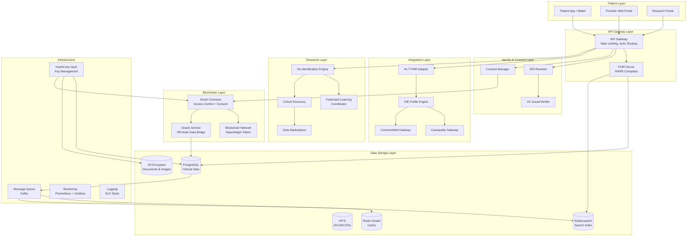
```mermaid
graph TB
    subgraph "Patient Layer"
        PA[Patient App / Wallet]
        PW[Provider Web Portal]
        RA[Research Portal]
    end

    subgraph "API Gateway Layer"
        AG[API Gateway<br/>Rate Limiting, Auth, Routing]
        FHIR[FHIR Server<br/>R4/R5 Compliant]
    end

    subgraph "Identity & Consent Layer"
        DID[DID Resolver]
        VC[VC Issuer/Verifier]
        CM[Consent Manager]
    end

    subgraph "Blockchain Layer"
        SC[Smart Contracts<br/>Access Control + Consent]
        BC[Blockchain Network<br/>Hyperledger Fabric]
        OR[Oracle Service<br/>Off-chain Data Bridge]
    end

    subgraph "Data Storage Layer"
        PG[(PostgreSQL<br/>Clinical Data)]
        S3[(S3 Encrypted<br/>Documents & Images)]
        IPFS[(IPFS<br/>DICOM CIDs)]
        ES[(Elasticsearch<br/>Search Index)]
        RD[(Redis Cluster<br/>Cache)]
    end

    subgraph "Integration Layer"
        HL7[HL7 FHIR Adapter]
        IHE[IHE Profile Engine]
        CQ[Carequality Gateway]
        CW[CommonWell Gateway]
    end

    subgraph "Research Layer"
        DEID[De-identification Engine]
        FL[Federated Learning<br/>Coordinator]
        CD[Cohort Discovery]
        DM[Data Marketplace]
    end

    subgraph "Infrastructure"
        MQ[Message Queue<br/>Kafka]
        MON[Monitoring<br/>Prometheus + Grafana]
        LOG[Logging<br/>ELK Stack]
        VAULT[HashiCorp Vault<br/>Key Management]
    end

    PA --> AG
    PW --> AG
    RA --> AG
    AG --> FHIR
    AG --> DID
    AG --> CM
    FHIR --> PG
    FHIR --> ES
    CM --> SC
    SC --> BC
    DID --> VC
    AG --> HL7
    HL7 --> IHE
    IHE --> CQ
    IHE --> CW
    AG --> DEID
    DEID --> FL
    DEID --> CD
    CD --> DM
    PG --> MQ
    MQ --> ES
    MQ --> RD
    SC --> OR
    OR --> PG
    VAULT --> PG
    VAULT --> S3
    VAULT --> SC
```

### Key Architectural Decisions

1. **Hyperledger Fabric over Public Ethereum**: Permissioned blockchain provides higher throughput, lower latency, no gas costs, and regulatory compliance for healthcare
2. **Off-chain PHI Storage**: All Protected Health Information stored in encrypted off-chain databases; blockchain stores only access control metadata and content hashes
3. **FHIR-Native Design**: All clinical data stored natively as FHIR resources, eliminating translation overhead
4. **Event-Driven Architecture**: Kafka-based event bus for asynchronous processing, ensuring audit completeness and system decoupling
5. **Defense in Depth**: Multiple encryption layers, HSM-backed key management, zero-trust network architecture

---

## Subsystem 1: Patient Identity & Consent Management

### Overview

The Patient Identity & Consent Management subsystem is the cornerstone of the entire platform. It provides a patient-centric identity model using W3C Decentralized Identifiers (DIDs) and Verifiable Credentials (VCs), combined with a granular, blockchain-enforced consent framework.

### Decentralized Identifiers (DIDs)

A DID is a globally unique identifier that the patient controls. Unlike a Medical Record Number (MRN) assigned by a hospital or a Social Security Number assigned by the government, a DID is created and managed by the patient (or their delegate).

#### DID Method: `did:health`

```
did:health:fabric:0x1234567890abcdef1234567890abcdef12345678
```

Components:
- `did` - The DID scheme prefix
- `health` - The DID method name (registered with W3C)
- `fabric` - The blockchain network identifier
- `0x1234...` - The network-specific identifier derived from the patient's public key

#### DID Document Structure

```json
{
  "@context": [
    "https://www.w3.org/ns/did/v1",
    "https://w3id.org/security/suites/ed25519-2020/v1",
    "https://healthid.org/contexts/v1"
  ],
  "id": "did:health:fabric:0x1234567890abcdef",
  "authentication": [
    {
      "id": "did:health:fabric:0x1234567890abcdef#keys-1",
      "type": "Ed25519VerificationKey2020",
      "controller": "did:health:fabric:0x1234567890abcdef",
      "publicKeyMultibase": "z6MkhaXgBZDvotDkL5257faiztiGiC2QtKLGpbnnEGta2doK"
    }
  ],
  "assertionMethod": [
    "did:health:fabric:0x1234567890abcdef#keys-1"
  ],
  "keyAgreement": [
    {
      "id": "did:health:fabric:0x1234567890abcdef#keys-2",
      "type": "X25519KeyAgreementKey2020",
      "controller": "did:health:fabric:0x1234567890abcdef",
      "publicKeyMultibase": "z6LSbysY2xFMRpGMhb7tFTLMpeuPRaqaWM1yECx2AtzE3KCc"
    }
  ],
  "service": [
    {
      "id": "did:health:fabric:0x1234567890abcdef#consent-endpoint",
      "type": "ConsentService",
      "serviceEndpoint": "https://consent.healthplatform.io/api/v1"
    },
    {
      "id": "did:health:fabric:0x1234567890abcdef#data-endpoint",
      "type": "HealthDataService",
      "serviceEndpoint": "https://data.healthplatform.io/fhir/R4"
    }
  ],
  "recovery": [
    {
      "type": "SocialRecovery",
      "threshold": 3,
      "guardians": [
        "did:health:fabric:0xguardian1...",
        "did:health:fabric:0xguardian2...",
        "did:health:fabric:0xguardian3...",
        "did:health:fabric:0xguardian4...",
        "did:health:fabric:0xguardian5..."
      ]
    }
  ]
}
```

### Verifiable Credentials

Verifiable Credentials attest to facts about the patient without revealing unnecessary information. They are issued by trusted parties and can be verified cryptographically without contacting the issuer.

#### Credential Types

| Credential Type | Issuer | Purpose |
|---|---|---|
| PatientIdentityCredential | Government ID authority | Prove identity (name, DOB) |
| InsuranceCoverageCredential | Insurance company | Prove coverage and plan |
| ProviderRelationshipCredential | Healthcare provider | Prove patient-provider relationship |
| AllergyCredential | Provider/Pharmacist | Prove known allergies |
| ImmunizationCredential | Public health authority | Prove vaccination status |
| ConsentDelegationCredential | Patient | Delegate consent authority |
| ResearchConsentCredential | IRB | Prove research consent |
| EmergencyContactCredential | Patient | Authorize emergency contacts |

#### Example Verifiable Credential

```json
{
  "@context": [
    "https://www.w3.org/2018/credentials/v1",
    "https://healthid.org/credentials/v1"
  ],
  "type": ["VerifiableCredential", "PatientIdentityCredential"],
  "issuer": "did:health:fabric:0xStateHealthDept",
  "issuanceDate": "2025-01-15T00:00:00Z",
  "expirationDate": "2030-01-15T00:00:00Z",
  "credentialSubject": {
    "id": "did:health:fabric:0x1234567890abcdef",
    "givenName": "Jane",
    "familyName": "Smith",
    "birthDate": "1985-03-15",
    "gender": "female",
    "identityVerificationLevel": "IAL2"
  },
  "credentialStatus": {
    "id": "https://healthid.org/status/12345",
    "type": "RevocationList2020"
  },
  "proof": {
    "type": "Ed25519Signature2020",
    "created": "2025-01-15T10:30:00Z",
    "verificationMethod": "did:health:fabric:0xStateHealthDept#keys-1",
    "proofPurpose": "assertionMethod",
    "proofValue": "z58DAdFfa9SkqZMVPxAQpic7ndTn..."
  }
}
```

### Zero-Knowledge Proofs for Selective Disclosure

ZK proofs allow patients to prove specific facts about themselves without revealing the underlying data. This is critical for preserving privacy while still enabling necessary verifications.

#### Use Cases

| Scenario | What is Proved | What is NOT Revealed |
|---|---|---|
| Age verification for pediatric care | Patient is under 18 | Exact date of birth |
| Insurance eligibility | Patient has active coverage | Plan details, employer |
| Allergy check at pharmacy | Patient has no known allergy to penicillin | Full allergy list |
| Research eligibility | Patient has Type 2 Diabetes diagnosis | Full medical history |
| Emergency contact | A designated contact exists | Contact identity |

#### ZK Proof Flow

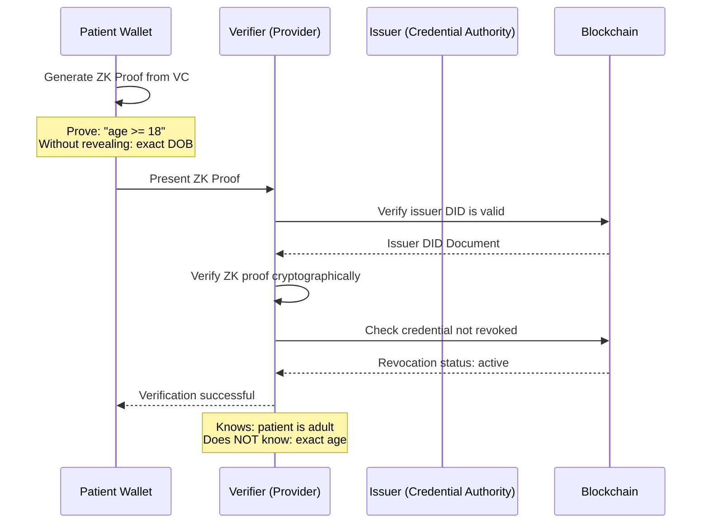
```mermaid
sequenceDiagram
    participant P as Patient Wallet
    participant V as Verifier (Provider)
    participant I as Issuer (Credential Authority)
    participant BC as Blockchain

    P->>P: Generate ZK Proof from VC
    Note over P: Prove: "age >= 18"<br/>Without revealing: exact DOB
    P->>V: Present ZK Proof
    V->>BC: Verify issuer DID is valid
    BC-->>V: Issuer DID Document
    V->>V: Verify ZK proof cryptographically
    V->>BC: Check credential not revoked
    BC-->>V: Revocation status: active
    V-->>P: Verification successful
    Note over V: Knows: patient is adult<br/>Does NOT know: exact age
```

### Granular Consent Framework

The consent model supports fine-grained permissions that go far beyond simple "allow/deny" decisions.

#### Consent Dimensions

```
Consent = {
  who:    [specific provider DID, role, organization],
  what:   [resource types, specific resources, data elements],
  why:    [treatment, payment, operations, research, public health],
  when:   [start date, end date, duration],
  where:  [geographic restrictions, specific facilities],
  how:    [read, write, share downstream, aggregate only]
}
```

#### Consent Record Structure

```json
{
  "consentId": "consent-uuid-12345",
  "patient": "did:health:fabric:0x1234567890abcdef",
  "status": "active",
  "scope": {
    "grantee": {
      "type": "provider",
      "did": "did:health:fabric:0xProviderABC",
      "role": "primary-care-physician",
      "organization": "City Medical Center"
    },
    "resources": {
      "include": [
        "Condition",
        "Observation",
        "MedicationRequest",
        "AllergyIntolerance"
      ],
      "exclude": [
        "Condition?category=psychiatric",
        "Observation?code=HIV"
      ],
      "dateRange": {
        "from": "2020-01-01",
        "to": "2026-12-31"
      }
    },
    "purpose": ["treatment"],
    "permissions": ["read"],
    "restrictions": {
      "noDownstream": true,
      "geofence": "US",
      "maxAccessCount": 100
    }
  },
  "validity": {
    "start": "2025-06-01T00:00:00Z",
    "end": "2026-06-01T00:00:00Z",
    "autoRenew": false
  },
  "metadata": {
    "createdAt": "2025-05-28T14:30:00Z",
    "createdBy": "did:health:fabric:0x1234567890abcdef",
    "txHash": "0xabc123...",
    "blockNumber": 1234567,
    "version": 1
  }
}
```

### Consent Revocation

Revocation must be immediate and comprehensive. When a patient revokes consent, all active access is terminated within seconds.

#### Revocation Flow

1. Patient initiates revocation through wallet or portal
2. Revocation transaction submitted to blockchain
3. Smart contract updates consent state to "revoked"
4. Event emitted on blockchain
5. Event listener in API layer invalidates all cached access tokens
6. Provider's next access attempt is denied
7. Revocation notification sent to affected provider
8. Audit log entry created

### HIPAA Consent Provisions

The system must support HIPAA-specific consent scenarios:

| Scenario | Handling |
|---|---|
| Treatment, Payment, Operations (TPO) | Implied consent; patient can still restrict |
| Psychotherapy Notes | Separate authorization always required |
| HIV/AIDS Status | State-specific consent requirements |
| Substance Abuse (42 CFR Part 2) | Federal restrictions on re-disclosure |
| Minors | Age-dependent; state-specific maturity rules |
| Deceased Patients | Executor/administrator access |
| Research | IRB-approved consent or waiver of consent |
| Marketing | Always requires explicit authorization |
| Genetic Information (GINA) | Special protections against discrimination |

### Identity Recovery

Key loss in a healthcare context could be catastrophic. The system provides multiple recovery mechanisms:

1. **Social Recovery**: Patient designates 5 guardians; 3-of-5 can authorize key rotation
2. **Institutional Recovery**: Patient's primary provider can initiate recovery with identity verification
3. **Hardware Backup**: Encrypted key backup on hardware security module (HSM)
4. **Biometric Recovery**: Fingerprint or facial recognition linked to key escrow
5. **Time-Locked Recovery**: Pre-authorized recovery that activates after a waiting period (7 days) to prevent unauthorized recovery

---

## Subsystem 2: Medical Record Storage

### Overview

The Medical Record Storage subsystem manages the actual health data — clinical notes, lab results, imaging studies, medication records, and more. It employs a dual-layer architecture: encrypted off-chain storage for the data itself, and on-chain pointers and access control for authorization.

### Storage Architecture

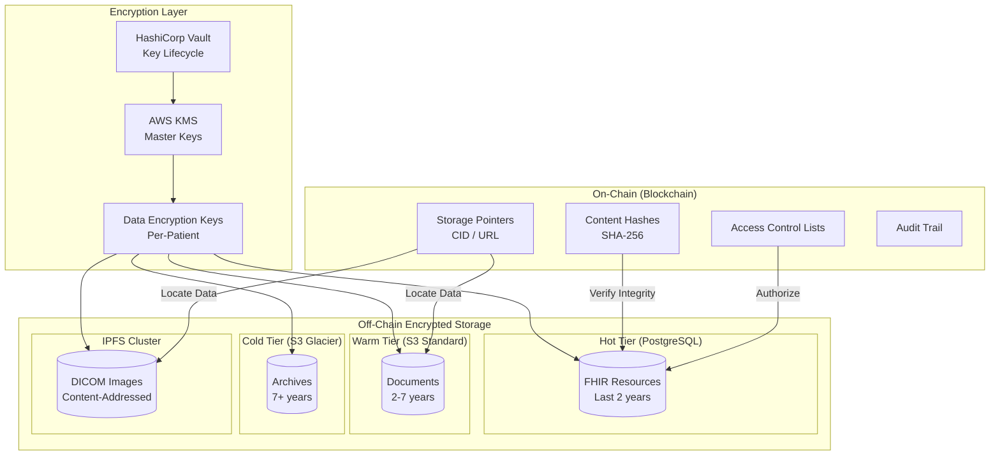
```mermaid
graph TB
    subgraph "On-Chain (Blockchain)"
        ACL[Access Control Lists]
        HASH[Content Hashes<br/>SHA-256]
        PTR[Storage Pointers<br/>CID / URL]
        AUD[Audit Trail]
    end

    subgraph "Off-Chain Encrypted Storage"
        subgraph "Hot Tier (PostgreSQL)"
            FHIR_DB[(FHIR Resources<br/>Last 2 years)]
        end
        subgraph "Warm Tier (S3 Standard)"
            DOCS[(Documents<br/>2-7 years)]
        end
        subgraph "Cold Tier (S3 Glacier)"
            ARCHIVE[(Archives<br/>7+ years)]
        end
        subgraph "IPFS Cluster"
            DICOM_IPFS[(DICOM Images<br/>Content-Addressed)]
        end
    end

    subgraph "Encryption Layer"
        KMS[AWS KMS<br/>Master Keys]
        DEK[Data Encryption Keys<br/>Per-Patient]
        VAULT_K[HashiCorp Vault<br/>Key Lifecycle]
    end

    ACL -->|Authorize| FHIR_DB
    HASH -->|Verify Integrity| FHIR_DB
    PTR -->|Locate Data| DOCS
    PTR -->|Locate Data| DICOM_IPFS
    KMS --> DEK
    DEK --> FHIR_DB
    DEK --> DOCS
    DEK --> ARCHIVE
    DEK --> DICOM_IPFS
    VAULT_K --> KMS
```

### Encryption Strategy

All medical records are encrypted using a hierarchical key management scheme:

#### Key Hierarchy

```
Platform Master Key (PMK)
  |-- stored in HSM, never leaves hardware
  |
  +-- Organization Key (OK)
  |     |-- one per healthcare organization
  |     |
  |     +-- Patient Key (PK)
  |           |-- one per patient
  |           |-- wrapped with patient's DID key
  |           |
  |           +-- Data Encryption Key (DEK)
  |                 |-- one per record or record group
  |                 |-- AES-256-GCM
  |                 |-- rotated annually
  |                 |
  |                 +-- Encrypted Record
```

#### Encryption Specifications

| Layer | Algorithm | Key Size | Purpose |
|---|---|---|---|
| Master Key | RSA-4096 | 4096 bits | Wrap organization keys |
| Organization Key | AES-256-KW | 256 bits | Wrap patient keys |
| Patient Key | AES-256-KW | 256 bits | Wrap data encryption keys |
| Data Encryption Key | AES-256-GCM | 256 bits | Encrypt individual records |
| Key Agreement | X25519 | 256 bits | Derive shared secrets for access grants |
| Digital Signatures | Ed25519 | 256 bits | Sign records and transactions |

### HL7 FHIR Resource Storage

All clinical data is stored natively as FHIR R4 resources. This eliminates translation overhead and ensures interoperability.

#### Supported FHIR Resources

| Resource | Description | Average Size | Index Fields |
|---|---|---|---|
| Patient | Demographics | 2 KB | name, identifier, birthDate |
| Condition | Diagnoses | 1.5 KB | code, clinicalStatus, patient |
| Observation | Lab results, vitals | 2 KB | code, date, patient, value |
| MedicationRequest | Prescriptions | 1.5 KB | medication, patient, status |
| AllergyIntolerance | Allergies | 1 KB | code, patient, clinicalStatus |
| Procedure | Surgical procedures | 2 KB | code, date, patient |
| DiagnosticReport | Reports | 3 KB | code, date, patient |
| ImagingStudy | DICOM metadata | 5 KB | modality, date, patient |
| DocumentReference | Clinical documents | 1 KB + attachment | type, date, patient |
| Immunization | Vaccinations | 1.5 KB | vaccineCode, date, patient |
| CarePlan | Treatment plans | 3 KB | status, patient, category |
| Encounter | Visits | 2 KB | type, date, patient, provider |
| Claim | Insurance claims | 4 KB | patient, provider, status |

### DICOM Image Handling

Medical imaging (X-rays, CT scans, MRIs) presents unique challenges due to file sizes (often hundreds of MB per study) and strict requirements for lossless storage.

#### DICOM Pipeline

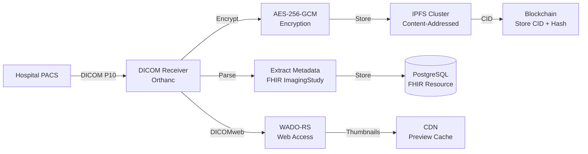
```mermaid
graph LR
    PACS[Hospital PACS] -->|DICOM P10| RECV[DICOM Receiver<br/>Orthanc]
    RECV -->|Parse| META[Extract Metadata<br/>FHIR ImagingStudy]
    RECV -->|Encrypt| ENC[AES-256-GCM<br/>Encryption]
    ENC -->|Store| IPFS_S[IPFS Cluster<br/>Content-Addressed]
    META -->|Store| PG_S[(PostgreSQL<br/>FHIR Resource)]
    IPFS_S -->|CID| BC_S[Blockchain<br/>Store CID + Hash]
    RECV -->|DICOMweb| WADO[WADO-RS<br/>Web Access]
    WADO -->|Thumbnails| CDN_S[CDN<br/>Preview Cache]
```

#### DICOM Storage Details

| Component | Technology | Purpose |
|---|---|---|
| DICOM Receiver | Orthanc (open source) | Receive DICOM from PACS |
| Metadata Extraction | dcm4che library | Extract FHIR ImagingStudy resource |
| Encryption | AES-256-GCM per study | Encrypt pixel data and metadata |
| Storage | IPFS Cluster | Content-addressed, distributed storage |
| Web Access | DICOMweb (WADO-RS) | Standard web-based image retrieval |
| Viewing | OHIF Viewer integration | Zero-footprint web viewer |

### Data Versioning and Provenance

Every record maintains a complete version history and provenance chain:

```json
{
  "resourceType": "Provenance",
  "target": [{"reference": "Observation/lab-result-123"}],
  "recorded": "2025-06-15T10:30:00Z",
  "activity": {
    "coding": [{
      "system": "http://terminology.hl7.org/CodeSystem/v3-DataOperation",
      "code": "CREATE"
    }]
  },
  "agent": [
    {
      "type": {
        "coding": [{
          "system": "http://terminology.hl7.org/CodeSystem/provenance-participant-type",
          "code": "author"
        }]
      },
      "who": {"reference": "Practitioner/dr-johnson-456"},
      "onBehalfOf": {"reference": "Organization/city-medical-center"}
    }
  ],
  "entity": [
    {
      "role": "source",
      "what": {"reference": "Device/lab-analyzer-789"}
    }
  ],
  "signature": [{
    "type": [{
      "system": "urn:iso-astm:E1762-95:2013",
      "code": "1.2.840.10065.1.12.1.1"
    }],
    "when": "2025-06-15T10:30:00Z",
    "who": {"reference": "Practitioner/dr-johnson-456"},
    "sigFormat": "application/jose",
    "data": "eyJhbGciOiJFZDI1NTE5..."
  }]
}
```

---

## Subsystem 3: Access Control Smart Contracts

### Overview

Access control is enforced through smart contracts deployed on Hyperledger Fabric. These contracts implement Role-Based Access Control (RBAC), time-limited grants, emergency break-glass procedures, proxy access, and multi-signature requirements.

### Smart Contract Architecture

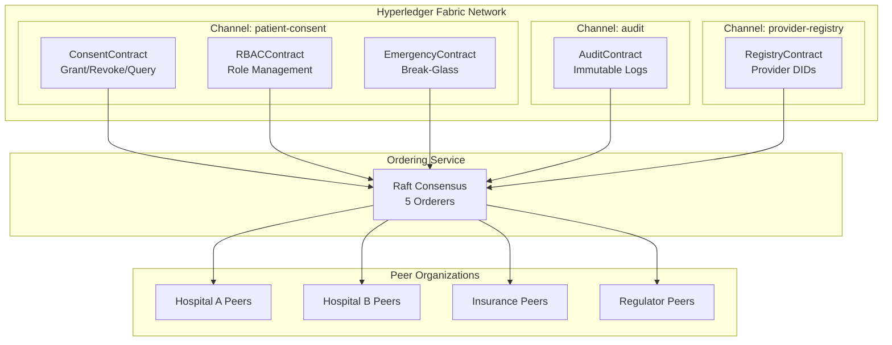
```mermaid
graph TB
    subgraph "Hyperledger Fabric Network"
        subgraph "Channel: patient-consent"
            CC1[ConsentContract<br/>Grant/Revoke/Query]
            CC2[RBACContract<br/>Role Management]
            CC3[EmergencyContract<br/>Break-Glass]
        end
        subgraph "Channel: audit"
            CC4[AuditContract<br/>Immutable Logs]
        end
        subgraph "Channel: provider-registry"
            CC5[RegistryContract<br/>Provider DIDs]
        end
    end

    subgraph "Ordering Service"
        RAFT[Raft Consensus<br/>5 Orderers]
    end

    subgraph "Peer Organizations"
        P1[Hospital A Peers]
        P2[Hospital B Peers]
        P3[Insurance Peers]
        P4[Regulator Peers]
    end

    CC1 --> RAFT
    CC2 --> RAFT
    CC3 --> RAFT
    CC4 --> RAFT
    CC5 --> RAFT
    RAFT --> P1
    RAFT --> P2
    RAFT --> P3
    RAFT --> P4
```

### Consent Smart Contract (Solidity-like Chaincode)

While Hyperledger Fabric uses Go, Java, or Node.js chaincode rather than Solidity, the following uses Solidity syntax for wider readability:

```solidity
// SPDX-License-Identifier: MIT
pragma solidity ^0.8.19;

/**
 * @title HealthcareConsentManager
 * @notice Manages patient consent for healthcare data access
 * @dev Deployed on Hyperledger Fabric (shown in Solidity for readability)
 */
contract HealthcareConsentManager {

    // ============ Enums ============

    enum ConsentStatus { Active, Revoked, Expired, Suspended }
    enum AccessLevel { None, Read, ReadWrite, Emergency }
    enum Purpose { Treatment, Payment, Operations, Research, PublicHealth, Marketing }

    // ============ Structs ============

    struct ConsentGrant {
        bytes32 consentId;
        address patient;         // Patient DID-derived address
        address grantee;         // Provider/Researcher DID-derived address
        bytes32 roleHash;        // Keccak256 of role string
        Purpose[] purposes;
        bytes32[] resourceTypes; // Keccak256 of FHIR resource type names
        bytes32[] excludedResources; // Specific exclusions
        AccessLevel accessLevel;
        uint256 validFrom;
        uint256 validUntil;
        uint256 maxAccessCount;
        uint256 currentAccessCount;
        bool noDownstream;       // Prevent re-sharing
        bytes32 geofenceHash;    // Keccak256 of allowed jurisdictions
        ConsentStatus status;
        uint256 createdAt;
        uint256 revokedAt;
        uint256 version;
    }

    struct EmergencyAccess {
        bytes32 accessId;
        address provider;
        address patient;
        uint256 grantedAt;
        uint256 expiresAt;        // Typically 24-72 hours
        string justification;
        bool reviewed;
        bool justified;
    }

    struct MultiSigRequirement {
        bytes32 resourceHash;
        uint256 requiredSignatures;
        address[] authorizedSigners;
    }

    // ============ State Variables ============

    mapping(bytes32 => ConsentGrant) public consents;
    mapping(address => bytes32[]) public patientConsents;
    mapping(address => bytes32[]) public granteeConsents;
    mapping(bytes32 => EmergencyAccess) public emergencyAccesses;
    mapping(bytes32 => MultiSigRequirement) public multiSigRequirements;
    mapping(address => mapping(bytes32 => bool)) public roles;

    address public admin;
    address public emergencyAdmin;
    uint256 public emergencyDuration = 72 hours;

    // ============ Events ============

    event ConsentGranted(
        bytes32 indexed consentId,
        address indexed patient,
        address indexed grantee,
        Purpose[] purposes,
        uint256 validUntil
    );

    event ConsentRevoked(
        bytes32 indexed consentId,
        address indexed patient,
        address indexed grantee,
        uint256 revokedAt
    );

    event DataAccessed(
        bytes32 indexed consentId,
        address indexed accessor,
        address indexed patient,
        bytes32 resourceType,
        uint256 timestamp
    );

    event EmergencyAccessGranted(
        bytes32 indexed accessId,
        address indexed provider,
        address indexed patient,
        uint256 expiresAt
    );

    event EmergencyAccessReviewed(
        bytes32 indexed accessId,
        bool justified
    );

    // ============ Modifiers ============

    modifier onlyPatient(bytes32 _consentId) {
        require(
            consents[_consentId].patient == msg.sender,
            "Only the patient can perform this action"
        );
        _;
    }

    modifier consentActive(bytes32 _consentId) {
        ConsentGrant storage consent = consents[_consentId];
        require(consent.status == ConsentStatus.Active, "Consent not active");
        require(block.timestamp >= consent.validFrom, "Consent not yet valid");
        require(block.timestamp <= consent.validUntil, "Consent expired");
        _;
    }

    // ============ Core Functions ============

    /**
     * @notice Grant consent for a provider to access patient data
     * @param _grantee The provider's address
     * @param _purposes Array of allowed purposes
     * @param _resourceTypes Array of FHIR resource type hashes
     * @param _excludedResources Array of excluded resource hashes
     * @param _accessLevel The level of access granted
     * @param _validUntil Expiration timestamp
     * @param _maxAccessCount Maximum number of accesses (0 = unlimited)
     * @param _noDownstream Whether re-sharing is prohibited
     * @param _geofenceHash Hash of allowed jurisdictions
     */
    function grantConsent(
        address _grantee,
        Purpose[] calldata _purposes,
        bytes32[] calldata _resourceTypes,
        bytes32[] calldata _excludedResources,
        AccessLevel _accessLevel,
        uint256 _validUntil,
        uint256 _maxAccessCount,
        bool _noDownstream,
        bytes32 _geofenceHash
    ) external returns (bytes32) {
        require(_grantee != address(0), "Invalid grantee");
        require(_validUntil > block.timestamp, "Invalid expiration");
        require(_purposes.length > 0, "At least one purpose required");
        require(_resourceTypes.length > 0, "At least one resource type required");

        bytes32 consentId = keccak256(
            abi.encodePacked(msg.sender, _grantee, block.timestamp, block.number)
        );

        consents[consentId] = ConsentGrant({
            consentId: consentId,
            patient: msg.sender,
            grantee: _grantee,
            roleHash: bytes32(0),
            purposes: _purposes,
            resourceTypes: _resourceTypes,
            excludedResources: _excludedResources,
            accessLevel: _accessLevel,
            validFrom: block.timestamp,
            validUntil: _validUntil,
            maxAccessCount: _maxAccessCount,
            currentAccessCount: 0,
            noDownstream: _noDownstream,
            geofenceHash: _geofenceHash,
            status: ConsentStatus.Active,
            createdAt: block.timestamp,
            revokedAt: 0,
            version: 1
        });

        patientConsents[msg.sender].push(consentId);
        granteeConsents[_grantee].push(consentId);

        emit ConsentGranted(consentId, msg.sender, _grantee, _purposes, _validUntil);

        return consentId;
    }

    /**
     * @notice Revoke consent immediately
     */
    function revokeConsent(bytes32 _consentId) external onlyPatient(_consentId) {
        ConsentGrant storage consent = consents[_consentId];
        require(consent.status == ConsentStatus.Active, "Consent not active");

        consent.status = ConsentStatus.Revoked;
        consent.revokedAt = block.timestamp;

        emit ConsentRevoked(_consentId, consent.patient, consent.grantee, block.timestamp);
    }

    /**
     * @notice Check if access is allowed and log the access
     */
    function checkAndLogAccess(
        bytes32 _consentId,
        bytes32 _resourceType
    ) external consentActive(_consentId) returns (bool) {
        ConsentGrant storage consent = consents[_consentId];

        require(consent.grantee == msg.sender, "Not the authorized grantee");

        // Check resource type is allowed
        bool resourceAllowed = false;
        for (uint i = 0; i < consent.resourceTypes.length; i++) {
            if (consent.resourceTypes[i] == _resourceType) {
                resourceAllowed = true;
                break;
            }
        }
        require(resourceAllowed, "Resource type not in consent scope");

        // Check not excluded
        for (uint i = 0; i < consent.excludedResources.length; i++) {
            require(
                consent.excludedResources[i] != _resourceType,
                "Resource explicitly excluded"
            );
        }

        // Check access count
        if (consent.maxAccessCount > 0) {
            require(
                consent.currentAccessCount < consent.maxAccessCount,
                "Maximum access count reached"
            );
        }

        consent.currentAccessCount++;

        emit DataAccessed(
            _consentId,
            msg.sender,
            consent.patient,
            _resourceType,
            block.timestamp
        );

        return true;
    }

    /**
     * @notice Emergency break-glass access
     */
    function requestEmergencyAccess(
        address _patient,
        string calldata _justification
    ) external returns (bytes32) {
        require(bytes(_justification).length > 0, "Justification required");

        bytes32 accessId = keccak256(
            abi.encodePacked(msg.sender, _patient, block.timestamp)
        );

        uint256 expiresAt = block.timestamp + emergencyDuration;

        emergencyAccesses[accessId] = EmergencyAccess({
            accessId: accessId,
            provider: msg.sender,
            patient: _patient,
            grantedAt: block.timestamp,
            expiresAt: expiresAt,
            justification: _justification,
            reviewed: false,
            justified: false
        });

        emit EmergencyAccessGranted(accessId, msg.sender, _patient, expiresAt);

        return accessId;
    }

    /**
     * @notice Review emergency access after the fact
     */
    function reviewEmergencyAccess(
        bytes32 _accessId,
        bool _justified
    ) external {
        require(msg.sender == admin || msg.sender == emergencyAdmin, "Not authorized");

        EmergencyAccess storage access = emergencyAccesses[_accessId];
        require(!access.reviewed, "Already reviewed");

        access.reviewed = true;
        access.justified = _justified;

        emit EmergencyAccessReviewed(_accessId, _justified);
    }

    /**
     * @notice Query all active consents for a patient
     */
    function getActiveConsents(address _patient) external view returns (bytes32[] memory) {
        bytes32[] memory allConsents = patientConsents[_patient];
        uint256 activeCount = 0;

        for (uint i = 0; i < allConsents.length; i++) {
            if (consents[allConsents[i]].status == ConsentStatus.Active &&
                consents[allConsents[i]].validUntil > block.timestamp) {
                activeCount++;
            }
        }

        bytes32[] memory activeConsents = new bytes32[](activeCount);
        uint256 j = 0;
        for (uint i = 0; i < allConsents.length; i++) {
            if (consents[allConsents[i]].status == ConsentStatus.Active &&
                consents[allConsents[i]].validUntil > block.timestamp) {
                activeConsents[j] = allConsents[i];
                j++;
            }
        }

        return activeConsents;
    }
}
```

### RBAC Role Hierarchy

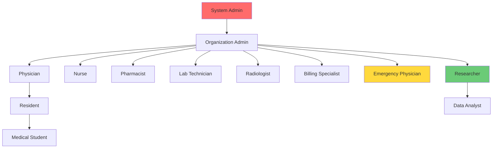
```mermaid
graph TB
    SA[System Admin] --> OA[Organization Admin]
    OA --> PH[Physician]
    OA --> NR[Nurse]
    OA --> PHA[Pharmacist]
    OA --> LAB[Lab Technician]
    OA --> RAD[Radiologist]
    OA --> BIL[Billing Specialist]
    PH --> RES[Resident]
    RES --> STU[Medical Student]
    OA --> ER_DOC[Emergency Physician]
    OA --> RESEARCHER[Researcher]
    RESEARCHER --> DATA_ANALYST[Data Analyst]

    style SA fill:#ff6b6b
    style ER_DOC fill:#ffd93d
    style RESEARCHER fill:#6bcb77
```

#### Permission Matrix

| Role | Clinical Notes | Lab Results | Medications | Images | Psychiatric | HIV Status | Billing |
|---|---|---|---|---|---|---|---|
| Physician (treating) | RW | RW | RW | R | Consent Required | Consent Required | R |
| Nurse | R | R | R | R | No | No | No |
| Pharmacist | No | Limited | RW | No | No | No | No |
| Lab Technician | No | RW (own lab) | No | No | No | No | No |
| Radiologist | R | R | No | RW | No | No | No |
| Billing Specialist | Coded Only | No | Coded Only | No | No | No | RW |
| Emergency Physician | R (Break-Glass) | R (Break-Glass) | R (Break-Glass) | R (Break-Glass) | R (Break-Glass) | R (Break-Glass) | No |
| Researcher | De-identified | De-identified | De-identified | De-identified | No | No | No |

### Multi-Signature Access

Certain sensitive record types require multiple parties to approve access:

| Record Type | Required Signatures | Typical Signers |
|---|---|---|
| Psychiatric Notes | 2-of-3 | Patient + Psychiatrist + Privacy Officer |
| HIV/AIDS Records | 2-of-2 | Patient + Treating Provider |
| Substance Abuse (42 CFR Part 2) | 2-of-2 | Patient + Counselor |
| Genetic/Genomic Data | 2-of-3 | Patient + Geneticist + Genetic Counselor |
| Reproductive Health (Minors) | State-dependent | Minor + Guardian (varies) |

### Emergency Break-Glass Protocol

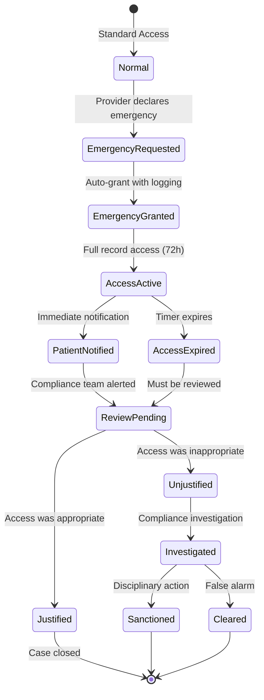
```mermaid
stateDiagram-v2
    [*] --> Normal: Standard Access
    Normal --> EmergencyRequested: Provider declares emergency
    EmergencyRequested --> EmergencyGranted: Auto-grant with logging
    EmergencyGranted --> AccessActive: Full record access (72h)
    AccessActive --> AccessExpired: Timer expires
    AccessActive --> PatientNotified: Immediate notification
    PatientNotified --> ReviewPending: Compliance team alerted
    AccessExpired --> ReviewPending: Must be reviewed
    ReviewPending --> Justified: Access was appropriate
    ReviewPending --> Unjustified: Access was inappropriate
    Justified --> [*]: Case closed
    Unjustified --> Investigated: Compliance investigation
    Investigated --> Sanctioned: Disciplinary action
    Investigated --> Cleared: False alarm
    Sanctioned --> [*]
    Cleared --> [*]
```

---

## Subsystem 4: Cross-Provider Data Exchange

### Overview

Cross-provider data exchange enables seamless sharing of health information between different healthcare organizations, EHR systems, and health information exchanges (HIEs). This subsystem implements standardized protocols and connects to national interoperability frameworks.

### FHIR Interoperability Layer

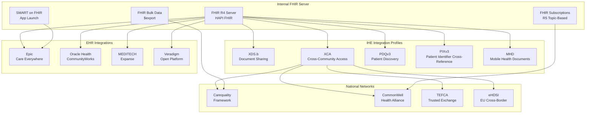
```mermaid
graph TB
    subgraph "Internal FHIR Server"
        FHIR_S[FHIR R4 Server<br/>HAPI FHIR]
        BULK[FHIR Bulk Data<br/>$export]
        SUB[FHIR Subscriptions<br/>R5 Topic-Based]
        SM[SMART on FHIR<br/>App Launch]
    end

    subgraph "IHE Integration Profiles"
        XDS[XDS.b<br/>Document Sharing]
        XCA[XCA<br/>Cross-Community Access]
        PDQ[PDQv3<br/>Patient Discovery]
        PIX[PIXv3<br/>Patient Identifier Cross-Reference]
        MHD[MHD<br/>Mobile Health Documents]
    end

    subgraph "National Networks"
        CQ_N[Carequality<br/>Framework]
        CW_N[CommonWell<br/>Health Alliance]
        TEFCA[TEFCA<br/>Trusted Exchange]
        EHDSI[eHDSI<br/>EU Cross-Border]
    end

    subgraph "EHR Integrations"
        EPIC[Epic<br/>Care Everywhere]
        CERNER[Oracle Health<br/>CommunityWorks]
        MEDITECH[MEDITECH<br/>Expanse]
        ALLSCRIPTS[Veradigm<br/>Open Platform]
    end

    FHIR_S --> XDS
    FHIR_S --> XCA
    FHIR_S --> PDQ
    FHIR_S --> PIX
    FHIR_S --> MHD
    XCA --> CQ_N
    XCA --> CW_N
    XCA --> TEFCA
    XCA --> EHDSI
    FHIR_S --> EPIC
    FHIR_S --> CERNER
    FHIR_S --> MEDITECH
    FHIR_S --> ALLSCRIPTS
    BULK --> CQ_N
    SM --> EPIC
    SUB --> CW_N
```

### IHE Integration Profiles

#### XDS.b (Cross-Enterprise Document Sharing)

| Component | Role | Our Implementation |
|---|---|---|
| Document Source | Publishes documents | Provider EHR adapter |
| Document Consumer | Retrieves documents | FHIR server with XDS facade |
| Document Registry | Index of all documents | Blockchain-backed registry |
| Document Repository | Stores actual documents | Encrypted off-chain storage |

#### XCA (Cross-Community Access)

XCA enables querying across multiple communities (healthcare organizations) that each have their own XDS infrastructure.

| Operation | Description | Endpoint |
|---|---|---|
| Cross Gateway Query | Search for patient documents across communities | `/xca/query` |
| Cross Gateway Retrieve | Retrieve specific documents from remote communities | `/xca/retrieve` |

#### PDQv3 (Patient Demographics Query)

Used to find patients across systems based on demographics. Our implementation enhances PDQ with DID-based matching for higher accuracy.

#### PIXv3 (Patient Identifier Cross-Reference)

Maps patient identifiers across systems. Our enhancement links all identifiers to a patient's DID for authoritative cross-referencing.

### Provider Discovery

Providers must be discoverable for data exchange. The platform maintains a decentralized provider registry.

```json
{
  "providerId": "did:health:fabric:0xProviderABC",
  "npi": "1234567890",
  "name": "City Medical Center",
  "type": "hospital",
  "address": {
    "line": ["123 Main St"],
    "city": "Springfield",
    "state": "IL",
    "postalCode": "62701"
  },
  "endpoints": [
    {
      "type": "fhir-r4",
      "url": "https://fhir.citymedical.org/fhir/R4",
      "status": "active",
      "connectionType": "hl7-fhir-rest"
    },
    {
      "type": "xca-gateway",
      "url": "https://xca.citymedical.org/xca",
      "status": "active",
      "connectionType": "ihe-xca"
    },
    {
      "type": "direct-messaging",
      "url": "mailto:records@direct.citymedical.org",
      "status": "active",
      "connectionType": "direct-project"
    }
  ],
  "networks": ["carequality", "commonwell"],
  "supportedResources": [
    "Patient", "Condition", "Observation",
    "MedicationRequest", "AllergyIntolerance",
    "Procedure", "DiagnosticReport", "ImagingStudy"
  ],
  "trustFramework": {
    "certificateHash": "sha256:abc123...",
    "attestedBy": "did:health:fabric:0xTrustAnchor",
    "attestedAt": "2025-01-01T00:00:00Z"
  }
}
```

### Carequality / CommonWell Integration

| Framework | Focus | Integration Method |
|---|---|---|
| Carequality | Query-based exchange | Implementer agreement + XCPD/XCA |
| CommonWell | Record locator + linking | API integration + patient matching |
| TEFCA | National exchange framework | QHIN qualification + trust policies |

### Data Exchange Sequence

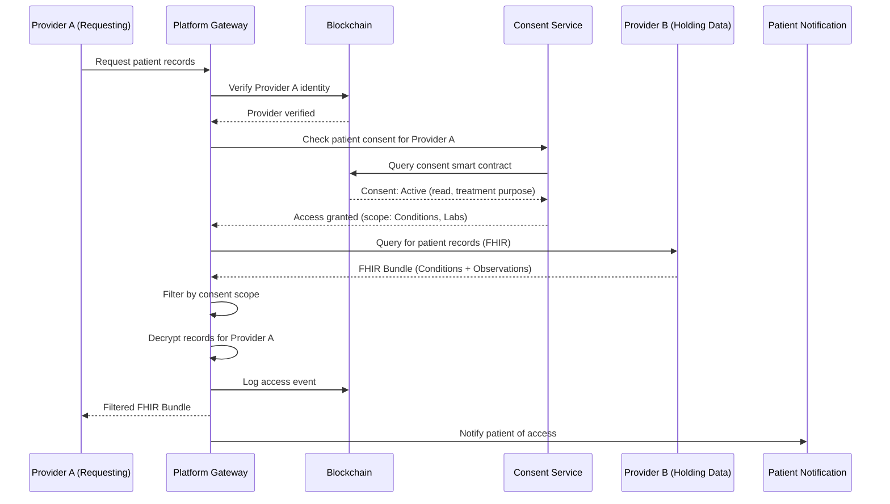
```mermaid
sequenceDiagram
    participant PA as Provider A (Requesting)
    participant GW as Platform Gateway
    participant BC as Blockchain
    participant CS as Consent Service
    participant PB as Provider B (Holding Data)
    participant PT as Patient Notification

    PA->>GW: Request patient records
    GW->>BC: Verify Provider A identity
    BC-->>GW: Provider verified
    GW->>CS: Check patient consent for Provider A
    CS->>BC: Query consent smart contract
    BC-->>CS: Consent: Active (read, treatment purpose)
    CS-->>GW: Access granted (scope: Conditions, Labs)
    GW->>PB: Query for patient records (FHIR)
    PB-->>GW: FHIR Bundle (Conditions + Observations)
    GW->>GW: Filter by consent scope
    GW->>GW: Decrypt records for Provider A
    GW->>BC: Log access event
    GW-->>PA: Filtered FHIR Bundle
    GW->>PT: Notify patient of access
```

### 21st Century Cures Act Compliance

The 21st Century Cures Act (specifically the Information Blocking Rule) requires that healthcare providers, HIT developers, and HIEs do not unreasonably block the exchange of electronic health information.

| Requirement | Platform Compliance |
|---|---|
| No Information Blocking | API-first design; all data available via FHIR |
| Patient Access via API | SMART on FHIR patient app |
| US Core Data for Interoperability (USCDI) | Full USCDI v3 support |
| Standardized APIs | ONC-certified FHIR APIs |
| Anti-Gag Clause | Transparent pricing and access policies |
| Electronic Health Information (EHI) Export | FHIR Bulk Data $export |

---

## Subsystem 5: Research Data Platform

### Overview

The Research Data Platform enables the secondary use of healthcare data for research, public health, and clinical trials while maintaining patient privacy and consent. It supports de-identification, federated learning, cohort discovery, and a data marketplace.

### De-Identification Engine

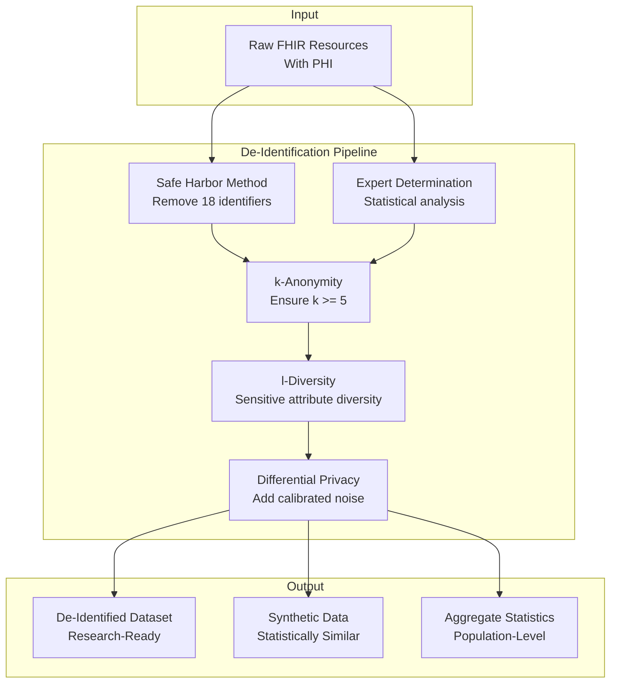
```mermaid
graph TB
    subgraph "Input"
        RAW[Raw FHIR Resources<br/>With PHI]
    end

    subgraph "De-Identification Pipeline"
        SH[Safe Harbor Method<br/>Remove 18 identifiers]
        ED[Expert Determination<br/>Statistical analysis]
        KA[k-Anonymity<br/>Ensure k >= 5]
        LD[l-Diversity<br/>Sensitive attribute diversity]
        DP[Differential Privacy<br/>Add calibrated noise]
    end

    subgraph "Output"
        DEID_OUT[De-Identified Dataset<br/>Research-Ready]
        SYN[Synthetic Data<br/>Statistically Similar]
        AGG[Aggregate Statistics<br/>Population-Level]
    end

    RAW --> SH
    RAW --> ED
    SH --> KA
    ED --> KA
    KA --> LD
    LD --> DP
    DP --> DEID_OUT
    DP --> SYN
    DP --> AGG
```

#### HIPAA Safe Harbor Identifiers (18 Types)

| # | Identifier | Handling |
|---|---|---|
| 1 | Names | Remove or replace with pseudonym |
| 2 | Geographic data (smaller than state) | Generalize to state; zip codes > 20K population keep 3 digits |
| 3 | Dates (except year) | Shift by random offset; ages > 89 grouped as "90+" |
| 4 | Phone numbers | Remove |
| 5 | Fax numbers | Remove |
| 6 | Email addresses | Remove |
| 7 | Social Security numbers | Remove |
| 8 | Medical record numbers | Replace with research ID |
| 9 | Health plan beneficiary numbers | Remove |
| 10 | Account numbers | Remove |
| 11 | Certificate/license numbers | Remove |
| 12 | Vehicle identifiers | Remove |
| 13 | Device identifiers/serial numbers | Remove or generalize |
| 14 | Web URLs | Remove |
| 15 | IP addresses | Remove |
| 16 | Biometric identifiers | Remove |
| 17 | Full-face photographs | Remove |
| 18 | Any other unique identifier | Remove or generalize |

### Federated Learning Architecture

Federated learning enables training machine learning models on distributed datasets without the data ever leaving its source institution. This is critical for healthcare where data cannot be centralized due to privacy and regulatory constraints.

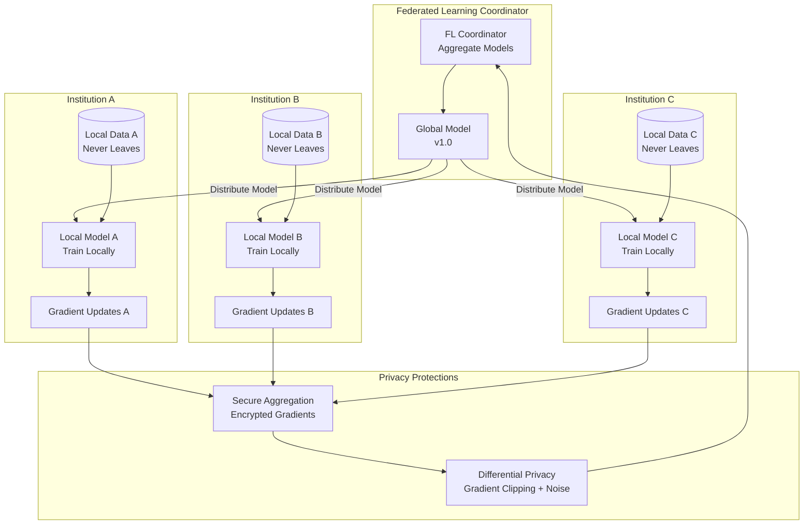
```mermaid
graph TB
    subgraph "Federated Learning Coordinator"
        COORD[FL Coordinator<br/>Aggregate Models]
        GM[Global Model<br/>v1.0]
    end

    subgraph "Institution A"
        DA[(Local Data A<br/>Never Leaves)]
        MA[Local Model A<br/>Train Locally]
        GA[Gradient Updates A]
    end

    subgraph "Institution B"
        DB[(Local Data B<br/>Never Leaves)]
        MB[Local Model B<br/>Train Locally]
        GB[Gradient Updates B]
    end

    subgraph "Institution C"
        DC[(Local Data C<br/>Never Leaves)]
        MC[Local Model C<br/>Train Locally]
        GC[Gradient Updates C]
    end

    subgraph "Privacy Protections"
        SEC[Secure Aggregation<br/>Encrypted Gradients]
        DPL[Differential Privacy<br/>Gradient Clipping + Noise]
    end

    GM -->|Distribute Model| MA
    GM -->|Distribute Model| MB
    GM -->|Distribute Model| MC
    DA --> MA
    DB --> MB
    DC --> MC
    MA --> GA
    MB --> GB
    MC --> GC
    GA --> SEC
    GB --> SEC
    GC --> SEC
    SEC --> DPL
    DPL --> COORD
    COORD --> GM
```

#### Federated Learning Protocol

1. **Initialization**: Coordinator distributes initial model architecture and weights
2. **Local Training**: Each institution trains the model on its local data for N epochs
3. **Gradient Computation**: Local gradients are computed
4. **Privacy Protection**: Differential privacy noise is added; gradients are clipped
5. **Secure Aggregation**: Gradients are encrypted and sent to coordinator
6. **Aggregation**: Coordinator computes weighted average of gradients (FedAvg)
7. **Model Update**: Global model is updated and redistributed
8. **Repeat**: Steps 2-7 repeat until convergence

#### Privacy Guarantees

| Technique | Protection | Trade-off |
|---|---|---|
| Secure Aggregation | Individual gradients never visible to coordinator | Communication overhead |
| Differential Privacy | Formal mathematical privacy guarantee | Reduced model accuracy |
| Gradient Clipping | Prevents memorization of individual records | Slower convergence |
| Model Compression | Reduces information leakage | Slight accuracy reduction |

### Cohort Discovery

Researchers need to find patient populations matching specific criteria without accessing individual records.

#### Cohort Query Language

```json
{
  "queryType": "cohortDiscovery",
  "criteria": {
    "inclusion": [
      {
        "resourceType": "Condition",
        "code": {
          "system": "http://snomed.info/sct",
          "code": "44054006",
          "display": "Type 2 Diabetes Mellitus"
        },
        "onsetAge": { "min": 40, "max": 65 }
      },
      {
        "resourceType": "Observation",
        "code": {
          "system": "http://loinc.org",
          "code": "4548-4",
          "display": "Hemoglobin A1c"
        },
        "value": { "min": 7.0, "unit": "%" }
      }
    ],
    "exclusion": [
      {
        "resourceType": "Condition",
        "code": {
          "system": "http://snomed.info/sct",
          "code": "73211009",
          "display": "Diabetes mellitus, Type 1"
        }
      }
    ],
    "demographics": {
      "ageRange": { "min": 40, "max": 65 },
      "gender": ["male", "female"]
    }
  },
  "output": "aggregateCountOnly",
  "minimumCellSize": 10
}
```

#### Cohort Discovery Response

```json
{
  "queryId": "query-uuid-789",
  "status": "completed",
  "results": {
    "totalMatchingPatients": 45230,
    "byInstitution": [
      { "institution": "City Medical Center", "count": 12500 },
      { "institution": "Regional Health System", "count": 8900 },
      { "institution": "University Hospital", "count": 15300 },
      { "institution": "Community Clinics Network", "count": 8530 }
    ],
    "demographics": {
      "ageDistribution": {
        "40-45": 8200,
        "46-50": 10100,
        "51-55": 11500,
        "56-60": 9800,
        "61-65": 5630
      },
      "genderDistribution": {
        "male": 24100,
        "female": 21130
      }
    },
    "note": "All counts rounded to nearest 10; cells < 10 suppressed"
  }
}
```

### Data Marketplace

The data marketplace allows researchers to request access to consented, de-identified datasets. Patients who opt into research can receive compensation through the platform.

| Feature | Description |
|---|---|
| Dataset Listing | Browse available de-identified datasets by condition, size, demographics |
| Pricing | Per-record or per-dataset pricing set by data governance committee |
| Patient Compensation | Patients receive micro-payments for contributing consented data |
| Smart Contract Escrow | Payment held in escrow until data delivery confirmed |
| Usage Tracking | On-chain record of who accessed what data for what purpose |
| Re-identification Risk Score | Each dataset has an assessed re-identification risk |
| Data Use Agreement | Smart contract-enforced data use agreements |

### Genomic Data Handling

Genomic data requires special treatment due to its unique characteristics:

| Challenge | Solution |
|---|---|
| Size (100 GB+ per genome) | Compressed VCF storage; only variants stored |
| Re-identification risk | Genomic data is inherently identifying; enhanced de-identification |
| Family implications | Consent covers family notification preferences |
| Discrimination risk (GINA) | Separate consent and access controls |
| Long-term relevance | Genomic data relevant for patient's lifetime |
| Evolving interpretation | Support for re-analysis as science advances |

### Clinical Trial Integration

The platform supports clinical trial recruitment and data collection:

1. **Eligibility Matching**: Researchers define criteria; platform finds matching, consenting patients
2. **eConsent**: Electronic informed consent with smart contract enforcement
3. **Data Collection**: FHIR-based electronic Case Report Forms (eCRFs)
4. **Adverse Event Reporting**: Automated adverse event detection and FDA reporting
5. **Real-World Evidence**: Post-market surveillance using routine clinical data

---

## Low-Level Design

### Service Architecture

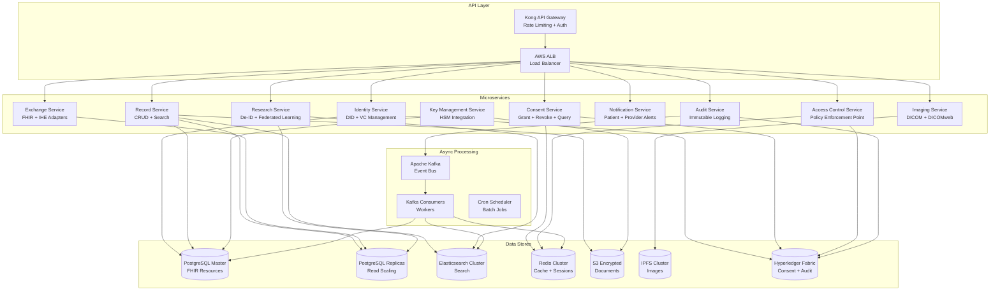
```mermaid
graph TB
    subgraph "API Layer"
        GW[Kong API Gateway<br/>Rate Limiting + Auth]
        LB[AWS ALB<br/>Load Balancer]
    end

    subgraph "Microservices"
        IDS[Identity Service<br/>DID + VC Management]
        CNS[Consent Service<br/>Grant + Revoke + Query]
        RCS[Record Service<br/>CRUD + Search]
        ACS[Access Control Service<br/>Policy Enforcement Point]
        EXS[Exchange Service<br/>FHIR + IHE Adapters]
        RES[Research Service<br/>De-ID + Federated Learning]
        NTS[Notification Service<br/>Patient + Provider Alerts]
        ADS[Audit Service<br/>Immutable Logging]
        KMS_S[Key Management Service<br/>HSM Integration]
        IMG[Imaging Service<br/>DICOM + DICOMweb]
    end

    subgraph "Data Stores"
        PG_M[(PostgreSQL Master<br/>FHIR Resources)]
        PG_R[(PostgreSQL Replicas<br/>Read Scaling)]
        ES_C[(Elasticsearch Cluster<br/>Search)]
        RD_C[(Redis Cluster<br/>Cache + Sessions)]
        S3_E[(S3 Encrypted<br/>Documents)]
        IPFS_C[(IPFS Cluster<br/>Images)]
        HLF[(Hyperledger Fabric<br/>Consent + Audit)]
    end

    subgraph "Async Processing"
        KFK[Apache Kafka<br/>Event Bus]
        KFK_C[Kafka Consumers<br/>Workers]
        CRN[Cron Scheduler<br/>Batch Jobs]
    end

    GW --> LB
    LB --> IDS
    LB --> CNS
    LB --> RCS
    LB --> ACS
    LB --> EXS
    LB --> RES
    LB --> NTS
    LB --> ADS
    LB --> IMG
    IDS --> PG_M
    IDS --> HLF
    CNS --> HLF
    CNS --> RD_C
    RCS --> PG_M
    RCS --> PG_R
    RCS --> ES_C
    RCS --> S3_E
    ACS --> HLF
    ACS --> RD_C
    EXS --> PG_R
    RES --> PG_R
    RES --> ES_C
    ADS --> HLF
    ADS --> KFK
    KMS_S --> PG_M
    KMS_S --> S3_E
    IMG --> IPFS_C
    KFK --> KFK_C
    KFK_C --> ES_C
    KFK_C --> RD_C
    KFK_C --> PG_M
```

### Component Details

| Service | Technology | Instances | CPU | Memory | Key Dependencies |
|---|---|---|---|---|---|
| Identity Service | Go | 6 | 2 vCPU | 4 GB | PostgreSQL, Hyperledger Fabric |
| Consent Service | Go | 8 | 4 vCPU | 8 GB | Hyperledger Fabric, Redis |
| Record Service | Java (Spring Boot) | 12 | 4 vCPU | 16 GB | PostgreSQL, Elasticsearch, S3 |
| Access Control Service | Go | 10 | 2 vCPU | 4 GB | Hyperledger Fabric, Redis |
| Exchange Service | Java (HAPI FHIR) | 8 | 4 vCPU | 16 GB | PostgreSQL, Redis |
| Research Service | Python (FastAPI) | 6 | 8 vCPU | 32 GB | PostgreSQL, Elasticsearch |
| Notification Service | Node.js | 4 | 2 vCPU | 4 GB | Kafka, Redis |
| Audit Service | Go | 6 | 2 vCPU | 4 GB | Kafka, Hyperledger Fabric |
| Key Management Service | Go | 4 (HSM-backed) | 2 vCPU | 4 GB | HashiCorp Vault, AWS KMS |
| Imaging Service | Python | 4 | 4 vCPU | 16 GB | IPFS, Orthanc |

---

## Data Models

### PostgreSQL Schema

```sql
-- ============================================================
-- Patient Identity
-- ============================================================

CREATE TABLE patients (
    id UUID PRIMARY KEY DEFAULT gen_random_uuid(),
    did VARCHAR(256) UNIQUE NOT NULL,
    did_document JSONB NOT NULL,
    identity_verification_level VARCHAR(10) NOT NULL DEFAULT 'IAL1',
    status VARCHAR(20) NOT NULL DEFAULT 'active',
    created_at TIMESTAMPTZ NOT NULL DEFAULT NOW(),
    updated_at TIMESTAMPTZ NOT NULL DEFAULT NOW(),
    metadata JSONB DEFAULT '{}'::jsonb
);

CREATE INDEX idx_patients_did ON patients(did);
CREATE INDEX idx_patients_status ON patients(status);

-- ============================================================
-- Patient Identity Links (MRNs from various providers)
-- ============================================================

CREATE TABLE patient_identity_links (
    id UUID PRIMARY KEY DEFAULT gen_random_uuid(),
    patient_id UUID NOT NULL REFERENCES patients(id),
    provider_id UUID NOT NULL REFERENCES providers(id),
    mrn VARCHAR(100) NOT NULL,
    link_status VARCHAR(20) NOT NULL DEFAULT 'active',
    verified_at TIMESTAMPTZ,
    verified_by VARCHAR(256),
    created_at TIMESTAMPTZ NOT NULL DEFAULT NOW(),
    UNIQUE(provider_id, mrn)
);

CREATE INDEX idx_identity_links_patient ON patient_identity_links(patient_id);
CREATE INDEX idx_identity_links_provider_mrn ON patient_identity_links(provider_id, mrn);

-- ============================================================
-- Healthcare Providers
-- ============================================================

CREATE TABLE providers (
    id UUID PRIMARY KEY DEFAULT gen_random_uuid(),
    did VARCHAR(256) UNIQUE NOT NULL,
    npi VARCHAR(10) UNIQUE,
    name VARCHAR(500) NOT NULL,
    type VARCHAR(50) NOT NULL,
    organization_id UUID REFERENCES organizations(id),
    specialty_codes JSONB DEFAULT '[]'::jsonb,
    endpoints JSONB DEFAULT '[]'::jsonb,
    status VARCHAR(20) NOT NULL DEFAULT 'active',
    created_at TIMESTAMPTZ NOT NULL DEFAULT NOW(),
    updated_at TIMESTAMPTZ NOT NULL DEFAULT NOW()
);

CREATE INDEX idx_providers_did ON providers(did);
CREATE INDEX idx_providers_npi ON providers(npi);
CREATE INDEX idx_providers_org ON providers(organization_id);

-- ============================================================
-- Organizations (Hospitals, Clinics, etc.)
-- ============================================================

CREATE TABLE organizations (
    id UUID PRIMARY KEY DEFAULT gen_random_uuid(),
    did VARCHAR(256) UNIQUE NOT NULL,
    name VARCHAR(500) NOT NULL,
    type VARCHAR(50) NOT NULL,
    address JSONB,
    network_memberships JSONB DEFAULT '[]'::jsonb,
    fhir_endpoint VARCHAR(500),
    status VARCHAR(20) NOT NULL DEFAULT 'active',
    created_at TIMESTAMPTZ NOT NULL DEFAULT NOW(),
    updated_at TIMESTAMPTZ NOT NULL DEFAULT NOW()
);

-- ============================================================
-- FHIR Resources (Generalized Table)
-- ============================================================

CREATE TABLE fhir_resources (
    id UUID PRIMARY KEY DEFAULT gen_random_uuid(),
    fhir_id VARCHAR(100) NOT NULL,
    resource_type VARCHAR(50) NOT NULL,
    version_id INTEGER NOT NULL DEFAULT 1,
    patient_id UUID NOT NULL REFERENCES patients(id),
    provider_id UUID REFERENCES providers(id),
    organization_id UUID REFERENCES organizations(id),
    resource_data JSONB NOT NULL,
    encrypted_data BYTEA,
    encryption_key_id VARCHAR(100),
    content_hash VARCHAR(64) NOT NULL,
    status VARCHAR(20) NOT NULL DEFAULT 'active',
    effective_date TIMESTAMPTZ,
    created_at TIMESTAMPTZ NOT NULL DEFAULT NOW(),
    updated_at TIMESTAMPTZ NOT NULL DEFAULT NOW(),
    deleted_at TIMESTAMPTZ,
    UNIQUE(fhir_id, resource_type, version_id)
);

CREATE INDEX idx_fhir_resources_patient ON fhir_resources(patient_id);
CREATE INDEX idx_fhir_resources_type ON fhir_resources(resource_type);
CREATE INDEX idx_fhir_resources_type_patient ON fhir_resources(resource_type, patient_id);
CREATE INDEX idx_fhir_resources_effective ON fhir_resources(effective_date);
CREATE INDEX idx_fhir_resources_hash ON fhir_resources(content_hash);
CREATE INDEX idx_fhir_resources_data ON fhir_resources USING GIN(resource_data jsonb_path_ops);

-- ============================================================
-- Consent Records (Off-chain mirror of blockchain state)
-- ============================================================

CREATE TABLE consent_records (
    id UUID PRIMARY KEY DEFAULT gen_random_uuid(),
    consent_id VARCHAR(66) NOT NULL UNIQUE,
    patient_id UUID NOT NULL REFERENCES patients(id),
    grantee_did VARCHAR(256) NOT NULL,
    grantee_type VARCHAR(50) NOT NULL,
    purposes TEXT[] NOT NULL,
    resource_types TEXT[] NOT NULL,
    excluded_resources TEXT[] DEFAULT '{}',
    access_level VARCHAR(20) NOT NULL,
    valid_from TIMESTAMPTZ NOT NULL,
    valid_until TIMESTAMPTZ NOT NULL,
    max_access_count INTEGER DEFAULT 0,
    current_access_count INTEGER DEFAULT 0,
    no_downstream BOOLEAN DEFAULT false,
    geofence VARCHAR(10),
    status VARCHAR(20) NOT NULL DEFAULT 'active',
    blockchain_tx_hash VARCHAR(66),
    block_number BIGINT,
    version INTEGER DEFAULT 1,
    created_at TIMESTAMPTZ NOT NULL DEFAULT NOW(),
    revoked_at TIMESTAMPTZ,
    metadata JSONB DEFAULT '{}'::jsonb
);

CREATE INDEX idx_consent_patient ON consent_records(patient_id);
CREATE INDEX idx_consent_grantee ON consent_records(grantee_did);
CREATE INDEX idx_consent_status ON consent_records(status);
CREATE INDEX idx_consent_valid ON consent_records(valid_from, valid_until);

-- ============================================================
-- Audit Log (Off-chain supplement to blockchain audit)
-- ============================================================

CREATE TABLE audit_logs (
    id UUID PRIMARY KEY DEFAULT gen_random_uuid(),
    event_type VARCHAR(50) NOT NULL,
    actor_did VARCHAR(256) NOT NULL,
    actor_role VARCHAR(50),
    patient_id UUID REFERENCES patients(id),
    resource_type VARCHAR(50),
    resource_id UUID,
    consent_id VARCHAR(66),
    action VARCHAR(20) NOT NULL,
    outcome VARCHAR(20) NOT NULL,
    ip_address INET,
    user_agent TEXT,
    request_id VARCHAR(100),
    details JSONB DEFAULT '{}'::jsonb,
    blockchain_tx_hash VARCHAR(66),
    created_at TIMESTAMPTZ NOT NULL DEFAULT NOW()
) PARTITION BY RANGE (created_at);

-- Create monthly partitions
CREATE TABLE audit_logs_2025_01 PARTITION OF audit_logs
    FOR VALUES FROM ('2025-01-01') TO ('2025-02-01');
CREATE TABLE audit_logs_2025_02 PARTITION OF audit_logs
    FOR VALUES FROM ('2025-02-01') TO ('2025-03-01');
-- ... additional partitions created by automation

CREATE INDEX idx_audit_actor ON audit_logs(actor_did);
CREATE INDEX idx_audit_patient ON audit_logs(patient_id);
CREATE INDEX idx_audit_event_type ON audit_logs(event_type);
CREATE INDEX idx_audit_created ON audit_logs(created_at);

-- ============================================================
-- Emergency Access Records
-- ============================================================

CREATE TABLE emergency_access_records (
    id UUID PRIMARY KEY DEFAULT gen_random_uuid(),
    access_id VARCHAR(66) NOT NULL UNIQUE,
    provider_did VARCHAR(256) NOT NULL,
    patient_id UUID NOT NULL REFERENCES patients(id),
    justification TEXT NOT NULL,
    granted_at TIMESTAMPTZ NOT NULL,
    expires_at TIMESTAMPTZ NOT NULL,
    reviewed BOOLEAN DEFAULT false,
    justified BOOLEAN,
    reviewer_did VARCHAR(256),
    reviewed_at TIMESTAMPTZ,
    review_notes TEXT,
    blockchain_tx_hash VARCHAR(66),
    created_at TIMESTAMPTZ NOT NULL DEFAULT NOW()
);

CREATE INDEX idx_emergency_patient ON emergency_access_records(patient_id);
CREATE INDEX idx_emergency_provider ON emergency_access_records(provider_did);
CREATE INDEX idx_emergency_reviewed ON emergency_access_records(reviewed);

-- ============================================================
-- Research Datasets
-- ============================================================

CREATE TABLE research_datasets (
    id UUID PRIMARY KEY DEFAULT gen_random_uuid(),
    name VARCHAR(500) NOT NULL,
    description TEXT,
    condition_codes JSONB DEFAULT '[]'::jsonb,
    patient_count INTEGER NOT NULL,
    record_count INTEGER NOT NULL,
    de_identification_method VARCHAR(50) NOT NULL,
    re_identification_risk_score DECIMAL(5,4),
    available_from TIMESTAMPTZ,
    available_until TIMESTAMPTZ,
    price_per_record DECIMAL(10,4),
    data_use_agreement_hash VARCHAR(66),
    status VARCHAR(20) NOT NULL DEFAULT 'pending',
    created_at TIMESTAMPTZ NOT NULL DEFAULT NOW(),
    updated_at TIMESTAMPTZ NOT NULL DEFAULT NOW()
);

-- ============================================================
-- Encryption Keys Metadata
-- ============================================================

CREATE TABLE encryption_keys (
    id UUID PRIMARY KEY DEFAULT gen_random_uuid(),
    key_id VARCHAR(100) UNIQUE NOT NULL,
    patient_id UUID REFERENCES patients(id),
    key_type VARCHAR(20) NOT NULL,
    algorithm VARCHAR(20) NOT NULL DEFAULT 'AES-256-GCM',
    vault_path VARCHAR(500) NOT NULL,
    status VARCHAR(20) NOT NULL DEFAULT 'active',
    rotation_date TIMESTAMPTZ,
    created_at TIMESTAMPTZ NOT NULL DEFAULT NOW(),
    expires_at TIMESTAMPTZ
);

CREATE INDEX idx_encryption_keys_patient ON encryption_keys(patient_id);
CREATE INDEX idx_encryption_keys_status ON encryption_keys(status);
```

### FHIR Resource Examples

#### Patient Resource

```json
{
  "resourceType": "Patient",
  "id": "patient-jane-smith",
  "meta": {
    "versionId": "3",
    "lastUpdated": "2025-06-15T10:30:00Z",
    "profile": ["http://hl7.org/fhir/us/core/StructureDefinition/us-core-patient"]
  },
  "identifier": [
    {
      "system": "urn:oid:did:health:fabric",
      "value": "did:health:fabric:0x1234567890abcdef"
    },
    {
      "system": "http://citymedical.org/mrn",
      "value": "MRN-12345"
    }
  ],
  "active": true,
  "name": [
    {
      "use": "official",
      "family": "Smith",
      "given": ["Jane", "Marie"]
    }
  ],
  "gender": "female",
  "birthDate": "1985-03-15",
  "address": [
    {
      "use": "home",
      "line": ["456 Oak Avenue"],
      "city": "Springfield",
      "state": "IL",
      "postalCode": "62701"
    }
  ],
  "telecom": [
    {
      "system": "phone",
      "value": "555-0123",
      "use": "mobile"
    }
  ]
}
```

---

## API Design

### FHIR REST API

#### Base URL
```
https://api.healthplatform.io/fhir/R4
```

#### Patient Access Endpoints

| Method | Path | Description |
|---|---|---|
| GET | `/Patient/{id}` | Read patient demographics |
| GET | `/Patient/{id}/$everything` | Get all patient data |
| GET | `/Condition?patient={id}` | Search conditions |
| GET | `/Observation?patient={id}&code={loinc}` | Search observations |
| GET | `/MedicationRequest?patient={id}` | Search medications |
| GET | `/AllergyIntolerance?patient={id}` | Search allergies |
| GET | `/ImagingStudy?patient={id}` | Search imaging studies |
| POST | `/Observation` | Create new observation |
| PUT | `/Observation/{id}` | Update observation |
| GET | `/$export` | Bulk data export |

#### Consent Management API

| Method | Path | Description |
|---|---|---|
| POST | `/api/v1/consent` | Create new consent grant |
| GET | `/api/v1/consent/{id}` | Get consent details |
| PUT | `/api/v1/consent/{id}` | Update consent |
| DELETE | `/api/v1/consent/{id}` | Revoke consent |
| GET | `/api/v1/consent?patient={did}` | List patient consents |
| GET | `/api/v1/consent?grantee={did}` | List grantee consents |
| POST | `/api/v1/consent/verify` | Verify access permission |

#### Identity API

| Method | Path | Description |
|---|---|---|
| POST | `/api/v1/identity/did` | Create new DID |
| GET | `/api/v1/identity/did/{did}` | Resolve DID |
| PUT | `/api/v1/identity/did/{did}` | Update DID document |
| POST | `/api/v1/identity/vc/issue` | Issue verifiable credential |
| POST | `/api/v1/identity/vc/verify` | Verify verifiable credential |
| POST | `/api/v1/identity/vc/revoke` | Revoke verifiable credential |
| POST | `/api/v1/identity/zk/prove` | Generate ZK proof |
| POST | `/api/v1/identity/zk/verify` | Verify ZK proof |

#### Research API

| Method | Path | Description |
|---|---|---|
| POST | `/api/v1/research/cohort/query` | Execute cohort discovery query |
| GET | `/api/v1/research/cohort/query/{id}` | Get cohort query results |
| GET | `/api/v1/research/datasets` | List available datasets |
| POST | `/api/v1/research/datasets/{id}/request` | Request dataset access |
| POST | `/api/v1/research/federated/job` | Create federated learning job |
| GET | `/api/v1/research/federated/job/{id}` | Get FL job status |

#### Emergency Access API

| Method | Path | Description |
|---|---|---|
| POST | `/api/v1/emergency/access` | Request emergency break-glass |
| GET | `/api/v1/emergency/access/{id}` | Get emergency access details |
| PUT | `/api/v1/emergency/access/{id}/review` | Review emergency access |

### Smart Contract ABI (Key Functions)

```json
[
  {
    "name": "grantConsent",
    "type": "function",
    "inputs": [
      {"name": "_grantee", "type": "address"},
      {"name": "_purposes", "type": "uint8[]"},
      {"name": "_resourceTypes", "type": "bytes32[]"},
      {"name": "_excludedResources", "type": "bytes32[]"},
      {"name": "_accessLevel", "type": "uint8"},
      {"name": "_validUntil", "type": "uint256"},
      {"name": "_maxAccessCount", "type": "uint256"},
      {"name": "_noDownstream", "type": "bool"},
      {"name": "_geofenceHash", "type": "bytes32"}
    ],
    "outputs": [{"name": "consentId", "type": "bytes32"}]
  },
  {
    "name": "revokeConsent",
    "type": "function",
    "inputs": [{"name": "_consentId", "type": "bytes32"}],
    "outputs": []
  },
  {
    "name": "checkAndLogAccess",
    "type": "function",
    "inputs": [
      {"name": "_consentId", "type": "bytes32"},
      {"name": "_resourceType", "type": "bytes32"}
    ],
    "outputs": [{"name": "allowed", "type": "bool"}]
  },
  {
    "name": "requestEmergencyAccess",
    "type": "function",
    "inputs": [
      {"name": "_patient", "type": "address"},
      {"name": "_justification", "type": "string"}
    ],
    "outputs": [{"name": "accessId", "type": "bytes32"}]
  },
  {
    "name": "getActiveConsents",
    "type": "function",
    "stateMutability": "view",
    "inputs": [{"name": "_patient", "type": "address"}],
    "outputs": [{"name": "", "type": "bytes32[]"}]
  }
]
```

### API Authentication Flow

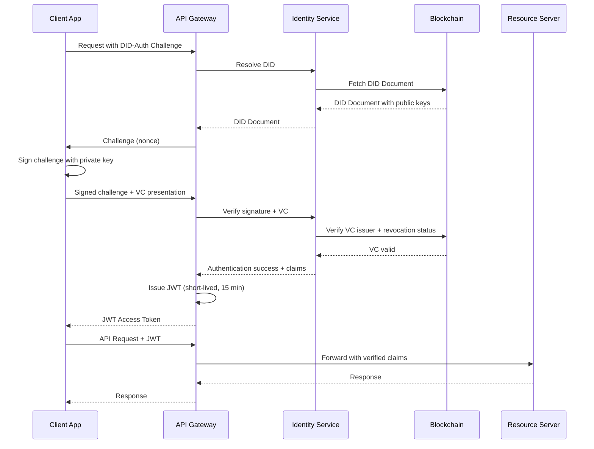
```mermaid
sequenceDiagram
    participant C as Client App
    participant GW as API Gateway
    participant IDS as Identity Service
    participant BC as Blockchain
    participant RS as Resource Server

    C->>GW: Request with DID-Auth Challenge
    GW->>IDS: Resolve DID
    IDS->>BC: Fetch DID Document
    BC-->>IDS: DID Document with public keys
    IDS-->>GW: DID Document
    GW->>C: Challenge (nonce)
    C->>C: Sign challenge with private key
    C->>GW: Signed challenge + VC presentation
    GW->>IDS: Verify signature + VC
    IDS->>BC: Verify VC issuer + revocation status
    BC-->>IDS: VC valid
    IDS-->>GW: Authentication success + claims
    GW->>GW: Issue JWT (short-lived, 15 min)
    GW-->>C: JWT Access Token
    C->>GW: API Request + JWT
    GW->>RS: Forward with verified claims
    RS-->>GW: Response
    GW-->>C: Response
```

---

## Indexing Strategy

### PostgreSQL Indexes

```sql
-- Primary access patterns
CREATE INDEX idx_fhir_patient_type ON fhir_resources(patient_id, resource_type);
CREATE INDEX idx_fhir_type_effective ON fhir_resources(resource_type, effective_date DESC);
CREATE INDEX idx_fhir_patient_type_status ON fhir_resources(patient_id, resource_type, status);

-- FHIR search parameter indexes (GIN for JSONB)
CREATE INDEX idx_fhir_data_code ON fhir_resources USING GIN(
    (resource_data -> 'code' -> 'coding') jsonb_path_ops
);
CREATE INDEX idx_fhir_data_status ON fhir_resources USING GIN(
    (resource_data -> 'status') jsonb_path_ops
);

-- Partial indexes for active records
CREATE INDEX idx_fhir_active ON fhir_resources(patient_id, resource_type)
    WHERE status = 'active' AND deleted_at IS NULL;

-- Consent lookup indexes
CREATE INDEX idx_consent_active_patient ON consent_records(patient_id)
    WHERE status = 'active';
CREATE INDEX idx_consent_active_grantee ON consent_records(grantee_did)
    WHERE status = 'active';
```

### Elasticsearch Mappings

```json
{
  "mappings": {
    "properties": {
      "patient_id": { "type": "keyword" },
      "resource_type": { "type": "keyword" },
      "effective_date": { "type": "date" },
      "status": { "type": "keyword" },
      "codes": {
        "type": "nested",
        "properties": {
          "system": { "type": "keyword" },
          "code": { "type": "keyword" },
          "display": { "type": "text", "analyzer": "medical_analyzer" }
        }
      },
      "text_content": {
        "type": "text",
        "analyzer": "medical_analyzer",
        "fields": {
          "exact": { "type": "keyword" }
        }
      },
      "provider_name": { "type": "text" },
      "organization_name": { "type": "text" },
      "value_quantity": {
        "properties": {
          "value": { "type": "float" },
          "unit": { "type": "keyword" }
        }
      }
    }
  },
  "settings": {
    "analysis": {
      "analyzer": {
        "medical_analyzer": {
          "type": "custom",
          "tokenizer": "standard",
          "filter": ["lowercase", "medical_synonyms", "snowball"]
        }
      },
      "filter": {
        "medical_synonyms": {
          "type": "synonym",
          "synonyms_path": "analysis/medical_synonyms.txt"
        }
      }
    }
  }
}
```

---

## Caching Strategy

### Cache Layers

| Layer | Technology | TTL | Purpose |
|---|---|---|---|
| L1: Application Cache | In-process LRU | 5 min | Hot path data (consent decisions) |
| L2: Distributed Cache | Redis Cluster | 15 min | Shared cache (FHIR resources, consent state) |
| L3: CDN Cache | CloudFront | 1 hour | Static resources, FHIR capability statements |

### Cache Key Design

```
# Consent cache (most critical for latency)
consent:active:{patient_did}:{grantee_did} -> ConsentGrant[]
consent:emergency:{patient_did} -> EmergencyAccess[]

# FHIR resource cache
fhir:{resource_type}:{resource_id}:{version} -> FHIR Resource JSON

# Patient summary cache
patient:summary:{patient_did} -> Aggregated patient summary

# Provider cache
provider:{provider_did} -> Provider details + endpoints

# DID resolution cache
did:resolve:{did} -> DID Document
```

### Cache Invalidation

| Event | Invalidation Action |
|---|---|
| Consent granted | Invalidate `consent:active:{patient}:*` |
| Consent revoked | Invalidate `consent:active:{patient}:{grantee}`, publish revocation event |
| Record created | Invalidate `fhir:{type}:{id}:*`, `patient:summary:{patient}` |
| Record updated | Invalidate specific resource cache |
| Emergency access | Invalidate `consent:emergency:{patient}` |
| Provider update | Invalidate `provider:{did}` |

### Cache-Aside Pattern for Consent Checks

```python
async def check_consent(patient_did: str, grantee_did: str, resource_type: str) -> bool:
    cache_key = f"consent:active:{patient_did}:{grantee_did}"

    # L1: Check application cache
    cached = app_cache.get(cache_key)
    if cached is not None:
        return evaluate_consent(cached, resource_type)

    # L2: Check Redis
    cached = await redis.get(cache_key)
    if cached is not None:
        consent_grants = deserialize(cached)
        app_cache.set(cache_key, consent_grants, ttl=300)
        return evaluate_consent(consent_grants, resource_type)

    # Cache miss: query blockchain
    consent_grants = await blockchain.get_active_consents(patient_did, grantee_did)

    # Populate caches
    serialized = serialize(consent_grants)
    await redis.setex(cache_key, 900, serialized)
    app_cache.set(cache_key, consent_grants, ttl=300)

    return evaluate_consent(consent_grants, resource_type)
```

---

## Queue Architecture

### Kafka Topic Design

| Topic | Partitions | Retention | Purpose |
|---|---|---|---|
| `consent.events` | 32 | 90 days | All consent changes (grant, revoke, expire) |
| `record.events` | 64 | 30 days | Record CRUD events |
| `access.audit` | 64 | 365 days | All access events for audit |
| `exchange.requests` | 16 | 7 days | Cross-provider exchange requests |
| `notification.outbound` | 16 | 3 days | Patient/provider notifications |
| `research.jobs` | 8 | 30 days | Research job orchestration |
| `imaging.pipeline` | 8 | 7 days | DICOM processing pipeline |
| `blockchain.events` | 16 | 90 days | Events from blockchain layer |
| `dead-letter` | 8 | 365 days | Failed messages for investigation |

### Event Schema

```json
{
  "eventId": "evt-uuid-12345",
  "eventType": "consent.granted",
  "version": "1.0",
  "timestamp": "2025-06-15T10:30:00Z",
  "source": "consent-service",
  "correlationId": "req-uuid-67890",
  "data": {
    "consentId": "consent-uuid-abc",
    "patientDid": "did:health:fabric:0x1234...",
    "granteeDid": "did:health:fabric:0xProvider...",
    "resourceTypes": ["Condition", "Observation"],
    "accessLevel": "read",
    "validUntil": "2026-06-15T10:30:00Z"
  },
  "metadata": {
    "blockchainTxHash": "0xabc123...",
    "blockNumber": 1234567
  }
}
```

### Consumer Groups

| Consumer Group | Input Topic | Processing | Output |
|---|---|---|---|
| `consent-cache-updater` | `consent.events` | Update Redis cache | Cache invalidation |
| `consent-notification` | `consent.events` | Generate notifications | `notification.outbound` |
| `audit-blockchain-writer` | `access.audit` | Batch write to blockchain | `blockchain.events` |
| `audit-search-indexer` | `access.audit` | Index in Elasticsearch | ES index |
| `record-search-indexer` | `record.events` | Index FHIR resources | ES index |
| `exchange-processor` | `exchange.requests` | Process FHIR exchanges | Provider systems |
| `imaging-processor` | `imaging.pipeline` | DICOM → IPFS + metadata | IPFS + PostgreSQL |

---

## State Machines

### State Machine 1: Consent Lifecycle

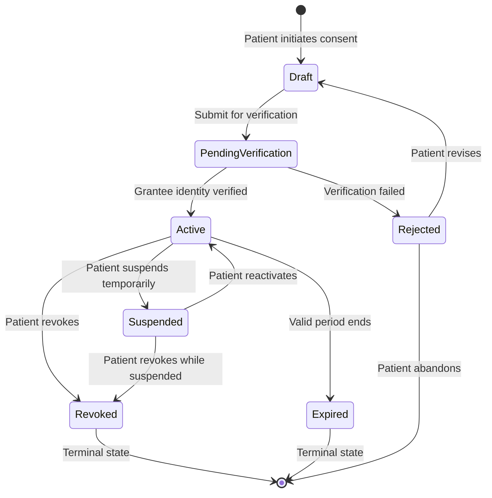
```mermaid
stateDiagram-v2
    [*] --> Draft: Patient initiates consent
    Draft --> PendingVerification: Submit for verification
    PendingVerification --> Active: Grantee identity verified
    PendingVerification --> Rejected: Verification failed
    Active --> Suspended: Patient suspends temporarily
    Active --> Revoked: Patient revokes
    Active --> Expired: Valid period ends
    Suspended --> Active: Patient reactivates
    Suspended --> Revoked: Patient revokes while suspended
    Revoked --> [*]: Terminal state
    Expired --> [*]: Terminal state
    Rejected --> Draft: Patient revises
    Rejected --> [*]: Patient abandons
```

### State Machine 2: Medical Record Lifecycle

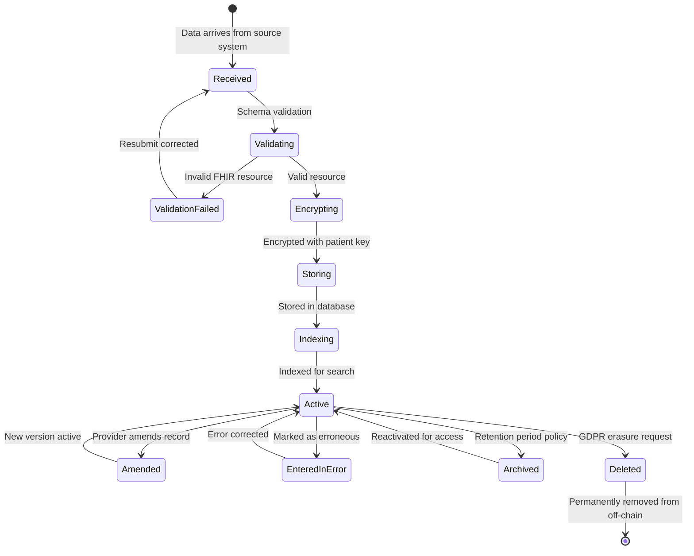
```mermaid
stateDiagram-v2
    [*] --> Received: Data arrives from source system
    Received --> Validating: Schema validation
    Validating --> ValidationFailed: Invalid FHIR resource
    Validating --> Encrypting: Valid resource
    ValidationFailed --> Received: Resubmit corrected
    Encrypting --> Storing: Encrypted with patient key
    Storing --> Indexing: Stored in database
    Indexing --> Active: Indexed for search
    Active --> Amended: Provider amends record
    Amended --> Active: New version active
    Active --> EnteredInError: Marked as erroneous
    EnteredInError --> Active: Error corrected
    Active --> Archived: Retention period policy
    Archived --> Active: Reactivated for access
    Active --> Deleted: GDPR erasure request
    Deleted --> [*]: Permanently removed from off-chain
```

### State Machine 3: Emergency Access Lifecycle

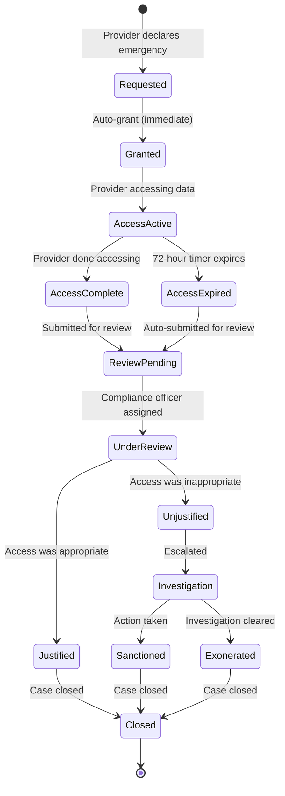
```mermaid
stateDiagram-v2
    [*] --> Requested: Provider declares emergency
    Requested --> Granted: Auto-grant (immediate)
    Granted --> AccessActive: Provider accessing data
    AccessActive --> AccessComplete: Provider done accessing
    AccessActive --> AccessExpired: 72-hour timer expires
    AccessComplete --> ReviewPending: Submitted for review
    AccessExpired --> ReviewPending: Auto-submitted for review
    ReviewPending --> UnderReview: Compliance officer assigned
    UnderReview --> Justified: Access was appropriate
    UnderReview --> Unjustified: Access was inappropriate
    Justified --> Closed: Case closed
    Unjustified --> Investigation: Escalated
    Investigation --> Sanctioned: Action taken
    Investigation --> Exonerated: Investigation cleared
    Sanctioned --> Closed: Case closed
    Exonerated --> Closed: Case closed
    Closed --> [*]
```

### State Machine 4: Cross-Provider Exchange

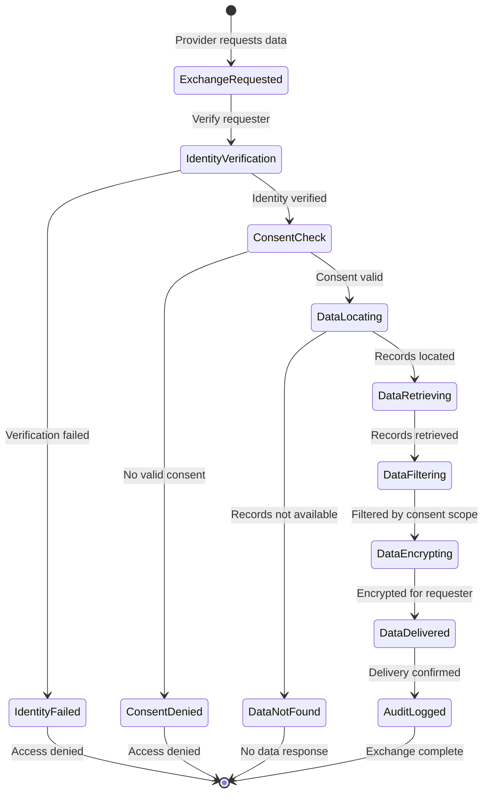
```mermaid
stateDiagram-v2
    [*] --> ExchangeRequested: Provider requests data
    ExchangeRequested --> IdentityVerification: Verify requester
    IdentityVerification --> IdentityFailed: Verification failed
    IdentityVerification --> ConsentCheck: Identity verified
    IdentityFailed --> [*]: Access denied
    ConsentCheck --> ConsentDenied: No valid consent
    ConsentCheck --> DataLocating: Consent valid
    ConsentDenied --> [*]: Access denied
    DataLocating --> DataNotFound: Records not available
    DataLocating --> DataRetrieving: Records located
    DataNotFound --> [*]: No data response
    DataRetrieving --> DataFiltering: Records retrieved
    DataFiltering --> DataEncrypting: Filtered by consent scope
    DataEncrypting --> DataDelivered: Encrypted for requester
    DataDelivered --> AuditLogged: Delivery confirmed
    AuditLogged --> [*]: Exchange complete
```

### State Machine 5: Research Data Request

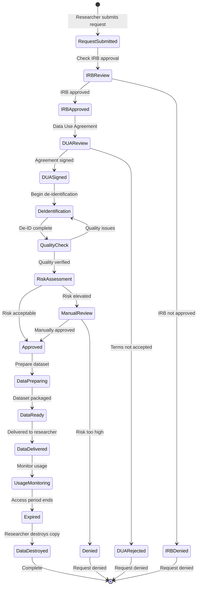
```mermaid
stateDiagram-v2
    [*] --> RequestSubmitted: Researcher submits request
    RequestSubmitted --> IRBReview: Check IRB approval
    IRBReview --> IRBApproved: IRB approved
    IRBReview --> IRBDenied: IRB not approved
    IRBDenied --> [*]: Request denied
    IRBApproved --> DUAReview: Data Use Agreement
    DUAReview --> DUASigned: Agreement signed
    DUAReview --> DUARejected: Terms not accepted
    DUARejected --> [*]: Request denied
    DUASigned --> DeIdentification: Begin de-identification
    DeIdentification --> QualityCheck: De-ID complete
    QualityCheck --> RiskAssessment: Quality verified
    QualityCheck --> DeIdentification: Quality issues
    RiskAssessment --> Approved: Risk acceptable
    RiskAssessment --> ManualReview: Risk elevated
    ManualReview --> Approved: Manually approved
    ManualReview --> Denied: Risk too high
    Denied --> [*]: Request denied
    Approved --> DataPreparing: Prepare dataset
    DataPreparing --> DataReady: Dataset packaged
    DataReady --> DataDelivered: Delivered to researcher
    DataDelivered --> UsageMonitoring: Monitor usage
    UsageMonitoring --> Expired: Access period ends
    Expired --> DataDestroyed: Researcher destroys copy
    DataDestroyed --> [*]: Complete
```

---

## Sequence Diagrams

### Sequence Diagram 1: Patient Grants Consent

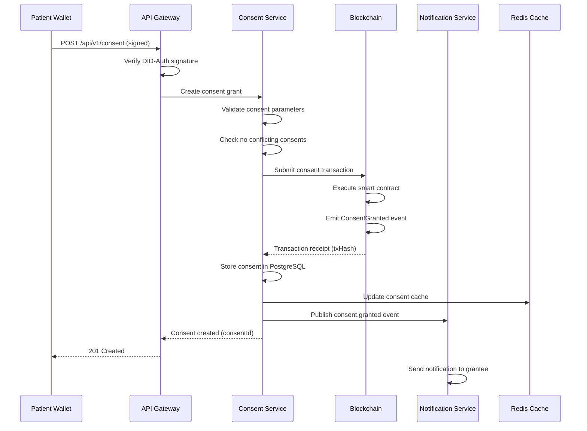
```mermaid
sequenceDiagram
    participant PW as Patient Wallet
    participant API as API Gateway
    participant CS as Consent Service
    participant BC as Blockchain
    participant NS as Notification Service
    participant RD as Redis Cache

    PW->>API: POST /api/v1/consent (signed)
    API->>API: Verify DID-Auth signature
    API->>CS: Create consent grant
    CS->>CS: Validate consent parameters
    CS->>CS: Check no conflicting consents
    CS->>BC: Submit consent transaction
    BC->>BC: Execute smart contract
    BC->>BC: Emit ConsentGranted event
    BC-->>CS: Transaction receipt (txHash)
    CS->>CS: Store consent in PostgreSQL
    CS->>RD: Update consent cache
    CS->>NS: Publish consent.granted event
    CS-->>API: Consent created (consentId)
    API-->>PW: 201 Created
    NS->>NS: Send notification to grantee
```

### Sequence Diagram 2: Provider Accesses Record

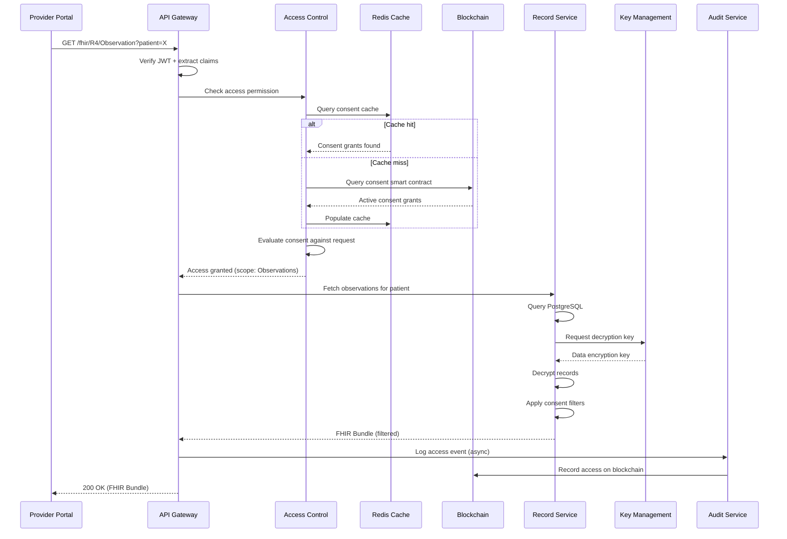
```mermaid
sequenceDiagram
    participant PR as Provider Portal
    participant API as API Gateway
    participant ACS as Access Control
    participant RD as Redis Cache
    participant BC as Blockchain
    participant RS as Record Service
    participant KMS as Key Management
    participant AUD as Audit Service

    PR->>API: GET /fhir/R4/Observation?patient=X
    API->>API: Verify JWT + extract claims
    API->>ACS: Check access permission
    ACS->>RD: Query consent cache
    alt Cache hit
        RD-->>ACS: Consent grants found
    else Cache miss
        ACS->>BC: Query consent smart contract
        BC-->>ACS: Active consent grants
        ACS->>RD: Populate cache
    end
    ACS->>ACS: Evaluate consent against request
    ACS-->>API: Access granted (scope: Observations)
    API->>RS: Fetch observations for patient
    RS->>RS: Query PostgreSQL
    RS->>KMS: Request decryption key
    KMS-->>RS: Data encryption key
    RS->>RS: Decrypt records
    RS->>RS: Apply consent filters
    RS-->>API: FHIR Bundle (filtered)
    API->>AUD: Log access event (async)
    AUD->>BC: Record access on blockchain
    API-->>PR: 200 OK (FHIR Bundle)
```

### Sequence Diagram 3: Emergency Break-Glass

```mermaid
sequenceDiagram
    participant ER as ER Doctor
    participant API as API Gateway
    participant EMS as Emergency Service
    participant BC as Blockchain
    participant RS as Record Service
    participant NS as Notification Service
    participant CO as Compliance Officer

    ER->>API: POST /api/v1/emergency/access
    Note over ER: Provides patient ID + justification
    API->>EMS: Request emergency access
    EMS->>BC: Call requestEmergencyAccess()
    BC->>BC: Auto-grant (no consent needed)
    BC->>BC: Emit EmergencyAccessGranted
    BC-->>EMS: accessId + 72h expiry
    EMS-->>API: Emergency access granted
    API-->>ER: 200 OK (accessId)

    ER->>API: GET /fhir/R4/Patient/X/$everything
    API->>EMS: Verify emergency access active
    EMS-->>API: Access valid (62h remaining)
    API->>RS: Fetch ALL patient records
    RS-->>API: Complete patient record
    API-->>ER: Full FHIR Bundle

    par Notifications
        NS->>NS: Alert patient (SMS/Email)
        NS->>CO: Alert compliance team
    end

    Note over CO: Within 7 days
    CO->>API: PUT /api/v1/emergency/access/{id}/review
    API->>BC: Call reviewEmergencyAccess()
    BC->>BC: Record review outcome
```

### Sequence Diagram 4: Federated Learning Job

```mermaid
sequenceDiagram
    participant R as Researcher
    participant API as API Gateway
    participant FLC as FL Coordinator
    participant IA as Institution A
    participant IB as Institution B
    participant IC as Institution C
    participant BC as Blockchain

    R->>API: POST /api/v1/research/federated/job
    API->>FLC: Create FL job
    FLC->>BC: Register job + verify IRB approval
    BC-->>FLC: IRB credential valid
    FLC->>FLC: Initialize global model

    loop Training Rounds (N rounds)
        par Distribute Model
            FLC->>IA: Send global model weights
            FLC->>IB: Send global model weights
            FLC->>IC: Send global model weights
        end

        par Local Training
            IA->>IA: Train on local data
            IA->>IA: Add differential privacy noise
            IB->>IB: Train on local data
            IB->>IB: Add differential privacy noise
            IC->>IC: Train on local data
            IC->>IC: Add differential privacy noise
        end

        par Upload Gradients
            IA->>FLC: Encrypted gradient update
            IB->>FLC: Encrypted gradient update
            IC->>FLC: Encrypted gradient update
        end

        FLC->>FLC: Secure aggregation (FedAvg)
        FLC->>FLC: Update global model
    end

    FLC->>BC: Record final model hash
    FLC->>R: Return trained model
    FLC->>BC: Log job completion + metrics
```

### Sequence Diagram 5: Cross-Provider Record Request via Carequality

```mermaid
sequenceDiagram
    participant PA as Provider A (Requester)
    participant GW as Platform Gateway
    participant CQ as Carequality Network
    participant PB as Provider B (Responder)
    participant CS as Consent Service
    participant BC as Blockchain

    PA->>GW: Query for patient records
    GW->>CS: Verify consent for cross-provider query
    CS->>BC: Check consent smart contract
    BC-->>CS: Consent valid (treatment purpose)
    CS-->>GW: Access authorized

    GW->>CQ: XCPD Patient Discovery Query
    CQ->>PB: Forward patient discovery
    PB-->>CQ: Patient found (demographics match)
    CQ-->>GW: Patient located at Provider B

    GW->>CQ: XCA Cross-Gateway Query
    CQ->>PB: Document query (FHIR search)
    PB-->>CQ: Document references
    CQ-->>GW: Available documents list

    GW->>GW: Filter by consent scope
    GW->>CQ: XCA Cross-Gateway Retrieve
    CQ->>PB: Retrieve selected documents
    PB-->>CQ: FHIR resources (encrypted in transit)
    CQ-->>GW: Decrypted FHIR Bundle

    GW->>GW: Re-encrypt for Provider A
    GW->>BC: Log cross-provider access
    GW-->>PA: FHIR Bundle (consent-scoped)
```

---

## Concurrency Control

### Challenge Areas

| Area | Concurrency Issue | Solution |
|---|---|---|
| Consent Updates | Concurrent grant and revoke for same patient-grantee | Optimistic locking with version field |
| Record Updates | Concurrent amendments to same record | FHIR-standard ETag/If-Match |
| Access Count | Concurrent accesses decrementing maxAccessCount | Atomic increment with Redis INCRBY |
| Key Rotation | Reading data during key rotation | Double-encryption during transition |
| Blockchain Nonce | Concurrent transactions from same account | Nonce manager with reservation |

### Optimistic Locking for Consent

```python
async def update_consent(consent_id: str, updates: dict, expected_version: int):
    async with db.transaction():
        current = await db.fetchone(
            "SELECT version FROM consent_records WHERE consent_id = $1 FOR UPDATE",
            consent_id
        )

        if current['version'] != expected_version:
            raise ConflictError(
                f"Consent version conflict: expected {expected_version}, "
                f"got {current['version']}"
            )

        new_version = expected_version + 1
        await db.execute(
            """
            UPDATE consent_records
            SET status = $1, version = $2, updated_at = NOW()
            WHERE consent_id = $3 AND version = $4
            """,
            updates['status'], new_version, consent_id, expected_version
        )

        # Submit to blockchain
        tx_hash = await blockchain.update_consent(consent_id, updates, new_version)

        await db.execute(
            "UPDATE consent_records SET blockchain_tx_hash = $1 WHERE consent_id = $2",
            tx_hash, consent_id
        )

        return new_version
```

### FHIR Conditional Update

```http
PUT /fhir/R4/Observation/obs-123
If-Match: W/"3"
Content-Type: application/fhir+json

{
  "resourceType": "Observation",
  "id": "obs-123",
  "meta": {"versionId": "3"},
  ...
}
```

If the server's current version is not "3", the server returns `409 Conflict`.

---

## Idempotency

### Idempotency Strategy

| Operation | Idempotency Key | Deduplication Window |
|---|---|---|
| Consent Grant | `{patient_did}:{grantee_did}:{resource_hash}` | 24 hours |
| Record Create | `{source_system}:{source_id}:{hash}` | 7 days |
| Access Log | `{accessor}:{resource}:{timestamp_bucket}` | 1 hour |
| Emergency Access | `{provider}:{patient}:{24h_window}` | 24 hours |
| Blockchain Transaction | `{sender}:{nonce}` | Permanent |

### Implementation

```python
class IdempotencyManager:
    def __init__(self, redis_client):
        self.redis = redis_client

    async def execute_idempotent(
        self, key: str, operation: Callable, ttl: int = 86400
    ) -> Any:
        idempotency_key = f"idempotent:{key}"

        # Check for existing result
        existing = await self.redis.get(idempotency_key)
        if existing:
            result = deserialize(existing)
            if result.get('status') == 'completed':
                return result['data']
            elif result.get('status') == 'in_progress':
                raise RetryableError("Operation in progress")

        # Mark as in progress
        await self.redis.setex(
            idempotency_key,
            ttl,
            serialize({'status': 'in_progress', 'started_at': now()})
        )

        try:
            result = await operation()
            await self.redis.setex(
                idempotency_key,
                ttl,
                serialize({'status': 'completed', 'data': result})
            )
            return result
        except Exception as e:
            await self.redis.delete(idempotency_key)
            raise
```

---

## Consistency Model

### Consistency Guarantees

| Data Type | Consistency Model | Rationale |
|---|---|---|
| Consent State | Strong (blockchain finality) | Incorrect consent state is a compliance violation |
| Medical Records | Strong (single-region) | Clinical data must be accurate |
| Audit Logs | Eventual (async to blockchain) | Slight delay acceptable; immutability critical |
| Search Index | Eventual (async from DB) | Query freshness < 5 seconds acceptable |
| Cache | Read-your-writes | Writers see their own updates immediately |
| Cross-region Replicas | Eventual (< 1 second) | Asynchronous replication for DR |

### Blockchain Finality

Hyperledger Fabric provides immediate finality (no forks, no probabilistic finality), which is critical for consent decisions. Once a transaction is committed to a block, it is final.

| Property | Hyperledger Fabric | Public Ethereum |
|---|---|---|
| Finality | Immediate | Probabilistic (~12 confirmations) |
| Block Time | ~2 seconds | ~12 seconds |
| Throughput | 3,000+ TPS | ~15 TPS (L1) |
| Consensus | Raft (crash fault tolerant) | Proof of Stake |
| Privacy | Channel-based isolation | Public by default |

### Read-Your-Writes for Consent

When a patient grants or revokes consent, the change must be immediately visible to subsequent reads by that patient:

```python
async def grant_consent_with_ryw(patient_did: str, grant: ConsentGrant):
    # Write to blockchain
    tx_hash = await blockchain.grant_consent(grant)

    # Write to PostgreSQL
    await db.insert_consent(grant, tx_hash)

    # Immediately update cache
    cache_key = f"consent:active:{patient_did}:{grant.grantee_did}"
    await redis.delete(cache_key)  # Invalidate stale cache

    # Set a session-scoped marker
    session_key = f"consent:ryw:{patient_did}:{tx_hash}"
    await redis.setex(session_key, 60, "1")

    return grant
```

---

## Saga Patterns

### Cross-Provider Record Sharing Saga

When sharing records across providers, multiple systems must be coordinated:

```
Saga: CrossProviderShareSaga

Step 1: Verify Consent
  - Action: Check blockchain for valid consent
  - Compensation: None (read-only)

Step 2: Locate Records
  - Action: Query source provider for records
  - Compensation: None (read-only)

Step 3: Decrypt Records
  - Action: Decrypt with source patient key
  - Compensation: Securely discard decrypted data

Step 4: Re-encrypt for Destination
  - Action: Encrypt with destination provider key
  - Compensation: Discard encrypted package

Step 5: Transmit Records
  - Action: Send to destination provider
  - Compensation: Request destination to delete

Step 6: Log Access
  - Action: Record access event on blockchain
  - Compensation: Log failure event

Step 7: Notify Patient
  - Action: Send notification to patient
  - Compensation: Send failure notification
```

### Consent Revocation Saga

Revoking consent must be comprehensive and fast:

```
Saga: ConsentRevocationSaga

Step 1: Update Blockchain
  - Action: Submit revocation transaction
  - Compensation: N/A (blockchain is primary source of truth)

Step 2: Update Database
  - Action: Mark consent as revoked in PostgreSQL
  - Compensation: Re-activate if blockchain step failed

Step 3: Invalidate Cache
  - Action: Delete all cache entries for this consent
  - Compensation: N/A

Step 4: Revoke Active Sessions
  - Action: Invalidate all JWT tokens for affected grantee-patient pair
  - Compensation: N/A

Step 5: Notify Grantee
  - Action: Send revocation notification to provider
  - Compensation: Retry notification

Step 6: Audit Log
  - Action: Create audit entry for revocation
  - Compensation: Retry audit log
```

---

## Security & Compliance

### HIPAA Security Rule Implementation

#### Administrative Safeguards

| Requirement | Implementation |
|---|---|
| Security Management Process | Automated risk assessment, vulnerability scanning |
| Assigned Security Responsibility | Dedicated CISO role, security team |
| Workforce Security | Background checks, role-based access, regular training |
| Information Access Management | Smart contract RBAC, least privilege principle |
| Security Awareness Training | Mandatory annual training, phishing simulations |
| Security Incident Procedures | Automated breach detection, 60-day notification timeline |
| Contingency Plan | Multi-region DR, regular backup testing |
| Evaluation | Annual security audit, penetration testing |
| Business Associate Agreements | Smart contract-enforced BAA terms |

#### Physical Safeguards

| Requirement | Implementation |
|---|---|
| Facility Access Controls | AWS data centers (SOC 2 Type II certified) |
| Workstation Use | Endpoint management, encrypted devices |
| Workstation Security | MDM, remote wipe capability |
| Device and Media Controls | Encrypted storage, secure disposal |

#### Technical Safeguards

| Requirement | Implementation |
|---|---|
| Access Control | DID-based auth, MFA, smart contract RBAC |
| Audit Controls | Blockchain-backed immutable audit trail |
| Integrity | Cryptographic hashes, digital signatures |
| Person Authentication | DID + VC, biometrics, hardware tokens |
| Transmission Security | TLS 1.3, end-to-end encryption |

### Encryption Architecture

```mermaid
graph TB
    subgraph "Data at Rest"
        DB_ENC[Database Encryption<br/>AES-256-GCM<br/>Column-level for PHI]
        S3_ENC[Object Storage<br/>SSE-KMS<br/>Per-patient keys]
        IPFS_ENC[IPFS Storage<br/>AES-256-GCM<br/>Client-side encryption]
        BC_HASH[Blockchain<br/>SHA-256 hashes only<br/>No PHI stored]
    end

    subgraph "Data in Transit"
        TLS[TLS 1.3<br/>All API traffic]
        MTLS[mTLS<br/>Service-to-service]
        E2E[End-to-End<br/>Patient wallet to storage]
    end

    subgraph "Key Management"
        HSM[AWS CloudHSM<br/>FIPS 140-2 Level 3]
        VAULT_SEC[HashiCorp Vault<br/>Dynamic secrets]
        KMS_SEC[AWS KMS<br/>CMK management]
    end

    HSM --> DB_ENC
    HSM --> S3_ENC
    VAULT_SEC --> IPFS_ENC
    KMS_SEC --> HSM
```

### Key Rotation Schedule

| Key Type | Rotation Frequency | Method |
|---|---|---|
| Platform Master Key | Annual | HSM ceremony with M-of-N key custodians |
| Organization Keys | Semi-annual | Automated rotation with double-wrap period |
| Patient Keys | Annual or on compromise | Patient-initiated or automated |
| Data Encryption Keys | Annual | Background re-encryption job |
| TLS Certificates | 90 days | Automated via ACME (Let's Encrypt) |
| API Keys | 90 days | Automated rotation + grace period |
| JWT Signing Keys | 30 days | Key pair rotation with overlap |

### Threat Model

| Threat | Likelihood | Impact | Mitigation |
|---|---|---|---|
| Insider threat (provider) | Medium | High | Audit trail, break-glass review, anomaly detection |
| Ransomware | Medium | Critical | Immutable backups, air-gapped recovery |
| Key compromise | Low | Critical | HSM, key rotation, social recovery |
| Smart contract vulnerability | Low | High | Formal verification, audit, upgradeable contracts |
| Patient identity theft | Medium | High | MFA, biometrics, VC verification |
| Man-in-the-middle | Low | High | Certificate pinning, mTLS |
| SQL injection | Low | Critical | Parameterized queries, WAF |
| DDoS | Medium | Medium | CDN, rate limiting, auto-scaling |
| Data exfiltration | Low | Critical | DLP, network segmentation, anomaly detection |
| Blockchain 51% attack | Very Low (permissioned) | High | Permissioned network, known validators |

### Data Sovereignty and the EU Health Data Space

The European Health Data Space (EHDS) regulation introduces specific requirements:

| EHDS Requirement | Platform Compliance |
|---|---|
| Primary Use (patient access) | Patient portal with full data access |
| Secondary Use (research) | De-identification + consent + DUA |
| Data Holder Obligations | Standardized data access interfaces |
| Data Quality Labels | Automated data quality scoring |
| Cross-Border Access | Federated architecture with jurisdictional controls |
| Interoperability | EEHRxF (European EHR Exchange Format) |
| MyHealth@EU | Integration gateway for cross-border access |

---

## Observability

### Metrics (Prometheus)

```yaml
# Key healthcare-specific metrics
health_record_access_total:
  type: counter
  labels: [resource_type, access_level, purpose, outcome]
  description: "Total number of record access attempts"

consent_operation_total:
  type: counter
  labels: [operation, status]
  description: "Total consent operations (grant, revoke, expire)"

consent_check_latency_seconds:
  type: histogram
  buckets: [0.01, 0.05, 0.1, 0.25, 0.5, 1.0, 2.0]
  description: "Latency of consent verification"

emergency_access_total:
  type: counter
  labels: [outcome, institution]
  description: "Emergency break-glass access events"

fhir_api_request_duration_seconds:
  type: histogram
  labels: [resource_type, operation, status_code]
  description: "FHIR API request latency"

blockchain_transaction_duration_seconds:
  type: histogram
  description: "Time from submission to finality"

data_exchange_total:
  type: counter
  labels: [source, destination, network, outcome]
  description: "Cross-provider data exchanges"

encryption_operations_total:
  type: counter
  labels: [operation, algorithm, outcome]
  description: "Encryption/decryption operations"

hipaa_audit_events_total:
  type: counter
  labels: [event_type, outcome]
  description: "HIPAA-mandated audit events"
```

### Dashboards

| Dashboard | Key Visualizations |
|---|---|
| System Health | Service uptime, error rates, latency percentiles |
| Consent Activity | Grants/revocations over time, consent type distribution |
| Data Access Patterns | Access volume by role, resource type, purpose |
| Security | Failed auth attempts, anomalous access patterns, emergency access |
| Compliance | HIPAA audit completeness, consent coverage, breach indicators |
| Exchange | Cross-provider volume, latency, error rates by network |
| Research | Active FL jobs, cohort queries, dataset usage |
| Blockchain | Block production rate, transaction throughput, peer health |

### Alerting Rules

| Alert | Condition | Severity | Action |
|---|---|---|---|
| High Error Rate | 5xx rate > 1% for 5 min | Critical | Page on-call |
| Consent Check Latency | p99 > 2s for 5 min | High | Investigate blockchain/cache |
| Emergency Access Spike | > 10 break-glass/hour (single institution) | High | Alert compliance |
| Unreviewed Emergency | Emergency access > 72h without review | Medium | Alert compliance |
| Blockchain Peer Down | Any peer unreachable for > 5 min | High | Alert infrastructure |
| Encryption Failure | Any encryption operation fails | Critical | Page security team |
| Audit Gap | Missing audit events > 0.01% | High | Alert compliance |
| Data Exfiltration | Bulk data access > 10K records by single user | Critical | Auto-block + alert |

### Logging

```json
{
  "timestamp": "2025-06-15T10:30:00.123Z",
  "level": "INFO",
  "service": "record-service",
  "traceId": "abc123def456",
  "spanId": "span789",
  "correlationId": "req-uuid-67890",
  "event": "record_accessed",
  "actor": {
    "did": "did:health:fabric:0xProvider...",
    "role": "physician",
    "organization": "City Medical Center"
  },
  "patient": {
    "id": "patient-uuid-123",
    "did_hash": "sha256:abc..."
  },
  "resource": {
    "type": "Observation",
    "id": "obs-456",
    "category": "laboratory"
  },
  "consent": {
    "id": "consent-uuid-789",
    "purpose": "treatment"
  },
  "outcome": "success",
  "latency_ms": 145,
  "metadata": {
    "ip_hash": "sha256:def...",
    "fhir_operation": "read"
  }
}
```

**Note**: Logging never contains raw PHI. Patient identifiers are hashed or tokenized in logs.

---

## Reliability & Fault Tolerance

### Failure Modes and Mitigations

| Failure | Impact | Detection | Mitigation |
|---|---|---|---|
| Database primary failure | Write unavailability | Health checks | Automatic failover to standby |
| Blockchain peer failure | Reduced consensus participants | Peer heartbeat | Minimum 4 peers; tolerates 1 failure |
| Blockchain ordering service failure | No new transactions | Raft health check | 5-node Raft; tolerates 2 failures |
| Redis cluster node failure | Partial cache loss | Sentinel monitoring | Automatic failover + cache rebuild |
| Kafka broker failure | Temporary message delay | Broker health check | 3+ replicas per partition |
| IPFS node failure | Image retrieval delay | Pin status check | Multiple replicas across cluster |
| Key management failure | Cannot encrypt/decrypt | HSM health check | Multi-AZ HSM cluster |
| API gateway failure | Full outage | Load balancer health | Multi-AZ deployment, DNS failover |

### Graceful Degradation

```
Priority 1 (Never Degrade):
  - Emergency break-glass access
  - Active consent enforcement
  - Audit logging

Priority 2 (Degrade Last):
  - Record reads for treating providers
  - Consent grant/revoke
  - Patient portal access

Priority 3 (Degrade When Necessary):
  - Search functionality (fall back to direct DB queries)
  - Cross-provider exchange (queue for retry)
  - Research queries

Priority 4 (Degrade First):
  - Analytics dashboards
  - Batch processing jobs
  - Non-critical notifications
```

### Backup Strategy

| Data | Backup Frequency | Retention | Storage |
|---|---|---|---|
| PostgreSQL (full) | Daily | 90 days | S3 Glacier |
| PostgreSQL (WAL) | Continuous | 30 days | S3 Standard |
| Blockchain State | Every 1000 blocks | Permanent | S3 + separate region |
| Encryption Keys | Real-time (HSM replication) | Permanent | Multi-region HSM |
| Elasticsearch | Daily snapshot | 30 days | S3 Standard |
| IPFS Content | Triple replication | Permanent | IPFS cluster + S3 backup |
| Redis | AOF + RDB snapshots | 7 days | Local SSD + S3 |

### Disaster Recovery

| Metric | Target | Implementation |
|---|---|---|
| RTO (Recovery Time Objective) | 15 minutes | Automated failover, warm standby |
| RPO (Recovery Point Objective) | 0 seconds for records | Synchronous replication within region |
| RPO for cross-region | < 1 second | Asynchronous replication |
| DR Test Frequency | Quarterly | Automated DR drills |

---

## Multi-Region & Data Residency

### Regional Architecture

```mermaid
graph TB
    subgraph "US Region (us-east-1)"
        US_LB[Load Balancer]
        US_APP[Application Tier]
        US_DB[(PostgreSQL Primary)]
        US_BC[Blockchain Peers US]
        US_VAULT[Vault Cluster]
    end

    subgraph "EU Region (eu-west-1)"
        EU_LB[Load Balancer]
        EU_APP[Application Tier]
        EU_DB[(PostgreSQL Primary)]
        EU_BC[Blockchain Peers EU]
        EU_VAULT[Vault Cluster]
    end

    subgraph "DR Region (us-west-2)"
        DR_LB[Load Balancer<br/>Standby]
        DR_APP[Application Tier<br/>Warm Standby]
        DR_DB[(PostgreSQL Replica)]
        DR_BC[Blockchain Peers DR]
    end

    subgraph "Global"
        DNS[Route 53<br/>GeoDNS]
        CDN[CloudFront<br/>Static Assets]
        RAFT_G[Raft Ordering<br/>Cross-Region]
    end

    DNS --> US_LB
    DNS --> EU_LB
    US_DB -->|Async Replication| DR_DB
    US_BC --> RAFT_G
    EU_BC --> RAFT_G
    DR_BC --> RAFT_G
```

### Data Residency Rules

| Data Origin | Storage Region | Replication Allowed | Rationale |
|---|---|---|---|
| US Patient Data | US regions only | US-to-US DR only | HIPAA + state laws |
| EU Patient Data | EU regions only | EU-to-EU DR only | GDPR Article 44-49 |
| UK Patient Data | UK region | UK-to-EU (adequacy) | UK GDPR |
| Cross-border consented | Origin + consented regions | Per consent terms | Patient-directed |
| De-identified data | Any region | Yes | Not considered PHI/personal data |
| Blockchain state | All participating regions | Yes (access metadata only) | No PHI on chain |

### Jurisdictional Consent Enforcement

```python
async def enforce_data_residency(patient_did: str, request_region: str):
    patient = await get_patient(patient_did)
    patient_region = patient.data_residency_region

    if patient_region == request_region:
        return True  # Same region, allowed

    # Check cross-border consent
    cross_border_consent = await get_consent(
        patient_did=patient_did,
        purpose="cross-border-access",
        target_region=request_region
    )

    if cross_border_consent and cross_border_consent.status == "active":
        return True  # Patient consented to cross-border access

    # Check if de-identified access would suffice
    if request_purpose == "research":
        return True  # De-identified data can cross borders

    raise DataResidencyViolation(
        f"Patient data resides in {patient_region}; "
        f"request from {request_region} without cross-border consent"
    )
```

---

## Cost Analysis

### Infrastructure Costs (Annual, National-Scale US Deployment)

| Component | Specification | Monthly Cost | Annual Cost |
|---|---|---|---|
| Compute (EKS) | 200 nodes, m6i.xlarge | $120,000 | $1,440,000 |
| PostgreSQL (RDS) | 4x r6g.4xlarge multi-AZ | $40,000 | $480,000 |
| Elasticsearch | 12-node cluster | $25,000 | $300,000 |
| Redis Cluster | 6x r6g.2xlarge | $12,000 | $144,000 |
| S3 (Hot + Warm) | 500 TB | $11,500 | $138,000 |
| S3 Glacier | 25 PB | $25,000 | $300,000 |
| IPFS Cluster | 20 nodes, i3.2xlarge | $30,000 | $360,000 |
| Blockchain (Hyperledger) | 20 peers, c6i.xlarge | $15,000 | $180,000 |
| Kafka Cluster | 9 brokers, m6i.2xlarge | $18,000 | $216,000 |
| CloudHSM | 4 HSMs multi-AZ | $6,000 | $72,000 |
| HashiCorp Vault | Enterprise, 6 nodes | $8,000 | $96,000 |
| Load Balancers | ALB + NLB | $5,000 | $60,000 |
| CloudFront CDN | 100 TB/month | $8,000 | $96,000 |
| Network (data transfer) | 200 TB/month | $15,000 | $180,000 |
| Monitoring (Datadog/Grafana) | Full stack | $10,000 | $120,000 |
| DNS (Route 53) | Health checks + queries | $2,000 | $24,000 |
| **Total Infrastructure** | | **$350,500** | **$4,206,000** |

### Operational Costs

| Category | Annual Cost |
|---|---|
| Engineering Team (15 engineers) | $3,750,000 |
| Security Team (5 specialists) | $1,250,000 |
| Compliance Team (3 specialists) | $750,000 |
| DevOps/SRE (5 engineers) | $1,250,000 |
| Penetration Testing (annual) | $200,000 |
| HITRUST Certification | $150,000 |
| SOC 2 Audit | $100,000 |
| Legal & Regulatory | $500,000 |
| **Total Operational** | **$7,950,000** |

### Cost per Patient

| Metric | Value |
|---|---|
| Total Annual Cost | $12,156,000 |
| Registered Patients | 100,000,000 |
| Cost per Patient per Year | $0.12 |
| Cost per Active Monthly Patient | $0.61 |

### Cost Optimization Strategies

| Strategy | Estimated Savings |
|---|---|
| Reserved Instances (3-year) | 35% on compute |
| S3 Intelligent Tiering | 20% on storage |
| Spot Instances for batch jobs | 60% on batch compute |
| Data lifecycle automation (hot to cold) | 30% on storage |
| Right-sizing instances | 15% on compute |
| Kafka tiered storage | 40% on Kafka storage |

---

## Platform Comparisons

### Medicalchain vs Patientory vs MedRec vs Traditional HIE

| Feature | Medicalchain | Patientory | MedRec | Traditional HIE | Our Platform |
|---|---|---|---|---|---|
| **Blockchain** | Ethereum (was) + Hyperledger | Ethereum | Ethereum (PoA) | None | Hyperledger Fabric |
| **Data Storage** | Off-chain | Off-chain | Off-chain (provider DBs) | Centralized DB | Off-chain encrypted |
| **Patient Identity** | Platform accounts | Platform accounts | Ethereum addresses | MPI matching | DIDs + VCs |
| **Consent Model** | Basic (allow/deny) | Basic | Smart contract | Paper/electronic forms | Granular smart contract |
| **FHIR Support** | Limited | Limited | None | Varies | Native FHIR R4/R5 |
| **Interoperability** | Proprietary API | Proprietary API | Minimal | IHE profiles | FHIR + IHE + CQ/CW |
| **De-identification** | Manual | Basic | None | Varies | Automated (Safe Harbor + k-anonymity) |
| **Federated Learning** | No | No | No | No | Yes |
| **HIPAA Compliance** | Partial | Claimed | Research only | Yes | Full (designed for) |
| **GDPR Compliance** | Partial | No | No | Varies | Full |
| **Scale** | Small pilot | Small pilot | Research prototype | Regional | National |
| **ZK Proofs** | No | No | No | No | Yes |
| **Emergency Access** | Basic | No | No | Yes | Smart contract break-glass |
| **Status** | Pivoted | Active | Research | Operational | Production-ready design |

### Why Not a Traditional HIE?

Traditional Health Information Exchanges have been the primary mechanism for data sharing in the US. However, they have limitations:

| Limitation | Traditional HIE | Our Platform |
|---|---|---|
| Central point of control | Single organization controls all data | Patient controls via smart contracts |
| Consent granularity | Opt-in/opt-out per HIE | Per-resource, per-purpose, time-limited |
| Audit immutability | Database logs (modifiable) | Blockchain (immutable) |
| Patient visibility | Limited to portal | Real-time wallet notifications |
| Inter-HIE exchange | Limited (requires TEFCA) | Native cross-network via blockchain |
| Research support | Ad-hoc, manual | Automated de-ID, federated learning |
| Vendor lock-in | High (proprietary platforms) | Open standards (FHIR, DID, VC) |

### When Blockchain is NOT the Answer

| Scenario | Better Alternative |
|---|---|
| Single hospital system | Traditional EHR + portal |
| Trusted, small network | Centralized database with audit |
| High-throughput analytics | Data warehouse + BI tools |
| Real-time clinical alerts | Event streaming (Kafka) |
| Large file storage | Object storage (S3/GCS) |
| Full-text search | Elasticsearch/Solr |

---

## Edge Cases

### Edge Case 1: Patient Key Loss
**Scenario**: Patient loses access to their DID private key.
**Impact**: Cannot grant or revoke consent; locked out of records.
**Handling**: Social recovery (3-of-5 guardians approve key rotation). If guardians unavailable, institutional recovery via in-person identity verification at a registered provider.

### Edge Case 2: Deceased Patient
**Scenario**: Patient dies; family needs access to records.
**Impact**: Existing consents may be insufficient for estate purposes.
**Handling**: Verifiable Credential from a probate court or death certificate issuer triggers executor access. Smart contract recognizes the death credential and grants time-limited access to the designated executor.

### Edge Case 3: Conflicting Consents
**Scenario**: Patient grants broad consent to Hospital A but subsequently creates a narrower consent that appears to conflict.
**Impact**: Ambiguity about which consent governs.
**Handling**: Most recent consent takes precedence for overlapping scopes. The system alerts the patient about conflicts and provides a resolution UI. Smart contract uses timestamp ordering.

### Edge Case 4: Provider System Downtime During Consent Revocation
**Scenario**: Patient revokes consent, but the provider's system is offline and has cached access tokens.
**Impact**: Provider might access data briefly after revocation.
**Handling**: Short JWT lifetimes (15 minutes) limit exposure. On next token refresh, revocation is enforced. Provider systems must check consent on each access, not just at token issuance.

### Edge Case 5: Network Partition Between Blockchain Peers
**Scenario**: Network issue splits the Hyperledger Fabric network.
**Impact**: Some peers cannot process new consent transactions.
**Handling**: Raft consensus requires majority. Minority partition becomes read-only. Majority partition continues processing. On reconnection, minority catches up. All consent checks default to "last known state" during partition.

### Edge Case 6: Mass Emergency (Natural Disaster)
**Scenario**: Earthquake, hurricane, or pandemic affects thousands simultaneously.
**Impact**: Massive spike in emergency break-glass requests.
**Handling**: Auto-scaling emergency access service. Batch emergency access grants for declared disaster areas. Relaxed review timelines (extended from 7 to 30 days). Integration with FEMA/HHS emergency declarations.

### Edge Case 7: Genomic Re-identification
**Scenario**: De-identified dataset containing genomic variants is combined with public genetic databases, enabling re-identification.
**Impact**: Privacy breach for research participants.
**Handling**: Genomic data receives enhanced de-identification (beacon attacks mitigation). Differential privacy applied to allele frequencies. Data use agreements prohibit re-identification. Monitoring for re-identification attempts. Minimum cohort size of 100 for genomic queries.

### Edge Case 8: Minor Reaches Age of Majority
**Scenario**: Patient turns 18 (or applicable age) and parental proxy access should transfer to self-governance.
**Impact**: Parent retains access they should no longer have.
**Handling**: Age-triggered smart contract event revokes all proxy consents and notifies the now-adult patient to set up their own consent preferences. Transition period of 30 days with dual access.

### Edge Case 9: FHIR Resource Too Large for Blockchain Hash
**Scenario**: A single FHIR resource (e.g., a genomic report) exceeds size limits.
**Impact**: Cannot compute and store hash on-chain in a single transaction.
**Handling**: Merkle tree hash of resource chunks. Root hash stored on-chain. Individual chunk hashes available for selective verification.

### Edge Case 10: Retroactive Consent Withdrawal
**Scenario**: Patient grants consent, provider downloads data, then patient revokes consent.
**Impact**: Provider has already obtained a copy of the data.
**Handling**: Smart contract records that data was accessed before revocation. Provider's data use agreement requires deletion upon revocation notification. Audit trail proves data was accessed during valid consent period for liability purposes.

### Edge Case 11: Cross-Border Emergency
**Scenario**: US patient has a medical emergency while traveling in Germany.
**Impact**: German hospital needs access to US-stored records but has no existing consent.
**Handling**: Emergency access protocol works across borders. German hospital's DID is verified against the EU provider registry. Break-glass access granted with extended audit trail. Data residency rules relaxed for emergency purpose. Post-emergency, patient reviews and can revoke.

### Edge Case 12: Smart Contract Bug Discovered
**Scenario**: A vulnerability is found in the consent smart contract.
**Impact**: Potential for unauthorized access or consent bypass.
**Handling**: Upgradeable proxy pattern allows contract upgrade without losing state. Emergency governance multisig (5-of-9 consortium members) can freeze contract and deploy patch. All consent decisions during vulnerability window are reviewed. Bug bounty program for responsible disclosure.

### Edge Case 13: Data Correction Propagation
**Scenario**: A lab result is corrected at the originating lab, but copies have been shared to three other providers.
**Impact**: Stale, incorrect data persists at downstream providers.
**Handling**: FHIR provenance chain tracks all recipients. Correction event published to Kafka. All systems with a copy receive correction notification. FHIR resource status updated to "amended" with link to corrected version. Downstream providers' caches invalidated.

---

## Architecture Decision Records

### ADR-1: Hyperledger Fabric over Public Ethereum

**Status**: Accepted
**Context**: Public Ethereum offers broader ecosystem but has scalability, cost, and privacy limitations for healthcare.
**Decision**: Use Hyperledger Fabric as the blockchain layer.
**Rationale**: Permissioned network provides regulatory compliance, privacy (channels), high throughput (3000+ TPS), no gas costs, and immediate finality. Healthcare requires known, accountable participants.
**Consequences**: Smaller developer ecosystem. Must manage our own network infrastructure. No native token for patient incentives (can be added via off-chain mechanism).

### ADR-2: Off-Chain PHI Storage

**Status**: Accepted
**Context**: Storing PHI on blockchain violates HIPAA minimum necessary standard and GDPR right to erasure.
**Decision**: Store ALL PHI in encrypted off-chain databases. Blockchain stores only hashes, pointers, and access control metadata.
**Rationale**: Compliance with HIPAA and GDPR. Blockchain provides immutable audit and access control without exposing sensitive data.
**Consequences**: Requires careful coordination between on-chain and off-chain state. Slightly more complex architecture.

### ADR-3: FHIR as Native Data Format

**Status**: Accepted
**Context**: Healthcare has multiple data standards (HL7v2, CDA, FHIR, custom formats). Translation between formats is error-prone and lossy.
**Decision**: Store all clinical data natively as FHIR R4 resources. Accept data in any format but convert to FHIR on ingestion.
**Rationale**: FHIR is the mandated standard under the 21st Century Cures Act. Native FHIR eliminates translation overhead for API consumers.
**Consequences**: Ingestion pipeline must handle format conversion. Legacy systems require FHIR adapters.

### ADR-4: DID-Based Patient Identity

**Status**: Accepted
**Context**: US lacks a universal patient identifier. Probabilistic matching fails 8-12% of the time. SSN-based matching raises privacy concerns.
**Decision**: Adopt W3C Decentralized Identifiers as the primary patient identity mechanism.
**Rationale**: Patient-controlled, cryptographically verifiable, supports key rotation and recovery, vendor-neutral.
**Consequences**: Requires patient onboarding workflow. Key management complexity. Fallback needed for patients unable to manage digital identity.

### ADR-5: Event-Driven Architecture with Kafka

**Status**: Accepted
**Context**: Audit logging, cache invalidation, search indexing, and notifications all need to react to data changes.
**Decision**: Use Apache Kafka as the central event bus with event-driven consumers.
**Rationale**: Decouples producers from consumers. Enables exactly-once semantics. Provides replay capability for reprocessing. Handles peak loads via buffering.
**Consequences**: Eventual consistency for some read paths. Need to manage Kafka cluster operations.

### ADR-6: AES-256-GCM for Record Encryption

**Status**: Accepted
**Context**: HIPAA requires encryption of PHI at rest. Multiple encryption algorithms are available.
**Decision**: Use AES-256-GCM with per-patient data encryption keys managed by HSM-backed key management.
**Rationale**: AES-256-GCM provides both confidentiality and integrity (AEAD). NIST-approved. Hardware acceleration available. 256-bit keys provide quantum-resistant-ish security.
**Consequences**: Key management complexity with per-patient keys. Key rotation requires re-encryption jobs.

### ADR-7: Federated Learning over Centralized Analytics

**Status**: Accepted
**Context**: Research requires analysis across institutional boundaries, but data cannot be centralized.
**Decision**: Implement federated learning for cross-institutional model training.
**Rationale**: Data never leaves institutional boundaries. Complies with HIPAA minimum necessary. Enables ML research without creating large PHI repositories.
**Consequences**: More complex ML pipeline. Reduced model accuracy compared to centralized training. Requires institutional compute infrastructure.

### ADR-8: Social Recovery for Key Management

**Status**: Accepted
**Context**: Patients losing their private keys is a catastrophic scenario. Traditional password reset is not applicable to DID-based systems.
**Decision**: Implement social recovery (3-of-5 guardians) as the primary recovery mechanism, with institutional recovery as backup.
**Rationale**: Distributes recovery trust. No single point of failure. Works even if the platform goes offline.
**Consequences**: Requires patients to set up guardians during onboarding. Guardian unavailability is an edge case. Institutional recovery needed as fallback.

---

## Proof of Concepts

### POC-1: Consent Smart Contract on Hyperledger Fabric

**Objective**: Validate that consent transactions can achieve required throughput (250 TPS peak) with immediate finality.

**Setup**:
- 4-org Hyperledger Fabric network (2 peers each)
- 5-node Raft ordering service
- Consent chaincode in Go

**Test Scenarios**:
1. Batch consent grants (1000 concurrent)
2. Consent revocation with cache invalidation
3. Consent query performance under load
4. Emergency break-glass under network stress

**Success Criteria**:
- Consent grant finality < 3 seconds
- Consent query < 100ms
- Sustained 300 TPS for consent operations
- Zero lost transactions during peer failure

### POC-2: FHIR + Encryption Performance

**Objective**: Validate that per-record encryption does not degrade FHIR API performance below targets.

**Setup**:
- HAPI FHIR server with custom encryption interceptor
- PostgreSQL with encrypted columns
- HSM-backed key management

**Test Scenarios**:
1. Patient $everything query (500+ resources, each encrypted)
2. Bulk observation search with decryption
3. Concurrent key rotation during reads
4. FHIR search with encrypted content

**Success Criteria**:
- $everything < 3 seconds for 500 resources
- Search API p95 < 500ms
- Zero decryption failures during key rotation
- Encryption overhead < 20% compared to unencrypted

### POC-3: Federated Learning Convergence

**Objective**: Validate that federated learning achieves acceptable model accuracy for a diabetes risk prediction model.

**Setup**:
- 5 simulated institutions with non-IID data distributions
- Differential privacy (epsilon = 1.0)
- Secure aggregation protocol

**Test Scenarios**:
1. IID data distribution (baseline)
2. Non-IID distribution (realistic)
3. Straggler institution (slow computation)
4. Adversarial institution (poisoning attack)

**Success Criteria**:
- Model AUC within 5% of centralized training baseline
- Differential privacy budget maintained (epsilon <= 1.0)
- Convergence within 100 rounds
- Poison attack detected and mitigated

### POC-4: ZK Proof Selective Disclosure

**Objective**: Validate that ZK proofs can enable selective disclosure of health attributes without revealing full credentials.

**Setup**:
- BBS+ signature scheme for VCs
- ZK proof library (circom or arkworks)
- Mobile wallet integration

**Test Scenarios**:
1. Prove age > 18 without revealing DOB
2. Prove allergy-free for specific drug without revealing all allergies
3. Prove insurance coverage without revealing plan details
4. Batch verification of multiple ZK proofs

**Success Criteria**:
- Proof generation < 2 seconds on mobile device
- Proof verification < 500ms
- Proof size < 1 KB
- No information leakage in formal verification

---

## Interview Guide

### System Design Interview: Healthcare Data Sharing Platform

#### Opening Questions (5 minutes)

**Q**: Design a system that allows patients to share their medical records across healthcare providers while maintaining privacy and compliance.

**Expected Approach**:
1. Clarify scope (US only? Global? Which stakeholders?)
2. Identify key challenges (fragmentation, privacy, consent, interoperability)
3. Establish core requirements (HIPAA, patient control, provider access)
4. Propose high-level architecture

#### Deep Dive Areas (30 minutes)

**Area 1: Data Model & Storage**
- How do you store medical records? (FHIR resources)
- Why not store on blockchain? (PHI, size, GDPR erasure)
- How do you handle medical images? (IPFS, DICOM)
- Encryption strategy? (Per-patient DEKs, HSM-backed)

**Area 2: Consent & Access Control**
- How granular is consent? (Per-resource-type, time-limited, purpose-based)
- How is consent enforced? (Smart contracts on blockchain)
- What about emergencies? (Break-glass protocol)
- How do you handle revocation? (Immediate on-chain + cache invalidation)

**Area 3: Interoperability**
- How do different hospitals exchange data? (FHIR APIs, IHE profiles, Carequality/CommonWell)
- How do you identify the same patient across systems? (DIDs, probabilistic matching, PIX)
- What standards do you support? (HL7 FHIR R4, IHE XCA/XDS, USCDI)

**Area 4: Research & Analytics**
- How do researchers access data? (De-identification, federated learning, cohort discovery)
- How do you de-identify data? (HIPAA Safe Harbor, k-anonymity, differential privacy)
- How do you prevent re-identification? (Minimum cell sizes, monitoring, DUAs)

**Area 5: Security & Compliance**
- HIPAA technical safeguards? (Encryption, access control, audit, integrity)
- How do you handle audit? (Immutable blockchain audit trail)
- Key management? (HSM, per-patient keys, rotation)
- How do you handle data breaches? (Detection, 60-day notification, breach log)

#### Follow-Up Questions

- How does the system scale to 100M patients?
- What happens when a blockchain peer goes down?
- How do you handle the "right to be forgotten" under GDPR?
- What is the cost model? Is blockchain worth the overhead?
- How do you onboard patients who are not tech-savvy?

#### Common Pitfalls

| Pitfall | Why It is Wrong | Better Approach |
|---|---|---|
| Storing PHI on blockchain | Violates HIPAA and GDPR | Off-chain encrypted storage, on-chain hashes |
| Using public Ethereum | Privacy issues, gas costs | Permissioned blockchain (Hyperledger Fabric) |
| Ignoring legacy systems | Most hospitals use HL7v2, not FHIR | Support multiple standards with adapters |
| Centralized consent DB | Single point of failure, trust issues | Blockchain-enforced consent |
| Ignoring key management | Key loss = data loss | HSM, social recovery, institutional backup |

---

## Evolution Roadmap

### Phase 1: Foundation (Months 1-6)
- Core identity (DID + VC) infrastructure
- Basic consent management (grant/revoke)
- FHIR R4 server with PostgreSQL storage
- AES-256 encryption with HSM-backed key management
- Single-region deployment (US-East)
- Basic audit logging

### Phase 2: Blockchain Integration (Months 7-12)
- Hyperledger Fabric network deployment (4 organizations)
- Consent smart contracts (RBAC, time-limited, purpose-based)
- Emergency break-glass protocol
- On-chain audit trail
- Kafka event bus integration
- Elasticsearch for clinical search

### Phase 3: Interoperability (Months 13-18)
- IHE profile support (XDS.b, XCA, PDQ, PIX)
- Carequality framework integration
- CommonWell Health Alliance integration
- EHR adapter development (Epic, Cerner, MEDITECH)
- SMART on FHIR app launch framework
- FHIR Bulk Data $export support

### Phase 4: Research Platform (Months 19-24)
- Automated de-identification engine
- Cohort discovery with privacy-preserving queries
- Federated learning coordinator
- Basic data marketplace
- IRB workflow integration
- Research consent management

### Phase 5: Advanced Features (Months 25-30)
- ZK proofs for selective disclosure
- Multi-region deployment with data residency
- DICOM imaging with IPFS storage
- Genomic data support
- Clinical trial integration
- TEFCA compliance
- EU Health Data Space compatibility

### Phase 6: Scale & Optimization (Months 31-36)
- National-scale deployment (100M+ patients)
- Performance optimization (sub-second consent checks)
- Advanced analytics and population health
- AI-powered anomaly detection for security
- Patient-facing mobile wallet (iOS/Android)
- Provider EHR embedded widgets
- Synthetic data generation for testing

### Future Considerations
- Quantum-resistant cryptography migration
- Interplanetary health records (deep space missions)
- AI agent-based consent management
- Wearable device data integration
- Real-time genomic analysis pipelines
- Post-quantum DID methods
- Cross-chain interoperability for international networks

---

## Practice Questions

### Fundamentals

1. **Why should Protected Health Information never be stored on a blockchain?**
   *Hint*: Consider HIPAA minimum necessary, GDPR right to erasure, data size, and immutability.

2. **Explain the difference between HIPAA's "consent" and "authorization." When is each required?**
   *Hint*: TPO uses consent; marketing and psychotherapy notes always require authorization.

3. **What are the 18 HIPAA Safe Harbor identifiers, and why is each considered identifying?**
   *Hint*: Each identifier alone or in combination can link data to a specific individual.

4. **Compare Hyperledger Fabric and public Ethereum for healthcare use cases. When would you choose each?**
   *Hint*: Consider throughput, privacy, cost, finality, and regulatory requirements.

### Design Questions

5. **Design a consent revocation system that ensures revocation takes effect within 30 seconds across all systems.**
   *Hint*: Consider cache invalidation, JWT lifetimes, event-driven notifications, and blockchain finality.

6. **How would you implement emergency break-glass access that balances patient privacy with clinical necessity?**
   *Hint*: Auto-grant with logging, time limits, mandatory post-access review, and compliance escalation.

7. **Design a de-identification pipeline that supports both Safe Harbor and Expert Determination methods.**
   *Hint*: Consider the 18 identifiers, k-anonymity, l-diversity, differential privacy, and re-identification risk assessment.

8. **How would you handle a patient who wants to share their records with a provider in another country?**
   *Hint*: Data residency rules, cross-border consent, encryption in transit, jurisdictional compliance.

### Deep Dive Questions

9. **Explain how federated learning preserves privacy while enabling cross-institutional model training.**
   *Hint*: Data never leaves institution, gradient clipping, differential privacy, secure aggregation.

10. **How would you implement Zero-Knowledge proofs for selective disclosure of health credentials?**
    *Hint*: BBS+ signatures, predicate proofs, verifier learns only the proved statement, not the underlying data.

11. **Design the key management system for a healthcare platform with 100 million patients.**
    *Hint*: Hierarchical keys (platform > org > patient > DEK), HSM-backed, rotation, social recovery.

12. **How do you ensure consistency between on-chain consent state and off-chain data access?**
    *Hint*: Blockchain as source of truth, cache-aside pattern, event-driven invalidation, read-your-writes.

### Scenario Questions

13. **A hospital reports a breach affecting 50,000 patient records. Walk through your incident response.**
    *Hint*: Detection, containment, blockchain audit analysis, notification (60-day HIPAA deadline), remediation, regulatory reporting.

14. **A researcher discovers a vulnerability in the consent smart contract. What is your response plan?**
    *Hint*: Responsible disclosure, emergency multisig freeze, contract upgrade, retroactive consent review, bug bounty.

15. **A patient's guardian (power of attorney) is suspected of accessing records for unauthorized purposes. How do you investigate?**
    *Hint*: Blockchain audit trail, access pattern analysis, comparison with consent scope, compliance review, potential revocation of proxy access.

16. **Two providers submit conflicting data for the same patient encounter. How do you resolve?**
    *Hint*: Provenance tracking, version history, human-in-the-loop resolution, both versions preserved with linkage.

### Scale and Performance Questions

17. **The platform needs to handle a 10x traffic spike during a pandemic (mass vaccination record lookups). How do you scale?**
    *Hint*: Auto-scaling compute, read replicas, aggressive caching, rate limiting non-critical endpoints, CDN for static content.

18. **Consent check latency has increased from 50ms to 500ms. Walk through your debugging process.**
    *Hint*: Check cache hit rate, blockchain peer health, network latency, database query plans, connection pool saturation.

19. **A large health system wants to onboard 10 million patient records. How do you handle the bulk migration?**
    *Hint*: Batch FHIR ingestion, parallel encryption, staged migration, reconciliation, MRN-to-DID mapping.

20. **How would you design the system to support 1 billion records with sub-second search?**
    *Hint*: Elasticsearch sharding strategy, index lifecycle management, search routing by patient, tiered storage.

### Regulatory and Ethics Questions

21. **A law enforcement agency requests patient records with a subpoena. How does the system handle this?**
    *Hint*: HIPAA permits disclosure per 164.512(f). Legal review required. Minimum necessary standard applies. Patient notification unless prohibited by court order.

22. **The EU Health Data Space regulation requires your platform to support secondary use of data. How do you comply?**
    *Hint*: Data holder obligations, standardized data access, data quality labels, purpose limitation, data permit authority integration.

23. **A patient wants to monetize their health data. What are the ethical and technical considerations?**
    *Hint*: Informed consent, fair compensation, re-identification risk, preventing exploitation of vulnerable populations, data use restrictions.

24. **How do you handle genetic discrimination concerns under GINA (Genetic Information Nondiscrimination Act)?**
    *Hint*: Separate consent flows for genomic data, enhanced access controls, prohibition of sharing with employers/insurers, audit monitoring.

25. **A clinical trial uses federated learning on your platform. A participant withdraws consent. How do you handle their contribution to the model?**
    *Hint*: Machine unlearning techniques, model retraining excluding withdrawn data, differential privacy limits individual impact, consent trail for audit.

---

## Additional Topics

### 21st Century Cures Act: Key Provisions

The 21st Century Cures Act, particularly the ONC final rule (effective April 2021), has profound implications for healthcare data sharing:

| Provision | Impact on Platform Design |
|---|---|
| Information Blocking Prohibition | Must provide data access without unreasonable barriers |
| Standardized APIs (FHIR) | FHIR R4 APIs must be available for patient and provider access |
| USCDI (US Core Data for Interoperability) | Must support all USCDI v3 data classes and elements |
| Patient Access | Patients must have free, API-based access to their data |
| Provider Directory | Must maintain accessible provider directory |
| EHI Export | Must support full electronic health information export |
| Anti-Gag Clause | Cannot contractually prevent data sharing |
| Conditions and Maintenance of Certification | EHR vendors must meet interoperability requirements |

### Blockchain Pros and Cons for Healthcare (Summary)

#### Pros
1. **Immutable Audit Trail**: Cannot be tampered with; critical for HIPAA compliance
2. **Decentralized Trust**: No single entity controls access; reduces vendor lock-in
3. **Patient Empowerment**: Cryptographic control over consent
4. **Transparency**: All parties can verify the current state of permissions
5. **Interoperability Layer**: Smart contracts provide a universal access control interface
6. **Reduced Administrative Overhead**: Automated consent verification eliminates manual processes

#### Cons
1. **Complexity**: Adds significant architectural complexity
2. **Performance**: Blockchain operations add latency compared to direct database access
3. **Key Management**: Lost keys mean lost access; requires sophisticated recovery mechanisms
4. **Regulatory Uncertainty**: Not all regulators have addressed blockchain in healthcare
5. **GDPR Tension**: Immutability conflicts with right to erasure (mitigated by off-chain PHI)
6. **Skill Gap**: Few developers have combined blockchain and healthcare expertise
7. **Network Governance**: Requires consortium governance model, which is organizationally complex
8. **Cost**: Running a blockchain network adds infrastructure costs

### Genomic Data Considerations

Genomic data is becoming increasingly important in healthcare but presents unique challenges:

| Aspect | Challenge | Platform Approach |
|---|---|---|
| **Size** | Whole genome: 100+ GB | Store VCF variants (smaller), reference genome pointers |
| **Identification** | Inherently identifying | Enhanced de-identification, restricted access |
| **Family Impact** | Variants shared with relatives | Family consent framework, cascade notifications |
| **Temporal Value** | Relevant for lifetime | Permanent storage, evolving interpretation |
| **GINA Compliance** | Anti-discrimination protections | Separate access controls, employer/insurer blocking |
| **Research Value** | Critical for precision medicine | Federated genomic analysis, minimum cohort sizes |
| **Pharmacogenomics** | Drug response prediction | Clinical decision support integration |
| **Incidental Findings** | Unexpected discoveries | Patient preference for being informed |

### Clinical Trial Data Flows

```
Trial Registration
    |
    v
Patient Identification (Cohort Discovery)
    |
    v
Eligibility Screening (ZK Proofs for selective criteria)
    |
    v
eConsent (Smart Contract recorded)
    |
    v
Enrollment (DID linked to trial ID)
    |
    v
Data Collection (FHIR eCRFs)
    |
    v
Adverse Event Monitoring (Automated detection)
    |
    v
Data Lock & Analysis (Federated or de-identified)
    |
    v
Results Publication (On-chain provenance)
    |
    v
Post-Market Surveillance (Real-world evidence)
```

### EU Health Data Space (EHDS) Architecture Implications

The EHDS regulation (proposed 2022, expected enforcement ~2025-2027) creates a new framework for health data access in Europe:

| EHDS Concept | Platform Mapping |
|---|---|
| **MyHealth@EU** (primary use) | Patient portal + FHIR API for cross-border access |
| **HealthData@EU** (secondary use) | Research platform + de-identification engine |
| **Data Holder** | Healthcare provider organizations |
| **Data User** | Researchers, public health bodies |
| **Health Data Access Body** | Regulatory interface for data permits |
| **Data Permit** | Smart contract encoding data use conditions |
| **European Health Data Space Board** | Governance layer in platform consortium |
| **EEHRxF** (European EHR Exchange Format) | FHIR profile mapping to EEHRxF |
| **Data Quality Label** | Automated data quality scoring + metadata |
| **Data Altruism** | Opt-in research consent with compensation |

### Data Sovereignty

Data sovereignty extends beyond data residency to encompass control over data processing, access, and governance:

| Dimension | Implementation |
|---|---|
| **Storage Location** | Geo-fenced storage per jurisdiction |
| **Processing Location** | Compute in same jurisdiction as data |
| **Access Governance** | Patient-controlled via smart contracts |
| **Legal Jurisdiction** | Data subject to laws of storage jurisdiction |
| **Transfer Mechanisms** | Standard contractual clauses, adequacy decisions |
| **Encryption Key Control** | Keys managed within jurisdiction |
| **Audit Jurisdiction** | Audit logs available to local regulators |
| **Deletion Jurisdiction** | Erasure requests processed per local law |

---

## Summary

The Healthcare Data Sharing Platform represents one of the most complex system design challenges, combining cutting-edge technology (blockchain, federated learning, zero-knowledge proofs) with stringent regulatory requirements (HIPAA, GDPR, 21st Century Cures Act, EU Health Data Space).

### Key Takeaways

1. **Patient Sovereignty**: The patient must be at the center of data control. DIDs and smart contract-based consent give patients cryptographic control over their health data.

2. **Blockchain as Access Layer, Not Storage**: Blockchain excels at immutable audit trails and decentralized access control. It should never store PHI directly.

3. **Standards Matter**: FHIR R4/R5 as the native data format, combined with IHE profiles and network frameworks (Carequality, CommonWell, TEFCA), enables real interoperability.

4. **Privacy by Design**: From encryption at rest and in transit, to federated learning and zero-knowledge proofs, privacy must be a core architectural principle, not an afterthought.

5. **Regulatory Compliance is a Feature**: HIPAA, GDPR, 21st Century Cures Act, and EHDS compliance must be designed into the architecture from day one, not bolted on later.

6. **Healthcare is Human**: Technology serves clinicians and patients. Emergency access, graceful degradation, and intuitive consent management are as important as technical sophistication.

7. **No Silver Bullets**: Blockchain is valuable for specific layers (consent, audit) but adds complexity. Use the right tool for each job: databases for storage, search engines for queries, blockchain for trust.

The platform architecture described in this chapter provides a comprehensive blueprint for building a national-scale healthcare data sharing system. The key challenge lies not just in the technology, but in the governance, organizational change management, and patient engagement required to make it successful.

---

*This chapter is part of the System Design Mastery series. It covers healthcare data sharing as a representative example of designing systems at the intersection of technology, privacy, regulation, and human welfare.*
