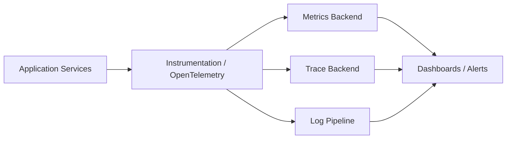
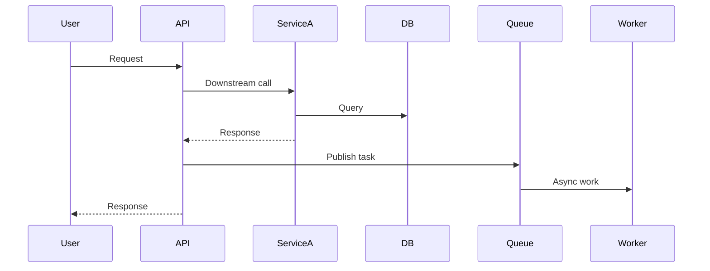

# 38. Observability

## Part Context
**Part:** Part 6 - Advanced Architecture  
**Position:** Chapter 38 of 60
**Why this part exists:** This section moves from designing systems that work in theory to operating systems that remain understandable, safe, and economical in production.  
**This chapter builds toward:** production visibility, telemetry design, SLO thinking, and debuggability at scale

## Overview
Observability is the discipline of understanding what a system is doing from the signals it emits. In small applications, developers can often inspect logs manually or reason from direct familiarity. In distributed systems, that intuition breaks down quickly. One request may cross many services, queues, databases, and caches before the user sees a result.

A production architect therefore designs not only for functionality, but also for explainability. Logs, metrics, and traces are not afterthoughts. They are the instrumentation that makes outages diagnosable, regressions measurable, and reliability goals enforceable.

## Why This Matters in Real Systems
- Without observability, highly distributed systems fail in opaque ways that are expensive to debug.
- It provides the evidence needed to manage latency, reliability, cost, and capacity instead of guessing.
- Interviewers use the topic to see whether candidates can think beyond the happy path into production operations.
- Good observability reduces mean time to detect and mean time to resolve incidents.

## Core Concepts
### Logs, metrics, and traces
These three signals answer different questions. Logs capture detailed event context. Metrics summarize behavior numerically over time. Traces connect work across services to explain end-to-end request behavior. Mature systems usually need all three.

### SLIs and SLOs
An SLI is a measurable indicator of user-relevant behavior, such as request success rate or p95 latency. An SLO is the target for that indicator. This framing keeps observability aligned with user experience rather than vanity dashboards.

### Cardinality and cost control
Telemetry can become expensive or unusable if labels explode in cardinality. A metric tagged with user_id or request_id is rarely helpful and can overwhelm storage systems. Architects must design telemetry schemas deliberately.

### Correlation and context propagation
To debug a distributed request, you need a common identifier or trace context that follows work across service boundaries. That usually means propagating headers or metadata through HTTP, queues, and background jobs.

### Actionable alerting
Not every graph deserves an alert. Alerts should map to symptoms that matter, have owners, and lead to concrete operator action. Otherwise teams learn to ignore them.

## Key Terminology
| Term | Definition |
| --- | --- |
| Log | A structured record of an event with contextual fields. |
| Metric | A numerical measurement aggregated over time, such as error rate or latency. |
| Trace | A representation of a request or workflow as it moves across system components. |
| Span | A timed unit of work within a trace. |
| SLI | Service Level Indicator, a measured aspect of system behavior relevant to users. |
| SLO | Service Level Objective, the target value or range for an SLI. |
| Sampling | The practice of recording only a subset of telemetry to control volume and cost. |
| Cardinality | The number of distinct values a label or attribute can take. |

## Detailed Explanation
### Design telemetry around user questions
The goal of observability is not to collect everything. It is to answer important questions quickly: Is the checkout failing? Which dependency is making it slow? Did the last deploy change error behavior? What tenant or region is affected? Good instrumentation starts from these questions rather than from whatever fields happen to be convenient.

### Use structured logs instead of free-form text
Logs become significantly more useful when they are machine-parseable and consistent. Fields such as request_id, tenant_id, route, status_code, and error_type make filtering and correlation much easier than vague string messages. Structured logs also reduce the temptation to encode analysis logic in fragile text search patterns.

### Metrics should express health, saturation, and efficiency
At minimum, architects want request volume, error rate, latency distributions, queue depth, cache hit rate, resource saturation, and dependency health. Prometheus-style pull systems and similar tooling are popular because they fit well with service-based environments, but the key idea is independent of the tool: expose the system’s behavior numerically and consistently.

### Tracing exposes causal paths
A latency chart can tell you that p95 increased, but a trace can show whether the time was spent in a database call, a downstream HTTP dependency, or a retry storm. Tracing is especially valuable for user journeys that cross synchronous and asynchronous boundaries. Even partial tracing can transform debugging speed.

### Observability itself must be production-engineered
Telemetry pipelines can fail, become too expensive, or overwhelm operators with noise. Architects need retention policies, sampling rules, cardinality budgets, redaction controls, and clear ownership for dashboards and alerts. Observability systems deserve the same design care as product systems.

## Diagram / Flow Representation
### Telemetry Pipeline

### Tracing a Slow Request

## Real-World Examples
- Netflix and similar streaming platforms rely heavily on metrics and tracing because one playback problem may involve many layers of infrastructure.
- Amazon-style commerce flows use traces to debug checkout and inventory paths that cross many services.
- Google-scale services often treat SLOs as a planning and prioritization mechanism, not just a dashboard number.
- Modern platforms frequently use tools such as Prometheus, Grafana, OpenTelemetry, Tempo, Jaeger, Datadog, or ELK-style stacks to implement these ideas.

## Case Study
### Diagnosing a checkout latency regression
Imagine an e-commerce platform whose checkout p95 latency jumps from 400 ms to 2.5 seconds after a release. Users complain, but only some regions appear affected. The architecture team needs to move from symptom to root cause quickly.

### Requirements
- Detect the regression automatically through latency and error SLO alerts.
- Correlate user requests across gateway, cart, payment, and inventory services.
- Identify whether the issue is code, dependency latency, retries, or regional infrastructure.
- Preserve enough detail to investigate while keeping telemetry cost under control.
- Provide dashboards and runbooks that help responders recover service fast.

### Design Evolution
- A weak initial state may rely only on application logs, making cross-service debugging slow and manual.
- The next stage adds request metrics and service-level dashboards, improving symptom detection but not causal tracing.
- A mature stage adds distributed tracing, correlation IDs, and dependency-level latency views.
- A highly mature stage couples SLOs, alert routing, release markers, and runbooks so the incident workflow is repeatable.

### Scaling Challenges
- Telemetry volume can grow faster than product traffic if labels and sampling are uncontrolled.
- Some teams instrument the easy paths but forget background jobs and asynchronous edges.
- Logs may contain sensitive data unless redaction and field discipline are enforced.
- High-alert noise trains engineers to ignore alerts even when real incidents occur.

### Final Architecture
- Every request carries trace context through synchronous and asynchronous boundaries.
- Service dashboards expose request rate, latency percentiles, error rate, saturation, and dependency breakdowns.
- Structured logs capture error details with correlation IDs and safe contextual fields.
- Alerting is tied to user-relevant SLO symptoms and routes to teams with runbooks.
- Sampling, retention, and cardinality budgets keep the observability stack sustainable.

## Architect's Mindset
- Instrument based on the questions operators must answer under pressure.
- Prefer consistent structured data over ad hoc logging habits.
- Define SLOs in user terms so engineering effort stays aligned with impact.
- Treat telemetry cost and signal quality as design constraints, not clean-up tasks.
- Make every important request path traceable across services and queues.

## Common Mistakes
- Collecting huge volumes of telemetry without clear operator value.
- Using unstructured logs that are hard to correlate or filter.
- Creating metrics with unbounded label cardinality.
- Alerting on every graph change rather than user-impacting symptoms.
- Ignoring observability for asynchronous workers and batch jobs.

## Interview Angle
- Interviewers often bring up observability as a follow-up after a design is mostly complete.
- Strong answers discuss logs, metrics, traces, SLOs, and how they map to incident response.
- Candidates stand out when they mention context propagation, cardinality control, and actionable alerts.
- Weak answers stop at “set up dashboards” without explaining what questions those dashboards answer.

## Quick Recap
- Observability makes distributed systems understandable in production.
- Logs, metrics, and traces provide complementary views of behavior.
- SLOs align telemetry with user impact.
- Tracing and structured logs are essential for fast root-cause analysis.
- Telemetry design must balance usefulness, cost, and operator clarity.

## Practice Questions
1. What is the difference between logs, metrics, and traces?
2. Why are SLOs more useful than raw dashboards alone?
3. How would you choose which labels to place on a metric?
4. Why is context propagation essential in distributed tracing?
5. What makes an alert actionable?
6. How would you instrument asynchronous queue workers?
7. What telemetry would you expose for a cache-heavy service?
8. How do you control observability cost in large systems?
9. What are the risks of putting user IDs into metric labels?
10. How would you investigate a regional latency spike using observability tools?

## Further Exploration
- Connect this chapter with reliability engineering, incident management, and cost optimization.
- Study OpenTelemetry, Prometheus, and tracing backends to see how these ideas are implemented in practice.
- Practice defining SLIs and SLOs for systems you designed in earlier chapters.

## Navigation
- Previous: [Travel & Booking Systems](../05-real-world-systems/37-travel-booking-systems.md)
- Next: [Kubernetes & DevOps](39-kubernetes-devops.md)
