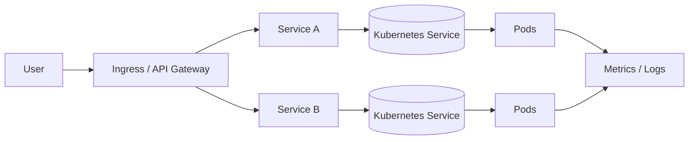
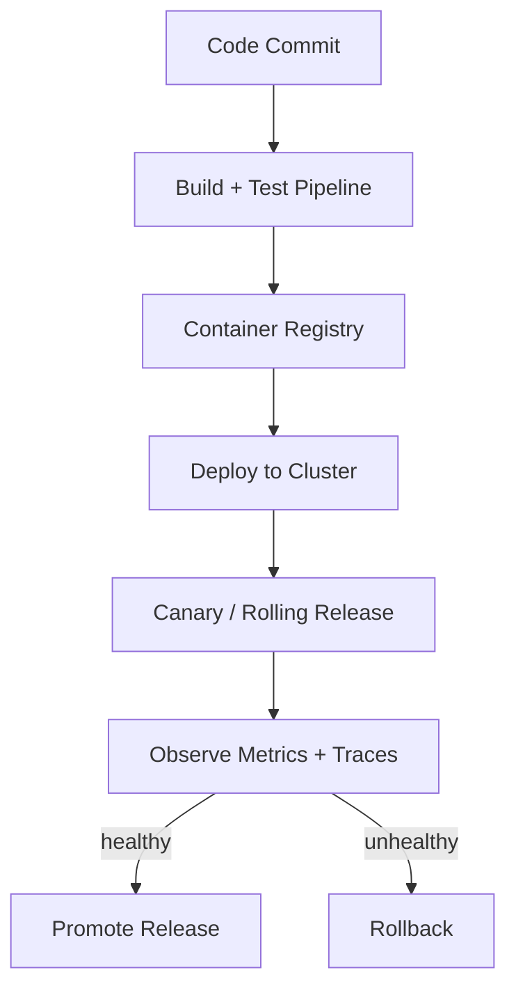

# 39. Kubernetes & DevOps

## Part Context
**Part:** Part 6 - Advanced Architecture  
**Position:** Chapter 39 of 42  
**Why this part exists:** This section focuses on how systems are actually deployed, operated, and evolved after the architecture diagram is approved.  
**This chapter builds toward:** container orchestration, deployment safety, platform thinking, and operational delivery discipline

## Overview
Kubernetes and modern DevOps practices sit at the boundary between application architecture and platform operations. They determine how services are packaged, deployed, discovered, scaled, configured, rolled back, and observed. For many teams, architecture decisions only become real when they survive these delivery mechanics.

This chapter does not treat Kubernetes as a set of YAML objects to memorize. Instead, it frames Kubernetes as a control plane for running distributed systems and DevOps as the discipline of turning code changes into safe, observable production changes.

## Why This Matters in Real Systems
- A strong design is still fragile if it cannot be deployed and rolled back safely.
- Kubernetes concepts such as pods, services, and autoscaling shape how microservices behave in production.
- DevOps practices determine release safety, operational speed, and incident recoverability.
- Interviewers increasingly expect candidates to understand how application design interacts with platform constraints.

## Core Concepts
### Containers and pods
Containers package application code with runtime dependencies. Kubernetes schedules one or more related containers together in a pod, which becomes the basic deployable unit. Architects need to understand this because resource sizing, failure domains, and sidecar patterns all operate at pod level.

### Services, ingress, and service discovery
Pods are ephemeral, so clients should not address them directly. Kubernetes Services provide stable virtual endpoints, while ingress or gateway layers expose traffic into the cluster. This abstraction changes how internal networking and load balancing are designed.

### Deployment strategies
Rolling updates, blue-green deployments, and canary releases all balance speed and risk differently. Platform choices should reflect the blast radius of failure, database compatibility, and whether traffic can be mirrored or segmented.

### Autoscaling and resource management
Horizontal Pod Autoscalers, cluster autoscaling, and resource requests or limits affect both performance and cost. Under-sizing causes throttling and instability. Over-sizing wastes money and can hide poor application behavior.

### CI/CD and platform workflows
DevOps is broader than deployment. It includes build reproducibility, automated testing, artifact promotion, infrastructure as code, secrets management, and release observability. Kubernetes is only one part of the delivery system.

## Key Terminology
| Term | Definition |
| --- | --- |
| Pod | The smallest deployable unit in Kubernetes, containing one or more containers. |
| Deployment | A controller that manages rolling updates and desired replica counts for pods. |
| Service | A stable network abstraction that routes traffic to matching pods. |
| Ingress | A layer that routes external HTTP(S) traffic into services inside the cluster. |
| HPA | Horizontal Pod Autoscaler, which adjusts replica counts based on metrics. |
| Rolling Update | A deployment approach that gradually replaces old instances with new ones. |
| Blue-Green | A release strategy with two full environments, switching traffic from old to new. |
| GitOps | An operational model where declarative infrastructure and deployment state are managed through version control. |

## Detailed Explanation
### Think in workloads, not just manifests
Kubernetes resources are useful only when tied to workload behavior. A stateless API service, a queue worker, and a stateful database replica have different lifecycle, scaling, and recovery needs. Architects should classify workloads first, then choose the right platform primitives.

### Use deployment strategies to reduce blast radius
A rolling update is often enough for backward-compatible stateless services. High-risk changes may justify canary rollout with real traffic observation. Critical products may prefer blue-green deployments so rollback is mostly a routing decision. The point is not to memorize the names, but to connect release mechanics to business risk.

### Pair autoscaling with good application behavior
Autoscaling works best when applications expose meaningful metrics and tolerate replica churn. If startup is slow, connection pools are fragile, or caches cold-start badly, scaling alone will not save the service. Platform and application design must fit together.

### Platform abstractions should remove repetitive toil
DevOps maturity often shows up as paved roads: standard base images, consistent health probes, shared observability, reusable CI pipelines, secret rotation, and policy enforcement. Architects should value these because they compress delivery risk across many teams.

### Kubernetes is not the architecture by itself
Running a monolith on Kubernetes does not make it cloud-native, and running microservices there does not guarantee resilience. Kubernetes is an execution environment. The underlying service boundaries, data consistency models, and failure-handling logic still matter more than the container platform alone.

## Diagram / Flow Representation
### Cluster-Level Architecture

### Progressive Delivery Flow

## Real-World Examples
- Many cloud-native teams use Kubernetes to standardize service deployment, networking, and scaling across many applications.
- Platform teams often pair Kubernetes with Prometheus, Grafana, ingress controllers, service meshes, and GitOps tooling to build an internal developer platform.
- Netflix-scale organizations use a variety of platform abstractions, but the underlying concerns of safe rollout, autoscaling, and observability are universal even when the tooling differs.
- Smaller teams may use managed Kubernetes or simpler container platforms while still applying the same deployment and reliability principles.

## Case Study
### Deploying an e-commerce service on Kubernetes
Assume a retail platform has a checkout API, an inventory service, a background worker, and a notification service. Traffic spikes sharply during sales events, and releases must be safe because checkout failures are revenue-impacting.

### Requirements
- Package services consistently and deploy them repeatably across environments.
- Scale API and worker components independently based on traffic and backlog.
- Route external traffic safely and expose service-to-service discovery internally.
- Perform low-risk rollouts with monitoring and fast rollback.
- Manage configuration, secrets, and observability in a standardized way.

### Design Evolution
- A first stage may containerize services and deploy them with simple rolling updates.
- A later stage adds health probes, autoscaling, ingress routing, and centralized observability.
- As release risk grows, canary or blue-green workflows and automated analysis become necessary.
- As the platform matures, GitOps, policy enforcement, and reusable templates reduce variance across teams.

### Scaling Challenges
- Pods are ephemeral, so application startup and readiness behavior matter more than in long-lived VM environments.
- Resource requests and limits are difficult to tune and can create both cost waste and instability.
- Database migrations and backward compatibility can become the real deployment bottleneck.
- Without platform standards, teams recreate pipelines, logging, and security controls inconsistently.

### Final Architecture
- Services run as deployments with tuned resource requests, readiness probes, and horizontal scaling policies.
- Ingress or gateway layers route public traffic while internal service discovery uses cluster-native abstractions.
- CI/CD builds signed images, promotes artifacts, and performs progressive deployments with observability checks.
- Configuration and secrets are managed declaratively with clear environment separation.
- The platform exposes metrics, logs, and release markers so operators can judge rollout safety quickly.

## Architect's Mindset
- Connect workload behavior to platform primitives instead of using one deployment pattern for everything.
- Choose rollout strategies according to blast radius, reversibility, and user impact.
- Treat platform standards as leverage: they make many teams safer at once.
- Pair autoscaling with application design that tolerates churn and cold starts.
- Remember that Kubernetes solves deployment mechanics, not poor service boundaries or weak reliability design.

## Common Mistakes
- Treating Kubernetes as a goal instead of an execution environment.
- Using default resource settings without measuring real workload needs.
- Ignoring readiness, liveness, and startup behaviors.
- Rolling out incompatible application and database changes together without a safety plan.
- Building bespoke pipelines for every team instead of reusable platform patterns.

## Interview Angle
- Interviewers may ask how a designed system is deployed, scaled, and rolled back in production.
- Strong answers discuss stateless versus stateful workloads, autoscaling, rollout strategy, and observability.
- Candidates stand out when they connect Kubernetes primitives to system behavior instead of listing objects mechanically.
- Weak answers use Kubernetes buzzwords without explaining how releases remain safe.

## Quick Recap
- Kubernetes provides runtime control over deployment, networking, and scaling, but it does not replace architecture.
- Pods, services, ingress, and autoscaling shape how microservices run in production.
- DevOps practices turn code changes into safe, observable releases.
- Platform standards reduce repeated toil and lower operational variance.
- Release strategy should always reflect business risk and reversibility.

## Practice Questions
1. Why are pods considered the basic scheduling unit in Kubernetes?
2. How does a Service differ from an Ingress?
3. When would you prefer canary deployment over rolling update?
4. Why can autoscaling fail even when the cluster has free capacity?
5. How should a background worker scale differently from a stateless API?
6. What platform capabilities are worth standardizing across teams?
7. How do database migrations complicate containerized deployments?
8. Why do readiness probes matter for release safety?
9. How would you reduce deployment risk for a revenue-critical service?
10. What does GitOps change in a team’s delivery model?

## Further Exploration
- Study service meshes, policy engines, and internal developer platforms for the next layer of platform maturity.
- Connect this chapter with observability and cost optimization, since deployment choices affect both.
- Practice mapping earlier system designs onto concrete runtime and release workflows.

## Navigation
- Previous: [Observability](38-observability.md)
- Next: [Security & Authentication](40-security-authentication.md)
