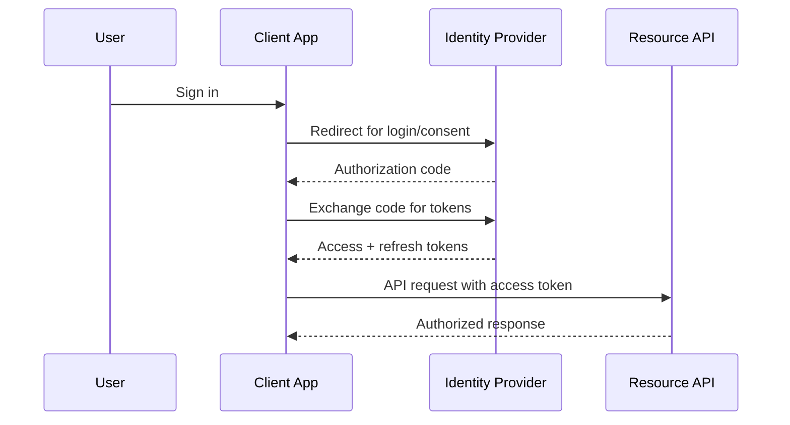
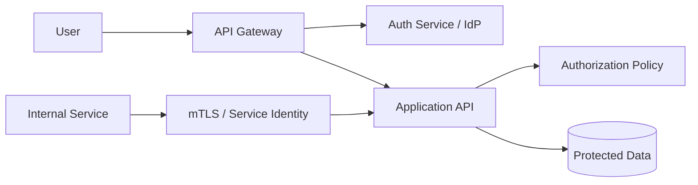

# A8. Security & Authentication

## Part Context
**Part:** Part 6 - Advanced Architecture
**Position:** Chapter A8 (Advanced Architecture — Security & Authentication Primer)
**Complements:** F9: Security Fundamentals (deep chapter) covers threat modeling, encryption, compliance, and audit in production depth. This chapter provides the conceptual primer for identity and access architecture.
**Why this part exists:** This section adds the production-grade concerns that separate a technically functioning system from a trustworthy one.
**This chapter builds toward:** identity flows, authorization design, token strategy, and secure-by-default architectural thinking

## Overview
Security and authentication are foundational system-design concerns because every architecture choice changes the attack surface. Authentication answers “who is this principal?” Authorization answers “what may they do?” Secure system design must also consider transport security, secret management, abuse prevention, and how trust is established between services.

This chapter focuses on architectural clarity rather than implementation trivia. The goal is to help you reason about identity, session models, OAuth-based delegation, JWT trade-offs, and zero-trust thinking in a way that scales from interviews to real production systems.

## Why This Matters in Real Systems
- Every public-facing system eventually needs strong answers for identity, session control, and access boundaries.
- Security failures are often architecture failures: unclear trust boundaries, poor secret handling, or over-broad privileges.
- Interviewers use security follow-ups to see whether candidates can protect the system they just designed.
- Authentication and authorization decisions affect latency, scalability, user experience, and compliance obligations.

## Core Concepts
### Authentication versus authorization
Authentication verifies identity. Authorization decides access. Mixing them conceptually leads to weak designs, such as assuming that a valid token automatically implies permission for all actions.

### Session-based and token-based models
Traditional web systems often maintain server-side sessions. APIs and distributed systems often use signed or opaque tokens. Neither is universally better. The right choice depends on revocation needs, infrastructure shape, client type, and trust boundaries.

### OAuth and OpenID Connect
OAuth is a delegated authorization framework that lets one system access resources on a user’s behalf. OpenID Connect layers identity on top. Architects should understand the authorization-code flow conceptually because it is the backbone of many modern login and delegation systems.

### JWT trade-offs
JWTs are convenient because they are self-contained and verifiable without a central session store, but they complicate revocation, increase token size, and can encourage over-sharing of claims. They are useful tools, not universal defaults.

### Defense in depth
Authentication alone is not enough. Real systems need TLS, secret rotation, least privilege, audit logs, rate limiting, abuse detection, and strong service-to-service trust controls.

## Key Terminology
| Term | Definition |
| --- | --- |
| Principal | An authenticated identity such as a user, device, or service. |
| Session | Server-tracked authentication state for a client interaction. |
| Access Token | A credential used to authorize API requests. |
| Refresh Token | A longer-lived credential used to obtain new access tokens. |
| JWT | JSON Web Token, a signed token format that can carry claims. |
| OAuth 2.0 | A framework for delegated authorization. |
| OIDC | OpenID Connect, an identity layer built on top of OAuth 2.0. |
| Least Privilege | The principle of granting only the access required for a task. |

## Detailed Explanation
### Start from trust boundaries
Before choosing OAuth, JWT, or sessions, identify the principals and boundaries in the system. Is the caller a browser, a mobile app, a backend service, or a partner integration? Which actions require user identity versus service identity? Which data is sensitive? These answers determine where credentials are issued, validated, and scoped.

### Choose the right session model for the system shape
Server-side sessions simplify revocation and central control, which is useful for traditional web apps. Token-based approaches fit API ecosystems and horizontally scaled service architectures because request validation can happen without a shared session store. The trade-off is that revocation, rotation, and claim management become more subtle.

### Understand delegated authorization flows
In an OAuth-style authorization-code flow, the user authenticates with an identity provider, grants consent, and the client exchanges a code for tokens. This allows applications to avoid handling user passwords directly. Architects should understand this because many products today depend on third-party identity or internal identity providers.

### Design authorization as a first-class policy layer
Roles, scopes, resource ownership, and attribute-based rules should be modeled clearly. Authorization logic scattered across controllers and services becomes inconsistent and fragile. A well-designed policy layer keeps access decisions auditable and easier to evolve.

### Think beyond login
Security architecture also includes secret storage, key rotation, encrypted transport, CSRF protection where relevant, replay prevention, device trust, audit logging, and suspicious-behavior detection. A login screen is only the visible edge of a deeper trust system.

## Diagram / Flow Representation
### OAuth Authorization Code Flow


### Service Authorization Boundary


## Real-World Examples
- Consumer apps commonly use OAuth or OIDC with an identity provider for web and mobile login flows.
- Enterprise platforms often separate user authentication from fine-grained authorization policies for tenants, roles, and resources.
- Service-to-service authentication may rely on mTLS, workload identity, or short-lived tokens rather than user sessions.
- Large systems frequently pair identity providers with WAFs, audit systems, and risk engines for layered protection.

## Case Study
### Securing a multi-client product platform
Assume a product supports web, mobile, and partner APIs. Users log in through an identity provider, internal services call each other, and data is tenant-scoped. The architecture must support delegated access, token refresh, and least-privilege authorization.

### Requirements
- Users can authenticate securely from browser and mobile clients.
- Access tokens should be short-lived and scoped appropriately.
- Authorization rules must consider user role, tenant, and resource ownership.
- Internal services need trustworthy identities for service-to-service calls.
- The platform must support revocation, auditability, and suspicious-activity detection.

### Design Evolution
- A simple initial system may use server sessions for one web client and coarse roles.
- As APIs and mobile clients appear, token-based flows and refresh mechanics become necessary.
- As tenancy and partner integrations expand, scopes, policy engines, and delegated access become more sophisticated.
- As compliance needs grow, audit logs, centralized secret management, and stronger service identity controls become mandatory.

### Scaling Challenges
- JWT convenience can obscure difficult revocation and claim-freshness questions.
- Authorization logic often spreads across many services and becomes inconsistent.
- Long-lived credentials dramatically increase blast radius when leaked.
- Internal trust is often over-assumed, which becomes dangerous in microservice environments.

### Final Architecture
- An identity provider handles login, MFA, and token issuance using OAuth/OIDC-compatible flows.
- Clients use short-lived access tokens plus refresh mechanisms appropriate to their threat model.
- APIs enforce authorization through centralized policy logic using roles, scopes, and ownership checks.
- Internal services authenticate with workload identity or mTLS instead of shared static secrets.
- Audit trails, secret rotation, rate limiting, and anomaly detection complement the authentication system.

## Architect's Mindset
- Start from trust boundaries and threat surface, not from a preferred token format.
- Choose token and session patterns that match revocation, client type, and operational complexity.
- Keep authorization explicit, reviewable, and centrally understandable.
- Prefer short-lived credentials and least privilege to reduce blast radius.
- Treat service-to-service trust with the same seriousness as user login.

## Canonical Identity Architecture

This reference architecture shows how identity, authentication, and authorization flow through a production system with multiple client types and internal services.

```
┌─────────────────────────────────────────────────────────┐
│  CLIENTS                                                 │
│  [Web App]  [Mobile App]  [Partner API]  [Internal SPA]  │
└──────────────────────┬──────────────────────────────────┘
                       │ HTTPS + Authorization header
┌──────────────────────▼──────────────────────────────────┐
│  API GATEWAY / Edge                                      │
│  • TLS termination                                       │
│  • Rate limiting (per API key / per tenant)               │
│  • JWT validation (signature + expiry + issuer)           │
│  • Forward identity context to backends                   │
└──────────────────────┬──────────────────────────────────┘
                       │ Internal: identity context (user_id, tenant_id, scopes)
┌──────────────────────▼──────────────────────────────────┐
│  IDENTITY PROVIDER (IdP)                                 │
│  • Login (password, SSO, social, MFA)                    │
│  • Token issuance (access + refresh + ID tokens)         │
│  • OAuth 2.1 / OIDC compliant                            │
│  • Session management + revocation                        │
│  Examples: Auth0, Okta, Keycloak, AWS Cognito             │
└──────────────────────┬──────────────────────────────────┘
                       │
┌──────────────────────▼──────────────────────────────────┐
│  AUTHORIZATION LAYER                                     │
│  • Policy engine: OPA / Cedar / Casbin / custom           │
│  • Input: (principal, action, resource, context)          │
│  • Rules: RBAC, ABAC, resource ownership, tenant scope    │
│  • Output: allow / deny + reason                          │
│  • Audit: every decision logged                           │
└──────────────────────┬──────────────────────────────────┘
                       │
┌──────────────────────▼──────────────────────────────────┐
│  APPLICATION SERVICES                                    │
│  • Enforce authZ decision (never re-implement locally)    │
│  • Pass identity context via headers / gRPC metadata      │
│  • Service-to-service auth: workload identity / mTLS      │
└──────────────────────┬──────────────────────────────────┘
                       │
┌──────────────────────▼──────────────────────────────────┐
│  DATA LAYER                                              │
│  • Row-level security (tenant isolation)                 │
│  • Encryption at rest (KMS)                              │
│  • Field-level encryption for PII                        │
│  • Audit logging for sensitive data access                │
└──────────────────────────────────────────────────────────┘
```

---

## OAuth 2.1 and OIDC — Modern Standards

OAuth 2.1 consolidates best practices from OAuth 2.0 and its security extensions into a single specification. OIDC layers identity on top.

### OAuth 2.1 Key Changes from 2.0

| Change | What It Means | Why It Matters |
|--------|-------------|----------------|
| **PKCE required for all clients** | Proof Key for Code Exchange prevents authorization code interception | Mobile and SPA apps are no longer second-class |
| **Implicit flow removed** | No more tokens in URL fragments | Eliminates a major token leakage vector |
| **Resource owner password grant removed** | Apps must never handle user passwords | Forces proper delegated auth |
| **Refresh token rotation required** | Every refresh produces a new refresh token; old one is invalidated | Limits damage from stolen refresh tokens |
| **Exact redirect URI matching** | No wildcard or partial matching | Prevents open redirect attacks |

### Token Strategy Quick Reference

| Token | Lifetime | Where Stored | Revocation | Use Case |
|-------|----------|-------------|-----------|----------|
| **Access token (JWT)** | 5-15 minutes | Memory (SPA), secure storage (mobile) | Short-lived = self-revoking | API authorization |
| **Refresh token** | Hours to days | Secure HTTP-only cookie or secure storage | Server-side revocation list | Obtain new access tokens |
| **ID token (JWT)** | 5-15 minutes | Memory | N/A (used once for identity verification) | Prove user identity to client |
| **Session cookie** | Hours | HTTP-only, Secure, SameSite cookie | Server-side session store (invalidate on logout) | Traditional web app auth |

---

## Service-to-Service Authentication Patterns

Internal services must authenticate to each other. "The network is trusted" is not a security architecture.

| Pattern | How It Works | Best For | Limitation |
|---------|-------------|----------|-----------|
| **mTLS (mutual TLS)** | Both sides present certificates; mesh automates rotation | Service mesh environments (Istio, Linkerd) | Requires cert infrastructure; no application-layer identity |
| **Workload identity** | Cloud-native identity tied to compute (e.g., AWS IAM Role, GCP Service Account) | Cloud services calling cloud APIs | Vendor-specific; doesn't work across clouds |
| **Service tokens (JWT)** | Service obtains short-lived JWT from IdP; passes to downstream | Cross-service calls needing application-level claims | Requires token management per service |
| **API keys** | Static secret per service | Simple internal APIs | No rotation without downtime unless externalized |

### Secret Rotation Architecture

Static secrets are the #1 source of service-to-service credential compromise. Rotation must be automated.

```
Secret Lifecycle:
  1. Secret created in Vault / AWS Secrets Manager
  2. Application reads secret via sidecar or SDK (never from env var directly)
  3. Rotation scheduled (e.g., every 30 days)
  4. New secret generated → pushed to secret store
  5. Application picks up new secret on next read (no restart needed)
  6. Old secret remains valid for grace period (dual-secret window)
  7. Old secret invalidated after grace period

Tools: HashiCorp Vault, AWS Secrets Manager, External Secrets Operator (K8s)
```

---

## Authorization Boundaries — Worked Examples

Authorization is where most security designs become inconsistent. These examples show how to model boundaries for common scenarios.

### Example 1: Multi-Tenant SaaS

```
Policy: Users can only access resources within their own tenant.

Input:  (user: alice@acme.com, action: read, resource: /api/invoices/inv-123)
Check:  invoice.tenant_id == user.tenant_id
Result: ALLOW if tenant matches; DENY otherwise

Enforcement:
  • API Gateway: validate JWT, extract tenant_id from claims
  • Application: add WHERE tenant_id = :user_tenant_id to every query
  • Database: PostgreSQL Row-Level Security as defense-in-depth
```

### Example 2: Role-Based Access (RBAC)

```
Roles: admin, editor, viewer
Resources: documents

Policy:
  admin  → create, read, update, delete
  editor → create, read, update
  viewer → read

Input:  (user: bob, role: editor, action: delete, resource: doc-456)
Result: DENY (editor cannot delete)
```

### Example 3: Attribute-Based Access (ABAC)

```
Policy: Users can approve expenses only if:
  - They are a manager AND
  - The expense is from their department AND
  - The amount is ≤ their approval limit

Input:  (user: carol, role: manager, dept: engineering, action: approve,
         resource: expense-789 {dept: engineering, amount: $4,500})
Check:  carol.role == manager
        AND expense.dept == carol.dept
        AND expense.amount <= carol.approval_limit ($5,000)
Result: ALLOW
```

### Authorization Model Comparison

| Model | How Decisions Are Made | Best For | Limitation |
|-------|----------------------|----------|-----------|
| **RBAC** | Role → permissions mapping | Simple apps, internal tools | Doesn't handle resource-level or contextual rules |
| **ABAC** | Attributes of user + resource + context | Complex policies, regulatory compliance | Policy complexity can grow quickly |
| **ReBAC** | Relationship between user and resource (ownership, group membership) | Social apps, document sharing, Google Zanzibar-style | Requires relationship graph infrastructure |

---

## Well-Architected Security References

| Resource | What You'll Learn |
|----------|------------------|
| **OWASP Top 10** | Most critical web application security risks; update annually |
| **OAuth 2.1 Specification** (datatracker.ietf.org) | Consolidated modern auth standard |
| **NIST 800-63** (Digital Identity Guidelines) | Identity proofing, authentication assurance levels |
| **AWS Well-Architected Security Pillar** | Cloud-specific security design principles |
| **Google BeyondCorp** | Zero-trust architecture reference (no VPN, per-request auth) |
| **F9: Security Fundamentals** (this site) | Deep chapter covering threat modeling, encryption, compliance |

### Cross-Links

| Topic | Chapter |
|-------|---------|
| API gateway auth and rate limiting | Ch 15: API Gateway Pattern |
| Edge security (WAF, DDoS) | Ch 4: Networking Fundamentals |
| Per-tenant data isolation | Ch 5: Databases Deep Dive |
| Supply-chain security (image signing, SBOM) | F11: Deployment & DevOps §1.5 |
| Service mesh mTLS | F11 §3.5 (Service Mesh) |
| Regulatory/compliance requirements | Ch 2: Types of Requirements |

## Common Mistakes
- Using JWTs everywhere without understanding revocation and claim staleness trade-offs.
- Confusing authentication with authorization.
- Embedding sensitive data directly into tokens.
- Relying on long-lived static secrets between services.
- Scattering access-control checks across the codebase with no shared policy model.

## Interview Angle
- Interviewers often ask security as a follow-up to any public system design.
- Strong answers cover authentication model, authorization boundaries, token/session trade-offs, and service trust.
- Candidates stand out when they mention least privilege, secret rotation, and auditable policy enforcement.
- Weak answers reduce security to “use HTTPS and JWT” with no trust-boundary reasoning.

## Quick Recap
- Security architecture starts with clear trust boundaries.
- Authentication proves identity; authorization decides access.
- OAuth/OIDC solve delegated access and modern login patterns, but they must be applied thoughtfully.
- JWTs are useful but come with revocation and claim-management trade-offs.
- Defense in depth requires identity, transport security, policy, auditing, and operational controls together.

## Practice Questions
1. What is the difference between authentication and authorization?
2. When would you choose server sessions over JWT-based access tokens?
3. Why are short-lived tokens generally safer than long-lived tokens?
4. What does OAuth solve that simple username-password login does not?
5. How would you revoke access quickly in a token-based system?
6. Why should internal services have their own identities?
7. What risks appear when authorization logic is duplicated across services?
8. How would you model tenant-aware authorization?
9. Why is least privilege important in both user and service contexts?
10. What telemetry would you want from an authentication platform?

## Further Exploration
- Study threat modeling, key management, and application security controls to extend this chapter.
- Connect these ideas with API gateways, service meshes, and audit systems in production environments.
- Practice adding authentication and authorization layers to earlier chapter designs.


## Navigation
- Previous: [Kubernetes & DevOps](39-kubernetes-devops.md)
- Next: [Cost Optimization](41-cost-optimization.md)
