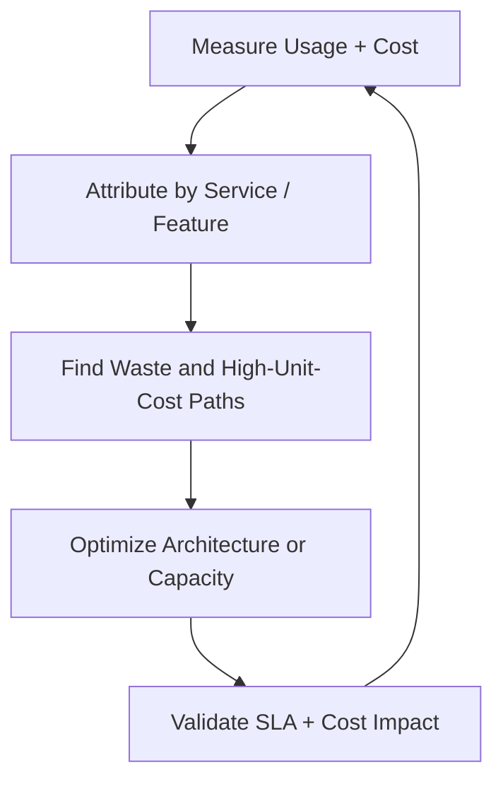
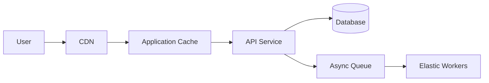

# 41. Cost Optimization

## Part Context
**Part:** Part 6 - Advanced Architecture  
**Position:** Chapter 41 of 60
**Why this part exists:** This section teaches the final layer of architect thinking: a system is not fully designed until it is economically sustainable under real load.  
**This chapter builds toward:** cost-aware architecture, capacity discipline, unit economics, and trade-off evaluation under budget constraints

## Overview
Cost optimization is not about making every system cheap. It is about making cost proportional to value and aligned with business requirements. A system that is too expensive for its traffic profile is poorly designed, but a system that is cheap because it fails reliability or latency goals is also poorly designed. The architect’s job is to find the right efficiency point.

This chapter frames cost as an architectural dimension alongside scalability, reliability, and security. Compute, storage, network egress, managed-service pricing, and engineering complexity all interact. Optimizing one blindly can easily increase another.

## Why This Matters in Real Systems
- Cloud systems can scale cost as quickly as they scale traffic, especially when caching and data movement are weak.
- Architects need to justify design choices in terms of both technical quality and economic sustainability.
- Interviewers increasingly expect candidates to mention cost trade-offs after presenting a scalable design.
- Cost-aware design reduces waste and sharpens thinking about real bottlenecks.

## Core Concepts
### Cost anatomy
Most production bills are driven by a mix of compute, storage, data transfer, managed-service premiums, and operator time. Architects should understand which of these dominate for their system type. Streaming platforms often pay heavily for egress. Analytics platforms may pay for storage and query scans. API services may pay mostly for compute and databases.

### Right-sizing and elasticity
A common waste pattern is paying peak cost continuously for non-peak traffic. Autoscaling, scheduled scaling, serverless models, and queue-driven worker fleets help align spend with actual demand, provided application behavior supports elasticity.

### Caching and data movement
Data transfer is often underestimated. Serving content through a CDN, increasing cache hit rate, compressing payloads, and reducing cross-zone or cross-region chatter can materially lower both cost and latency.

### Storage lifecycle management
Hot data, warm data, and archival data should not live on the same storage tier forever. Retention rules, compaction, compression, and object lifecycle policies can produce substantial savings without harming user experience.

### Cost visibility and unit economics
You cannot optimize what you cannot attribute. Good systems measure cost per request, per tenant, per workflow, or per feature so teams can see which product surfaces are economically efficient and which are not.

## Key Terminology
| Term | Definition |
| --- | --- |
| Unit Economics | A measure of cost relative to a business or technical unit, such as cost per request or per customer. |
| Right-Sizing | Adjusting resources so they match observed workload rather than guesswork or peak-only assumptions. |
| Egress | Outbound data transfer, often a major cost component in cloud systems. |
| Reserved Capacity | Pre-purchased capacity that lowers unit cost when demand is predictable. |
| Cold Storage | Low-cost storage intended for infrequently accessed data. |
| Cache Hit Rate | The percentage of requests served from cache rather than the origin system. |
| Overprovisioning | Allocating significantly more resources than the workload needs. |
| FinOps | The operational practice of managing cloud spend collaboratively across engineering, finance, and product. |

## Detailed Explanation
### Optimize for the requirement, not for the invoice line in isolation
A faster but slightly more expensive cache layer can lower database spend and improve latency. A managed database may cost more than self-hosting but reduce operational risk and labor. Cost optimization is therefore a systems problem, not a procurement-only problem. The relevant question is whether a design delivers the required reliability and performance at a justified total cost.

### Start with measurement and attribution
Teams often try to optimize cost before they know what is driving it. Good practice begins with cost dashboards and unit metrics tied to architecture: database spend by workload, cache miss penalty, egress by region, idle capacity by service, and growth trends by tenant or feature. Architecture decisions become much better when these numbers are visible.

### Reduce unnecessary work first
The cheapest request is the one you never make. Caching, batching, payload trimming, denormalized read models, and better indexes often reduce both cost and latency. Similarly, aggressive retries, N+1 dependency calls, or overly chatty cross-service interactions increase both cost and fragility.

### Use tiering and elasticity intelligently
Not all data and compute deserve premium treatment. Background analytics jobs can run on flexible or spot capacity. Historical data can move to cheaper tiers. Stateless APIs can scale to demand. Cost optimization becomes easier when workloads are categorized by urgency, durability, and responsiveness.

### Account for engineering complexity
Some cost reductions create operational or development complexity that outweighs the savings. Architects should compare not only monthly bills, but also team productivity, migration risk, incident frequency, and future constraints. The cheapest architecture on paper can become the most expensive one to maintain.

## Diagram / Flow Representation
### Cost Feedback Loop

### Serving Path with Cost Levers

## Real-World Examples
- Streaming and media platforms often optimize CDN hit rate because egress dominates cost.
- High-QPS APIs lower cost by increasing cache hit rate, reducing payload size, and eliminating unnecessary downstream calls.
- Data platforms save heavily through retention policies, partitioning, and moving old data to cheaper storage tiers.
- Many organizations adopt FinOps practices so engineering and finance can reason about spend using shared metrics and forecasts.

## Case Study
### Reducing cloud spend for a growing SaaS platform
Assume a SaaS product sees rapid growth, but monthly infrastructure cost is rising faster than revenue. The platform includes customer-facing APIs, background jobs, analytics storage, file uploads, and global traffic delivery. Leadership wants lower spend without worsening customer experience.

### Requirements
- Preserve existing latency and reliability targets while reducing waste.
- Identify the services and features driving the highest unit costs.
- Improve elasticity for spiky workloads and background processing.
- Tier storage and retention policies based on data access patterns.
- Create a repeatable cost-review process instead of one-time cleanup.

### Design Evolution
- A first pass introduces cost dashboards, tagging, and basic attribution so teams can see where spend is concentrated.
- Next, the architecture improves cache hit rate, removes inefficient queries, and right-sizes overprovisioned compute.
- Later, analytics and archival data move to cheaper storage and non-urgent jobs shift to elastic or opportunistic capacity.
- Finally, unit economics and budget guardrails become part of regular engineering planning and design review.

### Scaling Challenges
- Many organizations cannot attribute spend clearly, so optimization work becomes anecdotal and political.
- Some savings require application changes, not just cloud-console tuning.
- Aggressive downsizing can cause latency regressions or reliability problems if traffic assumptions are wrong.
- Shared platforms make it hard to know which team owns a wasteful pattern without better telemetry.

### Final Architecture
- Cost and usage are measured by service, environment, tenant, and major workflow where feasible.
- Caching, query optimization, and payload reduction eliminate unnecessary work on high-traffic paths.
- Stateless services and workers scale more closely to actual demand, while predictable baseline capacity may use reserved pricing.
- Storage is tiered based on retention and access frequency, with lifecycle automation for old data.
- Architecture reviews include explicit discussion of cost per request or per business outcome, not just functional correctness.

## Architect's Mindset
- Treat cost as a design dimension alongside latency, reliability, and security.
- Optimize unnecessary work before chasing exotic pricing tricks.
- Use measurement and attribution to avoid cargo-cult savings efforts.
- Prefer elasticity where workloads are bursty and steady capacity where demand is predictable.
- Count engineering complexity and operational risk as part of total cost.

## Common Mistakes
- Trying to cut spend without first understanding where it comes from.
- Optimizing the bill while degrading user-facing SLAs.
- Ignoring data transfer and cache miss cost.
- Leaving cold data on expensive hot storage forever.
- Assuming the cheapest service on paper has the lowest total cost of ownership.

## Interview Angle
- Interviewers often ask for cost follow-ups after a high-scale architecture is presented.
- Strong answers mention caching, tiering, elasticity, and unit economics rather than vague “optimize infra” statements.
- Candidates stand out when they can describe cost as a consequence of architecture, not only of vendor pricing.
- Weak answers reduce cost optimization to “use serverless” or “use spot instances” without workload reasoning.

## Quick Recap
- Cost optimization means aligning spend with requirements and value, not simply minimizing bills.
- Measurement and attribution are prerequisites for effective optimization.
- Reducing unnecessary work often improves both cost and performance.
- Elasticity, storage tiering, and cache efficiency are major levers.
- Total cost includes operational complexity and engineering effort, not just infrastructure pricing.

## Practice Questions
1. Why is cost optimization an architectural problem rather than only a finance problem?
2. What is unit economics in the context of system design?
3. How can a cache improve both performance and cost?
4. Why is egress often a major blind spot?
5. When should you use reserved capacity versus elastic or on-demand capacity?
6. How would you identify whether a database is overprovisioned or poorly queried?
7. What types of data belong on cheaper storage tiers?
8. Why can some cost-saving efforts increase total cost of ownership?
9. What metrics would you review monthly for a high-scale API platform?
10. How would you incorporate cost review into architecture decisions from the start?

## Further Exploration
- Connect this chapter with observability, caching, and storage systems because the strongest cost levers often live there.
- Study FinOps practices and cloud-provider pricing models to deepen the economic side of architecture.
- Practice revisiting earlier system designs and explicitly identifying their largest cost drivers.

## Navigation
- Previous: [Security & Authentication](40-security-authentication.md)
- Next: [AI in System Design](42-ai-in-system-design.md)
