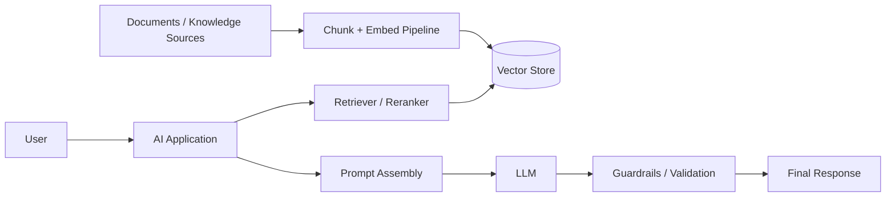
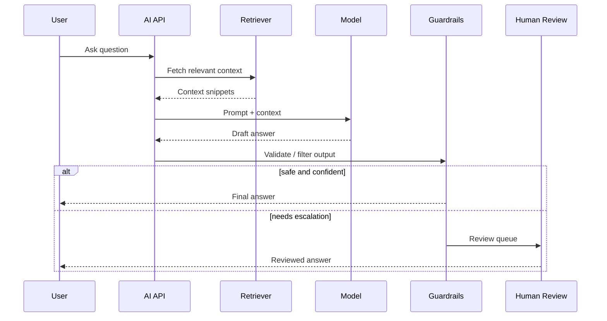

# 42. AI in System Design

## Part Context
**Part:** Part 6 - Advanced Architecture  
**Position:** Chapter 42 of 42  
**Why this part exists:** This final section expands classical system design into the emerging world of AI-assisted engineering and AI-native product architectures.  
**This chapter builds toward:** AI-assisted architecture, LLM system design, retrieval pipelines, evaluation loops, and new trade-offs around latency, safety, and cost

## Overview
AI now influences system design in two important ways. First, architects use AI tools to accelerate analysis, documentation, and design exploration. Second, many products now include AI components directly: retrieval-augmented generation, copilots, recommendation systems, classification pipelines, and agent-style workflows. Both uses require disciplined system thinking.

This chapter focuses on the second category while still acknowledging the first. LLM-based systems are not “magic endpoints.” They are distributed systems with prompts, context assembly, model selection, retrieval, safety layers, evaluation pipelines, caching, and human fallback. Classical system-design principles still apply, but the failure modes become less deterministic.

## Why This Matters in Real Systems
- AI-native products are now common across search, support, productivity, and developer tooling.
- LLM systems add new dimensions such as prompt quality, context retrieval, hallucination risk, evaluation drift, and token cost.
- Architects need to integrate AI components without abandoning reliability, observability, or security discipline.
- Interviewers increasingly ask how to incorporate AI into products while keeping systems practical and trustworthy.

## Core Concepts
### AI as a system component
A model call is only one step in a broader pipeline. Real AI products need preprocessing, retrieval, ranking, prompt assembly, model invocation, output validation, and logging or evaluation. Treating the model as the entire architecture hides the operational work that actually determines success.

### Retrieval-augmented generation
RAG combines external knowledge retrieval with model generation. The architecture usually includes chunking source data, creating embeddings, storing vectors, retrieving top candidates, reranking or filtering them, and then constructing a context window for the model. Retrieval quality often matters more than model size for domain-specific usefulness.

### Latency, cost, and model choice
Larger models may produce better outputs but cost more and respond more slowly. Many systems therefore use model cascades, caching, summarization, or smaller specialized models for some steps. Architects should treat model selection as a latency-and-cost trade-off, not just a quality contest.

### Evaluation and guardrails
Unlike deterministic systems, AI outputs must be evaluated probabilistically. Teams need offline evaluation datasets, online quality signals, human review loops for sensitive tasks, and output constraints such as policy filters, schema validation, or tool-use restrictions.

### Security and trust
AI systems introduce prompt injection, data leakage, unsafe tool execution, and context poisoning risks. Input filtering, retrieval boundaries, secret isolation, and scoped tool permissions become part of the architecture.

## Key Terminology
| Term | Definition |
| --- | --- |
| LLM | Large language model used for generation, reasoning, or transformation tasks. |
| RAG | Retrieval-augmented generation, where retrieved context is added to a model prompt. |
| Embedding | A vector representation of text or other content used for similarity search. |
| Vector Store | A database optimized for storing and querying embeddings. |
| Prompt Injection | An attack where untrusted input attempts to manipulate model instructions or tool behavior. |
| Grounding | Anchoring model output in trusted retrieved context or tools. |
| Evaluation Set | A collection of test cases used to measure AI system quality or regressions. |
| Fallback | An alternate path such as a smaller model, search result, or human handoff used when the preferred AI path is unsuitable. |

## Detailed Explanation
### Use classical decomposition first
A good AI system design still starts with requirements, latency goals, failure modes, and user trust. Is the system generating suggestions, retrieving answers, executing actions, or summarizing documents? What happens when the model is unsure, slow, or wrong? These questions should be answered before choosing a model or building a vector store.

### RAG is a pipeline, not a checkbox
Teams often say they will “add RAG” as if it were a single feature. In reality, you must define document ingestion, chunk sizing, embedding generation, indexing, metadata filtering, retrieval strategy, context-window limits, and refresh behavior. Weak ingestion or poor chunking usually produces worse results than a suboptimal prompt.

### Design for non-determinism and evaluation
Traditional systems can often be tested with exact expected outputs. AI systems need benchmark sets, rubric-based grading, model-versus-model comparison, human review for edge cases, and online monitoring for quality drift. Evaluation is not a post-launch feature. It is the way you keep the system from silently becoming worse.

### Control blast radius with constrained interfaces
If a model can trigger tools, write to systems, or access sensitive data, the architecture should place strict boundaries around what actions are possible. Structured outputs, schema validation, tool permission scopes, and approval steps matter much more than raw model capability in production.

### Optimize the whole pipeline, not only the model
Latency can come from document retrieval, prompt assembly, network overhead, output post-processing, or retries just as easily as from inference. Cost can come from excessive context tokens, redundant model calls, or low-cacheability. AI architecture remains systems architecture.

## Diagram / Flow Representation
### RAG Architecture

### Production AI Request Flow

## Real-World Examples
- Customer-support copilots combine retrieval, summarization, and policy checks to answer questions from internal knowledge bases.
- Developer assistants use code retrieval, tool calling, and repository context to generate or explain changes.
- Enterprise search systems use embeddings and reranking to improve document discovery before any generative response is shown.
- Many production teams use smaller models for classification or routing and reserve larger models for high-value generation tasks.

## Case Study
### Designing an enterprise support copilot
Assume a company wants an AI assistant that helps support agents answer customer questions using internal documentation, policy articles, and ticket history. The assistant must be fast, cite trusted context, avoid leaking sensitive information, and hand off to humans when confidence is low.

### Requirements
- Ingest and refresh internal documents so answers stay grounded in current knowledge.
- Retrieve relevant context quickly for agent questions.
- Generate concise, useful answers with citations or provenance.
- Block unsafe outputs and prevent exposure of sensitive or irrelevant data.
- Measure quality, latency, token cost, and fallback rate continuously.

### Design Evolution
- A first version may use prompt-only generation, which is fast to prototype but unreliable for domain-specific answers.
- The next version adds document ingestion, vector search, and grounded prompt assembly.
- As usage grows, reranking, caching, evaluation suites, and tool-use constraints improve both quality and predictability.
- A mature version introduces human review queues, tenant-aware data boundaries, and model cascades to balance cost and accuracy.

### Scaling Challenges
- Weak chunking or stale indexes can make the model sound confident while using poor context.
- Prompt injection or malicious document content can try to override system behavior.
- Token cost grows quickly when prompts include too much context or too many model calls.
- Evaluation is difficult because output quality is probabilistic and product expectations evolve.

### Final Architecture
- A document pipeline chunks, embeds, tags, and indexes trusted knowledge sources.
- The application retrieves and reranks candidate context, then assembles a prompt with clear instructions and source boundaries.
- The model produces draft output that passes through validation, citation, and policy layers before delivery.
- Fallback paths include smaller-model routing, search-only responses, or human review for sensitive cases.
- Operational dashboards track latency, token usage, retrieval quality, user feedback, and answer-correction rates.

## Architect's Mindset
- Apply traditional system-design rigor to AI pipelines: define requirements, budgets, fallback paths, and failure behavior first.
- Treat retrieval quality and context design as core architecture, not prompt engineering trivia.
- Assume non-determinism and build evaluation loops that catch regressions over time.
- Constrain model actions with policy, validation, and scoped tool permissions.
- Balance model quality, latency, and cost at the system level rather than optimizing one dimension blindly.

## Common Mistakes
- Treating a model API call as if it were the whole system.
- Adding RAG without designing ingestion quality, metadata filtering, or refresh behavior.
- Ignoring prompt injection and data-leakage risks.
- Shipping AI features without evaluation datasets or feedback loops.
- Using the largest model for every request regardless of cost, latency, or task type.

## Interview Angle
- Interviewers often want to see whether you can map AI features onto familiar system-design concepts such as pipelines, caches, queues, and observability.
- Strong answers explain ingestion, retrieval, prompting, validation, and fallback in a coherent sequence.
- Candidates stand out when they discuss grounding, evaluation, safety boundaries, and cost-aware model selection.
- Weak answers sound like product marketing: they mention “use an LLM” without describing the surrounding system.

## Quick Recap
- AI systems are still systems: they need clear requirements, reliable pipelines, and production controls.
- RAG depends on ingestion, indexing, retrieval, and context assembly quality.
- Evaluation and guardrails are essential because outputs are probabilistic.
- Latency and cost come from the whole pipeline, not just the model.
- Architects should design AI features with the same rigor applied to any other distributed system.

## Practice Questions
1. Why is RAG better understood as a pipeline than as a single feature?
2. What trade-offs exist between larger and smaller models in production?
3. How would you detect that retrieval quality is degrading?
4. Why are evaluation datasets necessary for AI systems?
5. What is prompt injection, and how can architecture reduce its impact?
6. How would you design fallback behavior for low-confidence answers?
7. What metrics matter most for an AI support assistant?
8. How can structured outputs reduce risk in tool-calling systems?
9. Where does caching help in LLM-based architectures?
10. How would you explain AI system design to an interviewer using familiar distributed-systems language?

## Further Exploration
- Study retrieval systems, evaluation methods, and LLM security to deepen AI architecture beyond the basics.
- Connect this chapter with observability, security, and cost optimization because AI systems amplify all three concerns.
- Practice reworking earlier product designs to include AI-assisted features while preserving reliability and trust.

## Navigation
- Previous: [Cost Optimization](41-cost-optimization.md)
